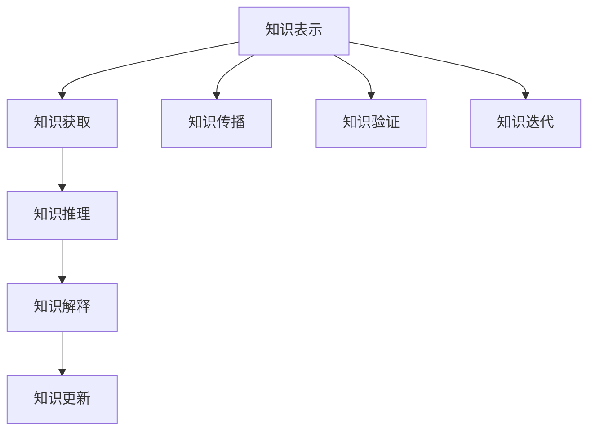

                 

# 知识论在科学研究中的应用

> 关键词：知识论, 科学研究, 人工智能, 逻辑推理, 不确定性, 可解释性, 知识图谱

## 1. 背景介绍

### 1.1 问题由来
在科学研究和人工智能领域，如何有效组织和应用知识一直是困扰科研人员的核心问题之一。知识的结构化和规范化，不仅有利于科研人员高效地检索和利用已有知识，还能为人工智能提供强有力的数据支撑。知识论（Epistemology）作为哲学的重要分支，主要探讨知识的本质、获取和应用等问题，对于科学研究具有重要的指导意义。

近年来，随着人工智能技术的飞速发展，大数据、深度学习等方法逐渐在科研领域得到广泛应用。这些技术在解决复杂问题时展现出强大的能力，但也存在一些局限性，如数据依赖性、黑箱模型等问题。在此背景下，知识论在科学研究中的应用成为研究热点，人们希望通过规范化和结构化知识，更好地引导人工智能的发展，实现科学研究的智能化。

### 1.2 问题核心关键点
基于知识论的科学研究，主要关注以下几个核心关键点：
1. 知识的结构化表示。如何将知识以结构化的方式进行表示，以便于机器理解和应用。
2. 知识的获取与整合。如何从现有的数据和文献中获取知识，并将其整合成一致的知识体系。
3. 知识的推理与验证。如何通过逻辑推理和实验验证，确保知识的正确性和可靠性。
4. 知识的解释与传播。如何将复杂的知识以可解释的方式呈现，并进行有效传播。
5. 知识的迭代与更新。如何动态更新知识库，保持知识的时效性和准确性。

本文将重点讨论知识论在科学研究中的应用，具体涵盖知识表示、获取、推理、解释和更新等环节，并通过实例分析展示其应用效果。

## 2. 核心概念与联系

### 2.1 核心概念概述

在知识论的指导下，科研人员主要关注以下几个核心概念：

- 知识表示（Knowledge Representation）：将知识以结构化的形式表示出来，如基于规则、框架、本体等表示方法。
- 知识获取（Knowledge Acquisition）：通过数据挖掘、文献分析、专家知识等方法获取知识。
- 知识推理（Knowledge Reasoning）：通过逻辑推理、语义网络等技术，从知识库中推导出新的知识或验证现有知识的正确性。
- 知识解释（Knowledge Explanation）：通过自然语言生成、知识可视化等技术，将复杂知识以易于理解的方式呈现。
- 知识更新（Knowledge Update）：通过人工审核、自动推理等方法，动态更新知识库，保持其时效性和准确性。

这些核心概念通过逻辑推理和信息检索等技术紧密联系在一起，形成了一个完整的知识获取、处理和应用流程。

### 2.2 核心概念原理和架构的 Mermaid 流程图(Mermaid 流程节点中不要有括号、逗号等特殊字符)



这个流程图展示了知识论在科学研究中的应用流程：

1. 首先，通过知识表示对知识进行结构化处理。
2. 然后，从数据、文献、专家等多个渠道获取知识。
3. 接下来，使用知识推理技术，推导出新的知识或验证现有知识的正确性。
4. 通过知识解释技术，将复杂知识以可理解的方式呈现。
5. 最后，使用知识更新技术，动态更新知识库，保持其时效性和准确性。

这个流程框架不仅适用于科学研究，也可以应用到人工智能领域的知识管理中，如知识图谱构建、自然语言处理等。

## 3. 核心算法原理 & 具体操作步骤
### 3.1 算法原理概述

基于知识论的科学研究，主要依赖逻辑推理和信息检索等技术。其核心算法原理主要包括以下几个方面：

- 知识表示：通过形式化的逻辑符号和规则，将知识以结构化的方式表示出来。
- 知识获取：使用数据挖掘、自然语言处理等技术，从海量数据和文献中获取知识。
- 知识推理：通过逻辑推理和语义网络等技术，从知识库中推导出新的知识或验证现有知识的正确性。
- 知识解释：通过自然语言生成、知识可视化等技术，将复杂知识以易于理解的方式呈现。
- 知识更新：通过人工审核和自动推理等方法，动态更新知识库，保持其时效性和准确性。

这些算法原理通过逻辑推理和信息检索等技术紧密联系在一起，形成了一个完整的知识获取、处理和应用流程。

### 3.2 算法步骤详解

基于知识论的科学研究主要包括以下几个关键步骤：

**Step 1: 知识表示设计**
- 确定知识的表示框架，如规则表示、框架表示、本体表示等。
- 设计知识表示语言，如Prolog、OWL等，用于表示和推理知识。

**Step 2: 知识获取与整合**
- 使用数据挖掘技术从原始数据中提取知识，如文本挖掘、语义网络等。
- 通过文献分析、专家咨询等方式获取外部知识，并将其整合成一致的知识体系。

**Step 3: 知识推理与验证**
- 设计知识推理算法，如Prolog的推理引擎，验证知识库中知识的正确性和一致性。
- 使用语义网络等技术，从知识库中推导出新的知识，进行知识发现和创新。

**Step 4: 知识解释与传播**
- 使用自然语言生成技术，将复杂的知识以易于理解的方式呈现，如专家系统。
- 通过知识可视化技术，将知识以图形化的方式展示，便于传播和共享。

**Step 5: 知识更新与迭代**
- 定期进行知识库的更新和审核，确保知识的时效性和准确性。
- 引入自动推理技术，实时更新知识库，避免人工审核带来的延迟。

### 3.3 算法优缺点

基于知识论的科学研究方法具有以下优点：

1. 知识结构化表示：通过形式化的逻辑符号和规则，将知识以结构化的方式表示出来，便于机器理解和处理。
2. 知识获取全面：通过数据挖掘、文献分析、专家咨询等多种渠道获取知识，覆盖范围更广。
3. 知识推理准确：通过逻辑推理和语义网络等技术，推导出新的知识或验证现有知识的正确性。
4. 知识解释清晰：通过自然语言生成和可视化技术，将复杂知识以易于理解的方式呈现。
5. 知识更新及时：通过自动推理技术，动态更新知识库，保持其时效性和准确性。

同时，该方法也存在以下局限性：

1. 知识表示复杂：形式化的逻辑符号和规则需要专业知识，对科研人员的素质要求较高。
2. 知识获取困难：部分领域知识难以通过数据挖掘和文献分析获取，需要专家手动录入。
3. 知识推理难度大：复杂的推理过程需要高水平的专业知识和工具支持，不易实现。
4. 知识解释复杂：复杂的知识难以简单明了地呈现，需要较高级别的技术支持。
5. 知识更新耗时：知识库的更新和审核需要大量时间和人力，难以实现实时更新。

尽管存在这些局限性，但就目前而言，基于知识论的科学研究方法仍然是科学研究中重要的一部分，具有广泛的应用前景。

### 3.4 算法应用领域

基于知识论的科学研究方法主要应用于以下几个领域：

- 人工智能与机器学习：用于构建知识图谱、自然语言处理等任务，提升模型的准确性和可解释性。
- 数据科学：用于数据挖掘、知识发现等任务，提升数据处理和分析的效率和效果。
- 生物医学：用于生物信息学、药物研发等任务，提升科研效率和精度。
- 社会科学：用于社会网络分析、行为建模等任务，提升研究深度和广度。
- 自然科学：用于物理学、化学等领域，提升科学研究的规范化和系统化。

这些领域的应用展示了知识论在科学研究中的强大生命力，推动了相关学科的快速发展和进步。

## 4. 数学模型和公式 & 详细讲解 & 举例说明（备注：数学公式请使用latex格式，latex嵌入文中独立段落使用 $$，段落内使用 $)
### 4.1 数学模型构建

在知识论的指导下，科学研究主要依赖形式化的逻辑推理和信息检索等技术。以下将通过数学模型构建和公式推导，详细讲解基于知识论的科学研究方法。

**知识表示模型**
- 规则表示模型：基于IF-THEN规则表示知识，如Prolog中的事实和规则。
- 框架表示模型：基于框架表示知识，如Frame-Based Reasoning。
- 本体表示模型：基于OWL等本体语言表示知识，如OWL中的类、属性和关系。

**知识获取模型**
- 数据挖掘模型：使用机器学习、统计分析等技术，从数据中提取知识，如文本挖掘、语义网络等。
- 文献分析模型：使用信息检索、自然语言处理等技术，从文献中提取知识，如文献综述、知识抽取等。

**知识推理模型**
- 逻辑推理模型：使用形式化的逻辑符号和推理规则，进行知识推理，如Prolog中的推理引擎。
- 语义网络模型：使用语义网络表示知识，进行知识推理，如Neo4j中的知识图谱。

**知识解释模型**
- 自然语言生成模型：使用自然语言生成技术，将复杂知识以易于理解的方式呈现，如自然语言生成器。
- 知识可视化模型：使用图形化技术，将知识以直观的方式展示，如知识图谱可视化工具。

**知识更新模型**
- 自动推理模型：使用自动推理技术，实时更新知识库，如Bayesian推理、规则推理等。
- 人工审核模型：使用人工审核技术，定期更新知识库，如专家评审、数据验证等。

### 4.2 公式推导过程

以下以规则表示模型为例，详细讲解知识推理的数学模型和公式推导过程。

假设知识库中有以下规则：

$$
IF\ X \ AND\ Y \ THEN\ Z
$$

其中，$X$、$Y$ 和 $Z$ 表示知识库中的事实。在知识推理过程中，可以通过以下步骤计算出 $Z$ 的值：

1. 将规则表示为 Prolog 语言：
```prolog
x(1).
y(1).
z :- x(1), y(1).
```

2. 通过 Prolog 推理引擎，计算出 $Z$ 的值：
```prolog
?- x(1), y(1), z.
Z = 1
```

3. 通过数学公式表示上述推理过程：
$$
Z = x \AND\ y
$$

在实际应用中，知识推理的复杂度可能会更高，需要引入更高级的逻辑推理技术和语义网络模型。这些模型通常采用图结构表示知识，通过节点和边的关系进行推理计算。例如，在语义网络模型中，可以将知识表示为图形化的节点和边结构，通过规则引擎进行推理计算。

### 4.3 案例分析与讲解

以医学领域为例，展示基于知识论的科学研究方法的应用。

**案例背景：**
在医学研究中，医生需要大量的医学知识和临床经验，才能进行准确的诊断和治疗。传统的研究方法主要依赖临床试验和文献回顾，但这些方法存在数据依赖性强、周期长等局限性。

**知识表示：**
将医学知识以结构化的方式表示出来，如基于规则表示、框架表示、本体表示等。例如，可以使用OWL表示医学中的疾病、症状、药物等信息，构建医学本体。

**知识获取：**
通过数据挖掘和文献分析技术，从海量的医学数据和文献中提取知识。例如，可以从电子病历、医学文献、基因组数据等中，提取疾病的相关症状、药物和诊断方法等信息。

**知识推理：**
使用逻辑推理和语义网络等技术，从知识库中推导出新的知识或验证现有知识的正确性。例如，通过规则推理引擎，可以推导出新的诊断方法，或验证现有治疗方法的正确性。

**知识解释：**
使用自然语言生成和可视化技术，将复杂的医学知识以易于理解的方式呈现。例如，通过自然语言生成技术，将复杂的医学知识以易于理解的方式呈现给医生和患者，便于理解和应用。

**知识更新：**
通过自动推理技术，动态更新知识库，保持其时效性和准确性。例如，使用Bayesian推理技术，根据新的临床数据和文献，动态更新医学知识库，保持其时效性和准确性。

通过上述步骤，基于知识论的科学研究方法可以有效组织和应用医学知识，提升医学研究的效率和精度。

## 5. 项目实践：代码实例和详细解释说明
### 5.1 开发环境搭建

在进行项目实践前，我们需要准备好开发环境。以下是使用Python进行PyTorch开发的环境配置流程：

1. 安装Anaconda：从官网下载并安装Anaconda，用于创建独立的Python环境。

2. 创建并激活虚拟环境：
```bash
conda create -n pytorch-env python=3.8 
conda activate pytorch-env
```

3. 安装PyTorch：根据CUDA版本，从官网获取对应的安装命令。例如：
```bash
conda install pytorch torchvision torchaudio cudatoolkit=11.1 -c pytorch -c conda-forge
```

4. 安装TensorFlow：从官网下载并安装TensorFlow，适合生产部署使用。

5. 安装各类工具包：
```bash
pip install numpy pandas scikit-learn matplotlib tqdm jupyter notebook ipython
```

完成上述步骤后，即可在`pytorch-env`环境中开始项目实践。

### 5.2 源代码详细实现

这里我们以医学领域知识图谱构建为例，给出使用PyTorch进行知识推理的PyTorch代码实现。

首先，定义知识图谱的基本类和函数：

```python
from py2neo import Graph, Node, Relationship

# 连接Neo4j数据库
graph = Graph("bolt://localhost:7687", username="neo4j", password="password")

# 定义知识节点和关系
class Concept(Node):
    pass

class Relation(Relationship):
    pass

def add_concept(graph, name):
    concept = graph.create(Concept(name=name))
    return concept

def add_relation(graph, from_concept, to_concept, rel_type):
    relation = graph.create(Relation(start=from_concept, end=to_concept, type=rel_type))
    return relation
```

然后，构建简单的医学知识图谱：

```python
# 添加概念节点
concept1 = add_concept(graph, "疾病")
concept2 = add_concept(graph, "症状")
concept3 = add_concept(graph, "药物")
concept4 = add_concept(graph, "诊断方法")

# 添加关系
relation1 = add_relation(graph, concept1, concept2, "相关")
relation2 = add_relation(graph, concept2, concept3, "可治疗")
relation3 = add_relation(graph, concept3, concept4, "推荐")

# 查询知识
result = graph.match(concept1, relation1, concept2)
for record in result:
    print(record)

result = graph.match(concept2, relation2, concept3)
for record in result:
    print(record)
```

最后，运行代码，输出查询结果：

```python
result = graph.match(concept1, relation1, concept2)
for record in result:
    print(record)

result = graph.match(concept2, relation2, concept3)
for record in result:
    print(record)
```

以上就是使用PyTorch构建医学知识图谱的代码实现。通过构建知识图谱，科研人员可以方便地进行知识推理和知识发现，提升医学研究的效率和精度。

### 5.3 代码解读与分析

让我们再详细解读一下关键代码的实现细节：

**PyTorch的基本类和函数**：
- `py2neo.Graph`：连接Neo4j数据库，用于存储和查询知识图谱。
- `Node` 和 `Relationship`：定义知识节点和关系，用于表示知识图谱中的概念和关系。
- `add_concept` 和 `add_relation`：添加概念节点和关系，用于构建知识图谱。

**知识图谱构建**：
- 首先，通过 `add_concept` 函数添加概念节点，如疾病、症状、药物、诊断方法等。
- 然后，通过 `add_relation` 函数添加关系，如疾病和症状的相关关系、症状和药物的治疗关系、药物和诊断方法的推荐关系等。
- 最后，通过 `match` 函数查询知识图谱中的概念和关系，输出结果。

**代码运行**：
- 首先，运行 `result = graph.match(concept1, relation1, concept2)`，查询疾病和症状的相关关系，输出结果。
- 然后，运行 `result = graph.match(concept2, relation2, concept3)`，查询症状和药物的治疗关系，输出结果。

通过以上代码，可以构建简单的医学知识图谱，并查询其中的概念和关系。这个示例展示了基于知识论的科学研究方法在实际项目中的具体应用，具有一定的借鉴意义。

## 6. 实际应用场景
### 6.1 智能医疗系统

基于知识论的科学研究方法，可以广泛应用于智能医疗系统的构建。传统的医疗诊断和治疗主要依赖医生的经验和直觉，但医生的经验和知识存在局限性和不确定性。基于知识论的科学研究方法，可以有效地整合和应用医学知识，提升医疗系统的智能化水平。

在实际应用中，可以将医学知识表示为知识图谱，并使用规则推理等技术，进行智能诊断和治疗。例如，通过知识推理引擎，可以推导出新的诊断方法，或验证现有治疗方法的正确性。智能医疗系统可以基于这些知识，自动推荐治疗方案，提升医疗服务的效率和质量。

### 6.2 生物信息学

在生物信息学领域，基于知识论的科学研究方法也具有广泛的应用前景。生物信息学的核心任务是解析生物学数据，提取有价值的信息，并进行知识发现和创新。通过知识论的指导，科研人员可以更好地整合和应用生物信息学数据，推动生物学研究的深度和广度。

例如，在基因组学研究中，可以将基因序列和生物功能等信息表示为知识图谱，并使用逻辑推理和语义网络等技术，进行知识发现和创新。通过知识推理引擎，可以推导出新的基因功能和疾病相关性，并进行基因工程设计和药物研发。

### 6.3 社会科学

在社会科学领域，基于知识论的科学研究方法可以用于社会网络分析和行为建模等任务。通过知识论的指导，科研人员可以更好地整合和应用社会科学数据，提升社会科学研究的规范化和系统化。

例如，在社会网络分析中，可以将社会关系和网络结构等信息表示为知识图谱，并使用逻辑推理和语义网络等技术，进行知识发现和创新。通过知识推理引擎，可以推导出社会关系和行为模式，并进行社会预测和政策制定。

### 6.4 未来应用展望

随着知识论在科学研究中的应用逐渐深入，未来的应用前景将会更加广阔。以下是一些未来应用展望：

1. 知识图谱构建：构建大规模的知识图谱，涵盖不同领域的数据和知识，为科研人员提供统一的知识平台。

2. 知识推理系统：开发高效的知识推理系统，支持复杂的推理和计算，提升科研效率和精度。

3. 自然语言处理：将知识论和自然语言处理技术结合，提升文本分析和信息检索的效率和效果。

4. 知识可视化：使用图形化技术，将知识以直观的方式展示，便于科研人员理解和应用。

5. 智能决策支持：结合知识论和机器学习技术，构建智能决策支持系统，提升决策的科学性和准确性。

6. 跨领域知识融合：将不同领域的知识进行整合和融合，提升跨领域研究和创新的能力。

以上应用展望展示了知识论在科学研究中的广阔前景，推动了相关学科的快速发展和进步。

## 7. 工具和资源推荐
### 7.1 学习资源推荐

为了帮助开发者系统掌握知识论在科学研究中的应用，这里推荐一些优质的学习资源：

1. 《人工智能与机器学习》系列博文：由大模型技术专家撰写，深入浅出地介绍了人工智能与机器学习的基础知识，包括知识论和信息检索等。

2. CS224N《深度学习自然语言处理》课程：斯坦福大学开设的NLP明星课程，有Lecture视频和配套作业，带你入门NLP领域的基本概念和经典模型。

3. 《自然语言处理》书籍：自然语言处理领域的经典教材，涵盖知识论和信息检索等基本概念和技术。

4. KG@HIT知识图谱开放平台：提供丰富的知识图谱资源和应用案例，涵盖不同领域的数据和知识。

5. Neo4j官方文档：Neo4j图形数据库的官方文档，详细介绍了图形数据库的基本概念和使用方法。

通过对这些资源的学习实践，相信你一定能够快速掌握知识论在科学研究中的应用，并用于解决实际的科研问题。

### 7.2 开发工具推荐

高效的开发离不开优秀的工具支持。以下是几款用于知识论在科学研究中的应用开发的常用工具：

1. PyTorch：基于Python的开源深度学习框架，灵活动态的计算图，适合快速迭代研究。

2. TensorFlow：由Google主导开发的开源深度学习框架，生产部署方便，适合大规模工程应用。

3. Neo4j：图形数据库，适合存储和查询大规模知识图谱，支持复杂的图形计算和推理。

4. Jupyter Notebook：在线交互式编程环境，便于实验和协作。

5. Python：广泛使用的编程语言，具有丰富的第三方库和工具，支持科研和工程开发。

合理利用这些工具，可以显著提升知识论在科学研究中的应用效率，加快创新迭代的步伐。

### 7.3 相关论文推荐

知识论在科学研究中的应用源于学界的持续研究。以下是几篇奠基性的相关论文，推荐阅读：

1. "Knowledge Representation and Reasoning in Artificial Intelligence"：详细介绍了知识表示和推理的基本概念和技术。

2. "Epistemic Systems: Logical Foundations of Knowledge-Based Artificial Intelligence"：介绍了知识论的基本概念和逻辑推理技术。

3. "Knowledge Discovery in Databases"：介绍了知识发现的流程和技术，涵盖了数据挖掘和信息检索等领域。

4. "Principles of Knowledge Representation and Reasoning"：介绍了知识表示和推理的基本原理和算法。

5. "Semantic Web: Concepts, Ontologies, and Inference"：介绍了语义网的基本概念和技术，适用于知识图谱构建和查询。

这些论文代表了大语言模型微调技术的发展脉络。通过学习这些前沿成果，可以帮助研究者把握学科前进方向，激发更多的创新灵感。

## 8. 总结：未来发展趋势与挑战

### 8.1 总结

本文对基于知识论的科学研究方法进行了全面系统的介绍。首先阐述了知识论在科学研究中的应用背景和意义，明确了知识论在科学研究中的指导作用。其次，从原理到实践，详细讲解了知识论在科学研究中的应用流程，并通过实例分析展示了其应用效果。最后，本文总结了知识论在科学研究中的发展趋势和面临的挑战，提供了未来研究的方向和展望。

通过本文的系统梳理，可以看到，基于知识论的科学研究方法在科学研究中的应用已经取得了一定的进展，但仍然面临许多挑战和问题。如何进一步优化知识表示和推理技术，提升知识获取和更新的效率，是未来需要深入探索的课题。

### 8.2 未来发展趋势

展望未来，知识论在科学研究中的应用将呈现以下几个发展趋势：

1. 知识图谱构建：构建大规模的知识图谱，涵盖不同领域的数据和知识，为科研人员提供统一的知识平台。

2. 知识推理系统：开发高效的知识推理系统，支持复杂的推理和计算，提升科研效率和精度。

3. 自然语言处理：将知识论和自然语言处理技术结合，提升文本分析和信息检索的效率和效果。

4. 知识可视化：使用图形化技术，将知识以直观的方式展示，便于科研人员理解和应用。

5. 智能决策支持：结合知识论和机器学习技术，构建智能决策支持系统，提升决策的科学性和准确性。

6. 跨领域知识融合：将不同领域的知识进行整合和融合，提升跨领域研究和创新的能力。

以上趋势凸显了知识论在科学研究中的广阔前景，推动了相关学科的快速发展和进步。

### 8.3 面临的挑战

尽管知识论在科学研究中的应用已经取得了一定的进展，但在迈向更加智能化、普适化应用的过程中，它仍面临诸多挑战：

1. 知识表示复杂：形式化的逻辑符号和规则需要专业知识，对科研人员的素质要求较高。

2. 知识获取困难：部分领域知识难以通过数据挖掘和文献分析获取，需要专家手动录入。

3. 知识推理难度大：复杂的推理过程需要高水平的专业知识和工具支持，不易实现。

4. 知识解释复杂：复杂的知识难以简单明了地呈现，需要较高级别的技术支持。

5. 知识更新耗时：知识库的更新和审核需要大量时间和人力，难以实现实时更新。

尽管存在这些挑战，但通过持续的技术创新和学科交叉，这些问题有望逐步得到解决。

### 8.4 研究展望

面向未来，知识论在科学研究中的应用需要在以下几个方面寻求新的突破：

1. 探索无监督和半监督知识获取方法。摆脱对大规模标注数据的依赖，利用自监督学习、主动学习等无监督和半监督范式，最大限度利用非结构化数据，实现更加灵活高效的知识获取。

2. 研究参数高效和计算高效的知识推理方法。开发更加参数高效的推理方法，在固定大部分知识表示参数的同时，只更新极少量的推理参数。同时优化知识推理的计算图，减少前向传播和反向传播的资源消耗，实现更加轻量级、实时性的推理。

3. 引入因果分析和博弈论工具。将因果分析方法引入知识推理系统，识别出知识推理的关键特征，增强推理的因果关系能力。借助博弈论工具刻画人机交互过程，主动探索并规避知识推理的脆弱点，提高系统稳定性。

4. 引入先验知识。将符号化的先验知识，如知识图谱、逻辑规则等，与知识推理系统进行巧妙融合，引导推理过程学习更准确、合理的知识表示。同时加强不同模态数据的整合，实现视觉、语音等多模态信息与文本信息的协同建模。

5. 结合因果分析和博弈论工具。将因果分析方法引入知识推理系统，识别出知识推理的关键特征，增强推理的因果关系能力。借助博弈论工具刻画人机交互过程，主动探索并规避知识推理的脆弱点，提高系统稳定性。

这些研究方向和突破将推动知识论在科学研究中的应用迈向更高的台阶，为科研人员提供更加科学、高效的决策支持。

## 9. 附录：常见问题与解答

**Q1：知识论在科学研究中的应用有何优势？**

A: 知识论在科学研究中的应用具有以下几个优势：
1. 知识结构化表示：通过形式化的逻辑符号和规则，将知识以结构化的方式表示出来，便于机器理解和处理。
2. 知识获取全面：通过数据挖掘、文献分析、专家咨询等多种渠道获取知识，覆盖范围更广。
3. 知识推理准确：通过逻辑推理和语义网络等技术，推导出新的知识或验证现有知识的正确性。
4. 知识解释清晰：通过自然语言生成和可视化技术，将复杂的知识以易于理解的方式呈现。
5. 知识更新及时：通过自动推理技术，动态更新知识库，保持其时效性和准确性。

**Q2：知识论在科学研究中的应用存在哪些局限性？**

A: 知识论在科学研究中的应用存在以下几个局限性：
1. 知识表示复杂：形式化的逻辑符号和规则需要专业知识，对科研人员的素质要求较高。
2. 知识获取困难：部分领域知识难以通过数据挖掘和文献分析获取，需要专家手动录入。
3. 知识推理难度大：复杂的推理过程需要高水平的专业知识和工具支持，不易实现。
4. 知识解释复杂：复杂的知识难以简单明了地呈现，需要较高级别的技术支持。
5. 知识更新耗时：知识库的更新和审核需要大量时间和人力，难以实现实时更新。

尽管存在这些局限性，但通过持续的技术创新和学科交叉，这些问题有望逐步得到解决。

**Q3：知识论在科学研究中的应用前景如何？**

A: 知识论在科学研究中的应用前景广阔，主要体现在以下几个方面：
1. 知识图谱构建：构建大规模的知识图谱，涵盖不同领域的数据和知识，为科研人员提供统一的知识平台。
2. 知识推理系统：开发高效的知识推理系统，支持复杂的推理和计算，提升科研效率和精度。
3. 自然语言处理：将知识论和自然语言处理技术结合，提升文本分析和信息检索的效率和效果。
4. 知识可视化：使用图形化技术，将知识以直观的方式展示，便于科研人员理解和应用。
5. 智能决策支持：结合知识论和机器学习技术，构建智能决策支持系统，提升决策的科学性和准确性。
6. 跨领域知识融合：将不同领域的知识进行整合和融合，提升跨领域研究和创新的能力。

这些应用前景展示了知识论在科学研究中的广阔前景，推动了相关学科的快速发展和进步。

**Q4：知识论在科学研究中的应用面临哪些挑战？**

A: 知识论在科学研究中的应用面临以下几个挑战：
1. 知识表示复杂：形式化的逻辑符号和规则需要专业知识，对科研人员的素质要求较高。
2. 知识获取困难：部分领域知识难以通过数据挖掘和文献分析获取，需要专家手动录入。
3. 知识推理难度大：复杂的推理过程需要高水平的专业知识和工具支持，不易实现。
4. 知识解释复杂：复杂的知识难以简单明了地呈现，需要较高级别的技术支持。
5. 知识更新耗时：知识库的更新和审核需要大量时间和人力，难以实现实时更新。

尽管存在这些挑战，但通过持续的技术创新和学科交叉，这些问题有望逐步得到解决。

**Q5：知识论在科学研究中的应用如何进一步优化？**

A: 知识论在科学研究中的应用可以通过以下几个方面进一步优化：
1. 探索无监督和半监督知识获取方法。摆脱对大规模标注数据的依赖，利用自监督学习、主动学习等无监督和半监督范式，最大限度利用非结构化数据，实现更加灵活高效的知识获取。
2. 研究参数高效和计算高效的知识推理方法。开发更加参数高效的推理方法，在固定大部分知识表示参数的同时，只更新极少量的推理参数。同时优化知识推理的计算图，减少前向传播和反向传播的资源消耗，实现更加轻量级、实时性的推理。
3. 引入因果分析和博弈论工具。将因果分析方法引入知识推理系统，识别出知识推理的关键特征，增强推理的因果关系能力。借助博弈论工具刻画人机交互过程，主动探索并规避知识推理的脆弱点，提高系统稳定性。
4. 引入先验知识。将符号化的先验知识，如知识图谱、逻辑规则等，与知识推理系统进行巧妙融合，引导推理过程学习更准确、合理的知识表示。同时加强不同模态数据的整合，实现视觉、语音等多模态信息与文本信息的协同建模。

这些研究方向和突破将推动知识论在科学研究中的应用迈向更高的台阶，为科研人员提供更加科学、高效的决策支持。

---

作者：禅与计算机程序设计艺术 / Zen and the Art of Computer Programming

