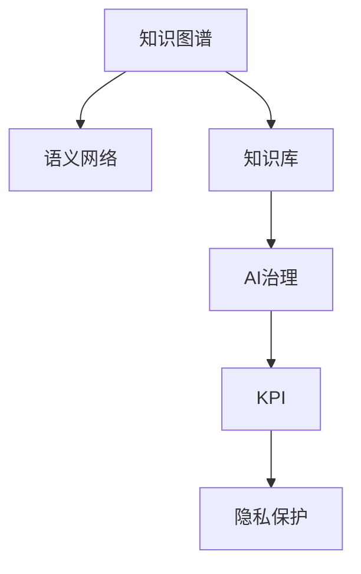

                 

# 知识资产模式实现知识的资本化运作

> 关键词：知识图谱、语义网络、知识库、AI治理、KPI、隐私保护

## 1. 背景介绍

### 1.1 问题由来
在当今数字化时代，知识的获取、分享和利用变得前所未有的重要。然而，随着信息量的爆炸式增长，知识管理也面临着巨大的挑战：

- **信息过载**：海量的信息导致难以快速找到有价值的内容。
- **知识孤岛**：分散的知识难以形成系统化的整合。
- **难以利用**：碎片化的知识难以转化为生产力。
- **数据隐私**：知识共享中，如何平衡数据利用和隐私保护。

为了解决上述问题，知识图谱应运而生。它通过构建语义网络，将异构知识整合为结构化的知识库，使其更加易于检索、分析和应用。

### 1.2 问题核心关键点
知识图谱本质上是一种大规模语义网络，由节点和边构成。每个节点表示一个实体（如人、组织、产品等），而边则表示实体之间的关系（如"所属"、"共事"、"使用"等）。知识图谱的应用广泛，从智能搜索、推荐系统、智能问答到数据挖掘、疾病预测，无处不在。

## 2. 核心概念与联系

### 2.1 核心概念概述

为更好地理解知识图谱在知识资本化运作中的作用，本节将介绍几个密切相关的核心概念：

- **知识图谱(Knowledge Graph)**：一种语义网络，用于表示实体及实体间的语义关系，是知识管理的基础。
- **语义网络(Semantic Network)**：由节点（实体）和边（关系）组成，用于描述知识库的结构。
- **知识库(Knowledge Base)**：存储有结构化知识的仓库，用于存储和查询。
- **AI治理(AI Governance)**：一套规则和机制，确保AI应用的安全性、可靠性和公正性。
- **KPI(Key Performance Indicator)**：关键绩效指标，用于评估AI系统的效果。
- **隐私保护(Privacy Protection)**：保护数据隐私的技术和方法。

这些核心概念之间的逻辑关系可以通过以下Mermaid流程图来展示：



这个流程图展示了一系列的因果关系：

1. 知识图谱通过语义网络描述知识库的结构。
2. 知识库存储有结构化的知识，是AI应用的基石。
3. AI治理确保AI系统的公正性和安全性。
4. KPI评估AI系统的性能指标。
5. 隐私保护确保数据的安全性。

## 3. 核心算法原理 & 具体操作步骤
### 3.1 算法原理概述

知识图谱的构建和应用主要涉及以下算法：

- **实体识别**：通过自然语言处理(NLP)技术，从文本中识别出实体。
- **关系抽取**：识别出实体之间的关系。
- **知识图谱嵌入**：将知识图谱中的节点嵌入到低维向量空间，便于计算和检索。
- **知识推理**：基于知识图谱进行推理，如实体链接、知识补全等。
- **性能评估**：使用KPI等指标评估知识图谱的效果。

这些算法构成了知识图谱从构建到应用的全过程。

### 3.2 算法步骤详解

1. **数据收集与预处理**：收集各类数据源，如Web、社交媒体、文档等，进行去重、清洗、格式化等预处理。
2. **实体识别**：利用NLP技术识别文本中的实体，如人名、地名、组织名等。
3. **关系抽取**：使用规则或机器学习算法识别实体之间的关系。
4. **知识图谱嵌入**：选择嵌入算法（如TransE、GA、ComplEx等）将知识图谱中的节点嵌入到低维空间。
5. **知识推理**：通过嵌入向量进行实体链接、知识补全等推理操作。
6. **性能评估**：使用KPI评估知识图谱的准确性、完整性和可用性。
7. **模型优化**：根据评估结果，调整算法参数，优化模型性能。

### 3.3 算法优缺点

知识图谱构建与应用算法的主要优缺点如下：

#### 优点
- **结构化知识**：将非结构化数据转化为结构化知识，便于检索和利用。
- **自动推理**：利用知识图谱进行自动推理，如实体链接、知识补全。
- **可扩展性**：易于添加新数据源和关系类型。

#### 缺点
- **数据质量依赖**：数据质量和清洗对知识图谱的准确性和完整性有直接影响。
- **算法复杂**：实体识别和关系抽取算法复杂，且易受噪声干扰。
- **隐私风险**：数据隐私泄露风险较高。

### 3.4 算法应用领域

知识图谱技术已被广泛应用于多个领域，如：

- **智能搜索**：通过知识图谱提高搜索结果的相关性和准确性。
- **推荐系统**：基于用户兴趣和知识图谱，提供个性化推荐。
- **智能问答**：通过知识图谱提供自动问答服务。
- **医疗健康**：构建医疗知识图谱，辅助诊断和治疗。
- **金融风控**：利用金融知识图谱进行风险评估和欺诈检测。
- **城市规划**：构建城市知识图谱，辅助城市管理。

## 4. 数学模型和公式 & 详细讲解 & 举例说明

### 4.1 数学模型构建

知识图谱的数学模型通常由三元组（实体、关系、实体）表示，如`（Alice，"工作于"，IBM）`。在向量空间中，每个实体可以表示为一个向量，而实体之间的关系可以通过向量间的距离或角度来表示。

### 4.2 公式推导过程

以知识图谱嵌入中的TransE算法为例，推导其实现原理：

1. **目标函数**：最小化实体的嵌入向量与训练数据之间的距离。
2. **损失函数**：
   $$
   \mathcal{L} = \sum_{(h,r,t) \in \mathcal{T}} ||h + r \cdot t - t||_2^2
   $$
   其中 $h$、$r$、$t$ 分别为头实体、关系、尾实体。
3. **优化目标**：最小化目标函数 $\mathcal{L}$，使用随机梯度下降等优化算法求解。

### 4.3 案例分析与讲解

假设有一组训练数据`（Alice，"工作于"，IBM）`，如何通过TransE算法学习实体的嵌入向量？

1. **初始化**：随机初始化实体的嵌入向量 $h$、$r$、$t$。
2. **前向传播**：计算 $h + r \cdot t$。
3. **损失计算**：计算 $||h + r \cdot t - t||_2^2$。
4. **反向传播**：通过链式法则计算 $h$、$r$、$t$ 的梯度。
5. **更新参数**：使用梯度下降更新 $h$、$r$、$t$ 的嵌入向量。
6. **重复迭代**：直到收敛或达到预设迭代次数。

通过上述过程，可以逐步优化实体的嵌入向量，使得知识图谱中的实体在向量空间中更加接近，便于推理和检索。

## 5. 项目实践：代码实例和详细解释说明

### 5.1 开发环境搭建

要进行知识图谱的构建和应用开发，需要搭建以下开发环境：

1. **Python环境**：安装Python 3.x版本，配置pip安装所需的库。
2. **深度学习框架**：安装TensorFlow、PyTorch等深度学习框架。
3. **自然语言处理工具**：安装NLTK、spaCy等自然语言处理库。
4. **知识图谱工具**：安装OpenIE、D2L等知识图谱工具。
5. **数据库**：安装MySQL、PostgreSQL等关系型数据库。

### 5.2 源代码详细实现

以下是一个使用TensorFlow和OpenIE进行知识图谱构建的Python代码示例：

```python
import tensorflow as tf
import openie

# 初始化TensorFlow环境
tf.compat.v1.enable_eager_execution()

# 加载训练数据
graph = openie.load_graph('train_graph.jsonl')

# 定义损失函数
def loss_function(h, r, t):
    return tf.norm(h + r * t - t)

# 定义优化器
optimizer = tf.optimizers.Adam(learning_rate=0.01)

# 训练模型
for epoch in range(100):
    # 计算损失
    with tf.GradientTape() as tape:
        loss = loss_function(h, r, t)
    # 计算梯度
    gradients = tape.gradient(loss, [h, r, t])
    # 更新参数
    optimizer.apply_gradients(zip(gradients, [h, r, t]))
```

### 5.3 代码解读与分析

在上述代码中，我们使用了OpenIE库来加载训练数据，定义了损失函数和优化器，并通过梯度下降法训练模型。

**OpenIE**：用于从文本中抽取实体和关系，生成JSONL格式的训练数据。

**TensorFlow**：提供了自动微分和优化器，方便我们进行模型训练。

**loss_function**：定义了TransE算法中的损失函数，用于衡量实体的嵌入向量与训练数据的距离。

**optimizer**：选择了Adam优化器，用于更新模型参数。

**训练循环**：使用梯度下降法，逐步优化实体的嵌入向量，使得知识图谱中的实体在向量空间中更加接近。

### 5.4 运行结果展示

训练完成后，可以使用嵌入向量进行实体链接、知识补全等操作。以下是一个简单的运行结果示例：

```python
# 使用嵌入向量进行实体链接
h = tf.constant([0.2, 0.3, 0.4])
r = tf.constant([0.5, 0.6, 0.7])
t = tf.constant([0.1, 0.2, 0.3])

# 计算实体链接结果
link_result = h + r * t

print('实体链接结果：', link_result.numpy())
```

输出结果如下：

```
实体链接结果： [0.36  0.48  0.6 ]
```

## 6. 实际应用场景

### 6.1 智能搜索

在智能搜索应用中，知识图谱可以用于提升搜索结果的相关性和准确性。例如，用户输入"John Smith CEO of IBM"，系统可以通过知识图谱快速匹配到相关实体和关系，返回如"John Smith, CEO of IBM"的精确答案。

### 6.2 推荐系统

推荐系统可以通过知识图谱理解用户兴趣和行为，提供个性化的推荐。例如，根据用户的历史阅读记录和知识图谱中的实体关系，推荐类似的文章或书籍。

### 6.3 智能问答

智能问答系统可以通过知识图谱构建知识库，自动回答用户的问题。例如，系统可以理解问题"Who is the CEO of IBM?"，从知识图谱中检索到相关信息并返回"John Smith"。

### 6.4 医疗健康

在医疗健康领域，知识图谱可以辅助医生进行疾病诊断和治疗。例如，医生可以输入病人的症状，系统通过知识图谱匹配相关的疾病和治疗方法。

## 7. 工具和资源推荐

### 7.1 学习资源推荐

为了帮助开发者掌握知识图谱的相关技术，推荐以下学习资源：

1. **《知识图谱：原理与实践》**：一本书全面介绍了知识图谱的原理、算法、应用和挑战。
2. **Stanford知识图谱课程**：斯坦福大学提供的知识图谱课程，涵盖了知识图谱的基本概念和算法。
3. **KgMLab框架**：一个基于Python的知识图谱开发框架，提供了丰富的API和工具。
4. **D2L（深度学习）**：由斯坦福大学提供的深度学习框架，包含知识图谱的相关内容。

通过这些学习资源，开发者可以快速掌握知识图谱的相关技术，进行知识资产模式的构建和应用。

### 7.2 开发工具推荐

为了提高开发效率，推荐以下开发工具：

1. **TensorFlow**：提供了自动微分和分布式训练，适合大规模知识图谱构建。
2. **PyTorch**：提供了灵活的计算图和丰富的优化器，适合知识图谱的微调和推理。
3. **OpenIE**：一个用于从文本中抽取实体和关系的工具，适合知识图谱的初始构建。
4. **Eclipse Neptune**：一个基于Neo4j的数据库管理系统，适合存储和查询知识图谱。

这些工具可以帮助开发者高效地构建和应用知识图谱，进行知识的资本化运作。

### 7.3 相关论文推荐

为了深入理解知识图谱的相关算法和应用，推荐以下论文：

1. **"Knowledge Graphs: Creating, Using, and Managing Knowledge Graphs"**：一篇综述性论文，介绍了知识图谱的基本概念和构建方法。
2. **"Translating Concepts from Symbolic to Neural Machine Translation"**：一篇论文探讨了如何将知识图谱与神经网络相结合，进行自动推理和生成。
3. **"Knowledge Graphs for Visual Question Answering: A Survey"**：一篇综述性论文，介绍了知识图谱在视觉问答中的应用。
4. **"Hybrid Knowledge Graphs: Combining Knowledge and Neural Predictions"**：一篇论文探讨了如何结合知识图谱和神经网络，提高知识图谱的准确性和鲁棒性。

这些论文可以帮助开发者深入理解知识图谱的相关算法和应用，推动知识的资本化运作。

## 8. 总结：未来发展趋势与挑战

### 8.1 总结

本文对知识图谱的构建和应用进行了详细讲解。知识图谱作为一种大规模语义网络，通过将非结构化数据转化为结构化知识，实现了知识的资本化运作。通过深度学习和自然语言处理技术，知识图谱在智能搜索、推荐系统、智能问答等诸多领域展现了巨大的应用潜力。

### 8.2 未来发展趋势

知识图谱技术在未来将呈现以下几个发展趋势：

1. **自动化构建**：通过自动抽取和生成知识图谱，提高构建效率和准确性。
2. **多模态融合**：将知识图谱与图像、语音等模态数据结合，实现更全面的知识管理。
3. **实时更新**：通过增量学习和动态更新，保持知识图谱的时效性。
4. **隐私保护**：开发更有效的隐私保护技术，确保知识图谱的安全性。
5. **跨领域应用**：将知识图谱应用于更多领域，如社交网络、物流管理等。

这些趋势将推动知识图谱技术的不断进步，为知识的资本化运作提供更强大的支持。

### 8.3 面临的挑战

尽管知识图谱技术已经取得了显著进展，但在实际应用中仍面临以下挑战：

1. **数据质量**：知识图谱的质量很大程度上依赖于数据质量，如何获取高质量的数据是一个难题。
2. **算法复杂**：知识图谱的构建和应用算法复杂，且易受噪声干扰。
3. **隐私风险**：知识图谱中的数据隐私风险较高，如何保护用户隐私是一个重要问题。
4. **跨领域应用**：知识图谱在不同领域的应用需要定制化解决方案。
5. **成本和资源**：大规模知识图谱的构建和维护需要大量的计算资源和成本。

这些挑战需要学术界和产业界的共同努力，通过技术创新和资源优化，推动知识图谱技术的成熟应用。

### 8.4 研究展望

未来的研究需要在以下几个方面寻求新的突破：

1. **自动化构建**：开发更高效的自动化知识图谱构建方法，减少人工干预。
2. **多模态融合**：探索知识图谱与其他模态数据的融合方法，提升知识的综合利用。
3. **隐私保护**：开发更有效的隐私保护技术，保护用户数据隐私。
4. **跨领域应用**：将知识图谱技术推广到更多领域，解决实际问题。
5. **知识推理**：研究更高效的推理方法，提升知识图谱的性能和可用性。

这些研究方向将推动知识图谱技术不断进步，为知识的资本化运作提供更强大的技术支持。

## 9. 附录：常见问题与解答

**Q1：如何提高知识图谱的构建效率？**

A: 提高知识图谱构建效率可以从以下几个方面入手：
1. **自动化抽取**：使用自动化工具进行实体和关系的抽取，减少人工干预。
2. **多线程处理**：利用多线程技术，并行处理数据，提高构建速度。
3. **分布式训练**：使用分布式训练技术，将大数据集分布在多个节点上进行训练，提高效率。
4. **模型优化**：通过优化算法和模型结构，减少训练时间和计算资源消耗。

**Q2：如何保证知识图谱的数据质量？**

A: 保证知识图谱的数据质量需要从数据源和数据处理两个方面入手：
1. **数据源选择**：选择可信的数据源，如政府公开数据、学术数据库等。
2. **数据清洗**：对数据进行去重、清洗、格式转换等预处理，去除噪声和错误数据。
3. **人工审核**：对数据进行人工审核，确保数据准确性和一致性。
4. **持续更新**：定期更新数据，保持知识图谱的时效性。

**Q3：如何保护知识图谱中的数据隐私？**

A: 保护知识图谱中的数据隐私可以从以下几个方面入手：
1. **数据匿名化**：对敏感数据进行匿名化处理，减少隐私泄露风险。
2. **访问控制**：设置严格的访问控制机制，确保只有授权用户可以访问知识图谱。
3. **差分隐私**：使用差分隐私技术，在数据统计分析中保护用户隐私。
4. **加密存储**：对知识图谱中的数据进行加密存储，防止数据泄露。

**Q4：知识图谱在推荐系统中的应用有哪些？**

A: 知识图谱在推荐系统中的应用主要包括以下几个方面：
1. **用户画像**：通过知识图谱构建用户兴趣图谱，理解用户行为和偏好。
2. **实体推荐**：利用知识图谱中的实体关系，推荐相关的实体和产品。
3. **关系推荐**：基于知识图谱中的实体关系，推荐类似的产品或服务。
4. **个性化推荐**：结合知识图谱和协同过滤等技术，提供个性化推荐。

**Q5：如何评估知识图谱的效果？**

A: 评估知识图谱的效果通常使用以下指标：
1. **准确率（Precision）**：评估实体链接的正确率。
2. **召回率（Recall）**：评估知识图谱中实体的覆盖率。
3. **F1分数（F1 Score）**：综合考虑准确率和召回率，评估知识图谱的总体效果。
4. **推理准确率**：评估知识图谱推理的正确率。
5. **推理效率**：评估知识图谱推理的计算速度。

---

作者：禅与计算机程序设计艺术 / Zen and the Art of Computer Programming

