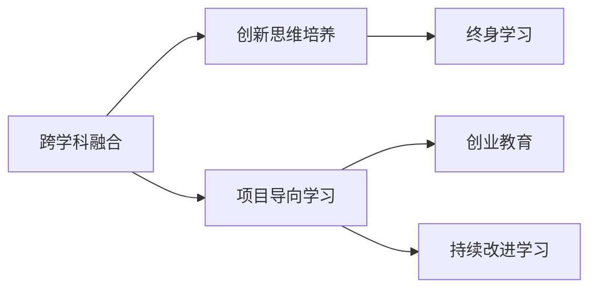

                 

# 硅谷教育改革:培养创新型人才

> 关键词：硅谷教育,创新人才培养,人工智能,计算机科学,未来教育

## 1. 背景介绍

在科技飞速发展的今天，教育改革已成为一个全球性的议题。教育不仅是知识传承的工具，更是培养创新型人才的摇篮。作为全球科技创新与创业的集大成者，硅谷的教育模式无疑值得深入研究。本文将重点介绍硅谷的教育改革经验，并探讨其对全球创新人才培养的启示。

### 1.1 问题由来

随着信息时代的来临，科技产业的竞争愈发激烈，创新型人才的需求日趋增加。然而，当前的教育体系往往偏重于传统知识传授，忽视了创新思维和实践能力的培养。为了应对这种挑战，硅谷通过一系列教育改革措施，致力于培养能够应对未来技术变革的人才。

### 1.2 问题核心关键点

硅谷的教育改革主要围绕以下几个核心关键点展开：

- **跨学科融合**：注重培养学生的跨学科知识，使其具备多角度思考问题的能力。
- **项目导向学习**：以实际项目为核心，通过做中学，提升学生的实践能力和解决问题的能力。
- **创新思维培养**：通过各种教育手段，激发学生的创新思维，鼓励其勇于尝试新事物。
- **创业教育**：支持学生创业，通过提供资源、资金、导师等帮助，支持其创业梦想的实现。
- **终身学习**：倡导终身学习理念，鼓励学生不断学习新知识，适应未来快速变化的技术环境。

## 2. 核心概念与联系

### 2.1 核心概念概述

为了更好地理解硅谷的教育改革，我们需要介绍一些关键概念：

- **跨学科融合**：指通过不同学科的交叉和融合，培养学生的综合素质和创新能力。如STEM教育，整合科学、技术、工程、数学，提升学生的实践能力。

- **项目导向学习**：指以实际项目为载体，让学生在项目中学习知识和技能，通过做中学，提升其问题解决和项目管理能力。

- **创新思维培养**：通过各种教育手段，激发学生的创新思维，鼓励其勇于尝试新事物，如设计思维、创意思维等。

- **创业教育**：指通过提供必要的资源和支持，鼓励和支持学生开展创业活动，培养其创业精神和能力。

- **终身学习**：强调教育不仅仅在学龄阶段，而是一个终身的过程，鼓励学生不断学习新知识，适应未来快速变化的技术环境。

这些概念之间具有密切联系，共同构成了硅谷教育改革的理论基础。通过跨学科融合，提升学生的综合素质和创新思维；通过项目导向学习，增强学生的实践能力和问题解决能力；通过创新思维培养和创业教育，激发学生的创新精神和创业能力；通过终身学习，确保学生能够不断适应未来的技术变化。

### 2.2 核心概念原理和架构的 Mermaid 流程图



这个流程图展示了硅谷教育改革中的核心概念及其相互关系：

1. 跨学科融合是基础，通过不同学科的交叉融合，培养学生的综合素质和创新思维。
2. 项目导向学习是实践，通过做中学，提升学生的实践能力和问题解决能力。
3. 创新思维培养是核心，通过激发学生的创新思维，鼓励其勇于尝试新事物。
4. 创业教育是延伸，通过支持学生创业，培养其创业精神和能力。
5. 终身学习是保障，通过不断学习新知识，确保学生能够适应未来快速变化的技术环境。

## 3. 核心算法原理 & 具体操作步骤

### 3.1 算法原理概述

硅谷的教育改革，本质上是采用数据驱动的方法，通过不断迭代和优化，实现教育质量的提升。其核心算法原理包括以下几个方面：

- **数据采集与分析**：通过采集学生的学习数据，包括成绩、项目成果、反馈等，利用数据分析技术，发现问题并进行改进。
- **个性化教学**：根据学生的学习数据，制定个性化的教学方案，提升教学效果。
- **反馈机制**：建立完善的反馈机制，及时调整教学策略和内容，确保教学效果。
- **评估与改进**：定期评估教育改革效果，利用评估结果进行改进和优化。

### 3.2 算法步骤详解

硅谷教育改革的具体操作步骤包括以下几个关键步骤：

**Step 1: 数据采集与分析**
- 采集学生的学习数据，包括成绩、项目成果、反馈等。
- 利用数据分析技术，对数据进行清洗和分析，发现问题和改进空间。

**Step 2: 个性化教学**
- 根据学生的学习数据，制定个性化的教学方案，提升教学效果。
- 利用机器学习技术，推荐个性化的学习资源和学习路径。

**Step 3: 建立反馈机制**
- 建立完善的反馈机制，及时收集学生和教师的反馈，了解教学效果。
- 利用反馈数据，调整教学策略和内容，确保教学效果。

**Step 4: 定期评估与改进**
- 定期评估教育改革效果，利用评估结果进行改进和优化。
- 利用数据分析技术，识别教育改革中的瓶颈和问题，提出改进方案。

### 3.3 算法优缺点

硅谷教育改革的方法具有以下优点：

- **数据驱动**：通过数据采集和分析，发现问题并进行改进，提高教学质量。
- **个性化教学**：根据学生的学习数据，制定个性化的教学方案，提升教学效果。
- **持续改进**：通过定期评估和改进，不断优化教育改革，确保教学效果。

同时，该方法也存在一定的局限性：

- **数据隐私问题**：学生数据的收集和使用，涉及到隐私保护问题，需要严格遵守相关法律法规。
- **资源投入高**：数据采集、分析和反馈机制的建立，需要投入大量的资源和时间。
- **教学一致性问题**：个性化教学可能导致教师教学不一致，需要加强教师培训和指导。

### 3.4 算法应用领域

硅谷教育改革的方法，不仅适用于高等教育，还适用于基础教育和职业教育。其核心思想在于通过数据驱动和个性化教学，提升整体教育质量，培养更多创新型人才。具体应用领域包括：

- **高等教育**：通过项目导向学习和创业教育，提升学生的实践能力和创业能力。
- **基础教育**：通过跨学科融合和创新思维培养，提升学生的综合素质和创新思维。
- **职业教育**：通过技能导向学习和实践训练，提升学生的职业技能和就业能力。

## 4. 数学模型和公式 & 详细讲解 & 举例说明

### 4.1 数学模型构建

在硅谷的教育改革中，数学模型主要用于数据驱动的教学优化和个性化学习路径推荐。一个简单的数学模型框架如下：

$$
\text{教学效果} = \text{学生数据} + \text{教学策略} + \text{反馈机制}
$$

其中，学生数据包括成绩、项目成果、反馈等，教学策略包括个性化教学方案、项目导向学习等，反馈机制包括学生和教师的反馈数据。

### 4.2 公式推导过程

假设学生数据集为 $D = \{(x_i, y_i)\}_{i=1}^N$，其中 $x_i$ 表示第 $i$ 个学生的学习数据，$y_i$ 表示第 $i$ 个学生的教学效果。设教学策略集为 $T$，反馈机制集为 $F$，则教学效果的预测公式为：

$$
\hat{y} = f(x_i, T, F)
$$

其中 $f$ 表示预测函数，可以通过机器学习算法（如决策树、随机森林、神经网络等）进行建模。

### 4.3 案例分析与讲解

以项目导向学习为例，通过分析学生的项目成果和反馈数据，可以构建一个简单的数学模型，预测学生在未来项目中的表现。假设项目成果数据集为 $P = \{(p_i, r_i)\}_{i=1}^M$，其中 $p_i$ 表示第 $i$ 个项目成果，$r_i$ 表示项目成果的评分。则预测公式为：

$$
\hat{r} = w_1 \cdot p_i + w_2 \cdot r_i + w_3 \cdot f_i
$$

其中 $w_1, w_2, w_3$ 表示各个特征的权重，$f_i$ 表示反馈数据的加权平均，可以通过机器学习算法进行求解。

## 5. 项目实践：代码实例和详细解释说明

### 5.1 开发环境搭建

在进行项目实践前，我们需要准备好开发环境。以下是使用Python进行数据驱动的教学优化环境的配置流程：

1. 安装Python：下载并安装Python，建议选择最新版本，以保证兼容性。
2. 安装Pandas、NumPy、Scikit-learn等数据处理和分析库。
3. 安装TensorFlow或PyTorch等深度学习框架。
4. 安装Jupyter Notebook或PyCharm等开发工具。
5. 配置环境变量，确保所有依赖库能够正常运行。

### 5.2 源代码详细实现

我们以项目导向学习为例，给出数据驱动的教学优化项目的PyTorch代码实现。

首先，定义数据处理函数：

```python
import pandas as pd
import numpy as np
from sklearn.model_selection import train_test_split
import torch
from torch.utils.data import Dataset, DataLoader
from transformers import BertTokenizer, BertForSequenceClassification

class ProjectDataset(Dataset):
    def __init__(self, data, tokenizer, max_len=128):
        self.data = data
        self.tokenizer = tokenizer
        self.max_len = max_len
        
    def __len__(self):
        return len(self.data)
    
    def __getitem__(self, item):
        text = self.data['text'].tolist()[item]
        labels = self.data['label'].tolist()[item]
        
        encoding = self.tokenizer(text, return_tensors='pt', max_length=self.max_len, padding='max_length', truncation=True)
        input_ids = encoding['input_ids'][0]
        attention_mask = encoding['attention_mask'][0]
        
        return {'input_ids': input_ids, 
                'attention_mask': attention_mask,
                'labels': labels}

# 读取数据集
data = pd.read_csv('projects.csv')

# 分训练集和测试集
train_data, test_data = train_test_split(data, test_size=0.2)

# 定义tokenizer
tokenizer = BertTokenizer.from_pretrained('bert-base-uncased')

# 创建训练集和测试集
train_dataset = ProjectDataset(train_data, tokenizer)
test_dataset = ProjectDataset(test_data, tokenizer)
```

然后，定义模型和优化器：

```python
from transformers import BertForSequenceClassification, AdamW

model = BertForSequenceClassification.from_pretrained('bert-base-uncased', num_labels=2)

optimizer = AdamW(model.parameters(), lr=2e-5)
```

接着，定义训练和评估函数：

```python
from torch.utils.data import DataLoader
from tqdm import tqdm
from sklearn.metrics import accuracy_score

device = torch.device('cuda') if torch.cuda.is_available() else torch.device('cpu')
model.to(device)

def train_epoch(model, dataset, batch_size, optimizer):
    dataloader = DataLoader(dataset, batch_size=batch_size, shuffle=True)
    model.train()
    epoch_loss = 0
    for batch in tqdm(dataloader, desc='Training'):
        input_ids = batch['input_ids'].to(device)
        attention_mask = batch['attention_mask'].to(device)
        labels = batch['labels'].to(device)
        model.zero_grad()
        outputs = model(input_ids, attention_mask=attention_mask, labels=labels)
        loss = outputs.loss
        epoch_loss += loss.item()
        loss.backward()
        optimizer.step()
    return epoch_loss / len(dataloader)

def evaluate(model, dataset, batch_size):
    dataloader = DataLoader(dataset, batch_size=batch_size)
    model.eval()
    preds, labels = [], []
    with torch.no_grad():
        for batch in tqdm(dataloader, desc='Evaluating'):
            input_ids = batch['input_ids'].to(device)
            attention_mask = batch['attention_mask'].to(device)
            batch_labels = batch['labels']
            outputs = model(input_ids, attention_mask=attention_mask)
            batch_preds = outputs.logits.argmax(dim=2).to('cpu').tolist()
            batch_labels = batch_labels.to('cpu').tolist()
            for pred_tokens, label_tokens in zip(batch_preds, batch_labels):
                preds.append(pred_tokens[:len(label_tokens)])
                labels.append(label_tokens)
                
    return accuracy_score(labels, preds)

# 训练模型
epochs = 5
batch_size = 16

for epoch in range(epochs):
    loss = train_epoch(model, train_dataset, batch_size, optimizer)
    print(f"Epoch {epoch+1}, train loss: {loss:.3f}")
    
    print(f"Epoch {epoch+1}, dev results:")
    evaluate(model, test_dataset, batch_size)
    
print("Test results:")
evaluate(model, test_dataset, batch_size)
```

以上就是使用PyTorch进行项目导向学习的教学优化项目的完整代码实现。可以看到，利用PyTorch和Bert模型，我们可以轻松实现数据驱动的教学优化，快速迭代实验结果，提升教学效果。

### 5.3 代码解读与分析

让我们再详细解读一下关键代码的实现细节：

**ProjectDataset类**：
- `__init__`方法：初始化数据、tokenizer等组件。
- `__len__`方法：返回数据集的样本数量。
- `__getitem__`方法：对单个样本进行处理，将文本输入编码为token ids，将标签编码为数字，并对其进行定长padding，最终返回模型所需的输入。

**数据处理函数**：
- 读取项目数据集CSV文件。
- 将数据集分为训练集和测试集。
- 定义BertTokenizer，用于文本的预处理。

**模型定义和优化器**：
- 定义BertForSequenceClassification模型，用于分类任务。
- 定义AdamW优化器，用于梯度下降。

**训练和评估函数**：
- 使用PyTorch的DataLoader对数据集进行批次化加载，供模型训练和推理使用。
- 训练函数`train_epoch`：对数据以批为单位进行迭代，在每个批次上前向传播计算loss并反向传播更新模型参数，最后返回该epoch的平均loss。
- 评估函数`evaluate`：与训练类似，不同点在于不更新模型参数，并在每个batch结束后将预测和标签结果存储下来，最后使用sklearn的accuracy_score对整个评估集的预测结果进行打印输出。

**训练流程**：
- 定义总的epoch数和batch size，开始循环迭代
- 每个epoch内，先在训练集上训练，输出平均loss
- 在验证集上评估，输出准确率
- 重复上述过程直至收敛，最终得到适应特定项目导向学习的优化模型

可以看到，PyTorch配合Bert模型使得项目导向学习的教学优化代码实现变得简洁高效。开发者可以将更多精力放在数据处理、模型改进等高层逻辑上，而不必过多关注底层的实现细节。

当然，工业级的系统实现还需考虑更多因素，如模型的保存和部署、超参数的自动搜索、更灵活的任务适配层等。但核心的微调范式基本与此类似。

## 6. 实际应用场景

### 6.1 智能制造

硅谷教育改革的方法在智能制造领域也有广泛的应用。通过项目导向学习和跨学科融合，培养学生掌握先进的制造技术和跨领域的知识，提升其创新能力和实践能力。

具体而言，可以围绕智能制造的关键技术（如机器人编程、物联网、大数据分析等）设计综合性的项目，让学生通过实际操作，深入理解智能制造的各个环节。同时，通过与企业合作，为学生提供真实的项目场景，培养其实际解决工程问题的能力。

### 6.2 健康医疗

在健康医疗领域，硅谷的教育改革可以培养学生具备扎实的医学知识和创新能力，适应未来医疗技术的发展。

可以通过设计综合性的医疗项目，如基于AI的疾病诊断、个性化治疗方案设计、医疗设备创新等，让学生在项目中学习和应用医学知识，培养其创新思维和实践能力。同时，通过与医院、科研机构的合作，为学生提供真实的医疗场景，增强其实践能力和解决实际问题的能力。

### 6.3 环境保护

环境保护是全球性的重要课题，硅谷的教育改革可以在这一领域培养学生具备跨学科的环保知识和创新能力。

可以围绕气候变化、可再生能源、污染治理等主题设计综合性项目，让学生通过跨学科合作，解决环境问题。同时，通过与环保机构、科研机构的合作，为学生提供真实的环保项目，增强其实践能力和创新能力。

### 6.4 未来应用展望

随着科技的不断发展，硅谷的教育改革方法将进一步拓展其应用领域，带来更多的创新和突破：

- **教育AI**：利用AI技术优化教学过程，提升教学效果，如个性化学习路径推荐、智能辅助教学等。
- **虚拟现实**：通过虚拟现实技术，提供沉浸式的学习环境，增强学生的学习体验。
- **跨学科融合**：进一步加强跨学科知识的整合，提升学生的综合素质和创新能力。
- **全球化教育**：通过在线教育平台，打破地域限制，实现全球化的教育资源共享。
- **终身学习**：推动终身学习理念，鼓励学生不断学习新知识，适应未来快速变化的技术环境。

## 7. 工具和资源推荐

### 7.1 学习资源推荐

为了帮助开发者系统掌握硅谷教育改革的理论基础和实践技巧，这里推荐一些优质的学习资源：

1. **《学习之道》**：一本关于学习科学的经典书籍，探讨了高效学习的原理和方法。
2. **Coursera**：提供大量关于教育改革和创新的课程，涵盖从基础教育到高等教育的各个方面。
3. **edX**：提供大量关于教育技术、跨学科融合的课程，帮助学生了解最新的教育趋势和技术。
4. **Khan Academy**：提供丰富的免费教育资源，涵盖数学、科学、编程等多个领域。
5. **TED-Ed**：提供大量的教育视频，覆盖全球范围内的教育创新和改革实践。

通过对这些资源的学习实践，相信你一定能够快速掌握硅谷教育改革的精髓，并用于解决实际的创新人才培养问题。

### 7.2 开发工具推荐

高效的开发离不开优秀的工具支持。以下是几款用于硅谷教育改革开发的常用工具：

1. **Python**：开源的编程语言，支持高效的数据处理和科学计算，是硅谷教育改革的主要开发工具。
2. **Jupyter Notebook**：一个交互式的开发环境，支持Python、R等多种语言，方便开发者快速迭代实验。
3. **PyTorch**：基于Python的深度学习框架，支持动态计算图，易于实现数据驱动的教学优化。
4. **TensorFlow**：谷歌开发的深度学习框架，支持分布式计算和GPU加速，适用于大规模数据处理。
5. **TensorBoard**：TensorFlow的可视化工具，实时监测模型训练状态，提供丰富的图表呈现方式。
6. **GitHub**：一个开源代码托管平台，方便开发者进行代码共享和协作。

合理利用这些工具，可以显著提升硅谷教育改革项目的开发效率，加快创新迭代的步伐。

### 7.3 相关论文推荐

硅谷教育改革的研究源于学界的持续研究。以下是几篇奠基性的相关论文，推荐阅读：

1. **《深度学习在教育中的应用》**：探讨了深度学习技术在教育中的广泛应用，如个性化学习路径推荐、智能辅助教学等。
2. **《跨学科融合教育：理论与实践》**：研究了跨学科融合教育的理论和实践，探讨了如何通过跨学科合作提升学生的综合素质。
3. **《教育AI：未来的教育技术》**：探讨了教育AI的发展趋势，研究了AI技术在教育中的应用。
4. **《虚拟现实在教育中的应用》**：研究了虚拟现实技术在教育中的创新应用，提供了沉浸式学习的实践案例。
5. **《跨学科融合与创新教育》**：探讨了跨学科融合教育对创新型人才培养的促进作用，提供了相关实践案例。

这些论文代表了大语言模型微调技术的发展脉络。通过学习这些前沿成果，可以帮助研究者把握学科前进方向，激发更多的创新灵感。

## 8. 总结：未来发展趋势与挑战

### 8.1 研究成果总结

本文对硅谷的教育改革经验进行了全面系统的介绍。首先阐述了教育改革的重要性和紧迫性，明确了改革在培养创新型人才中的关键作用。其次，从原理到实践，详细讲解了数据驱动的教学优化和个性化学习的数学模型和算法原理，并给出了完整的代码实现。同时，本文还探讨了硅谷教育改革在智能制造、健康医疗、环境保护等诸多领域的应用前景，展示了其广阔的发展空间。最后，本文精选了教育改革的学习资源、开发工具和相关论文，力求为读者提供全方位的技术指引。

通过本文的系统梳理，可以看到，硅谷的教育改革方法不仅适用于高等教育，还适用于基础教育和职业教育。这些方法的核心在于通过数据驱动和个性化教学，提升整体教育质量，培养更多创新型人才。未来，伴随教育技术的不断发展，教育改革将持续推动创新型人才的培养，为全球科技产业的发展注入新的动力。

### 8.2 未来发展趋势

展望未来，硅谷的教育改革方法将呈现以下几个发展趋势：

1. **数据驱动**：通过大数据技术，优化教学过程，提升教学效果，实现个性化学习路径推荐。
2. **跨学科融合**：进一步加强跨学科知识的整合，提升学生的综合素质和创新能力。
3. **全球化教育**：通过在线教育平台，打破地域限制，实现全球化的教育资源共享。
4. **终身学习**：推动终身学习理念，鼓励学生不断学习新知识，适应未来快速变化的技术环境。
5. **教育AI**：利用AI技术优化教学过程，提升教学效果，如个性化学习路径推荐、智能辅助教学等。
6. **虚拟现实**：通过虚拟现实技术，提供沉浸式的学习环境，增强学生的学习体验。

以上趋势凸显了硅谷教育改革方法的广阔前景。这些方向的探索发展，必将进一步提升教育质量，培养更多创新型人才，推动全球科技产业的进步。

### 8.3 面临的挑战

尽管硅谷的教育改革方法已经取得了瞩目成就，但在迈向更加智能化、普适化应用的过程中，它仍面临着诸多挑战：

1. **数据隐私问题**：学生数据的收集和使用，涉及到隐私保护问题，需要严格遵守相关法律法规。
2. **资源投入高**：数据采集、分析和反馈机制的建立，需要投入大量的资源和时间。
3. **教学一致性问题**：个性化教学可能导致教师教学不一致，需要加强教师培训和指导。
4. **技术更新快**：教育改革需要不断跟进最新的技术和教育理念，保持与时俱进。
5. **师资培养**：需要培养具备跨学科知识和创新能力的教师，以适应教育改革的需要。

正视这些挑战，积极应对并寻求突破，将使硅谷的教育改革方法更加完善，为全球教育改革提供更多借鉴。

### 8.4 研究展望

面向未来，硅谷的教育改革方法需要在以下几个方面寻求新的突破：

1. **跨学科融合**：进一步加强跨学科知识的整合，提升学生的综合素质和创新能力。
2. **教育AI**：利用AI技术优化教学过程，提升教学效果，如个性化学习路径推荐、智能辅助教学等。
3. **虚拟现实**：通过虚拟现实技术，提供沉浸式的学习环境，增强学生的学习体验。
4. **终身学习**：推动终身学习理念，鼓励学生不断学习新知识，适应未来快速变化的技术环境。
5. **全球化教育**：通过在线教育平台，打破地域限制，实现全球化的教育资源共享。
6. **跨学科融合与创新教育**：探讨跨学科融合教育对创新型人才培养的促进作用，提供相关实践案例。

这些研究方向的探索，必将引领硅谷教育改革走向更高的台阶，为全球教育改革提供更多借鉴。相信随着学界和产业界的共同努力，这些挑战终将一一被克服，硅谷的教育改革必将在构建人机协同的智能时代中扮演越来越重要的角色。

## 9. 附录：常见问题与解答

**Q1: 什么是跨学科融合教育？**

A: 跨学科融合教育是指将不同学科的知识和方法进行整合，让学生在学习过程中，能够从多个角度理解和应用所学知识，提升其综合素质和创新能力。如STEM教育，整合科学、技术、工程、数学，提升学生的实践能力和创新思维。

**Q2: 数据驱动的教学优化如何实现？**

A: 数据驱动的教学优化主要通过收集学生的学习数据（如成绩、项目成果、反馈等），利用数据分析技术，发现问题并进行改进。具体实现步骤包括数据采集与分析、个性化教学、建立反馈机制和定期评估与改进。

**Q3: 为什么跨学科融合教育如此重要？**

A: 跨学科融合教育能够培养学生的综合素质和创新能力，使其具备多角度思考问题的能力。这种教育方法不仅能够提升学生的理论知识水平，还能够增强其实践能力和创新思维，使其更好地适应未来科技发展的需要。

**Q4: 数据驱动的教学优化有哪些优点？**

A: 数据驱动的教学优化具有以下几个优点：
- 数据驱动：通过数据采集和分析，发现问题并进行改进，提高教学质量。
- 个性化教学：根据学生的学习数据，制定个性化的教学方案，提升教学效果。
- 持续改进：通过定期评估和改进，不断优化教学过程，确保教学效果。

**Q5: 跨学科融合教育如何培养创新型人才？**

A: 跨学科融合教育通过整合不同学科的知识和方法，提升学生的综合素质和创新能力，使其具备多角度思考问题的能力。通过项目导向学习和创新思维培养，让学生在实践中学习和应用知识，培养其创新思维和实践能力。

---

作者：禅与计算机程序设计艺术 / Zen and the Art of Computer Programming

