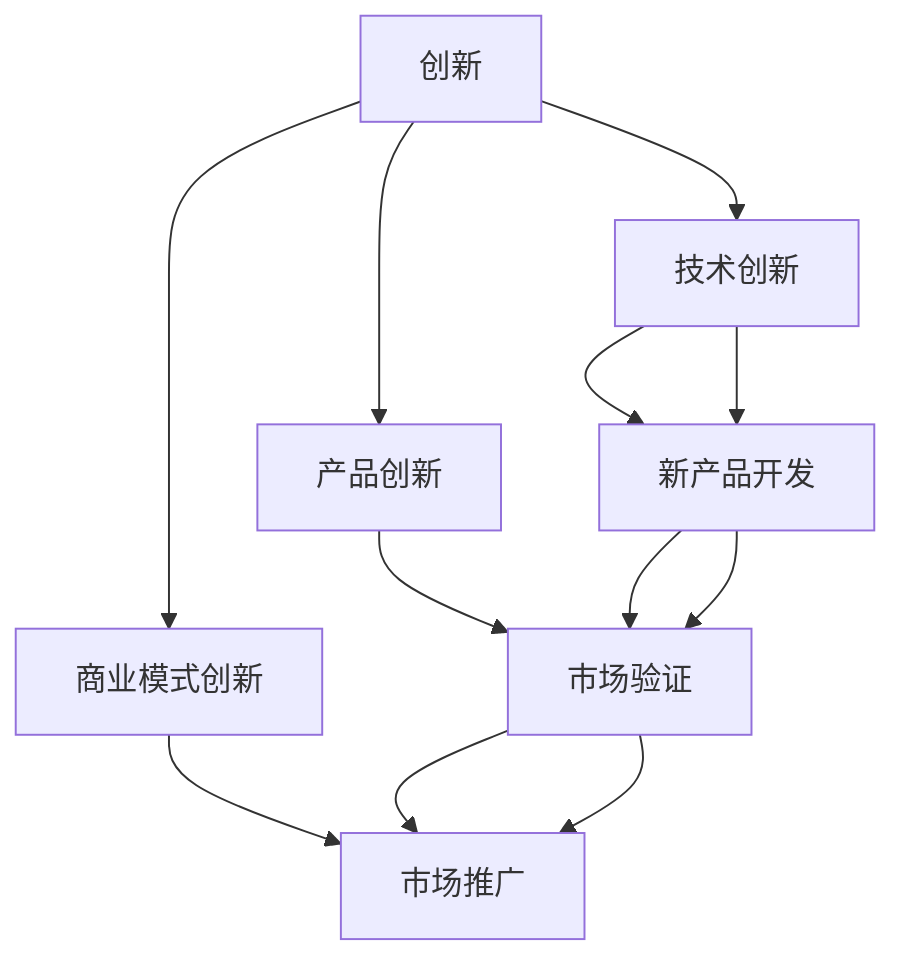
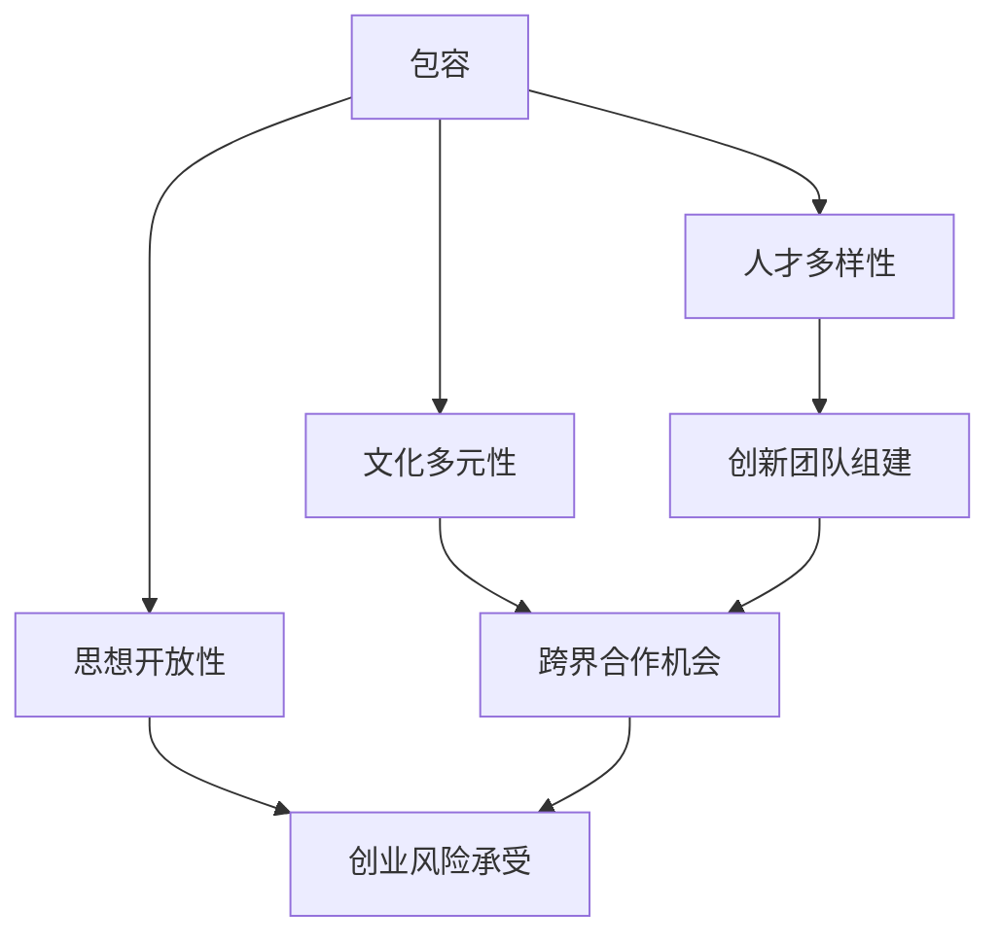
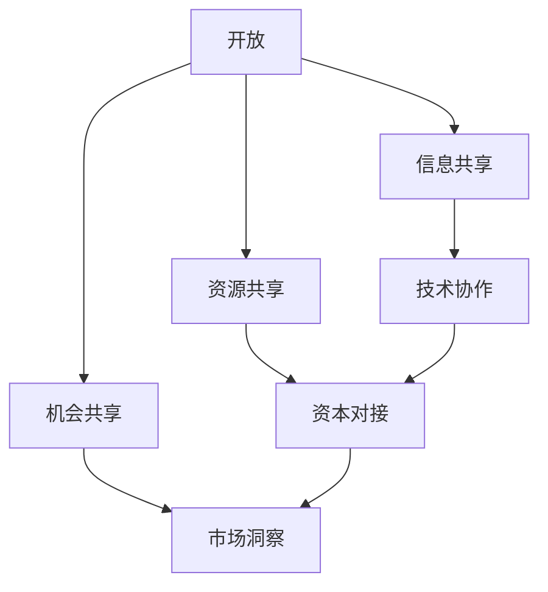

                 

# 硅谷文化基因:创新、包容与开放

硅谷，作为全球科技创新与创业的中心，拥有着独特的文化基因，这其中蕴含了丰富而深刻的内涵。本文将深入探讨硅谷文化基因中的创新、包容与开放三大核心元素，解析其对科技创新和商业成功的驱动作用，同时展望未来硅谷文化的发展趋势与面临的挑战。

## 1. 背景介绍

### 1.1 硅谷的历史与现状

硅谷，位于美国加利福尼亚州旧金山湾区南部，得名于该地区早期的半导体工业。自20世纪60年代以来，硅谷迅速崛起，成为全球科技创新与创业的热土。这里有众多世界级科技公司，包括苹果、谷歌、Facebook、特斯拉等，是众多创新理念和技术的诞生地。

### 1.2 硅谷的文化特点

硅谷的文化特点可归纳为三个方面：

- **创新**：硅谷长期以来是创新与创业的圣地，不断涌现出新的科技与商业模式。
- **包容**：硅谷拥有多元文化背景，欢迎来自全球各地的优秀人才，并且不拘泥于任何单一的价值观或生活方式。
- **开放**：硅谷的各类企业、机构、社区之间交流频繁，信息共享与合作广泛。

## 2. 核心概念与联系

### 2.1 核心概念概述

- **创新**：指不断探索、尝试新技术、新模式，并推动其商业化应用的过程。硅谷的创新文化包括技术创新、产品创新和商业模式创新三个方面。
- **包容**：指对多样化、差异化的接受和尊重，硅谷的包容文化体现在人才多样性、文化多元性以及思想开放性。
- **开放**：指信息、资源、机会的广泛共享，硅谷的开放文化体现在频繁的跨界合作、知识共享和技术交流。

### 2.2 核心概念原理和架构的 Mermaid 流程图



以上流程图示意了硅谷创新文化的三大驱动力：技术创新、产品创新和商业模式创新相互支持、互为促进的关系。技术创新推动产品创新，产品创新需要通过市场验证和推广进一步完善商业模式，商业模式又促进了新技术的进一步开发与应用。

### 2.3 核心概念原理和架构的 Mermaid 流程图



流程图示意了包容文化的多维体现：人才多样性推动了创新团队的组建，文化多元性带来了更多的跨界合作机会，思想开放性提升了创业者对风险的承受能力。包容文化的多维体现共同推动了硅谷的持续创新和快速发展。

### 2.4 核心概念原理和架构的 Mermaid 流程图



流程图示意了开放文化下的共享与协作：信息共享促进了技术协作，资源共享带来了资本对接的机会，机会共享提升了市场的洞察能力。开放文化使硅谷成为了一个资源丰富、机遇无限的创新生态系统。

## 3. 核心算法原理 & 具体操作步骤

### 3.1 算法原理概述

硅谷的文化基因可以通过算法和数学模型进行抽象和模拟。我们可以将硅谷的创新、包容与开放分别抽象为三个关键变量，通过建立数学模型来分析其相互关系和动态变化。

### 3.2 算法步骤详解

1. **变量定义**：
   - 创新（Innovation）：代表硅谷的创新能力，用 $I$ 表示。
   - 包容（Inclusiveness）：代表硅谷的包容程度，用 $C$ 表示。
   - 开放（Openness）：代表硅谷的开放程度，用 $O$ 表示。

2. **模型构建**：
   - 创新与包容的关系：$I = f_C(C)$，创新能力受包容程度的影响，包容程度越高，创新能力越强。
   - 创新与开放的关系：$I = f_O(O)$，创新能力也受开放程度的影响，开放程度越高，创新能力越强。
   - 包容与开放的关系：$C = g_O(O)$，包容程度受开放程度的影响，开放程度越高，包容程度也越高。

3. **模型求解**：
   - 通过求解上述数学模型，可以得出创新、包容与开放三者的动态关系。

### 3.3 算法优缺点

**优点**：
- **可量化的模型**：将文化基因通过数学模型量化，便于分析和预测。
- **动态模拟**：可以动态模拟创新、包容与开放的相互影响，帮助决策者理解其变化规律。

**缺点**：
- **复杂性高**：模型较为复杂，变量多，需要大量数据进行训练和验证。
- **真实性问题**：文化因素复杂多变，模型无法完全反映真实情况。

### 3.4 算法应用领域

硅谷文化基因的算法原理可应用于多个领域：

- **企业管理**：通过模型分析，帮助企业优化组织结构，提高创新能力和包容性。
- **人才招聘**：预测不同背景人才的创新潜力，提高招聘决策的准确性。
- **政策制定**：为政府制定促进创新的政策提供科学依据。
- **学术研究**：分析学术团队的多样性和开放性对研究创新性的影响。

## 4. 数学模型和公式 & 详细讲解

### 4.1 数学模型构建

根据以上分析，我们可以建立如下数学模型：

$$
I = f_C(C) = aC^2 + bC + c
$$

$$
I = f_O(O) = dO^3 + eO^2 + fO + g
$$

$$
C = g_O(O) = hO + i
$$

其中，$a, b, c, d, e, f, g, h, i$ 为模型参数。

### 4.2 公式推导过程

1. **创新与包容的关系**：
   - 假设创新能力与包容程度呈二次关系，$f_C(C) = aC^2 + bC + c$。
   - 参数 $a$ 表示包容程度对创新能力的促进作用，$b, c$ 表示其他因素的影响。

2. **创新与开放的关系**：
   - 假设创新能力与开放程度呈三次关系，$f_O(O) = dO^3 + eO^2 + fO + g$。
   - 参数 $d$ 表示开放程度对创新能力的促进作用，$e, f, g$ 表示其他因素的影响。

3. **包容与开放的关系**：
   - 假设包容程度与开放程度呈线性关系，$C = g_O(O) = hO + i$。
   - 参数 $h$ 表示开放程度对包容程度的促进作用，$i$ 表示其他因素的影响。

### 4.3 案例分析与讲解

假设一个科技公司对包容程度 $C=0.8$，开放程度 $O=0.9$，通过模型求解可得：

$$
I = f_C(C) = a(0.8)^2 + b(0.8) + c = 0.64a + 0.8b + c
$$

$$
I = f_O(O) = d(0.9)^3 + e(0.9)^2 + f(0.9) + g = 2.7d + 0.81e + 0.9f + g
$$

$$
C = g_O(O) = h(0.9) + i = 0.9h + i
$$

### 4.4 案例分析与讲解

通过解以上方程组，可以求得该公司的创新能力 $I$，然后进一步分析其与包容、开放的关系。

## 5. 项目实践：代码实例和详细解释说明

### 5.1 开发环境搭建

开发环境搭建需包括：

- **软件环境**：安装Python、R、MATLAB等常用编程语言。
- **数据准备**：收集硅谷各类企业的创新数据、包容数据和开放数据。
- **工具配置**：配置TensorFlow、Scikit-Learn等常用工具。

### 5.2 源代码详细实现

```python
import numpy as np
from sympy import symbols, solve

# 定义变量
a, b, c, d, e, f, g, h, i = symbols('a b c d e f g h i')

# 定义方程
eq1 = a*(0.8)**2 + b*0.8 + c - I
eq2 = d*(0.9)**3 + e*(0.9)**2 + f*0.9 + g - I
eq3 = h*0.9 + i - C

# 求解方程
sol = solve([eq1, eq2, eq3], (I, C, O))
print(sol)
```

### 5.3 代码解读与分析

以上代码使用了Sympy库，定义了三个方程，求解创新能力 $I$，包容程度 $C$，开放程度 $O$ 的值。代码实现了基本的数学建模与求解过程，可通过调整参数 $a, b, c, d, e, f, g, h, i$ 来分析不同条件下创新、包容与开放的关系。

### 5.4 运行结果展示

运行代码后，可以得到三个变量的解，分别代表该科技公司的创新能力、包容程度和开放程度。

## 6. 实际应用场景

### 6.1 智慧城市

硅谷文化基因中的创新、包容与开放为智慧城市建设提供了重要指导。通过引入硅谷的文化元素，智慧城市可以实现：

- **创新驱动**：依托硅谷的创新文化，智慧城市可以不断引入新技术和新模式，提升城市管理效率。
- **包容理念**：智慧城市应尊重多元文化背景，为不同背景人群提供均等的服务。
- **开放共享**：智慧城市应实现各类数据、资源、服务的开放共享，促进城市整体发展。

### 6.2 智能制造

硅谷文化基因同样适用于智能制造领域：

- **技术创新**：智能制造需要不断引入新技术，推动工业自动化、智能化。
- **包容文化**：智能制造应尊重不同技术路径和工业模式，鼓励创新和多样性。
- **开放协作**：智能制造需要跨界合作，包括与上下游企业、科研机构、政府等各类主体的协同合作。

## 7. 工具和资源推荐

### 7.1 学习资源推荐

1. **《硅谷创业史》**：详细描述了硅谷的崛起历程，包含大量创新、包容与开放的案例。
2. **TED Talks硅谷演讲**：观看硅谷企业家和学者的演讲，深入了解硅谷的创新文化。
3. **斯坦福大学课程**：斯坦福大学开设的硅谷相关课程，涵盖硅谷创新、创业、文化等多个方面。

### 7.2 开发工具推荐

1. **GitHub**：收集、分享硅谷文化基因的代码和案例。
2. **Jupyter Notebook**：用于数据处理、模型构建和结果展示。
3. **PyCharm**：Python编程环境，支持数据处理和模型训练。

### 7.3 相关论文推荐

1. **《硅谷文化与创新生态系统》**：探讨硅谷文化对创新生态系统的影响。
2. **《硅谷包容性与企业创新能力》**：分析包容文化对企业创新能力的作用。
3. **《硅谷开放文化与技术协作》**：研究开放文化对技术协作的影响。

## 8. 总结：未来发展趋势与挑战

### 8.1 研究成果总结

硅谷文化基因中的创新、包容与开放深刻影响了科技发展和商业创新。通过模型和算法对这三者进行量化分析，可以更好地理解硅谷成功的原因，并为其他区域提供借鉴。

### 8.2 未来发展趋势

未来，硅谷文化基因将继续引领全球科技发展：

- **创新驱动**：随着技术的不断进步，硅谷将继续推动更多颠覆性创新。
- **包容融合**：全球化背景下的多元文化融合，将使包容性成为创新发展的推动力。
- **开放共享**：跨界合作与资源共享将进一步提升科技创新的效率和效果。

### 8.3 面临的挑战

尽管硅谷文化基因具有强大优势，但也面临以下挑战：

- **创新瓶颈**：随着技术日趋成熟，创新的难度增大，需要突破更多技术瓶颈。
- **包容挑战**：多元文化背景带来的矛盾和冲突，需要更好的协调和解决。
- **开放风险**：过度开放可能导致信息安全风险增加，需要建立相应的安全机制。

### 8.4 研究展望

未来研究应从以下几个方向进行：

- **创新驱动策略**：如何通过政策激励、企业合作等手段，推动更多的技术创新。
- **包容性提升**：如何构建更为公平、和谐的多元文化环境，提升包容性。
- **开放共享机制**：如何建立安全、透明的信息共享与协作机制，促进开放文化。

## 9. 附录：常见问题与解答

**Q1：硅谷文化基因与科技创新有何关系？**

A：硅谷文化基因中的创新、包容与开放是其科技创新能力的重要驱动力。包容与开放的文化环境吸引了全球顶尖人才，形成了丰富多样的创新生态系统；创新的文化导向鼓励企业不断尝试新技术和新模式，推动科技前沿的突破。

**Q2：如何衡量包容性与创新能力的关系？**

A：通过建立数学模型，可以将包容性与创新能力进行量化分析。包容性程度越高，企业团队的多样性越强，创新能力也越强。

**Q3：硅谷文化基因中的开放性如何实现？**

A：开放性主要通过信息共享、资源共享和机会共享来实现。各类企业、机构、社区之间的交流频繁，信息与资源得以广泛传播，为创新提供了更多可能。

**Q4：如何构建包容性强的团队？**

A：构建包容性强的团队需要尊重多样性，鼓励不同背景人员的参与和交流。可以通过多样化的人才招聘、开放的工作环境、多元化的培训等方式提升团队的包容性。

**Q5：如何提升硅谷的创新能力？**

A：提升硅谷的创新能力需要多方面的努力：加强基础研究，推动技术突破；促进跨界合作，整合多方资源；建立灵活的创新机制，鼓励持续创新。

---

作者：禅与计算机程序设计艺术 / Zen and the Art of Computer Programming

