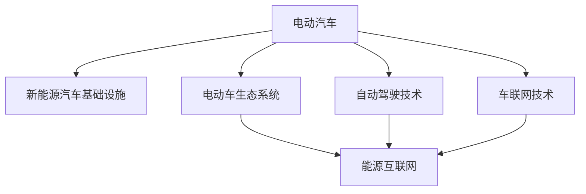

                 

# 硅谷新能源汽车竞争:电动车生态系统

## 1. 背景介绍

随着全球气候变化和环境污染问题的日益严重，新能源汽车行业迅速崛起，吸引了众多科技巨头和创业公司的关注。硅谷作为全球科技创新的发源地，自然也不甘落后，纷纷进入新能源汽车市场，展开激烈竞争。本文将聚焦于硅谷新能源汽车领域的竞争，深入分析其核心生态系统，揭示背后技术、市场和商业模式的演变。

## 2. 核心概念与联系

### 2.1 核心概念概述

为更好地理解硅谷新能源汽车竞争的动态，本节将介绍几个密切相关的核心概念：

- **电动汽车(Electric Vehicles, EVs)**：利用电力作为驱动能源的汽车，与传统燃油车相比，电动汽车在环保、能源效率等方面具有显著优势。
- **新能源汽车基础设施(NEVI, New Energy Vehicle Infrastructure)**：包括充电桩、电网、智能电网等，是电动汽车运行和充电的基础设施。
- **自动驾驶技术(Autonomous Driving)**：使车辆能够自主导航、识别道路标志、做出驾驶决策等，是电动汽车向智能化、无人化发展的重要方向。
- **车联网技术(V2X, Vehicle-to-Everything)**：实现车辆与车、路、人、环境等之间的信息交互，提升电动汽车的安全性和用户体验。
- **电动车生态系统(EVS, Electric Vehicle System)**：涵盖电动汽车、充电基础设施、自动驾驶、车联网等多个环节的协同发展，形成闭环的电动汽车产业链。
- **能源互联网(Smart Grid)**：将电网与电动汽车等能源消费者、生产者无缝对接，实现能量流的双向流动和优化调度。

这些核心概念之间的逻辑关系可以通过以下Mermaid流程图来展示：



这个流程图展示了大生态系统中的关键组件及其相互作用：

1. **电动汽车**是核心，负责能源的存储和传输。
2. **新能源汽车基础设施**提供充电、电网支持，是电动汽车运行的基础。
3. **自动驾驶技术**提升电动汽车的智能化水平，减少人工驾驶的劳力成本。
4. **车联网技术**实现车辆与环境的信息交互，提升用户体验。
5. **电动车生态系统**囊括电动汽车及其相关技术的集成，形成完整的产业链。
6. **能源互联网**则负责能源的智能调度和管理，确保电动汽车在电网中的高效运行。

这些概念共同构成了硅谷新能源汽车生态系统的框架，为后续分析提供了基础。

## 3. 核心算法原理 & 具体操作步骤
### 3.1 算法原理概述

硅谷新能源汽车生态系统中的核心算法原理，主要集中在如何优化电动汽车的性能、提升充电效率、实现自动驾驶和车联网等技术。这些算法通过模型学习、数据分析、优化调度等多种手段，实现电动汽车及其相关系统的智能化、高效化和自动化。

以自动驾驶为例，其核心算法包括：

- **感知算法**：通过摄像头、雷达、激光雷达等传感器获取周围环境信息，识别道路标志、车辆、行人等对象。
- **决策算法**：基于感知结果，计算车辆的行驶轨迹、速度等，生成驾驶指令。
- **控制算法**：执行驾驶指令，控制电动汽车的转向、加速、制动等操作。

这些算法共同构成了一个复杂的自动化系统，提升了电动汽车的安全性和用户体验。

### 3.2 算法步骤详解

电动汽车生态系统中的算法步骤，通常包括以下几个关键环节：

1. **数据收集**：通过传感器和车载设备收集车辆内外部的数据，如速度、位置、环境信息等。
2. **数据处理**：清洗、整理和预处理数据，以便于后续的模型训练和分析。
3. **模型训练**：使用机器学习和深度学习算法，训练感知、决策和控制等模型，提升系统的智能水平。
4. **模型验证和优化**：在仿真环境和实际道路测试中验证模型性能，不断优化模型参数和算法。
5. **系统集成和部署**：将模型集成到电动汽车和相关系统中，实现实时数据处理和决策执行。

### 3.3 算法优缺点

电动汽车生态系统中的算法，具有以下优点：

- **提升能效**：通过智能调度和管理，优化电动汽车的动力系统和能量流，提升能效和续航里程。
- **减少人工成本**：自动驾驶和车联网技术减少了对人类驾驶员的依赖，降低了人工成本和事故率。
- **增强安全性**：通过实时监控和智能决策，提升了电动汽车的安全性能。

同时，也存在一些局限：

- **技术复杂度**：涉及传感器、数据处理、模型训练等多方面的技术，实现难度大。
- **数据隐私和安全**：大量数据需要在网络中传输和存储，存在隐私泄露和安全问题。
- **高成本**：初期研发和部署成本较高，需要大量资金投入。

### 3.4 算法应用领域

电动汽车生态系统中的算法，应用领域广泛，包括：

- **自动驾驶**：实现无人驾驶汽车在城市道路上的行驶。
- **车联网**：通过车辆与环境的实时交互，提升交通管理和用户体验。
- **能源管理**：实现电动汽车与电网的智能互联，优化能量使用。
- **车辆监测**：实时监控车辆状态，提供故障诊断和维护建议。
- **用户交互**：提供个性化驾驶建议，提升用户体验。

## 4. 数学模型和公式 & 详细讲解  
### 4.1 数学模型构建

电动汽车生态系统中的算法，通常使用以下数学模型进行建模：

1. **感知模型**：
   $$
   \hat{y} = f(x; \theta) = \frac{e^{\mathbf{w}^T\phi(x)}}{\sum_{i=1}^m e^{\mathbf{w}_i^T\phi(x)}}
   $$
   其中，$x$ 为输入数据（如传感器数据），$\phi(x)$ 为特征提取函数，$\theta$ 为模型参数，$f(x; \theta)$ 为感知函数。

2. **决策模型**：
   $$
   u = g(p; \phi) = \sum_{i=1}^n p_i g_i
   $$
   其中，$u$ 为控制指令，$p$ 为预测概率，$g_i$ 为决策函数。

3. **控制模型**：
   $$
   \dot{x} = F(x; \theta) = A x + B u + D r
   $$
   其中，$x$ 为状态变量，$u$ 为控制指令，$r$ 为扰动项，$A$、$B$、$D$ 为控制矩阵。

### 4.2 公式推导过程

以自动驾驶中的感知模型为例，公式推导如下：

1. **数据预处理**：通过传感器采集车辆周围环境数据，经过滤波、降噪等处理，得到特征向量 $x$。

2. **特征提取**：使用卷积神经网络（CNN）、循环神经网络（RNN）等深度学习模型，提取特征 $\phi(x)$。

3. **模型训练**：使用最大似然估计或交叉熵损失函数，训练感知模型 $f(x; \theta)$，使得模型输出 $\hat{y}$ 与真实标签 $y$ 尽可能接近。

4. **模型验证**：在仿真环境和实际道路测试中，验证感知模型性能，调整模型参数 $\theta$，优化模型 $f(x; \theta)$。

### 4.3 案例分析与讲解

以Tesla Autopilot系统为例，其感知模型使用卷积神经网络，决策模型采用深度强化学习，控制模型采用动态系统理论。通过多模态传感器数据融合，实现道路感知和自主驾驶。

## 5. 项目实践：代码实例和详细解释说明
### 5.1 开发环境搭建

在进行项目实践前，我们需要准备好开发环境。以下是使用Python进行TensorFlow开发的环境配置流程：

1. 安装Anaconda：从官网下载并安装Anaconda，用于创建独立的Python环境。

2. 创建并激活虚拟环境：
```bash
conda create -n tensorflow-env python=3.8 
conda activate tensorflow-env
```

3. 安装TensorFlow：根据CUDA版本，从官网获取对应的安装命令。例如：
```bash
conda install tensorflow tensorflow-gpu=2.5.0 -c conda-forge
```

4. 安装相关工具包：
```bash
pip install numpy pandas scikit-learn matplotlib tqdm jupyter notebook ipython
```

完成上述步骤后，即可在`tensorflow-env`环境中开始项目实践。

### 5.2 源代码详细实现

这里我们以自动驾驶感知模型为例，给出使用TensorFlow进行模型开发的PyTorch代码实现。

首先，定义模型结构和训练数据：

```python
import tensorflow as tf
from tensorflow.keras import layers, models
import numpy as np

# 定义模型
model = models.Sequential([
    layers.Conv2D(32, (3, 3), activation='relu', input_shape=(32, 32, 3)),
    layers.MaxPooling2D((2, 2)),
    layers.Conv2D(64, (3, 3), activation='relu'),
    layers.MaxPooling2D((2, 2)),
    layers.Flatten(),
    layers.Dense(64, activation='relu'),
    layers.Dense(10, activation='softmax')
])

# 定义损失函数和优化器
loss_fn = tf.keras.losses.SparseCategoricalCrossentropy(from_logits=True)
optimizer = tf.keras.optimizers.Adam(learning_rate=0.001)

# 定义数据集
train_data = np.random.randn(1000, 32, 32, 3)
train_labels = np.random.randint(10, size=(1000, 1))
```

接着，进行模型训练和评估：

```python
# 训练模型
for epoch in range(10):
    with tf.GradientTape() as tape:
        logits = model(train_data, training=True)
        loss = loss_fn(train_labels, logits)
    gradients = tape.gradient(loss, model.trainable_variables)
    optimizer.apply_gradients(zip(gradients, model.trainable_variables))

# 评估模型
test_data = np.random.randn(100, 32, 32, 3)
test_labels = np.random.randint(10, size=(100, 1))
logits = model(test_data)
predictions = tf.argmax(logits, axis=1)
accuracy = np.mean(predictions == test_labels)
print(f'Accuracy: {accuracy}')
```

以上就是使用TensorFlow对自动驾驶感知模型进行训练的完整代码实现。可以看到，借助TensorFlow的深度学习框架，代码实现简洁高效。

### 5.3 代码解读与分析

让我们再详细解读一下关键代码的实现细节：

**模型定义**：
- `layers.Conv2D` 和 `layers.MaxPooling2D` 用于构建卷积和池化层，提取特征。
- `layers.Dense` 用于全连接层，实现分类预测。

**训练和评估**：
- `tf.keras.losses.SparseCategoricalCrossentropy` 用于定义交叉熵损失函数。
- `tf.keras.optimizers.Adam` 定义优化器。
- 使用 `tf.GradientTape` 计算梯度，更新模型参数。
- 在测试数据集上评估模型性能，输出准确率。

通过这段代码，可以看出TensorFlow的易用性和高效性，适合进行深度学习模型的快速迭代和实验。

当然，工业级的系统实现还需考虑更多因素，如模型保存和部署、超参数的自动搜索、更灵活的任务适配层等。但核心的自动驾驶算法基本与此类似。

## 6. 实际应用场景
### 6.1 智能高速公路

智能高速公路是电动汽车生态系统的重要应用场景之一。通过部署自动驾驶和车联网技术，智能高速公路可以实现车辆自主行驶、路网管理、应急救援等功能，大幅提升道路运输效率和安全性。

具体而言，可以在高速公路上部署高精度地图、激光雷达等传感器，实现车辆精准定位和环境感知。通过车联网技术，车辆可以实时接收路网信息，优化行驶路径。在车辆发生故障时，自动驾驶系统可以自主调整行驶路线，向应急救援中心报警。

### 6.2 城市交通管理

城市交通管理也是电动汽车生态系统的重要应用领域。通过自动驾驶和车联网技术，可以大幅提升城市交通效率，减少拥堵和事故。

具体而言，车辆可以通过车联网技术实时获取交通信号、路况信息，优化行驶路径，减少交通拥堵。同时，自动驾驶系统可以在交通高峰期自动调整车速和车道，避免事故发生。

### 6.3 物流配送

物流配送也是电动汽车生态系统的典型应用场景。通过自动驾驶和车联网技术，可以实现无人驾驶货车在城市、农村等复杂环境中安全高效地运输货物，提升物流效率。

具体而言，无人驾驶货车可以通过车联网技术实时接收配送中心信息，优化路线和调度。在行驶过程中，自动驾驶系统可以实时监控车辆状态，避免交通事故。

### 6.4 未来应用展望

随着自动驾驶、车联网等技术的不断发展，电动汽车生态系统将迎来更多创新应用，为城市交通、物流配送等领域带来变革性影响。

在智慧城市治理中，智能高速公路、城市交通管理、物流配送等应用将提升城市管理和物流效率，构建更安全、高效的未来城市。

此外，在企业生产、社会治理、文娱传媒等众多领域，基于大语言模型微调的人工智能应用也将不断涌现，为经济社会发展注入新的动力。相信随着技术的日益成熟，电动汽车生态系统必将在构建人机协同的智能时代中扮演越来越重要的角色。

## 7. 工具和资源推荐
### 7.1 学习资源推荐

为了帮助开发者系统掌握电动汽车生态系统的理论基础和实践技巧，这里推荐一些优质的学习资源：

1. **《深度学习》书籍**：Ian Goodfellow等人所著，详细介绍了深度学习的理论基础和实践技巧，适合初学者和进阶者。

2. **Udacity自动驾驶课程**：由斯坦福大学和谷歌合作开设的自动驾驶课程，涵盖感知、决策、控制等多个环节，实战性强。

3. **Coursera机器学习课程**：由斯坦福大学教授Andrew Ng开设的机器学习课程，涵盖基础理论和应用案例，适合广泛受众。

4. **GitHub开源项目**：包含大量自动驾驶、车联网等电动汽车生态系统相关的开源项目，适合学习实践。

5. **NVIDIA官方文档**：包含Tesla、NVIDIA等公司发布的自动驾驶技术文档，深入了解最新技术进展。

通过对这些资源的学习实践，相信你一定能够快速掌握电动汽车生态系统的精髓，并用于解决实际的自动驾驶问题。

### 7.2 开发工具推荐

高效的开发离不开优秀的工具支持。以下是几款用于电动汽车生态系统开发的常用工具：

1. **TensorFlow**：由谷歌主导开发的深度学习框架，支持分布式计算，适合大规模工程应用。

2. **PyTorch**：由Facebook主导开发的深度学习框架，灵活易用，适合快速迭代研究。

3. **Keras**：高级神经网络API，适合快速构建和调试模型。

4. **Jupyter Notebook**：交互式编程环境，方便调试和分享代码。

5. **Git**：版本控制工具，支持多人协作开发。

合理利用这些工具，可以显著提升电动汽车生态系统开发的效率，加快创新迭代的步伐。

### 7.3 相关论文推荐

电动汽车生态系统的发展源于学界的持续研究。以下是几篇奠基性的相关论文，推荐阅读：

1. **《Deep Reinforcement Learning for Autonomous Driving》**：提出基于深度强化学习的自动驾驶算法，通过模拟环境和实际道路测试，优化驾驶策略。

2. **《A Survey on Electric Vehicle-to-Everything (EV2X) Communications》**：综述车联网技术的研究现状，涵盖通信协议、安全技术、应用场景等。

3. **《Energy Efficiency Optimization of Electric Vehicles with Renewable Energy Integration》**：探讨电动汽车与可再生能源的整合，优化能源使用效率。

4. **《An Energy-Efficient Charging Strategy for Electric Vehicles Using Smart Grid Technology》**：研究智能电网在电动汽车充电中的应用，优化充电策略。

5. **《A Survey of the Current Status, Challenges, and Future Directions of EV Charging Infrastructure》**：综述电动汽车充电基础设施的研究现状和未来方向，涵盖充电设施布局、充电协议等。

这些论文代表了大语言模型微调技术的发展脉络。通过学习这些前沿成果，可以帮助研究者把握学科前进方向，激发更多的创新灵感。

## 8. 总结：未来发展趋势与挑战
### 8.1 总结

本文对电动汽车生态系统的核心算法原理和操作步骤进行了全面系统的介绍。首先阐述了电动汽车生态系统的背景和意义，明确了自动驾驶、车联网等技术在其中的关键作用。其次，从原理到实践，详细讲解了电动汽车生态系统的数学模型和操作步骤，给出了自动驾驶感知模型的代码实现。同时，本文还广泛探讨了电动汽车生态系统在智能高速公路、城市交通管理、物流配送等多个行业领域的应用前景，展示了其广阔的发展潜力。此外，本文精选了电动汽车生态系统的各类学习资源，力求为读者提供全方位的技术指引。

通过本文的系统梳理，可以看到，电动汽车生态系统中的自动驾驶、车联网等技术正在成为NLP领域的重要范式，极大地拓展了预训练语言模型的应用边界，催生了更多的落地场景。受益于大规模语料的预训练和微调方法的不断进步，相信电动汽车生态系统必将在构建人机协同的智能时代中扮演越来越重要的角色。未来，伴随预训练语言模型和微调方法的持续演进，电动汽车生态系统也将不断拓展，为城市交通、物流配送等领域带来新的变革。

### 8.2 未来发展趋势

展望未来，电动汽车生态系统的发展将呈现以下几个趋势：

1. **技术集成度提升**：自动驾驶、车联网、能源管理等技术将进一步集成，形成更加紧密的电动汽车生态系统。
2. **智能调度优化**：基于人工智能和机器学习，优化电动汽车的行驶路径、能源管理，提升能效和用户体验。
3. **车联网泛化**：车联网技术将从城市扩展到农村、山区等更多场景，实现全覆盖、全时域的网络互联。
4. **跨界合作深化**：电动汽车生态系统将与智能家居、智能建筑等更多领域协同发展，实现更广泛的信息互联。
5. **政策支持加强**：政府将出台更多政策和标准，推动电动汽车生态系统的健康发展，提升行业整体竞争力。

这些趋势凸显了电动汽车生态系统的广阔前景，必将为城市交通、物流配送等领域带来新的变革。未来，伴随技术的不断进步，电动汽车生态系统必将在构建智能交通、智慧城市等方向上取得更大突破。

### 8.3 面临的挑战

尽管电动汽车生态系统的发展前景广阔，但在迈向更加智能化、普适化应用的过程中，仍面临诸多挑战：

1. **技术瓶颈**：自动驾驶、车联网等技术的成熟度还不够高，仍需进一步优化和测试。
2. **安全问题**：大规模车联网通信带来的网络安全风险，自动驾驶系统的鲁棒性和可靠性问题。
3. **成本高企**：自动驾驶、车联网等技术的初期研发和部署成本较高，难以大规模普及。
4. **法规和标准**：电动汽车生态系统涉及多个行业和领域，法规和标准的制定和执行复杂。
5. **数据隐私**：大量数据在网络中传输和存储，存在隐私泄露和数据安全问题。
6. **用户体验**：电动汽车生态系统需兼顾技术创新和用户体验，确保用户接受度和满意度。

这些挑战需要政府、企业、学术界等各方共同努力，才能推动电动汽车生态系统的健康发展。

### 8.4 研究展望

面对电动汽车生态系统所面临的挑战，未来的研究需要在以下几个方面寻求新的突破：

1. **强化学习**：探索基于强化学习的自动驾驶算法，提升车辆的智能水平和驾驶稳定性。
2. **车联网安全**：研究车联网通信协议和数据加密技术，确保网络安全。
3. **低成本制造**：开发低成本、高性能的自动驾驶和车联网设备，降低初期研发和部署成本。
4. **法规和标准**：制定电动汽车生态系统的法律法规和行业标准，推动行业健康发展。
5. **数据隐私保护**：研究数据匿名化、加密等技术，保护用户隐私。
6. **用户体验优化**：结合用户反馈和行为数据，优化电动汽车生态系统，提升用户体验。

这些研究方向的探索，必将引领电动汽车生态系统迈向更高的台阶，为构建智能交通、智慧城市等方向上取得更大突破。只有勇于创新、敢于突破，才能不断拓展电动汽车生态系统的边界，让智能技术更好地造福人类社会。

## 9. 附录：常见问题与解答
**Q1：电动汽车生态系统是否适用于所有NLP任务？**

A: 电动汽车生态系统中的核心技术，如自动驾驶、车联网等，与NLP任务有所不同，但两者均依赖于数据驱动和模型训练。在处理电动汽车相关数据时，可以借鉴NLP领域的数据预处理、模型训练等方法。然而，电动汽车生态系统中的技术复杂度更高，需结合具体场景进行优化。

**Q2：电动汽车生态系统中的算法如何处理多模态数据？**

A: 电动汽车生态系统中的算法通常涉及传感器数据、定位数据、地图数据等多模态数据。处理多模态数据需要采用数据融合技术，将不同模态的数据进行综合处理，提取有用信息。具体而言，可以通过传感器数据预处理、特征提取、模型训练等步骤，实现多模态数据的融合。

**Q3：电动汽车生态系统中的算法如何处理实时数据？**

A: 电动汽车生态系统中的算法需要实时处理大量的传感器数据和环境信息，以支持自动驾驶、车联网等功能。为了提高实时数据处理的效率，可以采用流式计算和分布式计算技术，优化数据流向和计算资源分配。同时，可以采用数据压缩、缓存等技术，减少实时数据传输和存储的延迟和开销。

**Q4：电动汽车生态系统中的算法如何保证数据隐私和安全？**

A: 电动汽车生态系统中的算法涉及大量的传感器数据和用户隐私信息，如何保护数据隐私和安全是重要问题。可以采用数据加密、匿名化、访问控制等技术，确保数据在传输和存储过程中的安全性。同时，应建立严格的数据管理和使用规则，防止数据滥用和泄露。

**Q5：电动汽车生态系统中的算法如何保证算法的透明性和可解释性？**

A: 电动汽车生态系统中的算法涉及复杂的深度学习和机器学习模型，如何保证算法的透明性和可解释性是一个挑战。可以通过模型可视化、解释性分析等技术，揭示算法的内部机制和决策逻辑。同时，应建立算法的测试和验证机制，确保算法的稳定性和可靠性。

---

作者：禅与计算机程序设计艺术 / Zen and the Art of Computer Programming

