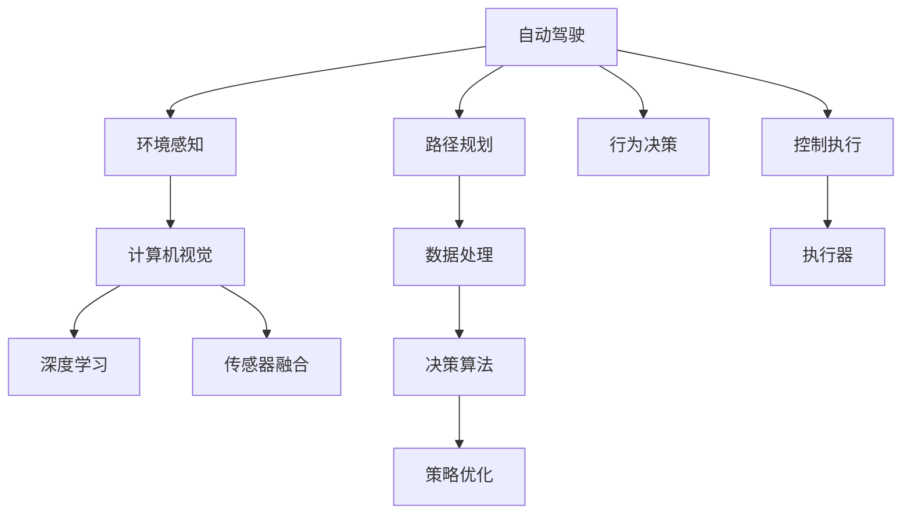

                 

# 硅谷新能源汽车自动驾驶:智能出行新时代

> 关键词：自动驾驶, 智能出行, 新能源汽车, 深度学习, 计算机视觉, 传感器融合

## 1. 背景介绍

### 1.1 问题由来
在电动汽车和自动驾驶技术的飞速发展下，硅谷正在引领一场颠覆传统交通方式的新革命。自动驾驶技术以其高效、便捷、环保的特性，逐渐成为未来智能出行中的核心力量。这一领域不仅集成了众多前沿技术，如计算机视觉、深度学习、传感器融合等，更代表了人类向智能化交通迈进的重要一步。

### 1.2 问题核心关键点
当前自动驾驶技术的主要挑战在于如何在大规模复杂环境下实现精准的感知和决策。车辆需要实时捕捉交通状况、行人行为、交通信号等海量数据，并从中提取出有用的信息。此外，自动驾驶系统必须具备在极端条件（如恶劣天气、夜间驾驶等）下的鲁棒性，确保乘客及行人的安全。

在这一过程中，计算机视觉和深度学习技术扮演着关键角色。通过计算机视觉对道路、交通标志、行人等进行精准识别，结合深度学习对大量数据进行分析和处理，自动驾驶系统能够不断提升其智能化水平。

### 1.3 问题研究意义
硅谷的新能源汽车和自动驾驶技术的研究不仅推动了智能交通的发展，更是引领了全球技术创新的方向。通过深度学习和大数据技术的融合，自动驾驶技术逐渐从实验室走向现实，推动了汽车产业的变革，加速了绿色出行的普及。研究该技术的前沿发展，对于促进环境保护、提升出行效率、优化交通资源具有重要意义。

## 2. 核心概念与联系

### 2.1 核心概念概述

为更好地理解硅谷新能源汽车的自动驾驶技术，本节将介绍几个关键概念：

- **自动驾驶(Autonomous Driving)**：指车辆无需人工干预，通过传感器、摄像头、雷达等感知环境，并利用计算机视觉、深度学习等技术实现自主导航和决策的系统。
- **计算机视觉(Computer Vision)**：研究如何使计算机“看”并理解图像、视频等视觉信息，包括图像处理、模式识别、对象检测、语义分割等任务。
- **深度学习(Deep Learning)**：一种基于多层神经网络的机器学习技术，能够自动提取并学习数据中的复杂模式。
- **传感器融合(Sensor Fusion)**：将多种传感器（如摄像头、雷达、激光雷达等）的数据融合，提高车辆对环境的感知精度。
- **环境感知(Perception)**：通过传感器获取实时道路信息，识别交通标志、行人、其他车辆等，为自动驾驶决策提供基础。
- **路径规划(Routing)**：根据当前位置和目标目的地，计算出最优的行驶路径。
- **行为决策(C决策)**：在感知和规划的基础上，结合安全规则、交通法规等，做出车辆的下一步行动决策。
- **控制执行(C Execution)**：通过控制车辆的转向、加速、刹车等执行自动驾驶决策，保证车辆的稳定行驶。

这些核心概念之间的逻辑关系可以通过以下Mermaid流程图来展示：



这个流程图展示了自动驾驶技术的关键流程：

1. 自动驾驶系统通过传感器获取环境数据。
2. 计算机视觉和深度学习技术对数据进行处理，提取道路、交通标志等信息。
3. 通过传感器融合提升环境感知的精度。
4. 路径规划和行为决策生成车辆的行驶路径和行动指令。
5. 控制执行器根据指令对车辆进行操作，保证自动驾驶的稳定运行。

## 3. 核心算法原理 & 具体操作步骤
### 3.1 算法原理概述

硅谷自动驾驶系统的核心算法包括环境感知、路径规划、行为决策等。其中，深度学习技术是实现这些算法的重要工具。

环境感知算法通过计算机视觉和传感器融合技术，从多个传感器中提取道路、交通标志、行人等信息。路径规划算法则根据当前位置和目标目的地，结合交通规则和路况信息，生成最优行驶路径。行为决策算法则根据感知和规划信息，结合安全规则，生成车辆的下一步行动指令。

深度学习技术在自动驾驶系统中的应用包括但不限于以下几个方面：

- 目标检测：通过深度学习模型，如YOLO、Faster R-CNN等，实现对道路、车辆、行人等目标的实时检测。
- 语义分割：将道路、交通标志、行人等不同物体区分并打上标签，便于后续处理。
- 实例分割：识别道路上的车辆、行人等目标，并对其进行追踪。
- 预测和规划：通过深度学习模型预测其他车辆的移动路径，生成最优行驶策略。

### 3.2 算法步骤详解

硅谷自动驾驶系统的构建和优化主要包括以下几个关键步骤：

**Step 1: 传感器数据获取与预处理**
- 从摄像头、雷达、激光雷达等传感器中获取实时道路数据。
- 对数据进行去噪、归一化等预处理，提高数据质量。

**Step 2: 环境感知**
- 使用计算机视觉技术，对摄像头捕获的图像进行目标检测和语义分割。
- 结合雷达和激光雷达数据，对目标进行精准定位和姿态估计。
- 利用传感器融合技术，将多种传感器的数据进行融合，提高环境感知的准确性。

**Step 3: 路径规划**
- 根据当前位置和目标目的地，计算出最优行驶路径。
- 考虑交通规则、交通状况等因素，生成动态路径规划。
- 采用A\*算法、Dijkstra算法等路径规划算法，保证路径的可行性和安全性。

**Step 4: 行为决策**
- 根据感知和规划信息，结合安全规则和交通法规，生成车辆的下一步行动指令。
- 采用强化学习算法，如Q-learning、Deep Q Network等，优化行为决策策略。
- 结合车辆状态、周边环境等因素，进行实时决策。

**Step 5: 控制执行**
- 通过控制器的实时计算，对车辆进行精准控制。
- 结合车辆的加速度、刹车系统等，保证车辆的稳定运行。
- 定期对系统进行校准和优化，保证自动驾驶系统的持续性能。

### 3.3 算法优缺点

硅谷自动驾驶技术的优点包括：

- 高效和便捷：无需人工干预，大幅提升出行效率和舒适度。
- 安全和可靠性：通过深度学习和大数据技术，自动驾驶系统具备强大的感知和决策能力，减少交通事故。
- 环保节能：减少碳排放，推动绿色出行。
- 数据驱动：通过积累大量的行驶数据，持续优化自动驾驶系统。

然而，自动驾驶技术也存在以下缺点：

- 技术复杂：涉及多个前沿技术的综合应用，开发和维护成本高。
- 环境适应性：在极端环境下（如恶劣天气、夜间驾驶等），自动驾驶系统仍需不断优化和升级。
- 法规和伦理问题：自动驾驶技术涉及复杂的法律和伦理问题，如责任归属、数据隐私等，需要多方协调。
- 技术挑战：自动驾驶系统需要面对高度复杂和多变的交通场景，技术瓶颈仍需进一步突破。

### 3.4 算法应用领域

硅谷自动驾驶技术已经在多个领域得到了广泛应用，如智能交通、物流配送、智能停车等。以下是几个典型应用场景：

- **智能交通**：通过自动驾驶技术，优化交通流量，减少拥堵，提升整体交通效率。
- **物流配送**：自动驾驶货车可以24小时不间断运作，降低物流成本，提高配送速度。
- **智能停车**：自动驾驶技术结合智能泊车系统，实现高精度自动停车和车库管理。
- **无人出租车**：在特定区域内运行，提供便捷的出行服务，提高城市出行效率。

此外，硅谷自动驾驶技术还在自动驾驶模拟器、无人车竞速、自动驾驶测试车等场景中得到了广泛应用，推动了技术的不断进步和迭代。

## 4. 数学模型和公式 & 详细讲解 & 举例说明（备注：数学公式请使用latex格式，latex嵌入文中独立段落使用 $$，段落内使用 $)
### 4.1 数学模型构建

硅谷自动驾驶系统中的关键算法通常基于以下数学模型：

- **目标检测**：使用深度学习模型，如YOLO、Faster R-CNN等，对图像进行目标检测。模型输出为每个目标的类别和边界框。
- **语义分割**：使用U-Net、DeepLab等模型，对图像进行像素级别的语义分割，将道路、交通标志、行人等物体打上标签。
- **实例分割**：使用Mask R-CNN等模型，对目标进行追踪，输出每个目标的像素级掩码。
- **路径规划**：使用A\*算法、Dijkstra算法等，计算出从起点到终点的最短路径。

### 4.2 公式推导过程

以目标检测模型YOLO为例，其核心公式如下：

$$
y = \sigma(W_2 \sigma(W_1 z + b_1) + b_2)
$$

其中，$z$ 为输入图像经过卷积层后的特征图，$W_1$ 和 $W_2$ 为卷积层的权重矩阵，$b_1$ 和 $b_2$ 为偏置向量，$\sigma$ 为sigmoid函数。

在YOLO模型中，通过多层次的卷积和池化操作，提取图像中的特征，并通过多个全连接层输出目标的类别和边界框。模型在训练过程中，通过反向传播算法更新权重矩阵，最小化预测结果与真实标签之间的差异。

### 4.3 案例分析与讲解

假设我们有一个自动驾驶车辆，其装备有多个摄像头和激光雷达，传感器数据如下：

- 摄像头1：检测到前方有一个人行走。
- 摄像头2：检测到前方有一辆自行车。
- 雷达：检测到右侧有一辆同向行驶的汽车。

基于这些数据，我们通过计算机视觉和深度学习模型，识别出目标的类别和位置。然后，利用传感器融合技术，将这些信息进行整合，生成高精度的环境感知图。接着，通过路径规划算法，计算出最优行驶路径。最后，结合行为决策算法，生成车辆的下一步行动指令。

## 5. 项目实践：代码实例和详细解释说明
### 5.1 开发环境搭建

在进行自动驾驶系统开发前，我们需要准备好开发环境。以下是使用Python进行PyTorch开发的环境配置流程：

1. 安装Anaconda：从官网下载并安装Anaconda，用于创建独立的Python环境。

2. 创建并激活虚拟环境：
```bash
conda create -n pytorch-env python=3.8 
conda activate pytorch-env
```

3. 安装PyTorch：根据CUDA版本，从官网获取对应的安装命令。例如：
```bash
conda install pytorch torchvision torchaudio cudatoolkit=11.1 -c pytorch -c conda-forge
```

4. 安装Transformers库：
```bash
pip install transformers
```

5. 安装各类工具包：
```bash
pip install numpy pandas scikit-learn matplotlib tqdm jupyter notebook ipython
```

完成上述步骤后，即可在`pytorch-env`环境中开始自动驾驶系统的开发。

### 5.2 源代码详细实现

这里我们以自动驾驶中的目标检测为例，给出使用PyTorch和TensorFlow进行YOLO模型训练的代码实现。

首先，定义目标检测模型的基本结构：

```python
import torch.nn as nn
import torch
import torch.optim as optim

class YOLO(nn.Module):
    def __init__(self, num_classes):
        super(YOLO, self).__init__()
        self.num_classes = num_classes
        # 定义卷积层和全连接层
        self.conv1 = nn.Conv2d(3, 64, kernel_size=3, stride=1, padding=1)
        self.conv2 = nn.Conv2d(64, 128, kernel_size=3, stride=1, padding=1)
        self.conv3 = nn.Conv2d(128, 256, kernel_size=3, stride=1, padding=1)
        # 定义全连接层
        self.fc1 = nn.Linear(256*13*13, 1024)
        self.fc2 = nn.Linear(1024, 84)
        self.fc3 = nn.Linear(84, num_classes)

    def forward(self, x):
        # 卷积层和池化层
        x = self.conv1(x)
        x = nn.ReLU(inplace=True)
        x = self.conv2(x)
        x = nn.ReLU(inplace=True)
        x = self.conv3(x)
        x = nn.ReLU(inplace=True)
        # 全连接层
        x = x.view(-1, 256*13*13)
        x = self.fc1(x)
        x = nn.ReLU(inplace=True)
        x = self.fc2(x)
        x = nn.ReLU(inplace=True)
        x = self.fc3(x)
        return x
```

接着，定义模型训练函数：

```python
def train_model(model, train_data, validation_data, num_epochs, batch_size, learning_rate):
    criterion = nn.CrossEntropyLoss()
    optimizer = optim.Adam(model.parameters(), lr=learning_rate)

    for epoch in range(num_epochs):
        for batch in train_data:
            inputs, labels = batch
            optimizer.zero_grad()
            outputs = model(inputs)
            loss = criterion(outputs, labels)
            loss.backward()
            optimizer.step()
        print(f"Epoch {epoch+1}, loss: {loss:.4f}")

    for batch in validation_data:
        inputs, labels = batch
        outputs = model(inputs)
        loss = criterion(outputs, labels)
        print(f"Validation loss: {loss:.4f}")
```

最后，启动模型训练流程：

```python
model = YOLO(num_classes=10)  # 假设目标类别数为10
train_data = ...
validation_data = ...

train_model(model, train_data, validation_data, num_epochs=10, batch_size=64, learning_rate=0.001)
```

以上就是使用PyTorch进行YOLO模型训练的代码实现。可以看到，通过简单易懂的代码，我们可以构建出自动驾驶系统中的目标检测模型，并通过训练得到对目标的识别能力。

### 5.3 代码解读与分析

让我们再详细解读一下关键代码的实现细节：

**YOLO类**：
- `__init__`方法：初始化模型参数，包括卷积层和全连接层的权重和偏置。
- `forward`方法：定义前向传播过程，通过卷积层和全连接层计算输出。

**训练函数**：
- 定义损失函数为交叉熵损失。
- 定义优化器为Adam。
- 在每个epoch内，对训练集进行迭代，更新模型参数。
- 在每个epoch结束后，在验证集上评估模型性能。

**训练流程**：
- 定义模型实例。
- 准备训练集和验证集数据。
- 调用训练函数进行模型训练。

以上代码展示了自动驾驶系统中目标检测模型的基本实现流程。在实际开发中，还需要进行更多的优化和改进，如多层次特征融合、模型并行、硬件加速等。

## 6. 实际应用场景
### 6.1 智能交通

自动驾驶技术在智能交通领域中的应用前景广阔。通过自动驾驶车辆，可以优化交通流量，减少拥堵，提升整体交通效率。

例如，自动驾驶公交车可以在特定区域内运行，通过智能调度系统，实现动态公交线路调整，提升公交系统的运行效率。在高速公路上，自动驾驶货车可以实现高效率的物流配送，减少空载率，提高运输效率。

### 6.2 物流配送

物流行业是大规模应用自动驾驶技术的另一个重要领域。自动驾驶货车可以24小时不间断运作，降低物流成本，提高配送速度。

例如，亚马逊和UPS等物流公司已经开始部署自动驾驶配送车，用于城市配送和乡村运输。这些车辆能够实现精准导航和路径规划，降低人力成本，提升配送效率。

### 6.3 智能停车

智能停车是自动驾驶技术在停车领域的应用。通过自动驾驶技术，车辆可以实现高精度的自动泊车和车库管理。

例如，特斯拉的Autopilot系统已经实现了自动泊车和自动驾驶的功能。自动驾驶技术结合智能泊车系统，可以实现高精度自动停车，提升停车场的利用率。

### 6.4 未来应用展望

未来，硅谷自动驾驶技术将在更多领域得到广泛应用，推动智能交通的发展。以下是几个未来应用场景：

- **无人出租车**：在特定区域内运行，提供便捷的出行服务，提高城市出行效率。
- **智能交通管理**：结合大数据和人工智能技术，优化交通信号灯，提升道路通行效率。
- **自动驾驶模拟器**：用于自动驾驶系统的测试和训练，提升算法的可靠性和鲁棒性。
- **自动驾驶测试车**：在公共道路上进行测试，收集数据和优化模型。

## 7. 工具和资源推荐
### 7.1 学习资源推荐

为了帮助开发者系统掌握硅谷自动驾驶技术，这里推荐一些优质的学习资源：

1. **《自动驾驶基础与实践》系列博文**：深入浅出地介绍了自动驾驶技术的基础概念和前沿进展。
2. **Udacity《自动驾驶工程师纳米学位》课程**：斯坦福大学教授授课，涵盖自动驾驶技术的各个方面。
3. **《深度学习与自动驾驶》书籍**：全面介绍了深度学习在自动驾驶中的应用。
4. **Udacity《自动驾驶深度学习》课程**：介绍深度学习在自动驾驶中的核心算法和应用。
5. **DeepDrive模拟平台**：由谷歌开发的自动驾驶模拟器，用于测试和优化自动驾驶算法。
6. **OpenAI Gym**：用于训练强化学习算法的环境模拟工具，适用于自动驾驶行为决策算法的开发和测试。

通过对这些资源的学习实践，相信你一定能够快速掌握硅谷自动驾驶技术的精髓，并用于解决实际的交通问题。

### 7.2 开发工具推荐

高效的开发离不开优秀的工具支持。以下是几款用于自动驾驶开发和测试的常用工具：

1. **TensorFlow**：由谷歌主导开发的开源深度学习框架，生产部署方便，适合大规模工程应用。
2. **PyTorch**：基于Python的开源深度学习框架，灵活动态的计算图，适合快速迭代研究。
3. **DeepDrive**：谷歌开发的自动驾驶模拟器，用于测试和优化自动驾驶算法。
4. **OpenAI Gym**：用于训练强化学习算法的环境模拟工具，适用于自动驾驶行为决策算法的开发和测试。
5. **ROS（Robot Operating System）**：开源的机器人操作系统，用于自动驾驶系统的多节点通信和协调。
6. **OpenCV**：计算机视觉库，提供丰富的图像处理和目标检测算法。

合理利用这些工具，可以显著提升自动驾驶系统的开发效率，加快创新迭代的步伐。

### 7.3 相关论文推荐

硅谷自动驾驶技术的发展源于学界的持续研究。以下是几篇奠基性的相关论文，推荐阅读：

1. **End to End Training for Self-Driving Cars**：提出使用深度学习进行端到端训练，实现自动驾驶车辆的前向控制。
2. **Deep Driving: Learning a Drivable Navigational Policy**：通过深度学习模型，学习驾驶策略，实现自动驾驶。
3. **Learning to Drive with Visual Prediction**：利用视觉预测技术，实现自动驾驶车辆的前向控制。
4. **Behavioral Cloning with Adversarial Example Generation**：提出使用对抗样本生成技术，优化自动驾驶行为决策。
5. **PILCO: Policy Improvement with Path Integrals**：提出使用路径积分方法，优化自动驾驶系统的决策策略。

这些论文代表了大驾驶技术的发展脉络。通过学习这些前沿成果，可以帮助研究者把握学科前进方向，激发更多的创新灵感。

## 8. 总结：未来发展趋势与挑战
### 8.1 总结

本文对硅谷新能源汽车自动驾驶技术进行了全面系统的介绍。首先阐述了自动驾驶技术在智能出行中的重要地位，明确了深度学习和大数据技术在实现高效、安全和环保出行中的关键作用。其次，从原理到实践，详细讲解了自动驾驶的核心算法和实现步骤，给出了自动驾驶系统的完整代码实例。同时，本文还广泛探讨了自动驾驶技术在智能交通、物流配送、智能停车等多个行业领域的应用前景，展示了自动驾驶技术的广阔前景。

通过本文的系统梳理，可以看到，硅谷自动驾驶技术正在成为智能交通领域的重要范式，极大地推动了汽车产业的变革，加速了绿色出行的普及。未来，伴随深度学习和大数据技术的不断进步，自动驾驶技术将在更多领域得到应用，为人类出行带来更加便捷、环保和安全的新体验。

### 8.2 未来发展趋势

展望未来，硅谷自动驾驶技术将呈现以下几个发展趋势：

1. **技术不断升级**：深度学习算法将不断升级，自动驾驶系统将具备更强的环境感知和决策能力。
2. **数据驱动**：通过积累大量的行驶数据，自动驾驶系统将不断优化和迭代。
3. **跨界融合**：自动驾驶技术将与其他技术如5G、物联网等进行融合，提升系统的智能化水平。
4. **多模态融合**：自动驾驶系统将融合视觉、雷达、激光雷达等多模态数据，提升感知精度。
5. **法规和伦理**：自动驾驶技术将逐步制定和完善相关法规和伦理标准，确保系统的安全和可靠性。

以上趋势凸显了硅谷自动驾驶技术的广阔前景。这些方向的探索发展，必将进一步提升自动驾驶系统的性能和应用范围，为人类出行带来更加便捷、环保和安全的新体验。

### 8.3 面临的挑战

尽管硅谷自动驾驶技术已经取得了瞩目成就，但在迈向更加智能化、普适化应用的过程中，它仍面临着诸多挑战：

1. **技术复杂性**：自动驾驶系统涉及多个前沿技术的综合应用，开发和维护成本高。
2. **环境适应性**：在极端环境下（如恶劣天气、夜间驾驶等），自动驾驶系统仍需不断优化和升级。
3. **法规和伦理问题**：自动驾驶技术涉及复杂的法律和伦理问题，如责任归属、数据隐私等，需要多方协调。
4. **技术瓶颈**：自动驾驶系统需要面对高度复杂和多变的交通场景，技术瓶颈仍需进一步突破。

### 8.4 研究展望

面对硅谷自动驾驶面临的挑战，未来的研究需要在以下几个方面寻求新的突破：

1. **强化学习**：通过强化学习算法，优化自动驾驶系统的行为决策。
2. **多模态数据融合**：融合视觉、雷达、激光雷达等多模态数据，提升感知精度。
3. **大模型预训练**：通过大模型预训练，提升自动驾驶系统的通用性和鲁棒性。
4. **数据增强**：通过数据增强技术，提升自动驾驶系统的泛化能力。
5. **跨界应用**：将自动驾驶技术与其他技术如5G、物联网等进行融合，提升系统的智能化水平。
6. **伦理和社会问题**：研究自动驾驶技术在社会和伦理层面的应用和影响。

这些研究方向的探索，必将引领硅谷自动驾驶技术迈向更高的台阶，为构建安全、可靠、可解释、可控的智能系统铺平道路。面向未来，自动驾驶技术还需要与其他人工智能技术进行更深入的融合，如知识表示、因果推理、强化学习等，多路径协同发力，共同推动智能交通的发展。

## 9. 附录：常见问题与解答

**Q1：自动驾驶系统如何保证安全性和可靠性？**

A: 自动驾驶系统通过多个传感器和摄像头进行环境感知，结合深度学习算法和强化学习算法，实现精准的路径规划和行为决策。同时，系统还内置了多个安全机制，如自动紧急制动系统、车道保持系统等，确保在异常情况下的安全性和可靠性。此外，通过定期的系统维护和升级，不断优化系统的性能和鲁棒性。

**Q2：自动驾驶系统的成本是否过高？**

A: 目前自动驾驶系统的开发和维护成本较高，但随着技术的不断进步和规模化生产，成本正在逐步降低。随着自动驾驶技术在智能交通、物流配送等领域的应用，将进一步推动系统的普及和应用，带来更广泛的社会效益和经济价值。

**Q3：自动驾驶系统是否存在数据隐私和安全问题？**

A: 自动驾驶系统涉及大量的数据收集和处理，数据隐私和安全问题需要引起重视。系统设计时应采用数据加密、去标识化等技术，确保数据的隐私和安全。同时，制定和完善相关法规，明确数据使用和处理的规范和责任，确保系统的合法合规运行。

**Q4：自动驾驶技术在实际应用中还存在哪些问题？**

A: 自动驾驶技术在实际应用中仍面临一些问题，如极端环境下的鲁棒性、数据质量和多样性、法规和伦理等。这些问题需要通过技术创新和政策协调，逐步解决和完善。相信随着技术的不断进步和社会各界共同努力，自动驾驶技术将逐步实现大规模应用，为人类出行带来更加便捷、环保和安全的新体验。

总之，硅谷自动驾驶技术是未来智能交通领域的重要发展方向，其应用前景广阔。通过技术创新和政策支持，自动驾驶系统必将在未来得到更广泛的应用，为人类出行带来革命性的变化。

---

作者：禅与计算机程序设计艺术 / Zen and the Art of Computer Programming

