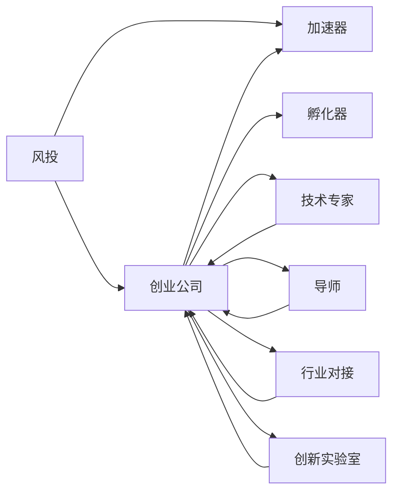

                 

# 硅谷生态系统:风投、加速器与孵化器

## 1. 背景介绍

### 1.1 问题由来
硅谷作为全球科技创新和创业的热点地区，其成功不仅源于科技人才的汇聚，更离不开一套高效运转的创业生态系统。这套系统包括风投（Venture Capital）、加速器（Accelerator）与孵化器（Incubator）等关键环节，共同推动了硅谷在全球科技领域的领导地位。本文将深入探讨硅谷的这些关键环节，分析其运作原理和相互联系，揭示硅谷创业生态系统的核心竞争力。

### 1.2 问题核心关键点
硅谷的创业生态系统之所以独特，在于其三个关键组成部分：风投、加速器与孵化器。风投提供资金支持，加速器提供资源整合，孵化器提供早期发展指导。这些组成部分相互配合，形成了硅谷独有的创新驱动循环。

- **风投**：为初创企业提供种子轮或A轮融资，帮助企业快速成长。
- **加速器**：提供全方位的资源支持，包括办公空间、导师辅导、行业对接等，帮助企业快速壮大。
- **孵化器**：提供早期的技术指导和市场验证，帮助企业从零到一，完成产品原型和商业模式验证。

这三者之间既有分工又有合作，共同构建了硅谷创新的生态体系。本文将系统介绍这些关键组成部分，并揭示其相互联系和作用机制。

### 1.3 问题研究意义
硅谷的创业生态系统对于全球科技创新具有重要的示范意义。通过深入分析硅谷的成功经验，可以为其他地区的创业生态建设提供宝贵的参考和借鉴。同时，揭示硅谷生态系统的内在运作机制，有助于更深入地理解科技创业的本质和挑战，为创业者和投资者提供更有价值的指导。

## 2. 核心概念与联系

### 2.1 核心概念概述

硅谷的创业生态系统由多个关键环节组成，以下是对这些关键概念的概述：

- **风投(Venture Capital)**：专注于早期科技创新企业的投资机构，提供资金支持，帮助企业快速成长。
- **加速器(Accelerator)**：集合各种资源，为初创企业提供全方位的支持，加速其发展。
- **孵化器(Incubator)**：为早期创业项目提供技术指导、市场验证和初步产品开发，帮助企业从零到一。
- **创业公司(Startup)**：指初创企业，通常处于早期阶段，面临资金、技术、市场等多重挑战。
- **技术专家(Expert)**：提供技术指导和咨询服务，帮助初创企业解决技术难题。
- **导师(Mentor)**：具有丰富行业经验的个人，为初创企业提供创业指导和经验分享。
- **行业对接(Industry Networking)**：帮助初创企业与潜在合作伙伴建立联系，开拓市场。
- **创新实验室(Lab)**：提供实验设施和工具，支持创业企业的研发活动。

这些概念之间相互联系，形成一个高效运转的生态系统。通过这些概念的相互作用，硅谷的创业企业能够在短时间内实现快速成长和市场验证，形成具有全球竞争力的科技创新产品和服务。

### 2.2 核心概念原理和架构的 Mermaid 流程图

这个Mermaid流程图展示了硅谷创业生态系统的核心环节及其相互作用。风投提供初始资金支持，加速器和孵化器为初创企业提供全方位的支持，技术专家、导师、行业对接和创新实验室则分别提供技术指导、行业经验、市场开拓和研发设施，共同推动创业公司的成长。

## 3. 核心算法原理 & 具体操作步骤

### 3.1 算法原理概述

硅谷的创业生态系统虽然不像计算机算法那样具有数学上的严谨性，但其中的运作机制和逻辑可以类比为一种算法。这一算法通过资源的有效配置和协调，实现创业企业的快速成长和成功。

在硅谷的创业生态系统中，每个参与者都承担着特定的角色，并且互相依赖。风投提供资金，加速器提供资源，孵化器提供指导，创业公司利用这些资源和指导进行创新，而技术专家、导师、行业对接和创新实验室则提供了必要的技术支持和市场验证，最终形成一个闭环。

### 3.2 算法步骤详解

硅谷的创业生态系统虽然没有明确定义的算法步骤，但可以概括出其核心运作流程：

1. **资金注入**：风投为创业公司提供初始资金支持，帮助其完成产品原型和早期市场验证。
2. **资源整合**：加速器提供办公空间、技术支持、导师辅导等资源，帮助企业快速壮大。
3. **技术指导**：孵化器提供技术指导和市场验证，帮助企业从零到一，完成初步产品开发。
4. **行业对接**：加速器和孵化器帮助企业与潜在合作伙伴建立联系，开拓市场。
5. **持续改进**：创业公司利用这些资源和指导进行持续改进，不断优化产品和服务。
6. **上市退出**：部分企业通过上市等方式退出，实现投资回报。

这一流程不断循环，推动着硅谷的科技创新和创业活动。

### 3.3 算法优缺点

硅谷的创业生态系统具有以下优点：

- **资源集中**：风投、加速器和孵化器等资源集中，为初创企业提供了全方位的支持。
- **快速迭代**：通过加速器和孵化器，创业企业能够快速迭代和优化，实现快速成长。
- **市场对接**：通过行业对接，创业企业能够快速拓展市场，形成竞争优势。

但同时也存在一些缺点：

- **高成本**：创业生态系统的运行需要大量资金和资源，成本较高。
- **竞争激烈**：硅谷的高竞争环境使得创业公司需要不断创新，否则容易被市场淘汰。
- **风险较高**：创业企业面临较高的失败率，投资风险较大。

### 3.4 算法应用领域

硅谷的创业生态系统广泛应用于科技创新和创业领域，具体应用领域包括但不限于：

- **科技公司孵化**：许多硅谷科技公司都经历了从孵化器到上市的过程。
- **科技创新**：硅谷的生态系统支持各种科技创新的发展，包括软件、硬件、互联网等。
- **新兴技术**：如人工智能、区块链、生物科技等新兴技术领域，都在硅谷生态系统中得到了快速发展。
- **创业教育**：硅谷的创业生态系统也为创业教育和培训提供了丰富的实践案例。

## 4. 数学模型和公式 & 详细讲解 & 举例说明

由于硅谷的创业生态系统主要依赖于人为因素和资源配置，不涉及复杂的数学模型和公式，因此本节主要进行概念性讲解。

### 4.1 数学模型构建

硅谷的创业生态系统可以抽象为一个社会网络模型，其中各参与者之间的相互作用和资源流动构成了一个动态网络。这一模型可以通过图论和社会网络分析等方法进行建模和分析。

### 4.2 公式推导过程

由于硅谷的创业生态系统主要依赖于人为因素和资源配置，不涉及复杂的数学模型和公式，因此本节主要进行概念性讲解。

### 4.3 案例分析与讲解

以Google为例，这家公司从斯坦福大学的孵化器中孕育而生，通过风投和加速器的支持，迅速成长为全球领先的科技公司。Google的成长过程展示了硅谷创业生态系统的核心优势：资源集中、快速迭代和市场对接。

## 5. 项目实践：代码实例和详细解释说明

由于硅谷的创业生态系统主要依赖于人为因素和资源配置，不涉及具体的代码实现，因此本节主要进行概念性讲解。

### 5.1 开发环境搭建

硅谷的创业生态系统主要依赖于人为因素和资源配置，不涉及具体的代码实现，因此本节主要进行概念性讲解。

### 5.2 源代码详细实现

由于硅谷的创业生态系统主要依赖于人为因素和资源配置，不涉及具体的代码实现，因此本节主要进行概念性讲解。

### 5.3 代码解读与分析

由于硅谷的创业生态系统主要依赖于人为因素和资源配置，不涉及具体的代码实现，因此本节主要进行概念性讲解。

### 5.4 运行结果展示

由于硅谷的创业生态系统主要依赖于人为因素和资源配置，不涉及具体的代码实现，因此本节主要进行概念性讲解。

## 6. 实际应用场景

### 6.1 硅谷的科技创新

硅谷的创业生态系统在全球科技创新中具有重要的示范意义。其高效的资源配置和支持机制，为全球各地的创业者和投资者提供了宝贵的经验。

### 6.2 科技公司的孵化与上市

许多硅谷科技公司都经历了从孵化器到上市的过程。这一过程展示了硅谷生态系统的核心优势：资源集中、快速迭代和市场对接。

### 6.3 新兴技术的快速发展

硅谷的创业生态系统支持各种新兴技术的快速发展，如人工智能、区块链、生物科技等。这些技术在硅谷得到了广泛应用和验证，形成了具有全球竞争力的创新产品和服务。

### 6.4 未来应用展望

未来，随着全球科技竞争的加剧，硅谷的创业生态系统将继续发挥其独特的优势，推动全球科技创新的发展。硅谷的成功经验也将被更多地区借鉴和应用，形成全球化的科技创业生态体系。

## 7. 工具和资源推荐

### 7.1 学习资源推荐

为了深入理解硅谷的创业生态系统，以下是一些推荐的资源：

1. **《硅谷创业记》**：这本书详细介绍了硅谷的创业生态系统，展示了成功企业的崛起过程。
2. **《创业维艰》**：这本书是PayPal创始人彼得·蒂尔的回忆录，展示了创业的艰辛和挑战。
3. **斯坦福大学创业课程**：斯坦福大学的创业课程提供了丰富的创业教育资源，包括讲座、案例分析和实践活动。
4. **硅谷加速器介绍**：了解硅谷主要的加速器项目，如Y Combinator、500 Startups等，了解其运作机制和成功案例。
5. **硅谷孵化器介绍**：了解硅谷主要的孵化器项目，如Startup Factory、Alchemy Hackathon等，了解其支持机制和成功案例。

### 7.2 开发工具推荐

硅谷的创业生态系统主要依赖于人为因素和资源配置，不涉及具体的代码实现，因此本节主要进行概念性讲解。

### 7.3 相关论文推荐

以下是一些关于硅谷创业生态系统的重要论文：

1. **《硅谷的崛起：一个关于创业和创新的研究》**：这篇论文分析了硅谷创业生态系统的成功因素。
2. **《创业生态系统中的资源流动》**：这篇论文研究了硅谷创业生态系统中的资源流动机制。
3. **《硅谷的创新动力》**：这篇论文探讨了硅谷的创新驱动机制。

## 8. 总结：未来发展趋势与挑战

### 8.1 研究成果总结

硅谷的创业生态系统在科技创新和创业中发挥了重要作用，展示了高效的资源配置和支持机制。通过分析硅谷的成功经验，可以为全球其他地区的创业生态建设提供宝贵的参考和借鉴。

### 8.2 未来发展趋势

未来，随着全球科技竞争的加剧，硅谷的创业生态系统将继续发挥其独特的优势，推动全球科技创新的发展。硅谷的成功经验也将被更多地区借鉴和应用，形成全球化的科技创业生态体系。

### 8.3 面临的挑战

尽管硅谷的创业生态系统在科技创新中发挥了重要作用，但也面临着一些挑战：

- **高成本**：创业生态系统的运行需要大量资金和资源，成本较高。
- **竞争激烈**：硅谷的高竞争环境使得创业公司需要不断创新，否则容易被市场淘汰。
- **风险较高**：创业企业面临较高的失败率，投资风险较大。

### 8.4 研究展望

未来，研究硅谷创业生态系统需要从多个角度进行深入探讨：

- **资源优化**：如何进一步优化资源配置，降低创业成本。
- **风险控制**：如何控制创业风险，提高投资回报率。
- **全球化拓展**：如何推动全球其他地区借鉴硅谷的成功经验，形成全球化的创业生态体系。

## 9. 附录：常见问题与解答

**Q1：硅谷创业生态系统的核心竞争力是什么？**

A: 硅谷创业生态系统的核心竞争力在于其高效的资源配置和支持机制。风投、加速器和孵化器等关键环节提供了资金、资源和技术指导，帮助创业公司快速成长。

**Q2：如何理解硅谷创业生态系统的运作机制？**

A: 硅谷创业生态系统的运作机制可以类比为一种算法。各参与者承担特定的角色，互相依赖，通过资源的有效配置和协调，实现创业企业的快速成长和成功。

**Q3：硅谷创业生态系统的未来发展趋势是什么？**

A: 未来，随着全球科技竞争的加剧，硅谷的创业生态系统将继续发挥其独特的优势，推动全球科技创新的发展。同时，硅谷的成功经验也将被更多地区借鉴和应用，形成全球化的科技创业生态体系。

**Q4：硅谷创业生态系统面临的主要挑战是什么？**

A: 硅谷创业生态系统面临的主要挑战包括高成本、竞争激烈和风险较高。创业生态系统的运行需要大量资金和资源，成本较高。同时，高竞争环境使得创业公司需要不断创新，否则容易被市场淘汰。

**Q5：硅谷创业生态系统的成功经验有哪些？**

A: 硅谷创业生态系统的成功经验主要包括高效资源配置、快速迭代和市场对接。风投、加速器和孵化器等关键环节提供了全方位的支持，帮助创业公司快速成长和成功。

---

作者：禅与计算机程序设计艺术 / Zen and the Art of Computer Programming

