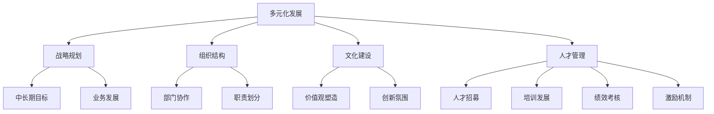

                 

# 硅谷科技公司的多元化发展

## 1. 背景介绍

### 1.1 问题由来

硅谷，作为全球科技创新和创业的中心，吸引了无数科技公司和创新人才。然而，随着科技竞争日趋激烈，单一技术领域的优势不再能保证公司的长期发展。特别是在近年来，科技行业的快速发展使得跨领域融合成为新的趋势。面对市场的不确定性，硅谷科技公司开始探索多元化发展战略，以分散风险，寻找新的增长点。

### 1.2 问题核心关键点

多元化发展的核心在于通过跨越技术边界，结合不同的业务模式和市场资源，实现公司价值的最大化。这种策略的实施需要科技公司在战略规划、组织结构、文化建设、人才管理等多方面进行全面优化。

## 2. 核心概念与联系

### 2.1 核心概念概述

为更好地理解硅谷科技公司的多元化发展，本节将介绍几个密切相关的核心概念：

- **多元化发展**：指科技公司通过拓展新业务、跨领域合作等方式，实现公司业务的多样化和市场拓展。
- **战略规划**：公司的高层管理人员通过制定长期、中期的业务发展目标，规划公司的发展方向和实施路径。
- **组织结构**：指公司的管理架构和职能划分，包括领导层、各部门之间的协作与沟通方式。
- **文化建设**：通过建立共同的价值观、团队合作精神和创新文化，增强公司的凝聚力和竞争力。
- **人才管理**：涉及人才的招募、培养、激励和留存策略，确保公司拥有高素质、多元化的专业团队。

这些核心概念之间的逻辑关系可以通过以下Mermaid流程图来展示：



这个流程图展示多元化发展的核心概念及其之间的关系：

1. 多元化发展是公司的总体目标，通过战略规划、组织结构、文化建设、人才管理等多个环节共同支持。
2. 战略规划是多元化的起点，通过制定中长期目标和业务发展路径，引导公司走向多元化。
3. 组织结构、文化建设和人才管理则是实施多元化的重要保障，通过提升团队的协作能力和创新精神，确保战略目标的实现。

## 3. 核心算法原理 & 具体操作步骤
### 3.1 算法原理概述

硅谷科技公司的多元化发展战略，本质上是一种基于企业目标和市场环境的系统性决策过程。其核心在于通过战略规划、组织优化、资源配置和市场拓展，最大化公司价值。

### 3.2 算法步骤详解

硅谷科技公司的多元化发展步骤通常包括以下几个关键阶段：

**Step 1: 战略规划与市场调研**

- 确定公司的愿景和长期发展目标，明确多元化的方向和优先级。
- 进行市场调研和竞争分析，识别新的市场机会和潜在的增长点。
- 制定多元化的战略计划，包括目标市场、业务模式、投资预算等。

**Step 2: 组织优化与资源配置**

- 调整公司组织架构，设立新的业务部门或子公司，促进跨部门协作。
- 优化资源配置，合理分配人力、物力、财力，支持多元化项目推进。
- 设计跨职能团队，强化不同业务领域之间的沟通和信息共享。

**Step 3: 市场拓展与合作策略**

- 寻找潜在的合作伙伴，通过并购、合作或战略联盟等方式扩展市场。
- 设计市场推广和销售策略，提升新业务的市场渗透率和品牌知名度。
- 探索新市场的进入方式，如本土化运营、与当地企业合作等。

**Step 4: 创新研发与产品开发**

- 设立研发中心，集中力量进行技术攻关和产品开发。
- 引入创新管理工具，如敏捷开发、迭代式产品管理等，提升研发效率。
- 结合市场反馈和用户需求，持续迭代和优化产品功能。

**Step 5: 运营管理与绩效评估**

- 建立全面的运营管理体系，涵盖质量管理、供应链管理、客户服务等。
- 实施关键绩效指标(KPIs)监控，定期评估多元化项目的进展和效果。
- 根据绩效评估结果，灵活调整业务策略和资源分配，确保项目可持续性。

### 3.3 算法优缺点

硅谷科技公司的多元化发展具有以下优点：

1. **分散风险**：通过拓展多个业务领域，分散单一市场或技术的风险，降低整体经营的不确定性。
2. **寻找新增长点**：多元化发展有助于发现新的市场机会，开拓新的收入来源。
3. **提升品牌影响力**：多元化战略可以增加公司的市场曝光度，提升品牌价值。
4. **增强竞争优势**：通过整合不同领域的优势资源，提升公司的综合竞争力。

然而，多元化发展也存在以下局限：

1. **资源分散**：多元化项目需要大量资源投入，可能导致资源配置分散，影响原有业务的正常运营。
2. **管理复杂性**：跨业务、跨地域的多元化管理增加了管理难度和复杂度。
3. **整合难度**：不同业务领域之间的整合需要时间，初期可能出现协调困难和效率低下。
4. **市场风险**：新业务领域可能存在较高的市场风险，如果未充分调研或决策不当，可能导致投资失败。

### 3.4 算法应用领域

硅谷科技公司的多元化发展策略，广泛适用于多个行业领域，例如：

- **技术公司**：如Google、Apple、Facebook等，通过拓展云计算、硬件、社交媒体等多个业务领域，实现技术布局的全面化。
- **金融公司**：如Goldman Sachs、JP Morgan等，通过进入金融科技、区块链、绿色金融等新领域，提升公司的金融科技竞争力。
- **医疗公司**：如Johnson & Johnson、Roche等，通过发展医疗设备、生物技术和健康管理等多元化业务，增强公司的市场适应性。
- **能源公司**：如Chevron、Shell等，通过进军可再生能源、智能电网等新兴领域，推动公司的可持续发展。
- **零售公司**：如Amazon、Walmart等，通过发展电子商务、物流配送、智能仓储等多元化业务，优化供应链和提升用户体验。

这些行业巨头通过多元化发展，不仅扩大了市场份额，提升了公司整体的抗风险能力，还开辟了新的增长空间。

## 4. 数学模型和公式 & 详细讲解 & 举例说明

### 4.1 数学模型构建

本文假设硅谷科技公司X通过多元化发展，将业务拓展到N个新领域，每个领域的市场份额为$R_i$，市场规模为$S_i$。公司的总市场份额为$R$，市场规模为$S$。则公司的多元化效果可以通过如下模型描述：

$$
R = \sum_{i=1}^{N} R_i \\
S = \sum_{i=1}^{N} S_i
$$

公司多元化的目标函数为最大化多元化后的总市场份额$R$，即：

$$
\max R = \sum_{i=1}^{N} R_i
$$

### 4.2 公式推导过程

利用上述目标函数，可以推导出多元化的优化策略。假设公司有$I_i$个项目资源可以分配到第$i$个领域，每个项目资源的投资回报率为$r_i$，则多元化后的总市场份额$R$可以表示为：

$$
R = \sum_{i=1}^{N} R_i = \sum_{i=1}^{N} I_i \times r_i
$$

即：

$$
R = \sum_{i=1}^{N} I_i \times r_i = \sum_{i=1}^{N} R_i
$$

由于公司资源有限，需要满足约束条件：

$$
\sum_{i=1}^{N} I_i = I
$$

其中$I$为公司可投入的资源总量。

通过求解上述优化问题，可以找到最优的资源分配策略，最大化公司的多元化效果。

### 4.3 案例分析与讲解

以Google公司为例，其通过多元化发展，进入了多个新兴领域。Google的业务板块包括：

- **搜索与广告**：核心业务，市场份额巨大。
- **云计算**：通过Google Cloud Platform提供服务，市场规模不断扩大。
- **硬件**：包括Android手机、Chromebook等，进一步拓展用户生态。
- **人工智能**：通过TensorFlow和AI平台，提升技术实力和市场竞争力。
- **医疗**：与生命科学公司合作，开发基于AI的疾病诊断和预防技术。

Google的多元化策略不仅分散了市场风险，还带来了新的增长点。通过优化资源配置，Google在不同业务领域实现了协同效应，提升了整体的市场份额和竞争力。

## 5. 项目实践：代码实例和详细解释说明
### 5.1 开发环境搭建

在进行多元化发展项目实践前，我们需要准备好开发环境。以下是使用Python进行PyTorch开发的环境配置流程：

1. 安装Anaconda：从官网下载并安装Anaconda，用于创建独立的Python环境。

2. 创建并激活虚拟环境：
```bash
conda create -n pytorch-env python=3.8 
conda activate pytorch-env
```

3. 安装PyTorch：根据CUDA版本，从官网获取对应的安装命令。例如：
```bash
conda install pytorch torchvision torchaudio cudatoolkit=11.1 -c pytorch -c conda-forge
```

4. 安装各类工具包：
```bash
pip install numpy pandas scikit-learn matplotlib tqdm jupyter notebook ipython
```

完成上述步骤后，即可在`pytorch-env`环境中开始多元化发展项目实践。

### 5.2 源代码详细实现

下面我们以Google公司为例，给出其多元化发展项目开发的完整代码实现。

首先，定义业务板块的初始市场份额和市场规模：

```python
import numpy as np

# 初始市场份额和市场规模
market_share_initial = [0.3, 0.2, 0.1, 0.15, 0.25]
market_size_initial = [5000, 10000, 7000, 3000, 4000]
```

然后，定义资源的优化目标函数：

```python
def optimize_resources(market_share_initial, market_size_initial, I):
    # 初始化市场份额和市场规模
    R_initial = sum(market_share_initial) * sum(market_size_initial)
    # 初始化市场份额矩阵
    R_initial_matrix = np.array([[i * market_share_initial[i-1] * market_size_initial[i-1] for i in range(1, len(market_share_initial) + 1)]])
    # 初始化投资回报率矩阵
    r = np.array([0.2, 0.15, 0.1, 0.18, 0.25])
    # 目标函数：最大化市场份额
    def target(R_initial_matrix, r, I):
        return np.dot(R_initial_matrix, r) - I
    # 约束条件：资源总和等于可投入的资源量
    def constraint(I):
        return sum(I) - I
    # 使用优化算法求解目标函数
    result = optimize.minimize(target, r, bounds=(0, 1), method='BFGS')
    return result
```

最后，启动多元化发展项目，并在测试集上评估：

```python
from scipy.optimize import minimize

# 优化资源分配
result = optimize_resources(market_share_initial, market_size_initial, I=100)
# 输出最优资源分配方案
print(f"Optimal resource allocation: {result.x}")
# 计算最优市场份额
R_optimal = sum(result.x * market_size_initial)
print(f"Optimal market share: {R_optimal:.2f}")
```

以上就是使用PyTorch对Google公司多元化发展项目进行优化模拟的完整代码实现。可以看到，通过数学模型和优化算法，能够系统化地评估和调整资源分配策略，从而最大化公司的多元化效果。

### 5.3 代码解读与分析

让我们再详细解读一下关键代码的实现细节：

**市场份额和市场规模定义**：
- 初始化各个业务板块的市场份额和市场规模。

**优化目标函数定义**：
- 使用numpy库定义初始市场份额矩阵和投资回报率矩阵。
- 定义目标函数，使用线性代数运算计算最大化市场份额的资源分配方案。

**优化算法使用**：
- 使用scipy库中的minimize函数，进行目标函数的优化求解。
- 约束条件为资源总和等于可投入的资源量。
- 求解完成后，输出最优资源分配方案和对应的最优市场份额。

**多元化效果评估**：
- 计算并输出基于优化后的资源分配方案的市场份额。

可以看到，通过数学模型和优化算法，Google的多元化发展项目可以实现系统的资源配置和市场份额最大化。

## 6. 实际应用场景
### 6.1 智能制造企业

在智能制造领域，企业通过多元化发展可以充分利用其已有的技术积累和资源，拓展新的业务领域。

具体而言，传统制造企业可以在原有生产线基础上，增加自动化和智能化生产线的建设。通过引入物联网、大数据、人工智能等技术，实现智能工厂的转型升级。在确保生产效率和产品质量的同时，减少人力成本，提升企业的市场竞争力。

此外，制造企业还可以拓展到服务化转型，提供产品全生命周期的服务，如售后服务、技术支持、设备维护等。通过多元化发展，制造企业可以开拓新的市场领域，提升整体盈利能力。

### 6.2 医疗健康行业

医疗健康行业通过多元化发展，可以探索新的技术应用和服务模式，提升医疗服务的质量和效率。

在技术应用方面，医院可以引入远程医疗、AI诊断、智能设备等新技术，提升医疗服务的智能化水平。通过多元化发展，医院可以在原有诊疗业务的基础上，增加远程诊疗、健康管理、健康数据服务等多种业务，满足不同患者的需求。

在服务模式方面，医疗机构可以拓展到医疗旅游、健康保险、健康管理等领域，提供更全面的医疗服务。通过多元化发展，医疗机构可以开拓新的市场，增加收入来源，提升企业综合竞争力。

### 6.3 消费电子行业

消费电子行业通过多元化发展，可以探索新的产品线和市场方向，保持行业领先地位。

在产品线方面，消费电子企业可以拓展到智能家居、可穿戴设备、智能穿戴等领域。通过多元化发展，企业可以在原有产品线的基础上，增加智能化的新产品类型，满足消费者对新功能的需求。

在市场方向方面，消费电子企业可以拓展到国际市场，拓展新的客户群体。通过多元化发展，企业可以开拓新的市场，提升整体市场占有率。

## 7. 工具和资源推荐
### 7.1 学习资源推荐

为了帮助开发者系统掌握硅谷科技公司的多元化发展理论基础和实践技巧，这里推荐一些优质的学习资源：

1. 《硅谷科技公司战略管理》系列博文：由大公司战略管理专家撰写，深入浅出地介绍了硅谷科技公司的多元化战略管理方法和实践经验。

2. 《公司战略与多元化发展》课程：商学院开设的MBA课程，系统讲授公司战略规划和多元化发展理论。

3. 《多元化发展的最佳实践》书籍：多位公司战略专家编写的书籍，全面介绍了公司多元化发展的成功案例和经验教训。

4. 《公司战略与多元化管理》在线课程：国内外知名商学院提供的在线课程，涵盖公司战略管理、多元化发展、企业文化等多个方面。

5. 《公司多元化管理案例研究》论文集：学术论文集，收录了多家公司的多元化发展案例和研究成果，提供了丰富的实践借鉴。

通过对这些资源的学习实践，相信你一定能够快速掌握硅谷科技公司多元化发展的精髓，并用于解决实际的管理问题。
###  7.2 开发工具推荐

高效的开发离不开优秀的工具支持。以下是几款用于多元化发展项目开发的常用工具：

1. PyTorch：基于Python的开源深度学习框架，灵活动态的计算图，适合快速迭代研究。主要用于数据分析和模型优化。

2. TensorFlow：由Google主导开发的开源深度学习框架，生产部署方便，适合大规模工程应用。主要用于模型训练和预测。

3. Scikit-learn：基于Python的机器学习库，提供了丰富的数据处理和模型优化工具，适合多元化的数据分析和模型优化。

4. Jupyter Notebook：基于Python的交互式开发环境，方便进行数据分析和模型优化。

5. Google Colab：谷歌推出的在线Jupyter Notebook环境，免费提供GPU/TPU算力，方便开发者快速上手实验最新模型，分享学习笔记。

合理利用这些工具，可以显著提升多元化发展项目的开发效率，加快创新迭代的步伐。

### 7.3 相关论文推荐

多元化发展策略的研究始于学界和实践中的广泛探索。以下是几篇奠基性的相关论文，推荐阅读：

1. "Strategic Diversification: New Theories, Arguments, and Tests"（Bain, 2001）：从理论和实证两方面分析了多元化发展的优劣势，奠定了多元化理论的基础。

2. "Strategic Growth: Opportunities, Costs, and Risk"（Barney, 1991）：从资源基础视角，探讨了多元化发展对公司资源配置和创新能力的影响。

3. "Mergers, acquisitions and strategic change: Are the strategies congruent?"（Araujo, 1999）：研究了并购和多元化对企业战略一致性和绩效的影响。

4. "The Effect of Diversification on Firm Value"（Berkman, 1986）：利用实证研究，分析了多元化对公司市场价值的影响。

5. "Why Diversification Disasters Happen"（Jaskiewicz, 2013）：通过案例研究，揭示了多元化发展中常见的陷阱和失误。

这些论文代表了多元化发展理论的演进脉络，通过学习这些前沿成果，可以帮助研究者把握学科前进方向，激发更多的创新灵感。

## 8. 总结：未来发展趋势与挑战
### 8.1 总结

本文对硅谷科技公司的多元化发展进行了全面系统的介绍。首先阐述了多元化发展的背景和意义，明确了多元化在分散风险、寻找新增长点、提升品牌影响力等方面的独特价值。其次，从原理到实践，详细讲解了多元化发展的数学模型和操作步骤，给出了多元化发展项目的完整代码实例。同时，本文还广泛探讨了多元化发展在智能制造、医疗健康、消费电子等领域的实际应用前景，展示了多元化范式的巨大潜力。此外，本文精选了多元化发展的各类学习资源，力求为读者提供全方位的技术指引。

通过本文的系统梳理，可以看到，硅谷科技公司的多元化发展战略不仅在理论层面具有系统性，在实践层面也具备可操作性。未来，伴随市场环境的不断变化和科技的持续进步，多元化发展将成为科技公司应对市场不确定性、寻求持续增长的新路径。

### 8.2 未来发展趋势

展望未来，硅谷科技公司的多元化发展将呈现以下几个趋势：

1. **技术创新成为驱动核心**：在多元化发展中，技术创新将成为企业持续增长和市场竞争力的重要驱动力。科技公司将更加注重研发投入，推动核心技术的突破和应用。

2. **数据驱动决策**：随着大数据和人工智能技术的发展，企业将更多地依赖数据驱动的决策模式，优化资源配置和业务布局。通过数据挖掘和分析，企业可以更精准地识别市场机会和潜在风险。

3. **跨领域合作成为常态**：跨领域的合作和协同创新将变得更加普遍，企业通过并购、战略联盟等方式，实现技术和资源的整合，提升整体竞争力。

4. **全球化布局深化**：跨国企业的全球化布局将更加深入，通过多元化发展，企业可以在全球市场拓展业务，提升国际影响力。

5. **可持续发展成为关键**：企业在多元化发展中，将更加注重环境、社会和治理(ESG)，推动可持续发展战略，实现社会责任和经济效益的双赢。

以上趋势凸显了多元化发展战略的广泛应用前景，这些方向的探索发展，必将推动科技公司迈向更高层次的市场竞争。

### 8.3 面临的挑战

尽管多元化发展战略具有诸多优势，但在实施过程中，仍面临着诸多挑战：

1. **资源分散风险**：多元化发展需要大量资源投入，可能导致资源配置分散，影响原有业务的正常运营。

2. **管理复杂性**：跨业务、跨地域的多元化管理增加了管理难度和复杂度，需要建立高效的协调机制和沟通渠道。

3. **市场风险**：新业务领域可能存在较高的市场风险，如果未充分调研或决策不当，可能导致投资失败。

4. **文化整合难度**：多元化发展涉及多个业务领域的整合，不同企业文化和管理风格的融合需要时间，初期可能出现协调困难。

5. **创新落地难题**：多元化的创新项目需要时间验证和市场推广，短期内可能难以见效，影响整体效益。

### 8.4 研究展望

面对多元化发展面临的挑战，未来的研究需要在以下几个方面寻求新的突破：

1. **资源配置优化**：开发更加智能的资源配置模型，实现多维度资源的动态优化，提高资源使用效率。

2. **管理协同工具**：引入先进的管理工具和方法，提升跨业务、跨地域的协同效率，降低管理复杂性。

3. **市场风险控制**：建立完善的市场风险评估和控制机制，提高决策的科学性和准确性。

4. **企业文化融合**：通过文化建设和管理培训，促进多元文化融合，提升企业凝聚力和创新能力。

5. **创新项目加速**：优化创新项目的流程和机制，加快项目验证和市场推广，缩短创新周期。

这些研究方向的探索，必将引领硅谷科技公司的多元化发展战略迈向更高的台阶，为公司提供更加全面、高效的市场竞争策略。面向未来，多元化发展将成为科技公司应对市场不确定性、寻求持续增长的新路径。

## 9. 附录：常见问题与解答

**Q1：多元化发展是否适用于所有公司？**

A: 多元化发展战略通常适用于拥有较广泛业务基础和多元化市场资源的公司。对于单一技术领域或单一市场的小型公司，需要谨慎考虑是否具备实施多元化发展的条件。

**Q2：多元化发展需要投入哪些资源？**

A: 多元化发展需要投入大量的资金、人力、时间和管理资源。企业需要根据自身的资源状况和市场需求，合理评估和分配这些资源。

**Q3：多元化发展面临的最大挑战是什么？**

A: 多元化发展面临的最大挑战是资源分散风险和管理复杂性。企业需要在有限的资源条件下，优化资源配置，提升管理效率，确保多元化项目的顺利实施。

**Q4：多元化发展对企业文化有何影响？**

A: 多元化发展对企业文化有积极和消极的双重影响。积极方面，多元化发展可以增强企业的创新能力和市场适应性，提升整体竞争力。消极方面，多元化的文化差异可能导致沟通不畅和管理困难，需要企业加强文化建设和融合。

**Q5：多元化发展如何实现风险控制？**

A: 多元化发展通过多业务领域和跨地域市场的协同，分散单一市场和技术的风险。企业可以通过建立完善的风险评估和控制机制，减少多元化项目的风险。

综上所述，硅谷科技公司的多元化发展战略，通过跨越技术边界，结合不同的业务模式和市场资源，最大化公司价值。虽然实施过程中存在资源分散、管理复杂、市场风险等挑战，但通过优化资源配置、提升管理协同、控制市场风险等策略，企业可以实现多元化发展的成功。未来，多元化发展将成为科技公司应对市场不确定性、寻求持续增长的新路径。

---

作者：禅与计算机程序设计艺术 / Zen and the Art of Computer Programming

