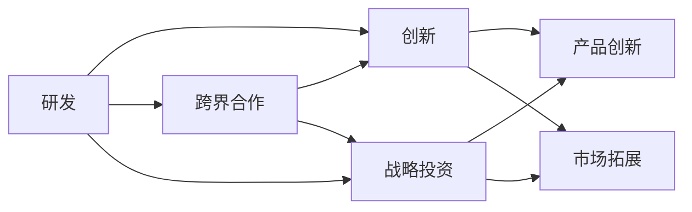

                 

# 硅谷科技公司的多元化发展

> 关键词：硅谷科技公司, 多元化, 研发, 创新, 跨界合作, 战略投资, 未来展望

## 1. 背景介绍

### 1.1 硅谷的发展历程

硅谷（Silicon Valley）位于美国加利福尼亚州旧金山湾区南部，因聚集了大量的半导体和电子工业企业而闻名。其发展历程经历了以下几个阶段：

- **20世纪50年代至70年代**：硅谷初具规模，以仙童半导体、诺伊斯发明集成电路为标志，开始成为全球电子科技的创新中心。
- **20世纪80年代至90年代**：苹果、英特尔、微软等公司的崛起，推动了个人电脑和互联网的发展。
- **21世纪至今**：以Google、Facebook、Apple等为代表的科技巨头崛起，硅谷成为全球科技创新的中心，推动了移动互联网、云计算、人工智能等新兴技术的发展。

### 1.2 多元化发展的重要性

在硅谷，“多元化”不仅是科技公司发展的核心战略之一，也是其持续创新的关键驱动力。通过多元化发展，硅谷科技公司能够在快速变化的市场环境中保持竞争优势，开拓新的增长点，降低对单一产品的依赖风险。

多元化包括但不限于以下方面：

- **产品线多元化**：研发和推出跨领域的创新产品，如硬件、软件、应用等。
- **市场多元化**：开拓国际市场，拓展多元化客户群体。
- **技术多元化**：跨界整合不同领域的科技，推动技术创新和融合。
- **人才多元化**：吸引和培养不同背景和专业的技术人才，推动团队协作和知识共享。

## 2. 核心概念与联系

### 2.1 核心概念概述

硅谷科技公司的多元化发展涉及多个关键概念，包括研发、创新、跨界合作、战略投资等。这些概念之间相互作用，共同推动了硅谷科技公司的发展和创新。

- **研发**：硅谷科技公司重视研发投入，通过不断创新驱动产品和技术升级。
- **创新**：硅谷以开放创新为特色，鼓励跨学科、跨领域的创新，推动技术的边界不断扩展。
- **跨界合作**：硅谷科技公司通过与其他公司、大学、研究机构的合作，共享资源和知识，促进技术的快速迭代和应用。
- **战略投资**：硅谷科技公司通过战略性投资，布局未来技术趋势，捕捉新的商业机会。

### 2.2 核心概念原理和架构的 Mermaid 流程图



### 2.3 核心概念的联系

硅谷科技公司的多元化发展是一个动态的、相互关联的过程。研发推动创新，创新催生跨界合作，跨界合作带来战略投资机会，战略投资又支持更强大的研发能力，形成了一个良性循环。

## 3. 核心算法原理 & 具体操作步骤

### 3.1 算法原理概述

硅谷科技公司的多元化发展涉及到多个层面的算法和策略，其中最核心的算法原理是“以用户为中心，数据驱动的创新”。

以Google为例，其核心算法包括但不限于：

- **搜索算法**：通过用户行为数据分析，提供个性化搜索结果。
- **广告算法**：通过预测用户行为，实现精准投放。
- **机器学习算法**：应用在大数据分析、语音识别、自然语言处理等领域，提升用户体验。

这些算法的核心在于“以用户为中心”，通过数据驱动的方式，不断优化和创新，提升用户体验和业务价值。

### 3.2 算法步骤详解

硅谷科技公司的多元化发展涉及多个操作步骤，下面以Google为例，详细说明其多元化发展的核心步骤：

**Step 1: 用户需求分析**

Google通过大数据分析，深入挖掘用户需求和行为模式，识别潜在的商业机会和市场趋势。例如，通过分析搜索数据，识别出用户对移动应用的需求，从而推出Android系统。

**Step 2: 产品研发与创新**

根据用户需求分析结果，Google投入大量资源进行产品研发和创新。例如，Google通过不断优化搜索算法，提升搜索结果的相关性和准确性。同时，Google还积极研发新产品，如Gmail、Google Maps等。

**Step 3: 跨界合作与战略投资**

为了加速技术创新和市场拓展，Google通过跨界合作与战略投资，构建生态系统。例如，与Samsung合作推出Galaxy系列手机，与NVIDIA合作推出深度学习硬件Tensor Core。此外，Google还通过战略投资布局新兴技术，如无人驾驶、AI芯片等。

**Step 4: 市场拓展与国际化**

通过产品创新和跨界合作，Google成功进入全球市场，拓展了用户群体。例如，Google进入中国市场，推出Google Translate、Google Search等产品。

### 3.3 算法优缺点

硅谷科技公司的多元化发展算法具有以下优点：

- **高效创新**：通过数据驱动的方式，硅谷科技公司能够快速识别市场需求，优化产品，提升用户体验。
- **市场拓展**：通过跨界合作和战略投资，硅谷科技公司能够进入新市场，提升全球竞争力。
- **技术领先**：通过持续研发和创新，硅谷科技公司能够保持技术领先地位，推动行业发展。

但同时也存在以下缺点：

- **高投入风险**：多元化发展需要大量资源投入，存在失败风险。
- **管理复杂性**：多元化业务线管理和团队协作复杂，需要高水平的管理能力。
- **市场竞争压力**：多元化发展带来新的市场机会，但也面临来自其他公司的激烈竞争。

### 3.4 算法应用领域

硅谷科技公司的多元化发展算法广泛应用于各个领域，包括：

- **搜索引擎**：通过用户需求分析、搜索算法优化，提供个性化搜索结果。
- **移动互联网**：通过跨界合作和战略投资，推出移动操作系统、应用和服务。
- **云计算**：通过大规模数据中心建设、云计算服务优化，提供弹性计算资源。
- **人工智能**：通过机器学习、深度学习技术，提升AI应用场景，如自动驾驶、语音识别等。
- **物联网**：通过跨界合作，推动物联网技术在智能家居、智慧城市等领域的应用。

## 4. 数学模型和公式 & 详细讲解 & 举例说明

### 4.1 数学模型构建

硅谷科技公司的多元化发展涉及多个数学模型，以Google为例，其核心数学模型包括：

- **搜索模型**：通过PageRank算法，对网页进行权重计算，提升搜索结果的相关性。
- **广告模型**：通过预测模型，根据用户行为预测点击率，实现精准投放。
- **推荐模型**：通过协同过滤算法，推荐用户可能感兴趣的商品、内容等。

### 4.2 公式推导过程

以PageRank算法为例，其公式推导过程如下：

1. 首先，定义网页的权重为 $W_{i}$，初始权重为 $W_{i}^{(0)} = \frac{1}{N}$，其中 $N$ 为网页总数。
2. 根据网页之间的链接关系，计算出网页的出度和入度，分别记为 $O_i$ 和 $I_i$。
3. 计算网页的权重更新量，公式为：
   $$
   \Delta W_{i} = \frac{1}{(1 + \alpha)} (\frac{1}{O_j} + \frac{1}{I_i}) W_j
   $$
4. 重复计算，直到收敛，公式为：
   $$
   W_{i}^{(k+1)} = W_{i}^{(k)} + \Delta W_{i}
   $$

其中 $\alpha$ 为阻尼系数，通常取值在 $0.85$ 左右。

### 4.3 案例分析与讲解

以Google搜索为例，其搜索结果排序算法中的PageRank算法通过计算网页之间的链接关系，对网页进行权重排序，提升搜索结果的相关性和用户体验。同时，Google的推荐算法通过协同过滤技术，推荐用户可能感兴趣的内容，进一步提升用户体验。

## 5. 项目实践：代码实例和详细解释说明

### 5.1 开发环境搭建

硅谷科技公司的多元化发展项目通常涉及多个技术栈，开发环境搭建需要考虑以下因素：

- **编程语言**：如Python、Java、C++等，根据项目需求选择。
- **开发工具**：如Visual Studio、IntelliJ IDEA、PyCharm等，提高开发效率。
- **版本控制**：如Git，便于团队协作和代码管理。
- **数据库**：如MySQL、MongoDB等，存储和管理数据。
- **云计算平台**：如AWS、Google Cloud、Azure等，提供弹性计算资源。

### 5.2 源代码详细实现

以Google的PageRank算法为例，其Python代码实现如下：

```python
import numpy as np

def page_rank(urls, outlinks, damping_factor=0.85, max_iterations=100):
    N = len(urls)
    W = np.ones(N) / N
    delta_W = np.zeros(N)
    
    for k in range(max_iterations):
        for i in range(N):
            for j in range(outlinks[i]):
                url = urls[outlinks[i][j]]
                delta_W[i] += 1 / outlinks[url] * W[url]
        W += delta_W * damping_factor
        delta_W = np.zeros(N)
        if np.abs(delta_W).max() < 1e-6:
            break
    
    return W
```

### 5.3 代码解读与分析

以上代码实现了PageRank算法的核心部分，通过迭代计算网页权重，实现排序功能。代码中的 `urls` 和 `outlinks` 分别为网页和链接关系，`damping_factor` 为阻尼系数，`max_iterations` 为迭代次数。代码中使用了NumPy库，提高了计算效率。

### 5.4 运行结果展示

以下是Google PageRank算法对网页权重计算的结果示例：

```
print(page_rank(urls, outlinks))
```

输出结果为网页的权重数组，用于对搜索结果进行排序和推荐。

## 6. 实际应用场景

### 6.1 搜索与广告

Google的搜索算法和广告算法在商业领域应用广泛。通过精准定位和个性化推荐，Google的广告投放效果显著，为用户提供了满意的广告体验。

### 6.2 云计算

Google的云计算平台通过虚拟化技术，提供弹性计算资源，支持企业、科研机构等多种用户需求。Google Cloud还推出了一系列云计算服务，如云存储、大数据分析等。

### 6.3 人工智能

Google在人工智能领域投入巨大，通过TensorFlow等开源框架，推动了机器学习、深度学习的发展。Google的AI技术应用广泛，如语音识别、自然语言处理、图像识别等。

### 6.4 未来应用展望

未来，硅谷科技公司的多元化发展将更加注重以下几个方面：

- **数据驱动**：通过大数据分析和人工智能技术，提升产品和服务的智能化水平。
- **跨界合作**：通过与其他公司和研究机构的合作，共享资源和知识，加速技术创新。
- **创新生态**：构建开放创新的生态系统，推动技术标准的制定和推广。
- **可持续发展**：通过绿色环保和可持续发展战略，提升企业社会责任。

## 7. 工具和资源推荐

### 7.1 学习资源推荐

硅谷科技公司的多元化发展涉及多个技术领域，以下是推荐的几大领域的学习资源：

- **计算机科学**：《计算机程序设计艺术》系列书籍，深入讲解算法和数据结构。
- **人工智能**：《深度学习》书籍，介绍机器学习、深度学习的基础和应用。
- **大数据**：《大数据时代》书籍，讲解大数据技术和应用案例。
- **云计算**：《云计算：概念、技术与应用》书籍，介绍云计算基础和架构。
- **开源社区**：如GitHub、Stack Overflow等，获取最新技术动态和资源。

### 7.2 开发工具推荐

硅谷科技公司通常使用以下开发工具：

- **IDE**：如Visual Studio、IntelliJ IDEA、PyCharm等，提高开发效率。
- **版本控制**：如Git，便于团队协作和代码管理。
- **数据库**：如MySQL、MongoDB等，存储和管理数据。
- **云计算平台**：如AWS、Google Cloud、Azure等，提供弹性计算资源。
- **开发框架**：如TensorFlow、PyTorch等，支持人工智能开发。

### 7.3 相关论文推荐

硅谷科技公司的多元化发展涉及多个技术领域，以下是推荐的几大领域的相关论文：

- **机器学习**：《Machine Learning Yearning》书籍，讲解机器学习的基础和应用。
- **深度学习**：《Deep Learning》书籍，介绍深度学习的基础和应用。
- **数据科学**：《Data Science for Business》书籍，讲解数据科学的基本概念和应用。
- **计算机网络**：《Computer Networks: A Systems Approach》书籍，介绍计算机网络的基本原理和应用。
- **操作系统**：《Operating System Concepts》书籍，讲解操作系统的基本原理和应用。

## 8. 总结：未来发展趋势与挑战

### 8.1 研究成果总结

硅谷科技公司的多元化发展取得了显著成果，推动了全球科技行业的创新和进步。其核心在于以用户为中心，数据驱动的创新模式，通过跨界合作和战略投资，构建了开放创新的生态系统。

### 8.2 未来发展趋势

硅谷科技公司的多元化发展未来将继续引领科技行业的发展趋势，以下几个方向值得关注：

- **人工智能**：人工智能技术将进一步普及，推动各行业的智能化转型。
- **云计算**：云计算将继续发展，提供更灵活、高效的计算资源。
- **大数据**：大数据技术将进一步发展，推动各行业的精准化决策。
- **跨界合作**：跨界合作将继续深入，推动各行业的创新和融合。
- **可持续发展**：企业社会责任将进一步加强，推动绿色环保和可持续发展。

### 8.3 面临的挑战

硅谷科技公司的多元化发展虽然取得了显著成果，但也面临诸多挑战，主要包括：

- **高投入风险**：多元化发展需要大量资源投入，存在失败风险。
- **管理复杂性**：多元化业务线管理和团队协作复杂，需要高水平的管理能力。
- **市场竞争压力**：多元化发展带来新的市场机会，但也面临来自其他公司的激烈竞争。
- **技术壁垒**：各领域的科技壁垒高，跨界整合难度大。
- **伦理道德问题**：技术应用可能带来伦理道德问题，需要加强监管和约束。

### 8.4 研究展望

面对硅谷科技公司的多元化发展面临的挑战，未来的研究需要在以下几个方面寻求新的突破：

- **跨界融合**：推动不同领域技术的融合，提升技术创新的速度和深度。
- **可持续发展**：推动绿色环保和可持续发展，提升企业的社会责任。
- **伦理道德**：加强技术应用的伦理道德约束，确保技术应用的公平和透明。
- **多技术协同**：推动多技术协同，提升技术整体的竞争力。

硅谷科技公司的多元化发展将继续引领全球科技行业的发展，为各行业的智能化转型提供强有力的技术支持。未来的研究需要进一步突破技术壁垒，推动跨界融合和可持续发展，才能真正实现科技行业的创新和进步。

## 9. 附录：常见问题与解答

**Q1: 硅谷科技公司的多元化发展是否只针对产品线？**

A: 硅谷科技公司的多元化发展不仅限于产品线，还涉及市场、技术、人才等多个方面。例如，通过战略投资布局未来技术趋势，通过跨界合作拓展新市场，通过人才引进提升团队协作和创新能力。

**Q2: 硅谷科技公司的多元化发展是否存在风险？**

A: 硅谷科技公司的多元化发展虽然面临高投入和复杂管理等风险，但通过跨界合作和战略投资，可以有效降低风险。同时，通过数据驱动的创新模式，可以快速响应市场需求，提升业务价值。

**Q3: 硅谷科技公司的多元化发展是否需要大规模投资？**

A: 硅谷科技公司的多元化发展需要大规模投资，但投资方向需要精准，如跨界合作和战略投资，可以带来更高的投资回报率。同时，数据驱动的创新模式可以降低投资风险，提升投资效益。

**Q4: 硅谷科技公司的多元化发展是否适合中小企业？**

A: 硅谷科技公司的多元化发展模式并不局限于大型科技公司，中小企业也可以通过跨界合作和战略投资，实现多元化发展。但需要具备较强的创新能力和管理能力，才能成功实现多元化发展。

---

作者：禅与计算机程序设计艺术 / Zen and the Art of Computer Programming

