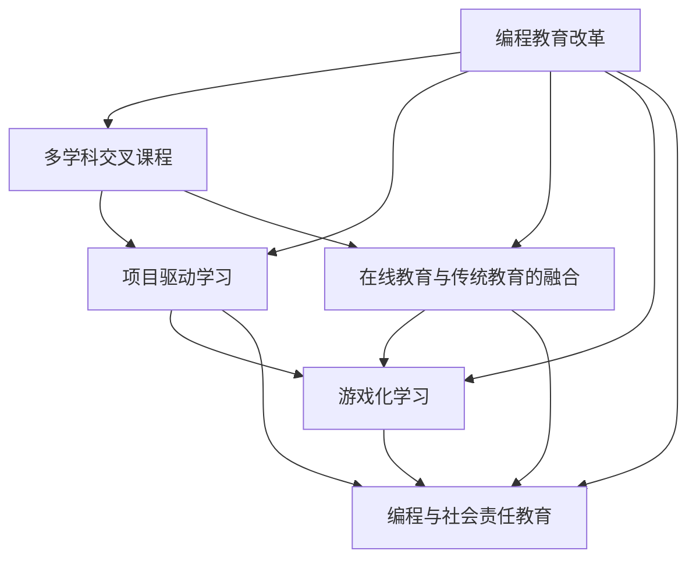

                 

# 硅谷编程教育改革的实践与挑战

> 关键词：编程教育,硅谷,人工智能,创新,挑战,变革

## 1. 背景介绍

### 1.1 问题由来
在21世纪信息技术日新月异，人工智能(AI)、机器学习、大数据等前沿科技对社会各领域产生深远影响的背景下，编程教育的重要性日益凸显。随着计算机科学的发展，编程能力不仅成为计算机工程师必备的核心技能，也被广泛认为是解决复杂问题的通用工具。因此，全球范围内的编程教育改革势在必行。

硅谷作为全球科技创新中心，不仅拥有大量的科技企业、创业公司，更汇聚了诸多顶尖高等教育机构和研究实验室。硅谷的编程教育模式和实践经验对全球具有深远的借鉴意义。本文将重点探讨硅谷编程教育的改革历程、实践策略与面临的挑战。

### 1.2 问题核心关键点
硅谷编程教育的改革旨在通过创新教育方式、提升教育质量，培养具备适应未来发展需求的人才。具体关键点包括：
- 强调实践与实验，通过真实项目和案例教学，培养学生的动手能力和实际应用能力。
- 引入多学科交叉课程，拓宽学生视野，提升综合素养。
- 推动在线教育与传统教育的融合，提供灵活的学习方式。
- 强调代码与逻辑思维的培养，注重编程思想与算法原理的训练。
- 创新编程教育模式，如游戏化学习、项目驱动学习等，激发学生的学习兴趣。
- 注重社会责任与职业道德教育，培养具有社会责任感的科技人才。

本文将从这些关键点出发，全面阐述硅谷编程教育改革的实践与挑战。

## 2. 核心概念与联系

### 2.1 核心概念概述

硅谷编程教育的改革涉及多个关键概念，这些概念之间存在着密切的联系，共同构成了硅谷编程教育的核心体系：

- **编程教育改革**：指通过改变教学内容、方法、评估方式等，提升编程教育质量，适应社会和科技发展的教育实践。
- **多学科交叉课程**：将编程与其他学科如数学、物理、心理学等结合，培养学生跨学科思维和综合能力。
- **项目驱动学习**：通过具体项目设计教学目标，培养学生解决实际问题的能力，提升其团队合作和项目管理能力。
- **在线教育与传统教育的融合**：利用线上课程、MOOCs、远程教学等手段，结合传统课堂教学，提供灵活多样的学习方式。
- **游戏化学习**：通过游戏化的方式激发学生的学习兴趣，提升学习动机。
- **编程与社会责任教育**：在编程教育中融入社会责任和伦理教育，培养具备良好职业道德的社会公民。

这些概念通过相互协作，共同推动硅谷编程教育改革的深入发展。

### 2.2 核心概念原理和架构的 Mermaid 流程图



这个流程图展示了硅谷编程教育改革的各个核心概念及其相互关联。改革不仅关注编程技能的培养，更注重跨学科思维、实际项目能力的提升，以及职业道德与社会责任感的塑造。

## 3. 核心算法原理 & 具体操作步骤

### 3.1 算法原理概述

硅谷编程教育改革的核心算法原理是“以学生为中心，以实践为导向”。通过引入实际项目、多学科交叉课程、游戏化学习等方法，构建学生为中心的教育体系，使学生在真实场景中学习和实践，从而培养其编程能力和综合素养。

### 3.2 算法步骤详解

硅谷编程教育改革的实施步骤主要包括以下几个方面：

**Step 1: 课程设计与优化**
- 针对不同年级和专业的学生，设计层次分明、难度递增的课程体系。
- 引入项目驱动的教学方法，通过真实项目让学生了解行业需求和解决实际问题的过程。
- 增加多学科交叉课程，培养学生跨学科思维和团队合作能力。

**Step 2: 教学工具与资源的开发**
- 开发和利用在线教育平台、MOOCs等工具，提供在线课程和学习资源。
- 引入先进的教学工具和技术，如编程环境、模拟器、虚拟实验室等，提升教学效果。
- 组织开放课程和学术交流活动，促进学生之间的互动和交流。

**Step 3: 评估与反馈机制的建立**
- 建立全面的评估体系，包括过程性评价和结果性评价。
- 采用多种评估方式，如项目评审、案例分析、同行评议等，全面考察学生的综合能力。
- 根据评估结果及时调整教学内容和方法，确保教育质量。

**Step 4: 师资队伍的建设**
- 提升教师的编程能力和教学水平，定期进行培训和考核。
- 引进业界专家和企业导师，参与课程设计和项目指导。
- 鼓励教师进行科研创新，推动教育改革的持续发展。

### 3.3 算法优缺点

硅谷编程教育改革的优点包括：
- **提升实践能力**：通过项目驱动教学，培养学生的实际问题解决能力，使其更好地适应职场需求。
- **激发学习兴趣**：游戏化学习等创新手段能够提高学生的学习动机和参与度，提升学习效果。
- **拓宽学科视野**：多学科交叉课程培养学生的综合素养，使其具备更广泛的知识背景。

然而，改革也存在一些挑战：
- **师资力量不足**：优秀的编程教师数量有限，难以满足大规模教育需求。
- **资源配置不均**：线上和线下资源分布不均，可能加剧教育资源的不平衡。
- **评估体系复杂**：多维度的评估体系增加了教师和学生的工作量，需要更加科学合理的设计。
- **学生负担过重**：过多的项目和课程可能导致学生负担过重，影响其身心健康。

### 3.4 算法应用领域

硅谷编程教育改革的成果已在多个领域得到应用和验证，具体包括：

- **高等教育**：斯坦福大学、加州大学伯克利分校等顶尖高校纷纷引入改革课程，培养更多具有创新能力和实际应用能力的高级人才。
- **中小学教育**：编程纳入中小学课程，提升学生的信息素养和科技兴趣。
- **企业培训**：许多科技公司如Google、Facebook等通过编程教育改革项目，提升员工的技能和创新能力。
- **社区教育**：硅谷的社区大学和培训机构也积极推广编程教育改革，提升社区居民的科技素养。

## 4. 数学模型和公式 & 详细讲解 & 举例说明

### 4.1 数学模型构建

硅谷编程教育改革的数学模型可以概括为“系统化、多层次、全过程”的教育模型，具体如下：

1. **系统化**：课程设计注重系统性和完整性，涵盖从基础到高级的各个层次，确保学生能够系统掌握编程知识和技能。
2. **多层次**：针对不同年龄段和专业背景的学生，设计层次分明、难度递增的课程体系，满足不同层次的需求。
3. **全过程**：从课程设计、教学实施、评估反馈到师资建设，形成一个闭环，确保教育效果的持续提升。

### 4.2 公式推导过程

以项目驱动学习为例，假设学生在课程中需要完成一个基于实际需求的编程项目 $P$，该项目的数学模型为：

$$
P = (I_0, A, O, E)
$$

其中，$I_0$ 表示项目目标和需求，$A$ 表示项目实施过程中的算法和逻辑，$O$ 表示项目输出结果，$E$ 表示项目的评估标准。

### 4.3 案例分析与讲解

以斯坦福大学计算机科学课程为例，该课程将实际项目与课堂教学相结合，学生需完成多个由业界专家设计的大型项目，项目流程如下：

1. **需求分析**：学生通过课程学习，理解项目需求和背景。
2. **设计方案**：学生根据需求分析结果，设计项目方案，包括算法、数据结构等。
3. **编码实现**：学生使用C++、Python等编程语言，实现项目方案。
4. **测试与优化**：学生对项目进行测试，发现并解决算法、代码中的问题，不断优化项目性能。
5. **项目交付**：学生编写项目报告，进行项目演示和答辩。

## 5. 项目实践：代码实例和详细解释说明

### 5.1 开发环境搭建

开发环境搭建是编程教育改革的重要环节，具体步骤如下：

1. **选择编程语言和环境**：根据课程需求，选择合适的编程语言和开发环境，如Python、Java、C++等。
2. **安装必要的软件和工具**：如IDE、调试器、版本控制系统等。
3. **搭建在线开发平台**：使用Google Colab、Jupyter Notebook等在线开发平台，方便学生随时随地进行编程练习。

### 5.2 源代码详细实现

以下是一个基于Python的在线编程教育的示例代码实现：

```python
from IPython import display
from IPython.display import HTML

# 创建一个HTML页面，展示课程内容
def create_html_page(title, content):
    page = HTML("<h1>" + title + "</h1>")
    page += HTML("<div>" + content + "</div>")
    display.display(page)

# 示例课程内容
def course_content():
    return """
    <h2>Python编程基础</h2>
    <p>本课程将介绍Python的基本语法和常用库。</p>
    <h3>课程大纲</h3>
    <ul>
        <li>Python基本语法</li>
        <li>数据结构与算法</li>
        <li>常用库介绍</li>
        <li>编程实践与项目设计</li>
    </ul>
    """

# 创建一个包含课程标题和内容的HTML页面
create_html_page("Python编程基础", course_content())
```

### 5.3 代码解读与分析

**示例代码的解读**：

- 导入必要的模块：IPython.display和HTML，用于创建和展示HTML页面。
- 定义创建HTML页面的函数create_html_page，该函数接受课程标题和内容，返回一个包含标题和内容的HTML页面。
- 定义展示课程内容的函数course_content，该函数返回一个包含课程大纲的HTML页面。
- 调用create_html_page函数，展示课程标题和内容。

**代码分析**：

- IPython.display和HTML模块是Jupyter Notebook内置的展示工具，通过HTML标签和样式，可以将课程内容格式化展示。
- create_html_page函数使用HTML标签生成课程页面，display.display函数用于将页面显示在Jupyter Notebook中。
- course_content函数定义了课程内容，包括课程标题、大纲等，通过列表和段落标签进行排版。

**运行结果展示**：

```python
# 执行示例代码，展示Python编程基础课程页面
```

运行上述代码后，Jupyter Notebook将展示一个包含Python编程基础课程的HTML页面，其中包含课程标题、课程大纲等内容，方便学生进行在线学习。

## 6. 实际应用场景

### 6.4 未来应用展望

硅谷编程教育改革不仅在高等教育和社区教育中取得了显著成效，未来还将进一步拓展到中小学教育、企业培训等领域，推动编程教育的普及和提升。

在未来的中小学编程教育中，将更加注重基础编程思维的培养，通过游戏化、互动化等手段激发学生的兴趣。例如，通过编写小游戏、编程机器人等项目，让学生在游戏中学习和实践编程。

在企业培训方面，未来将更加注重员工的个性化需求和实际应用能力。通过定制化的课程设计、灵活的培训方式，帮助员工在短时间内掌握新的编程技术和工具，提升工作效率和创新能力。

## 7. 工具和资源推荐

### 7.1 学习资源推荐

为了帮助读者系统掌握硅谷编程教育改革的理论和实践，这里推荐几本经典的学术书籍和在线资源：

1. **《计算机程序设计艺术》系列（The Art of Computer Programming）**：由计算机科学大师Donald Knuth编写的经典著作，详细介绍了计算机程序设计的各个方面，是编程教育改革的重要参考。
2. **《Python编程从入门到实践》（Automate the Boring Stuff with Python）**：由Al Sweigart撰写的Python编程入门书籍，涵盖Python基础语法和常用库，适合编程教育的实践教学。
3. **Coursera在线课程**：提供由斯坦福大学、加州大学伯克利分校等顶尖高校开设的编程课程，涵盖Python、Java、数据结构等，适合不同层次的学习者。
4. **LeetCode**：提供编程练习题库，通过算法和数据结构练习，提升学生的编程能力。
5. **GitHub**：提供开源代码和项目，帮助学生了解编程项目的设计和实现过程，培养实际编程能力。

### 7.2 开发工具推荐

硅谷编程教育改革的开发工具推荐如下：

1. **Jupyter Notebook**：功能强大的在线开发环境，支持Python、R、MATLAB等多种编程语言，适合编程教育和项目开发。
2. **Google Colab**：Google提供的免费在线开发平台，支持GPU和TPU加速，适合高性能计算任务。
3. **PyCharm**：功能丰富的Python IDE，支持代码高亮、调试、版本控制等功能，适合编程教育和学习。
4. **Git**：版本控制系统，方便学生进行代码管理和协作。
5. **Kaggle**：数据科学竞赛平台，提供海量数据集和开源项目，适合编程教育和实践应用。

### 7.3 相关论文推荐

硅谷编程教育改革的研究和实践得益于大量的学术文献和案例研究。以下是几篇具有代表性的论文，推荐阅读：

1. **《编程教育的现状、挑战与未来》（Programming Education: Status, Challenges, and Future Directions）**：探讨当前编程教育的研究现状、存在问题及未来发展方向，具有重要的理论指导意义。
2. **《面向未来的人工智能教育》（AI Education for the Future）**：提出基于AI的编程教育模式，探讨如何利用AI技术提升编程教育质量。
3. **《游戏化学习在编程教育中的应用》（Gamification in Programming Education）**：分析游戏化学习在编程教育中的应用效果，探讨如何通过游戏化手段激发学生的学习兴趣。
4. **《项目驱动学习的最佳实践》（Best Practices in Project-Based Learning）**：提出项目驱动学习的实施策略和最佳实践，帮助编程教育改革的推进。
5. **《编程与社会责任教育》（Programming with Social Responsibility）**：探讨将编程与社会责任教育相结合，培养具有社会责任感的编程人才。

这些论文和资源将有助于读者全面了解硅谷编程教育改革的理论基础和实践经验，为编程教育改革的实践提供有益的参考和指导。

## 8. 总结：未来发展趋势与挑战

### 8.1 研究成果总结

硅谷编程教育改革在过去十年中取得了显著成效，以下是主要研究成果的总结：

1. **课程设计多样化**：开发了涵盖基础到高级、理论到实践的课程体系，满足了不同层次和背景学生的需求。
2. **项目驱动教学法**：通过实际项目培养学生的实际问题解决能力和团队合作能力，提升了教育效果。
3. **多学科交叉课程**：拓宽了学生的知识背景和思维能力，增强了综合素养。
4. **在线教育与传统教育融合**：提供了灵活多样的学习方式，提升了教育可及性。
5. **游戏化学习**：激发了学生的学习兴趣，提高了学习效果。
6. **编程与社会责任教育**：培养了学生的社会责任感和职业道德，提升了教育质量。

### 8.2 未来发展趋势

展望未来，硅谷编程教育改革将呈现以下发展趋势：

1. **个性化编程教育**：根据学生的兴趣和能力，设计个性化课程和学习路径，提升学习效果。
2. **虚拟现实和增强现实技术**：利用VR和AR技术，提供沉浸式学习体验，提升学习趣味性和效果。
3. **人工智能与编程教育的融合**：利用AI技术，提供智能化的编程教育和辅助工具，提升教育质量。
4. **跨学科编程教育**：结合其他学科的知识，培养学生的跨学科思维和创新能力。
5. **远程编程教育**：利用在线教育平台，提供更加灵活和便捷的学习方式，扩大教育覆盖面。
6. **社会责任与伦理教育**：注重编程教育中的社会责任和伦理教育，培养具有社会责任感的编程人才。

### 8.3 面临的挑战

尽管硅谷编程教育改革取得了诸多成就，但仍面临以下挑战：

1. **师资力量不足**：优秀的编程教师数量有限，难以满足大规模教育需求。
2. **教育资源不均**：线上和线下资源分布不均，可能加剧教育资源的不平衡。
3. **学生负担过重**：过多的项目和课程可能导致学生负担过重，影响其身心健康。
4. **评估体系复杂**：多维度的评估体系增加了教师和学生的工作量，需要更加科学合理的设计。
5. **技术门槛高**：技术手段如游戏化学习、虚拟现实等需要较高的技术支持，增加了教育实施的难度。
6. **社会责任与伦理教育**：如何有效融入编程教育中，培养学生的社会责任感和职业道德，仍需进一步研究和实践。

### 8.4 研究展望

未来，硅谷编程教育改革需要在以下几个方面进行更深入的研究和探索：

1. **教师培训与支持**：进一步提升教师的编程能力和教学水平，利用技术手段提供更好的教学支持。
2. **教育资源的均衡**：缩小教育资源的差距，通过政策和资源共享，提升教育的公平性和可及性。
3. **学生负担管理**：合理设计课程和工作量，减轻学生的负担，保障其身心健康。
4. **评估体系的优化**：建立科学合理的评估体系，提升评估的公平性和可操作性。
5. **技术应用的深入**：推动游戏化学习、虚拟现实等技术的深入应用，提升教育效果。
6. **社会责任与伦理教育的实践**：加强编程教育中的社会责任和伦理教育，培养具有社会责任感的科技人才。

## 9. 附录：常见问题与解答

### 问题1：如何平衡理论与实践的关系？

**解答**：理论教学与实践教学应相互补充，形成一个完整的教育体系。理论教学应注重编程原理和算法思想，培养学生的基础素养；实践教学则应通过项目驱动等方法，让学生在真实场景中学习和应用理论知识，提升其编程能力和实际问题解决能力。两者结合，才能真正提升学生的综合能力。

### 问题2：如何提高编程教育的趣味性和吸引力？

**解答**：可以通过游戏化学习、虚拟现实等手段，将编程教育与趣味元素结合，提升学生的学习兴趣和动机。例如，通过编程编写小游戏、虚拟机器人等项目，让学生在轻松愉快的氛围中学习和实践编程。

### 问题3：如何培养学生的社会责任感和职业道德？

**解答**：在编程教育中融入社会责任和伦理教育，培养学生的社会责任感。例如，设计一些涉及社会问题的项目，让学生在解决问题的过程中，理解社会责任和职业道德的重要性。同时，通过课程讨论、案例分析等方式，引导学生思考和讨论社会责任问题。

---

作者：禅与计算机程序设计艺术 / Zen and the Art of Computer Programming

