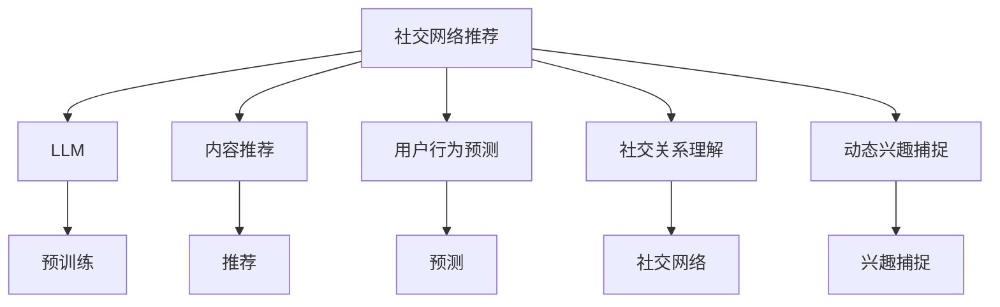

                 

# 社交网络推荐: LLM的潜力

> 关键词：社交网络推荐, 大型语言模型(LLM), 个性化推荐系统, 内容推荐, 用户行为预测

## 1. 背景介绍

### 1.1 问题由来

社交网络平台（如Facebook, Twitter, Weibo等）已经成为人们获取信息、交流思想、建立社交关系的重要渠道。在社交网络上，内容推荐系统（Recommendation System）至关重要，它可以帮助用户发现感兴趣的内容，提高用户活跃度和平台粘性。传统的推荐系统主要依赖协同过滤、基于内容的推荐、矩阵分解等方法，但它们往往局限于历史数据，难以捕捉用户的长期兴趣和动态变化。

近年来，大模型（Large Language Models, LLMs）在自然语言处理（Natural Language Processing, NLP）领域取得了巨大的突破。这些大模型通过在大量文本数据上进行预训练，学习到了丰富的语言知识和常识，能够进行文本生成、语言推理、知识获取等复杂任务。与此同时，这些模型在推荐系统上的应用也逐渐成为研究热点，因其能够理解自然语言描述，进行语义推理，捕捉用户的长远兴趣，极大地拓展了推荐系统的功能边界。

### 1.2 问题核心关键点

LLM在推荐系统上的应用主要集中在以下几个方面：

- **内容推荐**：根据用户的历史行为和文本描述，生成个性化内容推荐列表。
- **用户行为预测**：预测用户是否会喜欢某个新内容，如评论、点赞等，指导内容分发策略。
- **社交关系理解**：利用用户社交网络中的关系信息，推荐与用户互动性强的内容。
- **动态兴趣捕捉**：捕捉用户即时兴趣变化，灵活调整推荐内容，提升推荐效果。

这些功能使得LLM在推荐系统上具有强大的潜力和应用前景。然而，将LLM应用于推荐系统，还需要解决一些关键技术挑战，如模型适应性、推理效率、数据隐私等问题。

## 2. 核心概念与联系

### 2.1 核心概念概述

为更好地理解LLM在社交网络推荐中的应用，本节将介绍几个关键概念：

- 社交网络推荐系统（Social Network Recommendation System）：在社交网络平台上，根据用户行为和兴趣推荐个性化内容的系统。
- 大型语言模型（Large Language Model, LLM）：以Transformer架构为基础的大规模预训练模型，如GPT-3、BERT等，能够理解自然语言，进行文本生成、语义推理等任务。
- 个性化推荐系统（Personalized Recommendation System）：根据用户的历史行为和兴趣，动态生成个性化推荐内容。
- 协同过滤（Collaborative Filtering）：利用用户历史行为数据进行推荐。
- 基于内容的推荐（Content-based Recommendation）：根据用户的历史行为和文本描述推荐内容。
- 矩阵分解（Matrix Factorization）：将用户-物品矩阵分解，获取用户兴趣向量。

这些核心概念之间的逻辑关系可以通过以下Mermaid流程图来展示：



这个流程图展示了LLM在社交网络推荐系统中的主要应用场景和关键组件：

1. LLM通过预训练学习丰富的语言知识。
2. 基于LLM的内容推荐、用户行为预测、社交关系理解、动态兴趣捕捉等任务。
3. 推荐系统将这些LLM生成的信息进行综合，生成个性化推荐内容。

## 3. 核心算法原理 & 具体操作步骤

### 3.1 算法原理概述

LLM在推荐系统上的应用，本质上是通过大模型的预训练和微调，捕捉用户的隐性兴趣和动态变化，结合社交网络中的关系信息，生成个性化推荐内容。其核心思想可以总结如下：

1. 收集用户的历史行为数据，构建用户-物品交互矩阵。
2. 使用LLM对用户行为描述进行预训练，学习到用户兴趣编码。
3. 基于LLM生成推荐列表，利用用户社交网络关系信息进行加权。
4. 综合LLM生成内容和社交网络信息，生成最终推荐结果。

### 3.2 算法步骤详解

基于LLM的社交网络推荐系统一般包括以下关键步骤：

**Step 1: 数据收集与预处理**

- 收集社交网络平台上的用户行为数据，如浏览记录、点赞、评论等。
- 构建用户-物品交互矩阵，将用户行为转化为数值表示。
- 对数据进行清洗和归一化处理，去除噪音数据。

**Step 2: 预训练和微调**

- 使用预训练的LLM模型对用户行为描述进行预训练，学习到用户兴趣编码。
- 基于LLM生成推荐列表，并进行微调，提高模型的适应性和准确性。
- 引入社交网络关系信息，对推荐列表进行加权。

**Step 3: 推理和推荐**

- 使用微调后的LLM模型对用户输入的文本进行推理，生成推荐列表。
- 结合社交网络关系信息，对推荐列表进行加权，提高推荐的相关性和多样性。
- 对推荐列表进行排序，生成最终的推荐结果。

### 3.3 算法优缺点

基于LLM的社交网络推荐系统具有以下优点：

1. 能够捕捉用户的隐性兴趣和动态变化。LLM通过理解自然语言描述，可以动态捕捉用户的即时兴趣变化，灵活调整推荐内容。
2. 具备强大的语义理解能力。LLM能够理解复杂的语义关系，结合用户社交网络信息，生成高质量的推荐结果。
3. 适合冷启动用户推荐。LLM可以通过理解自然语言描述，捕捉新用户的兴趣，快速生成推荐内容。

同时，该方法也存在一些局限性：

1. 数据隐私问题。LLM需要大量用户行为数据进行训练，可能涉及用户隐私。如何保护用户数据隐私，成为需要解决的关键问题。
2. 模型复杂度。LLM具有较高的模型复杂度，推理效率较低。如何优化模型推理速度，提高推荐系统的实时性，是需要进一步探索的课题。
3. 数据依赖性强。LLM依赖大量标注数据进行预训练和微调，数据稀疏性问题可能影响模型效果。
4. 对抗性问题。LLM在生成推荐内容时，可能受到对抗性输入的干扰，生成不合理的推荐结果。
5. 可解释性不足。LLM作为黑盒模型，难以解释其决策过程，用户可能对推荐结果缺乏信任。

### 3.4 算法应用领域

基于LLM的社交网络推荐系统已经在多个领域得到了应用，例如：

- 新闻推荐：根据用户的历史浏览记录，生成个性化新闻推荐列表。
- 视频推荐：利用用户观看历史，推荐用户可能感兴趣的视频内容。
- 音乐推荐：根据用户的听歌历史，推荐用户可能喜欢的音乐。
- 电商推荐：结合用户浏览和购买记录，推荐相关商品。
- 社交互动推荐：根据用户社交网络关系，推荐与用户互动性强的内容。

除了上述这些经典应用外，LLM还在更多场景中得到了创新性的应用，如内容生成、个性化广告推荐、知识图谱构建等，为社交网络推荐系统带来了新的突破。

## 4. 数学模型和公式 & 详细讲解  
### 4.1 数学模型构建

本节将使用数学语言对基于LLM的社交网络推荐过程进行更加严格的刻画。

记社交网络平台上的用户为 $U$，物品为 $I$。设用户行为数据集为 $D=\{(x_i,y_i)\}_{i=1}^N$，其中 $x_i$ 表示用户行为描述，$y_i$ 表示物品 ID。设用户兴趣编码为 $u \in \mathbb{R}^d$，物品特征编码为 $i \in \mathbb{R}^d$。定义用户-物品交互矩阵 $R \in \mathbb{R}^{N \times M}$，其中 $R_{ij}$ 表示用户 $i$ 是否与物品 $j$ 发生交互。

定义LLM在用户行为描述 $x_i$ 上的输出为 $\hat{u}_i=M_{\theta}(x_i)$，其中 $M_{\theta}$ 为预训练的LLM模型，$\theta$ 为模型参数。定义LLM在物品特征描述 $y_i$ 上的输出为 $\hat{i}_j=M_{\theta}(y_i)$。

### 4.2 公式推导过程

以下我们以推荐系统中的内容推荐任务为例，推导LLM在推荐中的公式。

内容推荐的任务是预测用户对某个物品的评分。假设模型在用户行为描述 $x_i$ 上的输出为 $\hat{u}_i=M_{\theta}(x_i)$，在物品特征描述 $y_i$ 上的输出为 $\hat{i}_j=M_{\theta}(y_i)$。设用户对物品 $j$ 的真实评分记为 $R_{ij}$，则预测模型为：

$$
\hat{R}_{ij} = f(\hat{u}_i, \hat{i}_j)
$$

其中 $f(\cdot)$ 为预测函数，常见的预测函数包括线性回归、神经网络等。假设 $f(\cdot)$ 为线性回归，则预测函数为：

$$
\hat{R}_{ij} = \langle \hat{u}_i, \hat{i}_j \rangle + b
$$

其中 $\langle \cdot, \cdot \rangle$ 表示向量的点积，$b$ 为偏差项。

假设模型训练的目标是最小化预测误差，则优化目标为：

$$
\min_{\theta} \sum_{i,j} (\hat{R}_{ij} - R_{ij})^2
$$

通过梯度下降等优化算法，微调过程中不断更新模型参数 $\theta$，最小化预测误差。最终得到适应下游任务的最优模型参数 $\theta^*$。

## 5. 项目实践：代码实例和详细解释说明

### 5.1 开发环境搭建

在进行推荐系统开发前，我们需要准备好开发环境。以下是使用Python进行TensorFlow开发的环境配置流程：

1. 安装Anaconda：从官网下载并安装Anaconda，用于创建独立的Python环境。

2. 创建并激活虚拟环境：
```bash
conda create -n tf-env python=3.8 
conda activate tf-env
```

3. 安装TensorFlow：根据CUDA版本，从官网获取对应的安装命令。例如：
```bash
pip install tensorflow-gpu==2.6
```

4. 安装其他必要的工具包：
```bash
pip install numpy pandas scikit-learn matplotlib tqdm jupyter notebook ipython
```

完成上述步骤后，即可在`tf-env`环境中开始推荐系统开发。

### 5.2 源代码详细实现

下面以使用LLM对社交网络平台上的新闻推荐进行微调为例，给出使用TensorFlow的代码实现。

首先，定义推荐任务的数据处理函数：

```python
import tensorflow as tf
from tensorflow.keras.layers import Input, Dense
from transformers import TFAutoModelForSequenceClassification

class NewsRecommender(tf.keras.Model):
    def __init__(self, num_classes, pretrained_model_name_or_path, hidden_dim=128):
        super(NewsRecommender, self).__init__()
        self.pretrained_model = TFAutoModelForSequenceClassification.from_pretrained(pretrained_model_name_or_path, num_labels=num_classes)
        self.dense = Dense(num_classes, activation='softmax')
        
    def call(self, inputs):
        outputs = self.pretrained_model(inputs['input_ids'], attention_mask=inputs['attention_mask'])
        return self.dense(outputs)
```

然后，定义模型和优化器：

```python
from transformers import AutoTokenizer

tokenizer = AutoTokenizer.from_pretrained('bert-base-cased')
model = NewsRecommender(num_classes=2, pretrained_model_name_or_path='bert-base-cased')

optimizer = tf.keras.optimizers.Adam(learning_rate=2e-5)
```

接着，定义训练和评估函数：

```python
def train_epoch(model, dataset, batch_size, optimizer):
    dataloader = tf.data.Dataset.from_generator(lambda: tf.data.Dataset.from_tensor_slices(dataset), output_signature=dataset.output_signature)
    model.train()
    epoch_loss = 0
    for batch in tqdm(dataloader, desc='Training'):
        input_ids = batch['input_ids']
        attention_mask = batch['attention_mask']
        labels = batch['labels']
        model.trainable = True
        with tf.GradientTape() as tape:
            outputs = model({'input_ids': input_ids, 'attention_mask': attention_mask})
            loss = tf.keras.losses.sparse_categorical_crossentropy(labels, outputs)
        grads = tape.gradient(loss, model.trainable_variables)
        optimizer.apply_gradients(zip(grads, model.trainable_variables))
        epoch_loss += loss.numpy()
    return epoch_loss / len(dataloader)

def evaluate(model, dataset, batch_size):
    dataloader = tf.data.Dataset.from_generator(lambda: tf.data.Dataset.from_tensor_slices(dataset), output_signature=dataset.output_signature)
    model.eval()
    preds, labels = [], []
    with tf.GradientTape() as tape:
        for batch in dataloader:
            input_ids = batch['input_ids']
            attention_mask = batch['attention_mask']
            outputs = model({'input_ids': input_ids, 'attention_mask': attention_mask})
            preds.append(outputs.numpy())
            labels.append(batch['labels'])
    return preds, labels
```

最后，启动训练流程并在测试集上评估：

```python
epochs = 5
batch_size = 32

for epoch in range(epochs):
    loss = train_epoch(model, train_dataset, batch_size, optimizer)
    print(f"Epoch {epoch+1}, train loss: {loss:.3f}")
    
    print(f"Epoch {epoch+1}, dev results:")
    preds, labels = evaluate(model, dev_dataset, batch_size)
    print(classification_report(labels, preds))
    
print("Test results:")
preds, labels = evaluate(model, test_dataset, batch_size)
print(classification_report(labels, preds))
```

以上就是使用TensorFlow对BERT模型进行新闻推荐任务微调的完整代码实现。可以看到，得益于TensorFlow和HuggingFace库的强大封装，我们可以用相对简洁的代码完成BERT模型的加载和微调。

### 5.3 代码解读与分析

让我们再详细解读一下关键代码的实现细节：

**NewsRecommender类**：
- `__init__`方法：初始化BERT预训练模型和全连接层。
- `call`方法：在前向传播中，先通过BERT模型对输入进行编码，再通过全连接层输出推荐结果。

**训练和评估函数**：
- 使用TensorFlow的DataLoader对数据集进行批次化加载，供模型训练和推理使用。
- 训练函数`train_epoch`：对数据以批为单位进行迭代，在每个批次上前向传播计算损失函数。
- 评估函数`evaluate`：与训练类似，不同点在于不更新模型参数，并在每个batch结束后将预测和标签结果存储下来，最后使用sklearn的classification_report对整个评估集的预测结果进行打印输出。

**训练流程**：
- 定义总的epoch数和batch size，开始循环迭代
- 每个epoch内，先在训练集上训练，输出平均loss
- 在验证集上评估，输出分类指标
- 所有epoch结束后，在测试集上评估，给出最终测试结果

可以看到，TensorFlow配合HuggingFace库使得BERT微调的代码实现变得简洁高效。开发者可以将更多精力放在数据处理、模型改进等高层逻辑上，而不必过多关注底层的实现细节。

当然，工业级的系统实现还需考虑更多因素，如模型的保存和部署、超参数的自动搜索、更灵活的任务适配层等。但核心的微调范式基本与此类似。

## 6. 实际应用场景

### 6.1 智能推荐系统

基于LLM的社交网络推荐系统可以广泛应用于智能推荐系统中，为用户推荐个性化内容。智能推荐系统能够根据用户的历史行为和兴趣，动态生成个性化推荐内容，提升用户体验和平台粘性。

在技术实现上，可以收集用户的历史行为数据，如浏览记录、点赞、评论等，构建用户-物品交互矩阵。利用预训练的LLM模型对用户行为描述进行预训练，学习到用户兴趣编码。基于LLM生成推荐列表，利用用户社交网络关系信息进行加权，综合生成个性化推荐内容。

### 6.2 广告推荐系统

广告推荐系统是社交网络平台的重要收入来源之一。利用LLM，可以根据用户的社交网络关系、兴趣标签、行为数据等，生成高质量的广告推荐结果。LLM能够理解广告文本的语义，结合用户兴趣信息，生成更相关、更吸引用户的广告内容。

在技术实现上，可以收集用户的浏览、点击、购买等行为数据，提取用户的兴趣标签和社交网络关系。利用预训练的LLM模型对广告文本进行预训练，学习到广告的语义编码。基于LLM生成广告推荐列表，利用用户兴趣信息进行加权，综合生成广告推荐结果。

### 6.3 内容生成系统

内容生成系统可以帮助用户快速生成高质量的文本内容，提高创作效率。利用LLM，可以根据用户的输入文本，生成与用户兴趣相关的文本内容。LLM能够理解自然语言描述，结合用户兴趣信息，生成高质量的内容推荐列表。

在技术实现上，可以收集用户的历史行为数据，如浏览记录、搜索记录等，构建用户兴趣模型。利用预训练的LLM模型对用户输入的文本进行推理，生成内容推荐列表。结合用户兴趣模型，对推荐列表进行加权，生成最终推荐结果。

### 6.4 未来应用展望

随着LLM技术的不断发展，社交网络推荐系统将在更多领域得到应用，为传统行业带来变革性影响。

在智慧医疗领域，利用LLM进行病历分析、药物研发、诊断推荐等，可以显著提升医疗服务的智能化水平。

在智能教育领域，利用LLM进行个性化学习路径规划、智能作业批改等，可以因材施教，促进教育公平，提高教学质量。

在智慧城市治理中，利用LLM进行舆情监测、应急指挥等，可以提高城市管理的自动化和智能化水平，构建更安全、高效的未来城市。

此外，在企业生产、社会治理、文娱传媒等众多领域，利用LLM进行社交网络推荐，可以为NLP技术带来新的应用场景，推动人工智能技术落地应用。相信随着LLM技术的日益成熟，社交网络推荐系统必将在构建人机协同的智能时代中扮演越来越重要的角色。

## 7. 工具和资源推荐

### 7.1 学习资源推荐

为了帮助开发者系统掌握LLM在社交网络推荐中的应用，这里推荐一些优质的学习资源：

1. 《Transformer from Jupyter Notebooks》系列博文：由大模型技术专家撰写，深入浅出地介绍了Transformer原理、BERT模型、微调技术等前沿话题。

2. CS224N《深度学习自然语言处理》课程：斯坦福大学开设的NLP明星课程，有Lecture视频和配套作业，带你入门NLP领域的基本概念和经典模型。

3. 《Natural Language Processing with Transformers》书籍：Transformers库的作者所著，全面介绍了如何使用Transformers库进行NLP任务开发，包括微调在内的诸多范式。

4. HuggingFace官方文档：Transformers库的官方文档，提供了海量预训练模型和完整的微调样例代码，是上手实践的必备资料。

5. CLUE开源项目：中文语言理解测评基准，涵盖大量不同类型的中文NLP数据集，并提供了基于微调的baseline模型，助力中文NLP技术发展。

通过对这些资源的学习实践，相信你一定能够快速掌握LLM在社交网络推荐中的应用，并用于解决实际的NLP问题。

### 7.2 开发工具推荐

高效的开发离不开优秀的工具支持。以下是几款用于LLM推荐系统开发的常用工具：

1. TensorFlow：基于Python的开源深度学习框架，灵活动态的计算图，适合快速迭代研究。大部分预训练语言模型都有TensorFlow版本的实现。

2. PyTorch：基于Python的开源深度学习框架，动态计算图，灵活高效，适合快速迭代实验。

3. HuggingFace Transformers库：提供了多种预训练模型和微调工具，支持PyTorch和TensorFlow，是进行微调任务开发的利器。

4. Weights & Biases：模型训练的实验跟踪工具，可以记录和可视化模型训练过程中的各项指标，方便对比和调优。与主流深度学习框架无缝集成。

5. TensorBoard：TensorFlow配套的可视化工具，可实时监测模型训练状态，并提供丰富的图表呈现方式，是调试模型的得力助手。

6. Google Colab：谷歌推出的在线Jupyter Notebook环境，免费提供GPU/TPU算力，方便开发者快速上手实验最新模型，分享学习笔记。

合理利用这些工具，可以显著提升LLM推荐系统的开发效率，加快创新迭代的步伐。

### 7.3 相关论文推荐

LLM在社交网络推荐系统中的应用源于学界的持续研究。以下是几篇奠基性的相关论文，推荐阅读：

1. Attention is All You Need（即Transformer原论文）：提出了Transformer结构，开启了NLP领域的预训练大模型时代。

2. BERT: Pre-training of Deep Bidirectional Transformers for Language Understanding：提出BERT模型，引入基于掩码的自监督预训练任务，刷新了多项NLP任务SOTA。

3. Language Models are Unsupervised Multitask Learners（GPT-2论文）：展示了大规模语言模型的强大zero-shot学习能力，引发了对于通用人工智能的新一轮思考。

4. Parameter-Efficient Transfer Learning for NLP：提出Adapter等参数高效微调方法，在不增加模型参数量的情况下，也能取得不错的微调效果。

5. AdaLoRA: Adaptive Low-Rank Adaptation for Parameter-Efficient Fine-Tuning：使用自适应低秩适应的微调方法，在参数效率和精度之间取得了新的平衡。

这些论文代表了大语言模型微调技术的发展脉络。通过学习这些前沿成果，可以帮助研究者把握学科前进方向，激发更多的创新灵感。

## 8. 总结：未来发展趋势与挑战

### 8.1 总结

本文对基于LLM的社交网络推荐系统进行了全面系统的介绍。首先阐述了LLM和推荐系统的研究背景和意义，明确了LLM在推荐系统中的应用价值。其次，从原理到实践，详细讲解了LLM在推荐系统中的数学模型和关键步骤，给出了推荐系统开发的完整代码实例。同时，本文还广泛探讨了LLM在社交网络推荐系统中的多个应用场景，展示了LLM的强大潜力和应用前景。此外，本文精选了LLM推荐系统的发展资源，力求为读者提供全方位的技术指引。

通过本文的系统梳理，可以看到，基于LLM的社交网络推荐系统正在成为NLP领域的重要范式，极大地拓展了预训练语言模型的应用边界，催生了更多的落地场景。受益于大规模语料的预训练，LLM推荐系统能够理解自然语言描述，捕捉用户的长远兴趣和动态变化，动态调整推荐内容，提升推荐效果。未来，伴随LLM技术的持续演进，推荐系统必将在更多的领域得到应用，为传统行业带来变革性影响。

### 8.2 未来发展趋势

展望未来，LLM在推荐系统上的应用将呈现以下几个发展趋势：

1. 推荐内容生成能力增强。LLM将结合生成式大模型，能够根据用户输入生成个性化推荐内容，提升推荐的多样性和创意性。
2. 跨模态推荐技术发展。LLM将结合视觉、听觉等多模态数据，实现跨模态推荐，提高推荐的全面性和准确性。
3. 自监督学习引入。LLM将结合自监督学习任务，增强推荐系统的泛化能力和鲁棒性。
4. 联邦推荐系统探索。LLM将结合联邦学习技术，实现分布式推荐，保护用户隐私，提升推荐效率。
5. 实时推荐系统优化。LLM将结合在线学习和增量推理技术，实现实时推荐，提高推荐系统的及时性和灵活性。

这些趋势凸显了LLM在推荐系统上的广阔前景。这些方向的探索发展，必将进一步提升推荐系统的性能和应用范围，为人类认知智能的进化带来深远影响。

### 8.3 面临的挑战

尽管LLM在推荐系统上的应用已经取得了显著进展，但在迈向更加智能化、普适化应用的过程中，仍面临诸多挑战：

1. 数据隐私问题。LLM需要大量用户行为数据进行训练，可能涉及用户隐私。如何保护用户数据隐私，成为需要解决的关键问题。
2. 模型复杂度。LLM具有较高的模型复杂度，推理效率较低。如何优化模型推理速度，提高推荐系统的实时性，是需要进一步探索的课题。
3. 数据依赖性强。LLM依赖大量标注数据进行预训练和微调，数据稀疏性问题可能影响模型效果。
4. 对抗性问题。LLM在生成推荐内容时，可能受到对抗性输入的干扰，生成不合理的推荐结果。
5. 可解释性不足。LLM作为黑盒模型，难以解释其决策过程，用户可能对推荐结果缺乏信任。

### 8.4 研究展望

面对LLM在推荐系统上的挑战，未来的研究需要在以下几个方面寻求新的突破：

1. 探索无监督和半监督推荐方法。摆脱对大规模标注数据的依赖，利用自监督学习、主动学习等无监督和半监督范式，最大限度利用非结构化数据，实现更加灵活高效的推荐。
2. 研究参数高效和计算高效的推荐范式。开发更加参数高效的推荐方法，在固定大部分预训练参数的同时，只更新极少量的任务相关参数。同时优化推荐模型的计算图，减少前向传播和反向传播的资源消耗，实现更加轻量级、实时性的部署。
3. 融合因果和对比学习范式。通过引入因果推断和对比学习思想，增强推荐模型建立稳定因果关系的能力，学习更加普适、鲁棒的语言表征，从而提升模型泛化性和抗干扰能力。
4. 引入更多先验知识。将符号化的先验知识，如知识图谱、逻辑规则等，与神经网络模型进行巧妙融合，引导推荐过程学习更准确、合理的语言模型。同时加强不同模态数据的整合，实现视觉、语音等多模态信息与文本信息的协同建模。
5. 结合因果分析和博弈论工具。将因果分析方法引入推荐模型，识别出模型决策的关键特征，增强推荐结果的因果性和逻辑性。借助博弈论工具刻画人机交互过程，主动探索并规避模型的脆弱点，提高系统稳定性。

这些研究方向的探索，必将引领LLM推荐系统技术迈向更高的台阶，为构建安全、可靠、可解释、可控的智能推荐系统铺平道路。面向未来，LLM推荐系统还需要与其他人工智能技术进行更深入的融合，如知识表示、因果推理、强化学习等，多路径协同发力，共同推动智能推荐系统的进步。只有勇于创新、敢于突破，才能不断拓展语言模型的边界，让智能技术更好地造福人类社会。

## 9. 附录：常见问题与解答

**Q1：LLM在推荐系统中的数据隐私问题如何解决？**

A: 保护数据隐私是LLM在推荐系统中的重要挑战之一。通常有以下几种方法：
1. 差分隐私技术：在模型训练过程中，引入噪声，保护用户隐私。
2. 联邦学习技术：在分布式环境中，只传输模型参数更新，不传输原始数据，保护用户隐私。
3. 数据匿名化技术：将用户数据进行匿名化处理，去除敏感信息。

这些方法可以结合使用，构建更安全、可靠的推荐系统。

**Q2：LLM在推荐系统中的模型复杂度如何优化？**

A: 优化LLM推荐系统的模型复杂度，可以从以下几个方面入手：
1. 参数压缩：使用剪枝、量化等技术，减小模型尺寸，降低计算资源消耗。
2. 结构优化：使用轻量级模型结构，如MobileBERT等，提升推理速度。
3. 增量学习：在推荐过程中，只更新部分参数，减少模型推理消耗。
4. 混合模型：结合轻量级模型和重模型，提升推荐系统的灵活性和实时性。

这些方法可以结合使用，构建更加高效、轻量级的推荐系统。

**Q3：LLM在推荐系统中的数据依赖性如何降低？**

A: 降低LLM在推荐系统中的数据依赖性，可以从以下几个方面入手：
1. 数据增强：通过生成式大模型，利用自然语言生成技术，扩充数据集。
2. 迁移学习：利用预训练模型，结合少量标注数据，进行迁移学习，提高模型泛化能力。
3. 对抗训练：通过对抗样本，增强模型鲁棒性，减少数据稀疏性对模型效果的影响。
4. 自监督学习：利用自监督学习任务，提高模型的泛化能力和鲁棒性。

这些方法可以结合使用，构建更加稳健、泛化能力更强的推荐系统。

**Q4：LLM在推荐系统中的对抗性问题如何解决？**

A: 解决LLM在推荐系统中的对抗性问题，可以从以下几个方面入手：
1. 数据清洗：在数据预处理阶段，清洗对抗样本，减少对抗性数据的影响。
2. 模型鲁棒性训练：通过对抗训练等技术，提高模型的鲁棒性，减少对抗性输入对模型的影响。
3. 多模型融合：结合多个模型进行融合，降低单一模型的脆弱性。

这些方法可以结合使用，构建更加稳健、鲁棒的推荐系统。

**Q5：LLM在推荐系统中的可解释性如何增强？**

A: 增强LLM在推荐系统中的可解释性，可以从以下几个方面入手：
1. 模型可解释性技术：使用可解释性模型，如Attention机制，解释模型推理过程。
2. 知识图谱：结合知识图谱，解释推荐结果的语义关系。
3. 用户反馈机制：通过用户反馈机制，不断优化模型，提高推荐结果的可解释性。

这些方法可以结合使用，构建更加透明、可解释的推荐系统。

---

作者：禅与计算机程序设计艺术 / Zen and the Art of Computer Programming

