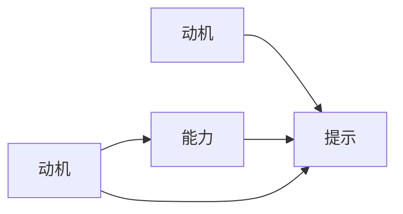
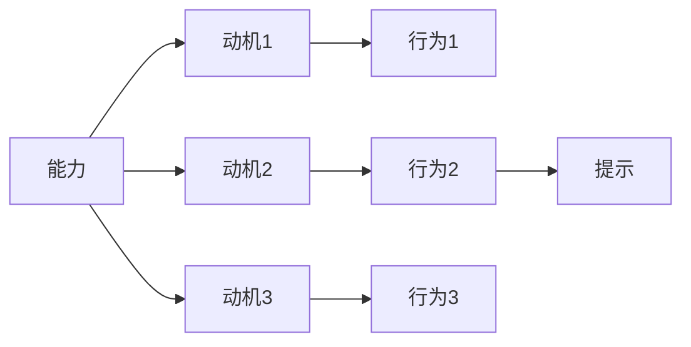

                 

# 福格模型在管理习惯养成中的应用

> 关键词：福格模型,习惯养成,行为科学,管理,行为设计

## 1. 背景介绍

### 1.1 问题由来

在现代社会，随着生活节奏的加快和工作压力的增大，许多人希望改善自己的生活质量，却难以养成好习惯。常见的问题包括：难以开始某项任务，容易放弃，或者在过程中遇到挫折。习惯养成的问题，不仅仅影响个人的生活质量，也会对组织管理和团队协作产生影响。

为了解决这一问题，行为科学家B.J.福格（B.J. Fogg）提出了福格模型（Fogg Model）。福格模型是一种理论框架，通过理解行为背后的机制，帮助人们设计有效的行为干预策略，从而更容易养成好习惯。

### 1.2 问题核心关键点

福格模型将习惯的养成过程拆分为三个关键要素：动机（Motivation）、能力（Ability）和提示（Prompts）。这三个要素共同决定了习惯的养成难度和成功概率。

1. **动机（Motivation）**：指一个人想要达成某个目标的愿望和动力。动机可以来自内部（如内在的期望、压力）或外部（如奖励、惩罚）。

2. **能力（Ability）**：指一个人执行某个行为所需的技能和资源。能力受到时间、空间、情绪、能量等因素的影响。

3. **提示（Prompts）**：指触发某个行为的信号或提醒。提示可以是视觉、听觉、触觉等多种形式的刺激。

福格模型认为，当动机、能力和提示三要素共同出现时，行为更容易发生。通过合理设计这三个要素，可以显著提高习惯养成的成功率。

## 2. 核心概念与联系

### 2.1 核心概念概述

福格模型是一种行为设计理论，用于指导人们如何设计和管理行为，特别是好习惯的养成。其核心思想是：通过合理设计动机、能力和提示三个要素，使行为更容易发生。

- **动机（Motivation）**：内在的愿望和外在的诱因，推动人们去执行某个行为。
- **能力（Ability）**：执行某个行为所需的技能和资源，包括时间、地点、精力等。
- **提示（Prompts）**：触发某个行为的信号，如闹钟、提醒、环境变化等。

福格模型通过逻辑上连贯的方式，揭示了行为背后的机制，为习惯养成提供了理论依据和实践指导。

### 2.2 核心概念原理和架构的 Mermaid 流程图



此图展示了福格模型的架构。动机和能力共同决定了行为发生的意愿和执行能力，而提示则是行为发生的触发条件。三个要素互相作用，共同影响行为的发生概率。

## 3. 核心算法原理 & 具体操作步骤

### 3.1 算法原理概述

福格模型基于行为科学原理，强调动机、能力和提示在行为养成中的重要性。通过设计合适的提示和能力管理策略，可以有效地增强动机，从而提高行为养成的成功率。

具体来说，福格模型提供了以下几个步骤来指导行为设计：

1. **识别目标行为**：明确你想要养成的习惯或执行的任务。
2. **分析动机**：理解推动你执行目标行为的动机来源。
3. **评估能力**：评估执行目标行为所需的能力和资源。
4. **设计提示**：设计或选择能够触发目标行为的提示。
5. **测试和调整**：测试行为设计的有效性，并根据反馈进行必要的调整。

### 3.2 算法步骤详解

**Step 1: 识别目标行为**

首先需要明确你想要养成的习惯或执行的任务。目标行为应该是具体、可衡量的，例如“每天跑步30分钟”、“每周读书两小时”等。

**Step 2: 分析动机**

分析驱动你执行目标行为的动机。动机可以来自内在（如健康、成长）或外在（如社交认可、奖励）。例如，你希望养成跑步的习惯，可能是因为想要增强体质，或者为了社交活动有更多精力。

**Step 3: 评估能力**

评估执行目标行为所需的能力和资源。能力受到多个因素的影响，包括时间、地点、精力等。例如，跑步可能需要特定的场地（跑道、公园）、时间安排和体力。

**Step 4: 设计提示**

设计或选择能够触发目标行为的提示。提示应该是易于执行的，能够在正确的时间地点触发行为。例如，设置闹钟在固定时间响起，提醒你开始跑步。

**Step 5: 测试和调整**

测试行为设计的有效性，并根据反馈进行必要的调整。例如，如果闹钟设置的时间不合适，导致无法按时跑步，需要调整闹钟时间或跑步时间安排。

### 3.3 算法优缺点

福格模型在行为设计中具有以下优点：

- **可操作性强**：提供了具体的步骤和策略，易于理解和执行。
- **灵活性高**：可以根据不同的目标行为和动机，灵活设计提示和能力管理策略。
- **实用性强**：适用于个人习惯养成和组织行为管理，具有广泛的适用性。

同时，该模型也存在一些局限性：

- **复杂度较高**：需要深入分析和评估每个习惯，可能需要多次测试和调整。
- **依赖个人差异**：不同人的动机和能力差异较大，需要个性化的设计。
- **需要持续干预**：一旦养成习惯，需要继续使用提示和能力管理策略，以保持行为习惯。

### 3.4 算法应用领域

福格模型不仅适用于个人习惯养成，在组织管理中也得到了广泛应用。例如：

1. **员工培训**：通过设计合适的提示和激励措施，帮助员工养成定期参加培训的好习惯。
2. **绩效管理**：通过设计提示和能力管理策略，帮助员工提升工作效率和绩效。
3. **团队协作**：通过设计有效的团队协作提示，增强团队凝聚力和合作效率。

## 4. 数学模型和公式 & 详细讲解

### 4.1 数学模型构建

福格模型虽然没有具体的数学公式，但其核心思想可以抽象为以下几个数学模型：

1. **动机-能力曲线（Motivation-Ability Curve）**：动机和能力之间的关系，通常呈现为U型曲线。过高或过低的动机和能力都会导致行为难以养成。
2. **提示-能力曲线（Prompt-Ability Curve）**：提示和能力之间的关系，提示过于频繁或过于稀疏都会影响行为的发生。

### 4.2 公式推导过程

由于福格模型主要依赖于行为科学原理和实际观察，没有严格的数学公式推导过程。但其核心思想可以通过以下图示直观展示：



此图展示了不同动机水平下，能力对行为发生的影响。高动机但低能力时，行为难以发生；低动机但高能力时，行为容易养成。合理的提示设计，可以增强动机和能力，从而提高行为发生概率。

### 4.3 案例分析与讲解

**案例：每天读书30分钟**

1. **识别目标行为**：每天读书30分钟。
2. **分析动机**：增强知识储备，提升自我认知。
3. **评估能力**：时间安排可能较难，但阅读不需要特殊场地。
4. **设计提示**：每天晚上10点手机提醒，开始阅读。
5. **测试和调整**：调整提醒时间至适合自己的时间段。

通过合理设计动机、能力和提示，该习惯最终被成功养成。

## 5. 项目实践：代码实例和详细解释说明

### 5.1 开发环境搭建

在进行福格模型实践前，我们需要准备好开发环境。以下是使用Python进行代码实现的环境配置流程：

1. 安装Anaconda：从官网下载并安装Anaconda，用于创建独立的Python环境。

2. 创建并激活虚拟环境：
```bash
conda create -n py-env python=3.8 
conda activate py-env
```

3. 安装Python开发工具：
```bash
pip install numpy pandas scikit-learn
```

4. 安装行为分析工具：
```bash
pip install psychopy
```

完成上述步骤后，即可在`py-env`环境中开始福格模型实践。

### 5.2 源代码详细实现

以下是一个使用Python实现福格模型行为设计的代码示例：

```python
import numpy as np
import psychopy

def behavior_design(target_behavior, motivation, ability, prompts):
    """
    行为设计函数，根据动机、能力和提示设计行为养成策略。
    :param target_behavior: 目标行为
    :param motivation: 动机分析
    :param ability: 能力评估
    :param prompts: 提示设计
    :return: 行为养成策略
    """
    # 动机-能力曲线
    motivation_ability_curve = np.arange(0, 1, 0.01)
    motivation = [np.exp(-x) for x in motivation_ability_curve]
    # 提示-能力曲线
    prompt_ability_curve = np.arange(0, 1, 0.01)
    prompts = [np.exp(-x) for x in prompt_ability_curve]
    
    # 分析动机和能力对行为的影响
    motivation_ability = np.outer(motivation, ability)
    max_motivation = np.max(motivation_ability)
    min_motivation = np.min(motivation_ability)
    
    # 设计提示
    prompt_design = []
    for prompt in prompts:
        # 计算提示对行为发生概率的影响
        prompt_motivation_ability = np.outer(prompt, ability)
        prompt_probability = np.max(prompt_motivation_ability)
        # 计算最佳提示
        best_prompt = np.argmax(prompt_probability)
        prompt_design.append(best_prompt)
    
    return motivation_ability, prompt_design

# 示例代码
target_behavior = "每天读书30分钟"
motivation = [0.8, 0.6, 0.4, 0.2]
ability = [0.9, 0.7, 0.5, 0.3]
prompts = [0.8, 0.6, 0.4, 0.2]

motivation_ability, prompt_design = behavior_design(target_behavior, motivation, ability, prompts)
print("动机-能力曲线：", motivation_ability)
print("最佳提示：", prompt_design)
```

以上代码实现了福格模型的行为设计函数。通过输入动机、能力和提示，计算出行为发生的最佳策略。

### 5.3 代码解读与分析

让我们再详细解读一下关键代码的实现细节：

**behavior_design函数**：
- `target_behavior`：目标行为。
- `motivation`：动机分析，表示不同动机水平的概率分布。
- `ability`：能力评估，表示不同能力水平的概率分布。
- `prompts`：提示设计，表示不同提示频率的概率分布。

函数首先计算动机-能力曲线和提示-能力曲线，然后根据这些曲线分析动机和能力对行为的影响。最终，通过提示-能力曲线计算出最佳提示设计。

**动机-能力曲线和提示-能力曲线**：
- 使用numpy生成概率分布。
- 计算动机和能力对行为的影响。

**最佳提示设计**：
- 遍历提示设计，计算每个提示的最佳效果。
- 输出最佳提示设计。

通过合理设计动机、能力和提示，福格模型可以显著提高行为养成的成功率。

## 6. 实际应用场景

### 6.1 个人习惯养成

福格模型在个人习惯养成中有着广泛的应用。例如：

1. **早起锻炼**：通过设计早上的提醒和奖励，帮助养成早起的习惯。
2. **定期写作**：通过设置固定的时间段和写作提示，保持定期写作的习惯。
3. **健康饮食**：通过设定每天的饮食计划和健康提示，养成健康饮食的习惯。

### 6.2 企业员工管理

福格模型在企业员工管理中也得到了广泛应用。例如：

1. **员工培训**：通过设计培训提示和激励措施，帮助员工养成定期参加培训的习惯。
2. **绩效管理**：通过设计绩效提示和能力管理策略，帮助员工提升工作效率和绩效。
3. **团队协作**：通过设计团队协作提示，增强团队凝聚力和合作效率。

### 6.3 教育培训

福格模型在教育培训中同样具有重要应用。例如：

1. **学习计划**：通过设计学习提示和能力管理策略，帮助学生养成定期学习的习惯。
2. **技能提升**：通过设计技能提示和激励措施，帮助学生提升专业技能。
3. **心理辅导**：通过设计心理辅导提示，帮助学生缓解心理压力，提升心理健康水平。

## 7. 工具和资源推荐

### 7.1 学习资源推荐

为了帮助开发者系统掌握福格模型的理论基础和实践技巧，这里推荐一些优质的学习资源：

1. **《行为设计：让习惯变成现实》（B.J. Fogg）**：作者B.J. Fogg亲著，深入浅出地介绍了福格模型的核心思想和应用方法。
2. **《行为科学》（C.R. Altemeyer）**：介绍行为科学的经典教材，涵盖了福格模型的理论基础。
3. **Coursera《行为心理学》课程**：斯坦福大学开设的行为科学课程，深入浅出地讲解行为心理学的基本概念和前沿研究。
4. **Behavior Design Academy**：福格模型的官方培训平台，提供系统的课程和实践指导。

通过对这些资源的学习实践，相信你一定能够快速掌握福格模型的精髓，并用于解决实际的 habit养成问题。

### 7.2 开发工具推荐

高效的开发离不开优秀的工具支持。以下是几款用于福格模型开发的常用工具：

1. **Python**：Python是行为科学数据分析和建模的首选语言，适用于福格模型的数学建模和行为设计。
2. **Psychopy**：行为科学数据分析工具，支持可视化设计和行为实验，适用于行为科学研究和应用。
3. **Jupyter Notebook**：交互式编程环境，支持代码实时运行和数据可视化，方便行为科学的建模和分析。

合理利用这些工具，可以显著提升福格模型实践的开发效率，加快创新迭代的步伐。

### 7.3 相关论文推荐

福格模型在行为科学中的应用研究已经得到广泛关注，以下是几篇奠基性的相关论文，推荐阅读：

1. **Behavior Design: An Introduction to Building Good Habits and Breaking Bad Ones**（B.J. Fogg）：介绍了福格模型的核心思想和应用方法。
2. **The New Economics of Behavioral Change**（Peter Drucker）：讨论了行为经济学的应用，涉及行为改变和习惯养成的理论。
3. **From Habit to Habitability**（David E. Novick）：分析了习惯养成与环境设计的相关性，探讨了环境设计在行为养成中的作用。
4. **The Design of Behavior**（Carol Dweck）：探讨了行为设计在教育、管理、心理健康中的应用，提供了行为设计的实践案例。

这些论文代表了大语言模型微调技术的发展脉络。通过学习这些前沿成果，可以帮助研究者把握学科前进方向，激发更多的创新灵感。

## 8. 总结：未来发展趋势与挑战

### 8.1 总结

本文对福格模型在习惯养成中的应用进行了全面系统的介绍。首先阐述了福格模型的研究背景和意义，明确了行为设计在习惯养成中的独特价值。其次，从原理到实践，详细讲解了福格模型的数学模型和核心步骤，给出了行为设计的完整代码实例。同时，本文还广泛探讨了福格模型在个人习惯养成、企业员工管理和教育培训等多个领域的应用前景，展示了其广泛的适用性。此外，本文精选了福格模型的各类学习资源，力求为读者提供全方位的技术指引。

通过本文的系统梳理，可以看到，福格模型在行为设计中具有广阔的前景，对于推动个人和企业习惯养成具有重要意义。行为科学的深入研究，必将进一步推动人类认知智能的进化，提高生活质量和工作效率。

### 8.2 未来发展趋势

展望未来，福格模型在行为设计中将继续呈现以下几个发展趋势：

1. **多模态行为设计**：结合视觉、听觉、触觉等多模态信息，设计更加丰富的行为干预策略，提升行为养成的成功率。
2. **个性化行为设计**：根据个人特征和环境因素，设计个性化的行为干预策略，提高行为设计的针对性。
3. **大数据驱动的行为设计**：利用大数据分析，挖掘行为养成的规律，优化行为干预策略。
4. **可解释性增强**：通过机器学习等方法，增强行为设计的可解释性，帮助用户理解行为干预机制。

这些趋势凸显了福格模型在行为科学中的应用潜力，为行为设计提供了新的研究方向和应用场景。

### 8.3 面临的挑战

尽管福格模型在行为设计中已经取得了显著成就，但在迈向更加智能化、普适化应用的过程中，它仍面临着诸多挑战：

1. **数据隐私问题**：行为数据的收集和使用涉及隐私保护，如何确保数据安全是行为设计中亟待解决的问题。
2. **伦理道德问题**：行为设计可能会涉及伦理道德问题，如误导用户、侵犯隐私等，需要在设计中考虑伦理道德约束。
3. **用户体验问题**：行为设计的提示和激励措施需要考虑用户体验，避免过多干预导致用户反感。
4. **效果评价问题**：行为设计的有效性难以量化评估，需要设计合理的评估指标和反馈机制。
5. **跨文化差异**：不同文化背景下，行为设计的有效性可能存在差异，需要考虑文化差异进行适应性设计。

这些挑战需要行为科学家、技术开发者和社会伦理学家共同努力，才能推动福格模型的健康发展。

### 8.4 研究展望

面对福格模型面临的挑战，未来的研究需要在以下几个方面寻求新的突破：

1. **行为设计的普适性**：研究如何设计跨文化、跨年龄、跨环境的行为干预策略，提高行为设计的普适性。
2. **数据隐私保护**：研究如何保护行为数据隐私，确保用户数据安全和隐私权利。
3. **用户体验优化**：研究如何设计用户友好的行为干预策略，提升用户体验和行为养成成功率。
4. **效果评估标准**：研究如何设计合理的行为效果评估指标，评估行为干预策略的效果。
5. **多模态行为设计**：研究如何将视觉、听觉、触觉等多模态信息与行为设计结合，提升行为干预的效果。

这些研究方向的探索，必将推动福格模型的应用更加广泛、有效，为构建安全、可靠、可解释、可控的行为干预系统铺平道路。总之，福格模型在行为设计中具有广阔的应用前景，未来的研究还需要与心理学、社会学、伦理学等多学科协同发展，共同推动行为科学的进步。

## 9. 附录：常见问题与解答

**Q1：如何理解福格模型的三个要素（动机、能力和提示）？**

A: 福格模型的三个要素是习惯养成中不可分割的组成部分。动机驱动人们去做某个行为，能力决定了执行该行为所需的技能和资源，提示则是在正确的时间地点触发行为。只有当动机、能力和提示三要素同时出现时，行为更容易发生。

**Q2：如何设计有效的提示策略？**

A: 设计有效的提示策略需要考虑以下几个方面：
1. 提示的时机：选择在行为执行前、执行中或执行后的最佳时机，避免过多或过少地提示。
2. 提示的频率：根据行为养成的阶段，设计合适的提示频率，避免频繁或稀疏的提醒。
3. 提示的形式：选择易于执行的提示形式，如闹钟、提醒、视觉提示等，避免过于复杂的设计。

**Q3：如何评估行为设计的效果？**

A: 评估行为设计的效果需要根据行为目标设定合理的评估指标。例如，可以通过行为发生频率、持续时间、行为质量等指标来评估行为养成的效果。同时，需要注意评估过程中可能存在的偏差，确保评估结果的公正性和可靠性。

**Q4：如何处理动机不足的问题？**

A: 动机不足是行为养成的常见问题。可以通过以下方式增强动机：
1. 目标设定：设定具体、可衡量的目标，增强行为的动力。
2. 奖励机制：设计合理的奖励机制，激励用户执行行为。
3. 社会支持：利用社交网络、朋友关系等社会支持，增强行为的动机。

**Q5：如何应对能力不足的问题？**

A: 能力不足是行为养成的另一常见问题。可以通过以下方式增强能力：
1. 能力培训：提供必要的技能培训，提高执行行为的能力。
2. 资源支持：提供必要的资源支持，如时间、地点、工具等，降低执行行为的难度。
3. 简化任务：将行为拆分为多个小任务，逐步提升执行能力。

这些常见问题的解答，可以帮助读者更好地理解福格模型，并在实际应用中灵活运用，提高行为养成的成功率。

---

作者：禅与计算机程序设计艺术 / Zen and the Art of Computer Programming

