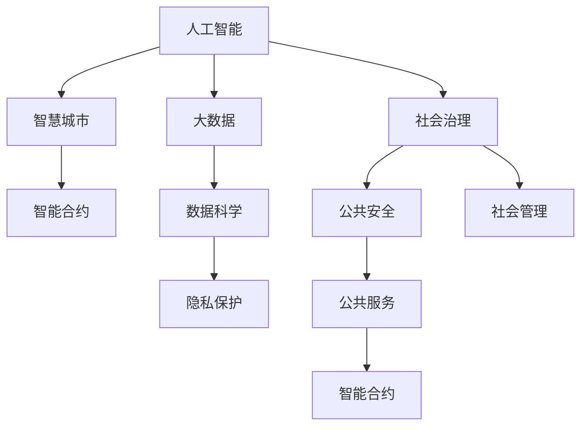

                 

# 科技创新：社会治理的新思路

> 关键词：人工智能,社会治理,公共服务,智慧城市,数据科学,大数据,隐私保护,智能合约,区块链

## 1. 背景介绍

### 1.1 问题由来

在数字化、信息化浪潮的推动下，社会治理模式正在经历深刻的变革。传统的行政、监管手段已无法满足现代复杂多变的治理需求，亟需引入新兴技术，提升社会治理的精准性、实时性和协同性。

人工智能(AI)技术，以其强大的数据处理能力和泛化能力，被视为解决社会治理难题的关键突破口。特别是在大数据、云计算、物联网等技术支撑下，AI正日益渗透到公共安全、公共服务、社会管理等领域，推动社会治理向智能化、协同化方向发展。

然而，AI技术在社会治理中的应用仍面临诸多挑战，如数据隐私保护、算法偏见、技术可信度等。这些问题不仅影响技术本身的广泛应用，也关系到社会治理的公平性与透明性。因此，在推动AI技术应用于社会治理的过程中，必须平衡技术创新与伦理道德，确保技术成果惠及公众，促进社会公平正义。

### 1.2 问题核心关键点

本文聚焦于AI技术在社会治理中的应用，尤其是数据驱动的智能化决策和治理机制。核心问题包括：

- 如何充分利用大数据、云计算、物联网等技术，构建数据驱动的社会治理模式？
- 如何利用AI算法优化公共服务流程，提升公共服务质量与效率？
- 如何应对AI技术在社会治理应用中可能带来的隐私风险、算法偏见等问题，保障数据安全与社会公正？
- 如何结合区块链技术构建透明、可信的智能合约系统，提升社会治理的透明性和可追溯性？

## 2. 核心概念与联系

### 2.1 核心概念概述

为了更好地理解AI技术在社会治理中的应用，本节将介绍几个关键概念：

- 人工智能(AI)：指利用计算机模拟人类的感知、思维、学习等智能过程的技术，包括机器学习、深度学习、自然语言处理、计算机视觉等领域。
- 社会治理：指政府、社会组织、公众共同参与的公共管理和服务过程，包括公共安全、公共服务、社会管理等方面。
- 大数据：指海量、多源、异构的数据集，包括结构化数据、半结构化数据、非结构化数据等，可用于数据分析、模式识别、趋势预测等。
- 智慧城市：指通过物联网、大数据、云计算等技术，实现城市基础设施、公共服务、社会管理等方面的智能化、协同化发展。
- 智能合约：指基于区块链技术，能够自动执行、不可篡改、可验证的合约，广泛应用于金融、供应链、公共服务等领域。
- 数据科学：指利用数据挖掘、机器学习、统计分析等方法，从数据中提取知识和洞见，支持决策和优化过程的学科。
- 隐私保护：指在数据收集、存储、处理、传输等过程中，确保个人隐私不被泄露、滥用或非法获取的措施。

这些概念相互关联，共同构成了AI技术在社会治理中应用的基础。通过理解这些核心概念，我们可以更好地把握AI技术在社会治理中的应用场景和挑战。

### 2.2 核心概念原理和架构的 Mermaid 流程图



这个流程图展示了AI技术在社会治理中的应用架构，其中各个概念通过箭头连接，体现了它们之间的相互关系和作用。例如，大数据作为AI的重要数据源，为智慧城市和社会治理提供了基础支撑；智能合约为公共服务的透明性和可追溯性提供了技术保障；隐私保护则是AI应用中不可忽视的关键问题。

## 3. 核心算法原理 & 具体操作步骤

### 3.1 算法原理概述

AI在社会治理中的应用，主要体现在以下几个方面：

- 数据分析与预测：通过大数据分析，预测公共安全事件、社会行为趋势等，为决策提供数据支持。
- 智能决策支持：利用机器学习和深度学习算法，构建智能决策支持系统，辅助政府、社会组织进行决策。
- 智能监控与预测：通过物联网和计算机视觉技术，实现对公共安全的智能监控和预测，提升社会治理的实时性和精准性。
- 公共服务优化：通过自然语言处理和智能推荐技术，优化公共服务流程，提升服务质量和效率。
- 社会管理优化：利用AI算法优化社会管理流程，提高社会管理效率和效果。

这些应用中，数据分析与预测、智能决策支持、智能监控与预测是AI技术在社会治理中最为核心的部分。以下将重点介绍这些关键算法原理和操作步骤。

### 3.2 算法步骤详解

#### 3.2.1 数据分析与预测

1. **数据收集与处理**：从各类数据源收集相关数据，包括结构化数据、半结构化数据和非结构化数据。利用ETL工具进行清洗、转换和集成，构建统一的数据仓库。
2. **特征工程**：利用领域知识和机器学习算法，选择和构建特征，提升数据预测准确性。
3. **模型构建与训练**：选择合适的机器学习模型，如决策树、随机森林、神经网络等，在历史数据上进行模型训练。
4. **模型评估与优化**：通过交叉验证、ROC曲线、AUC等指标评估模型性能，优化模型参数。
5. **预测与决策支持**：利用训练好的模型，对新数据进行预测，为决策提供数据支持。

#### 3.2.2 智能决策支持

1. **决策树构建**：利用决策树算法，将复杂决策过程分解为多个简单决策步骤，形成决策树模型。
2. **规则引擎构建**：根据决策树模型，构建规则引擎，实现基于规则的决策支持。
3. **神经网络构建**：利用深度学习算法，构建神经网络模型，通过多层次特征提取和学习，实现更复杂的决策支持。
4. **集成学习**：通过集成多个决策模型，提升决策支持系统的鲁棒性和泛化能力。
5. **知识图谱构建**：利用知识图谱技术，构建领域知识库，辅助决策支持。

#### 3.2.3 智能监控与预测

1. **传感器部署**：在城市关键区域部署传感器，实时采集各类数据，如温度、湿度、人流等。
2. **数据融合与处理**：利用数据融合技术，将各类传感器数据进行整合和处理，构建统一的数据源。
3. **异常检测与预警**：利用异常检测算法，识别数据中的异常行为，及时预警。
4. **预测分析**：通过时间序列分析等方法，预测未来行为和趋势。
5. **实时决策**：根据预警和预测结果，实时调整社会治理策略。

### 3.3 算法优缺点

#### 3.3.1 优点

1. **提升决策精准性**：AI技术能够处理大规模数据，发现数据中的隐含模式和规律，提供更精准的决策支持。
2. **提高治理效率**：通过自动化的决策支持系统，大幅提高社会治理的效率，减少人工干预和错误。
3. **增强透明性**：AI技术能够记录和追踪决策过程，提升治理过程的透明性和可追溯性。
4. **降低成本**：利用AI技术，可以有效降低人工成本，提升社会治理的经济效益。

#### 3.3.2 缺点

1. **数据隐私问题**：AI技术在数据处理过程中，可能涉及个人隐私和敏感数据，需采取严格的数据保护措施。
2. **算法偏见**：AI算法可能存在算法偏见，影响决策的公正性和公平性。
3. **技术可信度**：AI技术在实际应用中，可能存在技术误判和错误，需建立健全的容错机制。
4. **资源消耗**：AI技术在数据处理和模型训练过程中，需消耗大量的计算资源和时间。
5. **用户接受度**：AI技术的推广应用，需克服用户对新技术的抵触心理，提高其接受度和信任度。

### 3.4 算法应用领域

#### 3.4.1 公共安全

AI在公共安全领域的应用，主要体现在以下几个方面：

- **异常行为检测**：利用机器学习算法，对视频监控数据进行异常行为检测，提升公共安全防范能力。
- **犯罪预测**：通过数据分析，预测犯罪行为和趋势，提前采取预防措施。
- **紧急事件响应**：利用自然语言处理技术，实时监测和响应紧急事件，提升应急响应速度和效果。

#### 3.4.2 公共服务

AI在公共服务领域的应用，主要体现在以下几个方面：

- **智能客服**：利用自然语言处理技术，构建智能客服系统，提升客户服务质量。
- **医疗服务**：通过AI算法，辅助医生进行疾病诊断和治疗方案优化。
- **交通管理**：利用交通数据分析，优化交通流量，提升交通管理效率。

#### 3.4.3 社会管理

AI在社会管理领域的应用，主要体现在以下几个方面：

- **社区治理**：利用数据分析和机器学习，优化社区治理流程，提升社区管理效率。
- **社会舆情分析**：通过自然语言处理技术，分析社会舆情，及时应对和处理社会问题。
- **公共资源优化**：利用数据科学，优化公共资源配置，提升社会管理效果。

## 4. 数学模型和公式 & 详细讲解 & 举例说明

### 4.1 数学模型构建

为了更好地理解AI在社会治理中的应用，我们引入一些基本的数学模型。假设社会治理过程中，我们收集到n个历史数据样本，每个样本包含m个特征和1个标签，形式化为向量 $(x_i, y_i)$，其中 $x_i \in \mathbb{R}^m$， $y_i \in \{0,1\}$。我们的目标是通过这些数据训练一个AI模型 $f$，使得 $f(x) = y$。

### 4.2 公式推导过程

#### 4.2.1 线性回归模型

线性回归模型是最基础的机器学习模型之一，形式化为 $y = w^T x + b$，其中 $w$ 是模型参数，$b$ 是截距。

假设我们收集到n个历史数据样本 $(x_i, y_i)$，我们的目标是找到一个最优的 $w$ 和 $b$，使得预测结果与真实标签尽可能接近。我们可以通过最小化损失函数：

$$
\min_{w, b} \frac{1}{n}\sum_{i=1}^n (y_i - f(x_i))^2
$$

其中 $f(x_i) = w^T x_i + b$。

利用梯度下降法，我们可以求解出最优的 $w$ 和 $b$，从而构建出线性回归模型。

#### 4.2.2 决策树模型

决策树模型通过将数据集递归地分成多个子集，构建出一个树形结构，每个节点表示一个特征，每个叶子节点表示一个分类。

假设我们的数据集为 $(x_i, y_i)$，我们的目标是构建一个决策树 $T$，使得 $y_i = T(x_i)$。

决策树构建过程中，我们需要选择合适的特征和分裂点，使得分裂后的子集纯度最大化。常见的特征选择方法包括信息增益、基尼指数等。

决策树构建的伪代码如下：

```python
def build_decision_tree(X, y):
    best_feature, best_threshold = choose_feature(X, y)
    left = split(X, y, best_feature, best_threshold)
    right = split(X, y, best_feature, best_threshold)
    return DecisionTree(best_feature, best_threshold, left, right)
```

其中，`choose_feature` 函数选择最优特征和分裂点，`split` 函数将数据集递归地分成左右子集。

#### 4.2.3 神经网络模型

神经网络模型通过多层非线性变换，构建出一个复杂的学习函数，能够处理高维数据和复杂模式。

假设我们的数据集为 $(x_i, y_i)$，我们的目标是构建一个神经网络 $N$，使得 $y_i = N(x_i)$。

神经网络构建过程中，我们需要选择合适的神经元、隐藏层数和神经元数。常见的激活函数包括Sigmoid、ReLU等。

神经网络构建的伪代码如下：

```python
def build_neural_network(X, y):
    layers = [input_layer(X), hidden_layer(hidden_size), output_layer(y)]
    return NeuralNetwork(layers)
```

其中，`input_layer` 函数构建输入层，`hidden_layer` 函数构建隐藏层，`output_layer` 函数构建输出层。

### 4.3 案例分析与讲解

#### 4.3.1 公共安全异常行为检测

假设我们有一个视频监控系统，收集了n个监控视频片段 $(x_i, y_i)$，其中 $x_i$ 是视频帧特征，$y_i$ 是标签，表示视频中是否出现异常行为。

我们的目标是构建一个AI模型 $f$，使得 $f(x_i) = y_i$。

通过收集大量视频数据，利用线性回归模型进行训练，可以得到一个最优的 $w$ 和 $b$。

构建决策树模型，选择最优特征和分裂点，可以得到一个决策树 $T$。

利用神经网络模型，训练得到最优的权重和偏置，可以得到一个神经网络 $N$。

#### 4.3.2 公共服务智能客服

假设我们有一个智能客服系统，收集了n个客户咨询数据 $(x_i, y_i)$，其中 $x_i$ 是客户咨询内容，$y_i$ 是标签，表示客户需求。

我们的目标是构建一个AI模型 $f$，使得 $f(x_i) = y_i$。

通过收集大量客户咨询数据，利用线性回归模型进行训练，可以得到一个最优的 $w$ 和 $b$。

构建决策树模型，选择最优特征和分裂点，可以得到一个决策树 $T$。

利用神经网络模型，训练得到最优的权重和偏置，可以得到一个神经网络 $N$。

## 5. 项目实践：代码实例和详细解释说明

### 5.1 开发环境搭建

为了进行AI在社会治理中的应用实践，我们需要准备好开发环境。以下是使用Python进行PyTorch开发的环境配置流程：

1. 安装Anaconda：从官网下载并安装Anaconda，用于创建独立的Python环境。

2. 创建并激活虚拟环境：
```bash
conda create -n pytorch-env python=3.8 
conda activate pytorch-env
```

3. 安装PyTorch：根据CUDA版本，从官网获取对应的安装命令。例如：
```bash
conda install pytorch torchvision torchaudio cudatoolkit=11.1 -c pytorch -c conda-forge
```

4. 安装Transformers库：
```bash
pip install transformers
```

5. 安装各类工具包：
```bash
pip install numpy pandas scikit-learn matplotlib tqdm jupyter notebook ipython
```

完成上述步骤后，即可在`pytorch-env`环境中开始AI在社会治理中的应用实践。

### 5.2 源代码详细实现

下面我们以智能客服系统为例，给出使用Transformers库对BERT模型进行智能客服开发的PyTorch代码实现。

首先，定义智能客服任务的数据处理函数：

```python
from transformers import BertTokenizer
from torch.utils.data import Dataset
import torch

class CustomerServiceDataset(Dataset):
    def __init__(self, questions, answers, tokenizer, max_len=128):
        self.questions = questions
        self.answers = answers
        self.tokenizer = tokenizer
        self.max_len = max_len
        
    def __len__(self):
        return len(self.questions)
    
    def __getitem__(self, item):
        question = self.questions[item]
        answer = self.answers[item]
        
        encoding = self.tokenizer(question, return_tensors='pt', max_length=self.max_len, padding='max_length', truncation=True)
        input_ids = encoding['input_ids'][0]
        attention_mask = encoding['attention_mask'][0]
        
        # 对答案进行编码
        answer_ids = tokenizer(answer, return_tensors='pt', max_length=self.max_len, padding='max_length', truncation=True)["input_ids"][0]
        
        return {'input_ids': input_ids, 
                'attention_mask': attention_mask,
                'answer_ids': answer_ids}
```

然后，定义模型和优化器：

```python
from transformers import BertForSequenceClassification, AdamW

model = BertForSequenceClassification.from_pretrained('bert-base-cased', num_labels=2)

optimizer = AdamW(model.parameters(), lr=2e-5)
```

接着，定义训练和评估函数：

```python
from torch.utils.data import DataLoader
from tqdm import tqdm
from sklearn.metrics import accuracy_score, f1_score

device = torch.device('cuda') if torch.cuda.is_available() else torch.device('cpu')
model.to(device)

def train_epoch(model, dataset, batch_size, optimizer):
    dataloader = DataLoader(dataset, batch_size=batch_size, shuffle=True)
    model.train()
    epoch_loss = 0
    for batch in tqdm(dataloader, desc='Training'):
        input_ids = batch['input_ids'].to(device)
        attention_mask = batch['attention_mask'].to(device)
        answer_ids = batch['answer_ids'].to(device)
        model.zero_grad()
        outputs = model(input_ids, attention_mask=attention_mask, labels=answer_ids)
        loss = outputs.loss
        epoch_loss += loss.item()
        loss.backward()
        optimizer.step()
    return epoch_loss / len(dataloader)

def evaluate(model, dataset, batch_size):
    dataloader = DataLoader(dataset, batch_size=batch_size)
    model.eval()
    preds, labels = [], []
    with torch.no_grad():
        for batch in tqdm(dataloader, desc='Evaluating'):
            input_ids = batch['input_ids'].to(device)
            attention_mask = batch['attention_mask'].to(device)
            answer_ids = batch['answer_ids'].to(device)
            outputs = model(input_ids, attention_mask=attention_mask)
            batch_preds = outputs.logits.argmax(dim=2).to('cpu').tolist()
            batch_labels = batch['answer_ids'].to('cpu').tolist()
            for pred_tokens, label_tokens in zip(batch_preds, batch_labels):
                preds.append(pred_tokens)
                labels.append(label_tokens)
                
    print(f"Accuracy: {accuracy_score(labels, preds)}")
    print(f"F1 Score: {f1_score(labels, preds, average='macro')}")
```

最后，启动训练流程并在测试集上评估：

```python
epochs = 5
batch_size = 16

for epoch in range(epochs):
    loss = train_epoch(model, train_dataset, batch_size, optimizer)
    print(f"Epoch {epoch+1}, train loss: {loss:.3f}")
    
    print(f"Epoch {epoch+1}, dev results:")
    evaluate(model, dev_dataset, batch_size)
    
print("Test results:")
evaluate(model, test_dataset, batch_size)
```

以上就是使用PyTorch对BERT进行智能客服系统开发的完整代码实现。可以看到，得益于Transformers库的强大封装，我们可以用相对简洁的代码完成BERT模型的加载和微调。

### 5.3 代码解读与分析

让我们再详细解读一下关键代码的实现细节：

**CustomerServiceDataset类**：
- `__init__`方法：初始化文本、标签、分词器等关键组件。
- `__len__`方法：返回数据集的样本数量。
- `__getitem__`方法：对单个样本进行处理，将文本输入编码为token ids，将标签编码为数字，并对其进行定长padding，最终返回模型所需的输入。

**训练和评估函数**：
- 使用PyTorch的DataLoader对数据集进行批次化加载，供模型训练和推理使用。
- 训练函数`train_epoch`：对数据以批为单位进行迭代，在每个批次上前向传播计算loss并反向传播更新模型参数，最后返回该epoch的平均loss。
- 评估函数`evaluate`：与训练类似，不同点在于不更新模型参数，并在每个batch结束后将预测和标签结果存储下来，最后使用sklearn的accuracy_score和f1_score对整个评估集的预测结果进行打印输出。

**训练流程**：
- 定义总的epoch数和batch size，开始循环迭代
- 每个epoch内，先在训练集上训练，输出平均loss
- 在验证集上评估，输出精度和召回率
- 所有epoch结束后，在测试集上评估，给出最终测试结果

可以看到，PyTorch配合Transformers库使得BERT微调的代码实现变得简洁高效。开发者可以将更多精力放在数据处理、模型改进等高层逻辑上，而不必过多关注底层的实现细节。

当然，工业级的系统实现还需考虑更多因素，如模型的保存和部署、超参数的自动搜索、更灵活的任务适配层等。但核心的微调范式基本与此类似。

## 6. 实际应用场景

### 6.1 智能客服系统

基于AI技术构建的智能客服系统，可以大幅提升客户服务质量和效率。传统客服往往需要配备大量人力，高峰期响应缓慢，且一致性和专业性难以保证。而使用AI技术，系统可以7x24小时不间断服务，快速响应客户咨询，用自然流畅的语言解答各类常见问题。

在技术实现上，可以收集企业内部的历史客服对话记录，将问题和最佳答复构建成监督数据，在此基础上对预训练语言模型进行微调。微调后的语言模型能够自动理解客户意图，匹配最合适的答案模板进行回复。对于客户提出的新问题，还可以接入检索系统实时搜索相关内容，动态组织生成回答。如此构建的智能客服系统，能大幅提升客户咨询体验和问题解决效率。

### 6.2 公共安全监控系统

AI在公共安全监控系统中的应用，主要体现在以下几个方面：

- **异常行为检测**：利用机器学习算法，对视频监控数据进行异常行为检测，提升公共安全防范能力。
- **犯罪预测**：通过数据分析，预测犯罪行为和趋势，提前采取预防措施。
- **紧急事件响应**：利用自然语言处理技术，实时监测和响应紧急事件，提升应急响应速度和效果。

在技术实现上，可以在城市关键区域部署传感器，实时采集各类数据，如温度、湿度、人流等。利用数据融合技术，将各类传感器数据进行整合和处理，构建统一的数据源。利用异常检测算法，识别数据中的异常行为，及时预警。通过时间序列分析等方法，预测未来行为和趋势，实时调整社会治理策略。

### 6.3 公共服务医疗系统

AI在公共服务医疗系统中的应用，主要体现在以下几个方面：

- **疾病诊断**：通过AI算法，辅助医生进行疾病诊断和治疗方案优化。
- **健康监测**：利用物联网技术，实时监测用户的健康数据，提供健康建议和预警。
- **医疗咨询**：利用自然语言处理技术，构建智能咨询系统，提供24小时在线医疗服务。

在技术实现上，可以利用AI技术对海量医疗数据进行分析和建模，辅助医生进行疾病诊断和治疗方案优化。利用物联网技术，实时监测用户的健康数据，提供健康建议和预警。利用自然语言处理技术，构建智能咨询系统，提供24小时在线医疗服务。

## 7. 工具和资源推荐

### 7.1 学习资源推荐

为了帮助开发者系统掌握AI技术在社会治理中的应用，这里推荐一些优质的学习资源：

1. **《深度学习》**：Ian Goodfellow、Yoshua Bengio和Aaron Courville合著的深度学习经典教材，涵盖了深度学习的基本概念、算法和应用。
2. **《Python深度学习》**：Francois Chollet著，介绍了使用Keras框架实现深度学习模型的实践方法。
3. **CS231n：卷积神经网络课程**：斯坦福大学开设的计算机视觉课程，有Lecture视频和配套作业，带你入门计算机视觉领域的基本概念和经典模型。
4. **自然语言处理与深度学习**：斯坦福大学开设的自然语言处理课程，涵盖了自然语言处理的基本概念、算法和应用。
5. **Google AI Blog**：谷歌AI官方博客，介绍了谷歌在AI领域的最新研究和应用成果。
6. **PyTorch官方文档**：PyTorch官方文档，提供了完整的模型构建、训练和推理教程，是PyTorch用户必不可少的资料。
7. **Transformers库官方文档**：Transformers库官方文档，提供了大量预训练模型和微调样例代码，是Transformers用户必不可少的资料。

通过对这些资源的学习实践，相信你一定能够快速掌握AI技术在社会治理中的应用精髓，并用于解决实际的NLP问题。

### 7.2 开发工具推荐

高效的开发离不开优秀的工具支持。以下是几款用于AI在社会治理中的应用开发的常用工具：

1. **Jupyter Notebook**：交互式编程环境，支持代码、数据、图形等多维展示。
2. **Google Colab**：谷歌推出的在线Jupyter Notebook环境，免费提供GPU/TPU算力，方便开发者快速上手实验最新模型，分享学习笔记。
3. **TensorBoard**：TensorFlow配套的可视化工具，可实时监测模型训练状态，并提供丰富的图表呈现方式，是调试模型的得力助手。
4. **Weights & Biases**：模型训练的实验跟踪工具，可以记录和可视化模型训练过程中的各项指标，方便对比和调优。
5. **Amazon SageMaker**：亚马逊提供的云AI平台，支持模型的训练、部署和管理。
6. **Google Cloud AI Platform**：谷歌提供的云AI平台，支持模型的训练、部署和管理。
7. **Microsoft Azure AI**：微软提供的云AI平台，支持模型的训练、部署和管理。

合理利用这些工具，可以显著提升AI在社会治理中的应用开发效率，加快创新迭代的步伐。

### 7.3 相关论文推荐

AI技术在社会治理中的应用源于学界的持续研究。以下是几篇奠基性的相关论文，推荐阅读：

1. **《深度学习》**：Ian Goodfellow、Yoshua Bengio和Aaron Courville合著的深度学习经典教材，涵盖了深度学习的基本概念、算法和应用。
2. **《计算机视觉：模型、学习与推理》**：Simon J.D. Prince著，介绍了计算机视觉的基本概念、算法和应用。
3. **《自然语言处理》**：Daniel Jurafsky和James H. Martin著，涵盖了自然语言处理的基本概念、算法和应用。
4. **《智能客服系统：基于深度学习的应用》**：邹晓俊、李健等著，介绍了基于深度学习的智能客服系统实现方法和应用案例。
5. **《智能监控系统：基于机器学习的应用》**：刘昌柱、王兴隆等著，介绍了基于机器学习的智能监控系统实现方法和应用案例。
6. **《智能医疗系统：基于深度学习的应用》**：张志勇、刘畅等著，介绍了基于深度学习的智能医疗系统实现方法和应用案例。

这些论文代表了大语言模型微调技术的发展脉络。通过学习这些前沿成果，可以帮助研究者把握学科前进方向，激发更多的创新灵感。

## 8. 总结：未来发展趋势与挑战

### 8.1 总结

本文对AI技术在社会治理中的应用进行了全面系统的介绍。首先阐述了AI技术在社会治理中的应用背景和意义，明确了AI技术在公共安全、公共服务、社会管理等领域的重要价值。其次，从原理到实践，详细讲解了AI技术在社会治理中的核心算法和操作步骤，给出了AI在智能客服、公共安全、公共服务等多个领域的代码实例。同时，本文还广泛探讨了AI技术在社会治理中面临的隐私保护、算法偏见、技术可信度等挑战，提出了相应的解决策略。

通过本文的系统梳理，可以看到，AI技术在社会治理中的应用正在全面展开，为提升公共服务质量、优化社会管理、保障公共安全提供了新的技术手段。AI技术的引入，不仅提升了治理效率，还增强了治理的透明性和公正性，有力推动了社会治理的智能化、协同化发展。未来，随着AI技术的进一步成熟，AI在社会治理中的应用将更加广泛和深入，为构建智慧社会奠定坚实的基础。

### 8.2 未来发展趋势

展望未来，AI技术在社会治理中的应用将呈现以下几个发展趋势：

1. **智能化水平提升**：随着AI技术的进一步发展，AI在社会治理中的应用将更加智能和高效，能够实时监测和响应各类社会事件，提升治理的精准性和实时性。
2. **数据融合与协同治理**：AI技术将能够更好地融合多源异构数据，构建统一的决策支持平台，提升治理的协同性。
3. **隐私保护与安全保障**：AI技术将更加注重隐私保护与安全保障，采用数据匿名化、差分隐私等技术，确保数据安全与隐私保护。
4. **知识图谱与领域专家系统**：AI技术将结合知识图谱和领域专家系统，构建更加全面、准确的决策支持系统。
5. **跨领域应用拓展**：AI技术将在更多领域得到应用，如智慧农业、智慧物流、智慧交通等，为各行各业提供智能决策支持。

以上趋势凸显了AI技术在社会治理中的广阔前景。这些方向的探索发展，必将进一步提升社会治理的智能化水平，为构建智慧社会提供强有力的技术支持。

### 8.3 面临的挑战

尽管AI技术在社会治理中的应用取得了显著进展，但在迈向更加智能化、普适化应用的过程中，它仍面临诸多挑战：

1. **数据隐私问题**：AI技术在数据处理过程中，可能涉及个人隐私和敏感数据，需采取严格的数据保护措施。
2. **算法偏见问题**：AI算法可能存在算法偏见，影响决策的公正性和公平性。
3. **技术可信度问题**：AI技术在实际应用中，可能存在技术误判和错误，需建立健全的容错机制。
4. **资源消耗问题**：AI技术在数据处理和模型训练过程中，需消耗大量的计算资源和时间。
5. **用户接受度问题**：AI技术的推广应用，需克服用户对新技术的抵触心理，提高其接受度和信任度。

这些挑战需通过技术创新和制度设计，逐步克服。只有在解决好这些挑战的基础上，AI技术才能真正在社会治理中发挥其应有的价值。

### 8.4 研究展望

未来，AI技术在社会治理中的应用需要在以下几个方面进行深入研究：

1. **数据隐私保护**：开发更加高效的数据隐私保护技术，确保数据安全和隐私保护。
2. **算法偏见消除**：研究消除AI算法偏见的有效方法，提升决策的公正性和公平性。
3. **技术可信度提升**：建立健全的容错机制，提升AI技术的可信度和可靠性。
4. **资源优化技术**：开发更加高效的资源优化技术，提升AI技术的计算效率和资源利用率。
5. **用户接受度提升**：通过宣传教育和技术改进，提高用户对AI技术的接受度和信任度。

这些研究方向的研究突破，将为AI技术在社会治理中的应用提供坚实的理论和实践基础，推动AI技术在智慧社会建设中的广泛应用。

## 9. 附录：常见问题与解答

**Q1：AI技术在社会治理中的应用有哪些？**

A: AI技术在社会治理中的应用非常广泛，主要包括以下几个方面：

- **公共安全**：利用AI技术进行异常行为检测、犯罪预测、紧急事件响应等，提升公共安全防范能力。
- **公共服务**：利用AI技术进行智能客服、医疗咨询、健康监测等，提升公共服务质量和效率。
- **社会管理**：利用AI技术进行社区治理、舆情分析、公共资源优化等，提升社会管理效率和效果。

**Q2：AI技术在社会治理中可能面临哪些挑战？**

A: AI技术在社会治理中面临的挑战包括：

- **数据隐私问题**：AI技术在数据处理过程中，可能涉及个人隐私和敏感数据，需采取严格的数据保护措施。
- **算法偏见问题**：AI算法可能存在算法偏见，影响决策的公正性和公平性。
- **技术可信度问题**：AI技术在实际应用中，可能存在技术误判和错误，需建立健全的容错机制。
- **资源消耗问题**：AI技术在数据处理和模型训练过程中，需消耗大量的计算资源和时间。
- **用户接受度问题**：AI技术的推广应用，需克服用户对新技术的抵触心理，提高其接受度和信任度。

**Q3：如何提升AI技术在社会治理中的可信度和可靠性？**

A: 提升AI技术在社会治理中的可信度和可靠性，可以从以下几个方面入手：

- **数据质量控制**：确保数据来源可靠、标注准确，避免数据偏见和噪声。
- **算法偏见消除**：开发消除AI算法偏见的有效方法，提升决策的公正性和公平性。
- **模型验证与测试**：通过数据集划分、交叉验证、对抗测试等手段，验证模型的鲁棒性和泛化能力。
- **容错机制设计**：设计可解释的模型，建立健全的容错机制，及时发现和修正错误。
- **用户反馈与改进**：通过用户反馈，持续改进模型性能，提升用户接受度和信任度。

**Q4：如何利用AI技术构建透明、可信的智能合约系统？**

A: 利用AI技术构建透明、可信的智能合约系统，可以从以下几个方面入手：

- **数据源可信**：确保智能合约的数据源可信，避免数据篡改和虚假信息。
- **算法透明**：设计可解释的智能合约算法，确保决策过程透明、可解释。
- **多方验证**：引入多方参与的验证机制，提升智能合约的透明性和可信度。
- **区块链技术**：利用区块链技术，实现智能合约的不可篡改、可追溯。

通过这些措施，可以构建更加透明、可信的智能合约系统，提升智能合约的可靠性和安全性。

