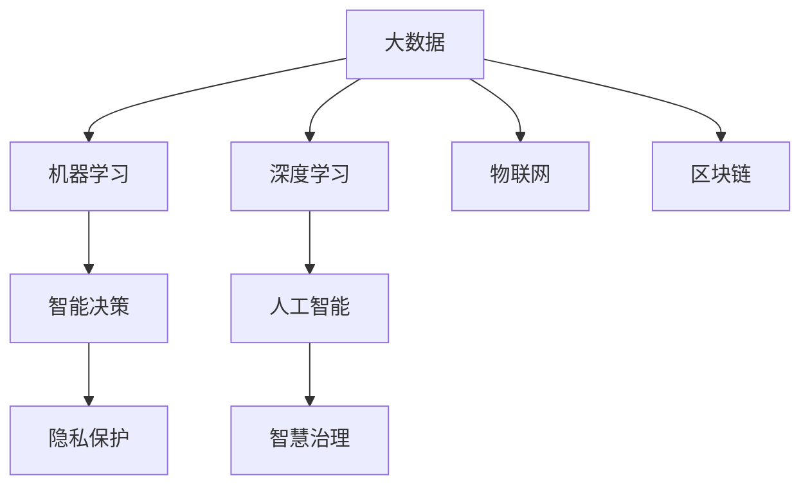

                 

# 科技创新：社会治理的新思路

## 1. 背景介绍

### 1.1 问题由来
当前，全球面临诸多复杂挑战，包括公共卫生危机、气候变化、社会不平等、网络安全等。传统的以机械思维为主导的社会治理模式已难以适应这些变化，迫切需要科技创新为社会治理注入新动力。科技创新不仅能够提高治理效率，还能带来新的治理思路和治理模式。

### 1.2 问题核心关键点
社会治理的科技创新可以从以下四个方面展开：
1. **数据驱动**：通过大数据、人工智能等技术，采集、分析社会数据，实现精准治理。
2. **智能决策**：借助机器学习、深度学习等技术，构建智能决策系统，提升决策效率和准确性。
3. **智慧治理**：利用物联网、区块链等技术，实现资源配置、公共服务的智能化管理。
4. **隐私保护**：在创新过程中注重隐私保护和数据安全，确保技术应用的伦理性和合法性。

### 1.3 问题研究意义
科技创新在社会治理中的应用，将有助于提高治理效能，实现资源优化配置，提升公共服务质量，增强社会治理的智能化和精细化水平。通过引入前沿科技，可以构建更加透明、高效、公平的社会治理体系，推动社会持续健康发展。

## 2. 核心概念与联系

### 2.1 核心概念概述

为更好地理解科技创新在社会治理中的应用，本节将介绍几个密切相关的核心概念：

- **大数据**：指数据量庞大、结构复杂、生成速度快、处理速度快、多样性强的数据集合，用于挖掘和分析社会行为、趋势和模式。
- **人工智能(AI)**：通过算法使计算机具备学习能力，实现对复杂任务的处理和决策。
- **机器学习(ML)**：指计算机通过数据学习规律，实现自主决策和预测。
- **深度学习(DL)**：机器学习的一种高级形式，通过多层次的神经网络实现对数据的高效处理和分析。
- **物联网(IoT)**：通过传感器、智能设备等将物理世界与虚拟网络相连，实现数据的实时采集和处理。
- **区块链**：一种分布式账本技术，通过去中心化、不可篡改、透明等特性保障数据安全。

这些核心概念之间的逻辑关系可以通过以下Mermaid流程图来展示：



这个流程图展示了大数据、人工智能、机器学习、深度学习、物联网、区块链等概念之间的相互关系，以及它们如何共同构成社会治理的科技创新体系。

## 3. 核心算法原理 & 具体操作步骤
### 3.1 算法原理概述

科技创新在社会治理中的应用，主要依赖于大数据、人工智能、机器学习、深度学习、物联网和区块链等技术的综合运用。这些技术通过相互结合，构建出社会治理的智能化框架，实现高效、精准、透明和安全的治理模式。

### 3.2 算法步骤详解

1. **数据采集与处理**：
   - 通过物联网设备实时采集社会数据，如气温、交通流量、公共卫生数据等。
   - 利用大数据技术对采集到的数据进行清洗、整合和分析，挖掘社会行为和趋势。

2. **智能决策与预测**：
   - 使用机器学习算法对社会数据进行模式识别，预测未来趋势，如流行病传播趋势、交通拥堵情况等。
   - 借助深度学习模型，对复杂数据进行深入分析，识别出潜在风险和机会。

3. **智慧治理实施**：
   - 利用物联网技术将物理世界和虚拟网络相连，实现资源的智能化管理，如智能电网、智能交通系统等。
   - 借助区块链技术，构建透明、不可篡改的数据记录和交易平台，保障数据安全和隐私保护。

4. **结果反馈与优化**：
   - 通过人工智能技术对治理效果进行评估和分析，不断优化治理策略和决策模型。
   - 利用大数据和机器学习，对治理结果进行持续监控和调整，提升治理效果。

### 3.3 算法优缺点

科技创新在社会治理中的应用，具有以下优点：
1. **高效精准**：通过数据驱动和智能决策，能够实现对社会问题的快速响应和精准处理。
2. **透明公开**：利用区块链技术，保障数据记录和治理过程的透明性和可追溯性。
3. **灵活多样**：通过多种技术融合，能够构建多样化的治理模式，适应不同的社会治理需求。

同时，这些技术在应用过程中也存在一些局限性：
1. **数据隐私**：大量数据的采集和处理可能涉及个人隐私，需要采取严格的数据保护措施。
2. **算法偏见**：机器学习模型可能会因为训练数据的不足或偏见，产生错误的决策。
3. **技术成本**：部分创新技术的应用需要高昂的初期投资，可能面临经济可行性问题。
4. **安全风险**：技术应用过程中可能面临网络攻击、数据泄露等安全风险。

尽管存在这些局限性，但科技创新在社会治理中的应用，仍能显著提升治理效能，推动社会治理的智能化和精细化发展。

### 3.4 算法应用领域

科技创新在社会治理中的应用，涉及多个领域，包括：

- **公共卫生管理**：利用大数据、AI技术进行疫情监测、预测和防控。
- **城市管理与规划**：通过物联网和AI技术，实现智能交通、智能建筑、智能能源管理等。
- **环境保护**：利用物联网和AI技术，进行环境监测、污染源追踪和生态保护。
- **社会安全与应急响应**：通过大数据、AI和区块链技术，构建应急响应和犯罪预防系统。
- **教育与人才培养**：利用AI和深度学习技术，实现个性化教育、智能评估和人才培养。
- **社会保障与福利**：利用AI和区块链技术，实现社会保障、福利资金管理和社会救助等。

## 4. 数学模型和公式 & 详细讲解 & 举例说明

### 4.1 数学模型构建

科技创新在社会治理中的应用，主要依赖于数据驱动和智能决策。以公共卫生管理为例，我们可以构建以下数学模型：

设 $D$ 为历史疫情数据集，$M$ 为疫情传播模型，$O$ 为未来疫情预测结果。则有：

$$
O = M(D)
$$

其中，$D = \{(t_i, x_i, y_i)\}_{i=1}^N$，$t_i$ 为时间点，$x_i$ 为疫情数据，$y_i$ 为确诊病例数。模型 $M$ 可以通过历史数据 $D$ 进行训练，从而预测未来疫情。

### 4.2 公式推导过程

以疫情预测为例，我们可以使用时间序列模型进行建模和预测。假设数据满足ARIMA模型：

$$
y_t = \phi_0 + \sum_{i=1}^{p} \phi_i y_{t-i} + \sum_{j=1}^{q} \theta_j \epsilon_{t-j} + \epsilon_t
$$

其中，$\epsilon_t$ 为随机误差项，$p$ 和 $q$ 为模型的阶数。模型参数可以通过历史数据进行估计，从而预测未来疫情的发展趋势。

### 4.3 案例分析与讲解

以美国COVID-19疫情预测为例，使用ARIMA模型进行预测：

1. **数据准备**：收集美国各州每日的确诊病例数 $D$。
2. **模型训练**：使用历史数据 $D$ 对ARIMA模型进行训练，得到模型参数 $\phi$ 和 $\theta$。
3. **结果预测**：使用训练好的模型 $M$ 对未来疫情进行预测，生成预测结果 $O$。

## 5. 项目实践：代码实例和详细解释说明

### 5.1 开发环境搭建

在进行社会治理科技创新项目开发前，我们需要准备好开发环境。以下是使用Python进行数据科学开发的典型环境配置流程：

1. 安装Anaconda：从官网下载并安装Anaconda，用于创建独立的Python环境。

2. 创建并激活虚拟环境：
```bash
conda create -n covid-env python=3.8 
conda activate covid-env
```

3. 安装必要的库：
```bash
conda install pandas numpy matplotlib seaborn sklearn statsmodels
```

4. 导入模块并准备数据：
```python
import pandas as pd
import numpy as np
import matplotlib.pyplot as plt
import seaborn as sns

# 准备数据
data = pd.read_csv('covid_data.csv')
```

### 5.2 源代码详细实现

以下是一个使用Python进行疫情预测的代码实现，包括数据处理、模型训练和结果预测等步骤。

```python
from statsmodels.tsa.arima_model import ARIMA

# 数据处理
data = pd.read_csv('covid_data.csv')
data['date'] = pd.to_datetime(data['date'])
data.set_index('date', inplace=True)

# 模型训练
model = ARIMA(data, order=(1,1,1))
model_fit = model.fit()

# 结果预测
forecast = model_fit.forecast(steps=7)

# 输出预测结果
forecast
```

### 5.3 代码解读与分析

让我们再详细解读一下关键代码的实现细节：

**数据处理**：
- 使用pandas读取CSV文件，并转换为时间序列数据。
- 使用to_datetime将日期列转换为时间类型，并设置为索引。

**模型训练**：
- 使用statsmodels库中的ARIMA模型进行建模，设置阶数为(1,1,1)。
- 使用fit方法对模型进行训练，生成训练好的模型。

**结果预测**：
- 使用forecast方法对未来7天进行预测，生成预测结果。

可以看到，通过简单的代码实现，我们就可以使用ARIMA模型进行疫情预测。

## 6. 实际应用场景

### 6.1 智慧城市建设

智慧城市是科技创新在社会治理中的典型应用场景。通过物联网、AI和区块链技术，智慧城市能够实现高效的资源管理和智能服务。

**智慧交通**：利用传感器、摄像头和AI技术，实现交通流量监测、智能信号灯控制、事故预警等，提升交通管理效率。

**智能建筑**：通过物联网和AI技术，实现智能照明、智能温控、能源管理等，提升建筑能效和舒适性。

**智能电网**：借助物联网和AI技术，实现电力负荷预测、智能调度、能源分配等，提升电网稳定性和安全性。

### 6.2 环境保护与治理

科技创新在环境保护中的应用，主要包括环境监测、污染源追踪和生态保护等方面。

**环境监测**：利用物联网传感器和AI技术，实现对空气质量、水质、噪音等环境数据的实时监测和分析，及时发现和处理环境问题。

**污染源追踪**：借助区块链技术，构建透明的环境数据记录和交易平台，实现污染源追踪和责任追究。

**生态保护**：通过物联网和AI技术，监测森林、湿地等生态系统的状态，及时采取保护措施，实现生态平衡。

### 6.3 社会安全与应急响应

科技创新在社会安全中的应用，主要体现在犯罪预防、应急响应和风险管理等方面。

**犯罪预防**：利用AI和深度学习技术，分析犯罪数据，预测犯罪热点，提高警务效率。

**应急响应**：通过物联网和AI技术，实现灾害预警、紧急救援和资源调配，保障公众安全。

**风险管理**：借助区块链技术，构建透明的风险评估和决策平台，提高风险管理的效果和透明度。

### 6.4 未来应用展望

随着科技创新的不断推进，未来的社会治理将更加智能化、高效化和透明化。科技创新在社会治理中的应用，将进一步扩展到更多的领域和场景，带来更深远的社会变革。

**智慧农业**：通过物联网和AI技术，实现精准农业、智能灌溉、智能施肥等，提升农业生产效率和环境友好度。

**智慧教育**：利用AI和深度学习技术，实现个性化教育、智能评估和教育资源共享，提升教育质量。

**智慧医疗**：借助物联网和AI技术，实现远程医疗、智能诊断和健康监测，提升医疗服务水平。

## 7. 工具和资源推荐

### 7.1 学习资源推荐

为了帮助开发者系统掌握科技创新在社会治理中的应用，这里推荐一些优质的学习资源：

1. **《Python数据科学手册》**：是一本涵盖Python数据科学各个方面的书籍，适合初学者和进阶者学习。
2. **《深度学习》课程**：由斯坦福大学开设的深度学习课程，涵盖深度学习的基本理论和实践技巧。
3. **Kaggle平台**：提供了大量的数据科学竞赛和项目，可以通过实践提升技能。
4. **GitHub代码库**：包含了大量的开源项目和代码实现，可以帮助开发者学习和借鉴。
5. **ArXiv论文库**：提供了大量的前沿研究论文，了解最新的科技发展动态。

通过对这些资源的学习实践，相信你一定能够快速掌握科技创新在社会治理中的应用，并用于解决实际的社会问题。

### 7.2 开发工具推荐

高效的开发离不开优秀的工具支持。以下是几款用于数据科学开发的常用工具：

1. **Jupyter Notebook**：一个交互式的编程环境，适合数据科学项目开发和分享。
2. **TensorFlow和PyTorch**：两个流行的深度学习框架，提供了丰富的算法和模型实现。
3. **Pandas和NumPy**：两个常用的数据处理库，提供了高效的数据处理和分析功能。
4. **Scikit-learn**：一个机器学习库，提供了丰富的算法和模型实现。
5. **JupyterLab**：一个现代化的Jupyter环境，支持更多的交互式工具和集成。

合理利用这些工具，可以显著提升数据科学项目的开发效率，加快创新迭代的步伐。

### 7.3 相关论文推荐

科技创新在社会治理中的应用，源于学界的持续研究。以下是几篇奠基性的相关论文，推荐阅读：

1. **《数据驱动的城市治理：大数据在城市管理中的应用》**：介绍了大数据在智慧城市中的应用，以及如何实现智能城市治理。
2. **《人工智能在公共卫生中的应用》**：介绍了AI在疫情监测、预测和防控中的应用，以及如何提升公共卫生管理效能。
3. **《区块链技术在社会治理中的应用》**：介绍了区块链技术在数据记录、透明性和隐私保护中的应用，以及如何构建透明和安全的治理体系。
4. **《机器学习在环境监测中的应用》**：介绍了机器学习在环境监测中的应用，以及如何实现高效的污染源追踪和生态保护。
5. **《智能应急响应系统的构建》**：介绍了AI和物联网在应急响应中的应用，以及如何构建高效和智能的应急响应系统。

这些论文代表了大数据、人工智能、机器学习和区块链等技术在社会治理中的应用方向和最新进展，可以帮助研究者把握学科前沿。

## 8. 总结：未来发展趋势与挑战

### 8.1 总结

本文对科技创新在社会治理中的应用进行了全面系统的介绍。首先阐述了大数据、人工智能、机器学习、深度学习、物联网和区块链等技术的核心概念和应用场景，明确了科技创新在社会治理中的重要价值。其次，从原理到实践，详细讲解了科技创新在社会治理中的核心算法和具体操作步骤，给出了社会治理科技创新的完整代码实例。同时，本文还探讨了科技创新在社会治理中的应用前景和挑战，展示了科技创新的广阔前景。

通过本文的系统梳理，可以看到，科技创新在社会治理中的应用，能够显著提升治理效能，实现资源优化配置，推动社会治理的智能化和精细化发展。未来，伴随科技创新技术的持续演进，相信社会治理将迈向更加智能化、高效化和透明化的新阶段。

### 8.2 未来发展趋势

展望未来，科技创新在社会治理中的应用将呈现以下几个发展趋势：

1. **数据智能融合**：通过大数据、AI和区块链技术，实现数据智能融合，提升治理决策的精准性和透明度。
2. **多模态智能感知**：利用物联网、传感器和AI技术，实现多模态智能感知，提升环境监测和公共服务的智能化水平。
3. **协同治理模式**：通过AI和区块链技术，构建协同治理平台，实现政府、企业和社会组织之间的协同治理。
4. **全民参与治理**：利用社交媒体和AI技术，实现全民参与治理，提升社会治理的广泛性和多样性。
5. **全球治理协作**：通过区块链和AI技术，构建全球治理协作平台，实现跨国治理和合作。

以上趋势凸显了科技创新在社会治理中的应用前景，预示着未来的社会治理将更加智能化、高效化和透明化。这些方向的探索发展，必将进一步提升社会治理的效能和公平性，推动社会持续健康发展。

### 8.3 面临的挑战

尽管科技创新在社会治理中的应用前景广阔，但在迈向更加智能化、普适化应用的过程中，仍面临诸多挑战：

1. **技术壁垒**：部分科技创新技术（如深度学习、区块链等）对技术门槛要求较高，需要专业人才和技术资源。
2. **数据隐私**：大量数据的采集和处理可能涉及个人隐私，需要采取严格的数据保护措施。
3. **算法偏见**：机器学习模型可能会因为训练数据的不足或偏见，产生错误的决策。
4. **资源投入**：部分科技创新技术（如物联网、AI等）需要高昂的初期投资，可能面临经济可行性问题。
5. **安全风险**：技术应用过程中可能面临网络攻击、数据泄露等安全风险。

尽管存在这些挑战，但科技创新在社会治理中的应用，仍能显著提升治理效能，推动社会治理的智能化和精细化发展。面对这些挑战，需要政府、企业和科研机构的共同努力，寻求解决方案，实现科技创新在社会治理中的全面应用。

### 8.4 研究展望

未来的科技创新在社会治理中的应用，需要在以下几个方面进行更多的研究：

1. **数据融合与隐私保护**：探索如何实现数据智能融合，同时保障数据隐私和安全。
2. **多模态智能感知**：研究多模态数据融合和智能感知技术，提升环境监测和公共服务的智能化水平。
3. **协同治理模式**：构建协同治理平台，实现政府、企业和社会组织之间的协同治理。
4. **全民参与治理**：利用社交媒体和AI技术，实现全民参与治理，提升社会治理的广泛性和多样性。
5. **全球治理协作**：通过区块链和AI技术，构建全球治理协作平台，实现跨国治理和合作。

这些研究方向的探索，必将引领科技创新在社会治理中的持续发展和创新，推动社会治理的智能化和公平化。只有在技术、管理和政策等多方面协同发力，才能真正实现科技创新在社会治理中的广泛应用。

## 9. 附录：常见问题与解答

**Q1：数据智能融合需要哪些关键技术？**

A: 数据智能融合需要以下关键技术：
1. **数据采集与清洗**：通过物联网、传感器等设备采集实时数据，并进行清洗和预处理。
2. **数据集成与存储**：将不同来源的数据进行集成，存储在数据仓库中。
3. **数据处理与分析**：利用大数据技术和机器学习算法，对数据进行高效处理和分析，挖掘数据中的规律和趋势。
4. **数据可视化**：通过数据可视化技术，将分析结果直观展示，帮助决策者理解数据。
5. **数据保护与隐私**：采用数据加密、匿名化等技术，保障数据隐私和安全。

**Q2：如何提升智能决策的精准性？**

A: 提升智能决策的精准性需要以下措施：
1. **高质量数据**：采集和处理高质量的数据，减少噪声和偏差。
2. **多模型融合**：利用多种模型进行融合，提升决策的鲁棒性和准确性。
3. **实时更新**：根据最新的数据和反馈，实时更新模型，提升决策的及时性和适应性。
4. **交叉验证**：采用交叉验证等方法，评估模型的效果和泛化能力。
5. **透明度和可解释性**：提高决策的透明度和可解释性，便于监督和调整。

**Q3：如何实现多模态智能感知？**

A: 实现多模态智能感知需要以下步骤：
1. **传感器部署**：在需要感知的环境中部署各种传感器，采集多模态数据。
2. **数据融合**：利用物联网技术，将多模态数据进行融合和同步。
3. **数据处理**：利用大数据和AI技术，对多模态数据进行高效处理和分析。
4. **智能感知**：通过深度学习等技术，实现多模态数据的智能感知和分析。
5. **应用场景**：将智能感知结果应用到实际场景中，提升环境监测和公共服务的智能化水平。

**Q4：如何保障数据隐私？**

A: 保障数据隐私需要以下措施：
1. **数据匿名化**：对敏感数据进行匿名化处理，减少隐私泄露风险。
2. **数据加密**：采用数据加密技术，保护数据在传输和存储过程中的安全。
3. **访问控制**：通过访问控制技术，限制对数据的访问权限，保障数据安全。
4. **数据审计**：对数据访问和使用进行审计，发现和处理违规行为。
5. **隐私保护法律**：制定和完善数据隐私保护法律，规范数据使用和处理行为。

**Q5：如何应对社会治理中的技术壁垒？**

A: 应对社会治理中的技术壁垒需要以下措施：
1. **人才培养**：加强技术人才培养，提升技术储备和应用能力。
2. **技术合作**：加强技术合作，利用外部技术资源，提升技术应用水平。
3. **技术创新**：鼓励技术创新，开发适合社会治理需求的新技术和新产品。
4. **政策支持**：制定和完善政策，鼓励技术应用和推广。
5. **公共服务**：提供技术服务和支持，帮助政府和企业应用新技术。

---

作者：禅与计算机程序设计艺术 / Zen and the Art of Computer Programming

