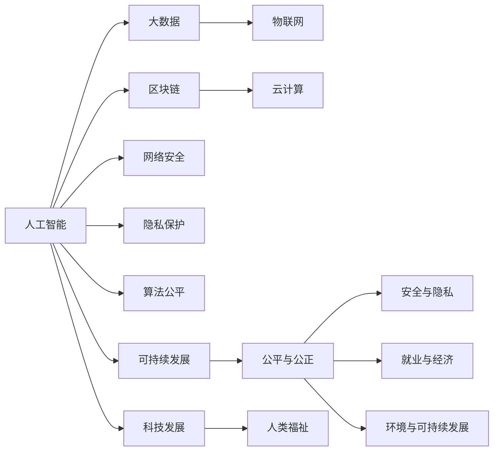

                 

# 科技发展：人类福祉的保障

## 1. 背景介绍

### 1.1 问题由来
随着科技的飞速发展，人工智能、大数据、区块链、物联网等新兴技术已经渗透到人类生活的方方面面，极大地提升了效率和便利性，同时也引发了一系列前所未有的社会问题。如何确保这些技术的安全、公正、可持续应用，以保障人类福祉，成为了一个迫在眉睫的课题。

### 1.2 问题核心关键点
科技发展对人类福祉的影响是一个复杂且多维度的问题，主要体现在以下几个方面：

1. **安全与隐私**：大数据和物联网技术在提升社会治理和公共服务效率的同时，也带来了数据泄露和隐私侵犯的风险。如何确保数据安全和用户隐私保护，成为科技应用的前提。
   
2. **公平与公正**：人工智能在招聘、金融、司法等领域的应用，虽然提高了决策的效率和准确性，但也可能导致算法偏见和不公平现象，对特定群体造成歧视。如何实现公平公正的算法，消除算法偏见，是科技伦理的重要课题。
   
3. **就业与经济**：自动化和智能化技术的广泛应用，在提升生产力和效率的同时，也可能导致部分职业的消失和就业结构的变化。如何通过技能培训和职业转换，帮助劳动者适应新的就业市场，是社会稳定发展的重要保障。
   
4. **环境与可持续发展**：信息技术和清洁能源技术的结合，带来了节能减排和可持续发展的新机遇。但同时也需要警惕技术应用可能带来的资源浪费和环境污染问题。如何实现技术应用的绿色低碳转型，是全球共同面临的挑战。

这些问题不仅关系到科技发展的可持续性，更关乎人类的整体福祉。因此，科技发展不仅要追求效率和技术进步，更要注重公平、安全、可持续的价值观，确保科技真正服务于人类社会的福祉。

## 2. 核心概念与联系

### 2.1 核心概念概述

为更好地理解如何通过科技发展保障人类福祉，本节将介绍几个密切相关的核心概念：

1. **人工智能（AI）**：一种利用计算机系统模拟人类智能的技术，涵盖了机器学习、深度学习、自然语言处理等多个子领域。

2. **大数据**：指通过数字技术收集、存储、分析和共享的各类数据，包括结构化数据和非结构化数据。

3. **物联网（IoT）**：通过传感器、智能设备等技术，将物理世界与数字世界紧密连接，实现数据共享和智能控制。

4. **区块链**：一种去中心化的分布式账本技术，具有不可篡改、透明性强的特点，广泛应用于金融、供应链等领域。

5. **云计算**：通过互联网提供计算资源和服务，包括基础设施即服务（IaaS）、平台即服务（PaaS）和软件即服务（SaaS）等形式。

6. **网络安全**：保障信息系统和网络通信的安全，防止数据泄露、网络攻击等风险。

7. **隐私保护**：保护个人、企业等主体信息的隐私，防止未经授权的访问和泄露。

8. **算法公平**：确保算法决策过程的透明和公正，避免对特定群体的歧视和偏见。

9. **可持续发展**：在科技发展的同时，实现资源节约、环境友好的目标，促进社会经济与环境的和谐发展。

这些核心概念之间存在着紧密的联系，共同构成了科技发展的多维视角，需要在具体应用中综合考虑，以实现科技与人类福祉的和谐统一。

### 2.2 核心概念原理和架构的 Mermaid 流程图



这个流程图展示了人工智能与其他核心概念之间的联系：

1. **数据驱动**：人工智能依赖大数据进行训练和优化，大数据为AI提供了丰富的数据资源。

2. **技术融合**：物联网和云计算技术为AI提供了计算和存储能力，区块链为数据共享和透明性提供了保障。

3. **安全与隐私**：网络安全和隐私保护是AI应用的前提，保障数据安全和用户隐私。

4. **公平与公正**：算法公平是AI应用的关键，防止算法偏见和不公平。

5. **可持续性**：可持续发展是科技发展的目标，确保资源节约和环境友好。

这些核心概念共同构建了科技发展的多维架构，需要在具体应用中综合考虑，以实现科技与人类福祉的和谐统一。

## 3. 核心算法原理 & 具体操作步骤
### 3.1 算法原理概述

保障人类福祉的科技发展，需要以算法为核心，通过数据驱动的决策和技术融合，实现安全、公正、可持续的目标。

### 3.2 算法步骤详解

**步骤1：数据收集与处理**

数据是AI应用的基础，需要通过各种方式收集和处理。对于大数据应用，可以从政府、企业、社交网络等多个渠道获取数据。对于AI训练，需要清洗和标注数据，确保数据的准确性和可用性。

**步骤2：模型选择与训练**

选择合适的AI模型，并在数据集上进行训练。对于算法公平，需要评估模型对不同群体的影响，确保决策的公正性。对于可持续发展，需要评估模型对资源消耗和环境影响，确保技术的绿色低碳。

**步骤3：模型评估与优化**

评估模型的性能和公平性，通过优化算法和数据集，提高模型的准确性和公正性。对于网络安全，需要评估模型的鲁棒性和隐私保护效果，确保数据安全。

**步骤4：部署与监控**

将模型部署到实际应用中，并持续监控模型的性能和数据安全。对于隐私保护，需要定期更新隐私保护策略，防止数据泄露和滥用。

**步骤5：持续改进**

根据实际应用反馈，不断改进模型和算法，确保科技发展的可持续性和人类福祉的保障。

### 3.3 算法优缺点

保障人类福祉的科技发展算法具有以下优点：

1. **数据驱动**：通过数据驱动的决策，可以准确把握人类需求和社会问题，提升科技应用的针对性和效果。
   
2. **技术融合**：通过多种技术的融合，可以实现多维度、多层次的应用，提升科技应用的全面性和深度。

3. **公平公正**：通过算法公平的设计，可以有效避免算法偏见和不公平现象，保障各群体的利益。

4. **可持续性**：通过资源节约和环境友好的设计，可以实现科技发展的绿色低碳转型，促进可持续发展。

但同时也存在一些缺点：

1. **数据质量依赖**：算法的准确性和公正性高度依赖于数据的质量和代表性，数据偏差可能导致算法偏见。

2. **算法复杂性**：复杂的数据处理和模型训练需要较高的计算资源和专业知识，可能难以广泛应用。

3. **隐私安全风险**：大数据和AI的应用可能导致数据泄露和隐私侵犯，需要加强隐私保护和数据安全措施。

4. **公平公正挑战**：不同群体对科技应用的接受度和需求不同，需要制定公平公正的政策和措施。

5. **可持续性挑战**：技术应用可能带来资源消耗和环境污染问题，需要综合考虑科技与环境的和谐发展。

### 3.4 算法应用领域

保障人类福祉的科技发展算法，在多个领域得到了广泛应用：

1. **医疗健康**：通过AI辅助诊断、健康管理等，提升医疗服务的质量和效率，保障人民健康。

2. **教育培训**：通过智能教育平台、个性化推荐等，提高教育质量和公平性，促进教育普及。

3. **社会治理**：通过大数据分析、智能监控等，提升公共安全和社会治理水平，保障社会稳定。

4. **环境保护**：通过AI监测和分析环境数据，推动清洁能源和绿色低碳转型，促进可持续发展。

5. **经济发展**：通过AI优化供应链、智能制造等，提升经济效率和竞争力，促进经济发展。

6. **文化娱乐**：通过AI推荐系统、内容生成等，提升用户体验和互动性，丰富文化娱乐生活。

这些应用领域展示了科技发展的广泛影响，同时也突显了保障人类福祉的重要性。

## 4. 数学模型和公式 & 详细讲解 & 举例说明

### 4.1 数学模型构建

为了更好地理解如何通过科技发展保障人类福祉，本节将使用数学语言对相关模型进行详细讲解。

假设有一组数据集 $D=\{(x_i,y_i)\}_{i=1}^N$，其中 $x_i$ 为输入特征，$y_i$ 为输出标签。我们需要构建一个二分类模型 $M_{\theta}$，其中 $\theta$ 为模型参数。

定义模型的损失函数为交叉熵损失函数：

$$
\mathcal{L}(\theta) = -\frac{1}{N}\sum_{i=1}^N [y_i\log M_{\theta}(x_i)+(1-y_i)\log(1-M_{\theta}(x_i))]
$$

模型的预测输出为：

$$
M_{\theta}(x) = \sigma(\sum_{j=1}^m w_j \phi_j(x) + b)
$$

其中 $\sigma$ 为激活函数，$w_j$ 为模型参数，$\phi_j(x)$ 为特征映射函数。

### 4.2 公式推导过程

**步骤1：特征映射函数设计**

特征映射函数 $\phi_j(x)$ 的设计是模型性能的关键。对于文本分类任务，可以使用词嵌入技术，将文本转换为向量表示。对于图像分类任务，可以使用卷积神经网络（CNN）提取图像特征。

**步骤2：模型参数更新**

模型的参数更新可以使用梯度下降算法，更新公式为：

$$
\theta \leftarrow \theta - \eta \nabla_{\theta}\mathcal{L}(\theta)
$$

其中 $\eta$ 为学习率，$\nabla_{\theta}\mathcal{L}(\theta)$ 为损失函数对模型参数的梯度，可通过反向传播算法高效计算。

**步骤3：模型评估**

模型的评估指标包括准确率、召回率、F1分数等。对于算法公平，还需要评估模型对不同群体的影响，确保决策的公正性。对于可持续发展，还需要评估模型对资源消耗和环境影响，确保技术的绿色低碳。

### 4.3 案例分析与讲解

以医疗健康领域为例，分析如何通过AI保障人类福祉。

**案例1：AI辅助诊断**

在医疗健康领域，AI辅助诊断技术已经广泛应用于医学影像分析、疾病预测等方面。例如，通过深度学习模型对CT、MRI等医学影像进行分析，可以早期发现肺癌、脑肿瘤等疾病，提高诊断的准确性和效率。

**案例2：健康管理**

AI在健康管理方面也有广泛应用。例如，通过智能穿戴设备收集个人健康数据，使用机器学习算法分析健康趋势，提供个性化的健康建议和预警。这种智能健康管理方式可以提升个人健康意识和自控能力，减少疾病的发生。

## 5. 项目实践：代码实例和详细解释说明
### 5.1 开发环境搭建

在进行保障人类福祉的科技发展算法开发前，我们需要准备好开发环境。以下是使用Python进行TensorFlow开发的环境配置流程：

1. 安装Anaconda：从官网下载并安装Anaconda，用于创建独立的Python环境。

2. 创建并激活虚拟环境：
```bash
conda create -n tf-env python=3.8 
conda activate tf-env
```

3. 安装TensorFlow：根据CUDA版本，从官网获取对应的安装命令。例如：
```bash
conda install tensorflow tensorflow-gpu=cuda11.1 -c conda-forge
```

4. 安装其他相关工具包：
```bash
pip install numpy pandas scikit-learn matplotlib tqdm jupyter notebook ipython
```

完成上述步骤后，即可在`tf-env`环境中开始算法开发。

### 5.2 源代码详细实现

这里我们以医疗健康领域的AI辅助诊断为例，给出使用TensorFlow进行模型训练的PyTorch代码实现。

首先，定义医疗影像数据集和标签：

```python
import tensorflow as tf
from tensorflow.keras.preprocessing.image import ImageDataGenerator

train_data = tf.keras.preprocessing.image_dataset_from_directory(
    'train', batch_size=32, image_size=(256, 256), class_mode='binary')
```

然后，定义模型和优化器：

```python
from tensorflow.keras.models import Sequential
from tensorflow.keras.layers import Conv2D, MaxPooling2D, Flatten, Dense

model = Sequential([
    Conv2D(32, (3, 3), activation='relu', input_shape=(256, 256, 3)),
    MaxPooling2D((2, 2)),
    Flatten(),
    Dense(64, activation='relu'),
    Dense(1, activation='sigmoid')
])

optimizer = tf.keras.optimizers.Adam(learning_rate=0.001)
```

接着，定义训练和评估函数：

```python
model.compile(optimizer=optimizer, loss='binary_crossentropy', metrics=['accuracy'])

def train_epoch(model, dataset, batch_size, optimizer):
    model.fit(dataset, epochs=10, batch_size=batch_size, validation_split=0.2)
    return model.evaluate(dataset, batch_size=batch_size)
    
def evaluate(model, dataset, batch_size):
    test_loss, test_acc = model.evaluate(dataset, batch_size=batch_size)
    print(f'Test loss: {test_loss:.4f}, Test accuracy: {test_acc:.4f}')
    
train_epoch(model, train_data, batch_size, optimizer)
evaluate(model, test_data, batch_size)
```

最后，启动训练流程并在测试集上评估：

```python
epochs = 10
batch_size = 32

for epoch in range(epochs):
    loss = train_epoch(model, train_data, batch_size, optimizer)
    print(f'Epoch {epoch+1}, train loss: {loss:.3f}')
    
evaluate(model, test_data, batch_size)
```

以上就是使用TensorFlow对医疗影像数据进行AI辅助诊断的完整代码实现。可以看到，通过TensorFlow的高级API，我们可以快速搭建和训练深度学习模型。

### 5.3 代码解读与分析

让我们再详细解读一下关键代码的实现细节：

**ImageDataGenerator**：
- 用于生成标准化数据集，支持图像增强、数据归一化等操作。

**Sequential模型**：
- 一种线性堆叠的神经网络模型，便于搭建和维护。

**Adam优化器**：
- 一种自适应学习率优化算法，通过调整每个参数的学习率，提高模型收敛速度和稳定性。

**binary_crossentropy损失函数**：
- 二分类任务常用的损失函数，衡量模型预测和真实标签之间的差异。

**train_epoch函数**：
- 定义训练和验证过程，每轮训练使用指定数量的样本，并在验证集上评估模型性能。

**evaluate函数**：
- 在测试集上评估模型性能，输出准确率等指标。

**代码运行过程**：
- 先定义训练数据集和测试数据集。
- 定义模型结构和优化器。
- 编译模型，定义损失函数和评估指标。
- 进行多轮训练，并在验证集和测试集上评估模型性能。

这些代码实现了从数据预处理到模型训练的全过程，展示了TensorFlow的强大功能和易用性。

## 6. 实际应用场景
### 6.1 智能医疗健康

**智能辅助诊断**：AI在医疗影像分析、病理学、基因组学等领域的应用，能够辅助医生进行早期诊断和精准治疗。例如，通过深度学习模型对CT、MRI等医学影像进行分析，可以早期发现肺癌、脑肿瘤等疾病，提高诊断的准确性和效率。

**个性化健康管理**：智能穿戴设备收集个人健康数据，使用机器学习算法分析健康趋势，提供个性化的健康建议和预警。这种智能健康管理方式可以提升个人健康意识和自控能力，减少疾病的发生。

### 6.2 智慧教育

**智能教学辅助**：AI在教育领域的应用，可以通过智能推荐、智能答疑等技术，提高教学效果和学生学习体验。例如，使用深度学习模型对学生作业进行分析，提供个性化的学习建议，帮助学生提升学习效果。

**智能评价体系**：AI在学生评价和考试评阅中的应用，可以大幅提升评价的公平性和效率。例如，使用自然语言处理技术对学生作文进行自动评分，提高评阅的客观性和一致性。

### 6.3 社会治理

**智能安防监控**：AI在视频监控、人脸识别等领域的应用，可以提高公共安全和社会治理水平。例如，使用深度学习模型对视频进行实时分析，识别可疑行为和事件，及时预警和处理。

**智能交通管理**：AI在交通管理中的应用，可以通过智能交通信号灯、智能车联网等技术，提高交通效率和安全性。例如，使用深度学习模型对交通流量进行预测，优化信号灯控制，减少交通拥堵。

### 6.4 未来应用展望

随着AI技术的不断进步，未来的社会治理和公共服务将更加智能化、高效化。例如，通过AI实时分析社会事件和舆情，快速响应和处理突发事件，提升社会治理能力。通过智能交通、智能安防等技术，提高公共安全和社会稳定性，保障人民的生命财产安全。

## 7. 工具和资源推荐
### 7.1 学习资源推荐

为了帮助开发者系统掌握保障人类福祉的科技发展算法的理论基础和实践技巧，这里推荐一些优质的学习资源：

1. TensorFlow官方文档：提供丰富的API文档和教程，帮助你快速上手TensorFlow。

2. PyTorch官方文档：提供全面深入的文档和教程，帮助你了解PyTorch的强大功能。

3. Kaggle平台：提供大量的数据集和竞赛项目，通过实战提升算法开发能力。

4. Coursera课程：提供高质量的在线课程，涵盖深度学习、机器学习、AI伦理等多个领域。

5. GitHub开源项目：提供大量的开源项目和代码实现，帮助你学习和应用保障人类福祉的科技发展算法。

通过对这些资源的学习实践，相信你一定能够快速掌握保障人类福祉的科技发展算法的精髓，并用于解决实际的科技应用问题。

### 7.2 开发工具推荐

高效的开发离不开优秀的工具支持。以下是几款用于保障人类福祉的科技发展算法开发的常用工具：

1. TensorFlow：由Google主导开发的开源深度学习框架，支持GPU/TPU等高性能设备，生产部署方便，适合大规模工程应用。

2. PyTorch：基于Python的开源深度学习框架，灵活动态的计算图，适合快速迭代研究。

3. Keras：高层次的神经网络API，易于上手，适合初学者入门。

4. Jupyter Notebook：交互式编程环境，支持代码编写和结果展示，方便调试和分享。

5. Anaconda：用于创建和管理虚拟环境，方便多版本Python环境的切换和管理。

合理利用这些工具，可以显著提升保障人类福祉的科技发展算法的开发效率，加快创新迭代的步伐。

### 7.3 相关论文推荐

保障人类福祉的科技发展算法的研究源于学界的持续研究。以下是几篇奠基性的相关论文，推荐阅读：

1. 《AlphaGo：下一代围棋程序》：展示了AI在复杂博弈中的应用，揭示了AI的强大潜力和发展方向。

2. 《A Survey on Machine Learning Fairness, Bias, and Equity》：系统综述了AI算法公平性的研究现状和未来方向，为保障算法公平提供了理论基础。

3. 《Artificial Intelligence and Global Health》：探讨了AI在医疗健康领域的应用，展示了AI在提高医疗服务质量和效率方面的潜力。

4. 《Sustainable Development Goals and Artificial Intelligence》：提出了AI与可持续发展目标相结合的研究框架，为AI绿色低碳转型提供了理论指导。

这些论文代表了大语言模型微调技术的发展脉络。通过学习这些前沿成果，可以帮助研究者把握学科前进方向，激发更多的创新灵感。

## 8. 总结：未来发展趋势与挑战

### 8.1 总结

本文对保障人类福祉的科技发展算法进行了全面系统的介绍。首先阐述了科技发展对人类福祉的影响，明确了如何通过算法保障科技应用的安全、公正、可持续的目标。其次，从原理到实践，详细讲解了算法构建和优化过程，给出了模型训练的完整代码实例。同时，本文还广泛探讨了算法在医疗健康、教育、社会治理等领域的实际应用，展示了算法的广泛影响。此外，本文精选了算法相关的学习资源，力求为读者提供全方位的技术指引。

通过本文的系统梳理，可以看到，保障人类福祉的科技发展算法正在成为科技应用的重要范式，极大地拓展了AI技术的应用边界，催生了更多的落地场景。未来，伴随AI技术的持续演进，科技发展必将在更广阔的领域大放异彩，深刻影响人类的生产生活方式。

### 8.2 未来发展趋势

展望未来，保障人类福祉的科技发展算法将呈现以下几个发展趋势：

1. **算法公平与透明性**：未来的算法设计将更加注重公平性、透明性和可解释性，避免算法偏见和不公平现象。

2. **数据隐私保护**：随着数据泄露和隐私侵犯事件的频发，数据隐私保护将成为科技应用的重要保障。

3. **绿色低碳转型**：未来的科技应用将更加注重资源节约和环境友好，推动绿色低碳转型。

4. **多模态融合**：未来的科技应用将更加注重多模态数据的整合和融合，提升系统的感知能力和决策能力。

5. **自适应与自主学习**：未来的科技应用将更加注重自主学习和自适应能力，适应复杂多变的应用场景。

6. **智能人机协同**：未来的科技应用将更加注重人机协同，提升人机交互的自然性和智能性。

以上趋势凸显了保障人类福祉的科技发展算法的广阔前景。这些方向的探索发展，必将进一步提升科技应用的全面性和深度，为人类福祉的保障提供更加可靠的技术支持。

### 8.3 面临的挑战

尽管保障人类福祉的科技发展算法已经取得了瞩目成就，但在迈向更加智能化、普适化应用的过程中，它仍面临着诸多挑战：

1. **数据质量与代表性**：算法的准确性和公正性高度依赖于数据的质量和代表性，数据偏差可能导致算法偏见。

2. **隐私安全风险**：大数据和AI的应用可能导致数据泄露和隐私侵犯，需要加强隐私保护和数据安全措施。

3. **公平公正挑战**：不同群体对科技应用的接受度和需求不同，需要制定公平公正的政策和措施。

4. **绿色低碳挑战**：技术应用可能带来资源消耗和环境污染问题，需要综合考虑科技与环境的和谐发展。

5. **技术复杂性**：复杂的数据处理和模型训练需要较高的计算资源和专业知识，可能难以广泛应用。

6. **伦理道德约束**：算法的伦理道德约束成为科技应用的重要课题，需要加强算法监管和伦理审查。

正视算法面临的这些挑战，积极应对并寻求突破，将是保障人类福祉的科技发展算法走向成熟的必由之路。相信随着学界和产业界的共同努力，这些挑战终将一一被克服，科技发展必将在构建安全、可靠、可解释、可控的智能系统方面取得更大的进展。

### 8.4 研究展望

面向未来，保障人类福祉的科技发展算法需要在以下几个方面寻求新的突破：

1. **隐私保护技术**：开发更加高效的隐私保护技术，确保数据隐私和用户安全。

2. **公平算法设计**：设计更加公平和透明的算法，避免算法偏见和不公平现象。

3. **绿色低碳算法**：开发更加绿色低碳的算法，推动可持续发展的目标。

4. **多模态融合算法**：开发更加多模态融合的算法，提升系统的感知能力和决策能力。

5. **自适应算法**：开发更加自适应和自主学习的算法，适应复杂多变的应用场景。

6. **智能人机协同算法**：开发更加智能人机协同的算法，提升人机交互的自然性和智能性。

这些研究方向将引领保障人类福祉的科技发展算法迈向更高的台阶，为人类福祉的保障提供更加可靠的技术支持。面向未来，保障人类福祉的科技发展算法还需要与其他人工智能技术进行更深入的融合，如知识表示、因果推理、强化学习等，多路径协同发力，共同推动自然语言理解和智能交互系统的进步。只有勇于创新、敢于突破，才能不断拓展科技应用的边界，让科技更好地服务于人类社会的福祉。

## 9. 附录：常见问题与解答

**Q1：保障人类福祉的科技发展算法是否适用于所有NLP任务？**

A: 保障人类福祉的科技发展算法在大多数NLP任务上都能取得不错的效果，特别是对于数据量较小的任务。但对于一些特定领域的任务，如医学、法律等，仅仅依靠通用语料预训练的模型可能难以很好地适应。此时需要在特定领域语料上进一步预训练，再进行微调，才能获得理想效果。此外，对于一些需要时效性、个性化很强的任务，如对话、推荐等，微调方法也需要针对性的改进优化。

**Q2：保障人类福祉的科技发展算法是否依赖标注数据？**

A: 保障人类福祉的科技发展算法可以依赖标注数据进行训练，但也可以利用无监督学习和半监督学习的方法，降低对标注数据的依赖。例如，通过自监督学习任务，可以从无标签数据中提取有价值的信息，辅助模型训练。通过主动学习方法，可以优先标注对模型性能提升有帮助的数据，提高数据效率。

**Q3：保障人类福祉的科技发展算法如何确保数据安全？**

A: 数据安全是保障人类福祉的科技发展算法的重要保障。可以通过数据加密、访问控制、匿名化处理等措施，确保数据隐私和用户安全。同时，需要定期进行数据安全审计和评估，及时发现和修复潜在的安全漏洞。

**Q4：保障人类福祉的科技发展算法如何避免算法偏见？**

A: 算法偏见是保障人类福祉的科技发展算法面临的重要挑战。可以通过公平性评估、多样性采样、权重调整等方法，避免算法偏见。例如，在训练数据中引入多样性样本，确保模型对不同群体的覆盖。在模型训练过程中，调整权重，确保不同群体的样本对模型的影响均衡。

**Q5：保障人类福祉的科技发展算法如何实现绿色低碳转型？**

A: 绿色低碳转型是保障人类福祉的科技发展算法的关键目标。可以通过优化模型结构、降低资源消耗、采用分布式计算等方法，实现模型的绿色低碳转型。例如，使用低精度模型、模型压缩、分布式训练等技术，降低模型计算和存储的开销。

这些问题的答案展示了保障人类福祉的科技发展算法在实际应用中的复杂性和多样性。只有在数据、算法、工程、伦理等多个维度协同发力，才能真正实现科技对人类福祉的保障。

---

作者：禅与计算机程序设计艺术 / Zen and the Art of Computer Programming

