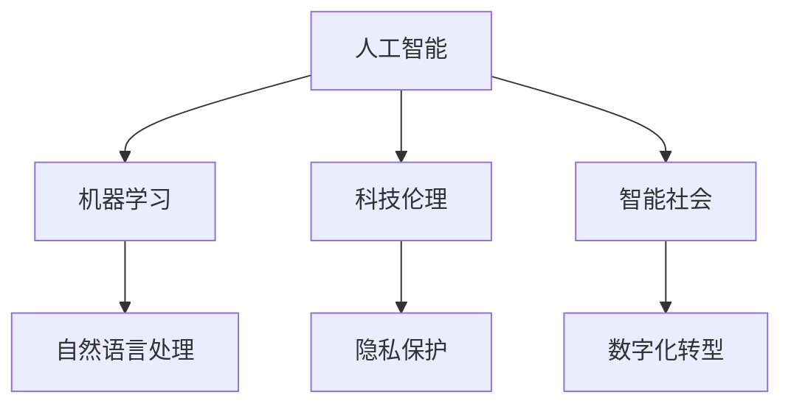

                 

# 科技发展：人类福祉的保障

> 关键词：人工智能,机器学习,科技伦理,智能社会,数字化转型,隐私保护

## 1. 背景介绍

在过去的几十年里，科技发展已经深刻地改变了人类社会的面貌。从互联网到智能手机，从大数据到区块链，再到目前正处于加速发展阶段的AI技术，科技正成为推动社会进步的重要力量。然而，科技的发展并不是一帆风顺的，它带来了巨大的机遇，也带来了诸多挑战。本文旨在探讨科技发展对人类福祉的影响，分析其中的挑战和机遇，并提出相应的解决方案。

## 2. 核心概念与联系

### 2.1 核心概念概述

为了更好地理解科技发展与人类福祉的关系，我们将首先介绍几个核心概念：

- **人工智能**：利用算法和计算能力模拟人类智能的技术，包括机器学习、深度学习、自然语言处理等。
- **机器学习**：一种通过数据训练模型，使其能够自主学习并作出决策的技术。
- **科技伦理**：探讨科技应用中可能引发的伦理问题，如隐私保护、公平性、安全性等。
- **智能社会**：指一个利用科技手段提升人类生活质量、解决社会问题的社会形态。
- **数字化转型**：指通过信息技术的广泛应用，推动传统行业向数字化、智能化转型的过程。
- **隐私保护**：指在科技应用中保护个人隐私，防止数据滥用和泄露。

### 2.2 核心概念原理和架构的 Mermaid 流程图



### 2.3 核心概念之间的联系

- **人工智能与机器学习**：人工智能的核心是机器学习，通过数据训练模型，使其能够自主学习并作出决策。
- **人工智能与自然语言处理**：自然语言处理是人工智能的重要分支，通过算法使计算机能够理解和处理人类语言。
- **人工智能与智能社会**：智能社会是人工智能技术在社会各个领域广泛应用的结果，通过智能技术提升生活质量、解决社会问题。
- **科技伦理与隐私保护**：科技伦理的核心是保护用户隐私，防止数据滥用和泄露，确保技术应用的公平性和安全性。
- **数字化转型与智能社会**：数字化转型是智能社会的基础，通过信息技术的广泛应用，推动社会向智能化转型。

这些核心概念之间的联系形成了科技发展的完整框架，帮助我们理解科技对人类福祉的影响。

## 3. 核心算法原理 & 具体操作步骤

### 3.1 算法原理概述

基于人工智能的科技发展对人类福祉的影响是多方面的。本文将重点讨论机器学习算法的原理与应用，以及如何通过算法提升人类福祉。

机器学习算法的核心是数据训练模型，使其能够自主学习并作出决策。常见的机器学习算法包括监督学习、无监督学习和强化学习。这些算法在各个领域得到了广泛应用，如医疗、金融、教育、交通等。通过机器学习算法，可以提升数据处理效率、预测准确度、决策自动化等，从而提升人类福祉。

### 3.2 算法步骤详解

机器学习算法通常包括以下几个关键步骤：

1. **数据收集**：收集与任务相关的数据，如医疗数据、金融数据、教育数据等。
2. **数据预处理**：对数据进行清洗、去噪、标准化等处理，以提升模型训练效果。
3. **模型训练**：选择合适的算法模型，通过数据训练模型，使其能够自主学习并作出决策。
4. **模型评估**：在测试数据集上评估模型性能，如准确度、召回率、F1分数等。
5. **模型应用**：将训练好的模型应用到实际场景中，提升工作效率、改善决策质量等。

### 3.3 算法优缺点

机器学习算法的优点包括：

- **自动化决策**：通过算法自主学习，可以提升决策的效率和准确度。
- **可扩展性**：机器学习算法可以应用于各个领域，提升数据处理效率。
- **数据驱动**：机器学习算法依赖于数据，通过数据驱动决策，提升决策质量。

机器学习算法的缺点包括：

- **数据依赖**：算法依赖于数据，数据质量差会影响算法效果。
- **模型黑盒**：机器学习算法通常是"黑盒"模型，难以解释其内部工作机制。
- **过拟合风险**：模型容易过拟合训练数据，导致泛化能力不足。

### 3.4 算法应用领域

机器学习算法在各个领域得到了广泛应用，以下是几个典型应用：

- **医疗**：通过机器学习算法分析医疗数据，提升疾病诊断准确度，个性化医疗方案。
- **金融**：利用机器学习算法进行风险预测、信用评估、投资决策等。
- **教育**：通过机器学习算法进行学生评估、智能推荐、学习内容推荐等。
- **交通**：利用机器学习算法进行交通流量预测、智能交通管理等。

## 4. 数学模型和公式 & 详细讲解 & 举例说明

### 4.1 数学模型构建

机器学习算法的数学模型通常包括数据集、损失函数、优化算法等。以下以监督学习算法为例，介绍数学模型的构建过程。

假设有一个二分类任务，训练数据集为 $(x_i, y_i)$，其中 $x_i$ 为输入特征，$y_i$ 为标签。模型的目标是最小化损失函数：

$$
L(\theta) = \frac{1}{N}\sum_{i=1}^N \ell(\theta, x_i, y_i)
$$

其中 $\theta$ 为模型参数，$\ell(\theta, x_i, y_i)$ 为损失函数。常见的损失函数包括交叉熵损失、均方误差损失等。

### 4.2 公式推导过程

以交叉熵损失函数为例，其公式为：

$$
\ell(\theta, x_i, y_i) = -[y_i \log \sigma(\theta^T x_i) + (1-y_i) \log(1-\sigma(\theta^T x_i))]
$$

其中 $\sigma(z) = \frac{1}{1+e^{-z}}$ 为sigmoid函数。

### 4.3 案例分析与讲解

假设有一个二分类任务，训练数据集为 $(x_i, y_i)$，其中 $x_i$ 为输入特征，$y_i$ 为标签。模型的目标是最小化损失函数：

$$
L(\theta) = \frac{1}{N}\sum_{i=1}^N \ell(\theta, x_i, y_i)
$$

其中 $\theta$ 为模型参数，$\ell(\theta, x_i, y_i)$ 为损失函数。

在实践中，我们通常使用梯度下降等优化算法来求解最小化问题：

$$
\theta \leftarrow \theta - \eta \nabla_{\theta} L(\theta)
$$

其中 $\eta$ 为学习率。

## 5. 项目实践：代码实例和详细解释说明

### 5.1 开发环境搭建

在进行机器学习算法实践前，我们需要准备好开发环境。以下是使用Python进行Scikit-Learn开发的环境配置流程：

1. 安装Anaconda：从官网下载并安装Anaconda，用于创建独立的Python环境。

2. 创建并激活虚拟环境：
```bash
conda create -n sklearn-env python=3.8 
conda activate sklearn-env
```

3. 安装Scikit-Learn：
```bash
pip install scikit-learn
```

4. 安装NumPy、Pandas等库：
```bash
pip install numpy pandas
```

完成上述步骤后，即可在`sklearn-env`环境中开始项目实践。

### 5.2 源代码详细实现

下面以一个简单的二分类任务为例，给出使用Scikit-Learn进行机器学习算法开发的代码实现。

首先，准备数据集：

```python
from sklearn.datasets import make_classification
from sklearn.model_selection import train_test_split
from sklearn.preprocessing import StandardScaler

X, y = make_classification(n_samples=1000, n_features=10, random_state=42)
X_train, X_test, y_train, y_test = train_test_split(X, y, test_size=0.2, random_state=42)
scaler = StandardScaler()
X_train = scaler.fit_transform(X_train)
X_test = scaler.transform(X_test)
```

然后，定义模型：

```python
from sklearn.linear_model import LogisticRegression

model = LogisticRegression(solver='lbfgs', max_iter=1000)
```

接着，定义训练和评估函数：

```python
from sklearn.metrics import accuracy_score

def train(model, X_train, y_train):
    model.fit(X_train, y_train)
    return model

def evaluate(model, X_test, y_test):
    y_pred = model.predict(X_test)
    accuracy = accuracy_score(y_test, y_pred)
    return accuracy

```

最后，启动训练流程并在测试集上评估：

```python
model = train(model, X_train, y_train)
accuracy = evaluate(model, X_test, y_test)
print(f"Accuracy: {accuracy}")
```

以上就是使用Scikit-Learn进行机器学习算法开发的完整代码实现。可以看到，Scikit-Learn的封装使得机器学习算法的实现变得简洁高效。

### 5.3 代码解读与分析

让我们再详细解读一下关键代码的实现细节：

**数据准备**：
- `make_classification`函数生成一个10维的二分类数据集。
- `train_test_split`函数将数据集划分为训练集和测试集。
- `StandardScaler`函数对特征进行标准化处理，以提升模型训练效果。

**模型定义**：
- `LogisticRegression`类定义逻辑回归模型，`solver='lbfgs'`指定优化算法为L-BFGS。

**训练和评估**：
- `train`函数使用逻辑回归模型进行训练，返回训练好的模型。
- `evaluate`函数在测试集上评估模型性能，返回准确度。

**训练流程**：
- 定义逻辑回归模型，并在训练集上训练。
- 在测试集上评估模型性能，输出准确度。

可以看到，Scikit-Learn提供了丰富的机器学习算法和工具，使得开发者可以快速实现和优化模型，提升算法效果。

## 6. 实际应用场景

### 6.1 医疗健康

机器学习算法在医疗健康领域得到了广泛应用，如疾病诊断、个性化医疗、药物研发等。通过分析患者数据，机器学习算法可以提升疾病诊断准确度，预测疾病风险，制定个性化治疗方案，加速新药研发进程。

在实践上，可以收集患者的电子健康记录、基因数据、影像数据等，利用机器学习算法进行数据挖掘，发现疾病规律，预测患者未来健康状况。利用机器学习算法，可以提升医生诊断效率，减轻医生的工作负担，同时提升诊断准确度，提高医疗服务质量。

### 6.2 金融风控

金融领域对风险控制的要求极高，机器学习算法可以应用于信用评估、风险预测、投资决策等。通过分析客户数据、市场数据、交易数据等，机器学习算法可以预测客户信用风险，优化贷款审批流程，提升投资决策准确度。

在实践上，可以收集客户的个人信息、消费记录、信用记录等数据，利用机器学习算法进行数据建模，预测客户信用风险。利用机器学习算法，可以提升银行和金融机构的风险控制能力，降低坏账率，优化贷款审批流程，提高客户满意度。

### 6.3 智能教育

智能教育是机器学习算法的重要应用领域，如学生评估、智能推荐、学习内容推荐等。通过分析学生的学习行为、成绩数据等，机器学习算法可以评估学生学习效果，推荐学习内容，制定个性化学习方案。

在实践上，可以收集学生的学习行为数据、成绩数据、兴趣偏好等，利用机器学习算法进行数据建模，评估学生学习效果，推荐学习内容。利用机器学习算法，可以提升教育机构的教育质量，降低教师的工作负担，同时提升学生学习效果，提高教育资源利用率。

### 6.4 未来应用展望

随着机器学习算法的发展，未来将在更多领域得到应用，为人类福祉带来更多福利。

在智慧城市治理中，机器学习算法可以应用于城市事件监测、舆情分析、应急指挥等环节，提高城市管理的自动化和智能化水平，构建更安全、高效的未来城市。

在农业领域，机器学习算法可以应用于作物生长预测、病虫害监测、农业机械自动化等，提高农业生产效率，保障粮食安全。

在环境保护领域，机器学习算法可以应用于环境监测、污染预测、生态保护等，提升环境保护效果，促进可持续发展。

总之，机器学习算法将在各个领域发挥越来越重要的作用，提升人类福祉，推动社会进步。

## 7. 工具和资源推荐

### 7.1 学习资源推荐

为了帮助开发者系统掌握机器学习算法的理论基础和实践技巧，这里推荐一些优质的学习资源：

1. 《机器学习》（周志华）：经典教材，系统介绍机器学习算法的原理和应用。
2. Coursera《机器学习》课程：斯坦福大学开设的机器学习课程，有Lecture视频和配套作业，带你入门机器学习算法。
3. 《深度学习》（Ian Goodfellow）：经典教材，介绍深度学习算法的原理和应用。
4. Kaggle：数据科学竞赛平台，提供丰富的数据集和竞赛，实战练习机器学习算法。
5. PyTorch官方文档：深度学习框架PyTorch的官方文档，提供丰富的示例代码和教程。

通过对这些资源的学习实践，相信你一定能够快速掌握机器学习算法的精髓，并用于解决实际的科技问题。

### 7.2 开发工具推荐

高效的开发离不开优秀的工具支持。以下是几款用于机器学习算法开发的常用工具：

1. PyTorch：基于Python的开源深度学习框架，灵活动态的计算图，适合快速迭代研究。
2. TensorFlow：由Google主导开发的开源深度学习框架，生产部署方便，适合大规模工程应用。
3. Scikit-Learn：Python的科学计算库，提供丰富的机器学习算法和工具，易于上手。
4. Weights & Biases：模型训练的实验跟踪工具，可以记录和可视化模型训练过程中的各项指标，方便对比和调优。
5. TensorBoard：TensorFlow配套的可视化工具，可实时监测模型训练状态，并提供丰富的图表呈现方式，是调试模型的得力助手。

合理利用这些工具，可以显著提升机器学习算法的开发效率，加快创新迭代的步伐。

### 7.3 相关论文推荐

机器学习算法的发展源于学界的持续研究。以下是几篇奠基性的相关论文，推荐阅读：

1. 《A New Benchmark for Machine Learning Evaluation and Improvement》：提出F1分数和AUC指标，用于机器学习算法的评估和改进。
2. 《Support Vector Machines》：提出支持向量机算法，广泛应用于分类和回归问题。
3. 《Deep Learning》：介绍深度学习算法，包括卷积神经网络、循环神经网络等。
4. 《The Elements of Statistical Learning》：经典教材，系统介绍统计学习算法，如决策树、随机森林等。
5. 《Machine Learning Yearning》：Andrew Ng撰写的机器学习实践指南，涵盖模型训练、数据预处理、模型评估等多个方面。

这些论文代表了大规模机器学习算法的研究脉络。通过学习这些前沿成果，可以帮助研究者把握学科前进方向，激发更多的创新灵感。

## 8. 总结：未来发展趋势与挑战

### 8.1 研究成果总结

本文对机器学习算法的发展及其对人类福祉的影响进行了全面系统的介绍。首先阐述了机器学习算法的原理和操作步骤，详细讲解了算法的基本数学模型和公式，并给出了代码实例。同时，本文还广泛探讨了机器学习算法在各个领域的应用场景，展示了其在提升人类福祉方面的潜力。最后，本文对机器学习算法的未来发展趋势和面临的挑战进行了分析，提出了相应的解决方案。

通过本文的系统梳理，可以看到，机器学习算法在各个领域都有广泛的应用前景，极大地提升了数据处理效率、决策准确度和自动化水平，为人类福祉带来了实实在在的福利。未来，随着技术的不断发展，机器学习算法将会在更多领域发挥更大的作用，推动社会的进步和繁荣。

### 8.2 未来发展趋势

展望未来，机器学习算法的发展将呈现以下几个趋势：

1. **自动化决策**：机器学习算法将变得更加自动化，能够自主进行决策，提升决策效率和准确度。
2. **智能化应用**：机器学习算法将在更多领域得到应用，如智慧医疗、智慧城市、智慧农业等，提升人类生活质量。
3. **跨领域融合**：机器学习算法将与其他人工智能技术进行更深入的融合，如自然语言处理、计算机视觉等，形成更加全面的智能系统。
4. **多模态融合**：机器学习算法将更多地融合多模态数据，如文本、图像、语音等，提升智能系统的感知和理解能力。
5. **可解释性增强**：机器学习算法的可解释性将得到进一步提升，使其更加透明、可信。
6. **隐私保护加强**：机器学习算法将更加注重隐私保护，防止数据滥用和泄露，确保用户数据安全。

这些趋势凸显了机器学习算法的广阔前景，预示着其在人类福祉方面的巨大潜力。

### 8.3 面临的挑战

尽管机器学习算法已经取得了显著的进展，但在迈向更加智能化、普适化应用的过程中，它仍面临着诸多挑战：

1. **数据依赖**：机器学习算法依赖于数据，数据质量差会影响算法效果。
2. **模型复杂性**：机器学习算法模型通常比较复杂，难以解释其内部工作机制。
3. **过拟合风险**：模型容易过拟合训练数据，导致泛化能力不足。
4. **隐私保护**：在数据处理和应用中，隐私保护问题亟需解决。
5. **公平性**：机器学习算法可能存在偏见，需要确保算法的公平性和公正性。
6. **安全性**：机器学习算法可能被恶意攻击，需要保障算法的安全性。

### 8.4 研究展望

面对机器学习算法面临的挑战，未来的研究需要在以下几个方面寻求新的突破：

1. **数据增强**：通过数据增强技术提升数据质量，提升算法效果。
2. **模型简化**：简化模型结构，提升模型的可解释性和泛化能力。
3. **正则化技术**：引入正则化技术，防止过拟合，提升模型鲁棒性。
4. **隐私保护**：采用隐私保护技术，确保数据安全。
5. **公平性保障**：设计公平性算法，确保算法的公平性和公正性。
6. **安全性提升**：采用安全性技术，确保算法的安全性。

这些研究方向的探索，必将引领机器学习算法迈向更高的台阶，为构建安全、可靠、可解释、可控的智能系统铺平道路。

## 9. 附录：常见问题与解答

**Q1：机器学习算法是否适用于所有领域？**

A: 机器学习算法在大多数领域都有广泛的应用，如医疗、金融、教育、交通等。但对于一些特定领域的任务，如农业、环保等，可能需要结合领域知识进行优化。

**Q2：如何选择合适的机器学习算法？**

A: 选择合适的机器学习算法需要考虑多个因素，如数据类型、任务类型、模型复杂度等。一般而言，可以先选择经典的算法进行实验，如决策树、支持向量机等，然后逐步尝试更复杂的算法，如神经网络、深度学习等。

**Q3：机器学习算法的训练和评估过程需要注意哪些问题？**

A: 在训练和评估机器学习算法时，需要注意以下问题：
1. 数据质量：数据质量差会影响算法效果，需要进行数据清洗和预处理。
2. 模型参数：需要选择合适的模型参数，如学习率、正则化系数等，避免过拟合和欠拟合。
3. 模型验证：需要选择合适的验证集，进行模型验证和调参。
4. 模型评估：需要选择合适的评估指标，如准确度、召回率、F1分数等，评估模型性能。

**Q4：如何提升机器学习算法的泛化能力？**

A: 提升机器学习算法的泛化能力需要从多个方面入手，如数据增强、模型简化、正则化技术等。在实践中，可以通过以下方式提升算法的泛化能力：
1. 数据增强：通过数据增强技术提升数据质量，防止模型过拟合。
2. 模型简化：简化模型结构，提升模型的泛化能力。
3. 正则化技术：引入正则化技术，防止模型过拟合，提升模型鲁棒性。

这些措施可以提升机器学习算法的泛化能力，使其在更多领域发挥更大的作用。

---

作者：禅与计算机程序设计艺术 / Zen and the Art of Computer Programming

