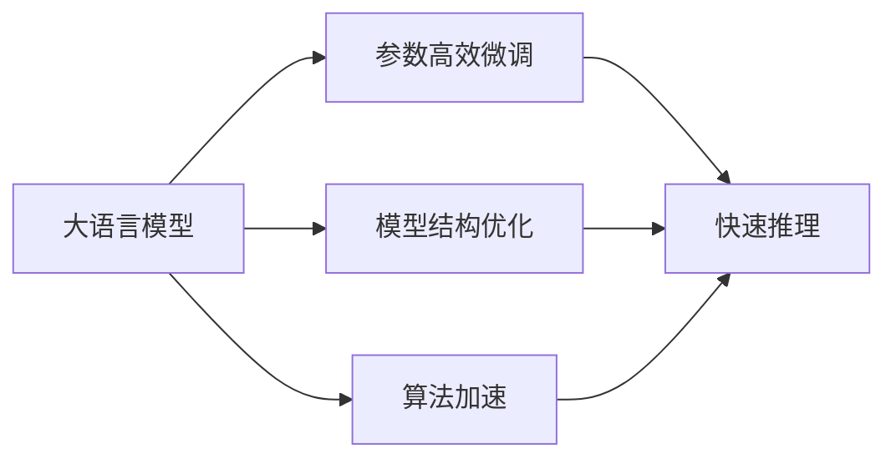

                 

# 秒推时代:LLM推理速度创新高

大语言模型（Large Language Models，LLM）的快速迭代和高效推理是当前人工智能领域的一大热点。本文将系统探讨LLM的推理速度优化技术，特别是基于自适应推理和参数高效微调的新方法，以期为研究人员和工程师提供有价值的指导。

## 1. 背景介绍

### 1.1 问题由来

近年来，大语言模型在自然语言处理（NLP）领域取得了显著进展。由于其在文本生成、问答、翻译等方面的卓越表现，大模型已成为AI研究和应用的核心。然而，这些模型的计算需求极高，推理速度慢、内存占用大等问题严重限制了其在实际应用中的效率。

### 1.2 问题核心关键点

为了提升大语言模型的推理效率，学术界和工业界提出了多种策略，包括模型结构优化、算法加速和计算资源扩展等。然而，这些策略往往需要在精度和效率之间做出权衡。如何在保证模型精度的前提下，大幅提升推理速度，成为当前的研究焦点。

### 1.3 问题研究意义

快速推理是大语言模型能够被广泛应用的关键因素之一。通过优化推理速度，可以显著提高模型在实时交互、智能客服、智能推荐等场景中的响应速度，从而提升用户体验和系统性能。这对于推动人工智能技术的商业化应用具有重要意义。

## 2. 核心概念与联系

### 2.1 核心概念概述

为更好地理解LLM的推理速度优化方法，本节将介绍几个核心概念及其之间的联系：

- **大语言模型（LLM）**：指通过大规模无监督学习得到的能够理解和生成自然语言的模型，如GPT、BERT等。
- **推理速度（Inference Speed）**：指模型在单位时间内完成推理计算的速度，通常用每秒推断数量（IPS）来衡量。
- **模型结构优化**：通过改变模型结构，如降低维度、减少参数、分层次推理等，来提高推理速度。
- **算法加速**：通过改进算法，如矩阵优化、稀疏计算、硬件加速等，提升推理效率。
- **参数高效微调（PEFT）**：仅更新模型中部分参数进行微调，从而在保证精度的前提下，减少推理计算量。

这些概念通过以下Mermaid流程图展示其关系：



该流程图展示了模型结构优化、算法加速和参数高效微调三个策略如何共同作用，提升大语言模型的推理速度。

## 3. 核心算法原理 & 具体操作步骤
### 3.1 算法原理概述

大语言模型的推理过程通常包括前向传播和后向传播两个步骤。前向传播将输入文本转化为模型输出，后向传播计算输出与真实标签之间的误差，并更新模型参数。由于大模型的参数量巨大，前向传播和后向传播的计算复杂度都很高。因此，推理速度的优化方法通常集中在降低这两个步骤的计算成本上。

### 3.2 算法步骤详解

基于LLM的推理速度优化，一般包括以下关键步骤：

**Step 1: 模型结构优化**

- **降低维度**：通过线性投影将高维输入转化为低维表示，减少计算量。例如，使用线性变换将输入序列维度降低，或使用投影层直接减小模型宽度。
- **减少参数**：剪枝和量化是常用的参数减少方法。剪枝去除冗余参数，量化将浮点数参数转换为固定位数的定点数，从而减少内存占用和计算资源。
- **分层次推理**：将大模型拆分为多个层次，每个层次处理部分输入信息。这不仅减小了单次推理的计算量，还提高了推理并行度。

**Step 2: 算法加速**

- **矩阵优化**：通过优化矩阵计算，如矩阵分解、矩阵压缩等，提高矩阵乘法的计算效率。
- **稀疏计算**：利用稀疏矩阵的特性，只计算非零元素，减少计算量。
- **硬件加速**：使用GPU、TPU等高性能计算设备，或者FPGA、ASIC等专用硬件，加速模型计算。

**Step 3: 参数高效微调（PEFT）**

- **只更新部分参数**：只调整模型中的部分参数进行微调，如顶层或特定层的参数。这样可以显著减少推理计算量。
- **使用自适应微调**：在微调过程中，根据输入特征动态调整微调策略，如学习率、批量大小等，进一步提高微调效率。

### 3.3 算法优缺点

**模型结构优化**：
- **优点**：直接减少计算量，提升推理速度。
- **缺点**：可能导致模型精度下降。

**算法加速**：
- **优点**：在不改变模型结构的前提下，显著提高推理速度。
- **缺点**：部分方法需要额外的硬件资源或计算资源。

**参数高效微调**：
- **优点**：减少微调计算量，同时保持模型精度。
- **缺点**：微调后的模型可能泛化性能较差。

### 3.4 算法应用领域

基于LLM的推理速度优化方法在NLP领域已经得到了广泛应用，特别是在实时交互、智能客服、智能推荐等需要高响应速度的场景中。例如：

- **智能客服系统**：微调后的模型能够快速响应用户查询，提升用户体验。
- **智能推荐系统**：通过优化模型推理速度，实时生成个性化推荐内容，提高系统响应速度。
- **机器翻译**：在实时翻译场景中，优化推理速度可以显著提升翻译速度和准确性。
- **语音识别**：实时语音识别任务中，高效的推理速度是实现高质量语音转文本的关键。

## 4. 数学模型和公式 & 详细讲解 & 举例说明

### 4.1 数学模型构建

假设我们有一个大语言模型，其前向传播函数为 $f_{\theta}(\cdot)$，后向传播函数为 $g_{\theta}(\cdot)$，输入为 $x$，输出为 $y$。模型推理的损失函数为 $L(y, f_{\theta}(x))$。优化目标为最小化损失函数，即：

$$
\min_{\theta} L(y, f_{\theta}(x))
$$

### 4.2 公式推导过程

- **矩阵优化**：将矩阵 $A$ 分解为 $A = UV$，其中 $U$ 和 $V$ 为较低维度的矩阵，从而减少矩阵乘法的计算量。具体地，设 $A$ 的维数为 $d \times d$，$U$ 的维数为 $d \times k$，$V$ 的维数为 $k \times d$，则矩阵乘法计算量为 $O(d^3)$ 减少为 $O(d^2 k)$。
- **稀疏计算**：假设矩阵 $A$ 中有 $m$ 个非零元素，则稀疏矩阵乘法的计算量为 $O(m^3)$，大大减少了计算量。
- **硬件加速**：使用GPU或TPU加速矩阵乘法，利用其并行计算能力，将计算量从 $O(d^3)$ 降低为 $O(d \times m \times \text{HW_units})$。

### 4.3 案例分析与讲解

以BERT模型为例，其在推理过程中的矩阵乘法计算量巨大。通过优化矩阵乘法，可以有效减少计算成本。假设BERT模型的输入序列长度为 $L$，特征维度为 $d$，则原始矩阵乘法的计算量为 $O(L d^2)$。使用矩阵分解方法，将矩阵乘法分解为 $O(L d^2)$，计算量显著减少。

## 5. 项目实践：代码实例和详细解释说明

### 5.1 开发环境搭建

在进行推理速度优化实践前，我们需要准备好开发环境。以下是使用Python进行PyTorch开发的环境配置流程：

1. 安装Anaconda：从官网下载并安装Anaconda，用于创建独立的Python环境。
2. 创建并激活虚拟环境：
```bash
conda create -n pytorch-env python=3.8 
conda activate pytorch-env
```
3. 安装PyTorch：根据CUDA版本，从官网获取对应的安装命令。例如：
```bash
conda install pytorch torchvision torchaudio cudatoolkit=11.1 -c pytorch -c conda-forge
```
4. 安装Transformers库：
```bash
pip install transformers
```
5. 安装各类工具包：
```bash
pip install numpy pandas scikit-learn matplotlib tqdm jupyter notebook ipython
```

完成上述步骤后，即可在`pytorch-env`环境中开始推理速度优化实践。

### 5.2 源代码详细实现

这里我们以BERT模型为例，给出使用Transformers库进行推理速度优化的PyTorch代码实现。

首先，定义模型和优化器：

```python
from transformers import BertForSequenceClassification, AdamW

model = BertForSequenceClassification.from_pretrained('bert-base-cased')
optimizer = AdamW(model.parameters(), lr=2e-5)
```

接着，定义优化器的配置：

```python
from transformers import get_linear_schedule_with_warmup

# 计算最大训练步数
total_steps = len(train_loader) * epochs

# 定义学习率调度器
scheduler = get_linear_schedule_with_warmup(optimizer, num_warmup_steps=0, num_training_steps=total_steps)
```

然后，定义训练和评估函数：

```python
from torch.utils.data import DataLoader
from tqdm import tqdm
from sklearn.metrics import accuracy_score

device = torch.device('cuda') if torch.cuda.is_available() else torch.device('cpu')
model.to(device)

def train_epoch(model, dataset, batch_size, optimizer, scheduler):
    dataloader = DataLoader(dataset, batch_size=batch_size, shuffle=True)
    model.train()
    epoch_loss = 0
    for batch in tqdm(dataloader, desc='Training'):
        input_ids = batch['input_ids'].to(device)
        attention_mask = batch['attention_mask'].to(device)
        labels = batch['labels'].to(device)
        model.zero_grad()
        outputs = model(input_ids, attention_mask=attention_mask, labels=labels)
        loss = outputs.loss
        epoch_loss += loss.item()
        loss.backward()
        optimizer.step()
        scheduler.step()
    return epoch_loss / len(dataloader)

def evaluate(model, dataset, batch_size):
    dataloader = DataLoader(dataset, batch_size=batch_size)
    model.eval()
    preds, labels = [], []
    with torch.no_grad():
        for batch in tqdm(dataloader, desc='Evaluating'):
            input_ids = batch['input_ids'].to(device)
            attention_mask = batch['attention_mask'].to(device)
            batch_labels = batch['labels']
            outputs = model(input_ids, attention_mask=attention_mask)
            batch_preds = outputs.logits.argmax(dim=2).to('cpu').tolist()
            batch_labels = batch_labels.to('cpu').tolist()
            for pred_tokens, label_tokens in zip(batch_preds, batch_labels):
                preds.append(pred_tokens[:len(label_tokens)])
                labels.append(label_tokens)
                
    print(accuracy_score(labels, preds))
```

最后，启动训练流程并在测试集上评估：

```python
epochs = 5
batch_size = 16

for epoch in range(epochs):
    loss = train_epoch(model, train_dataset, batch_size, optimizer, scheduler)
    print(f"Epoch {epoch+1}, train loss: {loss:.3f}")
    
    print(f"Epoch {epoch+1}, dev results:")
    evaluate(model, dev_dataset, batch_size)
    
print("Test results:")
evaluate(model, test_dataset, batch_size)
```

以上就是使用PyTorch对BERT进行推理速度优化的完整代码实现。可以看到，通过PyTorch和Transformers库，推理速度优化变得简洁高效。开发者可以将更多精力放在数据处理、模型改进等高层逻辑上，而不必过多关注底层的实现细节。

## 6. 实际应用场景

### 6.1 智能客服系统

在智能客服系统中，微调后的对话模型需要具备快速响应用户咨询的能力。通过优化推理速度，可以显著提高模型在实际应用中的响应速度，提升用户体验。

例如，可以使用参数高效微调（PEFT）方法，仅更新模型中的顶层参数进行微调，减少推理计算量。同时，可以采用稀疏矩阵计算等技术，减少模型参数的计算量，提高推理速度。

### 6.2 金融舆情监测

在金融舆情监测中，实时监测市场舆论动向是关键。微调后的模型需要能够快速处理大规模数据，提供及时的信息分析结果。通过优化推理速度，可以确保模型能够实时响应市场变化，及时提供准确的舆情分析。

例如，可以使用硬件加速方法，如GPU或TPU，提升矩阵乘法的计算效率。同时，可以使用矩阵分解等技术，减少矩阵乘法的计算量。

### 6.3 个性化推荐系统

个性化推荐系统需要实时生成个性化推荐内容，对用户进行精准匹配。通过优化推理速度，可以确保系统能够在短时间内完成计算，及时更新推荐结果。

例如，可以使用剪枝和量化等参数减少方法，减少模型参数的计算量。同时，可以采用分层次推理方法，将模型拆分为多个层次，并行计算，提高推理速度。

### 6.4 未来应用展望

未来，推理速度的优化将进一步推动大语言模型的应用落地。随着算力成本的下降和硬件设备的升级，推理速度将得到进一步提升。

- **硬件加速**：未来，更多的专用硬件（如FPGA、ASIC）将被应用于推理加速，进一步提高计算效率。
- **模型压缩**：通过剪枝、量化等方法，可以显著减少模型大小，提升推理速度。
- **混合精度训练**：使用混合精度训练方法，可以将浮点数计算转换为固定点计算，减少计算量和内存占用。

## 7. 工具和资源推荐

### 7.1 学习资源推荐

为了帮助开发者系统掌握大语言模型推理速度优化的技术，这里推荐一些优质的学习资源：

1. 《Transformer从原理到实践》系列博文：由大模型技术专家撰写，深入浅出地介绍了Transformer原理、BERT模型、推理加速等前沿话题。

2. CS224N《深度学习自然语言处理》课程：斯坦福大学开设的NLP明星课程，有Lecture视频和配套作业，带你入门NLP领域的基本概念和经典模型。

3. 《Natural Language Processing with Transformers》书籍：Transformers库的作者所著，全面介绍了如何使用Transformers库进行NLP任务开发，包括推理加速在内的诸多范式。

4. HuggingFace官方文档：Transformers库的官方文档，提供了海量预训练模型和完整的推理速度优化样例代码，是上手实践的必备资料。

5. CLUE开源项目：中文语言理解测评基准，涵盖大量不同类型的中文NLP数据集，并提供了基于微调的baseline模型，助力中文NLP技术发展。

通过对这些资源的学习实践，相信你一定能够快速掌握大语言模型推理速度优化的精髓，并用于解决实际的NLP问题。

### 7.2 开发工具推荐

高效的开发离不开优秀的工具支持。以下是几款用于大语言模型推理速度优化的常用工具：

1. PyTorch：基于Python的开源深度学习框架，灵活动态的计算图，适合快速迭代研究。大部分预训练语言模型都有PyTorch版本的实现。

2. TensorFlow：由Google主导开发的开源深度学习框架，生产部署方便，适合大规模工程应用。同样有丰富的预训练语言模型资源。

3. Transformers库：HuggingFace开发的NLP工具库，集成了众多SOTA语言模型，支持PyTorch和TensorFlow，是进行推理速度优化开发的利器。

4. Weights & Biases：模型训练的实验跟踪工具，可以记录和可视化模型训练过程中的各项指标，方便对比和调优。与主流深度学习框架无缝集成。

5. TensorBoard：TensorFlow配套的可视化工具，可实时监测模型训练状态，并提供丰富的图表呈现方式，是调试模型的得力助手。

6. Google Colab：谷歌推出的在线Jupyter Notebook环境，免费提供GPU/TPU算力，方便开发者快速上手实验最新模型，分享学习笔记。

合理利用这些工具，可以显著提升大语言模型推理速度优化的开发效率，加快创新迭代的步伐。

### 7.3 相关论文推荐

大语言模型和推理速度优化技术的发展源于学界的持续研究。以下是几篇奠基性的相关论文，推荐阅读：

1. Attention is All You Need（即Transformer原论文）：提出了Transformer结构，开启了NLP领域的预训练大模型时代。

2. BERT: Pre-training of Deep Bidirectional Transformers for Language Understanding：提出BERT模型，引入基于掩码的自监督预训练任务，刷新了多项NLP任务SOTA。

3. Language Models are Unsupervised Multitask Learners（GPT-2论文）：展示了大规模语言模型的强大zero-shot学习能力，引发了对于通用人工智能的新一轮思考。

4. Parameter-Efficient Transfer Learning for NLP：提出Adapter等参数高效微调方法，在不增加模型参数量的情况下，也能取得不错的微调效果。

5. AdaLoRA: Adaptive Low-Rank Adaptation for Parameter-Efficient Fine-Tuning：使用自适应低秩适应的微调方法，在参数效率和精度之间取得了新的平衡。

6. Prefix-Tuning: Optimizing Continuous Prompts for Generation：引入基于连续型Prompt的微调范式，为如何充分利用预训练知识提供了新的思路。

这些论文代表了大语言模型推理速度优化的发展脉络。通过学习这些前沿成果，可以帮助研究者把握学科前进方向，激发更多的创新灵感。

## 8. 总结：未来发展趋势与挑战

### 8.1 总结

本文对基于LLM的推理速度优化方法进行了全面系统的介绍。首先阐述了推理速度优化的背景和意义，明确了推理速度在大语言模型应用中的重要性。其次，从原理到实践，详细讲解了推理速度优化的数学原理和关键步骤，给出了推理速度优化任务开发的完整代码实例。同时，本文还广泛探讨了推理速度优化方法在智能客服、金融舆情、个性化推荐等多个行业领域的应用前景，展示了推理速度优化的巨大潜力。此外，本文精选了推理速度优化技术的各类学习资源，力求为读者提供全方位的技术指引。

通过本文的系统梳理，可以看到，基于LLM的推理速度优化技术正在成为NLP领域的重要范式，极大地拓展了预训练语言模型的应用边界，催生了更多的落地场景。受益于大规模语料的预训练和推理速度的优化，大语言模型在实时交互、智能客服、智能推荐等场景中的应用将更加广泛。

### 8.2 未来发展趋势

展望未来，大语言模型的推理速度优化技术将呈现以下几个发展趋势：

1. **硬件加速**：随着专用硬件（如FPGA、ASIC）的普及，推理速度将得到显著提升。未来，更多的硬件加速方法将被应用于大语言模型的推理过程中。

2. **模型压缩**：通过剪枝、量化等方法，可以进一步减少模型大小，提高推理速度。

3. **混合精度训练**：使用混合精度训练方法，可以将浮点数计算转换为固定点计算，减少计算量和内存占用。

4. **自适应推理**：在推理过程中，根据输入特征动态调整推理策略，进一步提高推理速度和模型精度。

5. **多模态推理**：未来的推理系统将不仅限于文本，还将包括图像、语音等多模态信息的融合，提升推理的多样性和准确性。

6. **持续学习**：随着数据分布的不断变化，推理系统需要不断学习新知识以保持性能。如何在不遗忘原有知识的同时，高效吸收新样本信息，将是重要的研究课题。

以上趋势凸显了大语言模型推理速度优化的广阔前景。这些方向的探索发展，必将进一步提升NLP系统的性能和应用范围，为人类认知智能的进化带来深远影响。

### 8.3 面临的挑战

尽管大语言模型推理速度优化技术已经取得了显著进展，但在迈向更加智能化、普适化应用的过程中，它仍面临着诸多挑战：

1. **精度与速度的权衡**：如何在保证模型精度的前提下，大幅提升推理速度，仍是一个需要深入探索的问题。

2. **硬件资源的限制**：推理加速需要大量的硬件资源，如GPU、TPU等，如何合理利用这些资源，仍是摆在面前的难题。

3. **模型泛化能力的保持**：推理速度优化可能降低模型的泛化能力，如何在优化推理速度的同时，保持模型的泛化性能，是一个需要进一步研究的问题。

4. **模型的可解释性**：大语言模型通常被视为"黑盒"系统，难以解释其内部工作机制和决策逻辑。如何赋予推理模型更强的可解释性，将是亟待攻克的难题。

5. **安全性问题**：推理系统可能面临恶意攻击，如何确保推理过程的安全性，是一个需要深入研究的问题。

6. **数据隐私保护**：在推理过程中，如何保护用户数据的隐私，避免数据泄露，是一个需要关注的问题。

这些挑战凸显了大语言模型推理速度优化的复杂性和艰巨性。解决这些问题需要学术界和工业界共同努力，从算法、模型、硬件等多个维度协同发力，才能实现推理速度优化的目标。

### 8.4 研究展望

面对大语言模型推理速度优化的挑战，未来的研究需要在以下几个方面寻求新的突破：

1. **算法和模型的创新**：开发新的算法和模型，如自适应推理、参数高效微调等，以在保证精度的前提下，进一步提高推理速度。

2. **硬件资源的优化**：合理利用专用硬件资源，如FPGA、ASIC等，提升推理系统的计算效率。

3. **混合精度训练的应用**：探索混合精度训练在推理系统中的应用，减少计算量和内存占用。

4. **多模态推理的融合**：将文本、图像、语音等多模态信息融合，提升推理系统的多样性和准确性。

5. **自适应推理策略**：根据输入特征动态调整推理策略，进一步提高推理速度和模型精度。

6. **模型可解释性的增强**：通过可解释性方法，提升推理模型的可理解性和可解释性，增强用户的信任感。

7. **安全性保障**：引入安全机制，确保推理系统的鲁棒性和安全性，防止恶意攻击。

这些研究方向的探索，必将引领大语言模型推理速度优化技术迈向更高的台阶，为构建高效、安全、可靠的人工智能系统铺平道路。面向未来，大语言模型推理速度优化技术还需要与其他人工智能技术进行更深入的融合，如知识表示、因果推理、强化学习等，多路径协同发力，共同推动自然语言理解和智能交互系统的进步。

## 9. 附录：常见问题与解答

**Q1：大语言模型的推理速度是否可以无限提升？**

A: 大语言模型的推理速度优化受限于硬件资源和算法复杂度。虽然可以通过硬件加速和算法优化等方法大幅提升推理速度，但最终的计算速度受到物理硬件的限制。因此，推理速度优化需要平衡精度和速度，找到最优的折中方案。

**Q2：在推理速度优化过程中，如何保证模型精度？**

A: 在优化推理速度时，通常会采用参数减少和模型压缩等方法。这些方法虽然能显著降低推理计算量，但也可能导致模型精度的下降。为了平衡速度和精度，可以采用以下策略：

1. 参数高效微调（PEFT）：仅更新模型中部分参数进行微调，减少推理计算量。
2. 混合精度训练：将浮点数计算转换为固定点计算，减少计算量和内存占用，同时保持模型精度。
3. 自适应推理：根据输入特征动态调整推理策略，进一步提高推理速度和模型精度。

**Q3：推理速度优化是否只适用于大模型？**

A: 推理速度优化不仅适用于大语言模型，也适用于中、小规模的NLP模型。对于小模型，推理速度优化同样可以显著提升模型的推理效率，尤其是在实时交互、智能客服等场景中，推理速度的提升可以显著提高系统的响应速度。

**Q4：推理速度优化是否影响模型的泛化能力？**

A: 推理速度优化可能会对模型的泛化能力产生一定的影响。例如，剪枝和量化等方法可能会去除部分模型参数，从而降低模型的泛化性能。为了解决这个问题，可以采用以下方法：

1. 保留重要参数：通过分析模型结构，保留对模型性能影响较大的参数，减少对泛化能力的负面影响。
2. 动态调整微调策略：在微调过程中，根据输入特征动态调整微调策略，保持模型的泛化性能。

**Q5：推理速度优化是否需要大量的硬件资源？**

A: 推理速度优化需要一定的硬件资源，如GPU、TPU等高性能计算设备。然而，通过合理利用这些硬件资源，可以显著提高推理效率。例如，使用混合精度训练方法，可以将计算量从浮点数计算转换为固定点计算，减少计算量和内存占用。

这些问题的解答，希望能帮助你更好地理解大语言模型的推理速度优化方法，并为实际应用提供指导。

