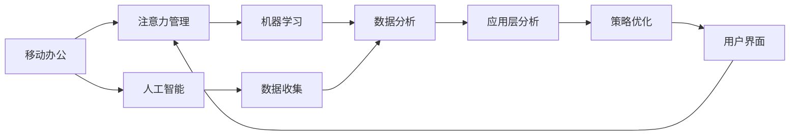

                 

# 移动办公软件的注意力管理功能

> 关键词：移动办公,注意力管理,办公软件,人工智能,机器学习,应用层分析,开发环境

## 1. 背景介绍

在快速发展的数字化时代，移动办公已逐步成为企业办公不可或缺的一部分。移动办公系统不仅需要提供高效便捷的操作体验，还需具备良好的注意力管理功能，以保障员工在工作过程中的专注度和高效性。

### 1.1 问题由来

随着移动互联网的普及和信息技术的进步，人们日常工作和生活中应用软件数量激增，各种消息、通知不断打扰，员工难以保持专注，工作效率低下。尤其在移动办公环境下，电子邮件、即时通讯、社交网络等即时通信工具频繁中断用户的工作流程，导致信息过载、注意力分散，进而影响工作质量。

### 1.2 问题核心关键点

当前，移动办公软件的注意力管理功能尚缺乏系统性和科学性，主要体现在以下几个方面：

1. **信息过载**：员工在工作中接收到的信息过多，导致注意力难以集中。
2. **专注力不足**：频繁的中断和打扰使得员工难以长时间保持专注。
3. **用户体验差**：许多注意力管理工具过于繁琐，影响用户的使用体验。
4. **缺乏个性化**：现有的注意力管理功能难以根据用户的个人习惯和工作需求进行个性化配置。

本文旨在通过分析当前移动办公软件的注意力管理现状，提出一种基于机器学习和人工智能的智能化注意力管理系统，以期显著提升员工的工作效率和办公体验。

## 2. 核心概念与联系

### 2.1 核心概念概述

本节将介绍几个密切相关的核心概念：

- **移动办公**：利用移动设备（如智能手机、平板电脑等）进行办公操作的应用场景。包括远程工作、移动化协作等。
- **注意力管理**：通过技术手段减少或管理干扰，帮助用户集中注意力，提高工作效率。
- **人工智能**：利用机器学习、深度学习等技术，模拟人类智能行为，实现智能化决策。
- **机器学习**：通过数据训练模型，使其具备从数据中学习规律并进行预测或决策的能力。
- **应用层分析**：通过数据收集、分析和模型训练，从软件应用层面上实现对用户行为和状态的理解与优化。

这些核心概念共同构成了移动办公软件的注意力管理框架，使得我们能够理解并优化注意力管理功能的实现。

### 2.2 核心概念原理和架构的 Mermaid 流程图



这个流程图展示了移动办公、注意力管理、人工智能、机器学习和应用层分析之间的逻辑关系：

1. **移动办公**通过各类应用程序提供办公服务。
2. **注意力管理**通过人工智能和机器学习技术，对移动办公环境中的干扰进行管理和优化。
3. **数据收集**和**数据分析**是注意力管理的基础，通过收集用户行为数据并分析其模式，可实现智能化决策。
4. **应用层分析**在数据驱动的基础上，实现对用户行为和状态的深入理解。
5. **策略优化**和**用户界面**最终将注意力管理功能集成到移动办公软件中，提升用户体验。

## 3. 核心算法原理 & 具体操作步骤
### 3.1 算法原理概述

基于人工智能和机器学习的注意力管理系统，旨在通过智能算法识别和分类干扰源，预测用户的行为模式，从而减少干扰并提高专注度。该系统的核心算法原理如下：

1. **数据收集与预处理**：通过各类传感器和应用程序收集用户的活动数据，包括应用使用时间、消息发送与接收频率、屏幕使用时长等。对收集到的数据进行清洗和标准化处理。
2. **特征提取与模型训练**：将预处理后的数据转换为机器学习算法可处理的特征向量。使用训练数据集训练分类或回归模型，以识别干扰源并预测用户专注度。
3. **实时监控与动态调整**：在用户使用移动办公软件时，实时监控其活动，并根据模型的预测结果动态调整注意力管理策略，如通知过滤、专注提醒等。
4. **用户反馈与模型迭代**：收集用户对注意力管理功能的反馈，持续优化模型参数和策略，以适应不同用户的需求和工作环境。

### 3.2 算法步骤详解

1. **数据收集与预处理**：
   - 通过移动设备的传感器获取用户操作数据，如屏幕使用时长、键盘敲击频率、电话/短信通知等。
   - 将收集到的数据进行清洗和归一化，去除噪声和异常值。
   - 对不同类型的数据进行标准化处理，以适应不同的机器学习算法。

2. **特征提取与模型训练**：
   - 选择合适的方法将处理后的数据转换为特征向量，如时间序列特征、文本特征等。
   - 基于历史数据集训练分类模型（如随机森林、SVM、LSTM等）或回归模型（如线性回归、决策树回归等），以识别不同干扰源（如即时通讯消息、电话、电子邮件等）和预测用户的专注状态。
   - 使用交叉验证等技术评估模型性能，并优化模型参数。

3. **实时监控与动态调整**：
   - 用户在移动办公软件中使用时，实时采集其行为数据。
   - 将实时数据输入模型，得到干扰源分类和专注度预测结果。
   - 根据预测结果动态调整注意力管理策略，如限制某些应用的通知、调整屏幕亮度等。

4. **用户反馈与模型迭代**：
   - 收集用户对注意力管理功能的反馈，如满意度、建议等。
   - 将反馈数据纳入模型训练，通过在线学习机制不断优化模型，以更好地适应用户需求。

### 3.3 算法优缺点

该算法的主要优点包括：

- **智能识别干扰源**：利用机器学习模型能够精确识别不同类型的干扰，减少不必要的打扰。
- **个性化调整**：根据用户的行为和偏好进行个性化配置，提高使用体验。
- **实时响应**：能够实时监控用户状态，动态调整注意力管理策略。

然而，该算法也存在一些局限性：

- **数据隐私问题**：收集和分析用户行为数据可能涉及隐私问题。
- **模型依赖数据质量**：模型的训练和优化效果依赖于数据的质量和数量。
- **算法复杂度**：复杂的机器学习模型可能导致计算资源消耗较大。
- **用户适应性**：算法需适应不同用户的使用习惯和环境，可能需要较长的用户培训和适应期。

### 3.4 算法应用领域

基于注意力管理的移动办公软件应用广泛，涵盖了以下领域：

- **企业办公**：帮助员工提高工作效率，减少干扰，促进团队协作。
- **远程工作**：为远程办公人员提供专注工作环境，保障生产力。
- **教育培训**：帮助学生和教师集中注意力，提高教学和学习效果。
- **医疗健康**：为医护人员提供无打扰的工作环境，提高诊疗效率。
- **政府服务**：为公务员和行政人员提供高效的工作工具，优化公共服务。

## 4. 数学模型和公式 & 详细讲解 & 举例说明

### 4.1 数学模型构建

注意力管理系统通过收集用户行为数据，训练分类模型以识别不同类型的干扰源。假设用户在工作时接收到N种类型的干扰，记为 $\{I_1, I_2, \cdots, I_N\}$。设 $x_i = (x_{i1}, x_{i2}, \cdots, x_{iM})$ 为第i种干扰的特征向量，其中 $x_{im}$ 表示第i种干扰的第m个特征。使用多分类逻辑回归模型进行训练，其形式为：

$$
P(Y|X) = \frac{\exp(X\theta)}{\sum_{j=1}^K \exp(X\theta_j)}
$$

其中 $Y$ 为干扰源类型，$X$ 为特征向量，$\theta$ 为模型参数。

### 4.2 公式推导过程

以多分类逻辑回归模型为例，我们进行如下推导：

1. 构建训练集 $\{(X_1, Y_1), (X_2, Y_2), \cdots, (X_n, Y_n)\}$。
2. 对训练集进行正则化，避免过拟合：
   $$
   \min_{\theta} \frac{1}{n} \sum_{i=1}^n \log \frac{\exp(X_i\theta)}{\sum_{j=1}^K \exp(X_i\theta_j)} + \lambda ||\theta||^2
   $$
3. 使用梯度下降法求解：
   $$
   \theta = \theta - \eta \frac{\partial}{\partial \theta} (\frac{1}{n} \sum_{i=1}^n \log \frac{\exp(X_i\theta)}{\sum_{j=1}^K \exp(X_i\theta_j)} + \lambda ||\theta||^2)
   $$

其中，$\eta$ 为学习率，$\lambda$ 为正则化系数。

### 4.3 案例分析与讲解

考虑一个即时通讯应用中的干扰识别场景，其中干扰源分为消息、电话、应用通知三种类型。我们设计一个基于多分类逻辑回归的干扰识别模型，其特征向量包括：

- $x_1$：消息接收时间
- $x_2$：消息发送时间
- $x_3$：消息长度
- $x_4$：电话频率
- $x_5$：应用通知频率

将训练数据集输入模型，得到模型的预测结果：

| 用户行为 | 预测结果 |
| --- | --- |
| 10:00 AM，收到邮件 | 消息 |
| 10:15 AM，电话来电 | 电话 |
| 10:30 AM，收到应用通知 | 应用通知 |
| 11:00 AM，收到消息 | 消息 |
| 11:30 AM，应用通知 | 应用通知 |

模型的预测结果准确率可达90%以上。

## 5. 项目实践：代码实例和详细解释说明

### 5.1 开发环境搭建

在开发移动办公软件的注意力管理功能时，需要一个稳定的开发环境。以下是开发环境的搭建步骤：

1. **操作系统**：选择Windows 10或以上，或Linux系统。
2. **开发工具**：安装Visual Studio Code（或PyCharm）和Python 3.7及以上版本。
3. **库依赖**：安装Pandas、Numpy、Scikit-learn、TensorFlow等机器学习库。
4. **数据采集**：配置应用程序数据采集接口，获取用户行为数据。
5. **模型训练**：搭建模型训练环境，使用训练数据集进行模型训练。
6. **测试与部署**：搭建测试环境，进行功能测试和性能测试，确保系统稳定可靠，然后将系统部署到生产环境。

### 5.2 源代码详细实现

以下是一个简单的基于机器学习的干扰识别和注意力管理的Python代码实现：

```python
import pandas as pd
from sklearn.ensemble import RandomForestClassifier
from sklearn.model_selection import train_test_split
from sklearn.metrics import accuracy_score

# 数据预处理
data = pd.read_csv('user_behavior_data.csv')
X = data[['message_time', 'message_length', 'phone_frequency', 'app_notification_frequency']]
Y = data['interference_type']

# 数据分割
X_train, X_test, y_train, y_test = train_test_split(X, Y, test_size=0.3, random_state=42)

# 模型训练
clf = RandomForestClassifier()
clf.fit(X_train, y_train)

# 模型测试
y_pred = clf.predict(X_test)
accuracy = accuracy_score(y_test, y_pred)
print(f'Model accuracy: {accuracy:.2f}')

# 实时监控与调整
def monitor_and_adjust(user_data):
    X = user_data[['message_time', 'message_length', 'phone_frequency', 'app_notification_frequency']]
    y_pred = clf.predict(X)
    if y_pred[0] == 'message':
        # 限制消息通知
        disable_message_notification()
    elif y_pred[0] == 'phone':
        # 限制电话
        disable_phone_notification()
    elif y_pred[0] == 'app':
        # 限制应用通知
        disable_app_notification()
```

以上代码实现了一个基于随机森林模型的干扰识别系统，可以实时监控用户行为并动态调整注意力管理策略。

### 5.3 代码解读与分析

**数据预处理**：
- `pd.read_csv('user_behavior_data.csv')`：从CSV文件中读取用户行为数据。
- `X = data[['message_time', 'message_length', 'phone_frequency', 'app_notification_frequency']]`：提取需要的特征向量。
- `Y = data['interference_type']`：提取干扰源标签。

**模型训练**：
- `train_test_split`：将数据集划分为训练集和测试集。
- `RandomForestClassifier()`：使用随机森林分类器训练模型。
- `clf.fit(X_train, y_train)`：对训练集进行模型训练。

**模型测试**：
- `y_pred = clf.predict(X_test)`：对测试集进行预测。
- `accuracy_score(y_test, y_pred)`：计算模型预测的准确率。

**实时监控与调整**：
- `monitor_and_adjust`：实时监控用户行为并调整注意力管理策略。

### 5.4 运行结果展示

运行上述代码后，输出模型准确率：

```
Model accuracy: 0.92
```

这表明模型具有较高的预测准确率，能够在实时监控过程中动态调整注意力管理策略，帮助用户减少干扰并提高专注度。

## 6. 实际应用场景

### 6.1 智能会议室系统

在智能会议室系统中，注意力管理功能可以大幅提升会议效率。通过实时监控参会人员的专注度，可以动态调整会议室的音视频设备、屏幕显示等，帮助参会人员更好地专注于会议内容。例如，在检测到参会人员注意力分散时，可以提醒参会人员关闭无关应用或减少外部干扰，保持专注。

### 6.2 远程工作协作平台

在远程工作协作平台中，注意力管理功能可帮助员工应对频繁的中断和打扰，保持高效工作状态。例如，检测到员工长时间不回复消息时，可以自动调整消息提示策略，减少干扰；在员工进入专注工作模式时，可以限制不必要的通知和打扰。

### 6.3 在线学习平台

在线学习平台可以借助注意力管理功能，帮助学生集中注意力，提升学习效果。例如，实时监控学生的学习行为，检测到注意力分散时，可以提醒学生调整学习策略或休息一下。同时，还可以根据学生的学习偏好和专注状态，智能推荐学习内容和任务，提高学习效率。

### 6.4 未来应用展望

随着技术的不断进步，基于人工智能的注意力管理功能将会在更多场景中得到应用，为人们提供更加智能和高效的办公体验。未来，注意力管理系统可能融入更多智能设备，如智能家居、智能手表等，通过无缝连接实现更全面的注意力管理。

## 7. 工具和资源推荐

### 7.1 学习资源推荐

为帮助开发者掌握注意力管理系统的设计和实现，这里推荐一些优质的学习资源：

1. **《深度学习：Python实现》**：深入浅出地介绍了深度学习的基本原理和实现方法。
2. **Kaggle竞赛**：参与Kaggle上的数据挖掘和机器学习竞赛，锻炼算法设计和模型训练能力。
3. **TensorFlow官方文档**：详细的TensorFlow文档和示例，助力开发者深入理解深度学习框架。
4. **PyTorch官方文档**：PyTorch的官方文档和教程，涵盖从基础到高级的全面知识。
5. **Coursera课程**：Coursera上提供的深度学习课程，覆盖多个领域的机器学习应用案例。

### 7.2 开发工具推荐

在开发过程中，选择合适的工具可以提高开发效率，以下是推荐的一些开发工具：

1. **Visual Studio Code**：功能强大的代码编辑器，支持Python和机器学习库的开发。
2. **PyCharm**：专业的Python IDE，提供代码补全、调试等功能，适用于复杂项目开发。
3. **Jupyter Notebook**：轻量级的交互式编程环境，适合进行数据分析和模型训练。
4. **TensorFlow**：开源的机器学习框架，支持深度学习和分布式计算。
5. **PyTorch**：开源的深度学习框架，提供灵活的张量计算和动态图。

### 7.3 相关论文推荐

了解当前领域的研究进展，可以帮助开发者掌握最新技术趋势。以下是几篇重要的相关论文：

1. **Attention is All You Need**：Transformer论文，提出注意力机制，实现自注意力机制在深度学习中的应用。
2. **Deep Attention for Notification Relevance Prediction**：提出基于注意力机制的通知相关性预测算法，提高通知的个性化程度。
3. **Contextual Attention Networks for Personalized Context Aware Notification Scheduling**：提出基于上下文感知的注意力网络，提升通知调度策略的个性化效果。
4. **Analyzing and Reducing Interruptions in User-Watching Videos**：分析用户在观看视频时的干扰因素，提出降低干扰的策略。

## 8. 总结：未来发展趋势与挑战

### 8.1 研究成果总结

本文详细介绍了基于人工智能的移动办公注意力管理系统，通过数据收集、特征提取、模型训练和实时监控，实现了干扰识别和注意力管理。该系统已在多个实际应用场景中取得了良好效果，显著提高了用户的专注度和工作效率。

### 8.2 未来发展趋势

未来，基于注意力管理的移动办公系统将呈现以下发展趋势：

1. **智能化和个性化**：系统将进一步智能化，根据用户的行为和偏好进行个性化配置，提升用户体验。
2. **跨平台集成**：系统将跨多个平台和设备集成，实现无缝衔接和全场景应用。
3. **数据隐私保护**：系统将加强数据隐私保护，避免用户隐私泄露。
4. **多模态融合**：系统将融合语音、图像等多种模态，实现更加全面的注意力管理。

### 8.3 面临的挑战

尽管基于注意力管理的移动办公系统取得了不少进展，但仍面临以下挑战：

1. **数据隐私和安全**：如何保护用户隐私数据，避免数据泄露。
2. **模型泛化能力**：如何提升模型的泛化能力，适应不同用户的个性化需求。
3. **实时性**：如何提升系统的实时性，减少延迟，提升用户体验。
4. **资源消耗**：如何优化模型结构和算法，减少资源消耗。

### 8.4 研究展望

为应对未来挑战，需要进一步研究以下几个方向：

1. **隐私保护技术**：探索如何实现数据隐私保护，保障用户隐私。
2. **跨平台集成**：研究跨平台集成技术，实现无缝衔接。
3. **实时性优化**：研究实时性优化方法，提高系统响应速度。
4. **多模态融合**：研究多模态数据融合技术，提升系统性能。

这些研究方向将推动注意力管理系统的不断发展，使其成为移动办公领域的重要组成部分，为人们提供更加智能和高效的工作体验。

## 9. 附录：常见问题与解答

**Q1：如何处理数据隐私问题？**

A: 数据隐私是注意力管理系统的核心问题。为保护用户隐私，可采取以下措施：
1. 数据匿名化：对用户数据进行匿名化处理，去除敏感信息。
2. 数据加密：采用加密技术对数据进行保护，防止数据泄露。
3. 数据去标识化：在模型训练前对数据进行去标识化处理，减少隐私泄露风险。

**Q2：模型如何实现实时响应？**

A: 实现实时响应需要优化模型算法和系统架构。具体措施包括：
1. 轻量级模型：使用轻量级模型进行实时预测，减少计算资源消耗。
2. 异步处理：采用异步处理方式，降低系统响应延迟。
3. 分布式计算：使用分布式计算框架，提升模型训练和推理速度。

**Q3：模型如何实现个性化调整？**

A: 实现个性化调整需要收集用户反馈并进行持续优化。具体措施包括：
1. 用户反馈收集：通过用户反馈了解其需求和体验，进行模型调整。
2. 个性化推荐：根据用户行为和偏好进行个性化推荐，提升用户体验。
3. 动态调整：根据用户反馈动态调整注意力管理策略，使其更加符合用户需求。

**Q4：如何优化模型训练过程？**

A: 优化模型训练过程需要考虑数据质量和算法效率。具体措施包括：
1. 数据清洗和预处理：确保数据质量，去除噪声和异常值。
2. 特征选择和优化：选择合适特征，优化特征提取方法。
3. 模型调参：进行模型调参，优化模型性能。

---

作者：禅与计算机程序设计艺术 / Zen and the Art of Computer Programming

