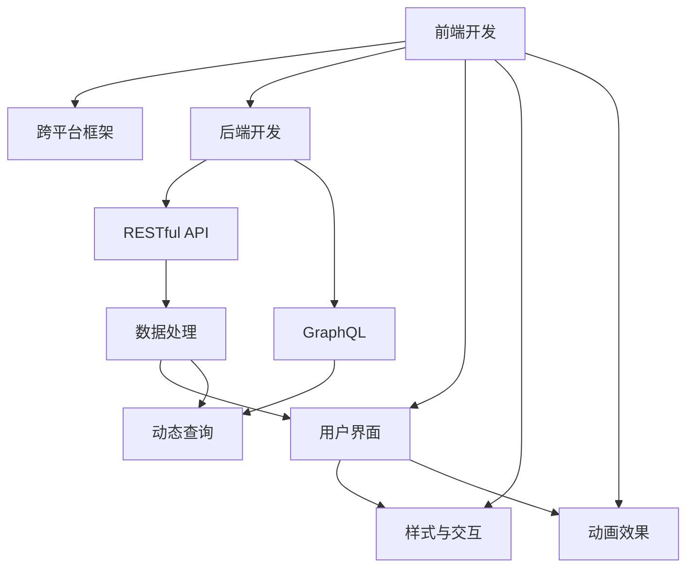

                 

# 移动端全栈开发：为智能手机创建应用程序

在当今的数字化时代，智能手机应用程序（APP）已经成为了连接人们与数字世界的桥梁。无论是社交、娱乐、教育还是商务，几乎所有领域都离不开应用程序的支撑。全栈开发成为创建高性能、稳定且用户体验良好的APP的核心技能。本文将系统性地介绍移动端全栈开发的概念、原理、操作步骤，以及具体实现。通过深入剖析核心算法和应用场景，帮助读者全面掌握移动端全栈开发的精髓。

## 1. 背景介绍

### 1.1 问题由来
移动端全栈开发技术的兴起，源于互联网和移动设备的普及。随着移动互联网的快速发展，跨平台、跨设备的应用需求急剧增加。传统的前端、后端分离开发模式，在功能复杂、数据交互频繁的现代APP中难以满足需求。而全栈开发技术，能够涵盖前端、后端、数据库等所有技术栈，实现无缝对接和协同开发，显著提升开发效率和应用性能。

### 1.2 问题核心关键点
移动端全栈开发的核心在于将传统的Web前端和后端开发融合在一起，同时引入跨平台框架和数据库技术，实现跨平台、高性能的APP开发。这包括：
- 前端开发：使用React Native、Flutter等跨平台技术，开发兼容iOS和Android的应用。
- 后端开发：设计并实现基于RESTful API或GraphQL API的后端服务，负责数据处理和业务逻辑。
- 数据库开发：选择适合的应用数据库，如MySQL、MongoDB、Firebase等，存储和管理数据。

### 1.3 问题研究意义
掌握移动端全栈开发技术，不仅能够提升开发效率和应用性能，还能使开发者在面临跨平台、跨设备需求时，更加从容应对。此外，全栈开发还能够提高开发者的综合技能水平，拓展其职业发展路径。更重要的是，全栈开发能够减少不同技术栈之间的协作成本，提升团队整体开发效率和项目成功率。

## 2. 核心概念与联系

### 2.1 核心概念概述

为了更好地理解移动端全栈开发，我们首先介绍几个核心概念：

- 前端开发：指开发移动APP的用户界面（UI）部分，包括样式、交互、动画等。常用的前端技术栈有React Native、Flutter、Xamarin等。
- 后端开发：指开发移动APP的数据处理和业务逻辑部分，通常包括API设计、数据存储、安全管理等。常用的后端技术栈有Node.js、Ruby on Rails、Django等。
- 跨平台开发：指使用单一代码库实现多平台兼容的技术，常见的框架有React Native、Flutter、Ionic等。
- RESTful API：一种基于HTTP协议，通过标准化的API接口进行数据交换的方式，广泛应用于后端服务开发。
- GraphQL：一种灵活的API查询语言，支持动态查询和返回，提升数据处理效率和响应速度。

这些核心概念之间的逻辑关系可以通过以下Mermaid流程图来展示：



这个流程图展示了大前端全栈开发的核心概念及其之间的关系：

1. 前端开发通过跨平台框架和后端API，实现与后端数据的交互。
2. 后端开发设计RESTful API和GraphQL API，支持前端数据请求。
3. 前端开发的用户界面、样式、交互、动画等功能，通过后端API进行渲染。
4. 后端服务对数据进行处理，返回前端请求的数据。
5. GraphQL支持动态查询，提升数据处理效率。

这些概念共同构成了移动端全栈开发的基础框架，使其能够在多种平台和设备上实现高性能、稳定的应用开发。

## 3. 核心算法原理 & 具体操作步骤
### 3.1 算法原理概述

移动端全栈开发的核心算法原理，主要集中在前后端协同工作、跨平台技术实现和数据管理三个方面。

1. 前后端协同工作：通过RESTful API或GraphQL API，前后端实现数据的无缝交换。前端通过API请求获取数据，后端根据请求生成数据并返回。
2. 跨平台技术实现：使用跨平台框架，将前端代码编写为单一代码库，通过框架自身的功能实现多平台兼容。
3. 数据管理：选择适合的数据库，设计并实现数据模型，存储和管理应用数据。

### 3.2 算法步骤详解

移动端全栈开发的算法步骤，可以概括为以下五个步骤：

**Step 1: 需求分析与设计**
- 明确应用的功能需求和用户体验目标，进行功能模块的划分。
- 设计应用架构和数据模型，确定前端和后端的交互方式。

**Step 2: 前端开发**
- 选择合适的跨平台框架，如React Native、Flutter等。
- 使用框架提供的组件库和开发工具，构建应用的用户界面（UI）部分。
- 实现前端逻辑和业务逻辑，包括数据请求、响应处理、动画效果等。

**Step 3: 后端开发**
- 选择合适的后端技术栈，如Node.js、Ruby on Rails、Django等。
- 设计并实现RESTful API或GraphQL API，负责数据处理和业务逻辑。
- 设计数据库模型，选择适合的数据库，如MySQL、MongoDB、Firebase等。

**Step 4: 前后端集成**
- 使用前后端协同方式，实现数据的无缝交换。
- 集成跨平台框架，将前端代码编写为单一代码库，实现多平台兼容。
- 配置API网关，处理前后端请求，统一数据访问和处理。

**Step 5: 测试与部署**
- 进行功能测试和性能测试，确保应用稳定性和性能指标。
- 部署应用到服务器或云平台，进行生产环境部署。
- 持续集成和持续部署（CI/CD），实现应用的自动化发布和维护。

### 3.3 算法优缺点

移动端全栈开发具有以下优点：
1. 提升开发效率：通过统一技术栈，减少了前后端协作成本，提升了开发效率。
2. 增强应用性能：跨平台框架和高效的数据处理方式，提升了应用的性能和响应速度。
3. 简化维护成本：单一代码库和多平台兼容，简化了应用的维护和升级。

同时，全栈开发也存在一些局限性：
1. 技术难度高：需要掌握多种技术栈，开发和维护难度较大。
2. 学习曲线陡峭：全栈开发涉及多个技术点，学习成本较高。
3. 调试复杂：前后端问题需要综合排查，调试难度增加。

### 3.4 算法应用领域

移动端全栈开发技术，已经被广泛应用于各种类型的移动应用开发，包括但不限于：

- 社交应用：如微信、QQ、微博等，提供即时通讯、好友管理、内容发布等功能。
- 电商应用：如淘宝、京东、拼多多等，提供商品展示、购物车管理、订单处理等功能。
- 教育应用：如Coursera、Udacity、Duolingo等，提供课程学习、考试评估、个性化推荐等功能。
- 游戏应用：如王者荣耀、和平精英、使命召唤等，提供游戏进程控制、音效播放、网络通信等功能。
- 医疗应用：如春雨医生、丁香医生、华为健康等，提供健康咨询、疾病诊断、预约挂号等功能。

除了这些传统应用场景外，全栈开发技术还在众多新兴领域得到广泛应用，如物联网、智慧城市、智能家居等，为数字经济的发展提供了强有力的技术支持。

## 4. 数学模型和公式 & 详细讲解
### 4.1 数学模型构建

移动端全栈开发涉及多种数学模型和技术，本节将详细介绍其中几个关键模型：

1. 用户体验（UX）模型：通过用户研究、数据分析和行为建模，提升应用的可用性和满意度。
2. 性能优化模型：通过负载均衡、缓存策略、异步处理等技术，提升应用响应速度和稳定性。
3. 数据处理模型：通过数据模型设计和查询优化，提升数据访问效率和数据一致性。

### 4.2 公式推导过程

以数据处理模型为例，假设数据表A包含n条记录，每条记录包含m个字段。通过索引查询方式，在数据库中查询条件为“字段X=值Y”的数据记录，查询结果为R条记录。

查询次数C可以表示为：

$$ C = \sum_{i=1}^{R} (t_i + r_i) $$

其中，$t_i$表示索引查找时间，$r_i$表示数据读取时间。

当数据库优化得当，索引设置合理时，查询效率可以通过以下公式进行优化：

$$ C = \frac{n \times r_0}{index\_size} \times c + \frac{r_0}{index\_size} \times i $$

其中，$r_0$表示数据记录的平均大小，$index\_size$表示索引的大小，$c$表示单位时间内的查询操作次数。

### 4.3 案例分析与讲解

以电商应用为例，分析其在数据处理和性能优化方面的具体实现。

假设电商应用需要处理大量的商品数据，存储在MySQL数据库中。为了提升数据查询效率，应用设置了索引，并对查询操作进行了优化。

具体实现步骤如下：
1. 根据商品ID、名称、价格等字段，创建复合索引，提升查询效率。
2. 通过缓存策略，将热门商品数据缓存在内存中，提升访问速度。
3. 使用异步处理方式，将复杂的计算任务拆分为多个子任务，并行处理，提升响应速度。

通过以上优化措施，电商应用能够高效处理大规模商品数据，提升用户体验和应用性能。

## 5. 项目实践：代码实例和详细解释说明
### 5.1 开发环境搭建

在开始项目实践前，需要先准备好开发环境。以下是使用Node.js和React Native进行移动端全栈开发的环境配置流程：

1. 安装Node.js：从官网下载并安装Node.js，是React Native开发的基础。
2. 安装React Native CLI：使用npm安装React Native CLI，用于创建和管理项目。
3. 安装Android Studio：下载并安装Android Studio，用于Android应用的开发和调试。
4. 安装Flutter：从官网下载并安装Flutter SDK，用于Flutter应用的开发和调试。
5. 安装Docker：使用Docker进行前后端集成测试，方便在不同环境中进行测试。

完成上述步骤后，即可在本地环境中开始全栈开发实践。

### 5.2 源代码详细实现

以下是一个简单的电商应用开发案例，使用React Native进行前端开发，Node.js和Express.js进行后端开发。

**前端代码：**
```javascript
import React, { Component } from 'react';
import { StyleSheet, Text, View, TextInput, Button } from 'react-native';

class SearchBar extends Component {
    constructor(props) {
        super(props);
        this.state = {
            searchText: '',
        };
    }
    
    render() {
        return (
            <View style={styles.container}>
                <TextInput
                    style={styles.searchInput}
                    placeholder="Search..."
                    onChangeText={(searchText) => this.setState({ searchText })}
                    value={this.state.searchText}
                />
                <Button
                    title="Search"
                    onPress={() => this.props.onSearch(this.state.searchText)}
                />
            </View>
        );
    }
}

const styles = StyleSheet.create({
    container: {
        flex: 1,
        justifyContent: 'center',
        alignItems: 'center',
    },
    searchInput: {
        height: 40,
        width: '80%',
        borderColor: '#ccc',
        borderWidth: 1,
        paddingHorizontal: 10,
    },
});

export default SearchBar;
```

**后端代码：**
```javascript
const express = require('express');
const bodyParser = require('body-parser');

const app = express();
app.use(bodyParser.urlencoded({ extended: true }));

app.get('/search', (req, res) => {
    const searchText = req.query.searchText;
    // 调用后端API查询商品信息
    res.json({ items: queryItems(searchText) });
});

app.listen(3000, () => {
    console.log('Server started on port 3000');
});

function queryItems(searchText) {
    // 数据库查询商品信息，并返回查询结果
    // 具体实现省略
}
```

**数据库代码：**
```javascript
const mysql = require('mysql');

const connection = mysql.createConnection({
    host: 'localhost',
    user: 'root',
    password: 'password',
    database: 'shop',
});

connection.connect((err) => {
    if (err) {
        console.error('Error connecting to database:', err);
    } else {
        console.log('Connected to database');
    }
});

// 查询商品信息
function queryItems(searchText) {
    const sql = 'SELECT * FROM products WHERE name LIKE "%' + searchText + '%"';
    connection.query(sql, (err, results) => {
        if (err) {
            console.error('Error querying items:', err);
        } else {
            console.log('Query items:', results);
        }
    });
}
```

以上代码实现了简单的搜索功能，前端通过TextInput输入搜索词，点击Search按钮后，前端通过RESTful API向后端发送请求，后端根据搜索词查询数据库，返回查询结果。

### 5.3 代码解读与分析

让我们再详细解读一下关键代码的实现细节：

**SearchBar组件：**
- 构造函数中初始化状态，保存输入框中的搜索词。
- render函数中实现输入框和按钮的布局，并处理点击事件，调用父组件的onSearch函数。

**前后端集成：**
- 后端通过Express框架搭建API服务器，使用body-parser中间件解析请求体。
- 前端通过Fetch函数发送请求，获取后端返回的JSON数据，渲染搜索结果。

**数据库操作：**
- 使用mysql模块连接MySQL数据库，通过query函数执行SQL语句，返回查询结果。

### 5.4 运行结果展示

运行该电商应用后，用户可以在首页输入搜索词，点击Search按钮，后端API将接收请求，查询数据库，返回商品信息，前端渲染搜索结果。

## 6. 实际应用场景
### 6.1 社交应用

社交应用是移动端全栈开发的重要应用场景之一。通过全栈开发技术，可以实现用户登录、消息推送、好友管理、内容发布等功能。以下是具体实现步骤：

**前端开发：**
- 使用React Native开发UI界面，实现消息列表、聊天窗口、好友管理等功能。
- 使用Firebase实现用户认证和数据存储。

**后端开发：**
- 使用Node.js和Express.js搭建API服务器，实现用户认证、消息推送、好友关系管理等逻辑。
- 使用MySQL或Firebase进行数据存储。

**数据库设计：**
- 设计用户表、消息表、好友表等，存储用户信息、消息内容和好友关系。

通过以上步骤，社交应用能够实现稳定的用户登录和数据同步，提供高效的消息推送和好友管理功能，提升用户使用体验。

### 6.2 电商应用

电商应用是移动端全栈开发的另一个重要应用场景。通过全栈开发技术，可以实现商品展示、购物车管理、订单处理等功能。以下是具体实现步骤：

**前端开发：**
- 使用React Native开发UI界面，实现商品列表、购物车、订单详情等功能。
- 使用Firebase实现用户认证和数据存储。

**后端开发：**
- 使用Node.js和Express.js搭建API服务器，实现商品管理、订单处理、支付逻辑等。
- 使用MySQL或Firebase进行数据存储。

**数据库设计：**
- 设计商品表、订单表、用户表等，存储商品信息、订单数据和用户信息。

通过以上步骤，电商应用能够实现稳定的订单处理和数据同步，提供高效的商品展示和购物车管理功能，提升用户购物体验。

### 6.3 教育应用

教育应用是移动端全栈开发的典型应用场景。通过全栈开发技术，可以实现课程学习、考试评估、个性化推荐等功能。以下是具体实现步骤：

**前端开发：**
- 使用React Native开发UI界面，实现课程列表、课程详情、考试成绩等功能。
- 使用Firebase实现用户认证和数据存储。

**后端开发：**
- 使用Node.js和Express.js搭建API服务器，实现课程管理、考试评估、个性化推荐等逻辑。
- 使用MySQL或Firebase进行数据存储。

**数据库设计：**
- 设计课程表、考试表、用户表等，存储课程信息、考试数据和用户信息。

通过以上步骤，教育应用能够实现稳定的课程学习和管理，提供高效的考试评估和个性化推荐功能，提升用户学习体验。

### 6.4 游戏应用

游戏应用是移动端全栈开发的另一重要应用场景。通过全栈开发技术，可以实现游戏进程控制、音效播放、网络通信等功能。以下是具体实现步骤：

**前端开发：**
- 使用React Native开发UI界面，实现游戏画面、用户操作、音效播放等功能。
- 使用Firebase实现用户认证和数据存储。

**后端开发：**
- 使用Node.js和Express.js搭建API服务器，实现游戏逻辑、网络通信、用户认证等。
- 使用MySQL或Firebase进行数据存储。

**数据库设计：**
- 设计游戏数据表、用户数据表等，存储游戏数据和用户信息。

通过以上步骤，游戏应用能够实现稳定的游戏进程控制和音效播放，提供高效的网络通信和用户认证功能，提升用户体验。

## 7. 工具和资源推荐
### 7.1 学习资源推荐

为了帮助开发者系统掌握移动端全栈开发的技术基础，这里推荐一些优质的学习资源：

1. React Native官方文档：详细介绍了React Native的开发环境和API，是React Native开发的必备资源。
2. Flutter官方文档：Flutter官方提供的开发文档，涵盖了Flutter的开发环境和API。
3. Android官方文档：Android官方提供的开发文档，包括Android Studio的安装和使用、Android应用的开发和调试等。
4. Node.js官方文档：Node.js官方提供的开发文档，涵盖了Node.js的开发环境和API。
5. Express.js官方文档：Express.js官方提供的开发文档，涵盖了Express.js的开发环境和API。
6. MySQL官方文档：MySQL官方提供的开发文档，涵盖了MySQL的安装和使用、数据库设计等。
7. Firebase官方文档：Firebase官方提供的开发文档，涵盖了Firebase的开发环境和API。

通过对这些资源的学习实践，相信你一定能够快速掌握移动端全栈开发的精髓，并用于解决实际的开发问题。

### 7.2 开发工具推荐

高效的开发离不开优秀的工具支持。以下是几款用于移动端全栈开发常用的工具：

1. Visual Studio Code：开源的轻量级代码编辑器，支持多种编程语言和插件，是移动端全栈开发的首选工具。
2. Android Studio：Google提供的Android应用开发环境，支持Android应用的开发、调试和部署。
3. Xcode：苹果公司提供的iOS应用开发环境，支持iOS应用的开发、调试和部署。
4. Android SDK和NDK：Android开发必备的SDK和NDK，提供Android应用的开发工具和库。
5. Flutter SDK：Flutter官方提供的开发环境，支持Flutter应用的开发、调试和部署。
6. Expo：基于React Native的开发框架，提供简单易用的API，加速移动应用开发。
7. Vuetify：基于Vue.js的前端框架，提供美观、易用的UI组件，支持移动端应用开发。

合理利用这些工具，可以显著提升移动端全栈开发的开发效率，加快创新迭代的步伐。

### 7.3 相关论文推荐

移动端全栈开发技术的发展源于学界的持续研究。以下是几篇奠基性的相关论文，推荐阅读：

1. React Native：Facebook开发的跨平台开发框架，支持移动端应用开发。
2. Flutter：Google开发的跨平台开发框架，支持移动端应用开发。
3. Firebase：Google提供的云端服务，支持用户认证、数据存储、消息推送等功能。
4. GraphQL：Facebook提出的API查询语言，支持动态查询和返回，提升数据处理效率。
5. RESTful API：一种基于HTTP协议，通过标准化的API接口进行数据交换的方式，广泛应用于后端服务开发。

这些论文代表了大前端全栈开发技术的发展脉络。通过学习这些前沿成果，可以帮助研究者把握学科前进方向，激发更多的创新灵感。

## 8. 总结：未来发展趋势与挑战
### 8.1 总结

本文对移动端全栈开发的概念、原理、操作步骤进行了系统性的介绍。首先介绍了全栈开发技术的背景和意义，明确了全栈开发在跨平台、高性能应用开发中的核心地位。其次，从前后端协同工作、跨平台技术实现和数据管理三个方面，详细讲解了全栈开发的算法原理和具体操作步骤。同时，本文还通过具体案例，展示了全栈开发技术在实际应用中的广泛应用。

通过本文的系统梳理，可以看到，移动端全栈开发技术在提高开发效率、增强应用性能和提升用户体验方面具有显著优势。掌握全栈开发技术，不仅能够使开发者在面对复杂应用需求时更加从容应对，还能拓展其职业发展路径，为数字经济的快速发展提供强有力的技术支撑。

### 8.2 未来发展趋势

展望未来，移动端全栈开发技术将呈现以下几个发展趋势：

1. 技术融合更加深入：随着技术的发展，全栈开发将进一步融合多种技术，如机器学习、人工智能等，提供更加智能化的应用体验。
2. 实时通信技术成熟：实时通信技术的提升，将使全栈应用更加流畅和稳定，提高用户的互动性和体验感。
3. 跨平台能力增强：未来的跨平台框架将进一步提升多平台兼容性，提供更加无缝的用户体验。
4. 开发工具更加智能化：开发工具将融合AI技术，提供代码自动生成、错误修复等功能，提升开发效率。
5. 数据安全更加严格：随着数据隐私和安全的重视，全栈应用将更加注重数据保护和用户隐私。

以上趋势凸显了移动端全栈开发技术的广阔前景。这些方向的探索发展，必将进一步提升全栈应用的能力和用户体验，为数字经济的增长注入新的动力。

### 8.3 面临的挑战

尽管移动端全栈开发技术已经取得了瞩目成就，但在迈向更加智能化、普适化应用的过程中，它仍面临着诸多挑战：

1. 技术栈多样：全栈开发需要掌握多种技术栈，学习成本较高。
2. 跨平台适配难度：不同平台的UI设计和数据处理方式不同，需要针对性地进行适配。
3. 性能优化难度：不同平台的性能特性不同，需要针对性地进行性能优化。
4. 数据同步难度：前后端数据同步和一致性需要精心设计和维护。
5. 安全性和隐私保护：移动端应用的数据安全和用户隐私保护需要重点关注。

### 8.4 研究展望

面对全栈开发所面临的挑战，未来的研究需要在以下几个方面寻求新的突破：

1. 技术栈标准化：推动全栈开发技术栈的标准化，提升技术兼容性和开发者效率。
2. 实时通信技术优化：提升实时通信技术的稳定性和性能，提供更加流畅的用户体验。
3. 跨平台能力提升：优化跨平台框架，提升多平台兼容性和用户体验。
4. 开发工具智能化：融合AI技术，提供智能化的开发工具，提升开发效率。
5. 数据安全和隐私保护：加强数据安全保护和隐私保护，提升用户信任度。

这些研究方向将推动全栈开发技术迈向更高的台阶，为数字经济的增长提供更加坚实的技术基础。总之，全栈开发需要开发者不断创新和优化，才能适应快速变化的市场需求和技术环境。

## 9. 附录：常见问题与解答
### 9.1 Q1: 如何选择合适的跨平台框架？

A: 选择合适的跨平台框架，需要考虑以下因素：

1. 平台兼容性：评估框架在iOS和Android平台上的兼容性和稳定性。
2. 社区支持：评估框架的社区活跃度和文档完备性。
3. 性能表现：评估框架在性能、渲染速度等方面的表现。
4. 生态系统：评估框架的第三方库和插件生态系统。
5. 开发难度：评估框架的开发难度和学习成本。

常见框架如React Native、Flutter、Xamarin等，各有优缺点。选择框架时需要根据具体需求进行评估。

### 9.2 Q2: 全栈开发中如何进行性能优化？

A: 全栈开发中的性能优化主要集中在以下几个方面：

1. 数据缓存：使用缓存策略，减少数据库访问次数，提升应用响应速度。
2. 异步处理：将复杂计算任务拆分为多个子任务，并行处理，提升响应速度。
3. 资源管理：合理管理内存和网络资源，减少资源浪费和冲突。
4. 索引优化：优化数据库索引，提升查询效率。
5. 代码优化：优化代码逻辑和算法，减少计算量和资源消耗。

通过以上措施，可以显著提升全栈应用的性能和用户体验。

### 9.3 Q3: 如何在全栈开发中保证数据安全和隐私保护？

A: 全栈开发中的数据安全和隐私保护需要从多个方面进行考虑：

1. 数据加密：对敏感数据进行加密处理，防止数据泄露。
2. 用户认证：实现用户认证和授权机制，确保数据访问的合法性。
3. 数据备份：定期备份数据，防止数据丢失。
4. 访问控制：严格控制数据访问权限，防止未经授权的访问。
5. 安全审计：定期进行安全审计和风险评估，及时发现和修复安全漏洞。

通过以上措施，可以有效保护全栈应用的数据安全和用户隐私，提升用户信任度。

### 9.4 Q4: 全栈开发中如何进行多平台适配？

A: 全栈开发中的多平台适配需要从以下几个方面进行考虑：

1. UI设计：设计跨平台的UI界面，使用统一的组件库和样式表。
2. 开发工具：使用跨平台的开发工具，实现代码和资源的统一管理。
3. 功能兼容：确保前后端API和数据模型的兼容性，实现功能无缝切换。
4. 性能优化：针对不同平台的性能特性进行优化，提升用户体验。
5. 兼容性测试：在多个平台和设备上进行兼容性测试，确保应用的稳定性和一致性。

通过以上措施，可以提升全栈应用的跨平台兼容性和用户体验。

---

作者：禅与计算机程序设计艺术 / Zen and the Art of Computer Programming

