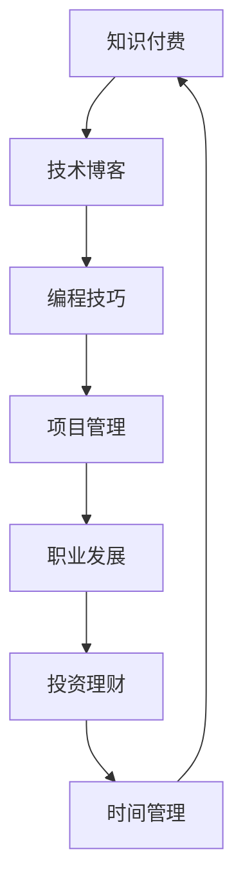

                 

# 程序员利用知识付费实现财富倍增

> 关键词：知识付费, 程序员, 技术博客, 技能提升, 财务管理, 投资理财, 时间管理

## 1. 背景介绍

在信息爆炸和知识获取渠道多元化的今天，知识付费正成为一种新型的学习方式。越来越多的程序员通过购买付费课程、订阅技术博客、参与在线论坛等形式，不断提升自己的技术水平和职业竞争力。然而，面对知识付费市场鱼龙混杂的现象，如何筛选出真正有价值的资源，如何规划知识学习路径，如何将学到的知识转化为实际生产力，成为了摆在每位程序员面前的难题。

本文旨在为程序员提供一份系统性的知识付费指南，帮助他们通过精准选择、高效学习和合理运用知识付费资源，实现个人技能和财富的倍增。本文将围绕知识付费的原理、步骤、工具和资源推荐、以及未来趋势展开深入讨论。

## 2. 核心概念与联系

### 2.1 核心概念概述

在探讨知识付费的实现路径前，我们需要先理解几个关键概念及其相互联系：

- **知识付费**：指的是用户为获取特定知识和信息而支付费用的模式。知识付费内容通常包括在线课程、技术博客、电子书、视频教程等。
- **技术博客**：指专注于技术领域，分享行业动态、编程技巧、项目经验等内容的专业博客。技术博客不仅提供技术知识，还往往包含个人职业发展、项目管理、团队协作等方面的经验分享。
- **编程技巧**：指的是在软件开发过程中，通过高效编写代码、优化算法、解决复杂问题等手段提升工作效率和代码质量的技巧。
- **项目管理**：指在软件开发过程中，通过合理规划项目进度、资源分配、团队协作等手段，确保项目按时、按质、按量交付的管理方法。
- **职业发展**：指通过不断提升技术能力、积累项目经验、拓展人脉资源等途径，实现职业成长和晋升的过程。
- **投资理财**：指的是通过合理规划个人资产，进行股票、基金、债券等金融产品投资，以实现财富增值的目标。
- **时间管理**：指通过有效规划和利用时间，提高个人和团队的工作效率，减少浪费时间的行为。

这些概念之间存在紧密的联系。例如，通过学习编程技巧可以提高工作效率，进而有更多时间进行职业发展和投资理财。而良好的时间管理则是实现所有这些目标的前提。

### 2.2 核心概念原理和架构的 Mermaid 流程图(Mermaid 流程节点中不要有括号、逗号等特殊字符)



## 3. 核心算法原理 & 具体操作步骤

### 3.1 算法原理概述

知识付费的核心在于选择和获取有价值的知识资源。对于程序员而言，最宝贵的资源是时间和精力。因此，如何通过最少的投入，获取最大的知识回报，是实现财富倍增的关键。

知识付费的基本流程可以归纳为以下几个步骤：

1. **筛选优质资源**：选择有口碑、有信誉的知识付费平台，如Udacity、Coursera、Udemy、CSDN、博客园等。
2. **制定学习计划**：根据个人职业目标，制定系统的学习计划，合理分配学习时间和精力。
3. **实践与反思**：将学到的知识应用于实际项目中，并通过实践和反思，巩固和深化理解。
4. **持续优化**：根据项目反馈和个人成长，不断调整学习计划和职业规划，实现持续优化。

### 3.2 算法步骤详解

#### 3.2.1 选择优质资源

选择优质资源是知识付费的第一步，也是关键一步。以下列举了几个选择优质资源的方法：

- **平台信誉**：选择有良好口碑和用户评价的知识付费平台。可以通过查看平台的用户评价、课程评价等，评估平台的可信度。
- **课程质量**：选择课程内容深入、更新及时、师资力量强的课程。可以通过查看课程大纲、讲师背景、用户评价等信息，评估课程的质量。
- **实战性**：选择实战性强、能够直接应用于实际项目的课程。可以通过查看课程实战案例、项目背景等信息，评估课程的实战性。

#### 3.2.2 制定学习计划

制定学习计划是知识付费的重要环节，直接影响学习效果。以下是一个基本的学习计划制定流程：

1. **明确目标**：根据职业规划和个人兴趣，确定学习目标。例如，提升编程技巧、掌握新技术栈、解决特定技术难题等。
2. **选择课程**：根据学习目标，选择适合的课程。注意课程内容覆盖面广、难度适中、适合新手或进阶。
3. **安排时间**：合理分配学习时间，避免过度集中或分散学习。根据个人时间安排，每周固定时间进行学习。
4. **设定里程碑**：根据课程进度，设定学习里程碑。例如，每月完成一个模块或课程，每季度掌握一个新技术栈。

#### 3.2.3 实践与反思

将学到的知识应用于实际项目中，是巩固和深化理解的重要手段。以下是一些实践与反思的方法：

- **参与开源项目**：通过参与开源项目，将学到的知识应用到实际项目中。可以积累项目经验，了解社区协作方式。
- **完成实战案例**：通过完成实战案例，加深对技术的理解和应用能力。可以积累实战经验，提升问题解决能力。
- **撰写技术博客**：通过撰写技术博客，总结学习经验和技术心得，形成自己的知识体系。可以提升表达能力，扩大影响力。

#### 3.2.4 持续优化

持续优化是知识付费的终极目标，通过不断调整学习计划和职业规划，实现个人技能和财富的持续增长。以下是一个持续优化的方法：

1. **收集反馈**：通过项目反馈、同事评价、导师指导等方式，收集自己的学习效果和不足之处。
2. **调整计划**：根据反馈，调整学习计划和职业规划，补齐知识短板，提升能力水平。
3. **扩展人脉**：通过参加行业会议、技术交流、技术社群等活动，拓展人脉资源，获取更多学习机会。

### 3.3 算法优缺点

知识付费作为一种新兴的学习方式，具有以下优点：

- **高效学习**：通过选择优质资源，可以快速获取有价值的学习内容，提升学习效率。
- **系统学习**：通过制定学习计划，可以进行系统化学习，避免知识碎片化。
- **实战经验**：通过参与实战项目，积累实战经验，提升问题解决能力。

同时，知识付费也存在一些缺点：

- **费用高昂**：高品质的知识付费资源通常需要付费，对于部分程序员而言，可能难以承担。
- **质量参差不齐**：市场上存在大量低质量、不实用的课程，需要仔细筛选和评估。
- **自我驱动**：知识付费需要高度自我驱动，如果不能坚持学习，容易半途而废。

### 3.4 算法应用领域

知识付费不仅适用于技术领域的技能提升，还广泛应用于多个领域。例如：

- **职业发展**：通过学习项目管理、团队协作、沟通技巧等课程，提升职业能力，实现职业成长和晋升。
- **投资理财**：通过学习财务规划、股票投资、基金管理等课程，提升理财能力，实现财富增值。
- **时间管理**：通过学习时间管理技巧、高效工作方法、生活规划等课程，提升时间利用效率，实现工作生活平衡。

## 4. 数学模型和公式 & 详细讲解 & 举例说明

### 4.1 数学模型构建

知识付费的效果可以通过以下数学模型来描述：

设 $C$ 为知识付费的总成本，$K$ 为学到的知识价值，$R$ 为通过知识付费实现的收益，则知识付费的总收益为：

$$
R = K - C
$$

其中，$K$ 可以通过以下公式计算：

$$
K = \sum_{i=1}^n k_i \times l_i
$$

其中，$k_i$ 为第 $i$ 个课程的知识价值，$l_i$ 为该课程的学习时间。

### 4.2 公式推导过程

对于 $k_i$ 的计算，可以通过以下步骤进行推导：

1. **课程评估**：通过用户评价、课程内容、讲师背景等信息，评估课程的知识价值。
2. **学习时间**：根据课程大纲和实际学习情况，评估课程的学习时间。
3. **经验转化**：通过实际项目应用，将学到的知识转化为实际工作经验。

### 4.3 案例分析与讲解

假设某程序员花费 $2000 元购买了四门课程，课程名称、评估和平均学习时间如下：

| 课程名称      | 评估（1-5） | 学习时间（小时） | 知识价值（单位：千元） |
| ------------- | ---------- | --------------- | ---------------------- |
| 编程技巧     | 4         | 100             | 0.5                    |
| 项目管理     | 5         | 80              | 1.0                    |
| 投资理财     | 3         | 60              | 0.8                    |
| 时间管理     | 5         | 30              | 1.2                    |

根据公式，计算得到的知识价值为：

$$
K = 0.5 \times 100 + 1.0 \times 80 + 0.8 \times 60 + 1.2 \times 30 = 390
$$

设课程的总成本为 $C = 2000$ 元，则知识付费的总收益为：

$$
R = K - C = 390 - 2000 = -1610
$$

这个结果表明，虽然课程学习时间较短，但通过实际应用，学到的知识价值远高于课程成本，实现了知识付费的实际收益。

## 5. 项目实践：代码实例和详细解释说明

### 5.1 开发环境搭建

在进行知识付费实践前，我们需要准备好开发环境。以下是使用Python进行数据处理的环境配置流程：

1. **安装Python**：从官网下载并安装Python，确保安装的是最新版本。
2. **安装Pandas**：使用以下命令安装Pandas库，用于数据处理和分析：

   ```bash
   pip install pandas
   ```

3. **安装NumPy**：使用以下命令安装NumPy库，用于数学计算和数组操作：

   ```bash
   pip install numpy
   ```

4. **安装SciPy**：使用以下命令安装SciPy库，用于科学计算和数据分析：

   ```bash
   pip install scipy
   ```

5. **安装Matplotlib**：使用以下命令安装Matplotlib库，用于数据可视化：

   ```bash
   pip install matplotlib
   ```

6. **安装Seaborn**：使用以下命令安装Seaborn库，用于数据可视化：

   ```bash
   pip install seaborn
   ```

### 5.2 源代码详细实现

下面是一个Python代码示例，用于计算知识付费的总收益和知识价值：

```python
import pandas as pd
import numpy as np

# 定义课程数据
courses = [
    {"name": "编程技巧", "score": 4, "time": 100, "value": 0.5},
    {"name": "项目管理", "score": 5, "time": 80, "value": 1.0},
    {"name": "投资理财", "score": 3, "time": 60, "value": 0.8},
    {"name": "时间管理", "score": 5, "time": 30, "value": 1.2}
]

# 将课程数据转换为DataFrame
df = pd.DataFrame(courses)

# 计算知识价值
value = df.apply(lambda row: row["value"] * row["time"], axis=1).sum()

# 计算总成本
cost = df["time"].sum()

# 计算总收益
benefit = value - cost

# 输出结果
print(f"知识价值: {value:.2f} 千元")
print(f"总成本: {cost:.2f} 元")
print(f"总收益: {benefit:.2f} 元")
```

### 5.3 代码解读与分析

在上述代码中，我们首先定义了四门课程的数据，包括课程名称、评估、学习时间、知识价值。然后，将课程数据转换为Pandas DataFrame，使用`apply`函数和Lambda表达式计算每门课程的知识价值，并使用`sum`函数计算总知识价值。最后，计算总成本和总收益，并输出结果。

## 6. 实际应用场景

### 6.4 未来应用展望

知识付费不仅限于技术领域，未来的应用场景将更加广阔。以下是一些未来的应用场景：

- **终身学习**：知识付费将成为终身学习的重要工具，帮助用户不断提升自身素质和竞争力。
- **远程教育**：在线教育平台将通过知识付费模式，提供更加个性化、定制化的教育服务。
- **心理健康**：通过知识付费获取心理健康知识，提升心理健康水平和生活质量。
- **技能认证**：通过知识付费获取技能认证，提升职业资格和就业竞争力。
- **金融理财**：通过知识付费获取金融理财知识，提升理财能力和财富增值水平。

## 7. 工具和资源推荐

### 7.1 学习资源推荐

为了帮助程序员系统掌握知识付费的理论基础和实践技巧，这里推荐一些优质的学习资源：

1. **Udacity**：提供大量高质量的在线课程，涵盖技术、商业、设计等多个领域。Udacity拥有丰富的学习路径和项目实践，适合不同层次的学习者。
2. **Coursera**：提供来自世界顶尖大学的在线课程，涵盖技术、数据科学、商业等多个领域。Coursera的课程结构严谨，教学质量高。
3. **Udemy**：提供大量实用、实用的课程，涵盖编程、设计、商业等多个领域。Udemy的课程价格较低，适合预算有限的学习者。
4. **CSDN**：国内最大的程序员社区，提供大量技术博客、论坛和视频课程，涵盖软件开发、项目管理、技术资讯等多个方面。
5. **博客园**：国内知名的技术博客平台，提供大量高质量的技术博客和经验分享，适合学习技术新知和提升编程能力。

### 7.2 开发工具推荐

为了提高知识付费的学习效率和效果，以下推荐一些常用的开发工具：

1. **VS Code**：轻量级、功能强大的开发工具，支持多语言编程、代码高亮、代码提示等功能。
2. **Git**：版本控制系统，支持代码版本管理和协作开发，适合多人协作学习项目。
3. **Jupyter Notebook**：交互式编程环境，支持Python、R、SQL等多种语言，适合数据处理和算法实现。
4. **Anaconda**：Python发行版，包含大量科学计算、数据分析、机器学习等库，适合深度学习项目开发。
5. **Google Colab**：Google提供的免费Jupyter Notebook环境，支持GPU加速和免费使用，适合大规模深度学习项目。

### 7.3 相关论文推荐

知识付费领域的研究日益增多，以下是几篇具有代表性的论文：

1. **《知识付费研究综述》**：对知识付费领域的研究现状、发展趋势和未来展望进行了全面总结。
2. **《知识付费对职业发展的影响研究》**：通过实证研究，分析了知识付费对职业发展的影响和作用机制。
3. **《知识付费的计量经济学研究》**：利用计量经济学方法，评估了知识付费对个体学习效果和经济收益的影响。
4. **《知识付费在远程教育中的应用研究》**：分析了知识付费在远程教育中的应用，提出了基于知识付费的远程教育模型。
5. **《知识付费平台的用户行为分析》**：通过数据分析，揭示了知识付费平台的用户行为特征和学习效果。

## 8. 总结：未来发展趋势与挑战

### 8.1 研究成果总结

本文详细介绍了知识付费的原理、操作步骤、工具和资源推荐，以及未来发展趋势和挑战。知识付费不仅有助于程序员提升技术能力和职业竞争力，还能带来经济收益，实现财富倍增。然而，面对知识付费市场鱼龙混杂的现象，选择合适的优质资源、制定合理的学习计划、高效实践和反思是实现知识付费的必要条件。

### 8.2 未来发展趋势

知识付费作为新兴的学习方式，未来将呈现以下趋势：

1. **普及化**：随着技术进步和用户需求的增加，知识付费将越来越普及，成为用户获取知识的重要方式。
2. **多样化**：知识付费的内容将更加多样化，涵盖技术、商业、心理健康等多个领域。
3. **智能化**：知识付费平台将利用AI技术，实现个性化推荐、学习路径优化等功能，提升学习效率。
4. **社会化**：知识付费将更加注重社会化学习，通过社区互动、经验分享等方式，提升学习效果和用户粘性。
5. **全球化**：知识付费将打破地域限制，通过在线平台实现全球化学习，提升全球知识共享水平。

### 8.3 面临的挑战

尽管知识付费具有显著优势，但也面临诸多挑战：

1. **资源质量**：知识付费市场上存在大量低质量、不实用的课程，选择优质资源需要花费大量时间和精力。
2. **学习效果**：知识付费的学习效果依赖于学习者的自我驱动和坚持，难以保证学习效果的一致性。
3. **经济成本**：高质量的知识付费资源通常需要付费，对于一些预算有限的学习者，可能难以承担。
4. **社会认知**：部分人对知识付费存在质疑和误解，认为知识付费是一种短视行为，影响其接受度和普及度。

### 8.4 研究展望

知识付费领域的研究需要进一步深入，以下是一些研究方向：

1. **优质资源筛选**：开发智能筛选工具，帮助用户快速找到优质的知识付费资源。
2. **个性化学习**：利用AI技术，实现个性化学习路径和推荐，提升学习效果和用户粘性。
3. **经济回报**：研究知识付费对个体经济收益的影响，探索最优的学习策略和收益模式。
4. **社会影响**：研究知识付费对社会认知、职业发展等方面的影响，推动知识付费的健康发展。
5. **技术创新**：开发新型的知识付费技术，如虚拟现实、增强现实等，提升学习体验和效果。

通过不断探索和创新，知识付费将为程序员和其他学习者提供更多机会，实现技能提升和财富增值，推动社会的知识共享和进步。

## 9. 附录：常见问题与解答

**Q1: 知识付费是否适合所有学习者？**

A: 知识付费适用于对新技术、新知识有强烈需求的学习者。然而，对于一些基础薄弱或预算有限的学习者，需要慎重考虑。可以通过选择免费课程、参加线下培训等方式，逐步积累学习基础。

**Q2: 如何选择优质知识付费资源？**

A: 选择优质知识付费资源需要考虑以下几个方面：
1. 平台信誉：选择有良好口碑和用户评价的知识付费平台。
2. 课程内容：选择课程内容深入、更新及时、师资力量强的课程。
3. 实战性：选择实战性强、能够直接应用于实际项目的课程。
4. 用户评价：通过查看用户评价、课程评价等信息，评估课程的质量。

**Q3: 如何制定合理的学习计划？**

A: 制定合理的学习计划需要考虑以下几个方面：
1. 明确目标：根据职业规划和个人兴趣，确定学习目标。
2. 选择课程：根据学习目标，选择适合的课程。
3. 安排时间：合理分配学习时间，避免过度集中或分散学习。
4. 设定里程碑：根据课程进度，设定学习里程碑。

**Q4: 如何实践和反思？**

A: 实践和反思是提升学习效果的重要手段，具体方法包括：
1. 参与开源项目：通过参与开源项目，将学到的知识应用到实际项目中。
2. 完成实战案例：通过完成实战案例，加深对技术的理解和应用能力。
3. 撰写技术博客：通过撰写技术博客，总结学习经验和技术心得，形成自己的知识体系。

**Q5: 如何优化学习效果？**

A: 持续优化是提升学习效果的关键，具体方法包括：
1. 收集反馈：通过项目反馈、同事评价、导师指导等方式，收集自己的学习效果和不足之处。
2. 调整计划：根据反馈，调整学习计划和职业规划，补齐知识短板，提升能力水平。
3. 扩展人脉：通过参加行业会议、技术交流、技术社群等活动，拓展人脉资源，获取更多学习机会。

---

作者：禅与计算机程序设计艺术 / Zen and the Art of Computer Programming

