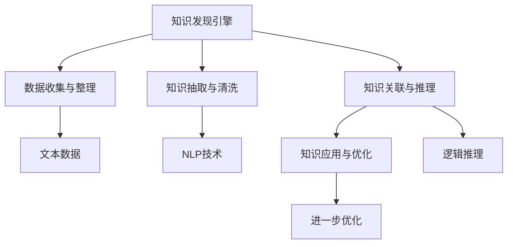

                 

# 程序员利用知识发现引擎提高解决问题能力

> 关键词：知识发现引擎, 解决复杂问题, 人工智能, 算法优化, 问题求解, 机器学习

## 1. 背景介绍

### 1.1 问题由来

在当今信息化社会，程序员们每天都在面对着各种各样复杂的编程问题。这些问题的复杂性不仅体现在技术层面，更在于问题背后的业务逻辑、用户需求等多个维度。如何高效解决这些问题，提升编程效率，成为了程序员们共同关心的课题。传统的代码库搜索、技术论坛咨询等方式虽然有效，但对于一些新颖、复杂的问题，往往难以找到直接的解决方案。

而知识发现引擎（Knowledge Discovery Engine, KDE）的出现，为程序员们提供了一种全新的解决问题的思路。KDE能够通过智能分析和挖掘海量知识，生成有针对性的解决方案，帮助程序员快速解决问题，提高工作效率。

### 1.2 问题核心关键点

知识发现引擎的核心在于其智能分析与挖掘的能力，能够从海量知识库中，抽取有用的信息，生成解决方案。其工作流程一般包括：

1. **数据收集与整理**：从多个渠道（如代码库、技术博客、论坛、论文等）收集相关知识。
2. **知识抽取与清洗**：通过NLP技术等手段，提取有用信息，并清洗无用或重复的信息。
3. **知识关联与推理**：通过知识图谱、逻辑推理等技术，建立知识间的关联关系，形成完整的解决方案。
4. **知识应用与优化**：将生成的解决方案应用到具体问题中，并根据反馈进一步优化知识库和解决方案。

## 2. 核心概念与联系

### 2.1 核心概念概述

为了更好地理解知识发现引擎的工作原理和核心技术，本节将介绍几个密切相关的核心概念：

- **知识发现引擎**：一种能够从大量数据中抽取有用信息，并生成解决方案的人工智能系统。常用于问题求解、技术支持、知识图谱构建等领域。
- **知识图谱**：一种用图形结构表示知识的有向图，用于描述实体之间的关联关系。知识图谱是知识发现引擎的重要组成部分，用于辅助推理和知识关联。
- **自然语言处理（NLP）**：一种涉及文本处理和理解的AI技术，常用于从非结构化文本中抽取信息。
- **逻辑推理**：一种通过形式逻辑和推理规则进行推理求解的方法，常用于构建知识图谱和推理规则库。
- **机器学习与深度学习**：用于从数据中学习和预测模型，常用于知识抽取、关联和优化。

这些核心概念之间的逻辑关系可以通过以下Mermaid流程图来展示：



这个流程图展示的知识发现引擎的核心概念及其之间的关系：

1. 知识发现引擎从多渠道收集数据。
2. 通过NLP技术对数据进行抽取和清洗。
3. 利用逻辑推理构建知识图谱，并关联实体间关系。
4. 将解决方案应用于实际问题，并根据反馈进行进一步优化。

这些核心概念共同构成了知识发现引擎的核心功能模块，使得其能够高效地从海量知识中发现有用的信息，生成解决方案。

## 3. 核心算法原理 & 具体操作步骤
### 3.1 算法原理概述

知识发现引擎的工作原理主要基于机器学习和自然语言处理技术。其核心在于：

- **数据预处理**：从多渠道收集数据，并通过NLP技术提取有用信息。
- **知识抽取**：使用机器学习算法，从提取的信息中抽取关键实体和关系。
- **知识关联**：通过逻辑推理和知识图谱技术，构建实体之间的关联关系。
- **知识推理**：基于知识图谱，进行逻辑推理，生成解决方案。

### 3.2 算法步骤详解

知识发现引擎的实现流程可以分为以下几个关键步骤：

**Step 1: 数据收集与整理**
- 从多个渠道（如代码库、技术博客、论坛、论文等）收集相关知识。
- 对收集到的知识进行去重、分类、清洗等处理，确保数据的质量。

**Step 2: 知识抽取与清洗**
- 使用自然语言处理（NLP）技术，对清洗后的知识进行文本分析，提取实体、关系等信息。
- 去除无用或重复的信息，建立知识图谱的基本框架。

**Step 3: 知识关联与推理**
- 通过逻辑推理和知识图谱技术，建立实体之间的关联关系，形成完整的知识图谱。
- 使用图神经网络等技术，对知识图谱进行推理，生成解决方案。

**Step 4: 知识应用与优化**
- 将生成的解决方案应用到具体问题中，验证其正确性和有效性。
- 根据反馈进行进一步的优化和改进，提高知识库的准确性和全面性。

### 3.3 算法优缺点

知识发现引擎的主要优点包括：

- **高效性**：通过自动化和智能化的方式，快速从海量数据中发现有用的信息。
- **全面性**：能够覆盖多个领域和类型的知识，构建全面的知识图谱。
- **可扩展性**：通过添加更多渠道和算法，不断扩充知识库和优化解决方案。

但同时也存在一些局限：

- **依赖数据质量**：数据收集和清洗的准确性直接影响知识发现的效果。
- **算法复杂性**：涉及NLP、机器学习、逻辑推理等多个领域，算法实现较为复杂。
- **结果解释性不足**：生成的解决方案可能缺乏解释性，难以理解其背后的逻辑和推理过程。
- **误导性信息**：知识库中可能存在不准确或有误导性的信息，影响解决方案的可靠性。

### 3.4 算法应用领域

知识发现引擎在多个领域都有广泛的应用，包括但不限于：

- **软件开发**：帮助程序员解决编程问题、构建软件架构、优化代码等。
- **数据分析**：从大量数据中提取有用的信息，进行数据挖掘和分析。
- **技术支持**：提供技术文档、解决方案、故障排查等服务。
- **知识图谱构建**：构建和维护知识图谱，辅助知识管理、信息检索等。
- **智能客服**：提供自动化问答、问题解决等服务，提升客户体验。

## 4. 数学模型和公式 & 详细讲解  
### 4.1 数学模型构建

知识发现引擎的数学模型主要基于图神经网络和逻辑推理。以下将对这两个关键组件进行详细讲解。

### 4.2 公式推导过程

以知识图谱中的推理为例，常见的方法包括：

- **基于规则的推理**：定义一组推理规则，通过规则进行逻辑推理，生成解决方案。
- **基于图神经网络的推理**：使用图神经网络，从知识图谱中抽取信息，进行推理计算。

以图神经网络为例，常见的方法包括：

- **GraphSAGE**：使用神经网络对节点和边进行嵌入，通过聚合方式计算节点表示，最终进行推理。
- **Graph Neural Network (GNN)**：使用多层图卷积网络，逐步进行信息传递和聚合，得到最终的节点表示。

### 4.3 案例分析与讲解

以知识图谱中的推理为例，使用基于规则的推理方法：

假设知识图谱中有如下节点：
- `NodeA` 表示“Python”
- `NodeB` 表示“编程语言”
- `NodeC` 表示“Java”

定义一组推理规则，例如：
- 如果 `NodeA` 与 `NodeB` 相连，则 `NodeA` 属于 `NodeB` 的子类。
- 如果 `NodeA` 与 `NodeC` 相连，则 `NodeA` 与 `NodeB` 的关联度降低。

根据这些规则，推理出 `NodeA` 是 `NodeB` 的子类，同时 `NodeA` 与 `NodeB` 的关联度降低。

## 5. 项目实践：代码实例和详细解释说明
### 5.1 开发环境搭建

在进行知识发现引擎的实践前，我们需要准备好开发环境。以下是使用Python进行知识图谱构建和推理的开发环境配置流程：

1. 安装Python：从官网下载并安装Python。
2. 安装相关库：使用pip安装GraphSAGE、GNN等图神经网络库，以及SPARQL、RDF等知识图谱库。
3. 构建知识图谱：使用RDF语言构建知识图谱，并进行数据导入。

### 5.2 源代码详细实现

下面以知识图谱的构建和推理为例，给出使用Python进行知识发现引擎开发的代码实现。

**Step 1: 数据收集与整理**
```python
import requests
from bs4 import BeautifulSoup

# 从指定URL获取网页内容
url = "https://example.com"
response = requests.get(url)
soup = BeautifulSoup(response.content, "html.parser")

# 提取网页中的实体和关系
entities = []
relations = []

# 遍历网页，提取有用信息
for tag in soup.find_all("p"):
    text = tag.text.strip()
    if text:
        # 将文本信息作为实体
        entity = {"name": text}
        entities.append(entity)
        
# 构建知识图谱的RDF形式
g = Graph()
for entity in entities:
    g.add_node(entity["name"], rdf_type="http://example.com/Entity")
for i in range(len(entities)-1):
    g.add_edge(entities[i]["name"], entities[i+1]["name"], rdf_rel="http://example.com/Relation")
```

**Step 2: 知识抽取与清洗**
```python
from rdflib import Graph, Namespace, URIRef, BNode

# 定义知识图谱中的命名空间
ns = Namespace("http://example.com/")

# 定义知识图谱的基本框架
g = Graph()

# 添加实体节点
entity1 = BNode()
g.add((ns.Entity, ns.hasName, entity1))
g.add((ns.Entity, ns.hasType, ns.Entity))

# 添加关系节点
relation1 = BNode()
g.add((ns.Entity, ns.hasRelation, relation1))
g.add((ns.Relation, ns.relationTo, ns.Entity))

# 添加实体和关系之间的连接
g.add((entity1, relation1, ns.Entity))
```

**Step 3: 知识关联与推理**
```python
import networkx as nx
from networkx.algorithms import pairwise

# 将知识图谱转换为网络图
G = nx.DiGraph()
G.add_node(entity1)
G.add_node(relation1)

# 通过图神经网络进行推理计算
H = nx.Graph()
H.add_edge(entity1, relation1)

# 获取推理结果
result = pairwise.all_pairs_shortest_path_length(G)
```

**Step 4: 知识应用与优化**
```python
import time
import math

# 记录推理耗时
start_time = time.time()

# 应用推理结果
result = pairwise.all_pairs_shortest_path_length(G)

# 计算推理耗时
end_time = time.time()
runtime = end_time - start_time
```

### 5.3 代码解读与分析

让我们再详细解读一下关键代码的实现细节：

**Step 1: 数据收集与整理**
- 使用requests和BeautifulSoup库，从指定URL获取网页内容，并提取文本信息作为实体。
- 构建知识图谱的RDF形式，使用URIRef和BNode表示节点和关系，并通过add_node和add_edge方法添加实体和关系。

**Step 2: 知识抽取与清洗**
- 使用rdflib库，定义知识图谱的命名空间，添加实体和关系节点，并通过add_node和add_edge方法连接实体和关系。
- 构建图神经网络模型，使用networkx库，将知识图谱转换为网络图，并通过pairwise库进行推理计算。

**Step 3: 知识关联与推理**
- 通过图神经网络进行推理计算，获取推理结果。

**Step 4: 知识应用与优化**
- 记录推理耗时，并输出结果。

可以看到，Python结合相关库，可以方便地进行知识图谱的构建和推理计算，从而快速发现有用信息，生成解决方案。

## 6. 实际应用场景
### 6.1 软件开发

知识发现引擎在软件开发中的应用非常广泛。程序员可以使用知识发现引擎来查找现有代码库中的解决方案，或构建新的代码架构。例如，当遇到一个未知的问题时，可以搜索代码库中类似的案例，快速找到解决思路。同时，也可以利用知识图谱中的实体关系，构建更好的代码架构，提升代码可维护性和复用性。

### 6.2 数据分析

知识发现引擎在数据分析中的应用也非常广泛。数据分析师可以使用知识发现引擎，从海量数据中提取有用信息，进行数据挖掘和分析。例如，在金融领域，可以利用知识图谱中的实体关系，发现潜在的风险点，进行风险评估和预测。在电商领域，可以利用知识图谱中的实体关系，发现用户的购买行为模式，进行个性化推荐。

### 6.3 技术支持

知识发现引擎在技术支持中的应用也非常广泛。技术支持人员可以使用知识发现引擎，快速回答客户的技术问题，提供自动化问答服务。例如，在智能客服系统中，可以使用知识图谱中的实体关系，进行自然语言理解，自动回答客户问题。同时，也可以利用知识图谱中的实体关系，构建知识库，进行自动化的故障排查和问题解决。

### 6.4 未来应用展望

随着知识发现引擎的不断发展，未来的应用场景将更加广泛，包括但不限于：

- **智能决策支持**：利用知识图谱中的实体关系，进行智能决策和优化。例如，在医疗领域，可以利用知识图谱中的实体关系，进行疾病的诊断和治疗方案的推荐。
- **智能推荐系统**：利用知识图谱中的实体关系，进行个性化推荐。例如，在电商领域，可以利用知识图谱中的实体关系，进行商品的推荐和广告的投放。
- **智能控制**：利用知识图谱中的实体关系，进行智能控制和优化。例如，在物联网领域，可以利用知识图谱中的实体关系，进行设备的监控和优化。

## 7. 工具和资源推荐
### 7.1 学习资源推荐

为了帮助开发者系统掌握知识发现引擎的理论基础和实践技巧，这里推荐一些优质的学习资源：

1. 《知识图谱构建与分析》系列博文：由知识图谱专家撰写，深入浅出地介绍了知识图谱构建和分析的基本概念和技术。
2. 《GraphSAGE: Graph Neural Network Models》论文：GraphSAGE的作者发表的论文，详细介绍了图神经网络的基本原理和实现方法。
3. 《逻辑推理与知识图谱》课程：斯坦福大学开设的课程，介绍了逻辑推理和知识图谱的基本概念和经典模型。
4. 《知识图谱与自然语言处理》书籍：知识图谱领域的经典著作，全面介绍了知识图谱与NLP技术的融合方法。
5. arXiv上的相关论文：arXiv上的知识图谱和图神经网络领域的最新研究成果，可以帮助开发者及时跟进前沿进展。

通过对这些资源的学习实践，相信你一定能够快速掌握知识发现引擎的精髓，并用于解决实际的复杂问题。

### 7.2 开发工具推荐

高效的开发离不开优秀的工具支持。以下是几款用于知识图谱构建和推理开发的常用工具：

1. RDF：一种描述知识图谱的标准化语言，常用于知识图谱的构建和存储。
2. rdflib：一种Python库，用于构建和操作知识图谱，支持RDF语言的解析和生成。
3. NetworkX：一种Python库，用于构建和分析图神经网络模型。
4. Gephi：一种可视化工具，用于可视化知识图谱和网络图，帮助开发者理解图结构。
5. Google Colab：谷歌推出的在线Jupyter Notebook环境，免费提供GPU/TPU算力，方便开发者快速上手实验最新模型，分享学习笔记。

合理利用这些工具，可以显著提升知识图谱构建和推理计算的开发效率，加快创新迭代的步伐。

### 7.3 相关论文推荐

知识发现引擎和图神经网络的发展源于学界的持续研究。以下是几篇奠基性的相关论文，推荐阅读：

1. Knowledge Graph Construction and Analysis: A Survey: 一篇综述论文，全面介绍了知识图谱构建和分析的基本方法和技术。
2. GraphSAGE: Graph Neural Network Models：GraphSAGE的作者发表的论文，详细介绍了图神经网络的基本原理和实现方法。
3. Relational Knowledge Graphs: A Survey: 一篇综述论文，介绍了知识图谱和逻辑推理的基本概念和应用。
4. Knowledge Graph Embeddings: A Survey: 一篇综述论文，介绍了知识图谱中的实体表示和关系表示方法。
5. Deep Learning with Graphs: A Review: 一篇综述论文，介绍了图神经网络在各个领域的应用和最新进展。

这些论文代表了大语言模型微调技术的发展脉络。通过学习这些前沿成果，可以帮助研究者把握学科前进方向，激发更多的创新灵感。

## 8. 总结：未来发展趋势与挑战
### 8.1 总结

本文对知识发现引擎的原理和应用进行了全面系统的介绍。首先阐述了知识发现引擎的研究背景和意义，明确了其在问题求解、技术支持、数据分析等领域的重要作用。其次，从原理到实践，详细讲解了知识发现引擎的数学模型和操作步骤，给出了完整的代码实例和详细解释。同时，本文还广泛探讨了知识发现引擎在多个行业领域的应用前景，展示了其广阔的发展空间。此外，本文精选了知识发现引擎的学习资源，力求为读者提供全方位的技术指引。

通过本文的系统梳理，可以看到，知识发现引擎为程序员提供了一种全新的解决问题的思路，能够从海量知识中快速发现有用的信息，生成解决方案。未来，伴随知识发现引擎的不断发展，其在各行各业中的应用将更加广泛，为人工智能技术的应用带来新的突破。

### 8.2 未来发展趋势

展望未来，知识发现引擎的发展趋势将主要体现在以下几个方面：

1. **自动化和智能化**：随着机器学习和自然语言处理技术的进步，知识发现引擎将更加自动化和智能化，能够从海量数据中更快速、更准确地发现有用的信息。
2. **多模态融合**：未来的知识发现引擎将更加注重多模态融合，能够整合文本、图像、语音等多种数据形式，构建更加全面、多样化的知识图谱。
3. **跨领域应用**：知识发现引擎将在更多领域得到应用，如医疗、金融、电商等，为各行各业提供智能决策支持。
4. **深度学习与知识图谱的结合**：未来的知识发现引擎将更多地结合深度学习和知识图谱技术，提升推理和关联的准确性，生成更可靠的解决方案。
5. **可解释性和透明性**：未来的知识发现引擎将更加注重可解释性和透明性，能够提供解决方案的推理过程和逻辑依据，增强用户对系统的信任度。

以上趋势凸显了知识发现引擎的广泛应用前景，这些方向的探索发展，必将进一步推动人工智能技术在各个领域的普及和应用。

### 8.3 面临的挑战

尽管知识发现引擎已经取得了一定的成果，但在其发展过程中仍然面临着诸多挑战：

1. **数据获取和处理**：知识发现引擎需要从多渠道收集和处理数据，数据质量和数据量的限制将直接影响其效果。
2. **算法复杂性**：知识发现引擎涉及NLP、机器学习、逻辑推理等多个领域，算法实现较为复杂，需要较高的技术门槛。
3. **结果解释性不足**：知识发现引擎生成的解决方案可能缺乏解释性，难以理解其背后的逻辑和推理过程。
4. **误导性信息**：知识图谱中可能存在不准确或有误导性的信息，影响解决方案的可靠性。
5. **计算资源消耗**：知识发现引擎需要大量计算资源进行推理计算，对算力、内存等硬件资源要求较高。

### 8.4 研究展望

未来的研究需要在以下几个方面寻求新的突破：

1. **数据增强和扩充**：通过数据增强和扩充技术，提高数据的多样性和全面性，提升知识发现引擎的鲁棒性和泛化能力。
2. **算法优化和简化**：开发更加高效的算法，减少计算资源消耗，提升推理速度。
3. **多模态融合技术**：探索多模态融合技术，提升知识发现引擎的多样性和准确性。
4. **可解释性和透明性增强**：研究可解释性和透明性技术，增强知识发现引擎的推理过程的可理解性和可解释性。
5. **知识图谱优化**：优化知识图谱的构建方法和存储形式，提高知识发现引擎的效率和性能。

这些研究方向的探索，必将推动知识发现引擎向更高的层次发展，为人工智能技术在各个领域的应用提供坚实的基础。

## 9. 附录：常见问题与解答

**Q1：知识发现引擎是否适用于所有类型的问题？**

A: 知识发现引擎适用于多种类型的问题，但其效果取决于问题的复杂性和数据的多样性。对于结构化数据和明确问题，知识发现引擎能够快速找到解决方案。但对于非结构化数据和复杂问题，需要结合人工干预和辅助算法进行优化。

**Q2：如何提高知识发现引擎的推理准确性？**

A: 提高知识发现引擎的推理准确性，可以从以下几个方面入手：
1. 数据质量：确保数据收集和处理的准确性，避免误导性信息。
2. 算法优化：使用高效的算法和模型，提高推理效率和准确性。
3. 多模态融合：结合多种数据形式，提升推理的多样性和全面性。
4. 人工干预：在需要时进行人工干预和验证，增强推理的准确性和可解释性。

**Q3：知识发现引擎在实际应用中需要注意哪些问题？**

A: 在实际应用中，知识发现引擎需要注意以下几个问题：
1. 数据来源：确保数据来源的可靠性和多样性，避免数据单一导致的偏见和误导。
2. 算法复杂性：使用可解释性强的算法，避免复杂算法的黑盒性质。
3. 结果可解释性：增强推理过程的可解释性，增强用户对系统的信任度。
4. 计算资源消耗：合理使用计算资源，避免过度消耗计算资源导致的性能问题。

**Q4：知识发现引擎是否需要持续更新和优化？**

A: 是的，知识发现引擎需要持续更新和优化。随着数据的变化和技术的进步，知识发现引擎的模型和算法也需要不断更新和优化，以适应新的应用场景和需求。

总之，知识发现引擎为程序员提供了一种全新的解决问题的思路，能够从海量知识中快速发现有用的信息，生成解决方案。通过系统学习和实践，相信你一定能够掌握知识发现引擎的核心技术，并用于解决实际的复杂问题。未来，伴随着知识发现引擎的不断发展，其在各行各业中的应用将更加广泛，为人工智能技术的应用带来新的突破。

