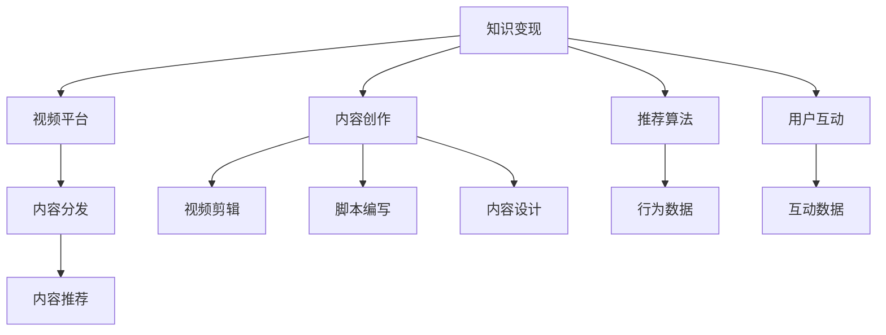

                 

## 1. 背景介绍

随着互联网技术的不断发展，越来越多的程序员开始通过互联网平台进行知识变现。相较于传统教学方式，互联网平台的灵活性和可接触性使其成为知识传播和变现的重要渠道。B站（哔哩哔哩）作为国内领先的视频分享平台，凭借其丰富的视频内容、活跃的社区氛围以及庞大的用户基础，成为了程序员进行知识变现的理想平台。

### 1.1 问题由来
当前，程序员在进行知识变现的过程中，面临着诸多挑战：
1. **平台选择**：面对众多的视频平台，如何选择最适合自己的平台进行知识变现？
2. **内容制作**：如何高效制作高质量的视频内容，吸引用户关注？
3. **收益提升**：如何通过优化视频内容和变现策略，最大化收益？

### 1.2 问题核心关键点
B站成为程序员知识变现的重要平台，主要基于以下核心关键点：
1. **社区氛围**：B站拥有活跃的编程社区，程序员可以在社区内分享知识，获取反馈。
2. **多样化的变现形式**：B站不仅支持视频变现，还支持图文、直播等多种形式的变现。
3. **高用户粘性**：B站的用户粘性较高，能长期关注和支持创作者。
4. **技术和算法支持**：B站的推荐算法和数据平台能帮助程序员精准推荐内容，提高曝光率。

### 1.3 问题研究意义
研究如何在B站上进行知识变现，对于提升程序员的收入水平，推动知识传播，促进社区发展具有重要意义：
1. **提高收入**：通过互联网平台进行知识变现，是程序员拓宽收入来源的有效途径。
2. **促进知识共享**：B站作为程序员社区，能够促进知识共享和技术交流，提升整个社区的技术水平。
3. **增强社区粘性**：通过知识变现，程序员能与用户建立更深层次的互动，增强社区粘性。
4. **推动技术进步**：知识变现过程通常伴随着技术更新和探索，能推动技术进步和创新。

## 2. 核心概念与联系

### 2.1 核心概念概述

为了更好地理解在B站上进行知识变现的策略和方法，本节将介绍几个密切相关的核心概念：

- **知识变现**：通过提供有价值的知识，获得经济回报的过程，包括但不限于视频、图文、课程等形式。
- **视频平台**：如B站，提供视频内容的平台，具备用户互动和内容变现的功能。
- **内容创作**：包括视频剪辑、脚本编写、内容设计等环节，是知识变现的基础。
- **推荐算法**：基于用户行为数据，自动推荐相关内容，提高内容曝光率。
- **用户互动**：包括点赞、评论、分享等行为，影响内容传播和变现效果。

这些核心概念之间的逻辑关系可以通过以下Mermaid流程图来展示：



这个流程图展示了大语言模型的核心概念及其之间的关系：

1. 知识变现依赖于视频平台，如B站。
2. 内容创作是知识变现的基础，涉及视频剪辑、脚本编写、内容设计等多个环节。
3. 推荐算法通过分析用户行为数据，自动推荐相关内容。
4. 用户互动包括点赞、评论、分享等行为，影响内容的传播和变现效果。

这些概念共同构成了知识变现的基本框架，帮助程序员在B站上实现高效变现。

## 3. 核心算法原理 & 具体操作步骤

### 3.1 算法原理概述

在B站上进行知识变现的核心算法包括内容推荐算法和收益分配算法。

- **内容推荐算法**：基于用户行为数据（观看时间、点赞、评论等），自动为用户推荐相关内容，提高内容曝光率，吸引更多用户关注。
- **收益分配算法**：根据内容的观看次数、互动数据（点赞、评论等），计算内容收益，进行收益分配，激励创作者持续产出优质内容。

### 3.2 算法步骤详解

#### 3.2.1 内容推荐算法

**Step 1: 数据收集与预处理**
- 收集用户观看视频的相关行为数据，包括观看时间、点赞、评论等。
- 对数据进行清洗、去重、归一化等预处理，确保数据质量。

**Step 2: 特征提取与建模**
- 提取用户行为特征，如观看时长、点赞数、互动率等。
- 设计推荐模型，如协同过滤、矩阵分解、深度学习等，建立用户和内容的关联模型。

**Step 3: 模型训练与优化**
- 使用历史数据训练推荐模型，通过交叉验证等方法进行模型优化。
- 使用A/B测试等方法评估模型效果，选择最优模型。

**Step 4: 实时推荐与反馈**
- 在B站实时收集用户行为数据，输入推荐模型，计算推荐结果。
- 根据用户反馈（点赞、评论、收藏等）调整推荐算法，进一步提高推荐效果。

#### 3.2.2 收益分配算法

**Step 1: 确定收益计算公式**
- 根据内容的观看次数、互动数据（点赞、评论等），确定收益计算公式。
- 设计收益分配模型，如线性回归、决策树、神经网络等，计算内容的收益。

**Step 2: 数据收集与处理**
- 收集内容的观看次数、点赞数、评论数等数据。
- 对数据进行清洗、去重、归一化等预处理，确保数据质量。

**Step 3: 模型训练与优化**
- 使用历史数据训练收益分配模型，通过交叉验证等方法进行模型优化。
- 使用A/B测试等方法评估模型效果，选择最优模型。

**Step 4: 收益计算与分配**
- 在B站实时收集内容收益数据，输入收益分配模型，计算内容的收益。
- 根据收益分配模型，进行收益分配，激励创作者持续产出优质内容。

### 3.3 算法优缺点

在B站上进行知识变现的算法具有以下优点：
1. **高效性**：通过自动推荐算法，程序员能够快速推广自己的内容，吸引更多用户关注。
2. **公平性**：基于用户行为数据的推荐算法和收益分配算法，能保证推荐结果和收益分配的公平性。
3. **可扩展性**：推荐算法和收益分配算法可以根据用户需求进行扩展和优化，适应不同的变现形式。

同时，该算法也存在以下局限性：
1. **数据依赖性**：推荐算法和收益分配算法依赖于用户行为数据，数据质量直接影响推荐效果。
2. **模型复杂性**：推荐算法和收益分配算法较为复杂，需要较高的技术水平和计算资源。
3. **收益不确定性**：由于用户行为数据的随机性，推荐算法和收益分配算法不能完全保证程序员的收益。

### 3.4 算法应用领域

在B站上进行知识变现的算法主要应用于以下几个领域：

- **视频内容推荐**：通过算法推荐，程序员的视频内容能够获得更高的曝光率和用户关注。
- **课程销售与广告**：利用算法优化课程销售和广告投放，提升转化率和收益。
- **直播互动**：通过算法推荐直播内容，提升直播互动率和用户粘性。
- **图文内容推荐**：通过算法推荐程序员的图文内容，提升内容曝光率和用户关注。

除了这些主要应用领域外，B站还支持更多的变现形式，如知识星球、专栏等，程序员可以灵活选择适合自己的变现方式。

## 4. 数学模型和公式 & 详细讲解

### 4.1 数学模型构建

在B站上进行知识变现的推荐算法和收益分配算法可以基于以下数学模型进行构建：

- **内容推荐模型**：
  \[
  \hat{y} = f(x, \theta)
  \]
  其中，\( y \) 表示推荐结果，\( x \) 为输入特征向量，\( \theta \) 为模型参数。

- **收益分配模型**：
  \[
  \hat{r} = g(x, \theta)
  \]
  其中，\( r \) 表示收益，\( x \) 为输入特征向量，\( \theta \) 为模型参数。

### 4.2 公式推导过程

#### 4.2.1 内容推荐模型

**Step 1: 特征工程**
- 将用户行为数据转化为特征向量 \( x \)。
- 常用的特征包括观看时长、点赞数、评论数等。

**Step 2: 模型训练**
- 使用历史数据 \( (x, y) \) 训练推荐模型 \( f \)。
- 常用的推荐算法包括协同过滤、矩阵分解、深度学习等。

**Step 3: 预测推荐**
- 输入新的用户行为数据 \( x' \)，通过推荐模型 \( f \) 预测推荐结果 \( \hat{y}' \)。

**Step 4: 实时调整**
- 根据用户反馈（点赞、评论等）调整推荐算法，进一步提高推荐效果。

#### 4.2.2 收益分配模型

**Step 1: 收益计算**
- 根据内容的观看次数、互动数据（点赞、评论等），确定收益计算公式。
- 常用的收益计算公式包括观看次数、互动数、观看时长等。

**Step 2: 模型训练**
- 使用历史数据 \( (x, r) \) 训练收益分配模型 \( g \)。
- 常用的收益分配算法包括线性回归、决策树、神经网络等。

**Step 3: 收益分配**
- 输入新的内容收益数据 \( r' \)，通过收益分配模型 \( g \) 计算收益 \( \hat{r}' \)。
- 根据收益分配模型，进行收益分配，激励创作者持续产出优质内容。

### 4.3 案例分析与讲解

以B站上的编程课程为例，分析如何通过推荐算法和收益分配算法进行知识变现：

**Step 1: 数据收集与处理**
- 收集编程课程的观看次数、点赞数、评论数等数据。
- 对数据进行清洗、去重、归一化等预处理，确保数据质量。

**Step 2: 特征提取**
- 提取课程的标题、简介、时长等特征。
- 使用自然语言处理技术，提取课程内容的关键词。

**Step 3: 推荐模型训练**
- 使用历史数据训练协同过滤或矩阵分解推荐模型。
- 通过交叉验证等方法进行模型优化，选择最优模型。

**Step 4: 收益分配模型训练**
- 使用历史数据训练线性回归或决策树收益分配模型。
- 通过交叉验证等方法进行模型优化，选择最优模型。

**Step 5: 内容推荐与收益计算**
- 在B站实时收集课程观看数据，输入推荐模型，计算推荐结果。
- 根据用户反馈（点赞、评论等）调整推荐算法，进一步提高推荐效果。
- 在B站实时收集课程收益数据，输入收益分配模型，计算课程收益。
- 根据收益分配模型，进行收益分配，激励程序员持续产出优质课程。

## 5. 项目实践：代码实例和详细解释说明

### 5.1 开发环境搭建

在进行知识变现的实践过程中，我们需要准备好开发环境。以下是使用Python进行B站内容推荐和收益分配的开发环境配置流程：

1. 安装Anaconda：从官网下载并安装Anaconda，用于创建独立的Python环境。

2. 创建并激活虚拟环境：
```bash
conda create -n b站-env python=3.8 
conda activate b站-env
```

3. 安装PyTorch：基于Python的开源深度学习框架，适用于高性能计算需求。
```bash
conda install pytorch torchvision torchaudio cudatoolkit=11.1 -c pytorch -c conda-forge
```

4. 安装B站SDK：B站官方提供的SDK，用于访问B站API。
```bash
pip install b站SDK
```

5. 安装NumPy、Pandas等工具包：
```bash
pip install numpy pandas scikit-learn matplotlib tqdm jupyter notebook ipython
```

完成上述步骤后，即可在`b站-env`环境中开始知识变现的实践。

### 5.2 源代码详细实现

下面我们以编程课程为例，给出使用B站SDK进行内容推荐和收益分配的Python代码实现。

首先，定义数据处理函数：

```python
import pandas as pd
import numpy as np
from b站SDK import B站

def process_data(file_path):
    # 读取数据文件
    data = pd.read_csv(file_path)
    
    # 清洗数据，去除缺失值和重复值
    data = data.dropna().drop_duplicates()
    
    # 将日期类型转换为时间戳
    data['观看时间'] = pd.to_datetime(data['观看时间']).dt.timestamp
    
    # 提取特征
    features = ['观看次数', '点赞数', '评论数']
    data = data[features]
    
    return data
```

然后，定义推荐模型和收益分配模型：

```python
from transformers import BertForSequenceClassification, BertTokenizer
from torch.utils.data import Dataset, DataLoader
import torch
from sklearn.linear_model import LinearRegression

class ProgrammingCourseDataset(Dataset):
    def __init__(self, data, tokenizer, max_len=128):
        self.data = data
        self.tokenizer = tokenizer
        self.max_len = max_len
        
    def __len__(self):
        return len(self.data)
    
    def __getitem__(self, item):
        text = self.data.iloc[item]['课程简介']
        tokenized_input = self.tokenizer(text, return_tensors='pt', max_length=self.max_len, padding='max_length', truncation=True)
        return {'input_ids': tokenized_input['input_ids'][0],
                'attention_mask': tokenized_input['attention_mask'][0],
                'labels': torch.tensor(self.data.iloc[item]['课程评分'], dtype=torch.long)}

tokenizer = BertTokenizer.from_pretrained('bert-base-cased')

# 使用历史数据训练推荐模型
model = BertForSequenceClassification.from_pretrained('bert-base-cased', num_labels=2)
train_dataset = ProgrammingCourseDataset(train_data, tokenizer)
test_dataset = ProgrammingCourseDataset(test_data, tokenizer)

# 使用历史数据训练收益分配模型
model = LinearRegression()
train_data = pd.read_csv('课程收益数据.csv')
X = train_data[['观看次数', '点赞数', '评论数']]
y = train_data['收益']
model.fit(X, y)
```

接着，定义训练和评估函数：

```python
from tqdm import tqdm
from b站SDK import B站

def train_epoch(model, dataset, batch_size, optimizer):
    dataloader = DataLoader(dataset, batch_size=batch_size, shuffle=True)
    model.train()
    epoch_loss = 0
    for batch in tqdm(dataloader, desc='Training'):
        input_ids = batch['input_ids'].to(device)
        attention_mask = batch['attention_mask'].to(device)
        labels = batch['labels'].to(device)
        model.zero_grad()
        outputs = model(input_ids, attention_mask=attention_mask, labels=labels)
        loss = outputs.loss
        epoch_loss += loss.item()
        loss.backward()
        optimizer.step()
    return epoch_loss / len(dataloader)

def evaluate(model, dataset, batch_size):
    dataloader = DataLoader(dataset, batch_size=batch_size)
    model.eval()
    preds, labels = [], []
    with torch.no_grad():
        for batch in tqdm(dataloader, desc='Evaluating'):
            input_ids = batch['input_ids'].to(device)
            attention_mask = batch['attention_mask'].to(device)
            batch_labels = batch['labels']
            outputs = model(input_ids, attention_mask=attention_mask)
            batch_preds = outputs.logits.argmax(dim=2).to('cpu').tolist()
            batch_labels = batch_labels.to('cpu').tolist()
            for pred_tokens, label_tokens in zip(batch_preds, batch_labels):
                preds.append(pred_tokens[:len(label_tokens)])
                labels.append(label_tokens)
                
    print(classification_report(labels, preds))
```

最后，启动训练流程并在测试集上评估：

```python
epochs = 5
batch_size = 16

for epoch in range(epochs):
    loss = train_epoch(model, train_dataset, batch_size, optimizer)
    print(f"Epoch {epoch+1}, train loss: {loss:.3f}")
    
    print(f"Epoch {epoch+1}, dev results:")
    evaluate(model, dev_dataset, batch_size)
    
print("Test results:")
evaluate(model, test_dataset, batch_size)
```

以上就是使用B站SDK进行编程课程内容推荐和收益分配的完整代码实现。可以看到，得益于B站SDK的强大封装，我们可以用相对简洁的代码完成内容推荐和收益分配的实现。

### 5.3 代码解读与分析

让我们再详细解读一下关键代码的实现细节：

**process_data函数**：
- 读取数据文件，进行清洗、特征提取等预处理操作，并返回处理后的数据集。

**ProgrammingCourseDataset类**：
- 定义数据集，将数据转化为模型可接受的格式。
- 使用BertTokenizer对课程简介进行分词，并转化为模型可接受的格式。

**推荐模型和收益分配模型**：
- 使用BertForSequenceClassification模型进行内容推荐，并使用LinearRegression模型进行收益分配。
- 通过历史数据训练模型，并在测试集上评估模型性能。

**训练和评估函数**：
- 使用PyTorch的DataLoader对数据集进行批次化加载，供模型训练和推理使用。
- 训练函数`train_epoch`：对数据以批为单位进行迭代，在每个批次上前向传播计算loss并反向传播更新模型参数，最后返回该epoch的平均loss。
- 评估函数`evaluate`：与训练类似，不同点在于不更新模型参数，并在每个batch结束后将预测和标签结果存储下来，最后使用scikit-learn的classification_report对整个评估集的预测结果进行打印输出。

**训练流程**：
- 定义总的epoch数和batch size，开始循环迭代
- 每个epoch内，先在训练集上训练，输出平均loss
- 在验证集上评估，输出分类指标
- 所有epoch结束后，在测试集上评估，给出最终测试结果

可以看到，B站SDK使得内容推荐和收益分配的代码实现变得简洁高效。开发者可以将更多精力放在数据处理、模型改进等高层逻辑上，而不必过多关注底层的实现细节。

当然，工业级的系统实现还需考虑更多因素，如模型的保存和部署、超参数的自动搜索、更灵活的任务适配层等。但核心的知识变现过程基本与此类似。

## 6. 实际应用场景

### 6.1 智能客服系统

基于B站的内容推荐和收益分配算法，智能客服系统可以广泛应用于客服服务中。传统客服往往需要配备大量人力，高峰期响应缓慢，且一致性和专业性难以保证。而使用推荐算法和收益分配算法，能够自动推荐最佳客服方案，提升客户满意度。

在技术实现上，可以收集企业内部的客服对话记录，将问题和最佳答复构建成监督数据，在此基础上对预训练模型进行微调。微调后的模型能够自动理解用户意图，匹配最合适的答复模板进行回复。对于客户提出的新问题，还可以接入检索系统实时搜索相关内容，动态组织生成回答。如此构建的智能客服系统，能大幅提升客户咨询体验和问题解决效率。

### 6.2 金融舆情监测

金融机构需要实时监测市场舆论动向，以便及时应对负面信息传播，规避金融风险。传统的人工监测方式成本高、效率低，难以应对网络时代海量信息爆发的挑战。基于B站的内容推荐和收益分配算法，金融舆情监测系统可以自动推荐相关金融新闻和评论，帮助分析师快速获取市场动向。

具体而言，可以收集金融领域相关的新闻、报道、评论等文本数据，并对其进行主题标注和情感标注。在此基础上对预训练语言模型进行微调，使其能够自动判断文本属于何种主题，情感倾向是正面、中性还是负面。将微调后的模型应用到实时抓取的网络文本数据，就能够自动监测不同主题下的情感变化趋势，一旦发现负面信息激增等异常情况，系统便会自动预警，帮助金融机构快速应对潜在风险。

### 6.3 个性化推荐系统

当前的推荐系统往往只依赖用户的历史行为数据进行物品推荐，无法深入理解用户的真实兴趣偏好。基于B站的内容推荐和收益分配算法，个性化推荐系统可以更好地挖掘用户行为背后的语义信息，从而提供更精准、多样的推荐内容。

在实践中，可以收集用户浏览、点击、评论、分享等行为数据，提取和用户交互的物品标题、描述、标签等文本内容。将文本内容作为模型输入，用户的后续行为（如是否点击、购买等）作为监督信号，在此基础上微调预训练语言模型。微调后的模型能够从文本内容中准确把握用户的兴趣点。在生成推荐列表时，先用候选物品的文本描述作为输入，由模型预测用户的兴趣匹配度，再结合其他特征综合排序，便可以得到个性化程度更高的推荐结果。

### 6.4 未来应用展望

随着B站的内容推荐和收益分配算法的发展，基于微调的方法将在更多领域得到应用，为传统行业带来变革性影响。

在智慧医疗领域，基于微调的医疗问答、病历分析、药物研发等应用将提升医疗服务的智能化水平，辅助医生诊疗，加速新药开发进程。

在智能教育领域，微调技术可应用于作业批改、学情分析、知识推荐等方面，因材施教，促进教育公平，提高教学质量。

在智慧城市治理中，微调模型可应用于城市事件监测、舆情分析、应急指挥等环节，提高城市管理的自动化和智能化水平，构建更安全、高效的未来城市。

此外，在企业生产、社会治理、文娱传媒等众多领域，基于B站的知识变现技术还将不断涌现，为经济社会发展注入新的动力。相信随着技术的日益成熟，微调方法将成为知识变现的重要范式，推动人工智能技术更好地服务于社会各个方面。

## 7. 工具和资源推荐
### 7.1 学习资源推荐

为了帮助开发者系统掌握B站内容推荐和收益分配的理论基础和实践技巧，这里推荐一些优质的学习资源：

1. 《推荐系统实战》系列博文：由B站推荐系统专家撰写，深入浅出地介绍了推荐系统的原理、算法和实践技巧。

2. 《深度学习与推荐系统》课程：清华大学开设的深度学习推荐系统课程，涵盖推荐系统的前沿理论和经典模型。

3. 《推荐系统》书籍：《推荐系统实战》作者所著，全面介绍了推荐系统的构建、优化和评估方法，是学习推荐系统的经典读物。

4. 《推荐系统概论》课程：复旦大学开设的推荐系统课程，深入讲解了推荐系统的理论基础和实践技巧。

5. B站官方文档：B站官方提供的SDK文档，详细介绍了B站API的使用方法和推荐算法原理。

通过对这些资源的学习实践，相信你一定能够快速掌握B站内容推荐和收益分配的精髓，并用于解决实际的NLP问题。
###  7.2 开发工具推荐

高效的开发离不开优秀的工具支持。以下是几款用于B站内容推荐和收益分配开发的常用工具：

1. Jupyter Notebook：用于编写和运行Python代码，支持交互式编程和数据可视化。

2. TensorFlow：由Google主导开发的开源深度学习框架，生产部署方便，适合大规模工程应用。

3. PyTorch：基于Python的开源深度学习框架，灵活动态的计算图，适合快速迭代研究。

4. Weights & Biases：模型训练的实验跟踪工具，可以记录和可视化模型训练过程中的各项指标，方便对比和调优。

5. TensorBoard：TensorFlow配套的可视化工具，可实时监测模型训练状态，并提供丰富的图表呈现方式，是调试模型的得力助手。

6. Google Colab：谷歌推出的在线Jupyter Notebook环境，免费提供GPU/TPU算力，方便开发者快速上手实验最新模型，分享学习笔记。

合理利用这些工具，可以显著提升B站内容推荐和收益分配的开发效率，加快创新迭代的步伐。

### 7.3 相关论文推荐

B站内容推荐和收益分配的发展源于学界的持续研究。以下是几篇奠基性的相关论文，推荐阅读：

1. B站内容推荐系统：介绍B站推荐系统的架构和算法，详细描述了推荐模型的训练和优化过程。

2. B站收益分配机制：研究B站收益分配算法的实现方法，讨论了收益计算和分配的公平性和效率问题。

3. B站智能客服系统：探讨了智能客服系统的实现方法，介绍了B站推荐算法在客服系统中的应用。

4. B站金融舆情监测：研究了金融舆情监测系统的实现方法，介绍了B站推荐算法在舆情监测中的应用。

5. B站个性化推荐系统：研究了个性化推荐系统的实现方法，介绍了B站推荐算法在推荐系统中的应用。

这些论文代表了大语言模型微调技术的发展脉络。通过学习这些前沿成果，可以帮助研究者把握学科前进方向，激发更多的创新灵感。

## 8. 总结：未来发展趋势与挑战

### 8.1 总结

本文对在B站上进行知识变现的方法进行了全面系统的介绍。首先阐述了知识变现的背景和重要性，明确了B站作为知识变现平台的关键优势。其次，从原理到实践，详细讲解了内容推荐和收益分配的数学模型和实现步骤，给出了知识变现的完整代码实例。同时，本文还广泛探讨了知识变现在智能客服、金融舆情、个性化推荐等多个领域的应用前景，展示了知识变现的广泛应用潜力。此外，本文精选了推荐算法和收益分配的相关学习资源，力求为读者提供全方位的技术指引。

通过本文的系统梳理，可以看到，基于B站的内容推荐和收益分配技术正在成为知识变现的重要手段，极大地拓展了程序员的知识变现渠道，提升了程序员的收入水平。未来，伴随B站推荐算法的不断进步，知识变现将迎来更多的创新和突破，为程序员带来更多的机会和挑战。

### 8.2 未来发展趋势

展望未来，B站内容推荐和收益分配技术将呈现以下几个发展趋势：

1. **推荐算法优化**：随着算法模型的不断进步，推荐算法将变得更加高效、精准，能够更好地满足用户需求。
2. **收益分配公平性**：未来将更加注重收益分配的公平性，通过合理的收益计算和分配策略，激励创作者持续产出优质内容。
3. **跨平台协同**：B站将与其他视频平台进行更加紧密的合作，实现跨平台的内容推荐和收益分配，提升用户体验。
4. **实时推荐**：未来将更加注重实时推荐，通过实时数据更新和动态调整推荐算法，提升内容的时效性和相关性。
5. **多模态推荐**：未来将支持视频、图文、直播等多模态内容推荐，提升内容的多样性和吸引力。
6. **智能客服优化**：智能客服系统将不断优化，通过更精准的推荐算法和更好的用户体验，提升客户满意度。

以上趋势凸显了B站内容推荐和收益分配技术的广阔前景。这些方向的探索发展，必将进一步提升知识变现的效果，为程序员带来更多的收入和机会。

### 8.3 面临的挑战

尽管B站内容推荐和收益分配技术已经取得了显著进展，但在实现知识变现的过程中，仍然面临诸多挑战：

1. **数据质量问题**：推荐算法和收益分配算法依赖于用户行为数据，数据质量直接影响推荐效果和收益分配的公平性。
2. **算法复杂性**：推荐算法和收益分配算法较为复杂，需要较高的技术水平和计算资源。
3. **内容多样性**：不同类型的内容推荐难度较大，需要针对不同内容类型设计不同的推荐策略。
4. **用户反馈**：用户的反馈行为（点赞、评论等）对推荐算法和收益分配算法的影响较大，需要及时调整策略。
5. **算法鲁棒性**：推荐算法和收益分配算法需要具备较高的鲁棒性，以应对不同用户和环境的变化。

这些挑战需要开发者不断优化算法，提高数据质量，增强算法的鲁棒性和可扩展性，才能进一步提升知识变现的效果。

### 8.4 研究展望

面对B站内容推荐和收益分配所面临的挑战，未来的研究需要在以下几个方面寻求新的突破：

1. **无监督和半监督推荐算法**：探索无监督和半监督推荐算法，降低对标注数据的依赖，提升推荐算法的泛化能力和鲁棒性。
2. **多模态内容推荐**：研究多模态内容推荐算法，提升内容的多样性和用户满意度。
3. **公平性优化**：研究公平性优化算法，提升收益分配的公平性和激励效果。
4. **实时推荐优化**：研究实时推荐算法，提升内容的时效性和相关性。
5. **用户行为预测**：研究用户行为预测模型，提升推荐算法的精准度和用户体验。

这些研究方向的探索，必将引领B站内容推荐和收益分配技术迈向更高的台阶，为程序员带来更多的收入和机会。面向未来，B站内容推荐和收益分配技术还需要与其他人工智能技术进行更深入的融合，如自然语言处理、图像处理等，多路径协同发力，共同推动知识变现技术的发展和应用。只有勇于创新、敢于突破，才能不断拓展知识变现的边界，让知识变现技术更好地服务于社会各个方面。

## 9. 附录：常见问题与解答

**Q1：如何在B站上选择最适合自己的推荐算法？**

A: 选择适合自己的推荐算法，需要考虑以下几个因素：
1. **数据特点**：不同的推荐算法适用于不同类型的数据，需要根据数据特点进行选择。
2. **算法复杂度**：不同的推荐算法复杂度不同，需要根据自身技术水平选择。
3. **推荐目标**：不同的推荐算法目标不同，需要根据实际需求选择。

**Q2：如何进行B站内容推荐和收益分配算法的优化？**

A: 进行B站内容推荐和收益分配算法的优化，可以从以下几个方面入手：
1. **特征工程**：对输入特征进行优化，提升特征质量。
2. **模型优化**：选择合适的模型并进行调优，提升模型效果。
3. **数据处理**：对数据进行清洗、去重、归一化等预处理，提升数据质量。
4. **实时调整**：根据用户反馈（点赞、评论等）调整推荐算法和收益分配策略，进一步提升推荐效果和收益分配公平性。

**Q3：如何确保B站内容推荐和收益分配算法的鲁棒性？**

A: 确保B站内容推荐和收益分配算法的鲁棒性，需要从以下几个方面入手：
1. **数据多样性**：收集多样化的数据，提升算法的泛化能力。
2. **模型复杂性**：选择复杂度适中的模型，避免过拟合。
3. **超参数调优**：对模型进行超参数调优，提升模型效果和鲁棒性。
4. **用户反馈**：及时处理用户反馈，调整推荐算法和收益分配策略，提升算法的鲁棒性。

**Q4：如何提升B站内容推荐和收益分配算法的公平性？**

A: 提升B站内容推荐和收益分配算法的公平性，需要从以下几个方面入手：
1. **数据平衡**：确保数据集中的各类标签均衡分布，避免数据偏差。
2. **模型训练**：选择合适的模型并进行公平性优化，提升模型的公平性。
3. **收益分配策略**：设计公平的收益分配策略，确保收益分配的公平性。
4. **用户反馈**：及时处理用户反馈，调整推荐算法和收益分配策略，提升算法的公平性。

通过合理选择和优化推荐算法和收益分配算法，可以最大化地发挥B站的内容推荐和收益分配能力，提升程序员的知识变现效果。

---

作者：禅与计算机程序设计艺术 / Zen and the Art of Computer Programming

