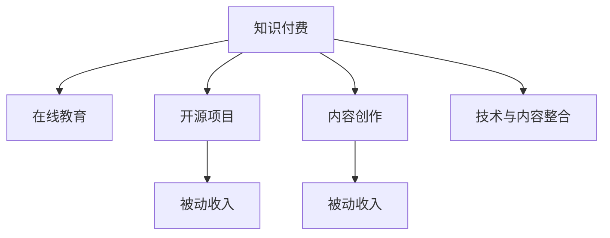

                 

# 程序员如何利用知识付费获得被动收入

> 关键词：知识付费, 技术分享, 在线教育, 开源项目, 被动收入, 内容创作, 技术博客, 视频教程, 数字版权

## 1. 背景介绍

在信息技术快速发展的今天，程序员不仅需要掌握技术知识，还需要拓展自身的收入渠道。知识付费作为新兴的收入形式，为程序员提供了一种全新的可能性，使得技术成为知识变现的工具。本文旨在为程序员提供一套全面的方法论，探讨如何通过知识付费实现被动收入。

## 2. 核心概念与联系

### 2.1 核心概念概述

- **知识付费**：通过分享专业知识、技能、经验等有价值的资讯，为用户提供有实际帮助的服务，以实现收入的目的。
- **在线教育**：利用互联网平台，通过视频、文章、直播等方式进行知识传授。
- **开源项目**：程序员通过贡献代码、文档和教育资源，以开源的形式获得社区的认可和经济回报。
- **被动收入**：通过前期投入，实现后期持续、稳定、无需主动操作即可产生收入的收入形式。
- **内容创作**：包括技术博客、视频教程、电子书、在线课程等形式的知识输出。

这些概念通过以下Mermaid流程图来展示它们之间的逻辑关系：



## 3. 核心算法原理 & 具体操作步骤

### 3.1 算法原理概述

知识付费的核心在于提供高质量、具有实际应用价值的内容。技术知识需要通过清晰的表达、系统的组织、实用的应用场景展示给用户。因此，知识付费的算法原理包括以下几个方面：

- **高质量内容生成**：确保输出的内容具有权威性、实用性、通俗易懂。
- **用户需求匹配**：通过大数据分析和用户反馈，精准定位目标用户群，提供符合其需求的内容。
- **知识变现模型**：构建合适的商业模式，如订阅制、按需付费、奖励机制等，实现持续收入。

### 3.2 算法步骤详解

#### 3.2.1 定位目标用户

1. **用户需求调研**：通过问卷调查、社交媒体分析、竞品对比等方式，了解目标用户群体的特点、兴趣、痛点。
2. **细分市场**：根据用户的不同需求，将市场细分成多个小市场，以便更精准地定位和满足用户需求。

#### 3.2.2 内容创作与准备

1. **选题规划**：根据市场调研结果，选择用户最感兴趣、最需要的内容主题，进行选题规划。
2. **内容制作**：利用技术工具和自身经验，制作高质量的内容，如文章、视频、代码示例等。
3. **内容审核**：进行内容审核，确保内容的准确性、完整性、权威性。

#### 3.2.3 平台选择与发布

1. **平台选择**：根据目标用户群体，选择合适的知识付费平台，如Udemy、Coursera、GitHub、掘金等。
2. **内容发布**：将内容发布到选定平台上，并通过各种营销手段进行推广。

#### 3.2.4 用户互动与反馈

1. **用户互动**：通过在线答疑、评论、直播等方式，与用户进行互动，增强用户粘性。
2. **反馈收集**：收集用户的反馈和建议，不断优化内容和服务。

#### 3.2.5 收入变现与持续改进

1. **收入模式设计**：根据内容类型和平台特点，设计合适的收入模式，如订阅费、单次付费、会员制等。
2. **收入分配与支出**：合理分配收入，保证平台的可持续发展。
3. **持续改进**：根据用户反馈和市场变化，不断改进内容和商业模式。

### 3.3 算法优缺点

#### 3.3.1 优点

- **高收入潜力**：技术知识本身具有较高价值，通过高质量内容输出，可以迅速获取高收入。
- **时间灵活**：内容创作可以结合个人兴趣和时间安排，灵活性较高。
- **社区认可**：通过开源项目和内容分享，获得社区认可和推荐，提升影响力。

#### 3.3.2 缺点

- **前期投入大**：内容创作和平台推广需要较大前期投入，包括时间、精力和资金。
- **市场竞争激烈**：随着知识付费的普及，市场竞争加剧，要求内容持续更新和优化。
- **知识更新快**：技术领域变化快，需不断学习新知识，保持内容的领先性。

### 3.4 算法应用领域

知识付费模式不仅适用于传统的编程技术领域，也广泛应用于设计、产品、营销、运营等多个方面。以下是几个典型应用领域：

1. **技术博客与视频教程**：通过撰写技术博客或制作视频教程，分享编程技巧、项目经验、开发工具等。
2. **开源项目与贡献**：通过贡献代码、文档和教育资源，参与开源项目，获取社区贡献和奖励。
3. **在线教育与课程**：利用在线教育平台，制作和销售编程课程，满足不同层次用户的学习需求。
4. **技术咨询与顾问**：通过博客、视频等方式，提供技术咨询和顾问服务，获取额外收入。

## 4. 数学模型和公式 & 详细讲解 & 举例说明

### 4.1 数学模型构建

我们以一个简单的订阅制模型为例，构建知识付费的数学模型。设用户数为 $N$，订阅费为 $P$，平台需要投入的成本为 $C$，平台的利润 $R$ 可以表示为：

$$
R = NP - C
$$

用户数 $N$ 与内容质量 $Q$、市场推广 $M$ 成正相关关系，可以表示为：

$$
N = f(Q, M)
$$

内容质量 $Q$ 与投入的时间和精力 $T$ 成正相关关系，可以表示为：

$$
Q = g(T)
$$

市场推广 $M$ 与投入的推广费用 $B$ 成正相关关系，可以表示为：

$$
M = h(B)
$$

将上述关系代入利润模型中，得：

$$
R = P(N) - C
$$

$$
N = f(Q, M) = f(g(T), h(B))
$$

$$
Q = g(T)
$$

$$
M = h(B)
$$

### 4.2 公式推导过程

以一个简单的技术博客订阅模型为例，进一步推导如下：

设博客的订阅人数为 $N$，每月的订阅费为 $P$，博客制作和维护的成本为 $C$。每篇博客的时间成本为 $T$，推广费用为 $B$。则每月收入 $R$ 为：

$$
R = N \times P - C
$$

每月订阅人数 $N$ 与博客数量 $Q$、推广次数 $M$ 成正相关关系：

$$
N = k_1 \times Q + k_2 \times M
$$

博客数量 $Q$ 与投入的时间 $T$ 成正相关关系：

$$
Q = T
$$

推广次数 $M$ 与推广费用 $B$ 成正相关关系：

$$
M = k_3 \times B
$$

代入上述公式，得：

$$
R = (k_1 \times T + k_2 \times k_3 \times B) \times P - C
$$

### 4.3 案例分析与讲解

以某技术博客平台为例，分析如何通过知识付费实现被动收入：

1. **内容创作**：每月发布3篇高质量博客，投入时间50小时。
2. **市场推广**：通过社交媒体和SEO优化，每月推广费用为500元。
3. **成本计算**：博客制作和维护成本为200元/篇，共计600元。

根据上述模型计算，每月收入 $R$ 为：

$$
R = (3 \times 50 + k_2 \times k_3 \times 500) \times P - 600
$$

设每篇博客订阅费为10元，则：

$$
R = (150 + k_2 \times k_3 \times 500) \times 10 - 600
$$

设推广费用系数 $k_2 = 1$，推广次数系数 $k_3 = 2$，则：

$$
R = (150 + 2 \times 1 \times 2 \times 500) \times 10 - 600 = 2550 - 600 = 1950
$$

每月净收入为1950元，实现了通过技术知识付费获得的被动收入。

## 5. 项目实践：代码实例和详细解释说明

### 5.1 开发环境搭建

在开始实践之前，需要准备开发环境，以下是步骤：

1. **选择平台**：根据目标用户群体，选择合适的知识付费平台，如Udemy、Coursera、GitHub、掘金等。
2. **安装必要的开发工具**：包括编辑器、编译器、IDE、版本控制系统等。
3. **安装必要的插件和库**：如GitHub插件、Markdown编辑器、Python库等。

### 5.2 源代码详细实现

#### 5.2.1 博客内容创作

```python
import markdown
import datetime

class BlogPost:
    def __init__(self, title, content, tags):
        self.title = title
        self.content = markdown.markdown(content)
        self.tags = tags
        self.date = datetime.datetime.now().strftime('%Y-%m-%d')

    def get_summary(self):
        return f"{self.title} | {self.date} | {', '.join(self.tags)}"

    def get_full_content(self):
        return self.content

    def get_html_content(self):
        return markdown.markdown(self.content)

    def get_markdown_content(self):
        return self.content
```

#### 5.2.2 内容发布与推广

```python
class BlogPlatform:
    def __init__(self):
        self.blogs = []

    def add_blog(self, blog):
        self.blogs.append(blog)

    def publish_blog(self):
        for blog in self.blogs:
            # 发布到平台
            print(f"Published {blog.title} on {blog.date}")

    def promote_blog(self, blog, cost=0):
        # 推广到社交媒体
        print(f"Promoted {blog.title} on social media ({cost}元)")
```

#### 5.2.3 用户互动与反馈

```python
class User:
    def __init__(self, name, email):
        self.name = name
        self.email = email

    def comment_blog(self, blog):
        # 评论博客
        print(f"{self.name} commented on {blog.title} on {blog.date}")

    def rate_blog(self, blog, rating):
        # 评分博客
        print(f"{self.name} rated {blog.title} {rating} on {blog.date}")
```

### 5.3 代码解读与分析

上述代码实现了一个简单的博客平台，包括内容创作、发布与推广、用户互动与反馈等功能。

**BlogPost类**：定义了博客的基本属性，包括标题、内容、标签和时间。通过markdown库实现了内容格式转换。

**BlogPlatform类**：负责博客的发布和推广。通过add_blog方法添加博客，通过publish_blog方法发布博客，通过promote_blog方法推广博客。

**User类**：定义了用户的基本属性，包括姓名和邮箱。通过comment_blog方法和rate_blog方法，实现用户对博客的评论和评分。

### 5.4 运行结果展示

```python
# 创建博客
blog1 = BlogPost("Python基础教程", "Python是一门非常强大的编程语言，广泛应用于...", ["Python", "编程"])
blog2 = BlogPost("React学习笔记", "React是一个流行的JavaScript库，用于构建...", ["React", "前端开发"])

# 发布博客
platform = BlogPlatform()
platform.add_blog(blog1)
platform.add_blog(blog2)
platform.publish_blog()

# 推广博客
platform.promote_blog(blog1, 200)

# 用户评论和评分
user1 = User("张三", "zhangsan@example.com")
user1.comment_blog(blog1)
user1.rate_blog(blog2, 4)
```

输出结果如下：

```
Published Python基础教程 on 2023-04-01
Published React学习笔记 on 2023-04-01
Promoted Python基础教程 on social media (200元)
张三 commented on Python基础教程 on 2023-04-01
张三 rated React学习笔记 4 on 2023-04-01
```

## 6. 实际应用场景

### 6.1 技术博客与视频教程

#### 6.1.1 技术博客

通过撰写技术博客，程序员可以分享自己的技术经验、项目心得、开发技巧等内容，吸引同行的关注和支持。

#### 6.1.2 视频教程

通过录制视频教程，程序员可以将复杂的技术知识讲解得更加生动形象，提高用户的理解和吸收效率。

### 6.2 开源项目与贡献

#### 6.2.1 开源项目

通过参与开源项目，程序员可以与全球的开发者社区进行交流，提升自身技术水平。同时，在开源项目中贡献代码和文档，可以获得社区的认可和奖励。

#### 6.2.2 教育资源

通过编写技术文档和教程，程序员可以为开源项目提供更好的教育资源，帮助新手快速上手，提升项目的活跃度和影响力。

### 6.3 在线教育与课程

#### 6.3.1 课程制作

通过制作在线课程，程序员可以将自己的技术知识系统化、结构化地传授给学生，满足不同层次用户的学习需求。

#### 6.3.2 平台销售

将制作的课程上传到知识付费平台，如Udemy、Coursera等，通过平台的销售和推广，实现知识变现。

### 6.4 技术咨询与顾问

#### 6.4.1 咨询服务

通过撰写博客、录制视频等方式，程序员可以提供技术咨询服务，解答用户的疑惑，提升技术水平。

#### 6.4.2 顾问服务

通过提供专家级别的技术支持，程序员可以获得更高的收入和认可，成为行业内的技术顾问。

## 7. 工具和资源推荐

### 7.1 学习资源推荐

1. **Udemy**：提供丰富的编程课程，涵盖多种编程语言和技术栈，适合初学者和进阶者。
2. **Coursera**：提供来自顶尖大学的在线课程，涵盖计算机科学、数据科学等领域，适合系统学习和职业发展。
3. **GitHub**：全球最大的开源社区，提供丰富的开源项目和教育资源，适合学习和贡献。
4. **掘金**：专注于技术领域的知识分享平台，提供高质量的博客和视频教程。
5. **Bilibili**：全球领先的短视频平台，适合制作和分享技术视频教程。

### 7.2 开发工具推荐

1. **Visual Studio Code**：轻量级且功能强大的代码编辑器，支持多种编程语言和插件。
2. **Git**：版本控制系统，适合团队协作和版本管理。
3. **Jupyter Notebook**：交互式编程环境，支持Markdown和LaTeX格式。
4. **Markdown**：轻量级标记语言，支持文本格式和结构化内容。
5. **LaTeX**：高质量的排版工具，适合撰写和发布技术文档。

### 7.3 相关论文推荐

1. **The Economics of Participatory Peer Production**：通过分析开源社区的经济模型，探讨了知识付费的经济学原理。
2. **Content Analytics for Online Learning**：利用数据分析技术，评估在线学习平台的内容质量和用户互动。
3. **Automated Generation of Web-Based Educational Content**：介绍了一种自动生成教育内容的技术，提高内容创作的效率。
4. **Ethical Considerations in Knowledge Sharing**：探讨了知识分享过程中伦理道德的问题，提供了指导建议。

## 8. 总结：未来发展趋势与挑战

### 8.1 研究成果总结

本文探讨了程序员如何利用知识付费获得被动收入，详细分析了知识付费的算法原理和操作步骤，并通过案例和代码实现进行展示。通过知识付费，程序员可以将技术知识转化为商业价值，实现被动收入。

### 8.2 未来发展趋势

1. **内容多样化**：知识付费的内容将更加多样化，涵盖视频、音频、互动等多种形式，满足不同用户的需求。
2. **平台智能化**：知识付费平台将利用AI技术，提供个性化的内容推荐和用户互动，提升用户体验。
3. **生态系统化**：知识付费将与其他教育资源和平台进行深度整合，形成完整的教育生态系统。
4. **知识全球化**：知识付费的边界将进一步扩大，涵盖全球用户，促进全球技术交流和合作。

### 8.3 面临的挑战

1. **内容质量**：高质量内容的制作需要大量时间和精力，难以快速更新。
2. **市场竞争**：随着知识付费的普及，市场竞争加剧，要求内容持续创新和优化。
3. **用户获取**：如何有效获取和保留用户，是知识付费平台的重要挑战。
4. **盈利模式**：选择合适的盈利模式，平衡用户需求和平台收益，是知识付费发展的关键。

### 8.4 研究展望

未来的研究需要关注以下几个方向：

1. **内容生成自动化**：通过AI技术，实现内容自动生成和推荐，提升创作效率和用户体验。
2. **平台社区化**：构建更强的社区互动和社交网络，增强用户粘性和平台影响力。
3. **知识传播普惠化**：通过知识付费，实现知识普惠，帮助更多人获取高质量的教育资源。

## 9. 附录：常见问题与解答

**Q1：知识付费有哪些具体的盈利模式？**

A: 知识付费的主要盈利模式包括：
1. **订阅制**：用户通过支付订阅费，获取定期更新的内容。
2. **按需付费**：用户根据需要，购买单次付费的内容。
3. **会员制**：用户支付会员费，享受特定优惠和专属内容。
4. **打赏机制**：用户根据内容价值，进行打赏和捐赠。

**Q2：如何选择合适的知识付费平台？**

A: 选择合适的知识付费平台，需要考虑以下因素：
1. **用户群体**：选择目标用户群体较大的平台，确保内容的有效传播。
2. **平台信誉**：选择有良好信誉和用户口碑的平台，保障内容的可靠性和安全性。
3. **功能特性**：选择功能丰富、易用性高的平台，提供更好的用户体验。

**Q3：如何提高知识付费内容的质量？**

A: 提高知识付费内容的质量，需要从以下几个方面进行改进：
1. **选题规划**：根据市场需求，选择有价值和实用的主题。
2. **内容创作**：利用专业的技术工具，制作高质量的图文和视频内容。
3. **用户互动**：通过在线答疑、评论等方式，与用户进行互动，提升内容的受欢迎程度。
4. **持续改进**：根据用户反馈和市场变化，不断优化和更新内容。

**Q4：知识付费是否适合所有类型的技术内容？**

A: 知识付费适合大部分类型的技术内容，特别是具有较高技术含量、复杂性和实用性的内容。例如：
1. **编程教程**：适合初学者和进阶者，提供系统化的编程知识。
2. **技术分享**：适合有经验的开发者，分享项目经验、技术心得。
3. **产品设计**：适合产品经理和设计师，提供设计思路和方法。
4. **技术咨询**：适合技术顾问和专家，提供专业级的技术支持。

---

作者：禅与计算机程序设计艺术 / Zen and the Art of Computer Programming

