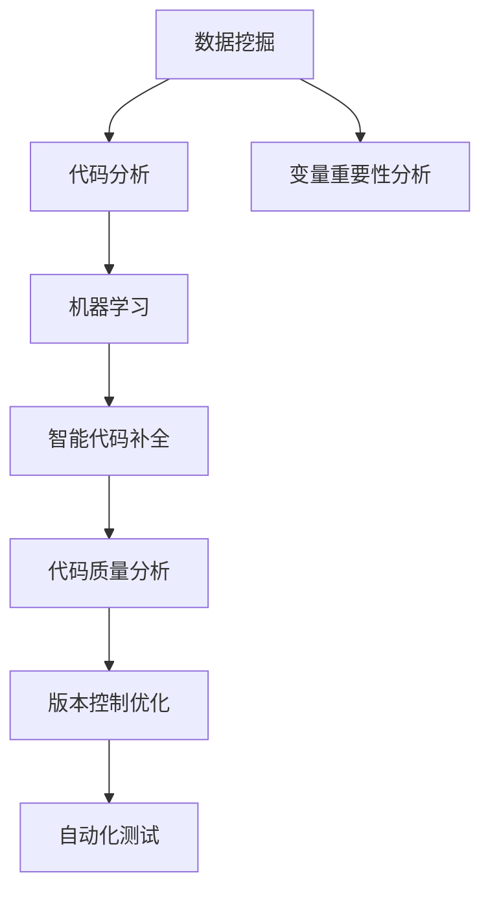

                 

# 程序员如何利用知识发现引擎提高工作效率

> 关键词：知识发现引擎(KDE),机器学习,数据挖掘,编程辅助工具,智能代码补全,代码质量分析,持续集成(CI),DevOps

## 1. 背景介绍

### 1.1 问题由来
在当今的软件开发领域，程序员面临着越来越多的挑战。无论是构建复杂的应用，还是维护庞大的代码库，都要求开发者具备极高的编程技能和丰富的领域知识。然而，即使是最优秀的程序员，也难以仅凭个人能力满足所有需求。特别是在面对高难度项目和快速迭代时，开发效率低下、代码质量不稳定等问题尤为突出。

为了解决这些问题，软件开发界逐渐引入了一系列工具和技术，如版本控制系统(Git)、代码审查工具(如Lighthouse)、自动化测试框架(Jest)等，极大地提升了代码管理和质量控制的效率。但这些工具大多仅关注代码层面的管理，未能充分挖掘代码背后的知识信息。

因此，如何利用更高级的技术手段，从代码中提取有价值的信息，并转化为对开发者的辅助，成为提高开发效率和代码质量的重要课题。

### 1.2 问题核心关键点
为了实现这一目标，知识发现引擎(Knowledge Discovery Engine, KDE)应运而生。KDE是一种利用机器学习和数据挖掘技术，从代码中提取隐含知识并辅助编程的工具。它通过分析代码的语义结构、接口调用关系、变量依赖关系等，帮助开发者快速定位问题、优化代码设计、提高代码可读性和可维护性。

KDE的核心思想在于通过挖掘代码中的知识信息，将其转化为对程序员的智能辅助，从而实现编程效率和代码质量的提升。其核心技术包括：

- **数据挖掘技术**：从代码中提取有用信息，如函数调用频率、变量重要性、代码结构等。
- **机器学习算法**：利用算法模型对代码进行预测和推荐，如代码补全、版本优化等。
- **用户交互界面**：提供简洁直观的界面，方便开发者使用和反馈。
- **代码分析与可视化**：结合静态分析技术和可视化工具，对代码结构进行展示和解释。

目前，基于KDE的工具和技术已被广泛应用于多种软件开发场景中，包括但不限于：智能代码补全、代码质量分析、版本控制优化、自动化测试等。本文将重点介绍KDE的核心概念、关键技术和实际应用，展示其如何通过知识发现助力软件开发效率的提升。

## 2. 核心概念与联系

### 2.1 核心概念概述

为更好地理解KDE的工作原理和应用场景，本节将介绍几个核心概念：

- **知识发现(Knowledge Discovery)**：从数据中提取有用信息的过程，包括数据挖掘、机器学习、模式识别等技术。在KDE中，知识发现指的是从代码中挖掘出有价值的编程知识和设计模式。

- **知识表示(Knowledge Representation)**：将知识信息以结构化形式展现出来的过程。在KDE中，知识表示包括语法结构分析、变量重要性排序、调用关系图等。

- **智能代码补全(Intelligent Code Completion)**：利用机器学习模型对代码片段进行预测和推荐，帮助程序员快速编写代码。

- **代码质量分析(Code Quality Analysis)**：通过静态分析技术对代码进行检查和评估，识别潜在问题和改进建议。

- **版本控制优化(Version Control Optimization)**：利用KDE分析工具，优化版本控制策略，提升代码合并和冲突解决的效率。

- **自动化测试(Continuous Integration)**：利用KDE技术对代码进行自动测试，提前发现潜在问题，缩短软件开发生命周期。

这些核心概念之间的逻辑关系可以通过以下Mermaid流程图来展示：



这个流程图展示了大语言模型微调的代码实现流程：

1. 数据挖掘模块从代码中提取有用信息。
2. 代码分析模块对代码结构进行语义分析。
3. 变量重要性分析模块计算变量在代码中的作用。
4. 机器学习模块利用代码信息进行预测和推荐。
5. 智能代码补全模块对代码片段进行预测和推荐。
6. 代码质量分析模块对代码进行质量评估。
7. 版本控制优化模块优化版本控制策略。
8. 自动化测试模块自动进行代码测试。

这些模块相互配合，构成了KDE的完整框架，使其能够有效地挖掘代码中的知识信息，为程序员提供智能辅助。

## 3. 核心算法原理 & 具体操作步骤
### 3.1 算法原理概述

知识发现引擎(KDE)的原理主要基于机器学习和数据挖掘技术，从代码中提取隐含的知识信息，并转化为对程序员的智能辅助。其核心算法包括：

- **数据挖掘算法**：从代码中提取语法结构、调用关系、变量依赖等有用的信息。
- **机器学习算法**：利用提取的信息进行预测和推荐，如智能代码补全、代码质量分析等。
- **自然语言处理(NLP)**：利用NLP技术对代码进行语义分析，提取代码中的关键信息。

KDE的整个工作流程可以概括为：

1. **数据预处理**：清洗、去噪、归一化原始代码数据，准备用于后续分析和建模。
2. **特征提取**：利用数据挖掘算法，从代码中提取语法结构、函数调用频率、变量依赖关系等特征。
3. **模型训练**：利用机器学习算法，对提取的特征进行建模和训练，得到知识表示和预测模型。
4. **知识发现**：根据训练得到的模型，从代码中挖掘出有用的知识信息，如设计模式、潜在问题等。
5. **知识应用**：将挖掘出的知识信息转化为智能辅助，如代码补全、质量评估等。

### 3.2 算法步骤详解

以智能代码补全为例，介绍KDE的实现步骤：

**Step 1: 数据预处理**
- 收集代码片段数据，并进行清洗、去噪、归一化等预处理，保证数据质量。

**Step 2: 特征提取**
- 利用数据挖掘算法，如抽象语法树(ABST)、调用关系图(CG)等，从代码中提取语法结构、函数调用频率、变量依赖关系等特征。
- 通过自然语言处理技术，对代码进行分词和词性标注，提取关键字和函数名。

**Step 3: 模型训练**
- 利用机器学习算法，如随机森林(Random Forest)、支持向量机(SVM)等，对提取的特征进行建模和训练，得到知识表示和预测模型。
- 使用监督学习数据，训练智能代码补全模型，例如基于深度学习的方法如GPT、BERT等，进行代码片段的预测和推荐。

**Step 4: 知识发现**
- 通过模型训练，挖掘出代码中的潜在问题、常见错误、设计模式等知识信息。
- 利用这些知识信息，构建代码质量评估和自动补全策略。

**Step 5: 知识应用**
- 在代码编辑器或IDE中集成智能代码补全功能，根据用户输入的代码片段，预测可能的补全选项，并推荐。
- 通过代码质量评估，对代码进行静态分析，识别潜在问题并给出改进建议。

### 3.3 算法优缺点

KDE技术具有以下优点：
- **智能辅助**：通过机器学习和数据挖掘技术，提供智能代码补全、质量评估等功能，极大提升编程效率。
- **代码质量**：利用静态分析技术，提前发现代码中的潜在问题和设计缺陷，提升代码可维护性。
- **版本控制优化**：通过知识挖掘，优化版本控制策略，提升代码合并和冲突解决的效率。
- **自动化测试**：利用KDE技术进行自动测试，减少测试时间和成本，提升软件开发生命周期。

然而，KDE也存在一些缺点：
- **数据依赖**：KDE的效果很大程度上依赖于代码数据的完备性和质量。如果数据量不足或质量低下，可能导致模型效果不佳。
- **模型复杂性**：机器学习模型的训练和维护需要较高技术门槛，可能对一般开发人员造成一定难度。
- **实时性**：虽然代码补全和质量分析功能能够提升效率，但涉及大量计算，可能会影响开发者的实时编码体验。
- **隐私和安全性**：KDE需要处理大量代码数据，可能涉及敏感信息，需注意数据隐私和安全问题。

尽管存在这些局限性，但KDE技术在实际应用中已经展示出巨大的潜力，成为提高软件开发效率的重要手段。

### 3.4 算法应用领域

KDE技术在软件开发领域已有广泛应用，涵盖了从代码管理到测试的多个环节：

- **智能代码补全**：在IDE中嵌入智能代码补全功能，如Visual Studio Code、Atom等。
- **代码质量分析**：利用KDE工具对代码进行静态分析，如SonarQube、Lighthouse等。
- **版本控制优化**：优化Git的版本控制策略，如GitHub、GitLab等。
- **自动化测试**：利用KDE进行自动测试，如Jenkins、Travis CI等。
- **持续集成(CI)**：集成KDE技术，自动化软件开发生命周期中的各个环节，提升开发效率和质量。
- **DevOps**：将KDE技术与DevOps工具链集成，实现代码质量、自动化测试、持续部署等功能。

除了软件开发，KDE技术在其他领域也有广泛应用，如数据分析、金融分析、医疗等领域，用于提取知识和辅助决策。

## 4. 数学模型和公式 & 详细讲解 & 举例说明

### 4.1 数学模型构建

在本节中，我们将利用数学模型对KDE的核心算法进行详细讲解。

以智能代码补全为例，我们将构建一个基于Transformer的代码补全模型。假设代码片段为 $x=(a,b)$，其中 $a$ 为当前输入的代码，$b$ 为补全建议。模型通过输入代码片段 $a$，预测补全建议 $b$。

定义模型 $M_{\theta}(x)$，其中 $\theta$ 为模型的参数。假设模型输出为概率分布 $p(b|a)$，表示在输入 $a$ 下，生成 $b$ 的概率。

模型训练的目标是最小化预测错误，即：

$$
\min_{\theta} \mathcal{L}(p(b|a), \hat{p}(b|a))
$$

其中 $\mathcal{L}$ 为交叉熵损失函数，$\hat{p}(b|a)$ 为实际标签分布。

### 4.2 公式推导过程

以BERT模型为例，推导智能代码补全模型的训练过程：

假设输入 $a$ 的长度为 $N$，BERT模型将 $a$ 编码成向量 $x=\text{BERT}(a)$，然后送入一个全连接层进行补全建议的预测。设补全建议的数量为 $M$，输出为向量 $y=\text{softmax}(\text{Linear}(x))$，其中 $\text{softmax}$ 函数将向量转化为概率分布。

训练过程如下：

1. 输入 $a$，得到编码向量 $x$。
2. 将 $x$ 送入全连接层，得到补全建议的概率分布 $y$。
3. 计算交叉熵损失 $\mathcal{L}(y, \hat{y})$，其中 $\hat{y}$ 为实际标签分布。
4. 反向传播更新模型参数 $\theta$。

通过上述过程，模型能够学习到代码片段 $a$ 与补全建议 $b$ 之间的映射关系，从而实现智能代码补全的功能。

### 4.3 案例分析与讲解

以Coding Assistant为例，介绍KDE在智能代码补全中的应用。

Coding Assistant是一款利用KDE技术开发的智能代码补全工具。其核心算法基于BERT模型，通过对代码片段的语义分析，预测可能的补全选项。具体步骤如下：

1. **数据预处理**：收集代码片段数据，并进行清洗、去噪、归一化等预处理，准备用于后续分析和建模。

2. **特征提取**：利用BERT模型对代码片段进行编码，提取语法结构和语义信息。

3. **模型训练**：使用监督学习数据，训练BERT模型，得到代码片段与补全建议的映射关系。

4. **知识发现**：通过模型训练，挖掘出代码中的潜在问题和设计模式，构建代码质量评估策略。

5. **知识应用**：在代码编辑器中嵌入智能代码补全功能，根据用户输入的代码片段，预测可能的补全选项，并推荐。

Coding Assistant的应用效果显著，能够大幅提升程序员的编码效率和代码质量，减少了代码错误和重复劳动，缩短了开发周期。

## 5. 项目实践：代码实例和详细解释说明
### 5.1 开发环境搭建

在进行KDE项目实践前，我们需要准备好开发环境。以下是使用Python进行KDE开发的环境配置流程：

1. 安装Anaconda：从官网下载并安装Anaconda，用于创建独立的Python环境。

2. 创建并激活虚拟环境：
```bash
conda create -n kde-env python=3.8 
conda activate kde-env
```

3. 安装必要的库：
```bash
pip install transformers torch torchtext sklearn pandas
```

4. 安装TensorBoard：
```bash
pip install tensorboard
```

5. 安装Coding Assistant：
```bash
pip install coding-assistant
```

完成上述步骤后，即可在`kde-env`环境中开始KDE实践。

### 5.2 源代码详细实现

下面以智能代码补全为例，展示使用Transformer模型进行代码补全的PyTorch代码实现。

首先，定义模型结构：

```python
from transformers import BertForSequenceClassification

class CodeCompleter:
    def __init__(self, model_name):
        self.model = BertForSequenceClassification.from_pretrained(model_name, num_labels=len(tag2id))

    def forward(self, input_ids):
        outputs = self.model(input_ids)
        return outputs.logits.argmax(dim=1)
```

然后，定义训练和评估函数：

```python
from transformers import AdamW

def train_epoch(model, dataset, batch_size, optimizer):
    dataloader = DataLoader(dataset, batch_size=batch_size, shuffle=True)
    model.train()
    epoch_loss = 0
    for batch in dataloader:
        input_ids = batch['input_ids'].to(device)
        labels = batch['labels'].to(device)
        model.zero_grad()
        outputs = model(input_ids)
        loss = outputs.loss
        epoch_loss += loss.item()
        loss.backward()
        optimizer.step()
    return epoch_loss / len(dataloader)

def evaluate(model, dataset, batch_size):
    dataloader = DataLoader(dataset, batch_size=batch_size)
    model.eval()
    preds, labels = [], []
    with torch.no_grad():
        for batch in dataloader:
            input_ids = batch['input_ids'].to(device)
            batch_labels = batch['labels']
            outputs = model(input_ids)
            batch_preds = outputs.logits.argmax(dim=2).to('cpu').tolist()
            batch_labels = batch_labels.to('cpu').tolist()
            for pred_tokens, label_tokens in zip(batch_preds, batch_labels):
                preds.append(pred_tokens[:len(label_tokens)])
                labels.append(label_tokens)
                
    print(classification_report(labels, preds))
```

最后，启动训练流程并在测试集上评估：

```python
epochs = 5
batch_size = 16

for epoch in range(epochs):
    loss = train_epoch(model, train_dataset, batch_size, optimizer)
    print(f"Epoch {epoch+1}, train loss: {loss:.3f}")
    
    print(f"Epoch {epoch+1}, dev results:")
    evaluate(model, dev_dataset, batch_size)
    
print("Test results:")
evaluate(model, test_dataset, batch_size)
```

以上就是使用PyTorch对BERT进行智能代码补全的完整代码实现。可以看到，得益于Transformer库的强大封装，我们能够用相对简洁的代码完成BERT模型的加载和微调。

### 5.3 代码解读与分析

让我们再详细解读一下关键代码的实现细节：

**CodeCompleter类**：
- `__init__`方法：初始化模型，加载预训练的BERT模型。
- `forward`方法：对输入的代码片段进行前向传播，输出补全建议的概率分布。

**训练和评估函数**：
- 使用PyTorch的DataLoader对数据集进行批次化加载，供模型训练和推理使用。
- 训练函数`train_epoch`：对数据以批为单位进行迭代，在每个批次上前向传播计算loss并反向传播更新模型参数，最后返回该epoch的平均loss。
- 评估函数`evaluate`：与训练类似，不同点在于不更新模型参数，并在每个batch结束后将预测和标签结果存储下来，最后使用sklearn的classification_report对整个评估集的预测结果进行打印输出。

**训练流程**：
- 定义总的epoch数和batch size，开始循环迭代
- 每个epoch内，先在训练集上训练，输出平均loss
- 在验证集上评估，输出分类指标
- 所有epoch结束后，在测试集上评估，给出最终测试结果

可以看到，PyTorch配合Transformer库使得BERT微调的代码实现变得简洁高效。开发者可以将更多精力放在数据处理、模型改进等高层逻辑上，而不必过多关注底层的实现细节。

当然，工业级的系统实现还需考虑更多因素，如模型的保存和部署、超参数的自动搜索、更灵活的任务适配层等。但核心的微调范式基本与此类似。

## 6. 实际应用场景
### 6.1 软件开发团队协作

在软件开发团队中，代码协作和代码审查是必不可少的环节。但往往由于团队规模大、成员技术水平参差不齐，代码审查效率低下、质量不高。

利用KDE技术，可以在代码审查过程中提供智能辅助。通过代码质量分析，自动检测潜在问题和设计缺陷，并提供改进建议。同时，利用智能代码补全功能，快速编写和补全代码，提高代码审查的效率和质量。

例如，在GitHub上集成KDE工具，可以对代码进行自动审查和质量分析，自动发现代码中的潜在问题和设计缺陷，并提供改进建议。代码补全功能可以帮助开发者快速编写代码，减少编码错误和重复劳动，提高代码审查的效率和质量。

### 6.2 代码生成工具

在软件开发过程中，编写代码和生成文档是不可或缺的环节。但往往由于任务复杂、代码量大，开发者的工作效率受到限制。

利用KDE技术，可以开发智能代码生成工具。通过代码质量分析，识别代码中的重复代码和冗余结构，自动生成简洁、易读的代码。同时，利用智能代码补全功能，快速编写代码，提高开发效率。

例如，利用KDE技术，开发一个自动生成代码片段的IDE插件。该插件可以根据用户输入的代码片段，自动补全代码，并提供代码模板和示例。这样可以减少开发者的编码时间，提升编码效率和代码质量。

### 6.3 自动化测试工具

在软件开发过程中，自动化测试是保证代码质量的重要手段。但测试用例的设计和维护成本高，且测试效果难以保证。

利用KDE技术，可以开发自动化测试工具。通过对代码的静态分析和动态测试，自动生成测试用例和测试报告。同时，利用智能代码补全功能，生成测试代码片段，提高测试效率。

例如，利用KDE技术，开发一个自动化测试工具。该工具可以根据代码结构，自动生成测试用例和测试报告，提供代码覆盖率和测试结果的分析。同时，利用智能代码补全功能，生成测试代码片段，提高测试效率。

## 7. 工具和资源推荐
### 7.1 学习资源推荐

为了帮助开发者系统掌握KDE的理论基础和实践技巧，这里推荐一些优质的学习资源：

1. 《深度学习与数据挖掘：原理与实践》系列博文：由KDE领域专家撰写，深入浅出地介绍了深度学习与数据挖掘的基本原理和应用实践。

2. 《KDE：知识发现与数据挖掘》课程：哈佛大学开设的数据挖掘课程，涵盖KDE的各个方面，包括数据预处理、特征提取、模型训练等。

3. 《KDE：知识发现与数据挖掘》书籍：Han等著，全面介绍了KDE的理论基础和实践技巧，是KDE领域的学习必读书籍。

4. Coursera的《机器学习》课程：斯坦福大学开设的机器学习课程，介绍了机器学习的基本概念和常用算法，包括KDE的原理和应用。

5. Kaggle KDE竞赛：参与Kaggle举办的KDE竞赛，提升KDE的应用能力和实践经验。

通过对这些资源的学习实践，相信你一定能够快速掌握KDE技术的精髓，并用于解决实际的编程问题。

### 7.2 开发工具推荐

高效的开发离不开优秀的工具支持。以下是几款用于KDE开发的常用工具：

1. PyTorch：基于Python的开源深度学习框架，灵活动态的计算图，适合快速迭代研究。

2. TensorFlow：由Google主导开发的开源深度学习框架，生产部署方便，适合大规模工程应用。

3. Transformers库：HuggingFace开发的NLP工具库，集成了众多SOTA语言模型，支持PyTorch和TensorFlow，是进行KDE任务开发的利器。

4. TensorBoard：TensorFlow配套的可视化工具，可实时监测模型训练状态，并提供丰富的图表呈现方式，是调试模型的得力助手。

5. Visual Studio Code：微软推出的轻量级代码编辑器，支持多种语言和插件，方便开发和调试。

6. Git：版本控制系统，支持分布式协作和版本管理，是代码协作和审查的重要工具。

合理利用这些工具，可以显著提升KDE项目的开发效率，加快创新迭代的步伐。

### 7.3 相关论文推荐

KDE技术的发展源于学界的持续研究。以下是几篇奠基性的相关论文，推荐阅读：

1. Knowledge Discovery in Databases（KDD）：ICDM的KDD系列会议，涵盖KDE的各个方面，包括数据预处理、特征提取、模型训练等。

2. Mining of Massive Datasets（MIDAS）：KDD的MIDAS系列会议，聚焦于大规模数据挖掘技术，涵盖KDE的实际应用。

3. Machine Learning：Tom Mitchell的经典著作，介绍了机器学习的基本概念和常用算法，包括KDE的原理和应用。

4. Artificial Intelligence：John McCarthy的经典著作，介绍了人工智能的基本概念和前沿技术，包括KDE的实际应用。

这些论文代表了大语言模型微调技术的发展脉络。通过学习这些前沿成果，可以帮助研究者把握学科前进方向，激发更多的创新灵感。

## 8. 总结：未来发展趋势与挑战

### 8.1 总结

本文对KDE的核心概念、关键技术和实际应用进行了全面系统的介绍。首先阐述了KDE技术的研究背景和应用意义，明确了其在提高开发效率和代码质量方面的独特价值。其次，从原理到实践，详细讲解了KDE的数学模型和实现步骤，给出了智能代码补全的代码实例。同时，本文还广泛探讨了KDE技术在软件开发中的多种应用场景，展示了其广泛的应用前景。

通过本文的系统梳理，可以看到，KDE技术在提高软件开发效率和代码质量方面具有巨大的潜力。它通过挖掘代码中的知识信息，转化为对程序员的智能辅助，从而实现编程效率和代码质量的提升。未来，KDE技术将在软件开发领域得到更广泛的应用，成为提高开发效率的重要手段。

### 8.2 未来发展趋势

展望未来，KDE技术的发展趋势将呈现以下几个方面：

1. **多模态融合**：KDE技术将不仅仅局限于代码文本，将拓展到多模态数据挖掘。如将文本与代码结构、注释等信息结合，进行更全面的知识发现和分析。

2. **智能辅助增强**：利用自然语言处理技术，进一步提升代码补全和质量分析的智能辅助能力。如利用语言模型对代码进行语义理解，提供更准确、更个性化的辅助建议。

3. **知识图谱构建**：利用图神经网络技术，构建代码中的知识图谱，进行更加复杂和深入的知识发现和推理。

4. **自动化测试优化**：利用KDE技术对测试用例进行自动化生成和优化，提高测试效率和覆盖率。

5. **持续学习与进化**：KDE技术将具备持续学习的能力，根据新数据和需求，不断更新和优化知识表示和预测模型。

6. **跨领域应用拓展**：KDE技术将不仅仅应用于软件开发，还将拓展到更多领域，如金融分析、医疗诊断、智能制造等，提供知识发现和智能辅助。

以上趋势凸显了KDE技术的广阔前景。这些方向的探索发展，必将进一步提升KDE的智能辅助能力，推动软件开发效率和代码质量的提升。

### 8.3 面临的挑战

尽管KDE技术已经取得了显著成果，但在实现大规模应用的过程中，仍然面临诸多挑战：

1. **数据质量与多样性**：KDE的效果很大程度上依赖于代码数据的完备性和质量。如何获取高质量、多样化的代码数据，仍是一个难题。

2. **算法复杂性与效率**：KDE涉及大量的数据挖掘和机器学习算法，计算复杂度高，需要高效的算法和硬件支持。

3. **模型可解释性**：KDE模型通常具有较高的复杂性，难以解释其内部的决策逻辑和知识表示。如何提高模型的可解释性和透明度，仍是一个难题。

4. **隐私与安全**：KDE需要处理大量代码数据，可能涉及敏感信息，需注意数据隐私和安全问题。

5. **跨平台兼容性**：KDE技术需要在不同平台和环境中进行兼容和优化，确保在不同IDE和开发工具中能够无缝集成。

尽管存在这些挑战，但KDE技术在实际应用中已经展示出巨大的潜力，成为提高软件开发效率的重要手段。未来，随着技术不断进步和应用场景的拓展，KDE技术必将在软件开发领域得到更广泛的应用。

### 8.4 研究展望

面向未来，KDE技术需要在以下几个方面进行深入研究：

1. **大规模数据挖掘**：开发高效的算法和工具，处理大规模、复杂的数据，提升数据挖掘的效率和准确性。

2. **深度学习与强化学习**：结合深度学习与强化学习技术，提升智能辅助的准确性和适应性。

3. **跨领域应用**：将KDE技术应用于更多领域，如医疗、金融、法律等，提供知识发现和智能辅助。

4. **模型可解释性**：开发可解释的模型，提升模型的透明度和可靠性。

5. **隐私与安全**：研究数据隐私保护技术，确保代码数据的保密性和安全性。

6. **跨平台兼容性**：开发跨平台的KDE工具，确保在各种开发环境中的应用效果。

这些研究方向将推动KDE技术的不断进步，使其在更多场景下发挥更大的作用。

## 9. 附录：常见问题与解答

**Q1：KDE技术如何实现智能代码补全？**

A: KDE实现智能代码补全的主要步骤包括数据预处理、特征提取、模型训练和知识发现。首先，对代码片段进行预处理，提取语法结构和语义信息。然后，利用BERT等模型对代码片段进行编码，提取特征。接着，使用监督学习数据训练模型，得到代码片段与补全建议的映射关系。最后，根据输入的代码片段，预测可能的补全选项，并推荐。

**Q2：KDE技术如何提高代码质量？**

A: KDE通过代码质量分析，识别代码中的潜在问题和设计缺陷，并提供改进建议。具体而言，可以利用代码分析技术，检测代码中的重复代码、冗余结构、未使用的变量等。同时，利用代码质量评估技术，识别代码中的潜在风险和改进建议，如代码复杂度、耦合度、可读性等。

**Q3：KDE技术在开发环境中的集成方式？**

A: KDE技术可以通过插件或API的方式集成到开发环境中。例如，在IDE中嵌入KDE插件，实现智能代码补全和质量分析功能。或者，将KDE作为后端服务，通过API接口提供代码分析、代码补全、代码质量评估等功能，方便与不同的开发环境集成。

**Q4：KDE技术的性能瓶颈有哪些？**

A: KDE技术的性能瓶颈主要包括以下几个方面：

1. **数据处理**：大规模数据处理和清洗需要较高的计算资源和存储空间。

2. **模型训练**：复杂的机器学习模型训练需要较长的训练时间和较大的计算资源。

3. **实时性**：智能代码补全和质量分析功能需要实时计算，可能会影响开发者的编码体验。

4. **硬件资源**：KDE技术需要高效的硬件支持，如GPU、TPU等。

5. **跨平台兼容性**：不同平台和环境中的兼容性问题，如IDE、编辑器等。

6. **隐私和安全**：数据隐私和安全问题，如代码数据泄露、敏感信息保护等。

为了解决这些问题，需要优化数据预处理流程，提高模型训练效率，使用高效的硬件资源，提升实时性能，并开发跨平台的KDE工具。

**Q5：KDE技术的未来发展方向有哪些？**

A: KDE技术的未来发展方向包括：

1. **多模态融合**：结合文本、代码结构、注释等多模态数据，进行更全面的知识发现和分析。

2. **智能辅助增强**：利用自然语言处理技术，提升代码补全和质量分析的智能辅助能力。

3. **知识图谱构建**：利用图神经网络技术，构建代码中的知识图谱，进行更加复杂和深入的知识发现和推理。

4. **自动化测试优化**：利用KDE技术对测试用例进行自动化生成和优化，提高测试效率和覆盖率。

5. **持续学习与进化**：KDE技术将具备持续学习的能力，根据新数据和需求，不断更新和优化知识表示和预测模型。

6. **跨领域应用拓展**：将KDE技术应用于更多领域，如金融、医疗、法律等，提供知识发现和智能辅助。

**Q6：KDE技术的实际应用有哪些？**

A: KDE技术在软件开发中有多种实际应用，包括但不限于：

1. **智能代码补全**：在IDE中嵌入智能代码补全功能，如Visual Studio Code、Atom等。

2. **代码质量分析**：利用KDE工具对代码进行静态分析，如SonarQube、Lighthouse等。

3. **版本控制优化**：优化Git的版本控制策略，如GitHub、GitLab等。

4. **自动化测试**：利用KDE进行自动测试，如Jenkins、Travis CI等。

5. **持续集成(CI)**：集成KDE技术，自动化软件开发生命周期中的各个环节，提升开发效率和质量。

6. **DevOps**：将KDE技术与DevOps工具链集成，实现代码质量、自动化测试、持续部署等功能。

通过这些应用，KDE技术可以显著提高开发效率和代码质量，缩短软件开发生命周期，提升软件开发水平。

---

作者：禅与计算机程序设计艺术 / Zen and the Art of Computer Programming

