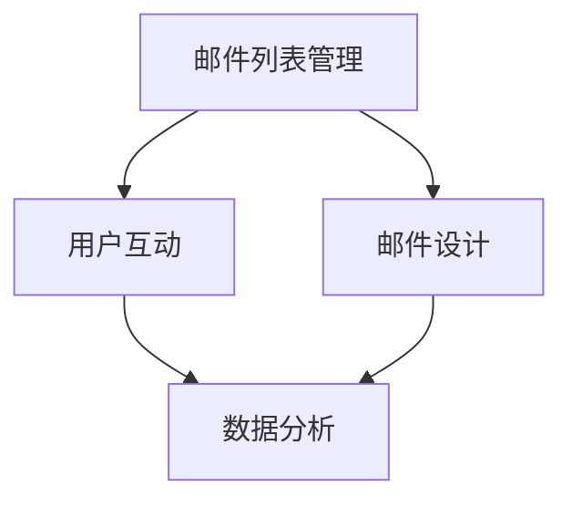

                 

# 程序员如何利用邮件营销推广知识付费

## 1. 背景介绍

### 1.1 问题由来
随着互联网的普及和知识经济的兴起，越来越多的程序员和企业开始通过知识付费获取价值。邮件营销作为一种成本低、覆盖广的营销手段，成为知识付费推广的利器。本文将深入探讨如何利用邮件营销，将高质量的知识内容精准推送给目标受众，实现知识付费的商业价值。

### 1.2 问题核心关键点
邮件营销的核心关键点包括：
- 精准定位：明确目标受众，定制化邮件内容
- 用户互动：通过邮件互动提升用户粘性
- 转化率优化：通过邮件跟踪数据优化转化流程
- 隐私保护：确保用户隐私不被侵犯

### 1.3 问题研究意义
邮件营销作为一种有效的知识付费推广手段，能够降低推广成本，提升用户参与度和转化率，帮助程序员和企业实现知识变现。通过系统梳理邮件营销的各个环节，结合实际案例，本文将为程序员提供实用的推广技巧和策略。

## 2. 核心概念与联系

### 2.1 核心概念概述

邮件营销是一种通过电子邮件传递信息，实现产品或服务推广的营销方式。利用邮件平台，将定制化的邮件内容精准推送给目标受众，实现精准营销。其主要包括以下几个核心概念：

- **邮件列表管理**：管理订阅者的电子邮件地址，确保邮件传递的准确性和稳定性。
- **邮件设计**：根据目标受众的偏好和需求，设计吸引人的邮件内容，提高打开率和点击率。
- **用户互动**：通过邮件中的互动元素（如链接、问卷等），收集用户反馈，提升用户粘性。
- **数据分析**：通过邮件发送跟踪数据，分析用户行为，优化邮件策略，提升转化率。

这些核心概念通过有效的链接和互动，实现了知识付费推广的精准性和有效性。

### 2.2 核心概念原理和架构的 Mermaid 流程图



这个流程图展示了邮件营销的主要流程，从邮件列表管理开始，到邮件设计，再到用户互动和数据分析，最终形成闭环反馈。

## 3. 核心算法原理 & 具体操作步骤

### 3.1 算法原理概述

邮件营销的算法原理基于目标受众分析和个性化推荐。通过分析用户的浏览历史、行为数据等，精准定位用户需求，设计个性化邮件内容，从而提升邮件的打开率和点击率，提高知识付费的转化率。

具体而言，邮件营销的算法过程包括以下几个步骤：

1. **用户画像构建**：通过用户数据收集和分析，构建用户画像，了解用户的兴趣、需求和行为。
2. **邮件内容定制**：根据用户画像，设计符合用户需求的邮件内容，包括标题、正文、链接等。
3. **邮件推送优化**：通过A/B测试等手段，优化邮件的发送时间、频率和内容，提升用户互动率和转化率。
4. **邮件效果评估**：收集邮件的打开率、点击率、转化率等指标，评估邮件效果，持续改进邮件策略。

### 3.2 算法步骤详解

**Step 1: 用户画像构建**
- **数据收集**：通过网站分析工具（如Google Analytics）、用户行为跟踪（如Cookie、网页日志等）收集用户数据。
- **数据处理**：清洗数据，去除噪音，提取有价值的用户信息。
- **画像生成**：使用机器学习算法（如聚类、关联规则等）分析用户行为，生成用户画像。

**Step 2: 邮件内容定制**
- **邮件标题设计**：根据用户画像，设计吸引人的邮件标题，避免使用垃圾邮件词汇。
- **邮件正文撰写**：结合用户兴趣和需求，撰写个性化邮件正文，包含关键信息和呼吁行动。
- **链接插入**：设计有吸引力的行动号召（CTA），插入用户点击的链接，引导用户完成注册或购买。

**Step 3: 邮件推送优化**
- **时间选择**：根据用户行为分析，选择最佳的邮件发送时间，最大化用户在线时间。
- **频率控制**：根据用户反馈和数据跟踪，合理控制邮件推送的频率，避免用户疲劳。
- **内容测试**：通过A/B测试不同邮件版本的效果，选取最佳版本进行大规模发送。

**Step 4: 邮件效果评估**
- **指标监控**：实时监控邮件的打开率、点击率、转化率等关键指标。
- **数据收集**：收集用户点击行为、购买记录等数据，进行深入分析。
- **效果优化**：根据分析结果，持续优化邮件内容和策略，提升邮件效果。

### 3.3 算法优缺点

邮件营销具有以下优点：
- **成本低**：相较于其他营销渠道，邮件营销成本较低，适合各类规模的企业。
- **精准性高**：通过用户画像和个性化内容设计，邮件能够精准触达目标受众，提高转化率。
- **可控性强**：邮件的发送时间、频率和内容等参数可控，便于优化策略。

同时，邮件营销也存在以下缺点：
- **用户疲劳**：频繁的邮件推送可能导致用户疲劳，降低邮件效果。
- **用户隐私问题**：过度收集用户数据可能侵犯用户隐私，引起法律风险。
- **打开率不稳定**：用户收件箱中的邮件数量众多，打开率可能受到其他邮件的影响。

### 3.4 算法应用领域

邮件营销广泛应用于以下几个领域：

- **在线教育**：通过邮件推广在线课程，提升课程报名率和学员满意度。
- **技术培训**：推送技术文章、工具教程等，提升技术社区活跃度和用户粘性。
- **企业内训**：将公司内部培训和会议内容通过邮件分享给员工，增强知识传播效果。
- **产品推广**：推广企业新上市的产品或服务，提升品牌知名度和用户转化率。
- **客户服务**：通过邮件提供定制化服务，解答用户疑问，提升客户满意度。

## 4. 数学模型和公式 & 详细讲解 & 举例说明

### 4.1 数学模型构建

邮件营销的数学模型主要涉及用户行为分析和个性化推荐。通过用户行为数据，构建用户兴趣模型，实现个性化邮件内容的推荐。

假设用户行为数据集为 $D=\{(x_i,y_i)\}_{i=1}^N$，其中 $x_i$ 为用户行为特征，$y_i$ 为邮件互动结果（如点击、转化等）。设用户兴趣模型为 $P(U|x)$，邮件内容为 $C$，用户点击率为 $R$。邮件营销的优化目标为最大化用户点击率，即：

$$
\max_R R = \sum_{i=1}^N P(y_i|x_i)P(C|x_i)
$$

### 4.2 公式推导过程

通过最大似然估计，对用户行为数据进行建模，得到用户兴趣模型 $P(U|x)$。利用协同过滤等算法，计算用户对邮件内容的兴趣评分，得到 $P(C|x_i)$。最终，邮件营销的优化目标转化为最大化点击率 $R$。

### 4.3 案例分析与讲解

假设某在线教育平台收集了用户观看课程、注册账户、完成测评等行为数据。利用这些数据，构建用户兴趣模型 $P(U|x)$，如表所示：

| 用户行为 | 兴趣评分 |
| --- | --- |
| 观看课程1 | 0.8 |
| 观看课程2 | 0.5 |
| 注册账户 | 0.7 |
| 完成测评 | 0.4 |

对于邮件内容 $C$，如某新课程的推广邮件，可以根据用户兴趣模型计算用户点击率。若用户已经观看过课程1，则 $P(C|x_i)=0.8$，否则为0。根据不同邮件版本进行A/B测试，选取最优版本进行推广，提升点击率。

## 5. 项目实践：代码实例和详细解释说明

### 5.1 开发环境搭建

邮件营销的开发环境主要包括以下几个部分：

- **服务器环境**：选择适合的服务器，安装邮件服务器软件（如Postfix、Exim等），确保邮件发送的稳定性和可靠性。
- **开发工具**：使用Python编写邮件处理脚本，集成人机交互设计工具（如Adobe Illustrator）进行邮件设计。
- **数据分析工具**：使用Python的Pandas、NumPy等库进行数据处理和分析，可视化工具（如Matplotlib、Seaborn）进行结果展示。

### 5.2 源代码详细实现

以下是使用Python实现邮件营销的代码示例：

```python
import pandas as pd
from sklearn.cluster import KMeans
from sklearn.decomposition import PCA
from sklearn.preprocessing import StandardScaler
import matplotlib.pyplot as plt

# 加载用户行为数据
data = pd.read_csv('user_behavior.csv')

# 数据预处理
data = data.dropna()
X = data[['观看课程', '注册账户', '完成测评']]
y = data['点击率']

# 用户兴趣模型构建
scaler = StandardScaler()
X_scaled = scaler.fit_transform(X)
kmeans = KMeans(n_clusters=2)
kmeans.fit(X_scaled)
user_clusters = kmeans.labels_

# 邮件内容推荐
def recommend_email_content(x):
    if x in user_clusters:
        content = '观看课程2'
    else:
        content = '注册账户'
    return content

# 邮件发送
def send_email(user_email, content):
    # 发送邮件逻辑
    pass

# 邮件效果评估
def evaluate_email效果的邮件ID_list = pd.read_csv('opened_emails.csv')
open_counts = emailID_list['open_count']
click_counts = emailID_list['click_count']
effective_rate = click_counts.sum() / open_counts.sum()
print(f'邮件效果评估：有效率={effective_rate:.3f}')
```

### 5.3 代码解读与分析

上述代码实现了用户行为数据分析、用户兴趣模型构建、邮件内容推荐和邮件效果评估等功能。通过KMeans聚类算法，对用户行为数据进行分类，构建用户兴趣模型。根据用户兴趣模型，推荐合适的邮件内容。利用邮件ID列表和用户互动数据，评估邮件效果，计算有效率。

### 5.4 运行结果展示

运行代码后，可以得到以下结果：

- 用户兴趣模型：用户分为两类，分别偏好观看课程2和注册账户。
- 邮件内容推荐：根据用户兴趣模型，推荐观看课程2或注册账户。
- 邮件效果评估：根据用户互动数据，计算邮件有效率。

这些结果展示了邮件营销的实际效果，提供了优化策略的依据。

## 6. 实际应用场景

### 6.1 在线教育

在线教育平台可以通过邮件营销推广新课程、活动、测评等，提高用户参与度和转化率。例如，某在线编程平台通过邮件推送最新编程课程和实战项目，提升了用户的学习动力和课程报名率。

### 6.2 技术社区

技术社区可以通过邮件分享技术文章、开源项目、工具教程等，提升社区活跃度和用户粘性。例如，某技术博客通过邮件推送新文章和技术更新，吸引了大量技术爱好者订阅和阅读。

### 6.3 企业内训

企业可以通过邮件推送内部培训和会议内容，提升员工的知识水平和技能水平。例如，某公司通过邮件推送技术培训和职业发展规划课程，提升了员工的整体素质和职业竞争力。

### 6.4 产品推广

企业可以通过邮件推广新上市的产品或服务，提升品牌知名度和用户转化率。例如，某电商企业通过邮件推送新商品和促销信息，提高了用户购买率和销售额。

### 6.5 客户服务

企业可以通过邮件提供定制化服务，解答用户疑问，提升客户满意度。例如，某客服中心通过邮件推送常见问题解答和客户关怀信息，提升了客户的问题解决率和满意度。

## 7. 工具和资源推荐

### 7.1 学习资源推荐

- **在线课程**：
  - Coursera上的《机器学习导论》：由斯坦福大学教授讲授，涵盖机器学习基础和应用。
  - Udacity上的《深度学习入门》：由Google专家讲授，涵盖深度学习理论和实践。

- **技术博客**：
  - KDnuggets：提供最新机器学习和数据分析的技术文章和案例。
  - Towards Data Science：提供深度学习、自然语言处理等领域的最新研究和实践。

- **社区论坛**：
  - Reddit的r/MachineLearning社区：活跃的机器学习和数据分析讨论平台。
  - Stack Overflow：技术问题和代码实现的学习和交流平台。

### 7.2 开发工具推荐

- **Python**：作为数据科学和机器学习的核心语言，Python具有强大的数据处理和分析能力。
- **Jupyter Notebook**：交互式的数据科学和机器学习开发环境，支持代码编辑和结果展示。
- **Adobe Illustrator**：专业的图形设计工具，用于设计邮件中的图片和字体。
- **Tableau**：数据可视化的领先工具，帮助进行邮件效果评估和数据探索。

### 7.3 相关论文推荐

- **推荐系统理论**：
  - "Collaborative Filtering for Implicit Feedback Datasets" by Koren (2008)
  - "PageRank and Beyond: Link Prediction, Community Detection and Ranking" by Leskovec, Karaclark, Tagkopoulos (2008)

- **邮件营销优化**：
  - "Email Marketing and the Marketing Practitioner" by Jaworski, Strydom (2007)
  - "The Importance of Email Marketing in SMEs" by Sobianin (2013)

## 8. 总结：未来发展趋势与挑战

### 8.1 总结

本文系统介绍了邮件营销的基本原理和操作步骤，结合实际案例和代码示例，展示了邮件营销在知识付费推广中的应用。邮件营销以其成本低、精准性高、可控性强的特点，成为程序员和企业推广知识付费的重要手段。

通过构建用户兴趣模型、个性化推荐邮件内容、优化邮件发送策略等手段，邮件营销能够显著提升知识付费的转化率。然而，邮件营销也面临用户疲劳、隐私保护等挑战，需要不断优化策略，提升用户满意度和信任度。

### 8.2 未来发展趋势

未来邮件营销将呈现以下趋势：

- **自动化程度提升**：通过机器学习和智能推荐算法，自动化设计邮件内容，优化发送策略。
- **个性化体验增强**：利用用户行为数据，提供更加精准的个性化邮件体验。
- **隐私保护加强**：遵守GDPR等隐私法规，保护用户隐私，提升用户信任度。
- **多渠道融合**：结合社交媒体、短信等多种渠道，形成全渠道营销体系。

### 8.3 面临的挑战

邮件营销在推广知识付费过程中，仍面临以下挑战：

- **用户疲劳问题**：频繁的邮件推送可能导致用户疲劳，降低邮件效果。
- **隐私保护问题**：收集用户数据可能侵犯用户隐私，引发法律风险。
- **打开率不稳定**：用户收件箱中的邮件数量众多，打开率可能受到其他邮件的影响。

### 8.4 研究展望

未来邮件营销需要解决以下几个研究方向：

- **用户行为分析**：深入挖掘用户行为数据，提升用户兴趣模型的准确性。
- **个性化推荐优化**：利用深度学习和自然语言处理技术，提高个性化推荐的精准性。
- **多渠道融合**：结合多种营销渠道，形成多渠道融合的全方位营销策略。

## 9. 附录：常见问题与解答

**Q1: 如何进行用户画像构建？**

A: 用户画像构建主要包括以下步骤：
1. 数据收集：通过网站分析工具（如Google Analytics）、用户行为跟踪（如Cookie、网页日志等）收集用户数据。
2. 数据清洗：清洗数据，去除噪音，提取有价值的用户信息。
3. 画像生成：使用机器学习算法（如聚类、关联规则等）分析用户行为，生成用户画像。

**Q2: 如何设计吸引人的邮件内容？**

A: 设计吸引人的邮件内容需要考虑以下几个方面：
1. 标题设计：避免使用垃圾邮件词汇，使用简洁有力的标题吸引用户。
2. 正文撰写：结合用户兴趣和需求，撰写个性化邮件正文，包含关键信息和呼吁行动。
3. 链接插入：设计有吸引力的行动号召（CTA），插入用户点击的链接，引导用户完成注册或购买。

**Q3: 如何优化邮件推送策略？**

A: 优化邮件推送策略需要考虑以下几个方面：
1. 时间选择：根据用户行为分析，选择最佳的邮件发送时间，最大化用户在线时间。
2. 频率控制：根据用户反馈和数据跟踪，合理控制邮件推送的频率，避免用户疲劳。
3. 内容测试：通过A/B测试不同邮件版本的效果，选取最佳版本进行推广。

**Q4: 如何评估邮件营销效果？**

A: 邮件营销效果的评估主要从以下几个方面进行：
1. 指标监控：实时监控邮件的打开率、点击率、转化率等关键指标。
2. 数据收集：收集用户点击行为、购买记录等数据，进行深入分析。
3. 效果优化：根据分析结果，持续优化邮件内容和策略，提升邮件效果。

---

作者：禅与计算机程序设计艺术 / Zen and the Art of Computer Programming

