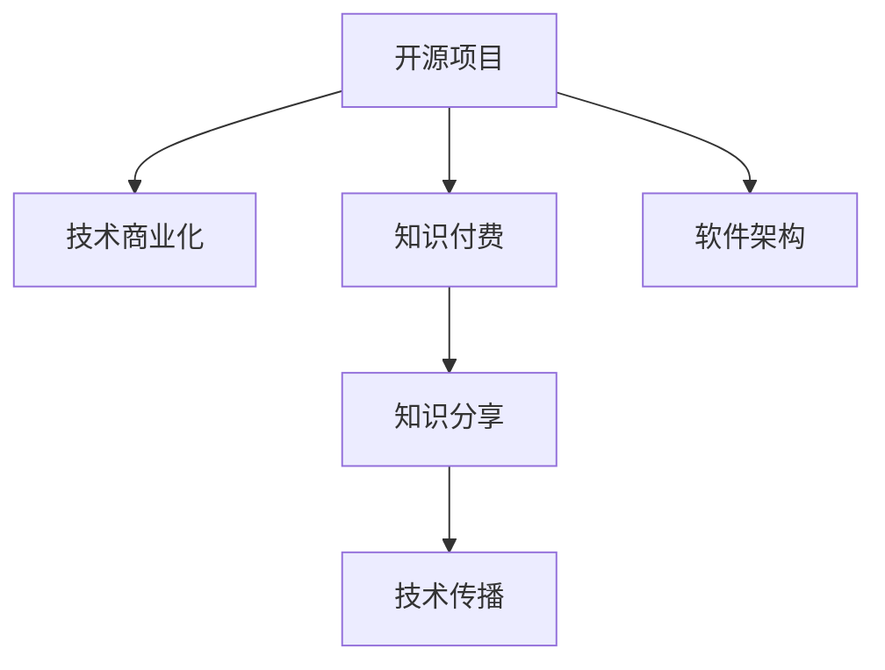

                 

# 程序员如何将开源项目转化为知识付费产品

> 关键词：开源项目, 知识付费, 技术商业化, 软件架构, 知识分享, 技术传播, 编程社区

## 1. 背景介绍

在当今互联网时代，开源社区蓬勃发展，为程序员提供了一个展示自己才华和技能的平台。然而，随着开源项目的规模和复杂性不断增加，如何将这些项目转化为具有商业价值的产品，成为了一个越来越重要的问题。特别是在开源项目的质量和成熟度逐渐提高的背景下，如何从中获取收益，为开发者和用户提供更好的服务和支持，成为了开源项目成功的关键因素之一。

知识付费，作为一种新兴的商业模式，在技术、教育、文化等多个领域都得到了广泛的应用。开源项目与知识付费的结合，不仅能够帮助开发者从项目中获得收益，还能够提升开源社区的活力和可持续发展能力。本文将探讨如何将开源项目转化为知识付费产品，以及这一过程中需要考虑的关键因素和策略。

## 2. 核心概念与联系

为了更好地理解如何将开源项目转化为知识付费产品，我们需要对相关概念有清晰的认识，并理解它们之间的联系。

### 2.1 核心概念概述

- **开源项目**：指在互联网上公开源代码的软件项目，允许任何人查看、修改、分发和使用。开源项目通常以社区驱动，由众多开发者共同贡献。

- **知识付费**：指用户为获取专业知识或服务而支付费用的模式。在知识付费的平台上，用户能够获取高价值的课程、咨询、技术文章等。

- **技术商业化**：将技术成果转化为具有市场竞争力的产品或服务，实现技术和商业价值的双赢。

- **软件架构**：设计和管理软件系统结构，包括模块划分、接口设计、数据流等，是软件开发的核心问题。

- **知识分享**：通过网络平台分享知识和技术，促进社区学习和交流。

- **技术传播**：通过各种方式将技术知识和经验传递给更广泛的用户群体，加速技术的应用和普及。

这些概念之间的逻辑关系可以通过以下Mermaid流程图来展示：



这个流程图展示了大语言模型的核心概念及其之间的关系：

1. 开源项目通过技术商业化和知识付费获取收益，提升社区活力。
2. 技术商业化需要良好的软件架构设计，确保产品的稳定性和可扩展性。
3. 知识付费和软件架构为开源项目的维护和发展提供了强有力的支持。
4. 知识分享和技术传播进一步扩大了开源项目的影响力。

## 3. 核心算法原理 & 具体操作步骤

### 3.1 算法原理概述

将开源项目转化为知识付费产品，本质上是一个需求与供给的匹配过程。核心在于找到一个平衡点，既能满足用户的需求，又能使开发者从中获得回报。这一过程可以分为以下几个关键步骤：

1. **项目选择与定位**：根据市场需求和自身的技术优势，选择合适的开源项目进行商业化。
2. **商业化策略制定**：确定商业化的目标和路径，如付费订阅、知识服务、技术咨询等。
3. **知识付费产品开发**：将开源项目的功能和服务转化为可付费的产品或服务。
4. **市场推广与销售**：通过营销手段，吸引用户购买和使用产品。
5. **反馈与优化**：根据用户反馈，不断改进产品和服务，提升用户体验。

### 3.2 算法步骤详解

#### 3.2.1 项目选择与定位

选择合适的开源项目进行商业化，是成功的第一步。以下是一些关键考量因素：

- **市场需求**：选择那些有实际需求的项目，能够解决用户痛点。
- **技术成熟度**：选择技术成熟、社区活跃、文档完善的开源项目。
- **商业可行性**：评估项目的商业模式，看是否有合理的盈利模式和增长潜力。
- **竞争分析**：了解市场上的竞争情况，避免重复建设和恶性竞争。

#### 3.2.2 商业化策略制定

商业化策略的制定需要考虑多个方面，包括但不限于：

- **定价策略**：根据产品的价值和使用频率，制定合理的付费标准。
- **服务类型**：决定提供的是基础功能还是高级服务，如API调用、定制化开发等。
- **用户群体**：确定目标用户群，如企业客户、技术爱好者等。
- **市场定位**：明确产品的市场定位，如技术咨询、培训课程、在线文档等。

#### 3.2.3 知识付费产品开发

将开源项目转化为知识付费产品，通常需要以下几个步骤：

1. **功能梳理**：列出开源项目中可以直接作为付费内容的功能和特性。
2. **功能优化**：针对付费用户的需求，对功能进行优化和增强。
3. **产品设计**：设计用户界面和交互流程，提升用户体验。
4. **安全与隐私**：确保产品符合数据安全和隐私保护要求。
5. **技术架构**：设计稳定的技术架构，支持大规模用户和复杂业务。

#### 3.2.4 市场推广与销售

市场推广与销售是知识付费产品成功的关键环节：

1. **品牌建设**：建立品牌形象，提高用户信任度。
2. **渠道选择**：选择合适的销售渠道，如App Store、官方网站等。
3. **营销策略**：制定有针对性的营销策略，吸引用户关注和购买。
4. **客户服务**：提供优质的客户服务，提升用户满意度。

#### 3.2.5 反馈与优化

根据用户反馈不断改进产品和服务，提升用户体验，是保持竞争力的重要手段：

1. **用户调研**：通过问卷、访谈等方式了解用户需求。
2. **数据分析**：分析用户行为和产品使用情况，发现问题并优化。
3. **版本更新**：根据用户反馈，发布新功能和改进，提升产品质量。
4. **社区互动**：通过社区互动，获取更多反馈和建议。

### 3.3 算法优缺点

将开源项目转化为知识付费产品有以下优点：

- **低成本**：开源项目通常拥有大量代码和社区支持，初期开发成本较低。
- **快速迭代**：开源社区可以快速响应市场需求，持续改进产品。
- **品牌效应**：利用开源项目的知名度和影响力，快速建立品牌信任度。

同时，这一过程也存在一些缺点：

- **市场风险**：市场需求和用户接受度难以预测，可能存在商业化失败的风险。
- **技术限制**：开源项目的技术架构和功能可能不满足商业化需求，需要进行大量改进。
- **用户流失**：开源社区的用户习惯与付费用户有所不同，可能存在用户流失风险。

### 3.4 算法应用领域

基于开源项目的知识付费产品，广泛应用于多个领域：

- **软件开发**：提供技术支持、文档教程、API服务等。
- **数据科学**：提供数据分析工具、模型训练、数据处理等服务。
- **人工智能**：提供机器学习框架、模型训练、应用开发等服务。
- **云服务**：提供云平台、容器化部署、云数据库等服务。

## 4. 数学模型和公式 & 详细讲解 & 举例说明

为了更好地理解这一过程的数学模型，我们将以一个简单的例子来说明。假设我们有一个开源项目，提供了一个计算时间复杂度的工具，用户需要为使用该工具付费。

### 4.1 数学模型构建

我们可以建立一个简单的数学模型来描述用户对工具的支付意愿：

1. **用户价值函数**：假设用户的价值函数为 $V(C)$，其中 $C$ 表示用户从工具中获得的价值。
2. **支付意愿函数**：用户的支付意愿为 $P(V(C),p)$，其中 $p$ 为工具的价格。
3. **边际效用**：用户的边际效用为 $U(C)$，表示每增加一单位的使用，用户获得的额外价值。

### 4.2 公式推导过程

根据上述定义，我们可以推导出用户支付意愿的公式：

$$
P(V(C),p) = \frac{V(C)}{p}
$$

其中，$p$ 为工具的价格。当 $P(V(C),p) \geq U(C)$ 时，用户愿意支付价格 $p$。

### 4.3 案例分析与讲解

假设我们有一个用户，他从使用时间复杂度工具中获得了价值 $V(C)=10$，每增加一单位的使用，用户获得的额外价值为 $U(C)=2$。我们现在考虑将工具价格设为 $p=5$ 和 $p=10$ 两种情况：

- 当 $p=5$ 时，用户的支付意愿为 $P(10,5)=2$，即用户愿意支付5元来使用工具。
- 当 $p=10$ 时，用户的支付意愿为 $P(10,10)=1$，即用户愿意支付10元来使用工具。

从这一例子可以看出，用户的支付意愿与工具价格和用户价值有关。我们可以通过调整价格和改进工具功能，最大化用户的支付意愿，从而实现商业化目标。

## 5. 项目实践：代码实例和详细解释说明

### 5.1 开发环境搭建

为了实现这一过程，我们需要搭建一个开发环境，包括以下步骤：

1. **环境准备**：安装Python、Docker等开发环境。
2. **版本控制**：使用Git进行代码版本管理。
3. **CI/CD**：设置CI/CD流水线，自动化测试和部署。
4. **监控系统**：使用Prometheus、Grafana等工具监控系统状态。
5. **安全措施**：使用Kubernetes、Docker等容器化技术，确保系统安全。

### 5.2 源代码详细实现

假设我们有一个开源项目，提供了一个简单的RESTful API，用于计算时间复杂度。以下是该项目的代码实现：

```python
import flask
from flask import request, jsonify

app = flask.Flask(__name__)

@app.route('/time-complexity', methods=['POST'])
def calculate():
    data = request.json
    complexity = data['complexity']
    result = complexity * 10
    return jsonify({'result': result})

if __name__ == '__main__':
    app.run(debug=True)
```

### 5.3 代码解读与分析

上述代码实现了一个简单的计算时间复杂度的RESTful API，用户可以通过POST请求提交复杂度参数，获取计算结果。以下是关键代码的解读：

- `flask.Flask(__name__)`：创建Flask应用实例。
- `@app.route('/time-complexity', methods=['POST'])`：定义API路由，使用POST请求接收数据。
- `request.json`：获取请求体中的JSON数据。
- `data['complexity']`：获取JSON数据中的复杂度参数。
- `complexity * 10`：计算时间复杂度。
- `jsonify({'result': result})`：返回JSON格式的计算结果。

### 5.4 运行结果展示

在运行该API后，我们可以通过以下命令测试API：

```bash
curl -X POST -H "Content-Type: application/json" -d '{"complexity": 5}' http://localhost:5000/time-complexity
```

返回结果为：

```json
{
    "result": 50
}
```

## 6. 实际应用场景

基于开源项目的知识付费产品已经在多个领域得到了广泛应用，以下是几个典型应用场景：

### 6.1 软件开发

开源软件开发社区中，许多项目提供了高质量的技术支持、文档教程和API服务等。例如，Django社区提供了丰富的开发文档和插件库，开发者可以通过付费订阅获取高级功能和技术支持。

### 6.2 数据科学

数据科学领域中，许多开源项目提供了数据分析、机器学习和数据处理工具。例如，TensorFlow社区提供了强大的机器学习框架，开发者可以通过付费获取高级API、模型训练和应用开发等服务。

### 6.3 人工智能

人工智能领域中，许多开源项目提供了模型训练、应用开发和推理服务。例如，OpenAI的GPT模型提供了强大的自然语言处理能力，开发者可以通过付费获取高级API和定制化开发服务。

### 6.4 云服务

云服务领域中，许多开源项目提供了云平台、容器化部署和云数据库等服务。例如，Kubernetes社区提供了强大的容器编排能力，开发者可以通过付费获取高级功能和技术支持。

## 7. 工具和资源推荐

### 7.1 学习资源推荐

为了帮助开发者系统掌握将开源项目转化为知识付费产品的技术，这里推荐一些优质的学习资源：

1. **《开源社区运营手册》**：详细介绍了开源社区的运营和管理，帮助开发者了解如何吸引和保留用户。
2. **《软件商业化之路》**：介绍了软件商业化的各个环节，包括项目选择、市场定位、销售策略等。
3. **《技术商业化案例分析》**：提供了大量成功案例，帮助开发者学习如何实现技术商业化。
4. **《知识付费营销技巧》**：介绍了知识付费产品的营销策略，帮助开发者吸引用户并提升销售。

### 7.2 开发工具推荐

高效的开发离不开优秀的工具支持。以下是几款用于将开源项目转化为知识付费产品的常用工具：

1. **Jekyll**：开源静态网站生成器，用于快速搭建在线文档和博客。
2. **GitLab**：开源代码托管平台，提供了CI/CD、代码审查等功能。
3. **Docker**：开源容器化平台，用于打包和部署应用。
4. **Prometheus**：开源监控系统，用于监控应用性能和资源使用情况。
5. **Grafana**：开源数据可视化工具，用于展示监控数据。

### 7.3 相关论文推荐

开源项目与知识付费产品的结合是新兴的研究方向，以下是几篇奠基性的相关论文，推荐阅读：

1. **《开源社区的市场化》**：介绍了开源社区的市场化策略和路径，探讨了如何实现商业化。
2. **《知识付费的商业化模型》**：介绍了知识付费的商业化模型和应用场景，探讨了如何实现商业化。
3. **《技术商业化的挑战与对策》**：介绍了技术商业化的挑战和应对策略，探讨了如何实现商业化。

## 8. 总结：未来发展趋势与挑战

### 8.1 总结

本文对将开源项目转化为知识付费产品的过程进行了全面系统的介绍。首先阐述了开源项目和知识付费的背景和意义，明确了开源项目转化为知识付费产品的独特价值。其次，从原理到实践，详细讲解了开源项目转化为知识付费产品的数学模型和关键步骤，给出了具体的产品开发流程和代码实例。同时，本文还广泛探讨了知识付费产品在大数据、人工智能、云计算等领域的实际应用，展示了开源项目转化为知识付费产品的巨大潜力。最后，本文精选了知识付费产品的各类学习资源，力求为读者提供全方位的技术指引。

通过本文的系统梳理，可以看到，开源项目与知识付费的结合为程序员提供了一个新的商业化途径，能够帮助他们从技术开发中获取收益，同时提升开源社区的活力和可持续发展能力。开源项目转化为知识付费产品需要开发者系统掌握开源项目、技术商业化、知识付费等多个概念，并在实践中不断优化产品和服务，方能实现成功转型。

### 8.2 未来发展趋势

展望未来，开源项目转化为知识付费产品的发展趋势如下：

1. **开源社区的商业化**：随着开源项目的成熟度不断提高，越来越多的开源项目将实现商业化，从而提升社区的经济效益和社会价值。
2. **知识付费的多样化**：知识付费的形式将更加多样化，包括在线课程、咨询服务、技术支持等多种形式。
3. **技术商业化的加速**：技术商业化的进程将加速，越来越多的开发者和公司将通过开源项目获得收益。
4. **生态系统的构建**：开源项目和知识付费将形成更加完善的生态系统，促进技术创新和应用推广。

### 8.3 面临的挑战

尽管开源项目转化为知识付费产品的前景广阔，但在实现过程中仍面临诸多挑战：

1. **市场竞争激烈**：开源社区和知识付费领域竞争激烈，如何突出自身优势并吸引用户是一个难题。
2. **商业模式单一**：目前大多开源项目转化为知识付费产品的商业模式较为单一，难以应对市场变化。
3. **用户需求多样**：不同用户对开源项目的需求和付费意愿不同，如何满足多样化需求是一个挑战。
4. **技术更新快**：开源项目和知识付费产品的技术更新速度快，如何保持竞争力是一个难题。

### 8.4 研究展望

面向未来，开源项目转化为知识付费产品需要进一步探索和优化：

1. **多模式商业化**：探索多种商业模式，如按需付费、订阅服务等，提升商业化灵活性。
2. **用户社区互动**：加强用户社区的互动和反馈，提升用户体验和满意度。
3. **技术集成**：将开源项目与云服务、大数据等技术集成，提升产品功能和服务质量。
4. **市场拓展**：拓展海外市场，提升产品在国际市场的影响力。
5. **安全保障**：加强数据安全和隐私保护，提升用户信任度。

这些研究方向将引领开源项目转化为知识付费产品向更高的台阶发展，为程序员提供更多的商业化机会，同时为开源社区的可持续发展注入新的活力。

## 9. 附录：常见问题与解答

**Q1：如何将开源项目转化为知识付费产品？**

A: 将开源项目转化为知识付费产品，需要考虑以下几个关键步骤：

1. **项目选择与定位**：选择合适的开源项目，确定目标用户和市场定位。
2. **商业化策略制定**：制定合理的商业化策略，包括定价、服务类型、市场推广等。
3. **知识付费产品开发**：根据用户需求，对开源项目的功能进行优化和增强。
4. **市场推广与销售**：通过多种渠道推广产品，吸引用户购买和使用。
5. **反馈与优化**：根据用户反馈，不断改进产品和服务，提升用户体验。

**Q2：如何进行开源项目的商业化？**

A: 开源项目的商业化需要考虑以下几个关键因素：

1. **市场需求**：选择有实际需求的开源项目，能够解决用户痛点。
2. **技术成熟度**：选择技术成熟、社区活跃、文档完善的项目。
3. **商业可行性**：评估项目的商业模式，看是否有合理的盈利模式和增长潜力。
4. **竞争分析**：了解市场上的竞争情况，避免重复建设和恶性竞争。

**Q3：开源项目转化为知识付费产品时需要注意哪些问题？**

A: 开源项目转化为知识付费产品时需要注意以下问题：

1. **用户接受度**：用户对知识付费的接受度较低，需要采取合适的策略吸引用户。
2. **定价策略**：定价过高可能导致用户流失，定价过低可能无法覆盖成本。
3. **用户体验**：需要关注用户的使用体验，提升产品的易用性和可靠性。
4. **技术支持**：需要提供优质的技术支持，帮助用户解决使用中的问题。

**Q4：开源项目转化为知识付费产品时如何保持竞争力？**

A: 开源项目转化为知识付费产品时，需要持续优化和改进，保持竞争力：

1. **技术更新**：不断更新和改进产品功能，提升性能和用户体验。
2. **用户反馈**：重视用户反馈，及时解决用户问题，提升用户满意度。
3. **市场推广**：通过多种渠道进行市场推广，吸引新用户和提升品牌影响力。
4. **社区互动**：加强社区互动，增强用户黏性和忠诚度。

**Q5：如何将开源项目转化为知识付费产品？**

A: 开源项目转化为知识付费产品需要考虑以下几个关键步骤：

1. **项目选择与定位**：选择合适的开源项目，确定目标用户和市场定位。
2. **商业化策略制定**：制定合理的商业化策略，包括定价、服务类型、市场推广等。
3. **知识付费产品开发**：根据用户需求，对开源项目的功能进行优化和增强。
4. **市场推广与销售**：通过多种渠道推广产品，吸引用户购买和使用。
5. **反馈与优化**：根据用户反馈，不断改进产品和服务，提升用户体验。

这些问题的解答可以帮助开发者更好地理解和掌握开源项目转化为知识付费产品的关键要素，为实现成功转型提供有力支持。

---

作者：禅与计算机程序设计艺术 / Zen and the Art of Computer Programming

