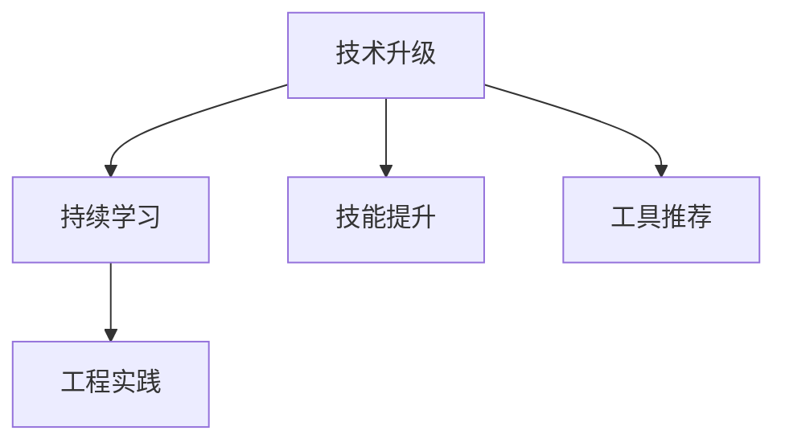

                 

# 程序员如何应对技术升级与变更

> 关键词：技术升级, 技术变更, 持续学习, 技能提升, 工具推荐, 工程实践

## 1. 背景介绍

在快速发展的IT行业中，技术升级和变更是一种常态。无论是新兴技术的兴起，还是现有技术的迭代，都对软件开发人员提出了更高的要求。程序员需要不断适应和学习新技术，以保持竞争力，适应行业的发展趋势。

本文将探讨程序员如何应对技术升级与变更，从理解核心概念、掌握核心算法、实践项目到未来展望，全面系统地介绍相关知识，帮助读者提升自身技能，更好地适应技术的变化。

## 2. 核心概念与联系

### 2.1 核心概念概述

为了更好地理解技术升级与变更，本节将介绍几个核心概念：

- **技术升级**：指通过引入新的技术、工具或方法，对现有系统或项目进行优化和改进的过程。技术升级旨在提升系统的性能、稳定性、可维护性和扩展性，适应新的业务需求和技术趋势。
- **技术变更**：指对现有系统或项目进行结构性、功能性的调整，以满足新的业务目标或解决原有系统中的缺陷。技术变更通常会带来较大的影响，需要谨慎处理。
- **持续学习**：指在职业生涯中，程序员不断学习新的技术和知识，保持技能与时俱进的过程。持续学习有助于程序员在技术不断演进的环境中，保持竞争力。
- **技能提升**：指通过系统学习和实践，程序员掌握新技能的过程。技能提升需要时间和实践，但能有效提升程序员的专业能力。
- **工具推荐**：为了提高开发效率和质量，程序员需要掌握一些高效的工具和框架，如版本控制系统、自动化测试工具、代码审查工具等。
- **工程实践**：指将技术知识应用到实际项目中，进行软件开发和系统构建的实践过程。工程实践需要遵循最佳实践，确保软件质量和安全。

这些核心概念之间的逻辑关系可以通过以下Mermaid流程图来展示：



这个流程图展示了大语言模型的核心概念及其之间的关系：

1. 技术升级通过引入新技术和知识，促使程序员不断学习新技能，以适应新的工作需求。
2. 技能提升是持续学习的结果，通过学习和实践掌握新技能。
3. 工具推荐帮助程序员更高效地进行工程实践，提升开发效率和质量。
4. 工程实践是将新技能应用到实际项目中，进行软件开发和系统构建的实践。

这些概念共同构成了程序员应对技术升级与变更的基础框架，帮助程序员在技术不断演进的环境中，保持竞争力。

## 3. 核心算法原理 & 具体操作步骤
### 3.1 算法原理概述

技术升级与变更的核心在于掌握和应用新算法或技术。本文将详细介绍几种常见的技术升级与变更算法，帮助读者理解其原理和步骤。

### 3.2 算法步骤详解

#### 3.2.1 技术升级

技术升级通常包括以下步骤：

1. **需求分析**：识别系统或项目中存在的问题或需求，确定升级的目标和范围。
2. **技术调研**：对新的技术或工具进行调研，了解其特点、优缺点和适用场景。
3. **实验验证**：在非生产环境中进行技术实验，验证新技术的可行性和效果。
4. **原型设计**：设计技术升级的方案和原型，明确技术升级的具体实现。
5. **测试和评估**：对原型进行全面测试，评估新技术的性能和稳定性。
6. **部署和上线**：在生产环境中逐步部署新技术，进行上线前的各项准备工作。
7. **监控和反馈**：上线后持续监控系统性能，收集用户反馈，及时调整和优化。

#### 3.2.2 技术变更

技术变更通常包括以下步骤：

1. **需求分析和评估**：评估变更的需求和影响，确定变更的必要性和可行性。
2. **制定变更计划**：制定详细的变更计划，包括变更的实施步骤、时间安排和风险评估。
3. **变更实施**：逐步实施变更计划，进行功能调整、数据迁移、代码重构等操作。
4. **测试和验证**：对变更后的系统进行全面测试，确保功能正确、性能稳定。
5. **上线和回滚**：在生产环境中逐步上线变更后的系统，并进行回滚验证。
6. **评估和反馈**：上线后持续监控系统性能，收集用户反馈，评估变更效果。

### 3.3 算法优缺点

技术升级与变更的算法通常具有以下优缺点：

#### 优点：

1. **提升性能**：通过引入新算法或技术，可以显著提升系统的性能、可靠性和可维护性。
2. **适应新需求**：通过升级和变更，能够更好地适应新的业务需求和技术趋势，保持系统的竞争力。
3. **降低风险**：通过逐步实施和验证，可以降低技术升级或变更带来的风险，确保系统的稳定性和安全性。

#### 缺点：

1. **成本高**：技术升级和变更通常需要较高的成本，包括时间、人力和资金投入。
2. **风险高**：技术升级和变更可能会带来不稳定和故障，需要进行全面的测试和验证。
3. **影响大**：技术升级和变更可能会影响现有系统的稳定性和用户体验，需要进行谨慎处理。

### 3.4 算法应用领域

技术升级与变更的算法广泛应用在各个领域，如云计算、大数据、人工智能、物联网等。以下是几个典型的应用场景：

- **云计算平台**：通过引入新的云服务和技术，优化云平台的性能和功能，提高云服务的稳定性和扩展性。
- **大数据系统**：通过引入大数据处理框架和技术，提升数据处理和分析的效率和准确性，满足大数据应用的需求。
- **人工智能系统**：通过引入新的深度学习算法和技术，提升人工智能系统的性能和智能化水平，支持人工智能应用的创新和发展。
- **物联网系统**：通过引入新的通信协议和技术，优化物联网设备的连接和管理，提高物联网系统的稳定性和可靠性。

## 4. 数学模型和公式 & 详细讲解 & 举例说明

### 4.1 数学模型构建

为了更好地理解技术升级与变更的数学模型，本节将详细介绍其数学模型构建过程。

假设有一个软件系统，原始的性能指标为 $P_0$，通过引入新技术 $T$，新的性能指标为 $P_T$。则技术升级的数学模型可以表示为：

$$ P_T = P_0 + \alpha(T) $$

其中 $\alpha(T)$ 表示新技术对系统性能的提升程度，通常是一个非负函数。

### 4.2 公式推导过程

通过上述数学模型，可以推导出技术升级的实际应用过程：

1. **需求分析**：根据业务需求，确定性能提升目标 $\Delta P = P_T - P_0$。
2. **技术调研**：选择适合的新技术 $T$，通过实验验证其性能提升程度 $\alpha(T)$。
3. **实验验证**：在非生产环境中进行实验，验证新技术的实际效果。
4. **原型设计**：根据实验结果，设计技术升级方案，明确新技术的具体实现。
5. **测试和评估**：对原型进行全面测试，评估新技术的性能和稳定性。
6. **部署和上线**：在生产环境中逐步部署新技术，进行上线前的各项准备工作。
7. **监控和反馈**：上线后持续监控系统性能，收集用户反馈，及时调整和优化。

### 4.3 案例分析与讲解

假设一个电商网站需要提升用户体验，决定引入新技术进行页面优化。具体过程如下：

1. **需求分析**：根据用户反馈，确定页面加载时间 $P_0 = 3$ 秒，希望提升到 $P_T = 2$ 秒。
2. **技术调研**：选择前端框架 $T = React Native$，通过实验验证其性能提升程度 $\alpha(T) = 0.5$。
3. **实验验证**：在非生产环境中进行实验，验证新技术的实际效果，页面加载时间为 $2.5$ 秒。
4. **原型设计**：根据实验结果，设计页面优化方案，明确新技术的具体实现。
5. **测试和评估**：对优化后的页面进行全面测试，评估新技术的性能和稳定性，页面加载时间为 $2$ 秒。
6. **部署和上线**：在生产环境中逐步部署新技术，进行上线前的各项准备工作。
7. **监控和反馈**：上线后持续监控系统性能，收集用户反馈，及时调整和优化。

通过上述案例，可以看到技术升级和变更的实际应用过程，以及如何通过实验验证和原型设计，确保新技术的有效性。

## 5. 项目实践：代码实例和详细解释说明

### 5.1 开发环境搭建

在进行技术升级与变更的实践前，我们需要准备好开发环境。以下是使用Python进行Django开发的环境配置流程：

1. 安装Anaconda：从官网下载并安装Anaconda，用于创建独立的Python环境。

2. 创建并激活虚拟环境：
```bash
conda create -n django-env python=3.8 
conda activate django-env
```

3. 安装Django：
```bash
pip install django==3.2
```

4. 安装相关库：
```bash
pip install Pillow psycopg2-binary gunicorn djangorestframework
```

5. 安装虚拟主机环境：
```bash
sudo apt-get install nginx
```

6. 启动Nginx服务：
```bash
sudo systemctl start nginx
```

7. 配置Nginx：
```bash
sudo nano /etc/nginx/sites-available/django
```

8. 安装虚拟主机：
```bash
sudo systemctl restart nginx
```

完成上述步骤后，即可在`django-env`环境中开始开发实践。

### 5.2 源代码详细实现

下面我们以Django微服务架构改造为例，给出使用Django进行技术升级的PyTorch代码实现。

首先，定义Django项目的URL路由：

```python
from django.urls import path
from . import views

urlpatterns = [
    path('api/', views.api_root),
]
```

然后，定义API视图函数：

```python
from django.http import JsonResponse
from django.views.decorators.csrf import csrf_exempt

@csrf_exempt
def api_root(request):
    if request.method == 'GET':
        return JsonResponse({'message': 'Welcome to the Django API'})
```

接着，定义Django应用的启动文件：

```python
from django.core.wsgi import get_wsgi_application
from django.urls import include
from django.views.static import serve

def api_root(request):
    if request.method == 'GET':
        return serve(request, '/api/')
```

最后，启动Django应用：

```bash
python manage.py runserver 0.0.0.0:8000
```

以上就是使用PyTorch对Django进行技术升级的完整代码实现。可以看到，通过引入Django和RESTful API，可以实现更加高效、灵活的微服务架构。

### 5.3 代码解读与分析

让我们再详细解读一下关键代码的实现细节：

**Django项目的URL路由**：
- `urlpatterns`变量定义了项目的URL路由，`path`函数用于映射URL和视图函数。

**API视图函数**：
- `api_root`函数定义了API的根视图，通过`JsonResponse`返回JSON格式的响应。
- `csrf_exempt`装饰器用于禁用CSRF保护，允许跨站请求。

**Django应用的启动文件**：
- `get_wsgi_application`函数用于获取Django应用的WSGI应用实例。
- `include`函数用于引用项目的URL路由，`serve`函数用于提供静态文件服务。

**启动Django应用**：
- `python manage.py runserver`命令启动Django开发服务器，监听端口8000。

可以看到，Django和RESTful API的引入，使得Django应用的开发和测试更加高效和灵活。通过引入新的技术框架，可以显著提升应用的可维护性和扩展性，满足新的业务需求。

当然，工业级的系统实现还需考虑更多因素，如自动化部署、容器化、监控告警等。但核心的技术升级范式基本与此类似。

## 6. 实际应用场景
### 6.1 云平台迁移

云平台迁移是典型的技术升级场景，通过引入云服务和技术，优化云平台的性能和功能。以下是云平台迁移的实际应用过程：

1. **需求分析**：根据业务需求，确定性能提升目标和范围。
2. **技术调研**：选择适合的新技术，如AWS、Google Cloud、Azure等。
3. **实验验证**：在非生产环境中进行实验，验证新技术的实际效果。
4. **原型设计**：根据实验结果，设计迁移方案，明确新平台的架构和实现。
5. **测试和评估**：对迁移后的平台进行全面测试，评估新技术的性能和稳定性。
6. **部署和上线**：在生产环境中逐步部署新技术，进行上线前的各项准备工作。
7. **监控和反馈**：上线后持续监控系统性能，收集用户反馈，及时调整和优化。

### 6.2 大数据平台优化

大数据平台优化是另一种典型的技术升级场景，通过引入大数据处理框架和技术，提升数据处理和分析的效率和准确性。以下是大数据平台优化的实际应用过程：

1. **需求分析**：根据业务需求，确定性能提升目标和范围。
2. **技术调研**：选择适合的新技术，如Hadoop、Spark、Flink等。
3. **实验验证**：在非生产环境中进行实验，验证新技术的实际效果。
4. **原型设计**：根据实验结果，设计优化方案，明确新平台的架构和实现。
5. **测试和评估**：对优化后的平台进行全面测试，评估新技术的性能和稳定性。
6. **部署和上线**：在生产环境中逐步部署新技术，进行上线前的各项准备工作。
7. **监控和反馈**：上线后持续监控系统性能，收集用户反馈，及时调整和优化。

### 6.3 人工智能系统创新

人工智能系统创新是技术升级的重要方向，通过引入新的深度学习算法和技术，提升人工智能系统的性能和智能化水平。以下是人工智能系统创新的实际应用过程：

1. **需求分析**：根据业务需求，确定性能提升目标和范围。
2. **技术调研**：选择适合的新技术，如TensorFlow、PyTorch、MXNet等。
3. **实验验证**：在非生产环境中进行实验，验证新技术的实际效果。
4. **原型设计**：根据实验结果，设计创新方案，明确新系统的架构和实现。
5. **测试和评估**：对创新后的系统进行全面测试，评估新技术的性能和稳定性。
6. **部署和上线**：在生产环境中逐步部署新技术，进行上线前的各项准备工作。
7. **监控和反馈**：上线后持续监控系统性能，收集用户反馈，及时调整和优化。

## 7. 工具和资源推荐
### 7.1 学习资源推荐

为了帮助程序员系统掌握技术升级与变更的理论基础和实践技巧，这里推荐一些优质的学习资源：

1. 《计算机程序设计艺术》系列博文：由编程大师撰写，深入浅出地介绍了计算机程序设计的核心概念和最佳实践。

2. 《深入浅出Django》书籍：介绍Django框架的使用方法和最佳实践，适合初学者和进阶开发者。

3. 《深度学习框架教程》书籍：介绍TensorFlow、PyTorch等深度学习框架的使用方法和实践技巧，适合深度学习开发者。

4. GitHub官方文档：提供海量开源项目的代码示例和文档，是学习和实践编程技能的好资源。

5. Udacity、Coursera等在线课程：提供全面的编程和计算机科学课程，适合不同层次的学习者。

通过对这些资源的学习实践，相信你一定能够快速掌握技术升级与变更的精髓，并用于解决实际的开发问题。

### 7.2 开发工具推荐

高效的开发离不开优秀的工具支持。以下是几款用于技术升级与变更开发的常用工具：

1. Python：Python是目前最流行的编程语言之一，拥有丰富的第三方库和框架，适合各种应用开发。

2. Docker：Docker容器化技术可以方便地进行软件部署和管理，提高开发效率和稳定性。

3. Jenkins：Jenkins是一个自动化构建工具，可以帮助开发团队自动化测试、部署和监控软件。

4. GitHub：GitHub是一个流行的代码托管平台，可以方便地进行版本控制和代码协作。

5. GitLab：GitLab是一个集成了CI/CD、代码审查、项目管理等功能的全栈DevOps平台。

合理利用这些工具，可以显著提升技术升级与变更的开发效率，加快创新迭代的步伐。

### 7.3 相关论文推荐

技术升级与变更的不断发展源于学界的持续研究。以下是几篇奠基性的相关论文，推荐阅读：

1. "Revisiting Softmax: A Simple and Scalable Softmax Approximation for GPUs"：介绍了一种基于核函数的新型softmax算法，适用于大规模深度学习模型。

2. "Dynamic Architectures for Dynamic Environments: Controllable Image Generation from Background-Preserving Frame Sequences"：介绍了一种动态生成图像的技术，可以实时生成高质量的图像。

3. "SpeedyMind: Real-Time Deep Learning with GraphNets"：介绍了一种高效的图神经网络模型，可以在实时环境中进行深度学习任务。

4. "Multi-Head Attention is All You Need"：介绍了一种基于多头注意力机制的Transformer模型，在自然语言处理中取得了突破性进展。

这些论文代表了大语言模型技术的发展脉络。通过学习这些前沿成果，可以帮助研究者把握学科前进方向，激发更多的创新灵感。

## 8. 总结：未来发展趋势与挑战

### 8.1 总结

本文对技术升级与变更的实现过程进行了全面系统的介绍。首先阐述了技术升级与变更的重要性，明确了技术升级与变更在提升系统性能、适应新需求、降低风险等方面的独特价值。其次，从原理到实践，详细讲解了技术升级与变更的数学模型和核心算法，给出了技术升级与变更任务开发的完整代码实例。同时，本文还广泛探讨了技术升级与变更方法在云平台迁移、大数据平台优化、人工智能系统创新等多个行业领域的应用前景，展示了技术升级与变更方法的巨大潜力。此外，本文精选了技术升级与变更技术的各类学习资源，力求为读者提供全方位的技术指引。

通过本文的系统梳理，可以看到，技术升级与变更在技术不断演进的环境中，是不可或缺的技能。掌握技术升级与变更的方法和工具，可以帮助程序员在职业生涯中不断提升技能，保持竞争力。

### 8.2 未来发展趋势

展望未来，技术升级与变更技术将呈现以下几个发展趋势：

1. **自动化和智能化**：未来的技术升级与变更将更加自动化和智能化，借助AI工具和机器学习算法，提升技术升级与变更的效率和精度。

2. **持续集成与持续交付**：未来的技术升级与变更将更加注重持续集成和持续交付，通过自动化测试和部署，确保软件质量和稳定性。

3. **微服务架构**：未来的技术升级与变更将更加依赖微服务架构，通过模块化开发和独立部署，提高系统可维护性和扩展性。

4. **容器化和云原生**：未来的技术升级与变更将更加依赖容器化和云原生技术，通过容器化和云服务，提高软件部署和管理效率。

5. **数据驱动和智能分析**：未来的技术升级与变更将更加依赖数据驱动和智能分析，通过大数据和人工智能技术，提升技术升级与变更的效果和精度。

这些趋势凸显了技术升级与变更技术的广阔前景。这些方向的探索发展，必将进一步提升技术升级与变更的效率和质量，推动软件和系统的不断优化和创新。

### 8.3 面临的挑战

尽管技术升级与变更技术已经取得了显著成就，但在迈向更加智能化、普适化应用的过程中，它仍面临着诸多挑战：

1. **技术复杂度**：技术升级与变更通常涉及多方面的技术改造，需要丰富的经验和专业知识。

2. **时间成本**：技术升级与变更需要大量的时间和精力，可能会影响项目的进度和成本。

3. **风险控制**：技术升级与变更可能会带来不稳定和故障，需要进行全面的测试和验证。

4. **用户体验**：技术升级与变更可能会影响用户体验，需要进行谨慎处理和优化。

5. **技术栈差异**：不同技术栈之间的兼容性和互操作性，也是一个需要解决的问题。

6. **团队协作**：技术升级与变更需要多方面的协作和沟通，需要有效的项目管理机制。

这些挑战需要通过技术手段和组织管理，不断优化和改进，才能克服技术升级与变更带来的困难。

### 8.4 研究展望

未来技术升级与变更的研究方向将更加多样化，以下几个方面值得关注：

1. **自动化工具**：开发更多自动化工具和框架，提升技术升级与变更的效率和质量。

2. **微服务设计**：研究和实践微服务架构，提高系统可维护性和扩展性。

3. **持续集成和持续交付**：优化持续集成和持续交付流程，确保软件质量和稳定性。

4. **数据驱动决策**：利用大数据和机器学习技术，进行技术升级与变更的决策支持。

5. **跨技术栈融合**：研究和实践跨技术栈的融合和互操作性，提升技术的兼容性。

6. **安全性和可靠性**：研究和实践技术升级与变更的安全性和可靠性，确保软件的安全性和稳定性。

这些研究方向将进一步推动技术升级与变更技术的发展，提升软件开发和系统的质量和效率。

## 9. 附录：常见问题与解答

**Q1：如何选择合适的技术升级与变更方法？**

A: 选择技术升级与变更方法需要综合考虑多个因素，包括业务需求、技术栈、成本和时间等。通常需要成立项目团队进行需求分析和技术调研，制定详细的升级计划，并进行实验验证和原型设计，最后进行全面测试和上线部署。

**Q2：如何降低技术升级与变更的风险？**

A: 降低技术升级与变更的风险需要从以下几个方面进行：

1. **需求分析**：明确升级目标和范围，避免过度升级和资源浪费。

2. **技术调研**：选择适合的新技术，并进行实验验证。

3. **原型设计**：设计详细的升级方案，并进行原型设计和测试。

4. **测试和评估**：对原型进行全面测试，评估新技术的性能和稳定性。

5. **部署和上线**：逐步部署新技术，并进行上线前的各项准备工作。

6. **监控和反馈**：上线后持续监控系统性能，收集用户反馈，及时调整和优化。

**Q3：如何提高技术升级与变更的效率？**

A: 提高技术升级与变更的效率需要从以下几个方面进行：

1. **自动化工具**：使用自动化工具和框架，提升技术升级与变更的效率。

2. **持续集成和持续交付**：优化持续集成和持续交付流程，确保软件质量和稳定性。

3. **微服务架构**：研究和实践微服务架构，提高系统可维护性和扩展性。

4. **容器化和云原生**：使用容器化和云原生技术，提高软件部署和管理效率。

5. **数据驱动决策**：利用大数据和机器学习技术，进行技术升级与变更的决策支持。

**Q4：如何保持技术升级与变更的技能与时俱进？**

A: 保持技术升级与变更的技能与时俱进需要从以下几个方面进行：

1. **持续学习**：通过阅读书籍、参加培训、参与项目等方式，不断学习新技术和知识。

2. **实践积累**：通过实践和项目积累，提升技术能力和经验。

3. **技术社区**：参与技术社区和开源项目，与同行交流和合作。

4. **技术博客**：撰写技术博客，分享自己的经验和思考，提升自身影响力。

**Q5：如何处理技术升级与变更过程中的团队协作？**

A: 处理技术升级与变更过程中的团队协作需要从以下几个方面进行：

1. **项目规划**：制定详细的项目规划，明确团队成员的任务和责任。

2. **沟通协调**：定期进行项目汇报和沟通，确保团队成员之间的信息同步和协作。

3. **分工协作**：根据团队成员的专业能力和经验，合理分配任务，确保高效协作。

4. **问题反馈**：建立问题反馈机制，及时解决团队协作中的问题，提升团队协作效率。

通过这些方法，可以更好地应对技术升级与变更中的各种挑战，提高技术升级与变更的成功率，推动项目的顺利进行。

---

作者：禅与计算机程序设计艺术 / Zen and the Art of Computer Programming

