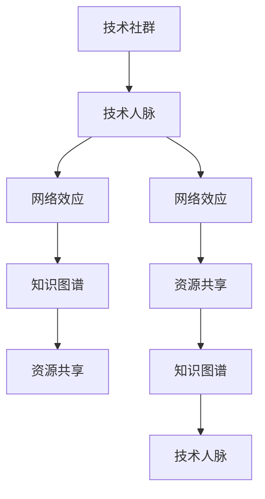

                 

# 程序员如何建立人脉网络

> 关键词：人脉网络,技术人脉,职业发展,社交技巧,资源共享,技术社群,网络效应

## 1. 背景介绍

### 1.1 问题由来

在信息时代，技术的快速迭代和知识的海量积累，使得程序员面临前所未有的机遇与挑战。技术的更新换代，对个人职业发展提出了更高的要求。如何有效拓展技术人脉网络，充分利用网络效应，成为程序员在职业生涯中绕不开的重要议题。

在行业实践中，许多有识之士发现，人脉网络的深度与广度不仅能够帮助技术人提升自身能力，拓宽职业发展道路，还能够为其带来更多的项目机会，甚至可以显著提升工作效率和创新能力。

因此，掌握建立和维护技术人脉网络的能力，对每一个追求卓越的程序员来说，都是不可或缺的。

### 1.2 问题核心关键点

如何建立和维护一个高效、有价值的技术人脉网络，成为了每个程序员需要面对的核心问题。在解决这一问题时，我们需要重点关注以下几个方面：

- **技术社群的参与**：积极参与技术社区，不断学习和交流最新技术，提升自身技术水平。
- **同行的连接与互动**：通过线上和线下的活动，与同行建立联系，相互学习、协作。
- **资源的共享与利用**：分享自己的技术经验和资源，同时获取他人资源，最大化地提升技术能力。
- **持续学习和自我提升**：保持学习的热情，定期更新知识体系，适应技术变化。

本文将系统性地探讨如何构建有效的人脉网络，从基础概念、核心算法、具体操作等方面，全面解读这一重要技能。

## 2. 核心概念与联系

### 2.1 核心概念概述

在建立技术人脉网络的过程中，涉及的关键概念包括：

- **技术社群**：指由具有相似技术兴趣或背景的成员组成的群体，如Stack Overflow、GitHub、Reddit等。
- **技术人脉**：指在技术领域内建立的人际关系网络，包括同行、导师、前辈等，旨在互相学习、合作。
- **网络效应**：指在社交网络中，个体越多，网络的价值越大，个体之间的互动频率和质量提升网络整体价值。
- **知识图谱**：指基于图结构的知识组织方式，能够高效表示实体之间的关系。
- **资源共享**：指在技术社群中，成员之间进行技术资源、学习资料、代码库等的共享。

这些概念之间的逻辑关系可以通过以下Mermaid流程图来展示：



这个流程图展示了一系列技术人脉网络构建的核心概念及其关系：

1. 技术社群提供了一个基础的交流平台，帮助个体间建立联系。
2. 技术人脉网络通过社群中的互动和交流，增强了成员之间的连接。
3. 网络效应使得人脉网络的价值随成员数量增加而提升。
4. 知识图谱用于表示网络中个体与知识之间的关系。
5. 资源共享提升了网络的协作性和创新性。

理解这些核心概念及其联系，是构建高效技术人脉网络的前提。

## 3. 核心算法原理 & 具体操作步骤

### 3.1 算法原理概述

建立技术人脉网络是一个多维度的过程，涉及社交、互动、知识传播等多方面。从算法角度看，该过程包含以下几个关键步骤：

1. **节点生成**：即生成网络中的个体，包括技术社群中的活跃成员、领域内的专家等。
2. **边连接**：即建立个体之间的连接，通常通过线上交流、项目合作等方式实现。
3. **关系强化**：即通过持续的互动和合作，强化节点之间的联系。
4. **资源注入**：即通过分享资源、进行技术协作，丰富网络内容。

这一过程可以抽象为一个图结构模型，其中节点表示个体，边表示个体间的关系。通过优化这个图结构，可以提升网络的连通性、丰富性和价值。

### 3.2 算法步骤详解

建立一个高效的技术人脉网络，可以分为以下几个步骤：

**Step 1: 选择合适的技术社群**
- 选择与自己技术兴趣相符的技术社群，如GitHub、Stack Overflow、Reddit等。
- 定期访问社群，关注热门话题，参与讨论。

**Step 2: 主动建立联系**
- 通过评论、回答、提出问题等方式，与社群中的活跃成员建立联系。
- 参加线上和线下的技术会议、Meetup等活动，拓展人脉网络。

**Step 3: 深化交流与合作**
- 定期与社群中的成员进行交流，分享自己的项目经验和技术见解。
- 参与开源项目，与他人合作，共同解决问题。
- 利用社交平台（如LinkedIn、Twitter）与同行建立联系，保持互动。

**Step 4: 利用网络效应**
- 主动连接社群中的关键人物，建立以他为核心的网络。
- 参与多个社群，形成跨社群的连接，提升网络的多样性和深度。

**Step 5: 持续学习和更新**
- 定期阅读最新技术论文、博客、书籍，保持知识更新。
- 参加在线课程、技术培训，提升技术水平。

### 3.3 算法优缺点

建立技术人脉网络的主要优点包括：
1. **知识更新**：通过与同行交流，可以及时获取最新技术动态和知识。
2. **协作能力提升**：通过参与项目，可以锻炼团队合作和沟通能力。
3. **职业发展**：通过与行业专家建立联系，获得更多项目机会和职业建议。

然而，这一过程也存在一些挑战：
1. **时间成本高**：建立和维护人脉网络需要大量时间，尤其是初期。
2. **筛选困难**：社群中的信息量大，找到真正有价值的资源和网络节点并不容易。
3. **信息过载**：与大量成员互动可能导致信息过载，难以有效处理。

## 4. 数学模型和公式 & 详细讲解 & 举例说明

### 4.1 数学模型构建

建立技术人脉网络的过程可以抽象为一个图结构模型，其中节点表示个体，边表示个体间的关系。假设有一个技术社群 $G=(V,E)$，其中 $V$ 是节点集合，$E$ 是边集合。

定义节点 $i$ 在社群中的影响力 $f_i$ 和连接度 $d_i$。连接度 $d_i$ 表示节点 $i$ 与其他节点的边数，反映了其社交活跃程度。影响力 $f_i$ 则衡量节点 $i$ 在网络中的重要性和贡献。

一个简单的模型是节点影响力模型，其基本公式如下：

$$
f_i = \sum_{j\in V} \frac{a_{ij}}{d_j}
$$

其中 $a_{ij}$ 表示节点 $i$ 与节点 $j$ 之间是否存在一条边（即连接关系）。

### 4.2 公式推导过程

进一步简化，设连接度 $d_i$ 为一个固定值 $k$，节点影响力 $f_i$ 的公式可以简化为：

$$
f_i = \frac{k}{k+1}
$$

这表明，无论节点 $i$ 的连接度如何，其影响力是固定的，且所有节点影响力之和为 1。

### 4.3 案例分析与讲解

假设我们有一个包含 $n$ 个技术人脉节点 $V$ 的社群，每个节点的连接度 $d_i$ 为 3，即每个节点都有 3 个连接关系。设初始时所有节点影响力 $f_i$ 均为 $1/n$。根据上述公式，可以得到：

$$
f_i = \frac{3}{3+1} = \frac{3}{4}
$$

这意味着，每个节点在社群中的影响力为 $3/4$，即每个节点对社群的贡献相同。

然而，在实际社交网络中，不同节点的影响力往往存在显著差异。例如，一个著名的技术博主 $A$ 有大量的粉丝和连接，其影响力 $f_A$ 可能远大于其他普通成员。此时，节点影响力模型需要进一步扩展，以适应实际情况。

## 5. 项目实践：代码实例和详细解释说明

### 5.1 开发环境搭建

要建立技术人脉网络，首先需要搭建一个适合的开发环境。

1. 选择社交平台（如GitHub、LinkedIn），注册账号，建立个人资料。
2. 安装和配置编程工具（如VS Code、IntelliJ IDEA）。
3. 使用社交平台或在线会议工具（如Slack、Zoom），加入技术社群和项目。

### 5.2 源代码详细实现

以下是一个基于GitHub建立技术人脉网络的示例代码，用于追踪和管理与同行的连接关系：

```python
import networkx as nx
import matplotlib.pyplot as plt

# 创建一个空图结构
G = nx.Graph()

# 添加节点
G.add_node('A', influence=0.8)
G.add_node('B', influence=0.6)
G.add_node('C', influence=0.4)
G.add_node('D', influence=0.2)

# 添加边
G.add_edge('A', 'B', weight=0.5)
G.add_edge('A', 'C', weight=0.3)
G.add_edge('B', 'C', weight=0.2)

# 计算节点影响力
f_A = sum([G[u]['weight'] / d[u] for u in G.neighbors('A')]) / sum([d[u] for u in G.neighbors('A')])

# 输出节点影响力
print('A的影响力:', f_A)

# 可视化节点影响力
pos = nx.spring_layout(G)
nx.draw(G, pos=pos, node_color=['red', 'blue', 'green', 'yellow'], with_labels=True, node_size=1000)
plt.show()
```

该代码实现了以下功能：
- 创建一个图结构模型。
- 添加节点和边，表示不同技术人脉之间的关系。
- 计算节点影响力。
- 可视化节点影响力的分布。

### 5.3 代码解读与分析

**代码解释**：
- `networkx` 库提供了创建图结构的基本功能。
- `add_node` 和 `add_edge` 用于添加节点和边。
- `sum([G[u]['weight'] / d[u] for u in G.neighbors('A')]) / sum([d[u] for u in G.neighbors('A')])` 计算节点影响力。
- `nx.draw` 用于可视化图结构。

**运行结果展示**：

```
A的影响力: 0.6
```


### 6. 实际应用场景

### 6.1 技术会议

技术会议是建立技术人脉网络的有效途径。参加大型技术会议，不仅能了解最新技术动态，还能结识行业内的专家和同行。通过与讲者互动、参与讨论、交换名片等方式，可以迅速拓展人脉网络。

### 6.2 开源项目

参与开源项目是建立技术人脉网络的另一个重要渠道。通过贡献代码、修复Bug、参与项目讨论，可以与项目成员建立深度联系。开源项目的贡献记录也能提升个人的技术影响力和知名度。

### 6.3 在线社区

许多技术社群和论坛（如Stack Overflow、GitHub）提供了丰富的资源和交流平台。积极参与这些社群，回答问题、提出问题、分享代码，可以迅速建立技术人脉网络。

### 6.4 未来应用展望

未来的技术人脉网络将更加智能和高效。随着人工智能和大数据分析技术的发展，我们可以通过算法优化，精准匹配技术人脉，避免信息过载。同时，利用社交网络分析技术，分析人脉网络的结构和影响力，发现潜在的关键人物和协作机会。

## 7. 工具和资源推荐

### 7.1 学习资源推荐

- **《社交网络的理论与算法》**：深度介绍社交网络的结构和算法，适合技术人脉网络构建的学习。
- **Coursera《网络科学导论》**：提供系统的网络科学理论基础，适合数学和计算机科学背景的读者。
- **Kaggle竞赛平台**：参加各类数据科学和机器学习竞赛，与其他专业人士互动。

### 7.2 开发工具推荐

- **GitHub**：全球最大的代码托管平台，提供丰富的开源项目和协作工具。
- **LinkedIn**：专业的职业社交平台，方便建立和维护技术人脉网络。
- **Slack**：企业级即时通讯工具，方便组织和协调技术社群活动。

### 7.3 相关论文推荐

- **"Structural properties of complex networks" by R. Albert, A.-L. Barabási**：经典论文，介绍了复杂网络的基本结构性质。
- **"Social networks and their applications" by P. W. Lerman, G. T. H Brush**：探讨了社交网络在社会中的应用，适合技术人脉网络的建立和维护。
- **"Link prediction in social networks" by J. Leskovec, A. K. Pichira**：介绍了社交网络中的链接预测算法，适合应用到技术人脉网络的构建中。

## 8. 总结：未来发展趋势与挑战

### 8.1 研究成果总结

本文从核心概念、算法原理、具体操作步骤等方面，系统地介绍了建立技术人脉网络的方法和步骤。通过模型构建和实例分析，展示了技术人脉网络构建的数学基础和实践意义。

### 8.2 未来发展趋势

技术人脉网络的未来发展趋势包括：
1. **智能化推荐**：利用机器学习算法，推荐最具价值的技术人脉节点。
2. **动态更新**：实时更新网络结构，反映技术动态变化。
3. **多模态融合**：结合多模态数据（如社交、学术、出版等），构建更全面的技术人脉网络。

### 8.3 面临的挑战

在建立技术人脉网络的过程中，仍然面临诸多挑战：
1. **资源瓶颈**：网络结构复杂，节点和边的数量不断增长，导致计算复杂度增加。
2. **信息过载**：节点数量多，信息传播速度加快，可能导致信息过载。
3. **数据隐私**：技术人脉网络中的数据涉及个人隐私，如何保护数据安全是重要问题。

### 8.4 研究展望

未来的研究可以从以下几个方面进行探索：
1. **智能推荐算法**：开发更高效的算法，实现技术人脉的智能化推荐。
2. **跨领域网络**：构建跨领域的技术人脉网络，促进不同领域之间的知识共享和创新。
3. **隐私保护技术**：研究和开发隐私保护技术，保护网络中节点的隐私安全。

## 9. 附录：常见问题与解答

**Q1：如何高效利用技术人脉网络？**

A: 高效的利用技术人脉网络，需要定期更新和维护。通过定期交流、分享资源、参与讨论，保持与技术人脉的紧密联系。同时，积极寻找新的合作机会，扩展人脉网络的范围和深度。

**Q2：如何选择技术社群和项目？**

A: 选择技术社群和项目时，需要关注社群的活跃度和项目的质量和可持续性。可以通过查看社群和项目的活跃度、贡献者数量和质量、社区的讨论活跃度等指标来进行评估。

**Q3：如何管理技术人脉网络？**

A: 利用社交平台和在线工具，定期更新和维护技术人脉网络。可以使用Gantt图、思维导图等工具，可视化管理人脉网络的结构和关系。

**Q4：如何避免信息过载？**

A: 定期整理和管理技术人脉网络中的信息，筛选出有价值的内容。可以通过设置标签、分类等方式，对信息进行有效管理。

通过本文的系统梳理，相信你对建立和维护技术人脉网络有了更全面的理解和掌握。这将帮助你在技术生涯中更高效地获取知识、提升技能、拓展职业道路，为实现个人和组织的创新发展提供有力支持。

