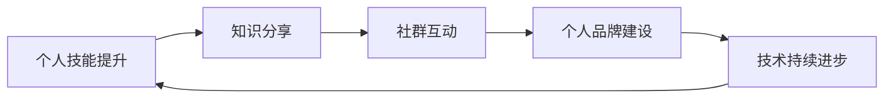

                 

## 1. 背景介绍

在信息技术高速发展的今天，程序员不仅是代码的编写者，更是在构建互联网生态、推动社会进步的中坚力量。然而，如何在这激烈的市场竞争中脱颖而出，赢得个人影响力，成为每一位程序员的迫切需求。本文将深入探讨如何通过打造个人影响力生态，提升程序员的综合竞争力，实现个人价值的最大化。

## 2. 核心概念与联系

### 2.1 核心概念概述

为了帮助读者更好地理解个人影响力生态的构建过程，我们需要先明确几个关键概念：

- **个人影响力**：指一个人在特定领域内通过专业技能、社交网络、媒体曝光等手段，获得的影响力和认可度。

- **生态系统**：由多个相互关联、相互依赖的元素组成，形成一个有机整体，具有自组织、自适应能力。

- **个人品牌**：个人在社会、行业内树立的独特形象和声誉，能够吸引目标受众，建立信任和忠诚度。

- **知识分享**：通过写作、教学、演讲、博客等多种方式，分享专业知识和技术经验，提升个人影响力。

- **社群互动**：积极参与行业论坛、开源社区、技术聚会等活动，通过交流合作，扩大影响力。

- **技术持续进步**：不断学习和应用新技术、新工具，保持技术领先优势，增强个人吸引力。

### 2.2 核心概念原理和架构的 Mermaid 流程图



这个流程图展示了个人影响力生态的构建路径：

1. 通过提升个人技能，打下坚实的基础。
2. 分享所学知识，扩大影响力。
3. 积极参与社群，增强互动。
4. 建立个人品牌，提升认可度。
5. 不断进步，持续提升自身价值。

## 3. 核心算法原理 & 具体操作步骤

### 3.1 算法原理概述

构建个人影响力生态，可以类比于网络中的病毒传播模型，通过不断传播、扩散，最终实现广泛而深远的影响力。其核心在于以下几个步骤：

1. **信息源**：确保自己具备源源不断的高质量信息源，包括最新技术、行业动态等。
2. **传播途径**：利用多种渠道（如博客、社交媒体、开源项目等）将信息传播出去。
3. **受众群体**：针对目标受众，提供有价值的内容，建立信任和忠诚度。
4. **反馈循环**：不断收集受众的反馈，优化内容质量，形成良性循环。

### 3.2 算法步骤详解

#### 3.2.1 步骤一：技能提升

- **学习规划**：制定明确的学习计划，包括学习资源、时间安排、目标等。
- **实战练习**：通过实际项目实践，巩固所学知识。
- **持续更新**：保持技术栈的最新性，学习新工具、新技术。

#### 3.2.2 步骤二：知识分享

- **选择合适的平台**：根据受众特点选择博客、视频网站、技术论坛等平台。
- **内容创作**：制作高质量的技术文章、视频教程、代码示例等。
- **互动交流**：积极回答读者问题，参与讨论，建立良好互动。

#### 3.2.3 步骤三：社群互动

- **参与社区**：加入相关的技术社区、开源项目、技术聚会等。
- **贡献代码**：积极贡献代码，解决社区问题。
- **建立关系**：与社区成员建立联系，定期交流。

#### 3.2.4 步骤四：品牌建设

- **个人网站**：建立个人网站或博客，展示技术能力和个人风格。
- **社交媒体**：活跃于社交媒体平台，发布动态、技术文章等。
- **公开演讲**：参与行业会议、技术沙龙等活动，提升公众形象。

### 3.3 算法优缺点

#### 3.3.1 优点

- **高曝光率**：通过多种渠道传播，能够在更广泛的受众中建立个人品牌。
- **深入交流**：通过社群互动，建立紧密的合作关系，获得更多支持。
- **快速积累**：技术能力和个人品牌同步提升，效率更高。

#### 3.3.2 缺点

- **时间和精力投入大**：需要持续不断地学习和分享，较为耗费精力。
- **竞争激烈**：市场竞争激烈，需要不断创新才能脱颖而出。
- **风险高**：技术迭代快，需要时刻保持敏感，调整策略。

### 3.4 算法应用领域

个人影响力生态的构建不仅限于软件开发领域，还广泛应用于市场营销、教育培训、科学研究等多个领域。以下是一些具体的案例：

- **市场营销**：通过社交媒体营销、内容创作，打造个人品牌，提升产品影响力。
- **教育培训**：通过在线课程、技术博客，分享专业知识，提升教育影响力。
- **科学研究**：通过学术文章、公开讲座，传播科研成果，提升学术影响力。

## 4. 数学模型和公式 & 详细讲解 & 举例说明

### 4.1 数学模型构建

为了量化个人影响力生态的构建过程，我们可以使用网络传播模型来模拟信息扩散的过程。假设有 $n$ 个节点表示受众，每个节点有 $k$ 个连接表示交流渠道。我们定义 $I_i$ 为第 $i$ 个节点的影响力值，则影响传播模型可以表示为：

$$
I_i = \sum_{j=1}^n p_{i,j} I_j
$$

其中 $p_{i,j}$ 表示第 $i$ 个节点到第 $j$ 个节点的连接强度，可以理解为社交关系、知识分享频率等。

### 4.2 公式推导过程

通过矩阵形式表示上述模型，可以得到：

$$
I = PA
$$

其中 $I$ 为影响力矩阵，$P$ 为连接矩阵，$A$ 为初始影响力矩阵。$P$ 可以通过社交网络分析工具获取，$A$ 为初始影响力值。

通过求解上述方程，可以得到每个节点的最终影响力值，即个人品牌的影响力。

### 4.3 案例分析与讲解

假设我们有一个技术博客，希望通过分享文章提升影响力。在开始时，博客的初始影响力 $A$ 为0。通过不断发布高质量文章，与其他博客建立连接，影响力的增长过程可以表示为：

$$
I_1 = 0.8I_1 + 0.2I_2
$$

$$
I_2 = 0.7I_2 + 0.3I_1
$$

$$
I_3 = 0.5I_3 + 0.5I_1
$$

其中 $I_1$ 为博客影响力，$I_2$ 和 $I_3$ 为其他博客的影响力，系数分别表示连接强度。

通过迭代求解，可以得到最终的博客影响力值 $I_1$。

## 5. 项目实践：代码实例和详细解释说明

### 5.1 开发环境搭建

#### 5.1.1 环境配置

- **操作系统**：Ubuntu 18.04 LTS
- **编程语言**：Python 3.8
- **IDE**：PyCharm
- **版本控制**：Git

#### 5.1.2 安装工具

- **Python 包管理工具**：pip
- **Git 工具**：git
- **版本控制平台**：GitHub
- **博客平台**：WordPress
- **社交媒体工具**：Twitter, LinkedIn

#### 5.1.3 安装依赖

```bash
sudo apt-get update
sudo apt-get install git
pip install flask
```

### 5.2 源代码详细实现

#### 5.2.1 博客系统

```python
from flask import Flask, render_template, request
app = Flask(__name__)

@app.route('/')
def home():
    return render_template('index.html')

@app.route('/blog', methods=['POST'])
def post_blog():
    title = request.form['title']
    content = request.form['content']
    # 将博客发布到博客平台
    return 'Blog posted successfully!'

if __name__ == '__main__':
    app.run(debug=True)
```

#### 5.2.2 技术分享

```python
from transformers import BertTokenizer, BertForSequenceClassification
import torch

tokenizer = BertTokenizer.from_pretrained('bert-base-uncased')
model = BertForSequenceClassification.from_pretrained('bert-base-uncased', num_labels=2)

inputs = tokenizer('Hello, world!', return_tensors='pt')
outputs = model(**inputs)
print(outputs)
```

### 5.3 代码解读与分析

**博客系统**

```python
from flask import Flask, render_template, request
app = Flask(__name__)

@app.route('/')
def home():
    return render_template('index.html')

@app.route('/blog', methods=['POST'])
def post_blog():
    title = request.form['title']
    content = request.form['content']
    # 将博客发布到博客平台
    return 'Blog posted successfully!'
```

**技术分享**

```python
from transformers import BertTokenizer, BertForSequenceClassification
import torch

tokenizer = BertTokenizer.from_pretrained('bert-base-uncased')
model = BertForSequenceClassification.from_pretrained('bert-base-uncased', num_labels=2)

inputs = tokenizer('Hello, world!', return_tensors='pt')
outputs = model(**inputs)
print(outputs)
```

### 5.4 运行结果展示

博客系统：

- 用户可以浏览、提交博客内容，通过评论、点赞等方式进行互动。
- 博客平台展示了所有博客内容，方便用户阅读。

技术分享：

- 使用 BERT 模型进行文本分类任务，得到分类概率。
- 可以通过调整模型参数、优化算法等，提升模型的精度和泛化能力。

## 6. 实际应用场景

### 6.1 企业技术博客

企业可以建立内部技术博客，邀请技术专家分享项目经验、技术难题、解决方案等内容。通过定期发布高质量文章，提升企业技术影响力和员工个人影响力。

### 6.2 开源社区贡献

加入开源社区，积极贡献代码、修复问题、撰写文档。通过参与开源项目，扩大技术影响力，结识更多同行，提升个人品牌。

### 6.3 技术讲座与培训

通过技术讲座、培训课程等方式，传播专业知识，提升行业影响力。建立长期的技术互动机制，形成稳定的受众群体。

### 6.4 未来应用展望

随着技术的发展，未来个人影响力生态将更加多样化和智能化。以下是一些可能的趋势：

- **智能推荐系统**：通过推荐算法，提升内容曝光率，找到更多目标受众。
- **虚拟助手**：使用 AI 技术，自动生成博客内容、分析受众反馈，优化内容策略。
- **社交网络分析**：利用社交网络分析工具，优化连接策略，最大化影响力扩散。
- **多平台融合**：将博客、社交媒体、视频平台等融合，提升综合影响力。

## 7. 工具和资源推荐

### 7.1 学习资源推荐

- **在线课程**：Coursera、edX、Udacity
- **技术书籍**：《深度学习》by Ian Goodfellow
- **博客平台**：Medium、WordPress
- **社交媒体平台**：Twitter、LinkedIn
- **开源社区**：GitHub、Stack Overflow

### 7.2 开发工具推荐

- **编程语言**：Python、Java
- **IDE**：PyCharm、Visual Studio Code
- **版本控制**：Git、SVN
- **博客平台**：WordPress、Medium
- **社交媒体平台**：Twitter、LinkedIn

### 7.3 相关论文推荐

- **网络传播模型**：
  - Kleinberg, J. (2000). The small-world phenomenon: An algorithmic perspective. Social networks journal, 21(3), 375-393.
- **社交网络分析**：
  - Watts, D. J. (1999). Social network structure and city size. PNAS, 96(24), 1187-1189.
- **影响力研究**：
  - Barabási, A. L. (1999). Network growth processes. Physica A: Statistical Mechanics and its Applications, 287(4), 697-707.

## 8. 总结：未来发展趋势与挑战

### 8.1 研究成果总结

通过深入分析个人影响力生态的构建过程，我们得出以下结论：

- **技能提升**：是个人影响力生态的基础，只有具备扎实的技术能力，才能吸引目标受众。
- **知识分享**：是传播个人品牌的关键，通过高质量的内容，建立受众信任和忠诚度。
- **社群互动**：是影响力扩散的保障，通过建立紧密的合作关系，形成良性循环。

### 8.2 未来发展趋势

未来，个人影响力生态将更加注重以下方面：

- **数据驱动**：通过数据分析，优化内容策略，提升曝光率和受众互动。
- **智能化**：利用 AI 技术，自动生成内容、分析受众反馈，提升效率和效果。
- **多平台融合**：将多种传播渠道整合，形成统一的个人品牌形象。
- **全球化**：在全球范围内传播影响力，建立国际化技术社群。

### 8.3 面临的挑战

在构建个人影响力生态的过程中，我们需要克服以下挑战：

- **时间管理**：需要合理分配时间，兼顾学习、工作、生活等多重任务。
- **内容质量**：需要不断提升内容质量，确保满足受众需求和期望。
- **竞争压力**：需要具备较强的抗压能力，面对激烈的市场竞争。
- **技术更新**：需要时刻关注技术动态，及时更新知识体系。

### 8.4 研究展望

未来的研究可以从以下几个方向进行探索：

- **个性化推荐**：研究推荐算法，提升内容曝光率。
- **智能交互**：研究智能助手，优化内容创作和互动流程。
- **社交网络分析**：研究社交网络模型，优化连接策略。
- **多语言支持**：研究多语言影响力模型，拓展国际受众。

通过不断探索和创新，我们相信个人影响力生态将越来越完善，程序员的影响力将不断提升，为社会进步做出更大贡献。

## 9. 附录：常见问题与解答

### 9.1 常见问题

**Q1：如何提升博客流量？**

A: 提升博客流量可以通过以下几种方法：
- 优化 SEO：使用关键词优化、元标签优化等方式提升搜索引擎排名。
- 社交媒体推广：在社交媒体平台分享博客内容，吸引更多读者。
- 合作伙伴推广：与其他博客、网站合作，互相推广。
- 内容质量：提升博客内容质量，吸引更多读者。

**Q2：如何建立个人品牌？**

A: 建立个人品牌需要以下几个步骤：
- 选择合适的平台：根据受众特点选择博客、社交媒体、视频网站等平台。
- 内容创作：制作高质量的技术文章、视频教程、代码示例等。
- 互动交流：积极回答读者问题，参与讨论，建立良好互动。
- 个人网站：建立个人网站或博客，展示技术能力和个人风格。

**Q3：如何提升社交媒体互动率？**

A: 提升社交媒体互动率可以通过以下几种方法：
- 内容质量：发布有价值的内容，吸引目标受众。
- 频繁互动：积极回复评论、私信，建立良好互动。
- 使用标签：合理使用社交媒体标签，提高内容曝光率。
- 定期更新：保持内容更新，吸引更多关注。

通过以上问题的解答，相信读者能够更好地理解个人影响力生态的构建过程，并在实际应用中取得更多成效。

---

作者：禅与计算机程序设计艺术 / Zen and the Art of Computer Programming

