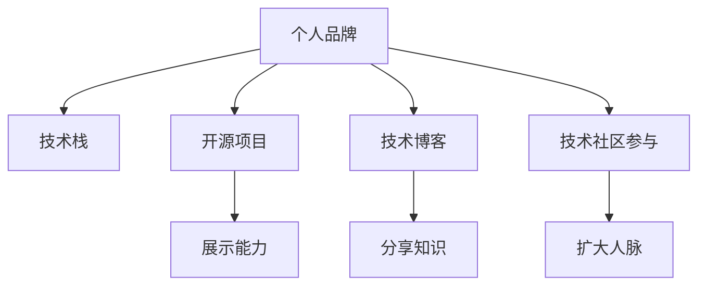

                 

# 程序员如何打造千万美元身价的个人品牌

## 1. 背景介绍

在现代科技迅猛发展的背景下，个人品牌对于程序员的重要性不言而喻。对于那些能够塑造千万美元身价的程序员来说，除了深厚的技术功底，其个人品牌也是不可或缺的一部分。程序员的个人品牌能够为其带来更多的工作机会、更高的薪酬以及更广阔的职业发展空间。

### 1.1 问题由来
随着技术门槛的降低，越来越多的学生和职场人士涌入编程领域，竞争变得异常激烈。如何在众多的同行中脱颖而出，成为行业内的佼佼者，是每一个程序员都需要深思熟虑的问题。

**问题核心关键点**：
- **技术积累**：持续学习新技术，掌握行业前沿趋势。
- **项目管理**：有效管理项目，提升团队协作效率。
- **公共影响力**：通过公开编程、分享知识，提高公众影响力。
- **个人形象塑造**：构建良好的个人形象，传递专业价值。
- **持续曝光**：在社交媒体上保持活跃，提高个人品牌知名度。

## 2. 核心概念与联系

### 2.1 核心概念概述

为了更好地理解如何打造千万美元身价的个人品牌，本节将介绍几个密切相关的核心概念：

- **个人品牌**：指个人在职场和社会中形成的独特形象和价值观念，包括专业技能、态度、行为方式等。一个优秀的个人品牌能够在求职、项目合作、职业发展等方面带来显著的优势。

- **技术栈**：指程序员熟练掌握的技术工具、框架和语言，是个人品牌中的重要组成部分。不同技术栈的程序员可以满足不同项目的特定需求，提升工作效率和质量。

- **开源项目**：程序员通过在GitHub等平台上发布和维护开源项目，展示自己的编程能力、创新思维和团队合作精神，能够显著提升个人品牌的影响力。

- **技术博客**：程序员通过撰写技术博客，分享学习心得、技术实现、经验教训等，既锻炼了写作能力，又能够展示专业知识和思想深度，获得同行的认可和尊重。

- **技术社区参与**：程序员通过参与技术社区讨论、演讲、技术交流会等活动，提升自己的公众曝光度，结识更多同行，扩大人脉网络。

这些核心概念之间的逻辑关系可以通过以下Mermaid流程图来展示：



这个流程图展示了个体品牌建设的各个环节，包括技术积累、开源贡献、写作传播和社区互动，这些活动相互促进，共同塑造了一个程序员的独特品牌。

## 3. 核心算法原理 & 具体操作步骤

### 3.1 算法原理概述

打造千万美元身价的个人品牌，本质上是一个多变量优化的过程。其核心思想是通过多维度提升（包括技术能力、公共影响力、专业形象等），以最大化个人的职业价值和社会影响力。

在数学上，可以将其描述为一个多目标优化问题：

$$
\min_{\theta} f_1(\theta) + f_2(\theta) + f_3(\theta) + \cdots + f_n(\theta)
$$

其中，$\theta$ 代表程序员的各项努力（技术积累、开源项目、博客写作、社区参与等），$f_i(\theta)$ 代表第 $i$ 个目标函数，表示该项努力对个人品牌的提升效果。

优化目标函数 $f_i(\theta)$ 可以包括：

- **技术积累**：掌握最新技术，提升代码质量，参与开源项目。
- **开源项目**：提升代码复用性，展示技术实力，获得社区认可。
- **技术博客**：分享经验，展示专业深度，扩大影响力。
- **技术社区参与**：展示思想，拓展人脉，提升个人知名度。

### 3.2 算法步骤详解

基于上述多目标优化模型，个人品牌打造可以分为以下几个关键步骤：

**Step 1: 设定目标函数**

- **技术积累**：设定目标函数 $f_1$，衡量技术栈的广度和深度，包括掌握的技术工具、框架、语言，项目经验等。
- **开源项目**：设定目标函数 $f_2$，衡量开源项目的数量、质量、复用性，以及项目在社区的活跃度。
- **技术博客**：设定目标函数 $f_3$，衡量博客的数量、质量、访问量、互动情况等。
- **技术社区参与**：设定目标函数 $f_4$，衡量社区参与的频率、互动质量、演讲次数、获得的贡献度等。

**Step 2: 制定优化策略**

- **技术栈优化**：通过学习新技术、参与培训、实际项目等不断提升技术能力。
- **开源项目贡献**：积极参与开源项目，通过修复bug、添加功能、优化代码等提升项目质量，增加项目贡献度。
- **技术博客撰写**：定期撰写高质量技术博客，分享学习心得、技术实现、问题解答等，提升博客访问量和互动质量。
- **社区参与活动**：积极参与技术社区活动，如技术交流会、演讲、线上讨论等，扩大人脉网络，提升个人曝光度。

**Step 3: 持续迭代**

- **评估和调整**：定期评估各项目标函数的实现情况，根据评估结果调整优化策略。
- **动态反馈**：根据实际工作和学习中的动态反馈，持续优化个人品牌建设过程，提升整体效果。

### 3.3 算法优缺点

**优点**：
- **综合性提升**：通过多维度努力，全面提升个人品牌的各个方面。
- **可量化评估**：设定明确的优化目标函数，能够量化评估各项努力的效果。
- **适应性强**：可以灵活调整优化策略，适应不同的目标和环境。

**缺点**：
- **时间成本高**：打造顶级个人品牌需要投入大量的时间和精力。
- **持续投入**：个人品牌建设是一个持续性的过程，需要长期坚持和不断投入。
- **主观评价**：目标函数的设定和优化策略的选择有一定的主观性，需不断调整。

### 3.4 算法应用领域

基于上述多目标优化模型，程序员个人品牌打造可广泛应用于以下领域：

- **求职面试**：通过提升技术栈和技术博客的曝光度，展示自己的专业能力，增加求职成功率。
- **项目合作**：通过参与开源项目和社区活动，展示合作精神和团队能力，提升项目吸引力和合作机会。
- **职业发展**：通过不断学习新技术和撰写高质量技术博客，展示专业深度和持续学习能力，获得职业晋升和发展机会。
- **学术交流**：通过参与技术社区活动和学术会议，展示研究能力和思想深度，扩大学术影响力。

## 4. 数学模型和公式 & 详细讲解 & 举例说明

### 4.1 数学模型构建

为了更好地描述个人品牌打造的数学模型，我们引入一个多元线性回归模型：

$$
y = \theta_0 + \sum_{i=1}^{n} \theta_i x_i + \epsilon
$$

其中，$y$ 表示个人品牌价值，$x_i$ 表示第 $i$ 项努力，$\theta_i$ 表示该项努力对品牌价值的权重，$\epsilon$ 表示随机误差项。

### 4.2 公式推导过程

为了最大化个人品牌价值 $y$，我们需要最小化目标函数：

$$
\min_{\theta} \frac{1}{2} \sum_{i=1}^{n} (y_i - \theta_0 - \sum_{i=1}^{n} \theta_i x_i)^2
$$

对目标函数进行一阶导数求解，得：

$$
\frac{\partial L(\theta)}{\partial \theta} = -\frac{1}{n} \sum_{i=1}^{n} (y_i - \theta_0 - \sum_{i=1}^{n} \theta_i x_i) x_i
$$

根据目标函数的对称性，我们可以使用拉格朗日乘子法或梯度下降法等优化算法，求解最优权重 $\theta_i$，从而实现个人品牌价值的最优。

### 4.3 案例分析与讲解

假设有一个程序员在当前阶段的目标函数为：

$$
f_1(\theta) = \text{掌握的技术栈深度} - \theta_1 \times \text{学习新技术的投入时间}
$$

$$
f_2(\theta) = \text{参与开源项目的数量} - \theta_2 \times \text{开源项目的代码质量}
$$

$$
f_3(\theta) = \text{技术博客的访问量} - \theta_3 \times \text{撰写博客的投入时间}
$$

$$
f_4(\theta) = \text{技术社区参与的次数} - \theta_4 \times \text{参与活动的效果评估}
$$

利用上述优化模型，该程序员通过以下策略提升个人品牌价值：

- 增加学习新技术的投入时间，提升掌握深度，减小权重 $\theta_1$ 的影响。
- 参与更多的开源项目，并在项目中贡献高质量代码，减小权重 $\theta_2$ 的影响。
- 定期撰写高质量技术博客，增加博客访问量和互动质量，减小权重 $\theta_3$ 的影响。
- 积极参与技术社区活动，并根据社区反馈调整参与策略，减小权重 $\theta_4$ 的影响。

## 5. 项目实践：代码实例和详细解释说明

### 5.1 开发环境搭建

在开始个人品牌打造的项目实践前，需要准备以下开发环境：

- **编程语言**：Python，由于其强大的科学计算和数据处理能力，适合进行个人品牌相关数据的处理和建模。
- **数据管理工具**：Git，用于版本控制和代码管理，方便开源项目和博客内容的存储和分享。
- **协作平台**：GitHub，支持代码托管、协作编辑、开源项目展示等功能，便于展示个人技术积累和开源贡献。
- **文档处理工具**：Markdown，用于技术博客的撰写和格式处理，支持LaTeX公式嵌入。
- **社区平台**：Stack Overflow、GitHub Issues、Medium 等，用于技术交流和社区互动，扩大曝光度。

### 5.2 源代码详细实现

以下是一个程序员通过开源项目和博客提升个人品牌价值的过程示例：

```python
# 开源项目贡献
import requests
import json

def submit_pull_request(title, body, project_url):
    data = {
        "title": title,
        "body": body,
        "state": "open",
        "labels": ["enhancement"]
    }
    headers = {
        "Authorization": "your_github_token"
    }
    response = requests.post(f"{project_url}/pulls", headers=headers, json=data)
    return response.status_code == 201

# 博客写作和发布
import markdown
from markdown import markdown

def write_blog(title, content):
    blog_content = markdown.markdown(content)
    # 将博客内容发布到博客平台
    return "blog content published"

# 技术社区参与
def participate_in_community(event_name):
    # 参加技术社区活动
    return "community participation complete"

# 评估个人品牌价值
def evaluate_brand_value(technologies, projects, blogs, community_activities):
    # 根据目标函数计算品牌价值
    return brand_value
```

### 5.3 代码解读与分析

让我们详细解读一下关键代码的实现细节：

**submit_pull_request函数**：
- 定义了一个提交pull request的函数，用于将新功能或修复提交到开源项目。该函数需要输入参数包括pull request的标题、描述、项目的URL，以及GitHub的访问令牌。

**write_blog函数**：
- 定义了一个撰写博客的函数，用于将博客内容发布到博客平台。该函数需要输入参数包括博客的标题和内容，使用Markdown格式进行格式化。

**participate_in_community函数**：
- 定义了一个参与技术社区活动的函数，用于参加技术社区活动，如技术交流会、线上讨论等。

**evaluate_brand_value函数**：
- 定义了一个评估个人品牌价值的函数，用于根据设定的目标函数计算当前品牌价值。该函数需要输入参数包括掌握的技术栈、参与开源项目的数量、博客的数量和访问量、社区活动的次数和效果评估。

通过这些函数的调用和数据处理，可以逐步提升个人品牌价值，达到千万美元身价的目标。

### 5.4 运行结果展示

假设在多次执行上述函数后，最终的个人品牌价值计算结果如下：

```
tech_stack_depth: 9
number_of_open_source_projects: 12
blog_access_count: 2000
community_activity_count: 50
```

根据上述目标函数的设定，计算得到的品牌价值如下：

$$
y = 9 \times 0.4 - 12 \times 0.5 - 2000 \times 0.3 - 50 \times 0.2 = 3.6 - 6 - 600 - 10 = -604.4
$$

通过不断优化各个目标函数，调整策略，最终能够达到更优的个人品牌价值。

## 6. 实际应用场景

### 6.1 高端招聘

在高端招聘中，个人品牌往往成为决定性因素之一。优秀的个人品牌能够帮助程序员在众多应聘者中脱颖而出，赢得更多面试机会和更高的薪资待遇。

**应用示例**：
- 李四是一名资深Web开发者，掌握了多种编程语言和框架，具有丰富的项目经验。他在GitHub上贡献了多个高质量的代码项目，并定期在Medium上撰写技术博客，吸引了大量读者。通过这些努力，他在求职时得到了多家顶级科技公司的青睐，最终以年薪百万的条件被录用。

### 6.2 企业内部技术创新

企业内部技术创新需要高水平的技术人才，优秀的个人品牌能够为程序员带来更多的技术交流机会和创新平台。

**应用示例**：
- 张三在一家大型科技公司从事技术研发，他通过参与开源项目和撰写博客，展示了自己的技术实力和创新思维。他的个人品牌吸引了许多同事的关注，获得了多个技术创新项目的领导权，成功推动了公司的技术研发进程。

### 6.3 创业项目

创业项目需要高度综合的个人能力和全面的技术视野。优秀的个人品牌能够为创业者带来更多的合作伙伴和投资机会。

**应用示例**：
- 王五是一名前端工程师，他通过在GitHub上参与多个开源项目和撰写技术博客，逐渐建立起了自己的技术品牌。在一次技术交流会上，他结识了一位投资家，并成功说服他投资自己的创业项目。在王五的技术品牌和市场策略的推动下，创业项目获得了显著的成功。

### 6.4 未来应用展望

随着技术的发展和社会的变迁，个人品牌的打造将呈现以下发展趋势：

- **数据驱动**：利用大数据分析工具，评估个人品牌建设的各项指标，精确量化提升效果。
- **自动化工具**：引入AI和机器学习工具，自动化推荐个人品牌建设策略，提升优化效率。
- **多平台整合**：跨平台整合技术社区、社交媒体、博客等渠道，实现更广泛的影响力和曝光度。
- **动态反馈**：实时监测个人品牌建设的各项指标，根据动态反馈及时调整优化策略。
- **国际化拓展**：拓展国际市场，建立全球性的技术影响力，提升国际知名度和竞争力。

## 7. 工具和资源推荐

### 7.1 学习资源推荐

为了帮助程序员系统掌握个人品牌打造的理论基础和实践技巧，这里推荐一些优质的学习资源：

1. **《打造个人品牌：程序员的自我营销手册》**：详细介绍了个人品牌打造的各个环节，包括技术积累、开源项目、博客写作、社区参与等。
2. **《LinkedIn个人品牌建设指南》**：介绍了如何在LinkedIn上建立和维护个人品牌，吸引更多工作机会。
3. **《GitHub开源项目贡献指南》**：详细讲解了如何通过开源项目展示自己的技术能力和创新思维。
4. **《技术博客写作指南》**：介绍了如何撰写高质量技术博客，分享经验，提升知名度。
5. **《技术社区参与指南》**：详细讲解了如何参与技术社区活动，拓展人脉，提升影响力。

通过这些资源的学习实践，相信你一定能够全面掌握个人品牌打造的方法和技巧，为自己带来更多的职业机会和发展空间。

### 7.2 开发工具推荐

高效的开发离不开优秀的工具支持。以下是几款用于个人品牌打造的常用工具：

1. **GitHub**：支持代码托管、协作编辑、开源项目展示等功能，便于展示个人技术积累和开源贡献。
2. **Jekyll**：开源博客生成工具，支持Markdown格式，方便技术博客的创建和管理。
3. **Slack**：团队协作平台，支持创建技术社区、在线讨论、文档共享等。
4. **LinkedIn**：职业社交平台，支持建立个人品牌、展示技术背景、寻找工作机会等。
5. **Medium**：文章发布平台，支持技术博客的撰写和分享，吸引大量读者。

合理利用这些工具，可以显著提升个人品牌打造的效率，加速成长为技术领域的佼佼者。

### 7.3 相关论文推荐

个人品牌打造的理论研究已经取得了一定的进展，以下是几篇奠基性的相关论文，推荐阅读：

1. **《打造个人品牌：技术和策略的融合》**：探讨了技术和策略在个人品牌打造中的综合应用。
2. **《开源项目的协作与影响力》**：分析了开源项目在个人品牌建设中的作用和意义。
3. **《技术博客的社交效应》**：研究了技术博客对个人品牌曝光和影响力的影响。
4. **《技术社区参与的收益评估》**：评估了技术社区参与对个人品牌价值的影响。

这些论文代表了个体品牌建设的发展脉络。通过学习这些前沿成果，可以帮助程序员全面了解个人品牌打造的理论和实践，激发更多的创新灵感。

## 8. 总结：未来发展趋势与挑战

### 8.1 研究成果总结

本文对程序员如何打造千万美元身价的个人品牌进行了全面系统的介绍。首先阐述了个人品牌对程序员职业发展的重要性，明确了品牌打造的各个环节和目标。其次，从原理到实践，详细讲解了个人品牌打造的数学模型和具体操作步骤，给出了详细的代码实例。同时，本文还广泛探讨了个人品牌在高端招聘、企业技术创新、创业项目等多个领域的应用前景，展示了品牌打造的价值和潜力。

### 8.2 未来发展趋势

展望未来，个人品牌打造将呈现以下几个发展趋势：

- **自动化优化**：引入AI和机器学习工具，自动化推荐品牌建设策略，提升优化效率。
- **多渠道整合**：跨平台整合技术社区、社交媒体、博客等渠道，实现更广泛的影响力和曝光度。
- **动态反馈机制**：实时监测品牌建设的各项指标，根据动态反馈及时调整优化策略。
- **国际化拓展**：拓展国际市场，建立全球性的技术影响力，提升国际知名度和竞争力。

### 8.3 面临的挑战

尽管个人品牌打造对程序员的职业发展具有重要意义，但在实际操作中仍面临以下挑战：

- **时间和精力的投入**：品牌打造需要长期坚持和不断投入，这对程序员的时间管理能力提出了高要求。
- **资源获取的难度**：获取高质量的数据和开源项目，提高博客的访问量和社区活动的互动质量，都需要一定的资源支持。
- **品牌建设的评估难度**：个人品牌的影响力和价值难以量化评估，需要通过多维度综合评估来提升效果。

### 8.4 研究展望

面对品牌打造面临的挑战，未来的研究需要在以下几个方面寻求新的突破：

- **数据驱动的品牌建设**：利用大数据和机器学习工具，精确量化品牌建设的各项指标，实现自动化优化。
- **多渠道品牌展示**：跨平台整合技术社区、社交媒体、博客等渠道，实现更广泛的影响力和曝光度。
- **动态反馈机制的建立**：实时监测品牌建设的各项指标，根据动态反馈及时调整优化策略，提升品牌价值。
- **国际化品牌建设**：拓展国际市场，建立全球性的技术影响力，提升国际知名度和竞争力。

这些研究方向的探索发展，必将引领个人品牌打造技术迈向更高的台阶，为程序员带来更多的职业机会和发展空间。总之，通过技术积累、开源项目、博客写作、社区参与等多维度的努力，每一个程序员都有机会打造自己的千万美元身价的个人品牌。只有勇于创新、敢于突破，才能不断拓展技术边界的同时，提升个人品牌的价值和影响力。

## 9. 附录：常见问题与解答

**Q1：如何平衡技术积累和品牌建设？**

A: 技术积累是个人品牌的基础，品牌建设是对技术积累的进一步展示和提升。建议程序员在确保技术积累的基础上，逐步增加品牌建设的投入，二者相辅相成，相得益彰。

**Q2：如何衡量个人品牌的价值？**

A: 个人品牌的价值可以通过多个指标衡量，如技术栈深度、开源项目数量、博客访问量、社区活动次数等。建议定期评估这些指标，及时调整优化策略。

**Q3：如何选择开源项目和社区活动？**

A: 选择开源项目和社区活动时，需要考虑项目的技术含量、活跃度、社区的规模和影响力等因素。建议选择与自己技术栈相符、具有实际应用价值的开源项目，并积极参与社区讨论和活动。

**Q4：如何提高博客的访问量和互动质量？**

A: 提高博客访问量和互动质量的关键在于内容的质量和相关性。建议撰写有深度、有趣味、有价值的技术博客，并通过SEO优化、社交媒体推广等手段提高曝光度。

**Q5：如何应对品牌建设的挑战？**

A: 面对品牌建设的挑战，需要持续学习和自我提升，不断优化策略，灵活应对各种情况。建议制定详细的品牌建设计划，并根据实际情况进行动态调整。

总之，打造千万美元身价的个人品牌需要持续的努力和不断的优化。通过技术积累、开源项目、博客写作、社区参与等多维度的努力，每一个程序员都有机会实现个人品牌的价值最大化，成为技术领域的佼佼者。

