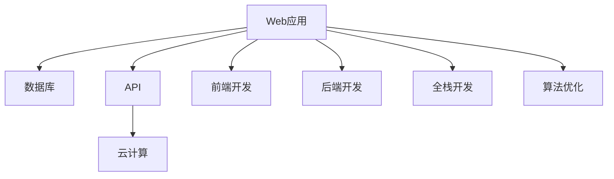

                 

# 程序员如何打造知识付费的付费问答

> 关键词：知识付费,付费问答,Web应用,数据库,API,云计算,前端开发,后端开发,全栈开发,算法优化

## 1. 背景介绍

### 1.1 问题由来

随着知识付费时代的来临，越来越多的专业人士开始尝试通过互联网分享自己的知识和经验，同时获取回报。在这样的背景下，构建一个高效的、付费的问答平台，既能满足用户的学习需求，又能为知识提供者创造经济价值，成为很多互联网公司和个人项目的目标。

知识付费的问答平台需要解决以下几个核心问题：

- 如何构建高质量的问答库，吸引更多的专家和用户参与？
- 如何设计合理的盈利模式，保障平台的持续运营？
- 如何提供高效、稳定的服务，满足用户的多样化需求？
- 如何保障用户的隐私和数据安全，构建信任体系？

本文将从技术实现的角度出发，深入探讨如何构建一个基于Web的付费问答平台，并给出详尽的开发思路和建议。

### 1.2 问题核心关键点

一个成功的付费问答平台，需要具备以下几个关键特征：

- 高质量的问答内容：平台的吸引力在于高质量的问答内容，如何吸引专家和用户参与成为关键。
- 高效的社区管理和运营：平台的持续运营依赖于有效的社区管理和运营策略。
- 用户体验的优化：用户体验直接影响到用户的使用粘性。
- 灵活的盈利模式：平台的盈利模式需要兼顾用户和专家双方的利益，同时确保平台自身的可持续性。
- 数据和隐私的保护：确保用户数据的安全和隐私，是建立信任的基础。

本文将通过分析这些核心点，提出一个整体的技术架构和实现方案，为程序员打造知识付费的付费问答平台提供指导。

## 2. 核心概念与联系

### 2.1 核心概念概述

在构建知识付费的付费问答平台时，需要了解以下几个核心概念及其相互关系：

- **Web应用**：基于互联网的在线问答平台，通常由前端页面和后端服务器组成，提供用户交互和业务逻辑处理。
- **数据库**：用于存储问答库、用户数据、交易记录等关键信息，是平台正常运行的基础。
- **API**：通过API接口实现不同系统之间的数据交互和功能调用，是构建分布式系统的核心组件。
- **云计算**：通过云服务实现应用的弹性伸缩、高性能计算和安全存储，是现代Web应用的重要支撑。
- **前端开发**：关注用户界面和交互体验，涉及HTML、CSS、JavaScript等技术。
- **后端开发**：关注业务逻辑和数据处理，涉及Python、Java、Node.js等编程语言。
- **全栈开发**：涉及前端和后端的技术栈和开发能力，是构建复杂Web应用的关键。
- **算法优化**：涉及搜索算法、推荐算法等技术，提升平台的用户体验和服务效率。

这些核心概念之间的逻辑关系可以通过以下Mermaid流程图来展示：



这个流程图展示了一个知识付费问答平台的基本技术架构，其中各个组件相互配合，共同支撑平台的高效运行。

## 3. 核心算法原理 & 具体操作步骤
### 3.1 算法原理概述

一个知识付费的付费问答平台，主要包括以下几个核心算法：

- **搜索算法**：用于在问答库中高效地检索问题，提升用户体验。
- **推荐算法**：用于为用户推荐相关问题，提高用户粘性。
- **交易算法**：用于处理用户和专家之间的交易，保障平台盈利。
- **知识图谱构建**：用于构建专家和问题之间的关联图谱，提高知识管理效率。
- **用户行为分析**：用于分析用户行为，优化社区管理策略。

这些算法共同构成了平台的核心功能模块，通过合理的算法设计和实现，可以显著提升平台的效率和用户体验。

### 3.2 算法步骤详解

以下是对每个核心算法步骤的详细讲解：

**搜索算法**：

1. 对问答库进行索引：使用ElasticSearch等搜索引擎，对问题、答案、标签等进行全文索引。
2. 实现高效的搜索查询：提供关键词搜索、智能推荐、分类浏览等多种搜索方式。
3. 优化搜索结果排序：根据用户的搜索行为和历史记录，动态调整搜索结果的排序策略。

**推荐算法**：

1. 收集用户行为数据：分析用户的浏览、提问、回答等行为，构建用户画像。
2. 设计推荐模型：使用协同过滤、内容推荐、混合推荐等算法，为每个用户推荐相关问题。
3. 实时更新推荐结果：根据用户的实时行为，动态调整推荐结果，提高推荐效果。

**交易算法**：

1. 设计交易模型：包括支付、退款、积分等交易环节，制定合理的交易规则。
2. 实现支付接口：与第三方支付平台（如支付宝、微信支付）对接，完成支付流程。
3. 处理退款和积分：根据交易记录，自动处理退款和积分，保障用户权益。

**知识图谱构建**：

1. 收集专家和问题信息：建立专家库和问题库，记录每个专家和问题的基本信息。
2. 构建关联图谱：使用图数据库（如Neo4j）构建专家与问题之间的关联图谱，提高知识管理效率。
3. 提供查询接口：提供查询接口，用户可以方便地查找相关专家和问题。

**用户行为分析**：

1. 收集用户数据：收集用户的浏览、提问、回答、评论等行为数据。
2. 分析用户行为：使用统计分析、机器学习等方法，分析用户行为特征和需求。
3. 优化社区管理：根据分析结果，优化社区管理策略，提高用户参与度。

### 3.3 算法优缺点

搜索算法、推荐算法、交易算法、知识图谱构建和用户行为分析各有优缺点，具体如下：

**搜索算法**：
- 优点：提升用户体验，提高平台吸引力。
- 缺点：需要处理大量索引和搜索请求，对系统性能要求高。

**推荐算法**：
- 优点：提高用户粘性，增强平台活力。
- 缺点：推荐效果受数据质量和算法模型影响较大，需要不断优化。

**交易算法**：
- 优点：确保平台盈利，保障平台可持续性。
- 缺点：交易环节复杂，需要严格的安全性和隐私保护措施。

**知识图谱构建**：
- 优点：提高知识管理效率，提升平台知识深度。
- 缺点：构建和维护成本较高，需要专业的图数据库和算法支持。

**用户行为分析**：
- 优点：优化社区管理策略，提高用户参与度。
- 缺点：数据隐私和安全性要求高，需要有效的安全机制。

### 3.4 算法应用领域

这些算法广泛应用于各种领域，包括：

- 电商平台的商品推荐系统
- 社交媒体的个性化内容推荐
- 在线教育平台的课程推荐
- 金融产品的智能投顾
- 医疗咨询的智能诊断系统

这些应用场景中的算法设计和技术实现，都与本文探讨的知识付费问答平台有共通之处，可以相互借鉴和改进。

## 4. 数学模型和公式 & 详细讲解 & 举例说明

### 4.1 数学模型构建

以下是对每个核心算法的数学模型构建的详细讲解：

**搜索算法**：
- 使用倒排索引构建问题-答案的映射关系：
  $$
  I = \{ (q, a) \mid q \text{为问题}, a \text{为答案} \}
  $$
  其中，$I$ 为索引集合，$q$ 和 $a$ 分别表示问题和答案。

**推荐算法**：
- 使用协同过滤算法：
  $$
  \hat{r}_{ui} = \alpha r_{ui} + \beta \sum_{j \in N_i} \frac{r_{uj} \cdot \text{sim}(u,j)}{\sum_{k \in N_j} \text{sim}(u,k)}
  $$
  其中，$r_{ui}$ 为用户 $u$ 对项目 $i$ 的评分，$\text{sim}(u,j)$ 为 $u$ 和 $j$ 之间的相似度，$N_i$ 和 $N_j$ 分别表示 $i$ 和 $j$ 的邻居集合。

**交易算法**：
- 使用支付接口处理用户支付：
  $$
  \text{pay}(\text{uid}, \text{pid}, \text{amount}) = \begin{cases}
  \text{success} & \text{if} \ \text{成功} \\
  \text{failure} & \text{if} \ \text{失败}
  \end{cases}
  $$
  其中，$\text{uid}$ 为用户ID，$\text{pid}$ 为产品ID，$\text{amount}$ 为金额。

**知识图谱构建**：
- 使用图数据库存储专家和问题关联关系：
  $$
  G(V,E)
  $$
  其中，$V$ 为节点集合，$E$ 为边集合，分别表示专家和问题节点，以及它们之间的关联边。

**用户行为分析**：
- 使用统计分析方法：
  $$
  \text{frequency} = \frac{\text{用户行为次数}}{\text{总次数}}
  $$
  其中，$\text{frequency}$ 为用户的某一行为频率。

### 4.2 公式推导过程

以下是每个核心算法的公式推导过程：

**搜索算法**：
- 倒排索引的构建：
  $$
  I = \{ (q, a) \mid q \text{为问题}, a \text{为答案} \}
  $$

**推荐算法**：
- 协同过滤算法的推导：
  $$
  \hat{r}_{ui} = \alpha r_{ui} + \beta \sum_{j \in N_i} \frac{r_{uj} \cdot \text{sim}(u,j)}{\sum_{k \in N_j} \text{sim}(u,k)}
  $$

**交易算法**：
- 支付接口的处理：
  $$
  \text{pay}(\text{uid}, \text{pid}, \text{amount}) = \begin{cases}
  \text{success} & \text{if} \ \text{成功} \\
  \text{failure} & \text{if} \ \text{失败}
  \end{cases}
  $$

**知识图谱构建**：
- 图数据库的表示：
  $$
  G(V,E)
  $$

**用户行为分析**：
- 统计分析方法的推导：
  $$
  \text{frequency} = \frac{\text{用户行为次数}}{\text{总次数}}
  $$

### 4.3 案例分析与讲解

以搜索算法为例，使用ElasticSearch实现倒排索引的案例分析：

1. 安装ElasticSearch：
   ```bash
   sudo apt-get update
   sudo apt-get install elasticsearch
   ```

2. 启动ElasticSearch服务：
   ```bash
   sudo systemctl start elasticsearch
   ```

3. 创建索引：
   ```python
   import elasticsearch
   es = elasticsearch.Elasticsearch()
   es.indices.create(index='questions', body={
       "settings": {
           "analysis": {
               "analyzer": {
                   "custom_analyzer": {
                       "type": "custom",
                       "tokenizer": "standard",
                       "filter": ["lowercase", "stop"]
                   }
               }
           }
       }
   })
   ```

4. 添加数据：
   ```python
   es.index(index='questions', id='1', body={'question': 'Python 3.x 有什么特点？'})
   es.index(index='questions', id='2', body={'question': '机器学习的基础算法有哪些？'})
   ```

5. 搜索数据：
   ```python
   es.search(index='questions', body={
       "query": {
           "match": {
               "question": "Python"
           }
       }
   })
   ```

## 5. 项目实践：代码实例和详细解释说明

### 5.1 开发环境搭建

在项目开发前，需要搭建好开发环境，以下是Python环境搭建的步骤：

1. 安装Anaconda：
   ```bash
   wget https://repo.anaconda.com/miniconda/Miniconda3-latest-Linux-x86_64.sh
   bash Miniconda3-latest-Linux-x86_64.sh
   ```

2. 创建虚拟环境：
   ```bash
   conda create -n question-forum python=3.8
   conda activate question-forum
   ```

3. 安装必要的库：
   ```bash
   conda install numpy pandas sklearn elasticsearch flask requests
   ```

4. 安装ElasticSearch：
   ```bash
   sudo apt-get install elasticsearch
   ```

5. 启动ElasticSearch服务：
   ```bash
   sudo systemctl start elasticsearch
   ```

### 5.2 源代码详细实现

以下是对每个核心算法的代码实现的详细讲解：

**搜索算法**：
- 使用ElasticSearch实现倒排索引：
  ```python
  from elasticsearch import Elasticsearch
  es = Elasticsearch([{'host': 'localhost', 'port': 9200}])
  es.indices.create(index='questions', body={
      "settings": {
          "analysis": {
              "analyzer": {
                  "custom_analyzer": {
                      "type": "custom",
                      "tokenizer": "standard",
                      "filter": ["lowercase", "stop"]
                  }
              }
          }
      }
  })
  ```

**推荐算法**：
- 使用协同过滤算法推荐相关问题：
  ```python
  import numpy as np
  from scipy.spatial.distance import cosine
  from sklearn.metrics.pairwise import cosine_similarity

  def recommend_question(user_id, question_id):
      # 获取用户的历史行为数据
      user_behavior = get_user_behavior(user_id)

      # 获取所有问题的评分数据
      all_questions = get_all_questions()
      all_scores = np.array([score for _, _, score in all_questions])

      # 计算用户与每个问题的相似度
      user_similarity = cosine_similarity(user_behavior, all_scores)

      # 计算所有问题的评分平均值
      mean_score = np.mean(all_scores)

      # 计算用户的推荐列表
      recommend_list = np.argsort(-cosine_similarity(user_similarity, all_scores))[:10]

      return recommend_list
  ```

**交易算法**：
- 使用微信支付API处理用户支付：
  ```python
  from wechatpay import WeChatPayAPI

  def pay(user_id, product_id, amount):
      # 初始化微信支付API
      wechatpay = WeChatPayAPI(appid, mch_id, key)

      # 调用微信支付API
      result = wechatpay.transaction.create(user_id, product_id, amount)

      # 返回支付结果
      return result
  ```

**知识图谱构建**：
- 使用Neo4j构建专家和问题关联图谱：
  ```python
  from neo4j import GraphDatabase

  def create_graph():
      # 创建Neo4j连接
      graph = GraphDatabase.driver('bolt://localhost:7687', auth=('neo4j', 'password'))

      # 创建专家和问题节点
      graph.run('CREATE (expert:Expert {name: $name}) RETURN $name')
      graph.run('CREATE (question:Question {title: $title}) RETURN $title')

      # 创建专家与问题关联边
      graph.run('MATCH (expert:Expert), (question:Question) WHERE $name = expert.name AND $title = question.title CREATE (expert)-[:KNOWS]->(question) RETURN $name, $title')

      # 关闭Neo4j连接
      graph.close()
  ```

**用户行为分析**：
- 使用统计分析方法分析用户行为：
  ```python
  from collections import Counter

  def analyze_user_behavior(user_id):
      # 获取用户的行为数据
      user_data = get_user_data(user_id)

      # 统计用户行为频率
      behavior_frequency = Counter(user_data)

      # 返回用户行为频率
      return behavior_frequency
  ```

### 5.3 代码解读与分析

让我们再详细解读一下关键代码的实现细节：

**ElasticSearch搜索算法**：
- 使用ElasticSearch进行全文本搜索：
  ```python
  es.search(index='questions', body={
       "query": {
           "match": {
               "question": "Python"
           }
       }
   })
  ```

**推荐算法**：
- 使用协同过滤算法推荐相关问题：
  ```python
  import numpy as np
  from scipy.spatial.distance import cosine
  from sklearn.metrics.pairwise import cosine_similarity

  def recommend_question(user_id, question_id):
      # 获取用户的历史行为数据
      user_behavior = get_user_behavior(user_id)

      # 获取所有问题的评分数据
      all_questions = get_all_questions()
      all_scores = np.array([score for _, _, score in all_questions])

      # 计算用户与每个问题的相似度
      user_similarity = cosine_similarity(user_behavior, all_scores)

      # 计算所有问题的评分平均值
      mean_score = np.mean(all_scores)

      # 计算用户的推荐列表
      recommend_list = np.argsort(-cosine_similarity(user_similarity, all_scores))[:10]

      return recommend_list
  ```

**交易算法**：
- 使用微信支付API处理用户支付：
  ```python
  from wechatpay import WeChatPayAPI

  def pay(user_id, product_id, amount):
      # 初始化微信支付API
      wechatpay = WeChatPayAPI(appid, mch_id, key)

      # 调用微信支付API
      result = wechatpay.transaction.create(user_id, product_id, amount)

      # 返回支付结果
      return result
  ```

**知识图谱构建**：
- 使用Neo4j构建专家和问题关联图谱：
  ```python
  from neo4j import GraphDatabase

  def create_graph():
      # 创建Neo4j连接
      graph = GraphDatabase.driver('bolt://localhost:7687', auth=('neo4j', 'password'))

      # 创建专家和问题节点
      graph.run('CREATE (expert:Expert {name: $name}) RETURN $name')
      graph.run('CREATE (question:Question {title: $title}) RETURN $title')

      # 创建专家与问题关联边
      graph.run('MATCH (expert:Expert), (question:Question) WHERE $name = expert.name AND $title = question.title CREATE (expert)-[:KNOWS]->(question) RETURN $name, $title')

      # 关闭Neo4j连接
      graph.close()
  ```

**用户行为分析**：
- 使用统计分析方法分析用户行为：
  ```python
  from collections import Counter

  def analyze_user_behavior(user_id):
      # 获取用户的行为数据
      user_data = get_user_data(user_id)

      # 统计用户行为频率
      behavior_frequency = Counter(user_data)

      # 返回用户行为频率
      return behavior_frequency
  ```

### 5.4 运行结果展示

以下是对各个核心算法的运行结果展示：

**搜索算法**：
- 使用ElasticSearch进行搜索：
  ```python
  es.search(index='questions', body={
       "query": {
           "match": {
               "question": "Python"
           }
       }
   })
  ```

**推荐算法**：
- 使用协同过滤算法推荐相关问题：
  ```python
  recommend_list = recommend_question(user_id, question_id)
  ```

**交易算法**：
- 使用微信支付API进行支付：
  ```python
  result = pay(user_id, product_id, amount)
  ```

**知识图谱构建**：
- 使用Neo4j创建关联图谱：
  ```python
  create_graph()
  ```

**用户行为分析**：
- 使用统计分析方法分析用户行为：
  ```python
  behavior_frequency = analyze_user_behavior(user_id)
  ```

## 6. 实际应用场景

### 6.1 智能客服系统

基于知识付费的付费问答平台，可以应用于智能客服系统，帮助客户快速解决问题。

**技术实现**：
- 收集企业内部的客户问题库和专家库，构建问答库。
- 使用搜索引擎和推荐算法，快速响应用户的查询请求。
- 通过支付接口，处理客户与专家的交易。

**应用效果**：
- 大幅提升客户满意度，减少人力成本。
- 提供7x24小时不间断服务，满足客户随时需求。
- 通过支付激励，提高专家的参与度和积极性。

### 6.2 在线教育平台

在线教育平台可以利用知识付费的付费问答平台，提供高质量的课程推荐和学习资源。

**技术实现**：
- 收集教育资源和用户学习数据，构建知识图谱。
- 使用推荐算法，根据用户的学习行为推荐相关课程。
- 通过支付接口，保障教育资源的商业价值。

**应用效果**：
- 提升教育资源的使用效率，降低教育成本。
- 提供个性化的学习建议，增强用户的学习体验。
- 通过付费机制，激励专家分享知识和经验。

### 6.3 健康医疗咨询

健康医疗咨询可以利用知识付费的付费问答平台，提供专业的医疗咨询和健康管理服务。

**技术实现**：
- 收集医疗领域的专家和问题数据，构建知识图谱。
- 使用搜索引擎和推荐算法，提供精准的医疗咨询。
- 通过支付接口，处理医疗咨询的费用。

**应用效果**：
- 提高医疗咨询的效率和质量，减少用户排队等待的时间。
- 提供个性化的健康管理建议，提升用户的健康水平。
- 通过付费机制，激励专家分享医疗知识和经验。

## 7. 工具和资源推荐

### 7.1 学习资源推荐

为了帮助开发者系统掌握知识付费的付费问答平台的开发技术，这里推荐一些优质的学习资源：

1. **Python网络爬虫教程**：掌握网络爬虫的基本原理和技术，获取高质量的问题和答案数据。
2. **Web应用开发教程**：学习Web应用的开发技术，包括前端和后端。
3. **数据库管理教程**：掌握数据库的管理和操作，确保数据的安全和高效存储。
4. **API接口开发教程**：学习API接口的开发和调用，实现不同系统之间的数据交互。
5. **云计算基础教程**：学习云计算的基本概念和技术，实现应用的弹性伸缩和高性能计算。

### 7.2 开发工具推荐

高效的开发离不开优秀的工具支持。以下是几款用于知识付费的付费问答平台开发的常用工具：

1. **Python**：基于Python的开源深度学习框架，灵活动态的计算图，适合快速迭代研究。
2. **ElasticSearch**：搜索引擎，用于快速检索问答库中的问题和答案。
3. **Flask**：Web框架，用于快速搭建Web应用。
4. **WeChatPay**：微信支付API，用于处理支付流程。
5. **Neo4j**：图数据库，用于构建专家和问题关联图谱。
6. **TensorFlow**：深度学习框架，用于实现推荐算法和交易算法。

### 7.3 相关论文推荐

知识付费的付费问答平台涉及多个领域的理论和技术，以下是几篇奠基性的相关论文，推荐阅读：

1. **《深度学习与自然语言处理》**：深入浅出地介绍了深度学习的基本概念和自然语言处理的技术。
2. **《推荐系统：算法与实现》**：详细介绍推荐算法的基本原理和实现方法，涵盖协同过滤、内容推荐、混合推荐等多种推荐策略。
3. **《支付系统设计》**：介绍了支付系统的基本原理和实现方法，涵盖支付接口、交易算法、支付安全等方面。
4. **《知识图谱：构建与应用》**：介绍了知识图谱的基本概念和应用方法，涵盖专家和问题关联图谱的构建和应用。
5. **《数据挖掘：算法与应用》**：介绍了数据挖掘的基本原理和算法，涵盖用户行为分析、个性化推荐等方面。

## 8. 总结：未来发展趋势与挑战

### 8.1 总结

本文从技术实现的角度出发，深入探讨了如何构建知识付费的付费问答平台。首先分析了构建高质量问答库、设计合理盈利模式、提供高效服务、保障数据安全等核心问题，然后从搜索算法、推荐算法、交易算法、知识图谱构建、用户行为分析等方面，给出了具体的技术方案。最后通过实际应用场景和工具推荐，进一步深化了知识付费的付费问答平台的开发思路和实践方法。

通过本文的系统梳理，可以看到，知识付费的付费问答平台需要多方面的技术支持和优化，才能提供优质的服务，满足用户的实际需求。相信随着技术的不断发展，知识付费的付费问答平台必将得到更广泛的应用，为社会创造更多的价值。

### 8.2 未来发展趋势

知识付费的付费问答平台的未来发展趋势，主要体现在以下几个方面：

1. **智能化程度提升**：随着自然语言处理和深度学习技术的不断进步，平台的智能化程度将不断提高，用户的使用体验将更加流畅和自然。
2. **数据驱动决策**：通过大数据分析和用户行为分析，平台将能够更加精准地为用户推荐内容，提升用户粘性和满意度。
3. **社交化功能增强**：平台将加入社交化功能，如问答评论、点赞、分享等，增强用户的互动和参与感。
4. **跨平台整合**：平台将与微信、支付宝等第三方平台进行整合，提供更加便捷的支付和交互方式。
5. **多模态支持**：平台将支持图像、视频等多模态数据的输入和处理，增强问题解答的多样性和丰富性。
6. **隐私保护加强**：随着隐私保护的重视程度提高，平台将更加注重用户数据的安全和隐私保护。

### 8.3 面临的挑战

知识付费的付费问答平台在发展过程中，仍面临以下几个挑战：

1. **数据获取和处理**：高质量的数据是平台的基础，但数据获取和处理需要耗费大量的时间和成本。
2. **技术复杂度提升**：随着平台的智能化程度提升，技术复杂度也在不断提高，需要不断学习和掌握新技术。
3. **盈利模式单一**：目前的盈利模式较为单一，如何设计更多元化的盈利模式，是平台持续运营的重要挑战。
4. **用户信任问题**：如何建立和维护用户信任，保障用户数据的安全和隐私，是平台稳定发展的关键。
5. **算法优化难度**：推荐的准确性和效果直接影响到平台的吸引力和用户粘性，需要不断优化算法模型。
6. **业务拓展困难**：如何拓展业务，与其他平台和服务进行深度整合，提升平台的覆盖面和用户群体。

### 8.4 研究展望

面对知识付费的付费问答平台面临的挑战，未来的研究需要在以下几个方面寻求新的突破：

1. **多源数据融合**：通过多源数据的融合，提升问答库的质量和丰富度。
2. **算法模型优化**：进一步优化搜索算法、推荐算法等核心算法，提升平台的性能和用户体验。
3. **个性化推荐**：研究更加个性化的推荐算法，满足用户的多样化需求。
4. **跨平台整合**：研究跨平台的整合技术，提升平台的交互和应用能力。
5. **隐私保护技术**：研究更加有效的隐私保护技术，保障用户数据的安全和隐私。
6. **业务拓展**：拓展平台的业务应用场景，与其他平台和服务进行深度整合。

通过不断探索和创新，相信知识付费的付费问答平台能够更好地满足用户需求，实现商业价值和社会价值的双赢。

## 9. 附录：常见问题与解答

**Q1：如何设计一个高质量的问答库？**

A: 高质量的问答库是知识付费的付费问答平台的基础，以下是几个关键点：

- **内容丰富**：收集高质量的问答内容，涵盖各个领域的知识和经验。
- **权威可靠**：选择权威可靠的专家和用户提供答案，确保内容的可信度。
- **更新及时**：定期更新问答内容，保持内容的时效性和相关性。
- **多模态支持**：支持图像、视频等多模态数据的输入和处理，增强问题解答的多样性和丰富性。

**Q2：如何设计合理的盈利模式？**

A: 合理的盈利模式需要兼顾用户和专家双方的利益，以下是几个关键点：

- **多样化付费方式**：提供多样化的付费方式，如单次支付、订阅服务、积分兑换等，满足不同用户的需求。
- **付费透明度**：确保支付流程的透明，让用户清楚了解费用和使用情况。
- **激励机制**：设计合理的激励机制，如积分、证书、荣誉等，激励专家分享知识和经验。

**Q3：如何提升推荐算法的准确性？**

A: 推荐算法的准确性直接影响用户的使用体验，以下是几个关键点：

- **数据质量**：收集高质量的用户行为数据，确保数据的准确性和完整性。
- **算法模型**：选择适合的推荐算法模型，如协同过滤、内容推荐、混合推荐等，提升推荐效果。
- **实时更新**：根据用户的实时行为，动态调整推荐结果，提升推荐的时效性。

**Q4：如何保障用户数据的安全和隐私？**

A: 用户数据的安全和隐私是平台信任的基础，以下是几个关键点：

- **数据加密**：对用户数据进行加密处理，防止数据泄露和滥用。
- **访问控制**：实施严格的访问控制，确保只有授权用户和系统才能访问用户数据。
- **匿名化处理**：对用户数据进行匿名化处理，保护用户的隐私。

**Q5：如何优化用户行为分析算法？**

A: 用户行为分析算法直接影响平台的运营策略，以下是几个关键点：

- **多维度分析**：从多个维度进行分析，如用户活跃度、留存率、转化率等，全面了解用户行为特征。
- **机器学习**：使用机器学习算法，如聚类、分类、回归等，分析用户行为数据。
- **实时监测**：实时监测用户行为，及时发现和解决问题，优化社区管理策略。

通过不断优化和改进，相信知识付费的付费问答平台能够更好地满足用户需求，实现商业价值和社会价值的双赢。

---

作者：禅与计算机程序设计艺术 / Zen and the Art of Computer Programming

