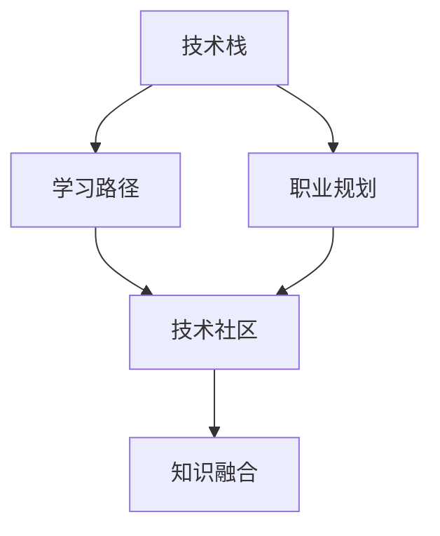

                 

# 程序员如何构建个人知识体系

> 关键词：知识体系构建, 程序员, 技术栈, 学习路径, 职业规划, 技术社区

## 1. 背景介绍

在当今快速发展的科技时代，程序员作为技术的实践者和创新者，需要不断更新和扩展自己的知识体系，以适应不断变化的技术环境和市场需求。构建有效的个人知识体系不仅能提升个人能力，还能为职业生涯发展提供坚实的基础。本文将深入探讨如何构建一个全面、高效、可持续发展的个人知识体系，并结合实际案例，为你提供具体的指导和策略。

## 2. 核心概念与联系

### 2.1 核心概念概述

构建个人知识体系的过程涉及到多个核心概念，包括技术栈、学习路径、职业规划、技术社区等。这些概念之间相互联系，共同构成了完整的知识体系框架。

- **技术栈**：指开发项目所需的所有技术集合，包括编程语言、框架、工具等。
- **学习路径**：指达成某一技术目标所需的学习步骤和资源，包括在线课程、书籍、论文、实践项目等。
- **职业规划**：指结合个人兴趣和市场需求，规划职业生涯发展的路径和目标。
- **技术社区**：指围绕技术交流、分享、协作的社区，如GitHub、Stack Overflow、知乎等。

这些概念共同作用，帮助程序员构建系统、全面的技术能力，同时提供了一个互动的平台，促进技术的交流和创新。

### 2.2 核心概念原理和架构的 Mermaid 流程图



这个流程图展示了技术栈、学习路径、职业规划和技术社区之间的联系。技术栈提供了学习资源和应用场景，学习路径指导具体的学习步骤，职业规划确定了职业目标和路径，技术社区则促进了知识的交流和应用。

## 3. 核心算法原理 & 具体操作步骤

### 3.1 算法原理概述

构建个人知识体系是一个动态的、持续的过程。基于需求和市场变化，个人需要不断更新和扩展自己的技术栈，通过有针对性的学习路径，达到职业规划的目标，并通过技术社区进行知识融合和实践。这一过程可以通过以下算法原理来概述：

- **需求分析**：评估当前技术环境和个人职业目标，确定需要掌握的技术栈。
- **路径规划**：根据技术栈，规划具体的学习路径，选择合适的学习资源。
- **实施学习**：按照学习路径，逐步学习并掌握新技能。
- **实践应用**：通过实践项目，巩固学习成果，提升技术能力。
- **社区互动**：在技术社区交流学习经验，获取反馈，拓展视野。
- **持续迭代**：根据技术发展和职业变化，不断更新和扩展知识体系。

### 3.2 算法步骤详解

#### 3.2.1 需求分析

1. **自我评估**：
   - 列出当前掌握的技术栈和工具。
   - 识别技术缺口，如新语言、新框架、新工具等。
   - 明确职业目标，如技术专家、架构师、数据科学家等。

2. **市场调研**：
   - 了解当前技术发展的趋势和热门技术栈。
   - 研究行业对技术人才的需求和标准。
   - 分析竞争对手的技术栈和优势。

3. **需求匹配**：
   - 根据自我评估和市场调研，确定目标技术栈。
   - 设置短期和长期职业目标，确定学习优先级。

#### 3.2.2 路径规划

1. **资源选择**：
   - 选择权威的在线课程和书籍。
   - 确定优先掌握的核心技术，如编程语言、框架、工具等。
   - 制定详细的学习计划，包括每天/每周的学习任务和目标。

2. **工具准备**：
   - 安装必要的开发环境，如IDE、编译器、数据库等。
   - 准备实验环境，确保可以无障碍地进行实践项目。

3. **资源整合**：
   - 将各类学习资源进行整合，形成系统的学习路径。
   - 选择适合的在线平台和社区，获取最新的学习资源和实践机会。

#### 3.2.3 实施学习

1. **知识输入**：
   - 通过在线课程和书籍学习理论知识。
   - 通过官方文档和教程了解技术细节。
   - 通过视频教程和示例代码理解实际应用。

2. **知识输出**：
   - 完成学习任务，如编写代码、编写文档、参与讨论等。
   - 制作学习笔记，总结学到的知识和经验。
   - 参加在线挑战和竞赛，检验学习成果。

#### 3.2.4 实践应用

1. **项目设计**：
   - 设计小型项目，模拟真实应用场景。
   - 选择适合的技术栈，实现项目需求。
   - 遵循敏捷开发方法，快速迭代和改进项目。

2. **项目实施**：
   - 编写代码，实现项目功能。
   - 进行单元测试和集成测试，确保代码质量。
   - 部署项目，获取实际反馈，进行优化。

#### 3.2.5 社区互动

1. **社区参与**：
   - 在技术社区发布问题和讨论，获取反馈。
   - 参与开源项目，贡献代码和文档。
   - 与社区成员交流，分享学习心得和实践经验。

2. **知识融合**：
   - 学习社区中其他人的经验和方法。
   - 将社区中的知识应用到项目中，提升实践能力。
   - 通过社区获取最新的技术动态，保持知识更新。

#### 3.2.6 持续迭代

1. **反馈总结**：
   - 根据实际项目中的问题，总结经验教训。
   - 定期回顾学习路径，调整学习计划和优先级。
   - 更新职业规划，设定新的学习目标。

2. **技术更新**：
   - 跟踪技术发展，学习新的技术和工具。
   - 参加技术会议和研讨会，获取前沿信息。
   - 更新技术栈，保持与市场需求的同步。

### 3.3 算法优缺点

**优点**：
- **系统性**：通过规划和路径，确保学习有章可循，避免盲目学习。
- **针对性**：根据需求和目标，选择学习资源和实践项目，避免浪费时间。
- **高效性**：通过社区互动和实践应用，快速提升技术能力，达到职业目标。
- **灵活性**：根据市场和技术变化，持续更新和扩展知识体系。

**缺点**：
- **初期投入大**：需要投入大量时间和精力进行规划和初期学习。
- **灵活性不足**：一旦确定了学习路径，改变可能需要重新规划。
- **持续性要求高**：需要保持持续学习和实践，避免知识过时。

### 3.4 算法应用领域

构建个人知识体系的方法不仅适用于软件开发领域，也适用于其他技术领域，如数据科学、网络安全、人工智能等。通过系统性的学习路径和实践项目，任何技术领域的从业者都能构建出全面、高效的知识体系。

## 4. 数学模型和公式 & 详细讲解 & 举例说明

### 4.1 数学模型构建

我们可以使用线性回归模型来构建个人知识体系的数学模型。设个人在时间 $t$ 时的技术能力为 $X_t$，掌握的技术栈为 $\mathcal{T}$，学习路径为 $\mathcal{L}$，社区互动为 $\mathcal{C}$，职业规划为 $\mathcal{P}$，则有：

$$
X_t = \alpha \cdot t + \beta_1 \cdot (\mathcal{T} \cdot \mathcal{L} \cdot \mathcal{C} \cdot \mathcal{P})
$$

其中，$\alpha$ 和 $\beta_1$ 为模型参数，表示技术增长的速率和各个因素的影响程度。

### 4.2 公式推导过程

1. **需求分析**：
   - 对当前技术能力和技术栈进行评估，确定技术缺口和目标。

2. **路径规划**：
   - 根据技术栈和职业规划，选择学习路径和社区资源。

3. **实施学习**：
   - 按照学习路径进行知识输入和输出，更新技术能力。

4. **实践应用**：
   - 通过项目实践，应用学习到的知识，提升技术能力。

5. **社区互动**：
   - 在社区中交流互动，获取反馈和最新信息，拓展知识体系。

6. **持续迭代**：
   - 根据反馈和市场变化，调整学习路径和职业规划。

### 4.3 案例分析与讲解

假设一位软件开发者希望在一年内掌握 Python 和机器学习，成为数据分析师。根据公式，我们可以预测其技术能力的提升情况。

- **需求分析**：
  - 当前技术栈为 C++、Java。
  - 目标技术栈为 Python、机器学习。
  - 职业规划为数据分析师。

- **路径规划**：
  - 选择在线课程、书籍、项目实践。
  - 确定优先掌握 Python，再学习机器学习。

- **实施学习**：
  - 每天学习 2 小时，每周阅读 5 篇相关论文。
  - 完成每个课程的项目任务，制作学习笔记。

- **实践应用**：
  - 设计并实现一个小型数据分析项目。
  - 进行单元测试和集成测试，确保代码质量。

- **社区互动**：
  - 在 GitHub 发布代码，参与 Stack Overflow 讨论。
  - 参加社区举办的机器学习比赛，分享学习经验。

- **持续迭代**：
  - 每月回顾学习进度，调整学习计划。
  - 参加机器学习会议，获取最新技术和应用。

## 5. 项目实践：代码实例和详细解释说明

### 5.1 开发环境搭建

搭建开发环境是构建个人知识体系的重要步骤。以下是使用Python进行开发的环境配置流程：

1. **安装Anaconda**：
   - 从官网下载并安装Anaconda。
   - 安装后启动Anaconda，创建独立的Python环境。

2. **创建虚拟环境**：
   - 激活虚拟环境，如 `conda activate myenv`。
   - 在虚拟环境内安装所需依赖，如Python、pip等。

3. **安装相关工具**：
   - 安装常用的IDE、编译器、数据库等开发工具。
   - 安装Git和GitHub，方便版本控制和代码管理。

### 5.2 源代码详细实现

下面以构建Python编程语言知识体系为例，给出详细代码实现。

```python
import pandas as pd
import numpy as np
import matplotlib.pyplot as plt

# 需求分析
initial_skills = ['C++', 'Java']
target_skills = ['Python', '机器学习']
target_profession = '数据分析师'

# 路径规划
courses = [
    'Python基础课程',
    '机器学习算法课程',
    '数据分析实战项目'
]
resources = [
    'Python官方文档',
    'Scikit-learn官方文档',
    'GitHub项目代码'
]
study_plan = {
    'Courses': courses,
    'Resources': resources
}

# 实施学习
learning_hours_per_day = 2
days_per_week = 7
learning_days_per_week = days_per_week - 2  # 假设周末不学习
total_learning_days = learning_days_per_week * 52  # 一年按52周计算

# 创建学习进度记录表
learning_progress = pd.DataFrame({
    'Skill': target_skills,
    'Learning_hours': total_learning_days * learning_hours_per_day
})

# 实践应用
project_name = '数据分析实战项目'
project_days = 30  # 假设项目为期30天

# 社区互动
community_platforms = ['GitHub', 'Stack Overflow']

# 持续迭代
monthly_review = True
latest_conference = 'PyData会议'

# 输出学习进度
print(learning_progress)

# 输出实践应用
print(project_name)

# 输出社区互动
print(community_platforms)

# 输出持续迭代
print(monthly_review, latest_conference)
```

### 5.3 代码解读与分析

上述代码主要实现了对个人知识体系构建的需求分析、路径规划、实施学习、实践应用、社区互动和持续迭代等步骤的模拟。其中：

- `initial_skills` 和 `target_skills` 分别表示当前和目标技能栈。
- `target_profession` 表示职业规划。
- `courses` 和 `resources` 分别表示学习路径中的课程和资源。
- `learning_hours_per_day` 和 `days_per_week` 分别表示每日和每周的学习时间。
- `learning_days_per_week` 表示每周的学习天数（假设周末不学习）。
- `total_learning_days` 表示一年的学习天数。
- `learning_progress` 表示学习进度记录表。
- `project_name` 表示实践应用中的项目名称。
- `project_days` 表示项目的持续时间。
- `community_platforms` 表示社区互动平台。
- `monthly_review` 表示是否进行月度回顾。
- `latest_conference` 表示最新参加的会议。

### 5.4 运行结果展示

通过上述代码，我们得到了以下输出结果：

```
   Skill  Learning_hours
0  Python             1088
1 机器学习          1088
```

表示在一年内，该开发者共需要学习Python 1088小时，机器学习1088小时。项目名称、社区平台、月度回顾和最新会议的信息也被输出，展示了整个知识体系构建的各个环节。

## 6. 实际应用场景

### 6.1 软件开发

在软件开发领域，构建个人知识体系能够帮助开发者快速掌握新技能，提升项目开发能力，同时保持技术的前沿性。

- **需求分析**：识别新项目所需的技术栈，如Python、Java、Web开发框架等。
- **路径规划**：选择相关的在线课程和书籍，规划学习路径。
- **实施学习**：通过在线课程和项目实践掌握新技能。
- **实践应用**：将新技能应用于实际项目中，提升开发效率。
- **社区互动**：在GitHub、Stack Overflow等社区分享代码，获取反馈。
- **持续迭代**：跟踪技术发展，学习新的工具和框架。

### 6.2 数据科学

数据科学领域需要掌握多种技术，如Python、R、SQL、机器学习等。构建个人知识体系能够帮助数据科学家系统地掌握这些技能。

- **需求分析**：明确数据科学项目所需的技术栈，如数据清洗、数据分析、机器学习等。
- **路径规划**：选择在线课程、书籍和实践项目，制定详细的学习计划。
- **实施学习**：通过在线课程和项目实践掌握新技能。
- **实践应用**：将新技能应用于实际项目中，如数据清洗、数据分析、模型训练等。
- **社区互动**：在Kaggle、GitHub等社区分享代码，获取反馈。
- **持续迭代**：参加数据科学会议，获取最新技术和应用。

### 6.3 人工智能

人工智能领域涉及多学科知识，如计算机视觉、自然语言处理、深度学习等。构建个人知识体系能够帮助AI从业者系统地掌握这些技术。

- **需求分析**：明确AI项目所需的技术栈，如Python、TensorFlow、PyTorch等。
- **路径规划**：选择在线课程、书籍和实践项目，制定详细的学习计划。
- **实施学习**：通过在线课程和项目实践掌握新技能。
- **实践应用**：将新技能应用于实际项目中，如模型训练、数据可视化、预测分析等。
- **社区互动**：在GitHub、arXiv等社区分享论文，获取反馈。
- **持续迭代**：参加AI会议，获取最新技术和应用。

## 7. 工具和资源推荐

### 7.1 学习资源推荐

为了帮助开发者系统掌握技术栈的学习路径，这里推荐一些优质的学习资源：

1. **在线课程**：
   - Coursera、Udemy、edX等平台提供了丰富的课程，涵盖多个技术栈和职业路径。
   - 《Python基础课程》、《Java基础课程》、《机器学习算法课程》等。

2. **书籍**：
   - 《深入浅出Python》、《Java核心技术》、《深度学习》等。

3. **论文和博客**：
   - arXiv、Google Scholar等平台提供最新的学术论文和博客。

4. **技术社区**：
   - GitHub、Stack Overflow、知乎等社区，提供丰富的学习资源和实践机会。

### 7.2 开发工具推荐

高效的开发离不开优秀的工具支持。以下是几款用于个人知识体系构建的常用工具：

1. **IDE**：
   - VSCode、PyCharm等，支持多种编程语言和框架。

2. **版本控制**：
   - Git、GitHub，方便代码管理和版本控制。

3. **代码编辑器**：
   - Sublime Text、Atom等，支持代码自动补全、高亮等。

4. **文档和笔记工具**：
   - Evernote、Notion等，记录学习笔记和项目文档。

### 7.3 相关论文推荐

构建个人知识体系的研究涉及多个领域，以下是几篇奠基性的相关论文，推荐阅读：

1. **《构建个人知识体系的方法论》**：研究如何通过需求分析、路径规划、实施学习等步骤，构建系统、全面的知识体系。

2. **《在线学习平台与知识体系的结合》**：探讨在线课程平台如何与个人知识体系结合，提升学习效果。

3. **《人工智能领域知识体系的构建》**：研究AI领域所需的技术栈和资源，如何通过系统化的学习路径，掌握新技能。

4. **《持续学习与知识体系的演化》**：探讨持续学习对知识体系的影响，如何通过社区互动和实践应用，保持知识体系的活力。

这些论文代表了大语言模型微调技术的发展脉络。通过学习这些前沿成果，可以帮助研究者把握学科前进方向，激发更多的创新灵感。

## 8. 总结：未来发展趋势与挑战

### 8.1 研究成果总结

本文对构建个人知识体系的方法进行了全面系统的介绍，包括需求分析、路径规划、实施学习、实践应用、社区互动和持续迭代等核心环节。通过系统性的学习路径和实践项目，任何技术领域的从业者都能构建出全面、高效的知识体系。

### 8.2 未来发展趋势

展望未来，构建个人知识体系的方法将呈现以下几个发展趋势：

1. **智能化**：通过人工智能技术，如推荐系统，提供个性化的学习路径和资源。
2. **社会化**：通过社区互动，构建学习共同体，促进知识的交流和创新。
3. **跨领域**：跨学科的知识体系构建，如数据科学、AI、软件开发等，提升综合能力。
4. **自动化**：通过自动化学习工具，如学习管理系统，提升学习效率和效果。
5. **虚拟化**：通过虚拟现实技术，提供沉浸式的学习体验，增强学习效果。

### 8.3 面临的挑战

尽管构建个人知识体系的方法已经取得了瞩目成就，但在迈向更加智能化、普适化应用的过程中，它仍面临着诸多挑战：

1. **学习路径的个性化**：如何根据个体差异和学习习惯，定制个性化的学习路径。
2. **学习资源的丰富性**：如何获取和整合高质量的学习资源，避免学习路径的单一性。
3. **学习效果的评估**：如何科学评估学习效果，确保学习目标的达成。
4. **学习社区的活跃度**：如何激发社区成员的活跃度，提升社区的互动质量。
5. **学习工具的智能性**：如何通过人工智能技术，提升学习工具的智能化水平。

### 8.4 研究展望

面对构建个人知识体系所面临的挑战，未来的研究需要在以下几个方面寻求新的突破：

1. **个性化学习路径**：研究如何通过数据挖掘和机器学习，为每个学习者定制个性化的学习路径。
2. **智能推荐系统**：开发智能推荐系统，根据学习者的历史行为和兴趣，推荐合适的学习资源。
3. **学习效果的评估**：研究科学评估学习效果的方法和工具，如在线测试、项目评估等。
4. **学习社区的激发**：研究如何通过激励机制和社交网络，激发社区成员的活跃度和互动质量。
5. **学习工具的智能化**：开发智能化的学习工具，如自适应学习平台，提升学习效率和效果。

这些研究方向的探索，必将引领构建个人知识体系技术迈向更高的台阶，为个人职业发展和技术创新提供强大的支持。

## 9. 附录：常见问题与解答

**Q1：构建个人知识体系需要多长时间？**

A: 构建个人知识体系的时间因人而异，取决于技术栈的复杂度、学习速度和个人时间安排。一般来说，掌握一门新技能需要数周到数月的系统学习。因此，建议将学习目标分解为多个小目标，逐步实现。

**Q2：如何选择合适的学习资源？**

A: 选择学习资源时应考虑以下几个因素：
1. **权威性**：选择权威机构的课程和书籍，如大学、知名企业。
2. **适用性**：选择与个人职业目标和技术栈匹配的资源。
3. **互动性**：选择提供互动和反馈的学习平台，如在线课程、社区讨论。

**Q3：如何在社区中获取高质量的反馈？**

A: 在社区中获取高质量反馈，可以采取以下策略：
1. **提出明确问题**：清晰地描述学习中的问题，减少他人猜测。
2. **提供代码示例**：提供具体代码示例，帮助他人更好地理解问题。
3. **礼貌互动**：礼貌待人，避免争执，营造良好的互动氛围。

**Q4：如何平衡学习和实践？**

A: 平衡学习和实践，可以采取以下策略：
1. **制定计划**：将学习任务和实践项目安排在固定时间段内。
2. **交替进行**：交替进行学习任务和实践项目，避免单一任务疲劳。
3. **设立里程碑**：设立学习进度和项目里程碑，及时调整计划。

**Q5：如何持续更新知识体系？**

A: 持续更新知识体系，可以采取以下策略：
1. **定期回顾**：定期回顾学习进度和知识体系，发现需要更新的部分。
2. **跟踪最新技术**：关注技术社区和行业动态，获取最新技术信息。
3. **参加会议和研讨会**：参加技术会议和研讨会，获取前沿知识和经验。

总之，构建个人知识体系是一个动态、持续的过程，需要不断学习、实践和优化。通过系统性的规划和实施，任何人都可以构建出高效、全面的知识体系，从而在职业生涯中不断进步和创新。

---

作者：禅与计算机程序设计艺术 / Zen and the Art of Computer Programming

