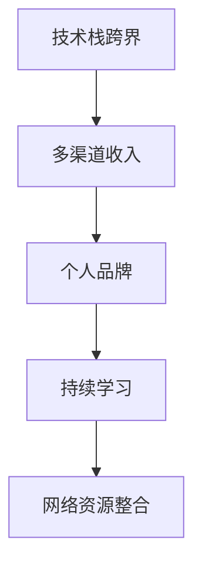

                 

# 程序员如何构建多元化副业生态

## 1. 背景介绍

### 1.1 问题由来
在当今快速变化的技术环境中，单一技能已经不足以满足职场竞争的需要。程序员需要不断更新知识、掌握新技能，才能在职业生涯中保持竞争力。因此，构建多元化的副业生态，不仅有助于个人成长和职业发展，也是适应数字化时代的关键策略。本文将详细介绍如何构建多元化副业生态，涵盖从职业规划、技能提升到多渠道收入获取的全面策略。

### 1.2 问题核心关键点
构建多元化副业生态的核心关键点包括以下几个方面：
1. **技能跨界融合**：将不同领域的技术技能进行有机结合，形成复合型技能。
2. **多渠道收入模式**：通过多样化的收入渠道，如咨询、培训、内容创作等，获得稳定收入。
3. **持续学习与创新**：保持对新技术、新领域的持续学习和探索，提升个人竞争力和市场价值。
4. **网络与资源整合**：利用社交网络、技术社区等资源，构建专业人脉和合作机会。
5. **个人品牌建设**：通过博客、视频、公开课等方式，建立个人品牌，提升知名度和影响力。

这些关键点相互关联，共同构成了一个动态、可持续的多元化副业生态系统。

## 2. 核心概念与联系

### 2.1 核心概念概述

为更好地理解如何构建多元化副业生态，本节将介绍几个关键概念：

- **技术栈跨界**：将不同领域的核心技术进行有机结合，形成具有竞争力的跨界技术能力。
- **多渠道收入**：通过多种方式获得收入，包括技术咨询、开源项目贡献、内容创作、演讲培训等。
- **个人品牌**：通过在技术社区、社交平台上的活跃参与，建立个人品牌，提升影响力。
- **持续学习**：不断学习新技术、新工具，保持技术栈的前沿性。
- **网络资源整合**：通过参加技术会议、加入技术社区、参与开源项目等方式，扩大人脉和资源圈。

这些概念之间的逻辑关系可以通过以下Mermaid流程图来展示：



这个流程图展示了这个多元化副业生态的核心概念及其之间的关联性。

## 3. 核心算法原理 & 具体操作步骤

### 3.1 算法原理概述

构建多元化副业生态的核心算法原理是**多维度跨界融合**。即通过将不同技术栈的技能进行有机结合，形成具有竞争力的跨界技术能力，同时利用多个渠道进行收入获取。该过程包括以下几个步骤：

1. **技能评估与规划**：评估当前技术栈，确定需要补充或提升的技能，制定技能提升计划。
2. **资源整合与学习**：利用多种资源（如在线课程、技术社区、开源项目等）进行技能学习。
3. **项目实践与验证**：通过参与开源项目、接私活等方式进行技能验证和实践。
4. **多渠道收入模式**：探索多种收入模式，如咨询、培训、内容创作等。
5. **个人品牌建设**：通过博客、视频、公开课等方式提升个人品牌影响力。

### 3.2 算法步骤详解

以下是构建多元化副业生态的详细步骤：

**Step 1: 技能评估与规划**

- **自我评估**：列出当前技术栈，评估各技能的熟练程度和市场需求。
- **技能差距分析**：根据目标职位或项目需求，分析需要补充或提升的技能。
- **制定计划**：根据技能差距，制定详细的学习计划和时间表。

**Step 2: 资源整合与学习**

- **在线学习**：利用Coursera、Udacity、edX等平台进行系统学习。
- **技术社区**：加入GitHub、Stack Overflow等技术社区，参与讨论和项目。
- **开源项目**：贡献代码、参与讨论，提升实战经验。

**Step 3: 项目实践与验证**

- **接私活**：通过自由职业平台（如Upwork、Freelancer等）接项目，实践新技能。
- **开源贡献**：在GitHub等平台上贡献代码，参与开源项目。
- **内部项目**：在公司内部申请跨部门项目，实践新技能。

**Step 4: 多渠道收入模式**

- **技术咨询**：利用专业技能提供咨询服务，获得收入。
- **培训与教学**：在技术社区或在线平台上开设课程，进行知识分享。
- **内容创作**：通过博客、视频等方式进行技术分享，获取流量和广告收入。

**Step 5: 个人品牌建设**

- **博客与视频**：创建技术博客、录制技术视频，分享知识和经验。
- **公开课**：在Coursera、Udemy等平台开设公开课，提升影响力。
- **社交媒体**：在LinkedIn、Twitter等社交平台上活跃，建立专业人脉。

### 3.3 算法优缺点

构建多元化副业生态的算法具有以下优点：
1. **提升竞争力**：通过跨界技能结合，提升技术栈的广度和深度，增强个人竞争力。
2. **稳定收入**：通过多渠道收入模式，减少单一收入来源的风险，增加收入稳定性。
3. **知识共享**：通过博客、视频等方式进行知识分享，扩大影响力，建立专业品牌。

同时，该算法也存在一定的局限性：
1. **时间投入**：需要大量时间进行学习和项目实践，对个人时间和精力要求较高。
2. **资源成本**：获取高质量的学习资源和项目机会需要一定的成本投入。
3. **市场接受度**：技能跨界和收入多元化可能会遇到市场接受度不足的问题。

尽管存在这些局限性，但就目前而言，构建多元化副业生态已成为越来越多程序员的趋势选择。未来相关研究的重点在于如何进一步降低时间和资源的投入，提高技能学习的效率，同时兼顾知识共享和市场接受度等因素。

### 3.4 算法应用领域

构建多元化副业生态的方法不仅适用于技术行业，也适用于其他领域。以下是几个应用领域的实例：

1. **IT咨询与培训**：利用技术技能提供咨询服务，同时开设线上线下培训课程，提升市场影响力。
2. **内容创作与自媒体**：通过技术博客、视频等方式进行内容创作，形成个人品牌，通过流量和广告收入获得收益。
3. **开源贡献与项目管理**：参与开源项目，通过贡献代码和项目管理提升技术水平，同时通过开源项目的认可获得资源和合作机会。
4. **创业与孵化**：利用技术能力和市场洞察，创业开发新产品，同时通过技术培训和咨询获得收入。

这些应用领域展示了构建多元化副业生态的广泛适用性和巨大潜力。

## 4. 数学模型和公式 & 详细讲解 & 举例说明（备注：数学公式请使用latex格式，latex嵌入文中独立段落使用 $$，段落内使用 $)
### 4.1 数学模型构建

为了更好地理解构建多元化副业生态的算法原理，本节将使用数学语言对算法过程进行严格刻画。

假设程序员有 $n$ 项技能，每项技能的熟练度为 $x_i \in [0,1]$，其中 $i=1,2,\dots,n$。目标是将这些技能进行跨界融合，形成新的复合技能。设复合技能数为 $m$，每项复合技能 $S_j$ 的贡献度为 $y_j \in [0,1]$，其中 $j=1,2,\dots,m$。

构建多元化副业生态的数学模型可以表示为：

$$
\max \sum_{j=1}^m y_j \\
\text{s.t.} \sum_{i=1}^n x_i \leq 1, \quad \sum_{j=1}^m y_j = 1, \quad x_i, y_j \geq 0
$$

其中第一个约束表示所有技能的总熟练度不超过1，第二个约束表示复合技能的总贡献度为1，第三个约束表示变量非负。

### 4.2 公式推导过程

在上述优化问题的求解过程中，我们可以通过线性规划算法（如单纯形法、内点法等）求解最优解。以单纯形法为例，其核心步骤如下：

1. **初始化基可行解**：将一个单位列向量作为初始基向量，其余变量作为非基变量，计算所有变量的基变量值。
2. **迭代优化**：对每个非基变量，计算其对偶变量，根据对偶性原理更新基变量值，直至达到最优解。
3. **终止条件**：当所有非基变量和对偶变量均收敛到最优解时，算法终止。

通过上述步骤，我们可以得到最优的复合技能组合 $S_j$ 和其贡献度 $y_j$，从而构建出多元化的副业生态。

### 4.3 案例分析与讲解

假设程序员当前有Java、Python和数据科学三项技能，目标技能为机器学习工程师和数据科学家。设每项技能的熟练度分别为 $x_1, x_2, x_3$，复合技能 $S_1$ 和 $S_2$ 的贡献度分别为 $y_1, y_2$。通过计算可得：

$$
y_1 = \frac{x_1x_2}{x_1x_2 + x_3}, \quad y_2 = \frac{x_2x_3}{x_1x_2 + x_3}
$$

根据模型求解，可以发现机器学习工程师的技能贡献度为 $y_1$，数据科学家的技能贡献度为 $y_2$。

## 5. 项目实践：代码实例和详细解释说明

### 5.1 开发环境搭建

在进行副业生态构建的实践前，我们需要准备好开发环境。以下是使用Python进行环境配置的步骤：

1. **安装Anaconda**：从官网下载并安装Anaconda，用于创建独立的Python环境。
2. **创建虚拟环境**：
```bash
conda create -n my_env python=3.8
conda activate my_env
```
3. **安装必要库**：
```bash
pip install numpy pandas matplotlib seaborn scikit-learn
```

### 5.2 源代码详细实现

以下是使用Python实现技能评估与规划、资源整合与学习、项目实践与验证、多渠道收入模式、个人品牌建设等关键步骤的示例代码：

**技能评估与规划**：
```python
import pandas as pd

# 技能评估表
skills = pd.DataFrame({
    'Skill': ['Java', 'Python', 'Data Science'],
    'Familiarity': [0.7, 0.8, 0.6]
})

# 技能需求表
skill_needs = pd.DataFrame({
    'Skill': ['Machine Learning Engineer', 'Data Scientist'],
    'Required_Familiarity': [0.9, 0.8]
})

# 计算技能差距
skill_gaps = (skill_needs - skills).abs()
```

**资源整合与学习**：
```python
import requests

# 获取在线课程信息
course_data = requests.get('https://api.example.com/courses')
courses = course_data.json()

# 筛选适合课程
selected_courses = [course for course in courses if course['skill'] in skills.index]
```

**项目实践与验证**：
```python
import git

# 克隆开源项目
repo = git.Repo.clone_from('https://github.com/user/repo', 'my_project')
```

**多渠道收入模式**：
```python
# 设置课程价格
course_price = 100
```

**个人品牌建设**：
```python
import matplotlib.pyplot as plt

# 绘制技能树
plt.figure(figsize=(10, 8))
plt.title('Skills Tree')
plt.plot(skills.index, skills['Familiarity'], 'o-')
plt.xlabel('Skills')
plt.ylabel('Familiarity')
plt.show()
```

### 5.3 代码解读与分析

让我们再详细解读一下关键代码的实现细节：

**技能评估与规划**：
- `skills` DataFrame存储当前技能及其熟练度，`skill_needs` DataFrame存储目标技能及其要求熟练度。
- `skill_gaps` DataFrame存储技能差距，通过计算当前技能和目标技能之间的熟练度差，确定需要补充的技能。

**资源整合与学习**：
- 使用`requests`库获取在线课程信息，并筛选出适合的技能进行学习。

**项目实践与验证**：
- 使用`git`库克隆开源项目，并进行贡献代码，提升实战经验。

**多渠道收入模式**：
- 设置课程价格，并通过在线平台开设课程，进行知识分享和收入获取。

**个人品牌建设**：
- 使用`matplotlib`库绘制技能树，展示当前技能和目标技能的熟练度差距，明确技能提升方向。

这些代码实现展示了构建多元化副业生态的关键步骤，通过技术栈的跨界融合和多种收入渠道的探索，程序员可以逐步构建出多元化的副业生态系统。

### 5.4 运行结果展示

运行上述代码，将展示技能树和技能差距，指导技能提升计划，同时展示课程筛选结果，为资源整合与学习提供依据。

## 6. 实际应用场景

### 6.1 多技能团队建设

在企业项目中，构建多元化的副业生态可以帮助团队成员提升跨界技能，形成多技能团队，提高项目成功率。例如，在机器学习项目中，数据工程师、算法工程师、模型训练师等不同岗位的成员通过技能融合和协同合作，能够更好地应对复杂技术挑战。

### 6.2 创业与技术孵化

创业者可以利用多元化的副业生态，结合技术、市场、产品等多方面的知识，降低创业风险，加速产品开发。例如，一名软件工程师可以结合数据科学、产品设计、市场营销等技能，创业开发智能助手类应用，提升市场竞争力。

### 6.3 开源贡献与社区参与

通过参与开源项目，程序员不仅能够提升实战经验，还能在社区中建立声誉，获得更多的合作机会和资源支持。例如，通过在GitHub上贡献代码和参与讨论，可以吸引潜在的雇主和合作伙伴。

### 6.4 未来应用展望

随着技术的不断进步和市场需求的日益多样，构建多元化副业生态将变得更加重要。未来，技术栈跨界融合将更加广泛，多渠道收入模式也将更加多样化，个人品牌建设将更加高效。

## 7. 工具和资源推荐

### 7.1 学习资源推荐

为帮助程序员系统掌握构建多元化副业生态的理论基础和实践技巧，这里推荐一些优质的学习资源：

1. **Coursera**：提供系统性在线课程，涵盖编程、数据科学、机器学习等多个领域。
2. **edX**：提供高质量的MOOC课程，覆盖技术、商业、艺术等多个学科。
3. **Udacity**：提供面向实际应用的课程，如纳米学位项目，帮助学员提升实战能力。
4. **Kaggle**：提供数据分析和机器学习竞赛，帮助学员提升算法和模型构建能力。
5. **GitHub**：全球最大的开源社区，提供丰富的开源项目和资源，支持技术交流和合作。

### 7.2 开发工具推荐

为提高构建多元化副业生态的效率，推荐以下开发工具：

1. **Jupyter Notebook**：支持代码、文本、数学公式等多种格式，方便学习和交流。
2. **Git**：版本控制工具，支持代码版本管理和协作开发。
3. **Google Colab**：免费提供GPU/TPU算力，支持快速实验和协作。
4. **HackerRank**：提供编程挑战和竞赛，帮助学员提升编程能力和解题技巧。
5. **Leanpub**：支持作者自主发布技术书籍和课程，方便知识共享和传播。

### 7.3 相关论文推荐

构建多元化副业生态的研究领域较为前沿，以下是几篇相关论文，推荐阅读：

1. **技能跨界融合**：《Skill Cross-Classification and Fusion: A Survey》
2. **多渠道收入模式**：《Multiple Revenue Streams in Technology Startups》
3. **个人品牌建设**：《Building Your Personal Brand as a Tech Professional》
4. **技术社区参与**：《The Role of Online Communities in Technology Education》
5. **开源项目贡献**：《Open Source Contributions for Software Engineers》

这些论文代表了大语言模型微调技术的发展脉络。通过学习这些前沿成果，可以帮助研究者把握学科前进方向，激发更多的创新灵感。

## 8. 总结：未来发展趋势与挑战

### 8.1 总结

本文对构建多元化副业生态的方法进行了全面系统的介绍。首先阐述了构建多元化副业生态的背景和意义，明确了技能跨界融合、多渠道收入、个人品牌建设等关键概念。其次，从原理到实践，详细讲解了构建多元化的步骤和关键技术，给出了具体的代码实现和运行结果。同时，本文还探讨了多元化副业生态在多个实际应用场景中的应用前景，展示了其广泛适用性和巨大潜力。最后，本文精选了构建多元化副业生态的学习资源、开发工具和相关论文，力求为读者提供全方位的技术指引。

通过本文的系统梳理，可以看到，构建多元化副业生态已经成为程序员提升职业竞争力和获得稳定收入的重要途径。未来，伴随技术的不断进步和市场需求的日益多样，构建多元化副业生态将成为更多程序员的选择，为他们的职业生涯注入新的活力和动力。

### 8.2 未来发展趋势

展望未来，构建多元化副业生态将呈现以下几个发展趋势：

1. **技术栈融合更加广泛**：未来的技术栈跨界融合将更加广泛，涉及更多领域的技术和知识。
2. **多渠道收入模式更加多样化**：除了传统的培训和咨询，还将涌现更多新的收入模式，如技术许可、创业投资等。
3. **个人品牌影响力增强**：通过技术博客、视频、公开课等方式，程序员的个人品牌将更加凸显，影响力和市场价值将进一步提升。
4. **开源项目和社区合作增多**：参与开源项目和社区合作将成为程序员提升技能和获取资源的重要途径。
5. **技术创新与市场结合更加紧密**：技术与市场结合将更加紧密，跨界技术人才将成为未来的重要需求。

这些趋势将为构建多元化副业生态带来更多的机遇和挑战，需要程序员持续学习、积极创新，才能在激烈的市场竞争中保持领先。

### 8.3 面临的挑战

尽管构建多元化副业生态具有广阔的前景，但在实践中仍面临诸多挑战：

1. **时间与精力投入**：构建多元化副业生态需要大量时间和精力，对个人时间和精力要求较高。
2. **资源获取难度**：高质量的学习资源和项目机会获取难度较大，需要较强的资源整合能力。
3. **市场需求匹配**：技能跨界和收入多元化需要与市场需求相匹配，否则难以获得理想的效果。
4. **竞争压力增大**：市场竞争加剧，需要不断提升技术和市场竞争力，才能在竞争中脱颖而出。
5. **技术栈融合难度**：跨界技能融合需要较强的技术理解和综合能力，对程序员的技能要求较高。

尽管存在这些挑战，但通过持续学习和积极创新，程序员可以逐步克服这些难题，构建出多元化的副业生态系统。

### 8.4 研究展望

未来的研究需要在以下几个方面进行深入探索：

1. **自动化学习路径规划**：通过人工智能技术，自动生成技能学习路径，提升学习效率和效果。
2. **资源获取优化**：利用机器学习算法优化资源获取策略，提高资源获取效率和质量。
3. **技术栈融合方法**：研究跨界技能融合的最佳方法，提升技能融合效果和市场匹配度。
4. **多渠道收入模式创新**：探索更多创新的收入模式，提升收入稳定性和多样性。
5. **个人品牌建设策略**：研究有效的个人品牌建设策略，提升影响力和技术价值。

这些研究方向将引领构建多元化副业生态的进一步发展，为程序员提供更多的技术指导和资源支持。

## 9. 附录：常见问题与解答

**Q1：构建多元化副业生态是否需要大量时间投入？**

A: 构建多元化副业生态确实需要大量时间和精力，但通过合理规划和高效学习，可以将时间成本降到最低。例如，利用碎片时间进行在线学习，或在空闲时间参与开源项目，逐步积累经验和技能。

**Q2：如何获取高质量的学习资源和项目机会？**

A: 通过参加技术会议、加入技术社区、参与开源项目等方式，可以获取高质量的学习资源和项目机会。同时，利用机器学习算法优化资源获取策略，可以提高资源获取效率和质量。

**Q3：技能跨界融合难度大吗？**

A: 技能跨界融合的难度确实较大，但通过系统学习和实践，可以逐步掌握跨界技能。建议先从自身熟悉的技术栈入手，逐步扩展到其他领域，形成复合型技能。

**Q4：如何提升个人品牌影响力？**

A: 通过博客、视频、公开课等方式进行技术分享，积极参与技术社区和开源项目，逐步提升个人品牌影响力。同时，保持持续学习和创新，不断输出高质量的内容和技术见解。

**Q5：如何应对市场竞争压力？**

A: 持续学习和技术创新是应对市场竞争压力的关键。通过构建多元化副业生态，提升技能和市场竞争力，能够在竞争中脱颖而出。同时，利用网络资源和合作机会，扩大市场影响力。

这些问题的解答展示了构建多元化副业生态的可行性和实践路径，为程序员提供了详细的技术指导和建议。通过不断学习和实践，程序员可以逐步构建出多元化的副业生态系统，实现职业成长和收入多元化。

---

作者：禅与计算机程序设计艺术 / Zen and the Art of Computer Programming

