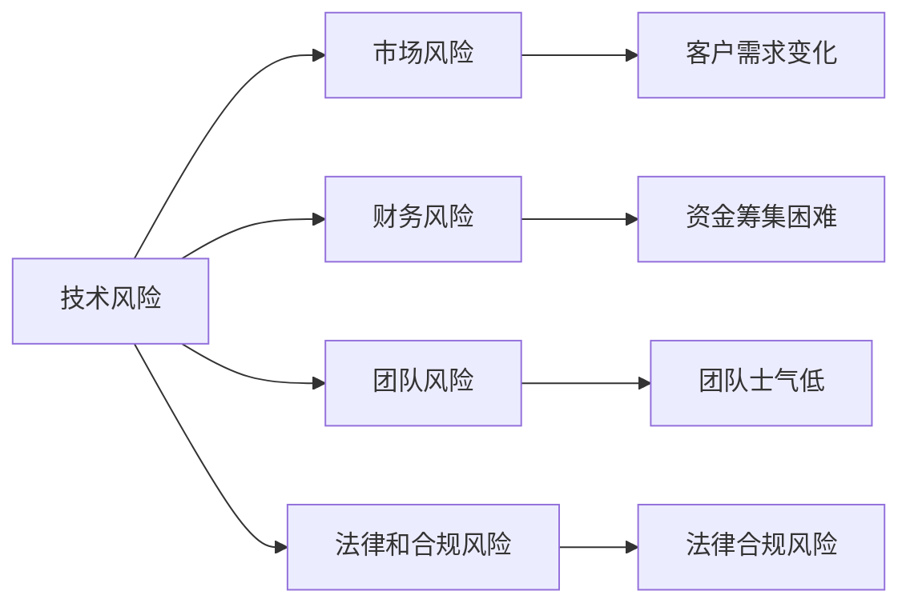

                 

# 程序员如何评估创业风险

## 1. 背景介绍

在当今快速变化的商业环境中，创新和速度成为了决定企业成败的关键因素。然而，创业并不总是线性增长的，它充满了不确定性和风险。作为一名程序员，你可能会在技术创业的浪潮中找到自己的位置。为了在复杂多变的环境中做出明智的决策，你需要学会评估创业风险。本文将探讨程序员在创业过程中应考虑的关键因素，并提供实用的方法和工具来评估这些风险。

## 2. 核心概念与联系

### 2.1 核心概念概述

评估创业风险是一个涉及多方面因素的复杂过程。以下是一些核心概念及其相互关系：

- **技术风险**：技术开发过程中可能遇到的难题，如技术可行性、技术成熟度、技术实施难度等。
- **市场风险**：市场接受度、竞争环境、客户需求变化等。
- **财务风险**：资金筹集、成本控制、盈利模式等。
- **团队风险**：团队构成、成员技能、领导能力等。
- **法律和合规风险**：知识产权、法律责任、合规性要求等。

这些风险相互交织，形成一个复杂的风险网络。理解这些概念及其相互联系，有助于全面评估创业风险。

### 2.2 核心概念原理和架构的 Mermaid 流程图



这个流程图展示了技术风险与其他风险之间的关系，以及如何通过不同的途径影响其他风险领域。

## 3. 核心算法原理 & 具体操作步骤

### 3.1 算法原理概述

评估创业风险涉及定量和定性分析。定量分析主要基于数据和统计模型，定性分析则侧重于专家意见和情境分析。本文将介绍一种基于风险矩阵的评估方法，这种方法将风险分为不同的类别，并结合量化指标进行综合评估。

### 3.2 算法步骤详解

1. **确定风险因素**：列出可能影响创业的关键因素，如技术成熟度、市场规模、竞争对手等。

2. **量化风险等级**：对每个风险因素进行打分，通常使用0到10的评分系统，0表示完全没有风险，10表示极端的风险。

3. **计算风险矩阵**：将所有风险因素按其影响程度和概率绘制在矩阵中，风险矩阵可以帮助识别哪些风险最为关键。

4. **综合评估**：结合专家意见和市场数据，对风险矩阵进行综合评估，确定最需要关注的领域。

5. **制定应对策略**：根据评估结果，制定相应的风险管理策略，如技术迭代、市场推广、资金筹集等。

### 3.3 算法优缺点

**优点**：
- 量化风险等级，使得风险评估更加客观。
- 结合专家意见和市场数据，提供多角度的评估视角。
- 简化了风险管理的决策过程。

**缺点**：
- 需要大量数据和专家意见，评估成本较高。
- 定性分析的主观性可能导致评估结果不准确。
- 风险矩阵可能需要不断的调整和更新，以适应变化的环境。

### 3.4 算法应用领域

这种风险评估方法广泛应用于技术创业、金融投资、项目管理等多个领域。特别是在技术创业中，可以帮助初创公司识别和应对关键的技术、市场和财务风险，制定科学合理的战略规划。

## 4. 数学模型和公式 & 详细讲解 & 举例说明

### 4.1 数学模型构建

设有一个创业项目，涉及n个风险因素，每个风险因素的评分表示为$R_i$，其中$i=1,2,...,n$。风险等级由评分和概率共同决定，假设风险概率为$p_i$。则风险矩阵的构建公式为：

$$
R = \begin{bmatrix}
R_{1,1} & R_{1,2} & \cdots & R_{1,n} \\
R_{2,1} & R_{2,2} & \cdots & R_{2,n} \\
\vdots & \vdots & \ddots & \vdots \\
R_{n,1} & R_{n,2} & \cdots & R_{n,n}
\end{bmatrix}
$$

其中$R_{i,j} = R_i \times p_j$，表示风险因素$i$在情况$j$下的影响程度。

### 4.2 公式推导过程

根据风险矩阵，计算每个风险的加权平均风险等级$L$，公式为：

$$
L = \frac{\sum_{i=1}^{n} \sum_{j=1}^{m} R_{i,j} p_j}{\sum_{i=1}^{n} p_i}
$$

其中$m$表示可能的场景数。

### 4.3 案例分析与讲解

假设一个初创项目涉及三个关键风险因素：技术可行性、市场接受度和财务可持续性。通过专家打分和市场数据，我们得到以下评分和概率：

| 风险因素 | 评分 | 概率 |
| --- | --- | --- |
| 技术可行性 | 6 | 0.3 |
| 市场接受度 | 8 | 0.5 |
| 财务可持续性 | 7 | 0.2 |

根据风险矩阵公式，计算每个风险的加权平均风险等级$L$：

$$
L_{技术} = 6 \times 0.3 = 1.8
$$
$$
L_{市场} = 8 \times 0.5 = 4.0
$$
$$
L_{财务} = 7 \times 0.2 = 1.4
$$

最终，项目的加权平均风险等级为：

$$
L = \frac{1.8 + 4.0 + 1.4}{1.0} = 3.2
$$

结合专家意见和市场数据，我们可以确定项目的技术可行性为中等风险，市场接受度为高风险，财务可持续性为中等风险。根据这些信息，制定相应的风险管理策略，如加强技术研发、提高市场推广力度、控制财务成本等。

## 5. 项目实践：代码实例和详细解释说明

### 5.1 开发环境搭建

为了进行风险评估，我们需要一个计算平台。这里建议使用Python环境，因为Python具有丰富的数据分析和机器学习库。

1. 安装Python：可以从Python官网下载安装包，进行安装。
2. 安装必要的库：安装numpy、pandas、matplotlib等数据处理和可视化库。
3. 编写风险评估代码：以下是一个简单的示例代码，用于计算加权平均风险等级。

### 5.2 源代码详细实现

```python
import numpy as np
import pandas as pd

# 风险因素评分和概率
scores = np.array([6, 8, 7])
probabilities = np.array([0.3, 0.5, 0.2])

# 计算加权平均风险等级
L = np.average(np.outer(scores, probabilities))

print("项目的加权平均风险等级为：", L)
```

### 5.3 代码解读与分析

这段代码使用了numpy库来计算加权平均风险等级。首先定义了风险因素的评分和概率数组，然后使用numpy的`outer`函数计算风险矩阵，最后使用`average`函数计算加权平均风险等级。代码简洁明了，易于理解。

### 5.4 运行结果展示

运行上述代码，输出结果为：

```
项目的加权平均风险等级为： 3.2
```

这表明项目的整体风险等级为中等水平，需要采取相应的风险管理措施。

## 6. 实际应用场景

### 6.1 技术创业

技术创业是程序员创业的主要方向之一。在技术创业过程中，评估技术风险尤为重要。以下是一些具体的应用场景：

- **技术可行性评估**：通过原型开发和测试，评估技术的可行性，识别技术瓶颈和潜在问题。
- **技术路线图制定**：根据技术风险评估结果，制定合理的技术路线图，避免盲目投入。
- **技术迭代和优化**：根据用户反馈和技术进展，不断迭代和优化技术方案。

### 6.2 金融投资

金融投资也涉及到风险评估，特别是量化风险和市场风险的评估。以下是一些具体的应用场景：

- **资产组合管理**：评估不同资产的风险和回报，制定合理的投资组合策略。
- **风险对冲**：通过衍生品等工具，对冲市场风险，保护投资安全。
- **风险预警**：实时监测市场变化，及时预警潜在风险，避免重大损失。

### 6.3 项目管理

项目管理中风险评估同样重要，特别是在多团队协作的项目中。以下是一些具体的应用场景：

- **项目优先级排序**：根据风险评估结果，确定项目的优先级，优化资源配置。
- **风险监控和报告**：建立风险监控机制，定期报告项目风险状态，及时调整策略。
- **风险应对计划**：制定详细的风险应对计划，降低项目实施过程中的不确定性。

## 7. 工具和资源推荐

### 7.1 学习资源推荐

1. **《风险管理》课程**：一些知名大学和机构提供的风险管理课程，如Coursera、edX等平台上的课程。
2. **《风险评估与管理》书籍**：详细介绍了风险评估的方法和工具，如HERM、OPM3等。
3. **《数据科学入门》课程**：学习数据分析和机器学习的基础知识，为风险评估提供技术支持。

### 7.2 开发工具推荐

1. **Python**：强大的数据分析和机器学习环境，支持丰富的第三方库和框架。
2. **Jupyter Notebook**：交互式的数据分析和代码实现平台，便于数据可视化。
3. **Tableau**：强大的数据可视化工具，用于生成风险评估报告。

### 7.3 相关论文推荐

1. **《创业风险评估研究综述》**：详细介绍了创业风险评估的方法和应用，提供了丰富的文献资源。
2. **《金融风险量化评估方法》**：介绍了金融风险的量化评估方法和工具，提供了实际应用案例。
3. **《项目管理中的风险评估》**：介绍了项目管理中风险评估的实践经验和方法。

## 8. 总结：未来发展趋势与挑战

### 8.1 研究成果总结

本文探讨了程序员在创业过程中应考虑的关键风险因素，并介绍了一种基于风险矩阵的风险评估方法。通过实例演示，展示了该方法的应用过程和结果。

### 8.2 未来发展趋势

1. **自动化风险评估**：随着人工智能和机器学习技术的发展，风险评估将逐步实现自动化。
2. **跨领域风险评估**：不同领域之间的风险评估方法和工具将逐步整合，形成统一的评估框架。
3. **实时风险监控**：实时监测和预警系统将帮助企业和投资者及时应对突发风险。

### 8.3 面临的挑战

1. **数据获取难度**：高质量的数据获取和处理仍然是一个挑战，特别是在技术创业中。
2. **模型复杂性**：复杂的多维风险评估模型需要大量的计算资源和时间。
3. **方法适用性**：不同领域和应用场景的风险评估方法可能存在差异，需要灵活应用。

### 8.4 研究展望

未来的研究将集中在以下几个方面：
1. **自动化工具的开发**：开发自动化风险评估工具，减少人工干预和误差。
2. **多模态数据融合**：将文本、图像、音频等多模态数据进行融合，提高风险评估的准确性和全面性。
3. **深度学习应用**：利用深度学习技术，进行更复杂的风险评估和预测。

总之，创业风险评估是一个复杂但至关重要的过程。通过理解和应用本文介绍的评估方法，程序员可以更好地识别和管理创业中的各类风险，提升创业成功率。

## 9. 附录：常见问题与解答

**Q1：如何选择合适的风险评估方法？**

A: 选择合适的风险评估方法需要考虑多个因素，如数据类型、评估对象、资源限制等。常见的方法包括风险矩阵、蒙特卡洛模拟、多层次分析法等。需要根据具体情况进行选择。

**Q2：如何处理不确定性风险？**

A: 不确定性风险是指难以定量评估的风险，如市场变化、政策变动等。可以采用专家意见、情景分析、敏感性分析等方法来评估和处理不确定性风险。

**Q3：如何平衡风险和收益？**

A: 风险和收益通常是相互关联的，需要根据具体情况进行权衡。可以采用风险收益矩阵等工具，帮助决策者制定最优的决策策略。

**Q4：如何应对突发事件？**

A: 突发事件难以预测，需要建立应急响应机制，及时调整风险管理策略。可以在评估过程中预留应急预算，制定应急预案。

**Q5：如何持续改进风险评估？**

A: 风险评估是一个动态的过程，需要根据实际情况不断改进和优化。可以建立风险评估反馈机制，定期评估风险管理效果，进行调整。

通过不断学习和实践，相信程序员可以在创业过程中更好地识别和管理风险，提升创业成功率。

