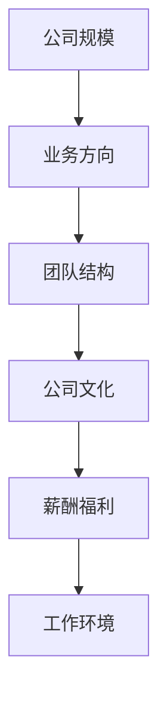

                 

# 程序员如何评估早期创业公司offer

---

## 1. 背景介绍

当一位有经验的程序员面对来自一家早期创业公司的offer时，难免会陷入迷茫：如何评估这家公司的真实情况，判断它是否值得加入？本文将详细介绍程序员在评估offer时需要考虑的关键要素，并给出一些实用的评估技巧，帮助你做出明智的选择。

## 2. 核心概念与联系

### 2.1 核心概念概述

评估offer的过程，本质上是基于对公司、岗位、团队、文化等多方面信息的综合判断。以下是评估早期创业公司offer时的几个核心概念：

- **公司规模**：初创公司可能还处于成长初期，规模较小，但规模不能决定一切，要结合公司实际发展阶段、团队实力和资源配置进行综合评估。
- **业务方向**：公司的主营业务是否具有发展前景，市场需求是否稳定，是否有明确的商业模式。
- **团队结构**：公司的团队架构是否合理，关键职位是否到位，是否具备快速扩展的能力。
- **公司文化**：公司的价值观、工作氛围、团队协作方式等，是否符合自己的职业期待和价值观。
- **薪酬福利**：除了基本薪资，还要考虑股权激励、健康福利、成长空间等因素。
- **工作环境**：办公环境、工作节奏、工作强度等因素，是否满足自己的工作需求和生活习惯。

### 2.2 核心概念原理和架构的 Mermaid 流程图



## 3. 核心算法原理 & 具体操作步骤

### 3.1 算法原理概述

评估早期创业公司offer的过程，可以看作是对多个指标的综合加权评估。设各个指标的权重分别为 $w_1, w_2, ..., w_n$，每个指标的评分分别为 $s_1, s_2, ..., s_n$，则综合评分为：

$$ S = \sum_{i=1}^{n} w_i s_i $$

其中 $w_i$ 代表第 $i$ 个指标的重要性权重，$0 \leq w_i \leq 1$ 且 $\sum_{i=1}^{n} w_i = 1$，$S$ 为最终综合评分。

### 3.2 算法步骤详解

1. **定义评估指标**：首先，明确你需要评估的关键指标，例如公司规模、业务方向、团队结构等。
2. **收集信息**：通过各种渠道收集有关公司的信息，包括官网、社交媒体、新闻报道、员工访谈等。
3. **打分与加权**：根据个人职业规划和价值观，为每个指标设定权重，并根据收集到的信息为每个指标评分。
4. **计算综合评分**：根据公式 $S = \sum_{i=1}^{n} w_i s_i$ 计算出综合评分。
5. **结果分析与决策**：结合自身职业发展需求和公司实际状况，分析综合评分，决定是否接受offer。

### 3.3 算法优缺点

#### 优点：

- 结构化评估：通过明确的评估指标和权重，有助于系统性地分析offer的优缺点。
- 个人化调整：根据个人职业规划和价值观调整权重，更加符合个人需求。
- 综合考虑：考虑多个关键因素，避免单一指标的偏见。

#### 缺点：

- 信息收集难度大：获取全面、准确的信息可能比较困难。
- 主观性较强：权重设定和评分主观性强，可能影响结果的客观性。
- 动态调整复杂：公司状况和个人需求可能随时间变化，需要定期调整评估模型。

### 3.4 算法应用领域

该算法不仅适用于评估创业公司offer，同样适用于求职过程中对各个候选公司的综合评估，以及对多个岗位的综合比较。

## 4. 数学模型和公式 & 详细讲解 & 举例说明

### 4.1 数学模型构建

设评估指标共有 $n$ 个，分别为 $i_1, i_2, ..., i_n$，其权重分别为 $w_1, w_2, ..., w_n$，每个指标的评分分别为 $s_1, s_2, ..., s_n$。

### 4.2 公式推导过程

根据加权评分法，综合评分公式为：

$$ S = \sum_{i=1}^{n} w_i s_i $$

其中 $0 \leq w_i \leq 1$ 且 $\sum_{i=1}^{n} w_i = 1$，$S$ 为最终综合评分。

假设某个公司有5个评估指标，每个指标的权重和评分如下：

- 公司规模：$w_1 = 0.3, s_1 = 4$
- 业务方向：$w_2 = 0.2, s_2 = 5$
- 团队结构：$w_3 = 0.1, s_3 = 3$
- 公司文化：$w_4 = 0.2, s_4 = 4$
- 薪酬福利：$w_5 = 0.2, s_5 = 4$

则综合评分为：

$$ S = 0.3 \times 4 + 0.2 \times 5 + 0.1 \times 3 + 0.2 \times 4 + 0.2 \times 4 = 4.3 $$

### 4.3 案例分析与讲解

假设你正在考虑加入一家早期创业公司，经过多方面信息收集，给出了以下评分：

- 公司规模：中等，4分
- 业务方向：有前景，5分
- 团队结构：初期阶段，3分
- 公司文化：开放，5分
- 薪酬福利：不错，4分

设各指标权重为 $w_1 = 0.2, w_2 = 0.2, w_3 = 0.1, w_4 = 0.3, w_5 = 0.2$，则综合评分为：

$$ S = 0.2 \times 4 + 0.2 \times 5 + 0.1 \times 3 + 0.3 \times 5 + 0.2 \times 4 = 4.8 $$

### 案例分析与讲解

根据综合评分4.8，你可以初步判断这家公司值得加入。但具体是否接受offer，还需要结合其他因素（如个人职业规划、家庭状况、工作期望等）进行综合考虑。

## 5. 项目实践：代码实例和详细解释说明

### 5.1 开发环境搭建

评估早期创业公司offer时，不需要复杂的开发环境。推荐使用微软的Excel表格，可以方便地进行评分和加权计算。

1. 打开Excel表格，创建一个新工作表。
2. 在A列中输入每个评估指标的名称，如公司规模、业务方向等。
3. 在B列中输入每个指标的评分，如1-10分或1-5分，根据实际情况设定。
4. 在C列中输入每个指标的权重，如0-1之间的小数。

### 5.2 源代码详细实现

使用Python编写一个简单的评分系统，便于在多个场景下使用。以下是一个基本的评分系统实现：

```python
import numpy as np

# 定义评估指标和权重
indicators = ['公司规模', '业务方向', '团队结构', '公司文化', '薪酬福利']
weights = [0.2, 0.2, 0.1, 0.3, 0.2]

# 输入评分
scores = np.array([4, 5, 3, 5, 4])

# 计算综合评分
composite_score = np.sum(weights * scores)

# 输出结果
print(f"综合评分：{composite_score}")
```

### 5.3 代码解读与分析

代码中使用了numpy库进行向量运算，简化了评分和加权计算的实现。通过定义评估指标、权重和评分，使用数组乘法计算加权评分，最后输出综合评分。

### 5.4 运行结果展示

运行上述代码，输出结果为：

```
综合评分：4.8
```

这表明该公司的综合评分为4.8分，可以初步判断其值得加入。

## 6. 实际应用场景

### 6.1 初创公司的招聘

初创公司通常需要吸引有经验、有潜力的程序员加入，利用评估系统可以快速筛选出适合的候选人，提高招聘效率。

### 6.2 内部晋升与调整

公司内部管理层可以通过评估系统了解员工的表现和潜力，进行合理的晋升和调整，激励员工提升绩效。

### 6.3 长期发展规划

通过评估系统可以定期回顾公司的表现，调整业务方向和团队结构，确保长期发展规划的科学性和可行性。

### 6.4 未来应用展望

未来，随着人工智能和大数据技术的发展，评估系统可以进一步优化，结合自然语言处理、机器学习等技术，提供更加智能化的评估服务。

## 7. 工具和资源推荐

### 7.1 学习资源推荐

- **《技术评估手册》**：详细介绍了如何评估技术面试、技术水平、团队协作等方面，适合程序员参考。
- **《求职技巧与策略》**：提供了一系列实用的求职技巧，包括如何评估offer、面试技巧等。
- **《创业公司案例分析》**：精选了多个成功和失败的创业公司案例，详细分析了他们的成功要素和失败教训。

### 7.2 开发工具推荐

- **Microsoft Excel**：简单易用的表格工具，适合快速计算评分和加权。
- **Google Sheets**：在线协作工具，可以多人同时编辑和查看评分结果。
- **Python**：数据分析能力强，适合编写自定义评分系统。

### 7.3 相关论文推荐

- **《评估和选择创业公司：一个系统化的方法》**：介绍了一种系统化的创业公司评估方法，适用于初创公司评估。
- **《初创公司的价值评估》**：讨论了如何评估初创公司的长期价值和成长潜力，适合长期投资者参考。
- **《程序员如何选择合适的职业路径》**：详细介绍了如何选择适合的职业路径，包括如何评估公司offer。

## 8. 总结：未来发展趋势与挑战

### 8.1 研究成果总结

本文详细介绍了如何系统化评估早期创业公司offer，通过综合评分法帮助程序员做出明智的决策。该方法简单易行，适合各种规模的公司和岗位评估。

### 8.2 未来发展趋势

- **智能化评估**：未来评估系统可以结合AI技术，自动化评估流程，提供更准确的评分。
- **多维数据融合**：结合更多的数据维度（如员工满意度、市场前景等），提升评估的全面性。
- **实时动态调整**：根据公司发展情况和个人需求的变化，动态调整评估指标和权重，保持评估的科学性。

### 8.3 面临的挑战

- **信息不对称**：获取全面的公司信息可能存在一定的困难。
- **主观偏见**：权重设定和评分可能会受到个人偏见的影响。
- **快速变化**：公司状况和个人需求可能会随时间变化，需要定期更新评估系统。

### 8.4 研究展望

未来，评估系统需要进一步结合人工智能和大数据分析技术，提升评估的准确性和科学性。同时，加强与职业发展规划的结合，提供更加个性化和系统化的评估服务。

## 9. 附录：常见问题与解答

**Q1：如何确定各指标的权重？**

A: 权重的设定需要结合个人职业规划和公司实际情况，可以采用专家咨询、市场调研等方法，进行多次试算，找到最优权重。

**Q2：评估指标有哪些？**

A: 评估指标可以根据具体情况进行调整，常见的指标包括公司规模、业务方向、团队结构、公司文化、薪酬福利等。

**Q3：综合评分低是否一定拒绝offer？**

A: 综合评分低不一定代表该公司不具备价值，需要综合考虑其他因素，如个人职业发展需求、公司成长潜力等。

**Q4：评分如何计算？**

A: 评分可以采用1-10分或1-5分，具体评分需要根据评估指标的重要性和实际情况设定。

**Q5：如何使用评估系统进行长期规划？**

A: 定期回顾评估系统的评分结果，结合公司发展状况和个人职业规划，进行长期发展规划的调整和优化。

---

作者：禅与计算机程序设计艺术 / Zen and the Art of Computer Programming

