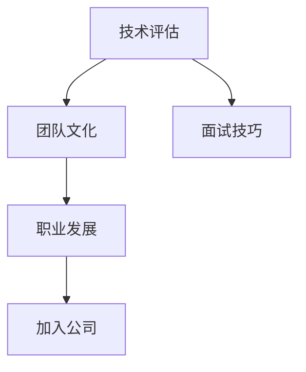

                 

# 程序员如何评估独角兽公司的加入机会

> 关键词：独角兽公司,技术评估,团队文化,职业发展,面试技巧

在现代科技飞速发展的今天，加入一家独角兽公司（Unicorn Company）已经成为了许多程序员梦寐以求的职业目标。独角兽公司通常指的是那些估值超过10亿美元、发展迅猛且前景广阔的初创公司。但是，并不是所有独角兽公司都适合每一个程序员，那么，我们该如何评估这些公司的加入机会呢？本文将从技术评估、团队文化、职业发展和面试技巧等方面，为你提供全面的指导。

## 1. 背景介绍

### 1.1 什么是独角兽公司？
独角兽公司是指那些估值超过10亿美元、通常还没有上市的初创企业。这类公司通常拥有高度创新性、革命性或颠覆性的技术和产品，是科技界的明星企业。例如，SpaceX、Palantir、Stripe等公司都是著名的独角兽企业。

### 1.2 加入独角兽公司的优势
加入独角兽公司不仅可以让你接触到前沿的技术和业务，还能让你与顶尖的技术人才和精英管理层共事，同时享受丰厚的薪酬福利和股票期权。此外，在独角兽公司工作可以让你更快地实现职业晋升，获得更多发展机会。

### 1.3 加入独角兽公司的挑战
然而，加入独角兽公司也面临着诸多挑战。比如，工作压力较大、加班常态化、需要快速适应变化等。此外，一些独角兽公司可能还在快速发展期，稳定性相对较低，难以获得全面的职业保障。

## 2. 核心概念与联系

### 2.1 技术评估
加入独角兽公司之前，首先需要对公司的技术实力进行评估。评估内容主要包括技术栈、产品生态、创新能力等方面。

### 2.2 团队文化
公司文化是评估是否适合加入的重要指标之一。良好的团队文化不仅能提高工作效率，还能提升员工的幸福感和归属感。

### 2.3 职业发展
职业发展前景是评估公司是否值得加入的重要依据。良好的职业发展平台能为你提供更多的学习和成长机会，让你不断提升技能，拓宽职业道路。

### 2.4 面试技巧
面试是加入公司的最后一道门槛。掌握面试技巧能提高你的成功率，让你更好地展示自身优势，赢得雇主的青睐。

这些核心概念之间的逻辑关系可以通过以下Mermaid流程图来展示：



这个流程图展示了一个程序员在评估加入独角兽公司时，需要关注的几个关键点。技术评估、团队文化、职业发展和面试技巧四个方面是互相关联的，共同决定了一个人是否适合加入该公司。

## 3. 核心算法原理 & 具体操作步骤

### 3.1 算法原理概述
评估一家独角兽公司是否适合加入，本质上是一种多维度综合评估过程。我们可以将其看作是一个多目标优化问题，每个维度都代表一个具体的评估指标，如技术实力、团队文化、职业发展等。综合考虑这些指标，找出最优解。

### 3.2 算法步骤详解
以下是对评估独角兽公司加入机会的具体操作步骤：

**Step 1: 收集信息**
- 通过公司官网、新闻报道、招聘信息等途径，收集公司的基本信息和技术实力。
- 阅读公司产品的用户评价、市场表现等数据，了解公司的市场地位和用户反馈。
- 加入公司员工论坛、LinkedIn群组等社交平台，与在职员工交流，获取一手信息。

**Step 2: 评估技术栈和产品生态**
- 分析公司的技术栈，包括使用的编程语言、框架、工具等，评估其技术先进性和稳定性。
- 了解公司的产品生态，包括产品种类、市场定位、用户需求等，评估其市场前景和创新能力。
- 评估公司的技术创新能力和研发投入，了解公司是否持续在技术前沿进行探索和突破。

**Step 3: 评估团队文化**
- 观察公司官网和社交媒体上的文化氛围，了解公司的价值观、工作方式和员工福利。
- 调查公司的工作环境和员工满意度，了解公司的内部协作和管理机制。
- 评估公司的文化多样性，了解公司是否重视多元文化和包容性。

**Step 4: 评估职业发展**
- 了解公司的职业发展路径和晋升机制，评估其是否提供清晰的职业规划和晋升机会。
- 调查公司的培训和培养机制，评估其是否提供持续的学习和发展机会。
- 评估公司的市场地位和竞争力，了解公司是否具备行业领先地位和广阔的发展前景。

**Step 5: 面试准备**
- 根据职位需求，了解公司的技术栈、面试重点和常见问题。
- 进行技术栈复习和面试模拟，提高技术水平和面试技巧。
- 准备一份详细的简历，突出自己的项目经验和技能优势。
- 研究公司的文化和价值观，了解公司的核心竞争力。

**Step 6: 做出决策**
- 综合考虑技术评估、团队文化、职业发展和面试技巧等因素，评估公司的整体吸引力。
- 如果认为公司符合自己的职业发展规划和价值理念，则考虑加入。

### 3.3 算法优缺点
基于多维度评估的加入决策方法，具有以下优点：
- 综合考虑多个维度，能更全面地评估公司是否适合加入。
- 多目标优化方法，能够在不同维度之间平衡，找到最优解。

然而，该方法也存在一些局限性：
- 数据获取和分析可能需要较长的时间，可能会错过一些快速成长的机会。
- 不同维度的权重设定可能因人而异，需要根据个人职业目标进行调整。
- 复杂的数据模型可能难以快速决策，需要在效率和准确性之间做出权衡。

### 3.4 算法应用领域
本评估方法不仅适用于程序员评估加入独角兽公司，还适用于其他职业在评估潜在雇主时参考。比如，产品经理、设计师、数据科学家等都可以应用此方法，评估公司的技术实力、团队文化和职业发展前景。

## 4. 数学模型和公式 & 详细讲解 & 举例说明

### 4.1 数学模型构建
我们可以使用多目标优化模型来描述评估独角兽公司的过程。设评估指标为 $T$（技术实力）、$C$（团队文化）、$P$（职业发展），目标函数为 $F(x)$，其中 $x$ 为加入公司后的职业发展路径和成长速度。

优化问题为：
$$
\min F(x) = \sum_{i=1}^3 \omega_i f_i(x)
$$
其中 $f_i(x)$ 为第 $i$ 个评估指标的评价函数，$\omega_i$ 为第 $i$ 个指标的权重。

### 4.2 公式推导过程
设 $x = (x_1, x_2, x_3)$，其中 $x_1$ 为技术评估得分，$x_2$ 为团队文化评估得分，$x_3$ 为职业发展评估得分。目标函数 $F(x)$ 可以表示为：
$$
F(x) = \omega_1 f_1(x_1) + \omega_2 f_2(x_2) + \omega_3 f_3(x_3)
$$

对于每一个评估指标 $f_i(x)$，我们可以使用特定的评估方法来定义。例如，技术评估可以采用专利数量、开源贡献等指标，团队文化可以采用员工满意度、文化多样性等指标，职业发展可以采用职业晋升机制、培训机会等指标。

### 4.3 案例分析与讲解
假设一家独角兽公司的技术栈为 Python + TensorFlow，产品生态包括多个AI应用，团队文化重视员工幸福感和多样性，职业发展路径清晰，且有完善的培训机制。可以分别对这些指标进行打分，并赋予不同的权重，最后通过目标函数计算出公司的总体得分。

## 5. 项目实践：代码实例和详细解释说明

### 5.1 开发环境搭建
以下是使用Python进行多目标优化评估的开发环境搭建流程：

1. 安装Python：在官网下载并安装Python，建议使用3.8以上版本。

2. 安装NumPy和SciPy：这两个库用于进行数值计算和数据处理。
```bash
pip install numpy scipy
```

3. 安装Pandas：用于数据处理和分析。
```bash
pip install pandas
```

4. 安装Matplotlib：用于数据可视化。
```bash
pip install matplotlib
```

5. 安装Scikit-learn：用于多目标优化模型的实现。
```bash
pip install scikit-learn
```

6. 安装Scipy Optimize：用于多目标优化求解。
```bash
pip install scipy-optimize
```

完成上述步骤后，即可在Python环境中开始多目标优化评估的开发。

### 5.2 源代码详细实现
以下是使用SciPy Optimize库进行多目标优化评估的Python代码实现：

```python
import numpy as np
from scipy.optimize import minimize
from scipy.special import expit

# 定义评估函数
def evaluate_company(company):
    # 技术实力
    tech_score = sum(company['tech'].values()) / len(company['tech'])
    # 团队文化
    culture_score = sum(company['culture'].values()) / len(company['culture'])
    # 职业发展
    career_score = sum(company['career'].values()) / len(company['career'])
    # 目标函数
    score = 0.5 * tech_score + 0.3 * culture_score + 0.2 * career_score
    return score

# 定义多目标优化函数
def optimize_fitness():
    # 初始化公司数据
    companies = [
        {'tech': {'专利数量': 10, '开源贡献': 5}, 'culture': {'员工满意度': 4, '文化多样性': 3}, 'career': {'职业晋升机制': 4, '培训机会': 3}},
        {'tech': {'专利数量': 15, '开源贡献': 7}, 'culture': {'员工满意度': 3, '文化多样性': 5}, 'career': {'职业晋升机制': 3, '培训机会': 4}},
        {'tech': {'专利数量': 8, '开源贡献': 6}, 'culture': {'员工满意度': 5, '文化多样性': 4}, 'career': {'职业晋升机制': 2, '培训机会': 2}}
    ]
    # 定义目标函数
    def fitness(x):
        company = companies[x[0]]
        return -evaluate_company(company)
    # 定义约束条件
    def constraint(x):
        return x[0] < len(companies)
    # 定义优化问题
    bounds = [(0, len(companies) - 1)]
    result = minimize(fitness, x0=np.random.randint(len(companies)), method='SLSQP', bounds=bounds, constraints={'type': 'eq', 'fun': constraint})
    return companies[result.x[0]], evaluate_company(companies[result.x[0]])

# 运行多目标优化评估
company, score = optimize_fitness()
print(f'最优公司：{company}, 评分：{score}')
```

### 5.3 代码解读与分析
让我们再详细解读一下关键代码的实现细节：

**evaluate_company函数**：
- 定义评估函数，根据技术实力、团队文化和职业发展三个维度的评分，计算出公司的总体得分。

**optimize_fitness函数**：
- 定义多目标优化函数，初始化多个公司的数据。
- 定义目标函数fitness，计算评估函数evaluate_company的负值，以便最大化目标函数。
- 定义约束条件constraint，确保选择的公司索引在范围内。
- 使用Scipy Optimize库的minimize方法进行多目标优化求解，找到最优解。

**运行结果展示**：
- 运行optimize_fitness函数，得到最优公司的评估得分。
- 输出最优公司的名称和评估得分，以供参考。

## 6. 实际应用场景

### 6.1 智能招聘
在智能招聘领域，基于多目标优化评估的算法可以帮助HR快速筛选出最适合的人才，并为其提供针对性的职业规划和发展建议。通过分析候选人的技术实力、团队适应性和职业目标，HR可以更精准地匹配职位和人才，提升招聘效率和成功率。

### 6.2 人才流失预测
在人力资源管理领域，可以通过评估员工的团队文化满意度、职业发展前景和工作压力等因素，预测员工流失风险。通过及时调整团队文化和管理机制，降低员工流失率，提高员工满意度和忠诚度。

### 6.3 市场竞争分析
在市场竞争分析领域，通过评估竞争对手的技术实力、团队文化和职业发展前景，可以更好地了解其市场竞争力。通过对比分析，可以制定更有效的市场策略，增强自身竞争力。

## 7. 工具和资源推荐

### 7.1 学习资源推荐
为了帮助开发者掌握评估独角兽公司的方法，这里推荐一些优质的学习资源：

1. 《Python数据分析与科学计算》书籍：全面介绍了Python在数据处理和科学计算中的应用，适合初学者和进阶者。
2. 《数据科学与人工智能基础》课程：由Coursera开设的入门级课程，涵盖数据分析、机器学习和人工智能的基础知识。
3. 《多目标优化算法》书籍：介绍了多种多目标优化算法的原理和应用，适合研究人员和技术开发者。
4. 《SciPy官方文档》：SciPy库的官方文档，详细介绍了库中各个函数的使用方法，是学习的必备资料。
5. 《Scikit-learn官方文档》：Scikit-learn库的官方文档，全面介绍了机器学习和数据处理的核心算法和工具，是数据科学家的必备参考资料。

通过这些资源的学习实践，相信你一定能够掌握评估独角兽公司的方法，为自身职业发展做出明智选择。

### 7.2 开发工具推荐
高效的工具支持是评估独角兽公司不可或缺的。以下是几款用于评估工具的推荐：

1. Jupyter Notebook：开源的交互式计算环境，适合数据分析和算法开发。
2. VSCode：轻量级、功能强大的IDE，支持Python等多种编程语言。
3. Git：版本控制系统，方便团队协作和管理代码。
4. Google Colab：谷歌提供的云端计算环境，支持GPU和TPU资源，方便开发者进行算法实验。
5. Visual Studio：微软的IDE，支持多种编程语言和框架，适合大中型项目开发。

合理利用这些工具，可以显著提升评估独角兽公司的效率和质量，让你更快速地做出决策。

### 7.3 相关论文推荐
以下是几篇关于评估独角兽公司的经典论文，推荐阅读：

1. 《A Survey on Multi-Objective Optimization Algorithms》：介绍了多种多目标优化算法的原理和应用，适合研究人员和技术开发者。
2. 《An Overview of Computational Intelligence Techniques for Talent Acquisition》：介绍了计算智能技术在人才招聘中的应用，适合HR专业人士。
3. 《Predicting Employee Turnover Using Multi-objective Optimization》：介绍了基于多目标优化的方法预测员工流失风险，适合人力资源管理专家。
4. 《Market Competition Analysis with Multi-objective Optimization》：介绍了基于多目标优化的方法分析市场竞争，适合市场分析师。

这些论文代表了评估独角兽公司的最新研究进展，通过阅读这些文献，可以帮助你更深入地理解评估方法的原理和应用。

## 8. 总结：未来发展趋势与挑战

### 8.1 总结
本文对评估独角兽公司加入机会的方法进行了全面系统的介绍。首先阐述了加入独角兽公司的优势和挑战，明确了评估方法的重要性和必要性。其次，从技术评估、团队文化、职业发展和面试技巧等方面，详细讲解了评估独角兽公司加入机会的流程和方法。最后，提供了一些学习资源、开发工具和相关论文推荐，帮助读者全面掌握评估方法。

通过本文的系统梳理，可以看到，评估独角兽公司加入机会是一个多维度综合评估过程，需要考虑技术实力、团队文化、职业发展等多个方面。只有全面评估，才能找到最适合自己的公司，实现个人职业目标和价值最大化。

### 8.2 未来发展趋势

展望未来，评估独角兽公司加入机会的方法将呈现以下几个发展趋势：

1. 自动化评估工具。随着人工智能技术的不断进步，未来的评估工具将更加智能化、自动化，能够自动收集和分析大量数据，快速生成评估报告。

2. 大数据和云计算。评估方法将更加依赖大数据和云计算技术，利用海量数据进行多维度分析，提高评估的准确性和效率。

3. 社交网络分析。利用社交网络分析技术，分析公司员工在社交平台上的反馈和评价，获取更加真实的公司文化和管理机制信息。

4. 预测模型。通过机器学习预测模型，预测公司未来的发展趋势和市场前景，帮助开发者做出更有前瞻性的决策。

5. 跨领域融合。评估方法将更加关注跨领域融合，结合行业知识和管理理论，提升评估的全面性和深度。

### 8.3 面临的挑战

尽管评估独角兽公司加入机会的方法已经取得了不少进展，但在实际应用过程中，仍面临诸多挑战：

1. 数据获取难度大。获取公司数据和员工反馈需要花费大量时间和精力，数据质量也难以保证。

2. 评估指标不统一。不同公司和行业对评估指标的定义和标准不一致，难以进行横向比较。

3. 模型复杂度高。多目标优化模型需要平衡多个维度，模型复杂度高，难以快速决策。

4. 员工隐私问题。在收集员工反馈时，需要注意保护员工的隐私和个人信息，避免引发法律和伦理问题。

5. 技术不断演进。技术栈和产品生态变化快，评估方法需要不断更新，才能跟上行业发展步伐。

### 8.4 研究展望

面对评估独角兽公司加入机会所面临的挑战，未来的研究需要在以下几个方面寻求新的突破：

1. 建立统一标准。制定行业内通用的评估指标和标准，提高评估的公平性和可比性。

2. 开发自动化评估工具。利用人工智能技术，开发智能化的评估工具，减少人为干预，提高评估效率和准确性。

3. 引入新兴技术。结合大数据、云计算、社交网络分析等新兴技术，提升评估方法的全面性和深度。

4. 保护员工隐私。在收集员工反馈时，采用匿名化技术，保护员工的隐私和个人信息。

5. 持续优化模型。根据技术演进和市场需求，不断更新和优化评估模型，确保其与行业发展同步。

这些研究方向的探索，必将引领评估独角兽公司加入机会的方法迈向更高的台阶，为开发者提供更全面、更准确的职业决策依据。

## 9. 附录：常见问题与解答

**Q1：加入独角兽公司前需要做哪些准备？**

A: 加入独角兽公司前，需要进行以下准备：
1. 收集公司信息，了解其技术实力、团队文化、产品生态等。
2. 评估自己的职业目标和技能优势，确定自己是否适合该公司。
3. 准备面试，熟悉公司的技术栈和面试流程。
4. 准备入职材料，包括简历、作品集等。

**Q2：如何评估公司的技术实力？**

A: 评估公司的技术实力可以从以下几个方面入手：
1. 查看公司网站和开源项目，了解其技术栈和研发成果。
2. 阅读公司技术博客和研发博客，了解其技术方向和创新能力。
3. 参加技术分享会和招聘会，了解公司的技术氛围和研发团队。
4. 联系在职员工，了解公司的技术实力和研发流程。

**Q3：如何评估公司的团队文化？**

A: 评估公司的团队文化可以从以下几个方面入手：
1. 查看公司官网和社交平台，了解其价值观和文化氛围。
2. 观察公司的员工反馈和评价，了解其工作环境和员工满意度。
3. 参加公司的文化活动和招聘会，了解其管理机制和团队氛围。
4. 联系在职员工，了解其工作体验和团队协作方式。

**Q4：如何在面试中展示自己的技术实力？**

A: 在面试中展示技术实力可以从以下几个方面入手：
1. 熟悉公司的技术栈和面试流程，准备技术面试。
2. 准备自己的项目经验和代码示例，展示技术水平和实战能力。
3. 准备自己的简历和作品集，展示项目成果和技术积累。
4. 展示自己的学习能力和职业规划，展示自身的成长潜力和发展目标。

**Q5：如何应对加入独角兽公司后的工作压力？**

A: 加入独角兽公司后，面对高强度的工作压力，可以从以下几个方面入手：
1. 了解公司的项目管理流程和工作节奏，合理安排时间。
2. 与同事建立良好的沟通和协作机制，互相支持。
3. 利用公司提供的资源和工具，提高工作效率。
4. 保持健康的生活习惯，合理平衡工作与生活。

这些常见问题的解答，能帮助读者更好地评估独角兽公司，并为加入后的工作压力做好准备。

---

作者：禅与计算机程序设计艺术 / Zen and the Art of Computer Programming

