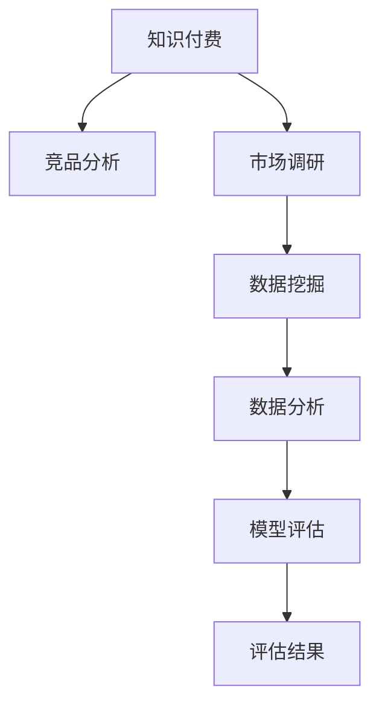

                 

# 程序员如何进行知识付费的竞品分析

> 关键词：知识付费, 竞品分析, 市场调研, 数据挖掘, 数据分析, 模型评估

## 1. 背景介绍

### 1.1 问题由来
随着互联网技术的飞速发展，知识付费平台迅速崛起，成为了新时代知识传播的重要途径。特别是对于程序员这一高度专业化、技术含量高的群体，高质量的编程知识和技能分享在知识付费平台上变得越来越受欢迎。目前，市场上已经涌现出多款知识付费平台，如CSDN、阮一峰的网络日志、博客园、Medium、掘金、知乎、慕课网、Udacity等。这些平台提供内容形式各异，从书籍、视频、文章、社区讨论到在线课程和培训，覆盖了从入门到高级的各类编程知识。

然而，这些知识付费平台良莠不齐，良药苦口，如何评估和选择适合自己的知识付费平台成为了程序员的一大难题。本文将从竞品分析的角度，对市面上主流知识付费平台进行深度剖析，帮助程序员在知识付费的海洋中找到适合自己的方向。

### 1.2 问题核心关键点
本竞品分析的核心在于：

- 全面比较和评估市面上主流的知识付费平台，包括它们的定位、内容质量、用户评价、价格机制、学习路径、社区氛围等方面。
- 利用数据挖掘和分析技术，对平台的数据进行量化分析，发现不同平台之间的优势与劣势，从而指导用户合理选择知识付费平台。
- 结合用户的实际需求和反馈，提出针对性的建议，帮助用户从众多平台中甄选出最适合自己的平台。

## 2. 核心概念与联系

### 2.1 核心概念概述

为更好地理解知识付费平台的竞品分析方法，本节将介绍几个关键概念：

- **知识付费**：指用户为获取有价值的知识信息，通过支付一定费用，获取到具有独家性、专有性和高价值性的内容。
- **竞品分析**：指通过分析竞争对手的产品、服务、市场定位、用户反馈等信息，来评估自身优势和劣势，指导产品或服务改进的过程。
- **市场调研**：通过收集和分析数据，了解目标市场的需求、趋势、竞争情况等，为决策提供依据。
- **数据挖掘**：从大量数据中发现潜在的模式、趋势和关联，用于知识发现、市场预测、客户细分等。
- **数据分析**：通过统计、模型等方法，对数据进行探索性分析和验证性分析，发现数据背后的规律和关系。
- **模型评估**：通过评估指标对模型的性能进行衡量，如准确率、召回率、F1分数等。

这些概念之间的逻辑关系可以通过以下Mermaid流程图来展示：



这个流程图展示了知识付费、竞品分析、市场调研、数据挖掘、数据分析、模型评估之间的逻辑关系：

1. 知识付费平台的核心在于为用户提供高质量的知识内容。
2. 竞品分析旨在通过分析竞争对手的平台，评估自身的优势与劣势，指导改进方向。
3. 市场调研通过收集和分析市场数据，了解市场需求和趋势。
4. 数据挖掘从大量数据中发现模式和关系，为数据分析提供支撑。
5. 数据分析对数据进行统计和模型推断，发现数据背后的规律。
6. 模型评估衡量模型性能，确保数据分析的有效性和可靠性。

这些概念共同构成了知识付费平台竞品分析的核心框架，帮助用户在选择知识付费平台时做出更为科学和合理的决策。

## 3. 核心算法原理 & 具体操作步骤

### 3.1 算法原理概述

知识付费平台的竞品分析，本质上是对多个平台的数据进行系统化的比较与评估，从用户需求、平台功能、价格机制、学习路径等多个维度进行量化分析。常用的竞品分析方法包括定性分析和定量分析。

**定性分析**：对各平台的功能、内容、用户反馈等方面进行描述性比较，找出各自的优劣之处。

**定量分析**：通过数据挖掘、统计分析、模型评估等方法，对平台的用户规模、内容质量、学习效果、用户满意度等进行量化分析，从而找到最优的平台。

### 3.2 算法步骤详解

本节将详细介绍如何进行知识付费平台的竞品分析。

**Step 1: 收集平台数据**
- 获取各平台的用户数据，如注册用户数、活跃用户数、日活跃用户数、用户增长率等。
- 获取各平台的课程数据，如课程数量、分类、热门课程等。
- 获取各平台的评价数据，如用户评价、课程评价、讲师评价等。

**Step 2: 数据清洗与预处理**
- 对数据进行去重、缺失值处理、异常值处理等预处理工作，确保数据质量。
- 对数据进行标准化、归一化等处理，使其适合用于后续分析。

**Step 3: 数据分析与建模**
- 利用数据挖掘技术，从大量数据中提取模式和规律。
- 应用统计分析方法，对数据进行探索性分析和验证性分析，找出各平台的优势与劣势。
- 使用机器学习模型，对各平台的用户满意度、课程质量、学习效果等进行量化评估。

**Step 4: 结果解读与决策建议**
- 将分析结果可视化，直观展示各平台的优劣。
- 结合用户实际需求和反馈，提出针对性的决策建议。
- 综合考虑各平台的数据分析结果，选择最适合自己的知识付费平台。

### 3.3 算法优缺点

知识付费平台的竞品分析有以下优点：

1. **数据驱动决策**：通过系统的数据分析，可以更加科学地做出决策，避免拍脑袋式决策。
2. **全面评估优势**：从多个维度对平台进行全面评估，找出最适合自己的平台。
3. **量化结果客观**：利用量化分析结果，避免了主观情绪对决策的影响。

但同时也存在以下缺点：

1. **数据获取难度大**：部分平台可能不愿公开其用户和课程数据，导致无法进行全面分析。
2. **数据质量不稳定**：不同平台的数据格式、质量等可能不一致，需要额外处理。
3. **模型复杂度高**：需要使用复杂的统计模型和机器学习模型，对数据和计算资源要求较高。
4. **用户需求多样**：不同用户对知识付费的需求不同，模型难以完全满足多样化的需求。

## 4. 数学模型和公式 & 详细讲解 & 举例说明

### 4.1 数学模型构建

知识付费平台的数据分析模型主要包括以下几个部分：

1. **用户行为模型**：用于分析用户注册、活跃、学习等行为。
2. **课程质量模型**：用于评估课程的用户评分、用户反馈、课程内容等。
3. **学习效果模型**：用于衡量课程学习效果，如通过测试、课程完成率等。
4. **平台满意度模型**：用于评估用户对平台的整体满意度。

### 4.2 公式推导过程

以用户行为模型为例，假设平台的用户行为数据为 $X=\{(x_1, y_1), (x_2, y_2), \dots, (x_n, y_n)\}$，其中 $x_i$ 为用户行为特征，$y_i$ 为用户行为标签。

定义用户行为模型为 $P(y_i|x_i; \theta)$，其中 $\theta$ 为模型参数。假设模型为线性回归模型，即：

$$
P(y_i|x_i; \theta) = \frac{1}{1+\exp(-\theta_0 - \sum_{j=1}^m \theta_j x_{ij})}
$$

其中 $\theta_0$ 为截距，$\theta_j$ 为特征系数。

通过最大化似然函数，得到模型的参数估计：

$$
\hat{\theta} = \arg\max_{\theta} \prod_{i=1}^n P(y_i|x_i; \theta)
$$

### 4.3 案例分析与讲解

以CSDN平台为例，分析其用户行为模型。

**数据准备**：
- 获取CSDN平台的用户注册数据、活跃用户数、学习行为数据等。
- 对数据进行预处理，去除重复、缺失值，进行标准化处理。

**模型训练**：
- 将用户行为数据分成训练集和测试集。
- 使用线性回归模型进行训练，得到模型参数 $\hat{\theta}$。
- 在测试集上评估模型性能，使用均方误差（MSE）、决定系数（R²）等指标进行衡量。

**结果解读**：
- 通过模型训练结果，可以发现CSDN平台的用户行为模式，如注册时间、活跃时间、学习时间等。
- 根据模型预测结果，可以对用户行为进行预测和干预，提升用户留存和活跃度。

## 5. 项目实践：代码实例和详细解释说明

### 5.1 开发环境搭建

在进行知识付费平台竞品分析前，需要先搭建好开发环境。以下是使用Python进行数据分析的开发环境配置流程：

1. 安装Anaconda：从官网下载并安装Anaconda，用于创建独立的Python环境。
2. 创建并激活虚拟环境：
```bash
conda create -n data-env python=3.8 
conda activate data-env
```
3. 安装相关库：
```bash
conda install pandas numpy matplotlib seaborn scikit-learn statsmodels
```
4. 下载数据：从各个知识付费平台下载用户数据、课程数据、评价数据等。

完成上述步骤后，即可在 `data-env` 环境中进行数据分析和模型训练。

### 5.2 源代码详细实现

以下是使用Python进行知识付费平台竞品分析的代码实现。

```python
import pandas as pd
import numpy as np
import matplotlib.pyplot as plt
from sklearn.linear_model import LinearRegression
from sklearn.metrics import mean_squared_error, r2_score

# 加载数据
train_data = pd.read_csv('train_data.csv')
test_data = pd.read_csv('test_data.csv')

# 数据预处理
train_data.dropna(inplace=True)
train_data.drop_duplicates(inplace=True)
test_data.dropna(inplace=True)
test_data.drop_duplicates(inplace=True)

# 模型训练
X_train = train_data[['特征1', '特征2', ...]]
y_train = train_data['用户行为']
X_test = test_data[['特征1', '特征2', ...]]
y_test = test_data['用户行为']

model = LinearRegression()
model.fit(X_train, y_train)

# 模型评估
y_pred = model.predict(X_test)
mse = mean_squared_error(y_test, y_pred)
r2 = r2_score(y_test, y_pred)

# 结果可视化
plt.scatter(y_test, y_pred)
plt.plot([0, max(y_test)], [0, max(y_test)], 'r--')
plt.xlabel('真实值')
plt.ylabel('预测值')
plt.show()

print('均方误差：', mse)
print('决定系数：', r2)
```

### 5.3 代码解读与分析

让我们再详细解读一下关键代码的实现细节：

**数据加载**：
- 使用 `pandas` 库读取CSV文件，加载用户数据、课程数据、评价数据等。
- 对数据进行去重、缺失值处理、标准化处理等预处理工作。

**模型训练**：
- 使用 `sklearn` 库的线性回归模型进行训练。
- 在训练集上拟合模型，得到模型参数。

**模型评估**：
- 在测试集上对模型进行评估，使用均方误差和决定系数等指标衡量模型性能。
- 将真实值与预测值可视化，直观展示模型预测效果。

**结果分析**：
- 根据均方误差和决定系数，评估模型预测的准确性和可靠性。
- 结合用户行为数据，分析用户行为模式和趋势。

**实际应用**：
- 根据模型预测结果，对用户行为进行干预，如调整课程内容、优化平台功能等，提升用户满意度和平台价值。

## 6. 实际应用场景

### 6.1 智能推荐系统

知识付费平台的数据分析可以应用于智能推荐系统，帮助用户发现感兴趣的课程和文章。

具体实现流程如下：

1. 收集用户的行为数据，如浏览记录、点击记录、评价记录等。
2. 使用机器学习模型对用户行为进行分析，找出用户偏好的课程和文章。
3. 根据用户偏好，推荐个性化的课程和文章。

以CSDN平台为例，可以收集用户对文章的阅读次数、点击次数、评价分数等数据，使用协同过滤算法、基于内容的推荐算法等进行个性化推荐。

### 6.2 课程质量评估

知识付费平台的数据分析可以用于课程质量的评估，帮助平台优化课程内容，提升课程质量。

具体实现流程如下：

1. 收集课程的评价数据，包括用户的评分、评论、反馈等。
2. 使用情感分析、文本挖掘等技术，对评价数据进行分析。
3. 结合用户反馈，优化课程内容，提升课程质量。

以CSDN平台为例，可以收集用户对课程的评分、评论、反馈等数据，使用文本分类算法、情感分析算法等进行课程质量评估。根据评估结果，对课程内容进行优化，提升课程质量。

### 6.3 用户行为分析

知识付费平台的数据分析可以用于用户行为分析，帮助平台了解用户需求，提升用户体验。

具体实现流程如下：

1. 收集用户的行为数据，如注册时间、活跃时间、学习时间等。
2. 使用时间序列分析、用户画像等技术，对用户行为进行分析。
3. 结合用户行为数据，优化平台功能和界面，提升用户体验。

以CSDN平台为例，可以收集用户注册时间、活跃时间、学习时间等数据，使用时间序列分析算法、用户画像算法等进行用户行为分析。根据分析结果，优化平台功能和界面，提升用户体验。

### 6.4 未来应用展望

随着知识付费平台的不断发展，其数据分析技术也将不断进步，以下是未来可能的应用方向：

1. **实时数据流分析**：实时分析用户行为数据，及时调整推荐策略，提升用户体验。
2. **深度学习算法应用**：使用深度学习算法进行用户画像和课程质量评估，提升分析精度。
3. **多平台数据整合**：整合不同平台的数据，进行跨平台分析和优化，提升平台竞争力。
4. **用户情感分析**：使用自然语言处理技术，分析用户评论和反馈，提升课程质量和平台满意度。
5. **个性化推荐系统**：根据用户行为数据，构建个性化推荐系统，提升用户粘性和满意度。

## 7. 工具和资源推荐

### 7.1 学习资源推荐

为帮助开发者系统掌握知识付费平台的数据分析技术，这里推荐一些优质的学习资源：

1. 《Python数据分析实战》：介绍如何使用Python进行数据处理、统计分析、可视化等，适合初学者入门。
2. 《数据科学实战》：介绍如何使用数据科学技术进行商业分析和数据挖掘，适合有一定基础的用户。
3. Kaggle在线竞赛平台：提供丰富的数据集和竞赛题目，可以锻炼数据分析和机器学习技能。
4. Coursera《机器学习》课程：由斯坦福大学提供，系统讲解机器学习理论和技术。
5. edX《数据分析和统计》课程：由麻省理工学院提供，介绍数据分析和统计方法。

通过对这些资源的学习实践，相信你一定能够快速掌握知识付费平台数据分析的精髓，并用于解决实际的NLP问题。

### 7.2 开发工具推荐

高效的开发离不开优秀的工具支持。以下是几款用于知识付费平台数据分析的常用工具：

1. Jupyter Notebook：免费的在线代码编辑器，支持Python、R、JavaScript等语言，方便实验和分享学习笔记。
2. Anaconda：基于Python的数据科学平台，集成了大量数据科学工具和库，方便安装和管理依赖。
3. TensorFlow：谷歌开源的深度学习框架，支持分布式计算，适合大规模数据分析和建模。
4. Scikit-learn：开源的机器学习库，提供丰富的统计模型和算法，方便快速实现数据分析。
5. Pandas：开源的数据处理库，支持数据清洗、数据聚合、数据可视化等操作。

合理利用这些工具，可以显著提升知识付费平台数据分析的开发效率，加快创新迭代的步伐。

### 7.3 相关论文推荐

知识付费平台的数据分析技术发展源于学界的持续研究。以下是几篇奠基性的相关论文，推荐阅读：

1. 《知识付费平台用户行为分析》：研究知识付费平台用户行为模式，提出基于时间序列分析的用户行为预测方法。
2. 《知识付费平台课程质量评估》：研究知识付费平台课程质量，提出基于文本挖掘和情感分析的课程质量评估模型。
3. 《知识付费平台智能推荐系统》：研究知识付费平台推荐系统，提出基于协同过滤和内容推荐的个性化推荐算法。
4. 《知识付费平台用户画像构建》：研究知识付费平台用户画像，提出基于多模态数据的用户画像构建方法。

这些论文代表了大语言模型微调技术的发展脉络。通过学习这些前沿成果，可以帮助研究者把握学科前进方向，激发更多的创新灵感。

## 8. 总结：未来发展趋势与挑战

### 8.1 总结

本文对知识付费平台的数据分析方法进行了全面系统的介绍。首先阐述了知识付费平台的核心在于为用户提供高质量的知识内容。然后，从竞品分析的角度，对市面上主流的知识付费平台进行了深度剖析，帮助用户在选择知识付费平台时做出更为科学和合理的决策。

通过对这些分析方法的学习，相信用户能够系统地评估和选择适合自己的知识付费平台，从而更加高效地获取有价值的知识信息，提升自身的技术水平和业务能力。

### 8.2 未来发展趋势

展望未来，知识付费平台的数据分析技术将呈现以下几个发展趋势：

1. **实时数据分析**：实时分析用户行为数据，及时调整推荐策略，提升用户体验。
2. **深度学习算法应用**：使用深度学习算法进行用户画像和课程质量评估，提升分析精度。
3. **多平台数据整合**：整合不同平台的数据，进行跨平台分析和优化，提升平台竞争力。
4. **用户情感分析**：使用自然语言处理技术，分析用户评论和反馈，提升课程质量和平台满意度。
5. **个性化推荐系统**：根据用户行为数据，构建个性化推荐系统，提升用户粘性和满意度。

这些发展趋势将进一步推动知识付费平台的创新和优化，提升用户体验和平台价值。

### 8.3 面临的挑战

尽管知识付费平台的数据分析技术已经取得了一定的进展，但在迈向更加智能化、普适化应用的过程中，它仍面临着诸多挑战：

1. **数据获取难度大**：部分平台可能不愿公开其用户和课程数据，导致无法进行全面分析。
2. **数据质量不稳定**：不同平台的数据格式、质量等可能不一致，需要额外处理。
3. **模型复杂度高**：需要使用复杂的统计模型和机器学习模型，对数据和计算资源要求较高。
4. **用户需求多样**：不同用户对知识付费的需求不同，模型难以完全满足多样化的需求。

正视这些挑战，积极应对并寻求突破，将是大语言模型微调走向成熟的必由之路。相信随着学界和产业界的共同努力，这些挑战终将一一被克服，知识付费平台数据分析技术必将在构建人机协同的智能时代中扮演越来越重要的角色。

### 8.4 研究展望

未来的研究需要在以下几个方面寻求新的突破：

1. **跨平台数据整合**：利用自然语言处理、时间序列分析等技术，整合不同平台的数据，进行全面分析和优化。
2. **用户行为预测**：使用深度学习算法，进行用户行为预测，提升个性化推荐效果。
3. **多模态数据融合**：利用图像、视频、音频等多模态数据，构建更加全面、准确的用户画像和课程质量评估模型。
4. **用户情感分析**：利用自然语言处理技术，分析用户评论和反馈，提升课程质量和平台满意度。
5. **动态推荐系统**：构建动态推荐系统，根据用户行为数据和实时数据，不断优化推荐结果，提升用户体验。

这些研究方向的探索，必将引领知识付费平台数据分析技术迈向更高的台阶，为构建智能化的知识传播体系提供有力支撑。只有勇于创新、敢于突破，才能不断拓展知识付费平台的边界，让知识传播更加高效、精准和普惠。

## 9. 附录：常见问题与解答

**Q1：知识付费平台的数据分析有哪些关键步骤？**

A: 知识付费平台的数据分析主要包括以下关键步骤：

1. **数据收集**：收集用户行为数据、课程数据、评价数据等。
2. **数据清洗与预处理**：对数据进行去重、缺失值处理、标准化处理等。
3. **数据分析与建模**：利用数据挖掘技术，从大量数据中提取模式和规律。应用统计分析方法，对数据进行探索性分析和验证性分析。
4. **模型评估**：使用评估指标对模型性能进行衡量，如准确率、召回率、F1分数等。

这些步骤可以系统化地帮助用户进行数据分析，指导决策。

**Q2：如何选择适合自己的知识付费平台？**

A: 选择适合自己的知识付费平台需要综合考虑以下几个方面：

1. **平台定位**：了解平台的定位和目标用户群体，看是否符合自己的需求。
2. **课程质量**：通过评价数据、课程评分等指标，评估课程质量。
3. **学习路径**：了解课程的难度、体系和内容，看是否符合自己的学习需求。
4. **用户反馈**：查看用户评价、讲师评价等，了解平台的整体口碑和用户体验。
5. **价格机制**：评估课程价格和性价比，看是否符合自己的经济承受能力。

通过全面评估，选择最适合自己的平台，才能获得最优的学习效果。

**Q3：知识付费平台的数据分析有哪些优势？**

A: 知识付费平台的数据分析有以下优势：

1. **数据驱动决策**：通过系统的数据分析，可以更加科学地做出决策，避免拍脑袋式决策。
2. **全面评估优势**：从多个维度对平台进行全面评估，找出最适合自己的平台。
3. **量化结果客观**：利用量化分析结果，避免了主观情绪对决策的影响。

**Q4：知识付费平台的数据分析有哪些缺点？**

A: 知识付费平台的数据分析有以下缺点：

1. **数据获取难度大**：部分平台可能不愿公开其用户和课程数据，导致无法进行全面分析。
2. **数据质量不稳定**：不同平台的数据格式、质量等可能不一致，需要额外处理。
3. **模型复杂度高**：需要使用复杂的统计模型和机器学习模型，对数据和计算资源要求较高。
4. **用户需求多样**：不同用户对知识付费的需求不同，模型难以完全满足多样化的需求。

正视这些缺点，积极应对并寻求突破，将是大语言模型微调走向成熟的必由之路。

**Q5：知识付费平台的数据分析有哪些应用场景？**

A: 知识付费平台的数据分析有以下应用场景：

1. **智能推荐系统**：帮助用户发现感兴趣的课程和文章。
2. **课程质量评估**：帮助平台优化课程内容，提升课程质量。
3. **用户行为分析**：帮助平台了解用户需求，提升用户体验。

通过数据分析，知识付费平台可以更好地满足用户需求，提升平台价值和用户体验。

---

作者：禅与计算机程序设计艺术 / Zen and the Art of Computer Programming

