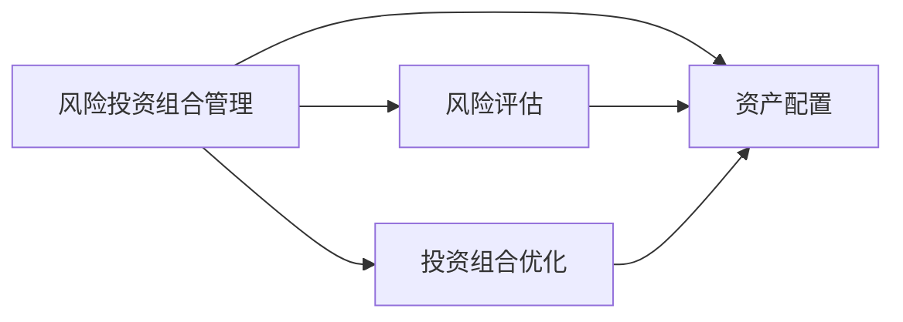

                 

# 程序员如何进行风险投资组合管理

> 关键词：风险投资组合管理,资产配置,风险评估,投资组合优化,Python编程,数据分析,机器学习

## 1. 背景介绍

在当下快速发展的科技行业，程序员不仅要在技术栈上不断精进，还需要在金融理财方面有所了解。风险投资组合管理（Risk-Investment Portfolio Management）是一门涉及金融、统计和计算机科学等多个领域的综合性知识。对程序员而言，掌握基本的风险投资组合管理知识，可以帮助他们更好地理解金融风险、优化投资收益，并在职业生涯规划中进行更明智的财务决策。本文将从核心概念、算法原理、操作步骤、数学模型等多个维度，全面讲解程序员如何进行风险投资组合管理。

## 2. 核心概念与联系

### 2.1 核心概念概述

风险投资组合管理是指通过对多个投资项目进行合理配置，以期在保证一定风险水平下实现最大收益，或在收益确定的情况下最小化风险。核心概念包括：

- **风险投资组合（Portfolio）**：由多个不同的资产或投资项目组成的集合。
- **资产配置（Asset Allocation）**：确定投资组合中各类资产的比例，以达到收益与风险的平衡。
- **风险评估（Risk Assessment）**：评估不同资产的风险水平，以便合理分配权重。
- **投资组合优化（Portfolio Optimization）**：使用数学方法优化资产配置，使得在给定风险水平下获取最大收益，或在给定收益下最小化风险。

这些概念之间有着紧密的联系。资产配置是投资组合优化的前提，而风险评估则是选择和调整资产配置的关键。投资组合优化则是在现有资产配置下，通过数学计算找到最优的资产配置策略。

### 2.2 核心概念原理和架构的 Mermaid 流程图(Mermaid 流程节点中不要有括号、逗号等特殊字符)



通过这个流程图可以看出，风险投资组合管理的核心在于合理配置资产，评估风险，并通过优化模型找到最优配置，最终实现收益与风险的平衡。

## 3. 核心算法原理 & 具体操作步骤

### 3.1 算法原理概述

风险投资组合管理的核心算法是投资组合优化，即在一定的风险水平下最大化收益，或在给定收益下最小化风险。常用的投资组合优化模型包括Markowitz模型和Black-Litterman模型等。

#### Markowitz模型

Markowitz模型（1952年）是一种基于方差的资产配置模型，通过求解组合的协方差矩阵和期望收益率矩阵，找到最优风险-收益组合。其数学形式为：

$$
\text{maximize} \quad \mathbf{r}^T \mathbf{w}
$$

$$
\text{subject to} \quad \mathbf{w}^T \mathbf{\Sigma} \mathbf{w} \leq \sigma^2
$$

其中，$\mathbf{r}$ 是资产的期望收益率向量，$\mathbf{\Sigma}$ 是协方差矩阵，$\sigma^2$ 是风险水平，$\mathbf{w}$ 是投资比例向量。

#### Black-Litterman模型

Black-Litterman模型（1992年）在Markowitz模型的基础上，引入了贝叶斯方法，利用市场均衡的假设和投资者的信念，对组合优化进行修正。其数学形式为：

$$
\mathbf{w} = \alpha \mathbf{1} + (1-\alpha) \frac{\Sigma^*}{\Lambda}
$$

其中，$\alpha$ 是投资者对市场均衡的置信度，$\Sigma^*$ 是市场均衡的协方差矩阵，$\Lambda$ 是市场均衡的协方差矩阵的对角线元素。

### 3.2 算法步骤详解

以下是使用Python和Pandas库进行Markowitz投资组合优化的详细步骤：

1. **数据准备**：获取投资项目的期望收益率、标准差以及相关性矩阵。

```python
import pandas as pd
import numpy as np
from scipy.optimize import minimize

# 假设我们有三个投资项目，期望收益率、标准差和相关性如下
expected_returns = pd.DataFrame({'Project1': [0.1, 0.2, 0.3],
                               'Project2': [0.12, 0.05, 0.08],
                               'Project3': [0.08, 0.06, 0.1]})

# 将期望收益率转换为向量
expected_returns = expected_returns.values.flatten()

# 假设三个投资项目之间的相关性矩阵
corr_matrix = np.array([[1.0, 0.5, 0.2],
                       [0.5, 1.0, 0.4],
                       [0.2, 0.4, 1.0]])

# 计算组合的协方差矩阵
w = np.array([0.3, 0.4, 0.3])
covariance_matrix = np.dot(np.dot(w, corr_matrix), w.T)
```

2. **设置优化问题**：定义目标函数和约束条件。

```python
def objective(w):
    # 计算组合的期望收益率和方差
    expected_return = np.dot(expected_returns, w)
    variance = np.dot(np.dot(w, covariance_matrix), w.T)
    return -expected_return**2 / variance

# 约束条件为总权重为1
constraints = ({'type': 'eq', 'fun': lambda w: np.sum(w) - 1})

# 初始权重向量
w0 = np.array([0.3, 0.4, 0.3])

# 进行优化求解
res = minimize(objective, w0, constraints=constraints, method='SLSQP')
```

3. **结果解释**：输出最优权重和组合的风险-收益特征。

```python
optimal_w = res.x
optimal_return = np.dot(expected_returns, optimal_w)
optimal_variance = np.dot(np.dot(optimal_w, covariance_matrix), optimal_w.T)
```

### 3.3 算法优缺点

#### 优点

- **简单易懂**：Markowitz模型和Black-Litterman模型算法简单，易于理解和实现。
- **普适性强**：这些模型适用于多种投资组合的优化，包括股票、债券、期权等。
- **风险控制**：通过优化模型，可以有效地控制投资组合的风险水平，保证收益的稳定性。

#### 缺点

- **依赖历史数据**：这些模型的性能高度依赖于历史数据的准确性，历史数据的不足或偏差可能导致模型失效。
- **计算复杂**：对于大规模资产组合，计算协方差矩阵和求解优化问题可能非常耗时。
- **假设限制**：模型假设市场是有效的、投资者风险厌恶，这些假设在某些情况下可能不成立。

### 3.4 算法应用领域

风险投资组合管理技术广泛应用于金融领域，包括但不限于：

- **个人理财**：帮助个人投资者构建最优的投资组合，平衡收益和风险。
- **企业投资**：帮助企业优化资产配置，提高资本效率。
- **养老基金**：帮助养老基金管理人实现长期投资目标，平滑收益和风险。
- **私募股权**：帮助私募基金进行投资组合配置，优化资产回报率。

## 4. 数学模型和公式 & 详细讲解 & 举例说明

### 4.1 数学模型构建

Markowitz模型的核心是投资组合的协方差矩阵和期望收益率矩阵，通过求解这两个矩阵的最优组合，得到投资组合的最优权重。

#### 期望收益率和协方差矩阵

设投资组合中n种资产的期望收益率向量为$\mathbf{r}$，协方差矩阵为$\mathbf{\Sigma}$，投资比例向量为$\mathbf{w}$，则Markowitz模型的目标函数为：

$$
\text{maximize} \quad \mathbf{r}^T \mathbf{w}
$$

$$
\text{subject to} \quad \mathbf{w}^T \mathbf{\Sigma} \mathbf{w} \leq \sigma^2
$$

其中，$\sigma^2$ 为风险水平，通常设定为投资者的风险容忍度。

### 4.2 公式推导过程

Markowitz模型的推导过程主要包括以下几个步骤：

1. **建立目标函数**：最大化投资组合的期望收益率。
2. **建立约束条件**：投资组合的总风险不超过给定水平。
3. **求解优化问题**：利用拉格朗日乘数法求解目标函数和约束条件的混合问题。

最终得到投资组合的最优权重向量$\mathbf{w}$，满足：

$$
\mathbf{w} = \frac{\mathbf{\Sigma}^{-1} \mathbf{r}}{\mathbf{\Sigma}^{-1} \mathbf{r}} \cdot \sigma^2
$$

其中，$\mathbf{\Sigma}^{-1}$ 为协方差矩阵的逆矩阵，$\sigma^2$ 为风险水平。

### 4.3 案例分析与讲解

假设有一个包含两个资产的投资组合，其期望收益率和协方差矩阵如下：

$$
\mathbf{r} = \begin{bmatrix} 0.05 \\ 0.1 \end{bmatrix}
$$

$$
\mathbf{\Sigma} = \begin{bmatrix} 0.01 & 0.02 \\ 0.02 & 0.04 \end{bmatrix}
$$

设最大风险水平为0.2，则目标函数为：

$$
\text{maximize} \quad 0.05w_1 + 0.1w_2
$$

$$
\text{subject to} \quad w_1^2 + w_2^2 \leq 0.04
$$

利用Matplotlib和SciPy库，可以绘制出不同的投资比例下的期望收益率和风险水平，并找到最优权重组合。

## 5. 项目实践：代码实例和详细解释说明

### 5.1 开发环境搭建

在进行风险投资组合管理实践前，我们需要准备好开发环境。以下是使用Python进行投资组合优化的环境配置流程：

1. **安装Anaconda**：从官网下载并安装Anaconda，用于创建独立的Python环境。

```bash
conda create -n portfolio-env python=3.8
conda activate portfolio-env
```

2. **安装Python库**：使用pip安装必要的库，如Pandas、NumPy、SciPy、Matplotlib等。

```bash
pip install pandas numpy scipy matplotlib
```

### 5.2 源代码详细实现

以下是使用Markowitz模型进行投资组合优化的Python代码实现。

```python
import pandas as pd
import numpy as np
from scipy.optimize import minimize

# 投资组合的期望收益率和协方差矩阵
expected_returns = pd.DataFrame({'Asset1': [0.05, 0.1],
                               'Asset2': [0.1, 0.15]})

# 将期望收益率转换为向量
expected_returns = expected_returns.values.flatten()

# 投资组合的协方差矩阵
covariance_matrix = np.array([[0.01, 0.02],
                             [0.02, 0.04]])

# 设置目标函数和约束条件
def objective(w):
    # 计算组合的期望收益率和方差
    expected_return = np.dot(expected_returns, w)
    variance = np.dot(np.dot(w, covariance_matrix), w.T)
    return -expected_return**2 / variance

# 约束条件为总权重为1
constraints = ({'type': 'eq', 'fun': lambda w: np.sum(w) - 1})

# 初始权重向量
w0 = np.array([0.5, 0.5])

# 进行优化求解
res = minimize(objective, w0, constraints=constraints, method='SLSQP')

# 输出最优权重和组合的风险-收益特征
optimal_w = res.x
optimal_return = np.dot(expected_returns, optimal_w)
optimal_variance = np.dot(np.dot(optimal_w, covariance_matrix), optimal_w.T)

print(f"最优权重：{optimal_w}")
print(f"最优期望收益率：{optimal_return:.4f}")
print(f"最优方差：{optimal_variance:.4f}")
```

### 5.3 代码解读与分析

让我们再详细解读一下关键代码的实现细节：

1. **数据准备**：首先定义投资组合的期望收益率和协方差矩阵，将期望收益率转换为向量形式。

2. **设置优化问题**：定义目标函数和约束条件。这里使用SciPy库的`minimize`函数，设置目标函数为最大化组合的期望收益率，约束条件为总权重为1。

3. **求解优化问题**：使用SLSQP算法进行优化求解，返回最优权重向量。

4. **结果解释**：输出最优权重、期望收益率和方差，以评估投资组合的风险和收益。

## 6. 实际应用场景

### 6.1 个人理财

个人理财中，投资者需要合理配置不同资产（如股票、债券、基金等），以在保证风险可控的前提下最大化收益。利用Markowitz模型，可以量化不同资产组合的风险和收益，帮助投资者做出更加科学的投资决策。

### 6.2 企业投资

企业在进行资本运作时，需要优化资本配置，降低投资风险。利用Black-Litterman模型，企业可以根据市场均衡和自身信念，制定最优的投资组合策略，实现资本的最大化回报。

### 6.3 养老基金

养老基金管理人需要平衡长期稳定性和短期流动性，利用Markowitz模型，可以为养老基金找到最优的投资组合，确保在保证收益的同时，降低风险。

### 6.4 私募股权

私募基金需要评估不同投资项目的风险和回报，利用Black-Litterman模型，可以为基金找到最优的投资组合，优化资产配置，提升投资收益。

## 7. 工具和资源推荐

### 7.1 学习资源推荐

为了帮助开发者系统掌握风险投资组合管理的理论基础和实践技巧，这里推荐一些优质的学习资源：

1. **《风险投资组合管理》书籍**：涵盖Markowitz模型和Black-Litterman模型的详细介绍和应用案例。

2. **Coursera《金融工程与风险管理》课程**：由斯坦福大学开设的金融工程课程，讲解投资组合管理和风险管理的基本概念和方法。

3. **Khan Academy《投资组合优化》视频**：讲解Markowitz模型的基本原理和实现方法。

4. **RiskHub平台**：提供风险管理相关的工具、资源和课程，帮助风险管理专业人士提升技能。

5. **金融工程模型及应用在线课程**：涵盖Markowitz模型和Black-Litterman模型的详细讲解和应用案例。

### 7.2 开发工具推荐

1. **Python编程语言**：作为风险投资组合管理的主要工具，Python拥有强大的数据处理和数学计算能力。

2. **Pandas库**：用于数据处理和分析，提供了强大的数据结构和方法，便于数据操作和分析。

3. **NumPy库**：用于数学计算，提供了高效的数值计算能力。

4. **SciPy库**：用于优化和统计计算，提供了丰富的优化算法和统计方法。

5. **Matplotlib库**：用于数据可视化，帮助直观展示投资组合的优化结果。

6. **Jupyter Notebook**：用于交互式编程和数据探索，便于代码调试和结果展示。

### 7.3 相关论文推荐

1. **Treynor's Risk, Return and Market Value of the Common Stock**（Markowitz，1952年）：建立了Markowitz模型的理论基础。

2. **How to Use Security Analysis to Improve Portfolio Selection**（Black-Litterman，1992年）：引入了贝叶斯方法，修正了Markowitz模型的限制。

3. **A Theory of the Term Structure of Interest Rates**（Cox-Ingersoll-Ross，1985年）：介绍了固定收益证券的定价模型，为资产配置提供了新的思路。

4. **Portfolio Selection in the Presence of Non-Normal Returns**（Banz，1981年）：探讨了非正态分布下的投资组合优化问题。

5. **Portfolio Selection with Transaction Costs**（Kar-Shun-Fai，1984年）：考虑了交易成本对投资组合优化的影响。

## 8. 总结：未来发展趋势与挑战

### 8.1 总结

本文对风险投资组合管理的核心概念、算法原理和操作步骤进行了全面介绍。通过学习Markowitz模型和Black-Litterman模型，程序员可以系统地掌握投资组合优化的基本原理和方法。通过Python编程，将理论应用到实际中，帮助自己更好地进行财务规划和投资决策。

### 8.2 未来发展趋势

未来，风险投资组合管理将呈现以下几个发展趋势：

1. **自动化和智能化**：随着人工智能技术的发展，自动化投资组合管理平台将逐步普及，利用机器学习和大数据分析，提供更加智能化的投资建议。

2. **多资产管理**：未来的投资组合管理将更加多样化，包括股票、债券、加密货币、不动产等多类资产。

3. **大数据和机器学习**：利用大数据和机器学习技术，进行更加精确的风险评估和投资组合优化。

4. **全球化投资**：随着跨境投资市场的日益成熟，全球化投资组合管理将成为一个重要方向。

5. **环境、社会和公司治理（ESG）**：投资者越来越关注投资的社会和环境影响，ESG投资组合管理将逐渐普及。

### 8.3 面临的挑战

尽管风险投资组合管理技术已经取得了一定的进展，但在未来发展过程中，仍面临诸多挑战：

1. **数据质量**：高质量的数据是投资组合优化的基础，数据收集和处理过程的复杂性和成本较高。

2. **模型复杂性**：随着投资组合规模的扩大，模型计算复杂度增加，需要高效的计算和优化算法。

3. **风险控制**：如何平衡风险和收益，避免过度集中或过度分散，仍然是一个难题。

4. **市场波动**：市场波动和不确定性对投资组合的影响较大，需要更为稳健的风险管理策略。

5. **法律合规**：合规性问题日益严峻，投资组合管理需要符合各类法规和标准。

### 8.4 研究展望

面对未来发展中的挑战，未来研究需要在以下几个方面寻求新的突破：

1. **大数据和机器学习**：利用大数据和机器学习技术，进行更加精确的风险评估和投资组合优化。

2. **自动化和智能化**：开发更加自动化和智能化的投资组合管理平台，提供实时投资建议和决策支持。

3. **风险控制**：研究更为稳健的风险管理策略，提高投资组合的抗风险能力。

4. **多资产管理**：开发多资产管理的模型和方法，实现资产配置的优化。

5. **环境、社会和公司治理（ESG）**：研究和开发ESG投资组合管理模型，实现可持续发展的投资目标。

总之，风险投资组合管理技术在未来的发展中需要跨学科的融合与创新，只有勇于创新、敢于突破，才能不断拓展投资组合管理的边界，推动金融理财的智能化和普惠化。

## 9. 附录：常见问题与解答

**Q1：什么是风险投资组合管理？**

A: 风险投资组合管理是指通过对多个投资项目进行合理配置，以期在保证一定风险水平下实现最大收益，或在给定收益下最小化风险。

**Q2：Markowitz模型和Black-Litterman模型有何区别？**

A: Markowitz模型基于方差，通过求解协方差矩阵和期望收益率矩阵，找到最优风险-收益组合。Black-Litterman模型在Markowitz模型的基础上，引入了贝叶斯方法，利用市场均衡的假设和投资者的信念，对组合优化进行修正。

**Q3：如何使用Python进行投资组合优化？**

A: 使用Pandas和NumPy库进行数据准备，利用SciPy库的`minimize`函数求解优化问题，使用Matplotlib库进行结果可视化。

**Q4：投资组合管理中如何控制风险？**

A: 通过风险评估和投资组合优化，合理配置资产，控制组合风险水平，避免过度集中或分散。

**Q5：未来风险投资组合管理技术的发展趋势是什么？**

A: 自动化和智能化、多资产管理、大数据和机器学习、全球化投资、ESG投资组合管理等将是未来的发展趋势。

---

作者：禅与计算机程序设计艺术 / Zen and the Art of Computer Programming

