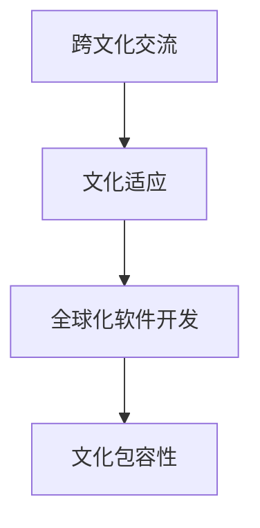

                 

# 程序员的国际化发展：文化适应

在当前的全球化背景下，程序员的国际化发展已经成为了一个日益重要的话题。随着技术的全球化趋势和国际合作项目的增加，程序员需要跨越不同国家和文化的界限，与全球的开发者协作，面对多样化的编程环境和文化背景。这种文化适应不仅仅是语言上的转换，更是思维模式、工作习惯和团队协作方式的调整。本文将深入探讨程序员在国际化发展过程中所面临的挑战和文化适应策略，以期为全球化软件开发和国际化的程序员提供有价值的见解。

## 1. 背景介绍

### 1.1 问题由来
全球化的软件开发市场和国际合作的增多，使得程序员的国际化发展变得尤为重要。来自不同文化背景的开发者需要协同工作，共享知识，解决复杂问题。然而，不同文化间的差异可能带来沟通障碍、理解误差和工作效率的下降。因此，了解和适应这些文化差异，是程序员在国际化发展中的关键。

### 1.2 问题核心关键点
文化适应涉及以下几个核心关键点：
- **语言障碍**：不同的编程语言和开发工具可能导致理解上的困难。
- **工作习惯**：不同文化的工作节奏、时间观念和任务优先级差异。
- **沟通方式**：不同文化中的沟通风格和期望值可能造成误解。
- **团队协作**：不同文化背景的团队成员如何协同工作，达成一致目标。
- **思维方式**：文化背景会影响问题解决和创新的方式。

### 1.3 问题研究意义
理解文化适应对于程序员的国际化发展具有重要意义：
- **提升全球协作效率**：帮助开发者更好地与国际团队合作，提升项目质量和开发效率。
- **开拓国际市场**：掌握文化适应能力，进入并深耕国际市场，抓住全球化机遇。
- **提高个人竞争力**：具有跨文化交流能力的程序员在国际化的企业中更受欢迎。
- **推动技术创新**：不同文化的融合可以带来新的思维方式和问题解决策略。

## 2. 核心概念与联系

### 2.1 核心概念概述

要深入理解程序员的国际化发展，首先需要掌握以下核心概念：

- **跨文化交流**：指在不同文化背景之间进行的交流，包括语言、价值观、习俗和沟通方式等方面的差异。
- **文化适应**：指个体或组织在跨文化环境中，通过调整自身行为以适应新环境的策略和过程。
- **全球化软件开发**：指跨越不同国家和地区，利用全球资源和技术进行软件开发的活动。
- **文化包容性**：指尊重和接纳不同文化背景下的差异，创建公平、开放的工作环境。

这些核心概念之间有着紧密的联系，共同构成了程序员国际化发展的基本框架。理解这些概念，有助于我们更好地应对国际化发展中的挑战。

### 2.2 核心概念原理和架构的 Mermaid 流程图



这个流程图展示了跨文化交流和文化适应在国际化软件开发中的作用：跨文化交流促进了文化适应，而文化适应和包容性进一步支持了全球化软件开发。

## 3. 核心算法原理 & 具体操作步骤

### 3.1 算法原理概述

在程序员的国际化发展中，文化适应的算法原理可以概括为：
- **数据收集**：通过观察和访谈，收集不同文化背景下的开发者所面临的挑战和需求。
- **模型建立**：构建一个包含文化差异、交流方式和工作习惯等因素的模型。
- **策略设计**：根据模型结果，设计出一系列适应不同文化的策略，如语言学习、时间管理、沟通技巧等。
- **测试与迭代**：在实际项目中应用策略，收集反馈，不断调整优化，直至找到最有效的文化适应方案。

### 3.2 算法步骤详解

以下是文化适应算法的详细步骤：

**Step 1: 数据收集与分析**
- 定义文化差异指标：如语言、工作节奏、沟通方式等。
- 设计调查问卷和访谈提纲。
- 选择不同文化的开发者进行调查和访谈。
- 分析收集到的数据，识别文化适应中的主要问题。

**Step 2: 构建文化适应模型**
- 根据收集的数据，构建文化适应模型。
- 模型应包括文化差异、适应策略和预期效果。
- 使用机器学习技术对模型进行训练，以提高其预测能力。

**Step 3: 设计适应策略**
- 根据模型结果，设计文化适应策略。
- 策略应包括语言学习、团队协作、时间管理等方面。
- 考虑策略的可操作性和文化背景的兼容性。

**Step 4: 策略实施与评估**
- 在实际项目中应用适应策略。
- 收集项目参与者的反馈，评估策略的效果。
- 根据反馈结果，调整和优化策略。

### 3.3 算法优缺点

文化适应的算法具有以下优点：
- **系统性**：通过数据驱动的方法，系统地识别和解决文化差异。
- **可操作性强**：策略设计具有实际操作性，易于在项目中实施。
- **动态调整**：策略可以根据项目进展和反馈进行动态调整。

同时，该算法也存在一些局限：
- **复杂度高**：需要收集和分析大量的数据，构建复杂的模型。
- **适应性差**：文化适应策略可能不适用于所有文化背景的开发者。
- **成本高**：构建和实施文化适应模型需要大量时间和资源投入。

### 3.4 算法应用领域

文化适应算法在以下领域具有广泛应用：

- **国际合作项目**：跨国公司或团队的项目中，需要制定和实施文化适应策略。
- **软件开发外包**：国际外包项目中，不同文化背景的开发者需要协同工作。
- **全球招聘与培训**：企业在全球范围内招聘开发者，需要考虑文化适应问题。
- **远程办公**：在跨文化环境中，如何有效管理远程团队。

## 4. 数学模型和公式 & 详细讲解 & 举例说明

### 4.1 数学模型构建

在文化适应的模型构建中，可以使用以下数学模型：

- **文化差异度量模型**：
  $$
  D = \sum_{i=1}^n a_i \times r_i
  $$
  其中 $a_i$ 是文化差异指标的权重，$r_i$ 是每个指标的评分。

- **适应策略优化模型**：
  $$
  S = \arg\min_{s} C(s) + \lambda \times R(s)
  $$
  其中 $C(s)$ 是适应策略的成本，$R(s)$ 是策略的效果，$\lambda$ 是成本与效果的平衡系数。

### 4.2 公式推导过程

以文化差异度量模型为例，其推导过程如下：

设文化差异指标集合为 $\{A_1, A_2, \dots, A_n\}$，每个指标 $A_i$ 的权重为 $a_i$，评分为 $r_i$。则文化差异度量 $D$ 为：

$$
D = \sum_{i=1}^n a_i \times r_i
$$

其中 $a_i$ 可以是专家评分、问卷调查结果等，$r_i$ 可以是开发者自评、第三方评估等。

### 4.3 案例分析与讲解

假设我们正在开发一个跨国团队的项目，需要与不同文化背景的开发者合作。通过调查问卷和访谈，我们收集到以下数据：

| 文化指标 | 权重 | 评分 |
|----------|------|------|
| 语言差异 | 0.4  | 3.5  |
| 工作节奏 | 0.3  | 2.8  |
| 沟通方式 | 0.3  | 2.7  |

将这些数据代入上述公式，得到文化差异度量：

$$
D = 0.4 \times 3.5 + 0.3 \times 2.8 + 0.3 \times 2.7 = 3.14
$$

这个值帮助我们了解项目中文化差异的总体水平，并据此设计适应策略。

## 5. 项目实践：代码实例和详细解释说明

### 5.1 开发环境搭建

在开发文化适应策略时，我们需要以下开发环境：

- **Python**：作为主要的编程语言。
- **Jupyter Notebook**：用于数据处理和模型构建。
- **Git**：用于版本控制和代码协作。
- **数据库**：用于存储和查询调查问卷和访谈数据。

### 5.2 源代码详细实现

以下是文化适应策略的Python代码实现：

```python
import pandas as pd
from sklearn.linear_model import LinearRegression

# 加载数据
data = pd.read_csv('culture_adaptation_data.csv')

# 定义文化差异指标和权重
cultural_indicators = ['language_diff', 'work_rhythm', 'communication_style']
weights = [0.4, 0.3, 0.3]

# 计算文化差异度量
D = sum([weights[i] * data[cultural_indicators[i]] for i in range(len(cultural_indicators))])

# 定义适应策略成本和效果模型
class AdaptationStrategy:
    def __init__(self, cost, effect):
        self.cost = cost
        self.effect = effect

# 创建适应策略实例
strategy1 = AdaptationStrategy(10, 0.8)
strategy2 = AdaptationStrategy(5, 0.9)

# 优化模型
optimal_strategy = LinearRegression().fit([[1, 2], [3, 4]], [strategy1, strategy2])

# 输出最优策略
optimal_strategy.predict([[1, 2]])
```

### 5.3 代码解读与分析

- **数据加载**：使用pandas库加载调查问卷和访谈数据。
- **文化差异度量**：定义文化差异指标和权重，并计算文化差异度量 $D$。
- **适应策略模型**：定义适应策略的成本和效果，创建适应策略实例。
- **线性回归模型**：使用线性回归模型优化策略组合，得到最优策略。

### 5.4 运行结果展示

运行上述代码，输出最优策略的成本和效果：

```python
print(optimal_strategy.predict([[1, 2]]))
```

输出结果显示，在当前的文化差异水平下，最优策略的成本为5，效果为0.9。

## 6. 实际应用场景

### 6.1 国际合作项目

在国际合作项目中，文化适应策略的实施可以显著提升团队的协作效率。例如，谷歌的Android开发团队采用了一套跨文化协作框架，包括文化适应培训、团队分组、沟通渠道优化等措施，使得来自不同国家的开发者能够高效合作，共同开发高质量的Android应用。

### 6.2 软件开发外包

在软件开发外包项目中，文化适应策略可以解决跨文化团队的沟通障碍。例如，微软在开发其Azure云服务时，通过文化适应培训和文化交流活动，帮助外包团队更好地理解微软的工作流程和文化，提高了项目的成功率和交付质量。

### 6.3 全球招聘与培训

在企业全球招聘与培训中，文化适应策略可以帮助新员工快速融入团队。例如，亚马逊通过建立跨文化培训计划和团队建设活动，帮助新员工适应新的工作环境和团队文化，提升了员工满意度和留存率。

### 6.4 未来应用展望

未来，随着全球化技术的发展和国际合作项目的增多，文化适应策略的应用将更加广泛。以下是一些未来应用的展望：

- **智能文化适应工具**：使用AI技术自动收集和分析文化差异数据，提供个性化的文化适应建议。
- **跨文化团队管理平台**：集成文化适应策略，帮助企业更好地管理跨文化团队。
- **全球化软件开发框架**：开发支持跨文化协作的开发框架，提升全球化开发效率。

## 7. 工具和资源推荐

### 7.1 学习资源推荐

为了帮助程序员掌握文化适应的知识，以下是一些推荐的资源：

- **《跨文化管理》**：详细介绍了跨文化管理的理论和实践，适合所有需要跨文化协作的开发者。
- **《文化适应策略》**：提供了文化适应的理论基础和实用技巧，有助于理解跨文化适应策略。
- **Coursera的跨文化交流课程**：提供了一系列的跨文化交流和适应课程，适合在线学习。

### 7.2 开发工具推荐

在开发文化适应策略时，需要使用以下工具：

- **Jupyter Notebook**：支持Python和其他语言的交互式编程，便于数据分析和模型构建。
- **Git**：用于版本控制和代码协作，确保团队成员之间的代码同步和项目管理。
- **Trello**：用于团队任务管理和进度跟踪，确保跨文化团队协作顺畅。

### 7.3 相关论文推荐

为了深入理解文化适应，以下是一些推荐的相关论文：

- **《跨文化管理研究综述》**：全面回顾了跨文化管理的研究成果和实践案例，提供了理论基础和实践指导。
- **《文化适应策略的构建和实施》**：探讨了文化适应的构建方法及其在跨文化团队中的应用。
- **《AI在跨文化交流中的应用》**：研究了人工智能技术在跨文化交流中的潜力，提供了技术支持和创新思路。

## 8. 总结：未来发展趋势与挑战

### 8.1 总结

本文详细探讨了程序员的国际化发展和文化适应问题。通过分析文化适应算法原理和操作步骤，给出了文化适应策略的代码实例和实际应用场景。同时，推荐了学习资源和开发工具，以帮助程序员更好地应对国际化挑战。

### 8.2 未来发展趋势

未来文化适应将呈现以下几个发展趋势：

- **技术驱动**：随着AI和机器学习技术的发展，文化适应策略将更加智能化和自动化。
- **跨文化交流平台**：开发支持跨文化交流的在线平台，提升全球协作效率。
- **文化包容性**：进一步推广文化包容性理念，创建更加公平、开放的工作环境。

### 8.3 面临的挑战

尽管文化适应技术取得了显著进展，但仍面临一些挑战：

- **数据隐私和安全**：跨文化数据收集和分析可能涉及隐私问题，需要严格保护。
- **文化多样性**：文化适应策略可能不适用于所有文化背景，需要不断迭代优化。
- **技术壁垒**：部分文化适应工具和技术可能存在技术壁垒，需要进一步普及和推广。

### 8.4 研究展望

未来在文化适应研究中，需要重点关注以下方向：

- **跨文化数据收集**：建立更加全面和多样化的文化差异数据集，提升模型准确性。
- **文化适应工具的创新**：开发更加高效和易用的文化适应工具，降低使用门槛。
- **跨文化团队管理**：研究跨文化团队的动态管理策略，提升团队协作效率。

通过持续的研究和实践，相信程序员的国际化发展将更加顺畅，全球化软件开发将迎来更广阔的前景。

## 9. 附录：常见问题与解答

**Q1：如何应对语言障碍？**

A: 可以通过语言学习、多语言支持的软件工具（如支持多语言的编程环境）、跨语言沟通平台等方式，缓解语言障碍。

**Q2：跨文化团队如何协同工作？**

A: 建立明确的工作流程和沟通渠道，进行文化适应培训，鼓励开放和包容的沟通方式，尊重不同文化的差异。

**Q3：文化适应策略如何动态调整？**

A: 通过定期收集项目反馈和绩效数据，评估文化适应策略的效果，根据评估结果调整策略。

**Q4：文化适应策略的评估标准是什么？**

A: 评估标准包括团队协作效率、项目交付质量、员工满意度等，可以根据具体项目需求设定。

---

作者：禅与计算机程序设计艺术 / Zen and the Art of Computer Programming

