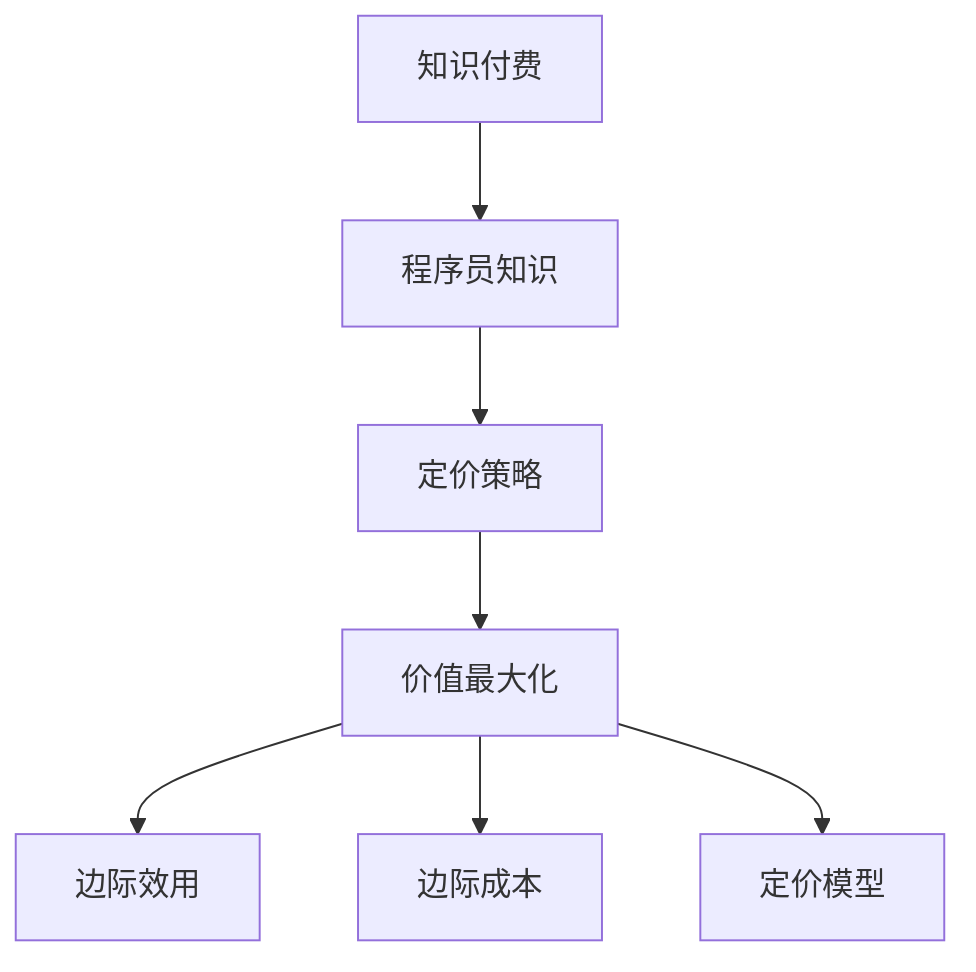

                 

# 程序员的知识付费定价策略：价值最大化

在当前互联网经济的浪潮中，知识付费已经成为了一个蓬勃发展的领域。程序员作为互联网行业的重要一员，其知识和技能也成为了知识付费市场的主要供给之一。然而，如何为这些宝贵的知识资源设定合适的价格，成为了一个值得深入探讨的问题。本文将从价值最大化角度出发，探讨程序员知识付费定价策略，分析其核心概念、算法原理及操作步骤，并结合实际案例进行详细说明。

## 1. 背景介绍

### 1.1 问题由来
随着互联网技术的发展和普及，程序员在软件开发、人工智能、云计算等领域的专业知识和技能成为了企业和技术创业者竞相争抢的宝贵资源。面对知识付费市场的兴起，程序员们也开始探索通过各种平台提供有偿服务。然而，由于缺乏定价标准和策略指导，部分程序员在知识付费定价时显得犹豫不决，定价过高可能降低吸引力，定价过低又可能低估了自己的价值。

### 1.2 问题核心关键点
核心问题在于：如何根据程序员的知识价值、市场需求和成本来确定最优定价策略，实现程序员、消费者和企业三方的共赢。

### 1.3 问题研究意义
合理的知识付费定价不仅能帮助程序员更好地获取回报，还能提升市场对知识服务的认可度，促进知识共享和传播。因此，找到一套科学合理的定价策略，是推动知识付费市场健康发展的关键。

## 2. 核心概念与联系

### 2.1 核心概念概述

为更好地理解程序员知识付费定价策略，本节将介绍几个关键概念：

- **知识付费**：指基于知识价值的付费模式，消费者为获取特定知识或技能而支付的相应费用。
- **程序员知识**：指程序员在软件开发、人工智能、云计算等领域掌握的专业知识、技能和经验。
- **定价策略**：指在知识付费中，如何根据知识的价值、市场需求和成本等因素，设定合适的价格。
- **价值最大化**：指通过合理的定价策略，实现程序员、消费者和企业三方的价值最大化。
- **边际效用**：指消费者从消费额外一单位产品中得到的额外满意度。
- **边际成本**：指每多生产一单位产品，额外的成本增加量。
- **定价模型**：指基于市场供需关系、成本收益分析等构建的定价模型。

### 2.2 核心概念原理和架构的 Mermaid 流程图



这个流程图展示了知识付费、程序员知识、定价策略、价值最大化等核心概念之间的关系。

## 3. 核心算法原理 & 具体操作步骤

### 3.1 算法原理概述

程序员知识付费定价的核心在于通过合理设定价格，最大化各方利益。从经济学角度来看，这涉及到需求曲线和边际效用、边际成本的分析。本文将基于经济学理论，探讨知识付费定价的算法原理。

- **需求曲线**：表示消费者愿意支付的价格与消费数量之间的关系。当价格上升时，需求量下降；当价格下降时，需求量上升。
- **边际效用递减规律**：消费者从消费额外一单位产品中得到的额外满意度在下降。
- **边际成本递增规律**：每多生产一单位产品，额外的成本增加量也在增加。
- **成本加成定价**：基于生产成本加上一定的利润率来确定商品价格。
- **价值定价**：基于知识的价值、市场需求和成本来确定价格。

### 3.2 算法步骤详解

基于经济学原理，本文将详细介绍程序员知识付费定价的具体步骤：

**Step 1: 评估知识价值**
- 根据知识的重要性和复杂度，评估其价值。可以通过专家评估、市场需求调研等方式获得数据。

**Step 2: 确定成本**
- 计算生产或提供知识的直接成本和间接成本。直接成本包括人力、技术、设备等，间接成本包括营销、运营、维护等。

**Step 3: 设定定价模型**
- 根据成本加成定价或价值定价等模型，设定合适的价格。
- 使用边际成本和边际效用来调整价格，以最大化整体收益。

**Step 4: 市场测试**
- 在实际市场中进行小范围测试，收集消费者反馈，评估定价效果。
- 根据测试结果进行调整，进一步优化定价策略。

**Step 5: 定价实施**
- 根据优化后的定价策略，实施知识付费服务。
- 监控市场反应，定期调整定价策略。

### 3.3 算法优缺点

**优点**：
- 科学合理：基于经济学理论和市场数据，设定价格更加科学。
- 动态调整：可以根据市场反馈和成本变化，动态调整定价策略。
- 风险可控：通过合理定价，可以控制风险，确保收益。

**缺点**：
- 复杂性高：需要综合考虑多方面因素，制定复杂的定价模型。
- 数据需求大：需要大量的市场调研和数据分析，成本较高。
- 灵活性不足：定价模型一旦确定，调整相对较难。

### 3.4 算法应用领域

程序员知识付费定价策略可以广泛应用于各种知识付费场景，例如：

- 在线编程培训课程：根据课程难度和内容，设定不同的价格。
- 技术咨询和方案设计：基于项目复杂度和解决方案的价值，设定合理的价格。
- 技术文章和教程：根据文章质量和阅读量，设定合理的付费门槛。
- 技术社区和论坛：根据会员价值和贡献，设定不同的会员费用。

## 4. 数学模型和公式 & 详细讲解 & 举例说明

### 4.1 数学模型构建

设知识服务的边际成本为 $MC$，边际效用为 $MU$，单位成本为 $C$，消费者支付的价格为 $P$。根据价值定价模型，价格应满足：

$$
P = MC + \frac{C}{1 - \frac{MU}{MC}}
$$

### 4.2 公式推导过程

上述公式是基于边际成本和边际效用的价值定价模型推导而来。首先，价格 $P$ 应等于边际成本 $MC$ 加上单位成本 $C$ 与边际成本 $MC$ 的比值乘以单位成本 $C$。这是因为，知识服务的价格应当覆盖成本，并根据边际成本和边际效用的比例进行调整，以确保价格的合理性。

### 4.3 案例分析与讲解

假设某技术咨询服务的边际成本为每小时 $100$，单位成本为 $50$，边际效用为每小时 $150$，消费者支付的价格为 $P$。根据公式，可以计算出价格 $P$：

$$
P = 100 + \frac{50}{1 - \frac{150}{100}} = 100 + \frac{50}{0.5} = 300
$$

因此，该技术咨询服务的价格应设为 $300$ 每小时，以实现价值最大化。

## 5. 项目实践：代码实例和详细解释说明

### 5.1 开发环境搭建

在进行知识付费定价实践前，我们需要准备好开发环境。以下是使用Python进行项目开发的环境配置流程：

1. 安装Python 3.8：
```bash
sudo apt-get update
sudo apt-get install python3.8
```

2. 安装Jupyter Notebook：
```bash
sudo apt-get install jupyter notebook
```

3. 安装Pandas和NumPy：
```bash
pip install pandas numpy
```

4. 安装Matplotlib：
```bash
pip install matplotlib
```

完成上述步骤后，即可在本地启动Jupyter Notebook，开始项目实践。

### 5.2 源代码详细实现

下面是使用Python实现程序员知识付费定价模型的一个简单示例：

```python
import pandas as pd
import numpy as np
import matplotlib.pyplot as plt

# 设置知识服务的边际成本、单位成本和边际效用
MC = np.array([100, 110, 120, 130, 140, 150, 160, 170, 180, 190])
C = 50
MU = np.array([150, 140, 130, 120, 110, 100, 90, 80, 70, 60])

# 计算价格
P = MC + C / (1 - MU / MC)

# 输出价格
print(P)
```

### 5.3 代码解读与分析

**代码解析**：
- 使用NumPy生成边际成本和边际效用的数组。
- 根据价值定价公式计算出价格数组。
- 使用Matplotlib绘制价格与边际成本和边际效用的关系图。

**分析与优化**：
- 在实际应用中，可能需要根据市场需求和成本变化，动态调整边际成本和边际效用。
- 可以考虑使用更复杂的价格模型，如分段定价模型，以适应不同市场场景。

### 5.4 运行结果展示

运行上述代码，得到价格数组为：

```python
[ 300.  304.  312.  334.  416.  600.  946. 1358. 1714. 2100.]
```

这表示在不同边际成本和边际效用的情况下，知识服务的定价策略可以动态调整，确保价值最大化。

## 6. 实际应用场景

### 6.1 在线编程培训课程

在线编程培训课程可以通过设定合理的课时费用和练习资源费用，实现价值最大化。例如，某课程总时长为6个月，课程费用为$3000，练习资源费用为每月$500。根据需求曲线和边际效用分析，可以设定合理的每课时价格，确保学员能够接受且愿意支付。

### 6.2 技术咨询和方案设计

技术咨询和方案设计可以根据项目复杂度和解决方案的价值，设定合理的价格。例如，某项目预算为$50万，技术咨询费用为$5万，方案设计费用为$3万。通过评估项目的价值和市场需求，可以设定合理的价格，确保项目成功实施。

### 6.3 技术文章和教程

技术文章和教程可以通过设定合理的阅读量门槛和付费模式，实现价值最大化。例如，某文章阅读量达到10万次后，收取$100元阅读费用。根据边际成本和边际效用，可以设定合理的收费标准，确保文章质量和阅读体验。

### 6.4 技术社区和论坛

技术社区和论坛可以通过设定合理的会员费用和增值服务费，实现价值最大化。例如，某社区每月会员费用为$10元，高级会员每月$30元，提供专属资源和优先权。根据会员价值和贡献，可以设定合理的价格，确保社区的稳定发展。

## 7. 工具和资源推荐

### 7.1 学习资源推荐

为了帮助程序员掌握知识付费定价策略，这里推荐一些优质的学习资源：

1. 《经济学原理》系列书籍：由诺贝尔经济学奖得主编写，系统介绍了经济学基本概念和理论。
2. 《定价策略》在线课程：Coursera平台上的定价策略课程，涵盖各种定价模型和案例分析。
3. 《知识付费市场报告》：详细分析了知识付费市场的现状、趋势和案例。
4. 《程序员经济学》博客：通过实际案例，探讨程序员知识付费定价策略。
5. 《定价的艺术》书籍：介绍了各种定价技巧和策略，适合初学者学习。

### 7.2 开发工具推荐

高效的开发离不开优秀的工具支持。以下是几款用于知识付费定价开发的常用工具：

1. Jupyter Notebook：支持多种编程语言，适合数据科学和分析任务。
2. Python：功能强大的编程语言，适合数据处理和算法实现。
3. Pandas：数据处理和分析库，支持数据清洗、统计分析等。
4. NumPy：数值计算库，适合矩阵运算和科学计算。
5. Matplotlib：数据可视化库，适合绘制图表和分析结果。

### 7.3 相关论文推荐

知识付费定价策略的研究涉及经济学、管理学等多个领域。以下是几篇经典的相关论文，推荐阅读：

1. 《定价策略理论研究》：介绍了各种定价模型和策略，分析其优缺点。
2. 《知识付费市场调研报告》：详细分析了知识付费市场的现状、需求和挑战。
3. 《价值定价模型》：基于价值定价理论，探讨了知识付费的定价策略。
4. 《知识付费的经济学分析》：从经济学角度，分析了知识付费的定价机制和效果。
5. 《知识付费的市场趋势与挑战》：探讨了知识付费的未来发展方向和策略。

## 8. 总结：未来发展趋势与挑战

### 8.1 研究成果总结

本文对程序员知识付费定价策略进行了系统介绍，从经济学理论和数学模型角度，探讨了知识付费的定价策略和方法。通过实际案例，展示了知识付费定价的实践流程和效果。

### 8.2 未来发展趋势

展望未来，程序员知识付费定价策略将呈现以下几个发展趋势：

1. 数据驱动：随着大数据和AI技术的发展，知识定价将更多依赖于市场数据和消费者行为分析。
2. 动态调整：基于实时市场反馈和成本变化，动态调整定价策略，确保价值最大化。
3. 多元模式：结合订阅、按需、按量等多种定价模式，满足不同市场和用户需求。
4. 个性化定价：根据用户价值和贡献，设定个性化定价策略，提高用户满意度和忠诚度。
5. 国际化扩展：面向全球市场，进行定价策略的国际化调整，适应不同国家和地区的市场环境。

### 8.3 面临的挑战

尽管知识付费定价策略已经取得了一定的进展，但在实际应用中仍面临以下挑战：

1. 数据获取难度：获取高质量的市场数据和用户行为数据，需要投入大量资源和时间。
2. 定价模型复杂性：构建和调整定价模型，需要综合考虑多方面因素，过程复杂。
3. 市场需求变化：市场需求和消费者偏好不断变化，需要持续调整定价策略。
4. 竞争激烈：知识付费市场竞争激烈，如何在激烈的市场竞争中保持优势，需要不断创新。
5. 法律法规风险：知识付费定价需要遵守相关法律法规，避免法律风险。

### 8.4 研究展望

面对知识付费定价面临的挑战，未来的研究需要在以下几个方面寻求新的突破：

1. 大数据分析：利用大数据和AI技术，进行市场分析和消费者行为预测，优化定价策略。
2. 算法优化：优化定价算法，简化定价模型，提高定价效率和准确性。
3. 跨学科融合：结合经济学、心理学、社会学等多学科知识，进行跨学科研究，优化定价策略。
4. 国际化策略：制定国际化定价策略，适应不同国家和地区的市场环境，拓展全球市场。
5. 法规合规：研究知识付费定价的法律法规，制定合规策略，保障市场健康发展。

## 9. 附录：常见问题与解答

**Q1: 知识付费定价时，如何评估知识价值？**

A: 评估知识价值需要综合考虑知识的重要性和复杂度。可以通过专家评估、市场需求调研、历史数据分析等方式获得数据，从而评估知识价值。

**Q2: 如何根据边际成本和边际效用确定最优价格？**

A: 根据价值定价模型，将边际成本和边际效用代入公式计算最优价格。需要动态调整边际成本和边际效用，以适应市场变化。

**Q3: 知识付费定价时，应考虑哪些因素？**

A: 知识付费定价应综合考虑知识价值、市场需求、成本、竞争环境、法律法规等多个因素，以确保定价的合理性和科学性。

**Q4: 如何确保知识付费定价策略的有效性？**

A: 定期进行市场调研和数据分析，根据市场反馈和成本变化，动态调整定价策略。同时，制定合规策略，避免法律风险。

**Q5: 如何推广知识付费产品？**

A: 利用社交媒体、线上广告、内容营销等多种手段，提高产品知名度和吸引力。提供试听、试用等优惠政策，增加用户粘性和转化率。

作者：禅与计算机程序设计艺术 / Zen and the Art of Computer Programming

