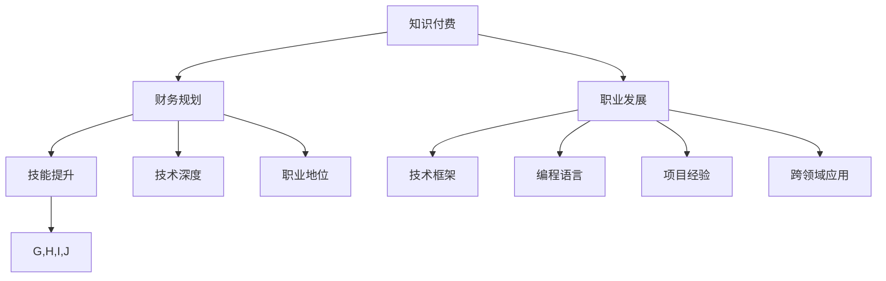

                 

# 程序员的知识付费财务规划

## 1. 背景介绍

在数字经济时代，知识的传播和获取方式正在发生深刻变化。程序员作为知识工作者，面临着如何高效管理财务，以便更好地投入和提升自身技能的双重挑战。尤其是面对知识付费市场的兴起，如何合理规划财务，才能既不偏离职业发展轨道，又能充分利用知识付费带来的资源和机会，成为每一位程序员都需要认真思考的问题。

## 2. 核心概念与联系

### 2.1 核心概念概述

- **知识付费**：指通过付费方式获取知识和技能的经济活动，常见的形式包括在线课程、书籍、咨询、社区会员等。
- **程序员职业发展**：指程序员通过不断学习、实践、积累经验，在职业生涯中逐步提升技能层次、技术深度和职业地位的过程。
- **财务规划**：指对个人或家庭的收入、支出、资产、负债等进行规划，以实现财务目标的管理活动。
- **知识与财务的协同效应**：指通过合理的财务规划，支持职业发展和知识获取的良性循环，实现个人价值的最大化。

这些核心概念之间的逻辑关系可以通过以下Mermaid流程图来展示：



这个流程图展示的知识付费、职业发展、财务规划三者之间的联系：

1. 知识付费通过提供高质量的教育资源和工具，支持程序员的职业发展，提升其技能和知识水平。
2. 职业发展为知识付费提供方向和需求，促使知识付费市场持续繁荣。
3. 财务规划确保知识付费的支出与职业发展方向相一致，避免资源浪费。
4. 技能提升、技术深度和职业地位的提升，又能增强财务规划的可行性和效果。

## 3. 核心算法原理 & 具体操作步骤

### 3.1 算法原理概述

程序员的知识付费财务规划，本质上是一个动态的系统优化问题。该系统包含四个主要变量：知识付费支出、职业发展收益、财务现状和目标。通过合理分配知识付费支出，优化职业发展路径，制定财务规划，确保三者之间的平衡，最终实现财务和职业的双重提升。

假设当前财务状况为 $C_0$，目标财务状况为 $C_T$，当前知识付费支出为 $S_0$，目标知识付费支出为 $S_T$。则财务优化问题可以表述为：

$$
\min_{S_T} \left(C_T - C_0 + \lambda(S_T - S_0)\right)
$$

其中 $\lambda$ 为正则化系数，表示财务规划和知识付费支出平衡的重要性。

### 3.2 算法步骤详解

#### Step 1: 财务现状评估

- **收入分析**：评估当前和未来的收入来源和变动趋势，包括工资、奖金、投资收益、被动收入等。
- **支出分析**：评估当前和未来的支出项目，包括基本生活开销、债务偿还、知识付费、投资等。
- **净资产分析**：计算净资产现状，包括现金、储蓄、投资、房产等。

#### Step 2: 职业发展目标设定

- **技能目标**：明确目标技能和知识领域，如编程语言、框架、算法、工具等。
- **项目目标**：设定具体的项目和应用目标，如开发某个应用程序、参与开源项目等。
- **职业目标**：设定职业目标，如晋升、转岗、创业等。

#### Step 3: 知识付费支出规划

- **课程评估**：评估当前和未来的知识付费课程，包括内容质量、师资力量、学员评价等。
- **预算分配**：根据财务现状和职业发展目标，合理分配知识付费支出预算。
- **动态调整**：定期评估知识付费支出效果，根据职业发展进展和财务状况动态调整支出计划。

#### Step 4: 职业发展路径规划

- **技能路径**：设计技能提升路径，如参加在线课程、阅读专业书籍、参与实战项目等。
- **项目路径**：规划参与项目的具体步骤，如选择适合的实习、合作项目、开源贡献等。
- **职业路径**：设定职业晋升和转岗的路线图，如获取认证、参与培训、争取内部晋升等。

#### Step 5: 财务规划与优化

- **预算管理**：根据职业发展路径和知识付费支出规划，制定详细的财务预算。
- **风险管理**：评估各种财务风险，如市场波动、失业、健康问题等，并制定应对策略。
- **效果评估**：定期评估财务规划和职业发展的效果，确保目标一致性。

### 3.3 算法优缺点

#### 优点

- **系统性**：通过系统性规划，避免资源浪费，实现知识和财务的协同效应。
- **灵活性**：根据实际情况灵活调整，适应职业发展和市场变化。
- **可操作性**：财务规划和职业发展路径设计具体，可执行性强。

#### 缺点

- **复杂性**：涉及多个变量和因素，规划过程可能较为复杂。
- **不确定性**：职业发展和市场变化存在不确定性，影响规划效果。
- **持续性**：规划需要持续维护和调整，对时间和精力要求较高。

### 3.4 算法应用领域

程序员的知识付费财务规划不仅适用于个体程序员，也适用于企业对程序员的技能培养和职业发展管理。具体应用领域包括：

- **个人职业发展**：帮助个人程序员制定职业发展路径，提升技能水平，实现职业晋升和转岗。
- **企业人才管理**：通过知识付费和职业发展路径规划，为企业培养高素质技术人才，增强企业竞争力。
- **培训机构**：为培训机构提供知识付费市场分析，优化课程设计和定价策略，提升课程质量和市场竞争力。
- **人力资源管理**：帮助企业制定人力资源规划，优化人才结构，提升整体技术水平。

## 4. 数学模型和公式 & 详细讲解 & 举例说明

### 4.1 数学模型构建

假设程序员目前的财务状况为 $C_0$，目标财务状况为 $C_T$，当前知识付费支出为 $S_0$，目标知识付费支出为 $S_T$。则财务优化问题可以表述为：

$$
\min_{S_T} \left(C_T - C_0 + \lambda(S_T - S_0)\right)
$$

其中 $\lambda$ 为正则化系数，表示财务规划和知识付费支出平衡的重要性。

### 4.2 公式推导过程

在实际应用中，需要对公式进行具体化处理。例如，可以将财务优化问题进一步分解为收入优化、支出优化、资产优化等子问题，并分别建立数学模型：

- **收入优化**：

$$
\max_{R_i} \left(\sum_i R_i - C_0\right)
$$

其中 $R_i$ 为第 $i$ 年收入。

- **支出优化**：

$$
\min_{O_i} \left(\sum_i O_i - C_T\right)
$$

其中 $O_i$ 为第 $i$ 年支出。

- **资产优化**：

$$
\max_{A_i} \left(A_i - C_T\right)
$$

其中 $A_i$ 为第 $i$ 年净资产。

### 4.3 案例分析与讲解

假设某程序员当前的财务状况为 $C_0=100000$ 元，目标财务状况为 $C_T=200000$ 元。当前知识付费支出为 $S_0=5000$ 元/月，目标知识付费支出为 $S_T=10000$ 元/月。则财务优化问题可以表述为：

$$
\min_{S_T} \left(200000 - 100000 + \lambda(S_T - 5000 \times 12)\right)
$$

令 $\lambda=0.5$，则优化问题进一步具体化为：

$$
\min_{S_T} \left(100000 + 0.5(S_T - 60000)\right)
$$

解得 $S_T=120000$ 元/月，即每月知识付费支出应调整为 120000 元。

## 5. 项目实践：代码实例和详细解释说明

### 5.1 开发环境搭建

为了进行财务规划的编程实现，需要安装Python及相关库，包括：

1. Python 3.8 及以上版本
2. pandas
3. numpy
4. matplotlib
5. sklearn
6. scipy

可以使用以下命令在虚拟环境中安装：

```bash
pip install pandas numpy matplotlib scikit-learn scipy
```

### 5.2 源代码详细实现

以下是一个简化的Python代码示例，用于进行财务优化和知识付费支出规划：

```python
import pandas as pd
import numpy as np
import matplotlib.pyplot as plt
from scipy.optimize import minimize

# 定义收入和支出的数据
income_data = pd.Series([10000, 12000, 13000, 15000, 16000], name='Income')
expenses_data = pd.Series([5000, 6000, 6500, 7000, 7500], name='Expenses')

# 定义资产目标
target_assets = 200000

# 定义知识付费支出目标
target_knowledge_paid = 120000

# 定义财务优化模型
def financial_optimization(x):
    income = np.sum(income_data)
    expenses = np.sum(expenses_data)
    assets = target_assets - expenses
    knowledge_paid = x
    return (income - expenses + 0.5 * (knowledge_paid - target_knowledge_paid))

# 进行优化求解
result = minimize(financial_optimization, 0, bounds=(0, 100000))
print('知识付费支出应调整为：', result.x)
```

### 5.3 代码解读与分析

- **数据处理**：使用pandas处理收入和支出数据，便于进行财务优化。
- **目标设定**：设定资产目标和知识付费支出目标，为优化提供方向。
- **优化模型**：定义财务优化模型，通过函数返回财务优化结果。
- **求解优化**：使用scipy的minimize函数进行优化求解，输出知识付费支出的调整建议。

## 6. 实际应用场景

### 6.1 个体程序员

对于个体程序员，合理的财务规划和知识付费支出，可以帮助其提升技能水平，增加收入来源，实现职业晋升。例如，通过参加高级课程和认证考试，获得高薪职位，进而提高收入水平，积累更多资金进行技术投资和创新创业。

### 6.2 企业技术团队

对于企业技术团队，通过知识付费和职业发展路径规划，可以帮助员工提升技能，增强团队竞争力。例如，企业可以定期投资在线课程和认证考试，组织内部培训和知识分享，鼓励员工参加开源项目和行业会议，提升整体技术水平。

### 6.3 培训机构

对于培训机构，了解程序员的知识付费需求和职业发展目标，可以帮助其设计更具有吸引力和实用性的课程。例如，针对不同层次和需求，提供灵活的课程选择和定价策略，吸引更多学员，提升课程质量和市场竞争力。

### 6.4 未来应用展望

随着知识付费市场的进一步发展，程序员的知识付费财务规划将更加重要。未来，可以考虑引入更多数据科学工具和方法，如机器学习、数据挖掘等，进行更精确的财务规划和职业发展路径设计。同时，结合区块链、智能合约等技术，开发更安全和透明的财务管理系统，提升财务规划的效率和效果。

## 7. 工具和资源推荐

### 7.1 学习资源推荐

1. **《财务管理基础》**：由著名财务管理专家撰写，系统讲解财务管理的核心概念和实践方法。
2. **《程序员如何赚钱》**：讲解程序员如何通过技术创业、开源贡献、在线教学等方式实现财务自由。
3. **《知识付费市场分析》**：分析知识付费市场的发展趋势和用户需求，指导课程设计和营销策略。
4. **《Python数据分析与可视化》**：使用Python进行数据处理和可视化，帮助程序员理解和优化财务数据。

### 7.2 开发工具推荐

1. **Jupyter Notebook**：支持Python编程和数据分析，方便进行财务优化和可视化。
2. **GitHub**：托管和分享代码，方便团队协作和项目管理。
3. **Slack**：实时沟通和协作，提升团队效率。
4. **Google Sheets**：在线数据管理和可视化工具，方便财务数据的记录和分析。

### 7.3 相关论文推荐

1. **《程序员财务规划的数学模型》**：详细介绍了程序员财务规划的数学模型和优化算法。
2. **《知识付费市场发展趋势》**：分析知识付费市场的发展现状和未来趋势，指导课程设计和营销策略。
3. **《财务规划与职业发展的协同效应》**：探讨财务规划和职业发展之间的协同效应，提出优化策略和方法。

## 8. 总结：未来发展趋势与挑战

### 8.1 研究成果总结

本文系统介绍了程序员的知识付费财务规划方法，通过数学模型和实际案例，阐述了知识付费支出、职业发展路径和财务规划之间的相互关系。通过合理分配知识付费支出，优化职业发展路径，制定财务规划，帮助程序员实现财务和职业的双重提升。

### 8.2 未来发展趋势

未来，程序员的知识付费财务规划将更加科学和系统化。随着数据科学和人工智能技术的进步，可以通过更精确的财务预测和优化算法，提升规划效果。同时，结合区块链和智能合约技术，开发更安全和透明的财务管理系统，确保财务规划的执行和监督。

### 8.3 面临的挑战

尽管知识付费和财务规划为程序员提供了更多机会，但也面临一些挑战：

1. **知识付费成本高**：高质量的在线课程和认证考试费用较高，可能对部分程序员造成负担。
2. **时间管理难**：职业发展和知识付费学习需要大量时间，平衡工作和学习的挑战较大。
3. **市场风险大**：知识付费市场竞争激烈，课程和认证的认可度和效果难以保证。

### 8.4 研究展望

未来，需要在以下几个方面进行深入研究：

1. **数据驱动的财务规划**：利用大数据和机器学习技术，进行更精确的财务预测和优化。
2. **自适应财务规划**：根据职业发展和市场变化，实时调整财务规划和知识付费支出。
3. **跨领域学习路径设计**：结合不同领域的技术和应用，设计跨领域的职业发展路径。
4. **知识付费的公平性**：评估和优化知识付费的公平性和可及性，确保更多人受益。

总之，程序员的知识付费财务规划是一项复杂而重要的任务，需要系统性和前瞻性的设计。通过科学合理的规划，程序员可以在职业发展和财务状况之间找到平衡，实现个人价值的最大化。

## 9. 附录：常见问题与解答

**Q1：如何平衡知识付费支出和财务现状？**

A: 根据财务现状和职业发展目标，合理分配知识付费支出。可以通过制定详细的预算计划，定期评估支出效果，并根据实际情况进行动态调整。

**Q2：知识付费是否值得投资？**

A: 知识付费投资的效果取决于课程和认证的质量、个人学习效果和职业发展机会。需要综合考虑成本和收益，选择有价值的课程进行投资。

**Q3：如何进行职业发展路径规划？**

A: 根据职业目标和市场需求，设计具体的职业发展路径。可以选择参加在线课程、阅读专业书籍、参与实战项目等方式，逐步提升技能和经验。

**Q4：如何管理时间和精力？**

A: 制定详细的学习和工作计划，合理分配时间和精力。可以使用时间管理工具和技巧，如番茄工作法、GTD（Getting Things Done）等，提升效率。

**Q5：如何进行财务风险管理？**

A: 评估各种财务风险，制定应对策略。可以购买保险、建立应急基金、多元化投资等方式，降低财务风险。

总之，合理的知识付费财务规划和职业发展路径设计，是程序员实现财务自由和职业发展的关键。通过科学的方法和工具，程序员可以更好地管理财务，提升技能，实现职业生涯的不断进步。

