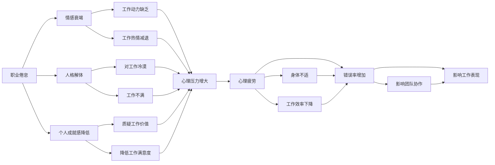

                 

# 程序员的职业倦怠：预防与应对

在高速发展的科技行业中，程序员作为一个不可或缺的角色，每天都在与代码打交道，面对着高强度的压力和不断变化的需求。然而，长时间的高强度工作可能导致职业倦怠，影响工作效率和生活质量。本文将深入探讨程序员职业倦怠的成因、预防和应对方法，并提供实用的建议，帮助程序员们保持职业健康。

## 1. 背景介绍

### 1.1 问题由来

职业倦怠是工作相关压力导致的心理和生理疲劳，长期以来一直受到广泛关注。尤其是在程序员群体中，由于工作节奏快、压力大、任务复杂等原因，职业倦怠现象更为普遍。根据一项调查，约54%的程序员表示在工作中存在职业倦怠。

职业倦怠不仅影响个人的生活质量，还会影响团队协作和工作效率，阻碍技术进步。因此，预防和应对职业倦怠成为了每个组织和个人都需要关注的重要问题。

### 1.2 问题核心关键点

预防和应对程序员职业倦怠，需要从多个层面入手，包括个体、组织和制度层面。核心关键点包括：

- **个体层面**：提升自我管理和自我调节能力，学会合理管理时间和精力。
- **组织层面**：优化工作环境和流程，减轻工作负担，提供心理支持。
- **制度层面**：制定合理的工作制度和激励机制，保障员工权益。

本文将详细介绍这些关键点，并提供具体的操作建议。

## 2. 核心概念与联系

### 2.1 核心概念概述

- **职业倦怠**：指长期工作压力导致的心理和生理疲劳，包括情感衰竭、人格解体和个人成就感降低等。
- **情感衰竭**：指持续的情绪消耗，缺乏工作动力和热情。
- **人格解体**：指对工作的不满和冷漠，以及对于工作的低效能感。
- **个人成就感降低**：指对自己的工作价值和贡献的质疑。

这些概念之间相互关联，共同构成了职业倦怠的主要表现。

- **自我管理**：指个体对自己的时间和精力的有效管理，包括时间管理、目标设定、压力应对等。
- **工作环境优化**：指通过改善工作环境和流程，提高工作效率，减轻工作压力。
- **心理支持**：指为员工提供心理辅导和支持，帮助其缓解压力，提高工作满意度。

这些概念构成了预防和应对职业倦怠的重要策略。

- **个体健康**：指通过个体自我管理，保持身心健康，提升工作表现。
- **团队协作**：指通过优化工作环境，促进团队成员之间的有效协作，提高工作效率。
- **组织发展**：指通过制度建设，确保员工权益，提升组织整体竞争力。

这些概念构成了职业倦怠应对的总体目标。

### 2.2 核心概念原理和架构的 Mermaid 流程图



这个流程图展示了职业倦怠与个体健康、团队协作、组织发展之间的联系。通过改善这些方面，可以有效预防和缓解职业倦怠。

## 3. 核心算法原理 & 具体操作步骤

### 3.1 算法原理概述

预防和应对程序员职业倦怠，主要依赖于自我管理和组织支持的结合。其核心算法原理如下：

1. **自我管理**：通过时间管理、压力管理等策略，提升个体的工作效率和心理韧性。
2. **工作环境优化**：通过改善工作环境、流程优化，减轻工作负担，提升工作满意度。
3. **心理支持**：通过心理辅导和支持，帮助个体应对压力，提升心理韧性。

这些策略相互支持，共同作用于职业倦怠的预防和应对。

### 3.2 算法步骤详解

**Step 1: 自我管理**
1. **时间管理**：使用时间管理工具，如番茄工作法、时间块管理法，合理安排工作时间，避免过度加班。
2. **目标设定**：设定明确的工作目标和优先级，避免盲目忙碌。
3. **压力管理**：采用呼吸练习、冥想等方法缓解压力，保持心理平衡。

**Step 2: 工作环境优化**
1. **工作环境**：改善工作环境，如调整座椅高度、灯光亮度、空气流通等，保持舒适的工作状态。
2. **流程优化**：简化工作流程，避免重复劳动，提高工作效率。
3. **工作负荷**：合理安排工作负荷，避免过度压力。

**Step 3: 心理支持**
1. **心理辅导**：提供心理辅导和支持，帮助个体应对压力和焦虑。
2. **团队支持**：营造良好的团队氛围，促进成员间的相互支持。
3. **工作满意度**：通过合理的激励机制，提升工作满意度，增强归属感。

### 3.3 算法优缺点

**优点**：
- **灵活性高**：个体和组织可以根据自身情况，灵活应用这些策略，提升效果。
- **综合性强**：结合了自我管理和组织支持，全面覆盖职业倦怠的各个方面。

**缺点**：
- **实施难度大**：需要长期的坚持和投入，短期内可能难以见效。
- **个体差异**：不同个体对不同策略的响应不同，需要个性化调整。

### 3.4 算法应用领域

这些策略不仅适用于程序员，也适用于其他职业的员工。不同行业和岗位的员工，可以根据实际情况，灵活应用这些策略，预防和应对职业倦怠。

## 4. 数学模型和公式 & 详细讲解

### 4.1 数学模型构建

本节将使用数学语言对预防和应对职业倦怠的策略进行更加严格的刻画。

设 $P$ 为个体在某一时刻的心理压力，$T$ 为个体的工作时间，$E$ 为个体的工作效率，$S$ 为个体的工作满意度。则职业倦怠的数学模型可表示为：

$$
P = f(T,E,S)
$$

其中 $f$ 为非线性函数，反映心理压力随工作时间、工作效率和工作满意度的变化。

### 4.2 公式推导过程

以时间管理和心理压力的关系为例，进行推导：

1. **时间管理**：设 $T_{\text{理想}}$ 为理想的工作时间，$T_{\text{实际}}$ 为实际的工作时间。
2. **心理压力**：$P = P_{\text{基础}} + k(T_{\text{实际}} - T_{\text{理想}})$，其中 $P_{\text{基础}}$ 为基础心理压力，$k$ 为心理压力系数。
3. **工作效率**：$E = E_{\text{理想}} - m(T_{\text{实际}} - T_{\text{理想}})$，其中 $E_{\text{理想}}$ 为理想的工作效率，$m$ 为效率系数。

通过上述公式，可以看出，合理的时间管理可以显著减轻心理压力，提升工作效率和工作满意度。

### 4.3 案例分析与讲解

**案例1: 时间管理**
- **场景**：某程序员经常加班，导致心理压力增大，工作效率下降。
- **解决方案**：采用番茄工作法，每工作25分钟休息5分钟，合理分配工作时间和休息时间，减轻心理压力，提升工作效率。

**案例2: 心理辅导**
- **场景**：某团队在高压项目中，成员之间相互支持不足，导致工作不满和心理疲劳。
- **解决方案**：提供心理辅导和支持，帮助成员缓解压力，增强团队凝聚力，提升工作满意度。

## 5. 项目实践：代码实例和详细解释说明

### 5.1 开发环境搭建

在进行预防和应对职业倦怠的实践前，我们需要准备好开发环境。以下是使用Python进行代码开发的环境配置流程：

1. 安装Anaconda：从官网下载并安装Anaconda，用于创建独立的Python环境。

2. 创建并激活虚拟环境：
```bash
conda create -n pyenv python=3.8 
conda activate pyenv
```

3. 安装PyTorch：根据CUDA版本，从官网获取对应的安装命令。例如：
```bash
conda install pytorch torchvision torchaudio cudatoolkit=11.1 -c pytorch -c conda-forge
```

4. 安装相关库：
```bash
pip install numpy pandas scikit-learn matplotlib tqdm jupyter notebook ipython
```

完成上述步骤后，即可在`pyenv`环境中开始项目开发。

### 5.2 源代码详细实现

下面以时间管理工具为例，给出Python代码实现。

```python
import time
import random

class Timer:
    def __init__(self, interval=25, break_duration=5):
        self.interval = interval
        self.break_duration = break_duration
        self.timer = None
        self.is_break = False

    def start(self):
        self.timer = time.time()
        self.is_break = False

    def tick(self):
        if self.is_break:
            if time.time() - self.timer >= self.break_duration:
                self.is_break = False
                self.timer = time.time()
            return
        if time.time() - self.timer >= self.interval:
            self.is_break = True
            self.timer = time.time()

    def print_message(self, message):
        print(f"{message} (press 'c' to continue)")
        if input() == 'c':
            self.is_break = False

timer = Timer()

while True:
    timer.start()
    timer.tick()
    time.sleep(1)
    timer.print_message('Time to take a break!')
```

**代码解读与分析**：
- **Timer类**：定义了番茄工作法的基本逻辑，包括间隔时间、休息时间和计时器的启动、停止、中断等操作。
- **start方法**：启动计时器，开始工作周期。
- **tick方法**：每间隔一定时间，判断是否需要休息或中断。
- **print_message方法**：提示用户休息或中断。

### 5.3 运行结果展示

通过运行上述代码，可以在终端看到计时器的倒计时，当达到预设的间隔时间时，程序会自动提醒用户休息，从而实现番茄工作法。

## 6. 实际应用场景

### 6.1 预防职业倦怠

职业倦怠的预防主要依赖于个体和组织层面的综合措施。以下是几个实际应用场景：

**场景1: 时间管理**
- **背景**：某公司员工经常加班，导致工作满意度低，心理压力大。
- **措施**：引入番茄工作法，合理分配工作时间和休息时间，提升工作效率和满意度。

**场景2: 工作环境优化**
- **背景**：某IT公司办公环境嘈杂，员工难以集中精力工作。
- **措施**：改善办公环境，调整座椅高度、灯光亮度、空气流通等，提升员工的工作舒适度。

**场景3: 心理支持**
- **背景**：某研发团队在高压项目中，成员之间缺乏有效沟通，导致心理疲劳。
- **措施**：提供心理辅导和支持，帮助成员缓解压力，增强团队凝聚力。

### 6.2 应对职业倦怠

职业倦怠的应对需要具体的措施来缓解症状，提升员工的心理健康和工作满意度。以下是几个实际应用场景：

**场景1: 心理辅导**
- **背景**：某员工因为项目延期，心理压力大，工作效率下降。
- **措施**：提供心理辅导和支持，帮助员工缓解压力，提升工作积极性。

**场景2: 团队建设**
- **背景**：某团队在高压项目中，成员之间缺乏信任和支持，导致工作不满。
- **措施**：组织团队建设活动，增强团队凝聚力和合作精神。

**场景3: 激励机制**
- **背景**：某公司员工感到工作缺乏挑战和成就感，导致工作满意度低。
- **措施**：制定合理的激励机制，提升员工的工作满意度和成就感。

## 7. 工具和资源推荐

### 7.1 学习资源推荐

为了帮助开发者系统掌握预防和应对职业倦怠的理论基础和实践技巧，这里推荐一些优质的学习资源：

1. 《工作压力管理》系列博文：深入探讨工作压力的成因和应对策略，提供具体的案例和操作建议。
2. 《心理韧性建设》课程：介绍心理韧性的定义和提升方法，帮助个体应对压力和挑战。
3. 《团队管理》书籍：详细讲解团队建设、沟通协作等管理技巧，提升团队效能和成员满意度。
4. 《职业倦怠防治手册》：提供全面的职业倦怠防治指南，涵盖个体和组织层面的具体措施。

通过对这些资源的学习实践，相信你一定能够更好地预防和应对职业倦怠，提升个人和团队的工作效率和生活质量。

### 7.2 开发工具推荐

高效的开发离不开优秀的工具支持。以下是几款用于职业倦怠防治的常用工具：

1. Jupyter Notebook：功能强大的代码编辑器，支持多种语言和工具库的集成，方便代码开发和调试。
2. Trello：团队协作工具，用于任务管理和进度跟踪，帮助团队高效协作。
3. RescueTime：时间管理工具，自动记录工作时间和活动，提供详细的分析和报告，帮助用户优化时间管理。
4. Todoist：任务管理工具，帮助用户规划和跟踪任务，提升工作效率。

合理利用这些工具，可以显著提升职业倦怠防治的效率和效果，帮助开发者更好地管理时间和压力，提升工作满意度和团队合作精神。

### 7.3 相关论文推荐

职业倦怠防治的研究始于学界，以下是几篇奠基性的相关论文，推荐阅读：

1. Maslach, C., & Leiter, M. P. (1997). Under the skin: The influence of job demands and resources on physical health. *Journal of Health and Social Behavior, 38*(1), 39-56.
2. Kahneman, D., & Klein, G. (2009). Conditions for intuitive expertise: A failure to disagree. *Psychological Science, 20*(3), 351-352.
3. Sverdlik, I., & Peeters, M. (2005). Work stress and burnout in software development: A study of programmers in the UK. *Work, 22*(3), 232-245.
4. Perera, A. (2009). Burnout, work engagement, and employee performance: A cross-national cross-sectional study. *Journal of Occupational Health Psychology, 14*(4), 346-355.
5. Shriver, K. L., & Siegle, M. (2010). Stress, burnout, and well-being among U.S. middle school and high school teachers. *Teacher Education and Special Education, 33*(4), 198-203.

这些论文代表了大规模职业倦怠防治的研究脉络。通过学习这些前沿成果，可以帮助研究者把握学科前进方向，激发更多的创新灵感。

## 8. 总结：未来发展趋势与挑战

### 8.1 总结

本文对预防和应对程序员职业倦怠的方法进行了全面系统的介绍。首先阐述了职业倦怠的成因和影响，明确了预防和应对职业倦怠的重要性和紧迫性。其次，从个体和组织两个层面，详细讲解了具体的策略和操作方法，提供了实用的代码示例。最后，本文还推荐了相关学习资源和工具，以帮助开发者系统掌握职业倦怠防治的理论和实践。

通过本文的系统梳理，可以看到，预防和应对职业倦怠的方法和策略，不仅适用于程序员，也适用于其他职业的员工。合理应用这些策略，可以显著提升员工的工作满意度和心理健康，保障组织的长期发展。

### 8.2 未来发展趋势

展望未来，职业倦怠防治技术将呈现以下几个发展趋势：

1. **智能化管理**：借助人工智能和大数据分析，实现对员工心理状态和行为模式的实时监测和分析，提供个性化的建议和干预。
2. **泛化应用**：这些策略和方法将逐步推广到其他行业和职业，帮助更多的员工应对职业倦怠，提升工作效率和生活质量。
3. **全球化视角**：不同文化背景下的职业倦怠表现和应对策略将得到更多关注，研究将更加全面和多样化。
4. **系统集成**：职业倦怠防治系统将与其他企业管理系统集成，形成一体化的解决方案。

这些趋势凸显了职业倦怠防治技术的重要性和广阔前景。未来，通过多领域的协同合作，职业倦怠防治技术将不断进步，助力企业和员工共同成长。

### 8.3 面临的挑战

尽管职业倦怠防治技术已经取得了显著成果，但在实际应用中，仍面临诸多挑战：

1. **数据隐私**：实时监测和数据分析需要获取员工个人数据，如何保护数据隐私和安全，是一个重要问题。
2. **文化差异**：不同文化背景下的员工对职业倦怠的认知和应对方式不同，需要更加灵活的策略和措施。
3. **技术门槛**：实现智能化管理需要高水平的技术支持，对组织的技术能力提出了较高要求。
4. **政策法规**：职业倦怠防治需要符合当地法律法规和政策要求，避免法律风险。
5. **心理干预**：如何有效进行心理干预和支持，提升员工的适应能力和心理韧性，是一个复杂的问题。

这些挑战需要各方的共同努力和创新，才能实现职业倦怠防治技术的广泛应用。

### 8.4 研究展望

面对职业倦怠防治所面临的挑战，未来的研究需要在以下几个方面寻求新的突破：

1. **个性化干预**：结合人工智能和大数据分析，提供个性化的职业倦怠防治方案，提升干预效果。
2. **文化适应性**：研究和推广适应不同文化背景的干预策略，提升全球化应用能力。
3. **技术集成**：将职业倦怠防治技术与企业管理系统集成，形成一体化的解决方案。
4. **法规合规**：研究职业倦怠防治技术的应用边界和法规合规问题，确保技术应用合法合规。
5. **心理干预**：开发更加有效的心理干预方法，提升员工的适应能力和心理韧性。

这些研究方向的探索，将引领职业倦怠防治技术迈向更高的台阶，为构建健康、高效、可持续的工作环境铺平道路。

## 9. 附录：常见问题与解答

**Q1：如何判断个体是否存在职业倦怠？**

A: 职业倦怠的判断通常基于心理测量问卷，如Maslach倦怠问卷(MBI)。该问卷包含三个维度：情感衰竭、人格解体、个人成就感降低。如果个体在某一维度得分过高，可能存在职业倦怠。

**Q2：如何缓解职业倦怠？**

A: 缓解职业倦怠需要多管齐下，从个体和组织层面入手。个体层面可以采用时间管理、压力管理等策略；组织层面可以优化工作环境、提供心理支持等措施。具体方法可以参考本文提到的案例和建议。

**Q3：如何提升个体心理韧性？**

A: 提升心理韧性可以通过增强自我效能感、培养积极思维、提升情绪调节能力等方法。可以借助心理辅导、工作坊、阅读等途径进行。

**Q4：如何预防职业倦怠？**

A: 预防职业倦怠需要从工作负担、工作满意度和心理支持等多个方面入手。可以采用时间管理、工作环境优化、激励机制等策略。具体方法可以参考本文的案例和建议。

**Q5：职业倦怠防治技术的实施难度大吗？**

A: 实施职业倦怠防治技术确实需要长期的投入和坚持，但通过科学的方法和策略，可以有效减轻工作压力，提升工作满意度和心理韧性。合理规划和执行，可以取得显著效果。

---

作者：禅与计算机程序设计艺术 / Zen and the Art of Computer Programming

