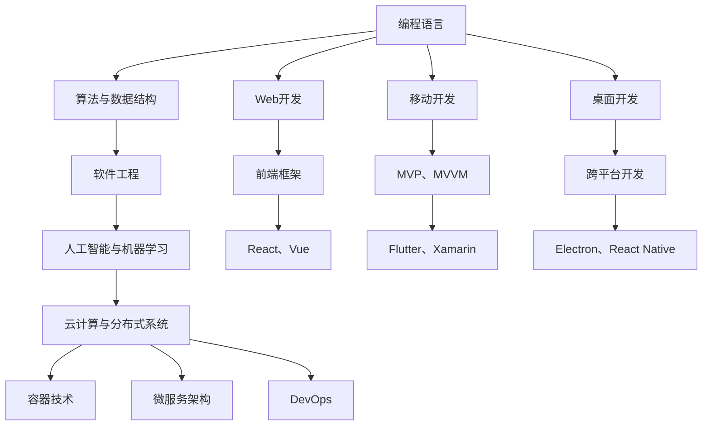

                 

# 程序员的职业生涯规划：30年路线图

在当今飞速发展的技术世界中，作为一名程序员，无论是初入职场的新手，还是拥有丰富经验的资深开发者，都需要具备长远的职业规划和不断学习的动力。本文将为您提供一份程序员的职业生涯路线图，帮助您在30年职业生涯中不断成长，走向技术巅峰。

## 1. 背景介绍

在过去的几十年里，计算机科学与技术已经经历了翻天覆地的变化。从早期的机械计算机到现代的超大规模数据中心，技术的发展已经深刻改变了我们生活的方方面面。作为一名程序员，您将有机会在这个激动人心的时代中探索未知，创造未来。

### 1.1 技术变革的浪潮

技术变革始终是IT行业不断前行的动力。从PC革命到互联网的兴起，再到移动互联网和人工智能的浪潮，每一次变革都带来新的机遇和挑战。了解这些变革趋势，将帮助您更好地规划职业生涯，抓住时代的脉搏。

### 1.2 技术栈的多样性

随着技术的不断发展，程序员需要掌握多种编程语言、框架和工具。从基础的C++和Java，到新兴的Python、JavaScript和Go，再到各类数据科学和人工智能工具，技术栈的多样性将为您带来更广阔的职业发展空间。

## 2. 核心概念与联系

### 2.1 核心概念概述

在程序员的职业生涯中，以下几个核心概念将起到至关重要的作用：

- **编程语言**：掌握一门或多门编程语言是程序员必备的技能。从C++、Java到Python、JavaScript，每种语言都有其独特的应用场景。
- **算法与数据结构**：理解算法和数据结构是编程的基础。掌握高效算法和数据结构，能够让您编写出更高效、更优雅的代码。
- **软件工程**：学习软件开发的最佳实践，如代码审查、版本控制、测试驱动开发等，是构建高质量软件的重要保证。
- **人工智能与机器学习**：随着技术的进步，AI和ML在各个领域的应用日益广泛，掌握这些技术将为您带来更多的职业机会。
- **云计算与分布式系统**：云计算和大数据技术的普及，使得分布式系统和云计算成为程序员必须掌握的领域。

这些核心概念之间相互关联，共同构成了程序员职业生涯的基石。

### 2.2 核心概念原理和架构的 Mermaid 流程图

这个流程图展示了核心概念之间的联系和相互依赖关系，帮助您理解不同技术领域之间的互通性。

## 3. 核心算法原理 & 具体操作步骤

### 3.1 算法原理概述

编程的核心在于算法。无论是排序算法、搜索算法还是图算法，理解其原理和实现方式都是程序员必备的技能。掌握高效的算法和数据结构，能够使您编写出更高效、更优雅的代码。

### 3.2 算法步骤详解

掌握算法的基本步骤是理解算法的关键。一般包括以下几个步骤：

1. **问题定义**：明确问题，确定求解目标。
2. **算法设计**：设计出解决问题的算法。
3. **算法实现**：将算法转换为代码实现。
4. **算法测试与优化**：对算法进行测试，并根据实际情况进行优化。

### 3.3 算法优缺点

每种算法都有其独特的优缺点。理解这些优缺点，将帮助您在不同场景下选择合适的算法。例如，快速排序时间复杂度低，但空间复杂度较高，而归并排序则空间复杂度低，但时间复杂度较高。

### 3.4 算法应用领域

算法在不同领域有着广泛的应用。从基本的搜索和排序，到高级的图像处理、自然语言处理、机器学习等领域，算法无处不在。掌握算法，将使您能够在多个领域中游刃有余。

## 4. 数学模型和公式 & 详细讲解 & 举例说明

### 4.1 数学模型构建

数学模型是算法实现的基础。掌握基本的数学模型，如线性代数、概率论、微积分等，将为您解决复杂问题提供有力支持。

### 4.2 公式推导过程

数学公式的推导是理解复杂算法的重要环节。例如，在机器学习中，理解梯度下降算法的推导过程，能够帮助您更好地理解模型的训练过程。

### 4.3 案例分析与讲解

通过具体的案例分析，您可以更直观地理解算法的应用。例如，通过实现一个简单的排序算法，您可以深入理解排序的原理和实现细节。

## 5. 项目实践：代码实例和详细解释说明

### 5.1 开发环境搭建

开发环境的搭建是项目实践的基础。选择一个合适的开发环境，如Visual Studio、PyCharm、IntelliJ IDEA等，能够大大提升开发效率。

### 5.2 源代码详细实现

源代码的实现是项目实践的核心。通过实际的编码实现，您可以深入理解算法的实现细节和优化策略。

### 5.3 代码解读与分析

代码的解读与分析是项目实践的重要环节。通过分析他人的代码，您可以学习到最佳实践和优化技巧。

### 5.4 运行结果展示

运行结果的展示是项目实践的最终环节。通过观察运行结果，您可以评估算法的性能，并进一步优化代码。

## 6. 实际应用场景

### 6.1 Web开发

Web开发是程序员最常见的应用场景之一。掌握HTML、CSS、JavaScript等前端技术，以及后端技术如Java、Node.js、Python等，将为您带来丰富的职业机会。

### 6.2 移动开发

移动开发领域同样充满机遇。掌握Swift、Kotlin、React Native等技术，可以开发出优秀的移动应用，满足用户需求。

### 6.3 桌面开发

桌面应用程序的需求在许多行业依然存在。掌握C++、Java等技术，可以开发出高质量的桌面应用。

### 6.4 游戏开发

游戏开发是程序员展示创意和技术能力的绝佳领域。掌握C++、OpenGL、Unity等技术，可以开发出令人惊叹的游戏。

### 6.5 数据科学与机器学习

数据科学与机器学习是当前最热门的领域之一。掌握Python、R、TensorFlow等技术，可以应用于数据分析、机器学习、自然语言处理等领域。

### 6.6 云计算与分布式系统

云计算和大数据技术的普及，使得分布式系统和云计算成为程序员必须掌握的领域。掌握AWS、Azure、Kubernetes等技术，可以构建高效、可扩展的云应用。

## 7. 工具和资源推荐

### 7.1 学习资源推荐

1. **Coursera**：提供丰富的在线课程，涵盖编程、算法、数据结构等多个领域。
2. **LeetCode**：提供大量编程题目，帮助您练习和提升编程能力。
3. **GitHub**：存储了世界各地的优秀代码，是学习优秀代码的最佳场所。
4. **Stack Overflow**：提供丰富的技术问答，帮助您解决实际问题。

### 7.2 开发工具推荐

1. **Visual Studio**：适用于Windows平台的综合开发工具。
2. **PyCharm**：适用于Python开发的强大IDE。
3. **IntelliJ IDEA**：适用于Java开发的强大IDE。
4. **Git**：版本控制工具，帮助您管理代码版本。
5. **JIRA**：项目管理和缺陷跟踪工具，帮助您规划和跟踪项目进度。

### 7.3 相关论文推荐

1. **“The Anatomy of the TensorFlow Team: A Natural History of the TFX Team”**：介绍了TensorFlow团队的构建和管理经验。
2. **“Software Engineering: A Practitioner's Approach”**：提供了软件开发的最佳实践和经验。
3. **“Deep Learning”**：深入浅出地介绍了深度学习的基本原理和应用。

## 8. 总结：未来发展趋势与挑战

### 8.1 研究成果总结

本文对程序员的职业生涯进行了系统的规划，涵盖编程语言、算法与数据结构、软件工程、人工智能与机器学习、云计算与分布式系统等多个领域。通过不断的学习和实践，您将能够在职业生涯中不断成长，迎接技术变革带来的挑战。

### 8.2 未来发展趋势

未来的技术发展将更加多样和复杂。大数据、人工智能、物联网等领域的融合将带来更多的职业机会。作为一名程序员，您需要不断学习新技术，保持好奇心，才能在技术变革中保持竞争力。

### 8.3 面临的挑战

尽管技术发展带来了无数机遇，但也带来了新的挑战。技术更新速度加快，新工具和框架层出不穷，程序员需要不断学习，跟上技术的步伐。同时，技术发展的方向也在不断变化，需要程序员具备敏锐的洞察力。

### 8.4 研究展望

未来的研究将更多地关注如何提高开发效率、降低开发成本，以及如何更好地利用技术解决实际问题。例如，通过自动化测试、持续集成、微服务架构等技术，提升软件开发的效率和质量。

## 9. 附录：常见问题与解答

**Q1：作为一名初级程序员，如何快速提升自己的编程能力？**

A: 初级程序员需要从基础开始，逐步掌握编程语言、算法与数据结构、软件工程等核心概念。通过不断练习编程题，阅读开源项目，学习最佳实践，逐步提升自己的编程能力。

**Q2：如何应对技术快速变化带来的挑战？**

A: 技术快速变化是程序员面临的常态。通过持续学习、阅读技术博客、参与技术社区，保持对新技术的敏感度，及时更新自己的知识库。

**Q3：如何在工作中平衡技术学习和项目开发？**

A: 平衡技术学习和项目开发的关键在于时间管理和优先级排序。根据项目需求和个人兴趣，合理分配时间，既能保证项目进度，又能不断提升技术能力。

**Q4：如何选择适合自己的编程语言和技术栈？**

A: 选择适合自己的编程语言和技术栈，需要考虑项目的实际需求、个人兴趣和未来的职业发展方向。通过实践和经验积累，逐步找到最适合自己的技术栈。

**Q5：如何保持长期的学习热情？**

A: 保持长期的学习热情需要明确自己的职业目标，不断挑战新的技术难题，同时关注技术社区和行业动态，保持好奇心和探索欲。

---

作者：禅与计算机程序设计艺术 / Zen and the Art of Computer Programming

