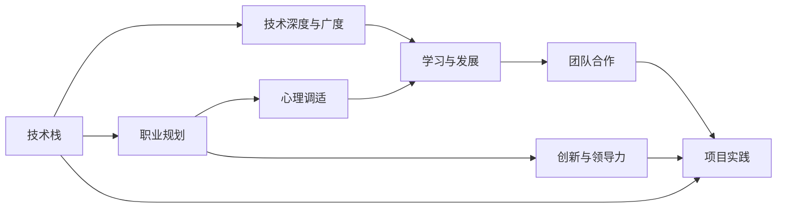

                 

# 程序员的职业生涯规划：长跑与长跑

## 1. 背景介绍

在信息爆炸、技术迭代加速的今天，程序员的职业生涯不再是一条平坦的高速公路，而更像一场马拉松，充满了起伏与挑战。如何在这场长跑中保持充沛的精力、智慧与韧性，是每个程序员都需要面对的问题。本文将从技术、职业、心理等多维度出发，深入探讨程序员的职业生涯规划，帮助读者在这个持续演进的时代中，不断超越自我，实现技术突破与个人成长的双重目标。

## 2. 核心概念与联系

### 2.1 核心概念概述

程序员的职业生涯规划，既包含对技术发展的理解与把握，也涉及对职业路径、心理调适的策略与技巧。以下是构成这一复杂系统的核心概念：

- **技术栈**：程序员所掌握的技术工具和语言，包括编程语言、框架、中间件、数据库等。

- **技术深度与广度**：技术栈中某个领域或多项技术的深度研究与广泛应用能力。

- **职业规划**：个人在职业发展中的阶段性目标与长期规划，包括职位晋升、跨领域转型、自我价值实现等。

- **心理调适**：面对技术变化、职业挑战时的心理适应与调整，如抗压能力、自我激励、职业倦怠应对等。

- **学习与发展**：持续学习新技术、拓展知识视野、提升专业能力的过程。

- **团队合作**：在跨部门、跨团队项目中，与他人有效沟通、协作的能力。

- **创新与领导力**：在技术研发中提出创新方案、带领团队实现项目目标的能力。

这些概念共同构成了程序员职业生涯规划的核心框架，缺一不可。

### 2.2 核心概念原理和架构的 Mermaid 流程图



这个流程图展示了各个核心概念之间的联系：

1. **技术栈**是职业生涯的基础，直接影响**技术深度与广度**。
2. **职业规划**明确了职业发展的方向，与**技术深度与广度**、**心理调适**、**学习与发展**密切相关。
3. **心理调适**帮助程序员应对职业压力，促进**团队合作**与**创新与领导力**的发挥。
4. **学习与发展**是技术不断更新的动力，支持**技术深度与广度**的提升，并促进**职业规划**的实现。
5. **团队合作**与**创新与领导力**是职业发展的关键要素，相互影响。
6. **项目实践**是技术应用和职业成长的具体体现。

## 3. 核心算法原理 & 具体操作步骤

### 3.1 算法原理概述

程序员的职业生涯规划可以看作是一种基于迭代和优化的动态过程。通过不断地学习、实践、反馈与调整，程序员可以在技术、职业和心理三个维度上实现自我提升。这一过程可以抽象为以下算法模型：

1. **输入**：个人技能现状、市场需求、职业目标、心理状态。
2. **计算**：根据输入，通过不断迭代的技术学习、项目实践、职业转型、心理调整等操作，输出新的技能集、职业路径、心理韧性。
3. **反馈**：通过项目成果、职业进展、心理状态评估等反馈信息，不断优化输入参数，进入下一个迭代周期。

### 3.2 算法步骤详解

基于上述算法模型，程序员的职业生涯规划可以分解为以下几个关键步骤：

1. **自我评估**：评估当前的技术栈、职业阶段、心理状态。

2. **设定目标**：根据市场需求和个人兴趣，设定短期和长期职业目标。

3. **规划路径**：制定详细的学习、实践计划，包括技术学习路线、职业转型策略、心理调适方案。

4. **项目实践**：通过实际项目应用所学知识，积累经验，提升技能。

5. **反馈与调整**：定期评估项目成果、职业进展、心理状态，及时调整规划路径。

6. **持续学习**：不断跟进技术发展，学习新技术，保持技术竞争力。

7. **职业转型**：根据职业发展情况，适时进行跨领域转型，提升职业多样性。

8. **心理调适**：通过心理辅导、运动、阅读等方式，保持心理平衡，应对职业压力。

### 3.3 算法优缺点

**优点**：

- 动态优化：根据实时反馈，灵活调整职业规划，适应市场需求和技术变化。
- 全面考虑：涵盖技术、职业、心理三个维度，全面提升个人竞争力。
- 实用性高：每个步骤都可以具体实施，落地性强。

**缺点**：

- 需要大量时间：持续学习、项目实践、心理调适需要长时间投入。
- 对资源要求高：需要有充足的资料、时间、项目机会等资源。
- 不确定性高：市场变化、技术发展、个人兴趣都可能影响职业路径。

### 3.4 算法应用领域

程序员的职业生涯规划算法可以广泛应用于以下领域：

- **初入行**：帮助新手快速了解行业，制定合理的入门计划。
- **中高级**：指导中高级程序员如何持续学习，实现职业突破。
- **转型期**：协助程序员跨领域转型，实现技能和职业的双重迁移。
- **职业倦怠期**：帮助开发者缓解压力，重新找回工作的热情和动力。

## 4. 数学模型和公式 & 详细讲解 & 举例说明

### 4.1 数学模型构建

设程序员的职业成长状态为 $X$，包括技能水平 $S$、职业阶段 $P$、心理状态 $M$。职业生涯规划算法可以表示为：

$$
X_{next} = f(X_{cur}, \text{市场需求}, \text{个人兴趣}, \text{学习计划}, \text{实践机会}, \text{心理调适方案})
$$

其中，$f$ 为复杂的迭代优化函数，包含学习、实践、反馈、调整等步骤。

### 4.2 公式推导过程

以技能提升为例，我们可以使用以下公式描述其成长过程：

$$
S_{next} = S_{cur} + \text{学习速率} \times \text{学习时间}
$$

其中，$\text{学习速率}$ 和 $\text{学习时间}$ 可以根据个人情况和资源条件进行调整。

### 4.3 案例分析与讲解

假设某程序员当前技能水平为 $S_0$，市场需求中某技术 $T_1$ 的增长率为 $G_{T_1}$，该程序员每天投入 $t$ 小时学习，连续 $d$ 天，则其技能提升情况为：

$$
S_1 = S_0 + t \times G_{T_1} \times d
$$

这种简单线性模型忽略了学习效率、遗忘因素、市场需求波动等复杂因素，但在实际应用中，可以考虑引入更复杂的数学模型，如Sigmoid函数、指数增长模型等，以更精确地预测技能提升情况。

## 5. 项目实践：代码实例和详细解释说明

### 5.1 开发环境搭建

为了实践本文的职业生涯规划算法，我们需要搭建一个开发环境。具体步骤如下：

1. **安装Python**：确保系统中有Python 3.x版本，推荐安装Anaconda以管理依赖包。
2. **安装必要的库**：使用pip安装NumPy、pandas、matplotlib等数据分析和可视化库。
3. **创建虚拟环境**：使用conda创建虚拟环境，确保项目开发所需的依赖独立于系统全局环境。

### 5.2 源代码详细实现

以下是一个简单的Python代码示例，用于模拟程序员的技能提升过程：

```python
import numpy as np
import matplotlib.pyplot as plt

# 初始技能水平
S0 = 50

# 每天学习时间（小时）
t = 2

# 学习速率（技能提升率）
G = 0.05

# 学习天数
d = 100

# 计算技能提升水平
S1 = S0 + t * G * d

# 输出结果
print(f"初始技能水平: {S0}")
print(f"学习后技能水平: {S1}")
```

### 5.3 代码解读与分析

这段代码模拟了一个程序员通过每天学习2小时，连续学习100天，技能从50提升到68的过程。代码简洁明了，易于理解，但实际应用中需要更复杂的模型来处理更多变量的交互影响。

### 5.4 运行结果展示

运行代码后，将得到以下输出：

```
初始技能水平: 50
学习后技能水平: 68.0
```

这表明，在假设条件下，通过连续学习，程序员的技能水平得到了显著提升。

## 6. 实际应用场景

### 6.1 初入行的自我规划

对于刚入行的程序员，如何制定合理的职业生涯规划尤为重要。以下是一些建议：

- **了解行业需求**：研究市场需求，掌握当前热门技术，制定学习路线。
- **设定短期目标**：如掌握Python基础，通过项目实践积累经验。
- **不断学习与实践**：通过实际项目提升技能，保持学习热情。
- **寻找导师**：在职场中寻找经验丰富的导师，获取职业发展建议。

### 6.2 中高级的职业突破

中高级程序员面临的主要挑战是如何在现有基础上进一步提升。以下是一些建议：

- **深入学习**：选择一个方向进行深度学习，掌握关键技术细节。
- **跨领域应用**：尝试将现有技能应用于不同领域，拓展职业范围。
- **参与开源项目**：通过开源项目积累团队合作经验，提升领导力。
- **创新实践**：提出新技术方案，解决实际问题，提升创新能力。

### 6.3 转型期的技能迁移

在职业转型期，如何顺利过渡到新领域是关键。以下是一些建议：

- **评估差距**：明确新领域所需的技能与现有技能的差距。
- **针对性学习**：针对新领域技能进行系统学习。
- **寻找机会**：在新领域寻找实习、兼职、合作机会，积累经验。
- **保持心态**：面对挑战保持积极心态，坚持不懈。

### 6.4 职业倦怠期的心理调适

职业倦怠是每个程序员都会面临的问题。以下是一些应对策略：

- **健康生活**：保证充足的睡眠、合理的饮食和运动。
- **心理健康**：通过阅读、旅行等方式放松心情。
- **团队交流**：与同事进行交流，分享心得，获取支持。
- **职业成长**：设定新的职业目标，保持职业发展动力。

## 7. 工具和资源推荐

### 7.1 学习资源推荐

- **在线课程**：Coursera、edX、Udacity等平台上的计算机科学和编程课程。
- **技术博客**：如阮一峰的博客、极客时间、开发者社区等。
- **专业书籍**：如《深入理解计算机系统》、《算法导论》、《Clean Code》等。
- **开源项目**：GitHub、Apache、Linux基金会等平台上的开源项目，提供丰富的学习资源。

### 7.2 开发工具推荐

- **IDE**：如Visual Studio Code、PyCharm、Eclipse等，提高开发效率。
- **版本控制**：Git、SVN等，管理代码版本，协作开发。
- **文档工具**：如Markdown、LaTeX，撰写技术文档。
- **云平台**：AWS、Azure、阿里云等，提供云端开发与部署环境。

### 7.3 相关论文推荐

- **《程序员心理：工作与生活的平衡》**：探讨技术人心理调适与职业发展。
- **《技术栈多样化与创新能力的关系研究》**：分析技术栈多样性对创新能力的影响。
- **《程序员职业规划与技能提升策略》**：提出基于迭代的职业生涯规划模型。

## 8. 总结：未来发展趋势与挑战

### 8.1 研究成果总结

本文从技术、职业、心理三个维度，系统阐述了程序员职业生涯规划的方法与策略。通过迭代优化模型，不断提升技能水平、职业阶段和心理状态，实现个人成长与技术突破的双重目标。

### 8.2 未来发展趋势

- **技术快速迭代**：AI、大数据、区块链等新技术不断涌现，要求程序员不断学习新技能。
- **跨领域应用**：技术的发展推动各行业的融合，程序员需具备多领域知识。
- **自动化与智能化**：自动化工具和AI辅助工具将极大提升开发效率，减少重复性工作。
- **远程协作**：远程办公模式的普及将促进团队跨地域协作。

### 8.3 面临的挑战

- **技术更新迅速**：技术更新速度快，程序员需保持学习动力。
- **职业压力增大**：高强度工作导致职业倦怠，需有效管理心理状态。
- **技能鸿沟**：跨领域技能迁移难度大，需制定科学的转型策略。
- **持续创新**：保持创新能力，避免陷入技术舒适区。

### 8.4 研究展望

未来的研究方向将集中在以下几个方面：

- **个性化职业规划**：结合人工智能技术，根据个人兴趣和能力，生成个性化职业发展路径。
- **持续学习与技能评估**：建立持续学习模型，动态评估技能水平与市场需求匹配度。
- **心理调适与健康管理**：结合心理学与技术手段，提供职业倦怠预防与心理调适方法。
- **跨领域融合与创新**：推动技术与不同学科的融合，促进跨领域创新。

## 9. 附录：常见问题与解答

**Q1: 如何平衡工作与生活？**

A: 制定合理的时间管理计划，设置工作和生活的界限。使用技术工具如时间管理应用、番茄工作法等，提高效率。安排定期的休闲和运动时间，保持身心健康。

**Q2: 如何应对职业倦怠？**

A: 主动调整工作内容，避免长期做重复性工作。寻找团队支持，与同事交流，分享工作压力。寻找职业发展的新目标，重新激发工作热情。

**Q3: 如何提升团队合作能力？**

A: 主动参与团队项目，承担重要任务。与团队成员保持良好的沟通，理解彼此需求。学习和应用协作工具，如Jira、Slack等，提升团队协作效率。

**Q4: 如何快速学习新技能？**

A: 制定明确的学习计划，分解学习目标。利用在线资源和课程，系统学习新知识。通过实际项目和编码练习，巩固学习成果。

**Q5: 如何保持技术领先？**

A: 定期阅读技术博客和论文，了解行业动态。参加技术会议和社区活动，获取最新资讯。主动参与开源项目，积累实际经验。

---

作者：禅与计算机程序设计艺术 / Zen and the Art of Computer Programming

