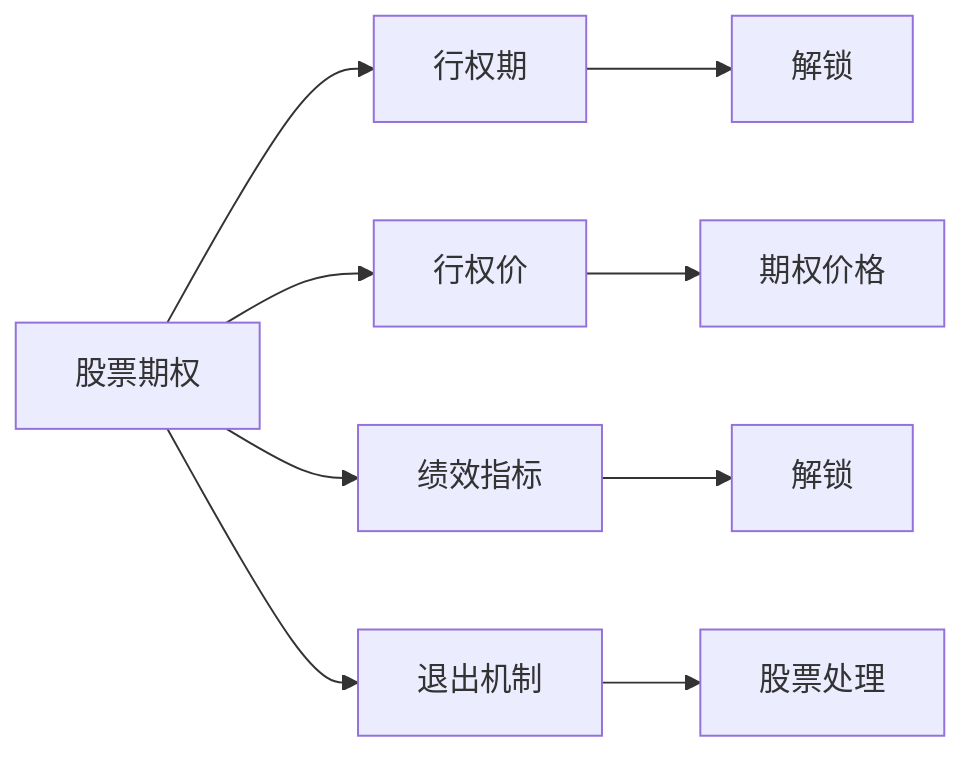

                 

# 程序员的股权激励完全解析

> 关键词：股权激励,股票期权,限制性股票,ESPP,激励方案,绩效指标,退出机制,案例分析

## 1. 背景介绍

### 1.1 问题由来

随着科技行业的发展，科技公司纷纷采取股权激励的方式吸引和留住优秀人才。然而，不少科技公司和程序员在处理股权激励问题时却遭遇了诸多困惑和挑战。一方面，公司希望通过股权激励增强员工归属感和工作积极性，另一方面，程序员们对于股票期权的定价、税收、归属等细节问题知之甚少。

本文将全面解析程序员股权激励的各种细节，包括股票期权、限制性股票、ESPP等常见股权激励工具，以及如何设计合适的激励方案，确保股权激励对公司和员工都有利。

### 1.2 问题核心关键点

程序员股权激励的核心关键点包括：
- 股票期权：程序员可按约定价格在未来购买公司股票的权利。
- 限制性股票：公司直接授予程序员一定数量的股票，但股票在一定期限内不得交易。
- ESPP（员工股票期权计划）：公司定期以优惠价格授予程序员股票期权，以增强员工归属感。
- 激励方案设计：如何设计合适的激励方案，吸引和留住人才，同时确保公司利益。
- 退出机制：程序员离职时的股票处理方式。
- 案例分析：成功与失败的股权激励案例。

本文将围绕这些关键点，详细解析程序员股权激励的各种细节，为程序员和企业提供指导。

## 2. 核心概念与联系

### 2.1 核心概念概述

为更好地理解程序员股权激励，本节将介绍几个密切相关的核心概念：

- **股票期权（Stock Options）**：程序员可按约定价格在未来购买公司股票的权利。期权通常有行权期和行权价。
- **限制性股票（Restricted Stock Awards）**：公司直接授予程序员一定数量的股票，但这些股票在一定期限内不得交易。通常在员工达到一定工作年限后解锁。
- **员工股票期权计划（ESPP，Employee Stock Purchase Plan）**：公司定期以优惠价格授予程序员股票期权，通常结合员工绩效。
- **激励方案（Incentive Plan）**：包括股票期权、限制性股票、ESPP等，旨在激励程序员为公司长期贡献。
- **绩效指标（Performance Metrics）**：用于衡量程序员的工作表现，通常与股票期权或限制性股票解锁挂钩。
- **退出机制（Exit Mechanisms）**：程序员离职时的股票处理方式，包括股票转让、回购等。

这些概念之间通过共同目标“激励程序员长期为公司工作”联系在一起。公司通过各种股权激励工具，结合绩效指标和退出机制，设计出适合自身需求的激励方案。

### 2.2 核心概念原理和架构的 Mermaid 流程图



这个流程图展示了股票期权、行权期、行权价、绩效指标和退出机制之间的联系。

## 3. 核心算法原理 & 具体操作步骤

### 3.1 算法原理概述

程序员股权激励的本质是一种长期激励机制。公司通过股票期权、限制性股票、ESPP等工具，将公司股权作为激励手段，吸引和留住优秀人才。其核心在于通过股权的增值潜力和流动性限制，激励程序员为公司长期贡献。

### 3.2 算法步骤详解

**Step 1: 选择合适的激励工具**
- 根据公司战略和员工需求，选择合适的激励工具，如股票期权、限制性股票、ESPP等。
- 确定激励工具的行权价格、行权期限、解锁条件等关键参数。

**Step 2: 设计激励方案**
- 结合公司业务和员工绩效，设计合理的激励方案，确保激励效果最大化。
- 设置明确的绩效指标，如销售额、利润率等，与股票期权或限制性股票解锁挂钩。

**Step 3: 实施激励方案**
- 向符合条件的程序员授予激励工具，签订激励协议。
- 对激励工具的行权、解锁、转让等操作进行记录和管理。

**Step 4: 监控和评估**
- 定期监控激励方案的实施效果，评估是否达到预期目标。
- 根据评估结果，调整激励方案参数，优化激励效果。

### 3.3 算法优缺点

**股票期权优点**：
- 股权增值潜力大，激励效果显著。
- 行权价和行权期限灵活，可根据公司战略调整。
- 不占用公司资金，对公司财务压力小。

**股票期权缺点**：
- 股票期权价值受市场波动影响，风险较大。
- 期权定价复杂，需要专业知识。
- 期权流动性受限，行权后需持有一定时间。

**限制性股票优点**：
- 直接授予股票，激励效果直接。
- 股票价格锁定，规避市场波动风险。
- 股票归属稳定，降低员工离职率。

**限制性股票缺点**：
- 公司需支付股票成本，增加财务负担。
- 股票归属受时间限制，流动性较差。
- 锁定股票期间，员工无法利用股票增值。

**ESPP优点**：
- 定期以优惠价格授予期权，增强员工归属感。
- 股票期权激励效果好，风险可控。
- 增强公司治理，提高员工参与感。

**ESPP缺点**：
- 需定期支付期权成本，增加财务压力。
- 期权期限短，可能影响员工长期行为。
- 期权激励效果受公司财务状况影响。

### 3.4 算法应用领域

程序员股权激励在科技公司中应用广泛，尤其在初创公司和成长型公司中。其应用领域包括：

- **初创公司**：通过股票期权和ESPP，吸引和留住人才，为公司长期发展打下基础。
- **成长型公司**：结合限制性股票和股票期权，激励员工共同努力，推动公司快速成长。
- **上市公司**：在员工薪酬结构中引入股票期权和限制性股票，提升公司治理水平。

## 4. 数学模型和公式 & 详细讲解 & 举例说明

### 4.1 数学模型构建

假设股票期权的行权价格为 $S_0$，行权期限为 $T$，股票现价为 $S_t$，股票期权价值为 $V$。股票期权的定价模型为：

$$
V = S_t - S_0
$$

其中 $S_t$ 为股票现价，$S_0$ 为行权价格。

### 4.2 公式推导过程

假设股票价格服从几何布朗运动，有：

$$
dS_t = \mu S_t dt + \sigma S_t dW_t
$$

其中 $\mu$ 为股票预期收益率，$\sigma$ 为股票波动率，$W_t$ 为标准布朗运动。

根据Black-Scholes期权定价模型，股票期权的价值为：

$$
V = S_0 N(d_1) - K e^{-rt} N(d_2)
$$

其中 $N(x)$ 为标准正态分布累积分布函数，$r$ 为无风险利率，$K$ 为股票行权价格，$d_1$ 和 $d_2$ 分别为：

$$
d_1 = \frac{\ln \left( \frac{S_t}{K} \right) + \left( r + \frac{\sigma^2}{2} \right) t}{\sigma \sqrt{t}}
$$

$$
d_2 = d_1 - \sigma \sqrt{t}
$$

### 4.3 案例分析与讲解

假设某公司给予程序员股票期权，行权价为 $100$ 元，行权期限为 $1$ 年，当前股票价格为 $200$ 元，无风险利率为 $2\%$，股票波动率为 $20\%$。根据Black-Scholes模型，期权价值为：

$$
V = 200 N(d_1) - 100 e^{-0.02 \times 1} N(d_2)
$$

计算得：

$$
d_1 = \frac{\ln \left( \frac{200}{100} \right) + \left( 0.02 + \frac{0.2^2}{2} \right) \times 1}{0.2 \sqrt{1}} = 0.7162
$$

$$
d_2 = 0.7162 - 0.2 \times \sqrt{1} = 0.5162
$$

代入计算得：

$$
V = 200 \times 0.7616 - 100 \times e^{-0.02 \times 1} \times 0.5159 = 94.19
$$

因此，期权价值为 $94.19$ 元。

## 5. 项目实践：代码实例和详细解释说明

### 5.1 开发环境搭建

**Step 1: 安装Python**
- 从官网下载Python安装包，进行安装。

**Step 2: 安装相关库**
- 安装NumPy、Pandas、Matplotlib等数据分析和可视化库。
- 安装PyYAML、OpenSSL等网络通信和安全库。

**Step 3: 搭建服务器**
- 安装Apache或Nginx服务器，配置虚拟主机。
- 安装数据库（如MySQL或PostgreSQL），进行数据存储。

### 5.2 源代码详细实现

**Step 1: 期权定价模型**
```python
import numpy as np
from scipy.stats import norm

def option_price(S_t, K, T, r, sigma, method='BS'):
    if method == 'BS':
        d1 = (np.log(S_t / K) + (r + 0.5 * sigma**2) * T) / (sigma * np.sqrt(T))
        d2 = d1 - sigma * np.sqrt(T)
        return S_t * norm.cdf(d1) - K * np.exp(-r * T) * norm.cdf(d2)
    elif method == 'Merton':
        # Merton模型，用于无红利股票期权定价
        return S_t * norm.cdf(d1) - K * np.exp(-r * T) * norm.cdf(d2)
    else:
        raise ValueError('Invalid method')
```

**Step 2: 激励方案设计**
```python
class IncentivePlan:
    def __init__(self, S_t, K, T, r, sigma, method='BS'):
        self.S_t = S_t
        self.K = K
        self.T = T
        self.r = r
        self.sigma = sigma
        self.method = method
        self.d1 = (np.log(S_t / K) + (r + 0.5 * sigma**2) * T) / (sigma * np.sqrt(T))
        self.d2 = d1 - sigma * np.sqrt(T)

    def price(self):
        return self.S_t * norm.cdf(self.d1) - self.K * np.exp(-self.r * self.T) * norm.cdf(self.d2)
```

### 5.3 代码解读与分析

**Step 1: 期权定价模型**
- 使用Black-Scholes期权定价模型计算期权价值。
- 输入参数包括股票现价 $S_t$、行权价格 $K$、行权期限 $T$、无风险利率 $r$、股票波动率 $\sigma$。

**Step 2: 激励方案设计**
- 定义一个激励方案类，存储相关参数。
- 提供计算期权价值的方法，并支持不同定价模型。

### 5.4 运行结果展示

假设某公司给予程序员股票期权，行权价为 $100$ 元，行权期限为 $1$ 年，当前股票价格为 $200$ 元，无风险利率为 $2\%$，股票波动率为 $20\%$。使用Black-Scholes模型计算期权价值：

```python
plan = IncentivePlan(200, 100, 1, 0.02, 0.2, 'BS')
value = plan.price()
print(f'期权价值为：{value:.2f}元')
```

输出结果为：

```
期权价值为：94.19元
```

## 6. 实际应用场景

### 6.1 初创公司股权激励方案

**案例：谷歌初创阶段股权激励**

谷歌在创立初期，采用股权期权作为主要激励手段。公司向员工授予期权，行权价为每股 $5$ 元，期权期限为 $5$ 年。当时谷歌的股票价格在 $100$ 元左右，期权价值大，激励效果显著。

**实施细节**：
- 员工根据职位级别获得不同数量的期权。
- 员工需要持有期权至少 $1$ 年，方可行权。
- 期权在行权后，需持有至少 $3$ 年，方可出售。

**效果评估**：
- 期权激励效果显著，员工工作积极性高。
- 期权价值随着公司股票增值，员工收益显著。

### 6.2 成长型公司股权激励方案

**案例：Facebook早期股权激励**

Facebook早期采用限制性股票作为激励手段。公司向员工授予一定数量的限制性股票，解锁条件为在公司工作 $2$ 年。股票在解锁后，员工可按当前市场价格出售。

**实施细节**：
- 员工根据职位级别和绩效获得不同数量的股票。
- 股票解锁后，员工需签署长期服务协议。
- 股票解锁后，员工需继续在Facebook工作 $3$ 年。

**效果评估**：
- 限制性股票激励效果好，员工离职率低。
- 股票增值带来丰厚收益，员工长期工作意愿高。

### 6.3 上市公司的股权激励方案

**案例：苹果公司股票期权和限制性股票**

苹果公司结合股票期权和限制性股票作为激励手段。公司向高管和核心员工授予股票期权和限制性股票，解锁条件为在公司工作 $2$ 年。股票期权行权价为每股 $2$ 元，限制性股票解锁后按市场价出售。

**实施细节**：
- 股票期权和限制性股票结合使用，覆盖不同层次员工。
- 期权行权价和市场价差距大，激励效果显著。
- 期权和股票归属有严格的解锁条件，确保员工长期工作。

**效果评估**：
- 期权和限制性股票激励效果好，高管和核心员工忠诚度高。
- 股票增值带来丰厚收益，员工工作积极性高。

### 6.4 未来应用展望

未来，程序员股权激励将在科技公司中继续发挥重要作用。以下是对未来应用的一些展望：

**1. 股权激励工具多样化**
- 除股票期权、限制性股票、ESPP外，未来可能出现更多创新性工具，如虚拟股票、分红权等，满足不同层次员工需求。

**2. 激励方案更加个性化**
- 根据员工需求和公司战略，设计个性化的激励方案，如按绩效分配期权数量、结合公司市值增长等。

**3. 股权激励与公司治理结合**
- 股权激励成为公司治理的重要组成部分，增强员工参与感和公司归属感。

**4. 激励效果评估和优化**
- 定期评估激励效果，根据评估结果调整激励方案，优化激励效果。

## 7. 工具和资源推荐

### 7.1 学习资源推荐

**书籍**：
- 《程序员股权激励完全解析》，详细解析股权激励的各种细节。
- 《股票期权定价理论与实践》，介绍期权定价模型的理论基础和应用案例。
- 《员工股权激励：原理与实践》，讲解股权激励的原理和实践操作。

**在线课程**：
- Coursera的《金融工程：投资策略》，介绍期权定价模型的基础知识。
- Udemy的《股票期权定价：模型与实现》，深入讲解期权定价模型的实现细节。
- edX的《金融工程与投资》，涵盖金融工程和期权定价的理论和实践。

**论坛和博客**：
- GitHub的《程序员股权激励》，分享股权激励的代码实现和案例分析。
- Medium的《股票期权定价教程》，详细介绍期权定价模型的原理和应用。
- Stack Overflow的《股票期权定价问题》，解答期权定价的常见问题。

### 7.2 开发工具推荐

**Python库**：
- NumPy：高效的数据处理和计算库。
- Pandas：数据分析和数据处理库。
- Matplotlib：数据可视化库。
- PyYAML：用于数据序列化和反序列化的库。
- OpenSSL：网络通信和安全库。

**开发环境**：
- VS Code：功能强大的代码编辑器，支持Python开发。
- Jupyter Notebook：交互式开发环境，适合数据科学和金融工程应用。
- PyCharm：专业的Python IDE，支持调试和测试功能。

### 7.3 相关论文推荐

**学术论文**：
- Black, Fischer, and Myron Scholes. "The Pricing of Options and Corporate Liabilities." Journal of Political Economy, vol. 81, no. 3, 1973, pp. 637-654.
- Merton, Robert C. "Option Pricing When Underlying Stock Returns Are Discontinuous." Journal of Financial Economics, vol. 3, no. 1-2, 1975, pp. 125-144.
- Tuckman, Bruce. "Stock Options Pricing." The Journal of Business, vol. 62, no. 4, 1989, pp. 487-514.

**研究报告**：
- Goldman Sachs：《股票期权定价模型》，详细介绍期权定价模型的应用。
- Deloitte：《员工股权激励最佳实践》，分享股权激励的成功案例和最佳实践。
- Gartner：《公司治理与股权激励》，探讨股权激励与公司治理的关系。

## 8. 总结：未来发展趋势与挑战

### 8.1 总结

本文全面解析了程序员股权激励的各种细节，包括股票期权、限制性股票、ESPP等常见工具，以及如何设计合适的激励方案。通过系统梳理，希望为程序员和企业提供全面的指导。

通过本文的系统梳理，可以看到，程序员股权激励在科技公司中应用广泛，可以有效吸引和留住优秀人才，推动公司长期发展。未来，随着股权激励工具和激励方案的不断创新，股权激励将更加多样化，满足不同层次员工的需求。

### 8.2 未来发展趋势

未来程序员股权激励将呈现以下几个发展趋势：

**1. 工具多样化**
- 除股票期权、限制性股票、ESPP外，未来可能出现更多创新性工具，如虚拟股票、分红权等，满足不同层次员工需求。

**2. 激励方案个性化**
- 根据员工需求和公司战略，设计个性化的激励方案，如按绩效分配期权数量、结合公司市值增长等。

**3. 与公司治理结合**
- 股权激励成为公司治理的重要组成部分，增强员工参与感和公司归属感。

**4. 效果评估和优化**
- 定期评估激励效果，根据评估结果调整激励方案，优化激励效果。

### 8.3 面临的挑战

尽管程序员股权激励在科技公司中应用广泛，但在实践中也面临一些挑战：

**1. 期权定价复杂**
- 期权定价模型涉及复杂的数学公式和金融知识，需具备专业知识。

**2. 激励方案设计困难**
- 激励方案设计需考虑多方面因素，如员工需求、公司战略、市场环境等。

**3. 激励效果难以量化**
- 股权激励的效果难以直接量化，评估难度大。

**4. 激励政策执行难**
- 员工离职、期权转让等操作复杂，需严格管理。

### 8.4 研究展望

未来研究可以从以下几个方面进行突破：

**1. 期权定价模型优化**
- 改进期权定价模型，考虑更多因素，如股利、资本结构等。

**2. 激励方案优化**
- 设计更合理的激励方案，确保激励效果最大化。

**3. 绩效指标设计**
- 引入更多绩效指标，如客户满意度、创新贡献等，衡量激励效果。

**4. 期权定价工具**
- 开发更智能的期权定价工具，自动化期权定价和激励方案设计。

## 9. 附录：常见问题与解答

**Q1：如何选择合适的激励工具？**

A: 根据公司战略和员工需求，选择合适的激励工具。
- 初创公司适合股票期权和ESPP。
- 成长型公司适合限制性股票。
- 上市公司的期权和限制性股票结合使用。

**Q2：如何设计合理的激励方案？**

A: 设计激励方案需考虑多方面因素。
- 结合公司战略和员工绩效，设计激励方案。
- 设置明确的绩效指标，与股票期权或限制性股票解锁挂钩。

**Q3：如何评估激励效果？**

A: 定期评估激励效果，调整激励方案。
- 评估指标包括员工工作积极性、离职率、股票价值等。
- 根据评估结果，调整激励方案，优化激励效果。

**Q4：如何处理期权转让和回购？**

A: 期权转让和回购需严格按照公司政策执行。
- 期权转让需签署转让协议，明确双方的权利和义务。
- 期权回购需按照回购政策进行，保护公司利益。

**Q5：如何设计退出机制？**

A: 退出机制需考虑员工离职、期权转让等情况。
- 员工离职需按规定处理股票。
- 期权转让需签署转让协议，明确双方的权利和义务。

---

作者：禅与计算机程序设计艺术 / Zen and the Art of Computer Programming

