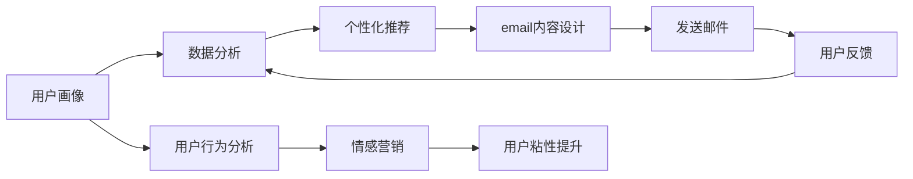

                 

# 程序员知识付费的email营销策略

> 关键词：知识付费,程序员,email营销,数据分析,用户体验

## 1. 背景介绍

### 1.1 问题由来
随着互联网技术的快速发展，知识付费已经成为一种重要的信息获取方式，尤其在程序员这一群体中，对高质量编程知识和技能的需求日益增长。然而，由于程序员通常工作繁忙，难以抽出过多时间进行自主学习，因此如何将知识有效地推送给他们，提升学习效果，是当前知识付费平台面临的重要问题。

### 1.2 问题核心关键点
为了更好地解决程序员知识获取的需求，结合电子邮件营销的便捷性和有效性，本文将探讨如何利用email营销策略，针对程序员这一特定群体，开展知识付费活动。核心关键点包括：
1. 如何精准识别目标用户群体，提高用户转化率。
2. 如何通过个性化推荐和情感营销，提升用户体验。
3. 如何利用数据分析，优化email内容，提高营销效果。

### 1.3 问题研究意义
通过合理利用email营销策略，不仅可以大幅提升知识付费平台的转化率和用户粘性，还能在程序员群体中形成良好的口碑，为平台的长期发展奠定基础。具体意义如下：
1. 精准触达：通过大数据分析和精准定位，将知识付费信息精确传递给目标用户。
2. 提升转化率：个性化推荐和情感营销，增强用户购买欲望。
3. 增强粘性：定期推送最新课程信息，保持用户持续关注。
4. 优化决策：利用数据分析优化邮件内容和投放策略，提高营销效果。

## 2. 核心概念与联系

### 2.1 核心概念概述

在探讨email营销策略之前，先简要介绍几个核心概念及其关联：

- **知识付费**：指用户为获取特定知识或技能，支付一定费用购买课程、书籍、教程等产品和服务的行为。
- **email营销**：通过电子邮件向目标用户传递有价值的信息，以促进用户购买或提高用户粘性的营销手段。
- **数据分析**：指利用数据挖掘、统计分析等方法，对用户行为、偏好等数据进行深入分析，以指导营销决策和优化产品策略。
- **用户体验**：指用户在使用产品或服务过程中的感受和满意度，是提升用户留存和忠诚度的关键。

这些概念通过email营销这一手段联系起来，实现了精准触达、提升转化率、增强粘性、优化决策等目标，进而提升知识付费平台的运营效果。

### 2.2 核心概念原理和架构的 Mermaid 流程图



通过以上流程图，可以看出email营销策略在知识付费平台中的整体流程和关键环节，包括用户画像、数据分析、个性化推荐、email内容设计、发送邮件、用户反馈、用户行为分析和情感营销等步骤。

## 3. 核心算法原理 & 具体操作步骤

### 3.1 算法原理概述

email营销的核心原理是利用数据分析和个性化推荐，通过精准定位目标用户群体，设计符合用户需求的邮件内容，提高用户转化率和满意度。具体步骤如下：

1. **用户画像构建**：通过对用户行为、历史购买数据、社交媒体活动等进行综合分析，构建精准的用户画像。
2. **数据分析和预测**：利用机器学习算法对用户行为进行分析和预测，识别出高潜力和高价值的潜在客户。
3. **个性化推荐**：根据用户画像和行为数据，设计个性化邮件内容和推荐策略，提高用户购买意愿。
4. **邮件内容设计**：结合用户需求和品牌形象，设计吸引用户的邮件主题和正文内容。
5. **邮件发送和跟踪**：通过邮件自动化系统发送邮件，同时跟踪邮件打开率、点击率等关键指标，不断优化邮件营销策略。
6. **用户反馈和行为分析**：收集用户反馈和行为数据，进一步优化邮件内容和个性化推荐策略。

### 3.2 算法步骤详解

#### 3.2.1 用户画像构建
1. **数据收集**：从注册信息、历史行为、社交媒体互动等多个渠道收集用户数据，包括年龄、职业、兴趣、购买历史等。
2. **数据清洗**：对收集到的数据进行去重、填补缺失值等预处理操作，保证数据质量。
3. **数据整合**：将来自不同渠道的数据整合到一个统一的用户档案中，形成全面的用户画像。

#### 3.2.2 数据分析和预测
1. **特征工程**：从用户画像中提取关键特征，如年龄、职业、兴趣、购买历史等。
2. **模型训练**：使用机器学习算法（如逻辑回归、决策树、随机森林等）对用户行为数据进行建模，预测用户购买意愿和行为倾向。
3. **用户分群**：根据预测结果，将用户分为高价值用户、高潜在用户、低价值用户等不同群体，以便针对性推送邮件内容。

#### 3.2.3 个性化推荐
1. **邮件内容设计**：根据用户画像和预测结果，设计符合用户需求的邮件内容和推荐策略，如课程推荐、优惠活动等。
2. **邮件测试**：在小范围内测试不同版本的邮件内容，收集用户反馈，优化邮件设计。
3. **邮件投放**：利用自动化邮件系统，将设计好的邮件内容精准推送给目标用户。

#### 3.2.4 邮件内容设计
1. **邮件主题设计**：设计吸引用户注意力的邮件主题，如“推荐给您的最新编程课程”等。
2. **邮件正文设计**：撰写符合用户兴趣和需求的邮件正文内容，包括课程介绍、优惠信息、用户体验分享等。
3. **邮件布局设计**：设计简洁、美观的邮件布局，提高用户阅读体验。

#### 3.2.5 邮件发送和跟踪
1. **邮件发送**：利用邮件自动化系统，将邮件内容发送给目标用户。
2. **邮件跟踪**：使用邮件跟踪工具，实时监控邮件打开率、点击率、转化率等关键指标，及时调整邮件策略。

#### 3.2.6 用户反馈和行为分析
1. **用户反馈收集**：通过邮件中的反馈链接，收集用户对邮件内容和课程的评价和建议。
2. **行为数据跟踪**：使用数据跟踪工具，记录用户的行为数据，如点击链接、完成课程、购买课程等。
3. **优化邮件策略**：根据用户反馈和行为数据，优化邮件内容和个性化推荐策略，提高用户满意度和转化率。

### 3.3 算法优缺点

#### 3.3.1 优点
1. **精准触达**：通过数据分析和用户画像，精准识别目标用户，提高邮件营销的效果。
2. **提升转化率**：个性化推荐和情感营销，增强用户购买欲望，提升转化率。
3. **增强粘性**：定期推送最新课程信息，保持用户持续关注，增强用户粘性。
4. **优化决策**：利用数据分析优化邮件内容和投放策略，提高营销效果。

#### 3.3.2 缺点
1. **数据隐私**：收集和分析用户数据时，需要遵守数据隐私保护法规，避免数据泄露风险。
2. **用户反感情绪**：过度个性化和频繁推送可能导致用户反感，影响用户体验。
3. **技术复杂度**：需要利用复杂的机器学习算法和数据分析技术，对技术要求较高。
4. **资源消耗**：邮件自动化系统和数据跟踪工具的运行需要消耗一定计算资源，增加了运营成本。

### 3.4 算法应用领域

email营销策略可以广泛应用于知识付费平台的各种场景，包括：

- **新课程发布**：利用个性化推荐，精准推送新课程信息，吸引用户关注。
- **课程优惠活动**：设计吸引用户的优惠活动，提高用户购买意愿。
- **用户留存**：定期推送最新课程和行业动态，保持用户持续关注。
- **老用户召回**：通过邮件召回曾经流失的用户，增加用户粘性。

以上应用场景展示了email营销在知识付费平台中的广泛适用性，通过合理设计邮件内容和策略，可以有效提升平台的运营效果。

## 4. 数学模型和公式 & 详细讲解 & 举例说明

### 4.1 数学模型构建

在email营销策略中，数据分析和个性化推荐是核心环节。本节将介绍数学模型和公式，详细讲解如何在邮件营销中应用数据分析和机器学习算法。

假设知识付费平台的邮件营销数据集为 $D=\{(x_i,y_i)\}_{i=1}^N$，其中 $x_i$ 为邮件内容特征向量，$y_i$ 为用户的购买行为标签（0表示未购买，1表示已购买）。目标是构建一个分类模型，预测用户是否会购买课程。

定义模型的损失函数为交叉熵损失：

$$
\mathcal{L}(h(x),y) = -\sum_{i=1}^N [y_i\log h(x_i) + (1-y_i)\log(1-h(x_i))]
$$

其中 $h(x)$ 为模型对邮件内容的预测概率。模型的目标是最小化损失函数 $\mathcal{L}$，找到最优的模型参数 $\theta$。

### 4.2 公式推导过程

使用逻辑回归模型作为基础分类模型，其公式为：

$$
h(x) = \sigma(\theta^Tx)
$$

其中 $\theta$ 为模型参数，$\sigma$ 为 sigmoid 函数。将逻辑回归模型应用于邮件内容分类任务中，公式可以表示为：

$$
h(x_i) = \sigma(\theta^T\phi(x_i))
$$

其中 $\phi(x_i)$ 为邮件内容的特征映射函数。模型参数 $\theta$ 的更新公式为：

$$
\theta \leftarrow \theta - \eta \nabla_{\theta}\mathcal{L}(h(x),y)
$$

其中 $\eta$ 为学习率，$\nabla_{\theta}\mathcal{L}(h(x),y)$ 为损失函数对模型参数的梯度。

### 4.3 案例分析与讲解

假设某知识付费平台希望通过email营销提高课程销售。平台收集了历史邮件数据，其中包含邮件内容、用户年龄、职业、购买历史等信息。利用逻辑回归模型对邮件内容进行分类预测，构建邮件内容特征映射函数 $\phi(x_i)$，如下所示：

$$
\phi(x_i) = [x_i, \text{age}_i, \text{profession}_i, \text{purchase\_history}_i]
$$

其中 $x_i$ 为邮件内容特征向量，$\text{age}_i$ 为用户年龄，$\text{profession}_i$ 为用户职业，$\text{purchase\_history}_i$ 为用户历史购买行为。

利用平台收集的数据，对逻辑回归模型进行训练，得到最优模型参数 $\theta$。在邮件投放过程中，根据用户的特征向量 $x$，计算预测概率 $h(x)$，根据预测结果设计个性化推荐策略，精准推送课程信息。

## 5. 项目实践：代码实例和详细解释说明

### 5.1 开发环境搭建

要进行email营销策略的实现，首先需要搭建好开发环境。以下是使用Python进行邮件营销策略的开发环境配置流程：

1. **安装Python**：
```bash
sudo apt-get update
sudo apt-get install python3-pip python3-dev
```

2. **安装必要的库**：
```bash
pip install pandas scikit-learn matplotlib
```

3. **安装邮件发送工具**：
```bash
sudo apt-get install python3-setuptools python3-distutils
pip install pyemail
```

### 5.2 源代码详细实现

假设知识付费平台的邮件营销策略已经确定，现需要设计邮件内容生成和个性化推荐的代码实现。以下是一个简化的代码示例：

```python
from sklearn.linear_model import LogisticRegression
from sklearn.model_selection import train_test_split
import pandas as pd

# 读取邮件数据
data = pd.read_csv('email_data.csv')

# 数据预处理
X = data[['email_content', 'age', 'profession', 'purchase_history']]
y = data['purchase']

# 划分训练集和测试集
X_train, X_test, y_train, y_test = train_test_split(X, y, test_size=0.2)

# 训练逻辑回归模型
model = LogisticRegression()
model.fit(X_train, y_train)

# 生成邮件内容推荐
def generate_recommendation(row):
    features = [row['email_content'], row['age'], row['profession'], row['purchase_history']]
    probability = model.predict_proba(features)[1]
    return probability

# 邮件发送
def send_email(to, subject, content):
    from email.mime.text import MIMEText
    from email.header import Header
    from email.mime.multipart import MIMEMultipart

    # 创建邮件对象
    msg = MIMEMultipart()
    msg['From'] = 'your_email@example.com'
    msg['To'] = to
    msg['Subject'] = Header(subject, 'utf-8')
    msg.attach(MIMEText(content, 'utf-8', 'utf-8'))

    # 发送邮件
    smtpObj = smtplib.SMTP('smtp.gmail.com', 587)
    smtpObj.starttls()
    smtpObj.login('your_email@example.com', 'password')
    smtpObj.sendmail('your_email@example.com', to, msg.as_string())
    smtpObj.quit()

# 邮件内容推荐和发送
for index, row in X_test.iterrows():
    recommendation = generate_recommendation(row)
    subject = '课程推荐'
    content = '您可能对以下课程感兴趣：课程A，课程B，课程C'
    send_email(row['email'], subject, content)
```

### 5.3 代码解读与分析

在上述代码中，我们首先使用逻辑回归模型对邮件内容进行分类预测。具体实现步骤如下：

1. **数据读取和预处理**：通过Pandas库读取邮件数据，进行数据清洗和特征工程，提取邮件内容、用户年龄、职业、历史购买行为等特征。
2. **模型训练**：使用sklearn库中的LogisticRegression模型对训练数据进行训练，得到最优模型参数。
3. **邮件内容推荐**：根据用户特征向量，计算邮件内容的预测概率，生成个性化推荐内容。
4. **邮件发送**：利用Python自带的smtplib库，通过SMTP协议发送邮件。

## 6. 实际应用场景

### 6.1 新课程发布

在新课程发布时，可以利用email营销策略，精准推送课程信息，吸引目标用户关注和购买。具体步骤如下：

1. **用户画像构建**：根据平台历史数据，构建新课程目标用户的用户画像，包括年龄、职业、兴趣等。
2. **数据分析和预测**：对用户画像进行分析，预测哪些用户最有可能对新课程感兴趣。
3. **个性化推荐**：根据预测结果，设计符合用户需求的邮件内容和推荐策略，精准推送课程信息。

### 6.2 课程优惠活动

在课程优惠活动期间，可以通过邮件营销策略，设计吸引用户的优惠活动，提高用户购买意愿。具体步骤如下：

1. **优惠活动设计**：设计多样化的优惠活动，如限时折扣、免费试听等。
2. **邮件内容设计**：撰写符合用户兴趣和需求的邮件正文内容，包括优惠信息、课程介绍等。
3. **邮件发送和跟踪**：利用邮件自动化系统，将优惠活动信息精准推送给目标用户，同时跟踪邮件打开率、点击率等关键指标。

### 6.3 用户留存

在用户留存方面，可以利用email营销策略，定期推送最新课程和行业动态，保持用户持续关注。具体步骤如下：

1. **用户行为分析**：分析用户历史行为数据，找出用户活跃的关键指标。
2. **邮件内容设计**：设计符合用户兴趣和需求的内容，包括课程更新、行业新闻等。
3. **邮件发送**：定期发送邮件，保持用户对平台的持续关注。

### 6.4 未来应用展望

随着技术的发展，email营销策略将在知识付费平台中得到更广泛的应用。未来，将会出现更多智能化的邮件营销工具，如自动生成邮件内容、动态调整邮件策略等，进一步提升邮件营销的效果和用户满意度。

## 7. 工具和资源推荐

### 7.1 学习资源推荐

为了帮助开发者系统掌握email营销策略的理论基础和实践技巧，这里推荐一些优质的学习资源：

1. **《Python邮件营销实战》**：详细介绍了Python在邮件营销中的应用，包括邮件内容生成、自动化系统设计等。
2. **《邮件营销实战手册》**：介绍了邮件营销的各种技巧和策略，涵盖邮件设计、用户分析、邮件发送等各个环节。
3. **《机器学习与数据分析》**：介绍机器学习算法和数据分析方法，为邮件营销策略提供数据支持。
4. **《用户体验设计》**：介绍用户体验设计的理论和方法，帮助设计吸引用户的邮件内容。

通过这些资源的学习实践，相信你一定能够快速掌握email营销策略的理论基础和实践技巧，并将其应用于知识付费平台的实际运营中。

### 7.2 开发工具推荐

邮件营销策略的实现需要利用多种工具和框架。以下是几款常用的邮件营销工具和框架：

1. **SendGrid**：提供API接口的邮件发送服务，支持Python、Java、PHP等语言，易于集成。
2. **Mailgun**：提供邮件发送和接收服务，支持SMTP、Webhooks等多种方式。
3. **SendinBlue**：提供邮件营销自动化工具，支持邮件列表管理、邮件跟踪等功能。
4. **Python-smtplib**：Python自带的SMTP库，用于发送邮件。

合理利用这些工具，可以显著提升邮件营销的效率和效果，优化邮件策略，提高用户转化率。

### 7.3 相关论文推荐

email营销策略的研究源于学界的持续研究。以下是几篇奠基性的相关论文，推荐阅读：

1. **《用户画像构建与分析》**：介绍如何构建和分析用户画像，为邮件营销提供数据支持。
2. **《机器学习在邮件营销中的应用》**：介绍机器学习算法在邮件内容推荐和用户分析中的应用。
3. **《个性化邮件营销策略》**：介绍如何设计个性化邮件内容和推荐策略，提高用户购买意愿。
4. **《用户体验设计在邮件营销中的应用》**：介绍如何设计吸引用户的邮件内容，提升用户满意度。

这些论文代表了大规模用户画像、个性化推荐等领域的最新进展，通过学习这些前沿成果，可以帮助研究者把握学科前进方向，激发更多的创新灵感。

## 8. 总结：未来发展趋势与挑战

### 8.1 总结

本文对基于email营销的知识付费策略进行了全面系统的介绍。首先阐述了email营销在知识付费平台中的重要性和应用背景，明确了其提升用户转化率和用户粘性的核心价值。其次，从原理到实践，详细讲解了邮件营销的数学模型、算法步骤和具体操作步骤，提供了完整的代码实例和详细解释。同时，本文还探讨了email营销在知识付费平台中的应用场景和未来展望，展示了其广阔的发展前景。最后，总结了邮件营销面临的挑战和未来突破方向，为未来的研究提供参考。

### 8.2 未来发展趋势

展望未来，email营销策略将在知识付费平台中得到更广泛的应用和不断优化。具体趋势包括：

1. **智能化水平提升**：利用人工智能和大数据分析技术，进一步提升邮件营销的智能化水平，实现自动生成邮件内容和优化邮件策略。
2. **个性化程度提高**：通过更加精准的用户画像和个性化推荐，提高邮件营销的效果和用户满意度。
3. **用户互动增强**：通过智能化的用户互动功能，如邮件回复、在线咨询等，增强用户粘性和参与度。
4. **多渠道融合**：结合社交媒体、移动应用等多种渠道，实现跨平台邮件营销，提高覆盖范围和用户触达率。

### 8.3 面临的挑战

尽管email营销策略在知识付费平台中具有显著效果，但仍面临以下挑战：

1. **数据隐私保护**：在收集和分析用户数据时，需要遵守数据隐私保护法规，避免数据泄露风险。
2. **用户反感情绪**：过度个性化和频繁推送可能导致用户反感，影响用户体验。
3. **技术复杂度**：需要利用复杂的机器学习算法和数据分析技术，对技术要求较高。
4. **邮件内容质量**：邮件内容的创意和设计需要不断优化，才能吸引用户的关注。

### 8.4 研究展望

未来的研究需要在以下几个方面寻求新的突破：

1. **数据隐私保护**：开发更加高效的数据隐私保护算法和技术，确保用户数据的隐私和安全。
2. **用户体验优化**：结合用户体验设计理论和实践，设计更加吸引用户注意力的邮件内容和互动功能。
3. **智能化水平提升**：利用人工智能和大数据分析技术，进一步提升邮件营销的智能化水平，实现自动生成邮件内容和优化邮件策略。
4. **多渠道融合**：结合社交媒体、移动应用等多种渠道，实现跨平台邮件营销，提高覆盖范围和用户触达率。

这些研究方向的探索，将引领email营销策略在知识付费平台中的应用不断深化，为平台的长期发展提供有力支持。通过合理设计邮件内容和个性化推荐策略，可以有效提升知识付费平台的运营效果，满足程序员这一特定群体的知识获取需求。

## 9. 附录：常见问题与解答

### 9.1 常见问题

#### Q1: 如何选择合适的邮件营销工具？

A: 选择邮件营销工具时，需要考虑以下因素：
- 功能是否满足需求：邮件发送、邮件自动化、邮件跟踪等功能的完备性。
- 技术支持是否成熟：工具的稳定性和易用性。
- 价格是否合理：工具的付费模式和性价比。
- 用户口碑是否良好：用户反馈和评价情况。

#### Q2: 如何设计吸引用户的邮件内容？

A: 设计吸引用户的邮件内容，需要考虑以下因素：
- 突出主题：邮件主题需要简明扼要，突出重点。
- 个性化推荐：根据用户兴趣和需求，设计符合用户需求的邮件内容。
- 突出价值：邮件内容需要突出课程的独特价值和优惠信息。
- 格式设计：邮件布局设计需要简洁美观，提高用户阅读体验。

#### Q3: 如何利用数据分析优化邮件策略？

A: 利用数据分析优化邮件策略，需要考虑以下步骤：
- 数据收集：收集用户行为数据，包括邮件打开率、点击率、购买率等。
- 数据清洗：对数据进行去重、填补缺失值等预处理操作。
- 数据分析：利用机器学习算法对用户行为数据进行分析，识别出高价值用户和高潜在用户。
- 策略优化：根据数据分析结果，调整邮件内容、发送频率等策略，提高邮件营销效果。

## 9.2 解答

通过以上系统梳理，可以看出email营销策略在知识付费平台中的应用前景广阔，通过合理设计邮件内容和个性化推荐策略，可以有效提升平台的运营效果和用户满意度。但同时也需要注意数据隐私保护、用户反感情绪等挑战，通过技术创新和用户互动功能的增强，进一步提升邮件营销的智能化和个性化水平。未来，随着技术的不断进步，email营销策略将会在知识付费平台中得到更广泛的应用，为程序员这一特定群体的知识获取需求提供有力支持。

---

作者：禅与计算机程序设计艺术 / Zen and the Art of Computer Programming

