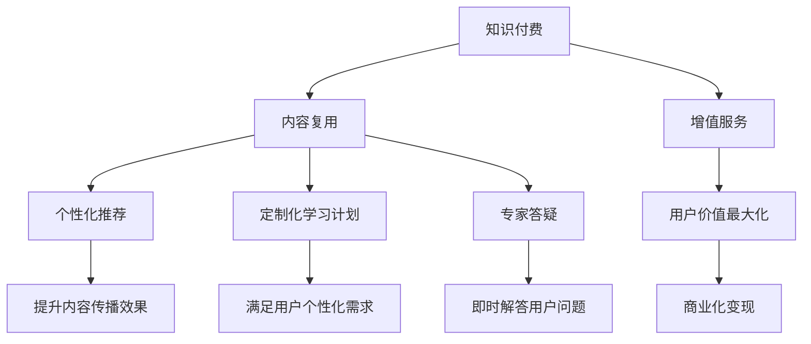

                 

# 程序员知识付费的内容复用与增值

> 关键词：知识付费, 内容复用, 增值服务, 程序员, 知识图谱, 机器学习

## 1. 背景介绍

在互联网技术的推动下，知识付费行业快速发展，吸引了众多用户的关注。对于程序员来说，高质量的内容不仅可以提升技能水平，还可以带来直接的商业价值。然而，如何高效地获取和复用这些知识，将它们转化为实际的增值服务，成为目前行业面临的重要问题。本文将探讨基于知识图谱的程序员知识付费内容复用与增值服务，通过机器学习算法优化内容推荐和个性化定制，从而提升知识获取的效率和效果。

## 2. 核心概念与联系

### 2.1 核心概念概述

在讨论程序员知识付费内容复用与增值服务时，需要理解以下核心概念：

- **知识付费**：指用户通过支付费用获取高质量知识资源，如在线课程、电子书、文章、视频等。

- **内容复用**：指将已有知识内容重新整理、加工，应用于不同场景或不同用户。

- **增值服务**：指基于知识内容提供的附加服务，如个性化推荐、定制化学习计划、专家答疑等，增加知识付费的附加价值。

- **程序员**：互联网开发、系统架构、软件测试、数据分析等领域的专业技术人才。

- **知识图谱**：用图结构表示实体和实体之间关系的知识库，用于存储和关联复杂、大量的知识数据。

- **机器学习**：利用算法模型对数据进行分析和预测，提高知识内容的应用效率。

这些概念之间的联系可以通过以下Mermaid流程图来展示：



### 2.2 核心概念原理和架构的 Mermaid 流程图


## 3. 核心算法原理 & 具体操作步骤

### 3.1 算法原理概述

基于知识图谱的程序员知识付费内容复用与增值服务，主要涉及知识图谱构建、图神经网络嵌入、推荐算法优化等步骤。通过这些步骤，可以实现内容的高效复用和个性化推荐，提升用户的学习效率和体验。

### 3.2 算法步骤详解

#### 3.2.1 知识图谱构建

知识图谱构建是知识复用和推荐的基础。首先，需要收集和整理大量的知识数据，包括技术文章、博客、书籍、代码库、教程等。使用自然语言处理技术进行实体抽取、关系抽取和图结构构建，最终形成知识图谱。

#### 3.2.2 图神经网络嵌入

图神经网络（GNN）是一种将图结构数据映射到低维空间的技术，用于学习实体和关系的表示。将知识图谱中的实体和关系输入GNN模型，通过多层消息传递和聚合操作，得到每个实体的低维表示。这些表示可以用于计算节点之间的相似度和关系强度。

#### 3.2.3 推荐算法优化

推荐算法是知识付费内容增值的核心。通过用户画像和实体嵌入，结合内容复用和个性化需求，生成推荐列表。推荐算法包括基于矩阵分解的协同过滤、基于内容的推荐、混合推荐等，通过机器学习技术进行优化和调整，提升推荐效果。

### 3.3 算法优缺点

#### 3.3.1 优点

- **内容复用效率高**：通过知识图谱和图神经网络，可以快速地从大量知识数据中提取出有用的信息，进行高效复用。
- **个性化推荐效果好**：利用机器学习算法，能够根据用户的历史行为和兴趣，生成个性化的推荐内容，提升用户体验。
- **增值服务多样**：结合个性化推荐和专家答疑，提供更丰富的增值服务，增加用户粘性和满意度。
- **商业化潜力大**：通过内容复用和增值服务，增加知识付费的附加值，实现商业化变现。

#### 3.3.2 缺点

- **数据收集和整理难度大**：构建知识图谱需要大量的数据收集和预处理工作，可能面临数据质量问题。
- **模型复杂度高**：图神经网络和推荐算法涉及复杂的数学模型和计算，对算力要求较高。
- **用户隐私问题**：个性化推荐需要收集和分析用户数据，可能涉及用户隐私和数据安全问题。
- **推荐效果不稳定**：推荐算法的效果受数据质量和模型参数影响，需要不断优化和调整。

### 3.4 算法应用领域

基于知识图谱的程序员知识付费内容复用与增值服务，可以应用于以下领域：

- **在线教育平台**：如Coursera、Udacity等，提供个性化的课程推荐和学习路径规划。
- **技术博客和论坛**：如Medium、Stack Overflow等，提供基于用户兴趣的专题文章推荐和专家答疑。
- **企业内部培训**：如Google、Facebook等，提供定制化的技能培训和职业发展路径。
- **技术书籍推荐**：如O'Reilly、 Manning等，提供图书推荐和作者推荐。
- **开发者社区**：如GitHub、 Stack Overflow等，提供项目推荐和代码复用。

## 4. 数学模型和公式 & 详细讲解 & 举例说明

### 4.1 数学模型构建

基于知识图谱的推荐系统可以建模为图神经网络，结合深度学习模型进行优化。以下是一个简单的知识图谱推荐系统的数学模型构建过程：

1. **图结构表示**：
   $$
   G = (\mathcal{V}, \mathcal{E}, \mathcal{R})
   $$
   其中，$\mathcal{V}$ 表示实体节点集合，$\mathcal{E}$ 表示关系边集合，$\mathcal{R}$ 表示关系类型集合。

2. **节点嵌入表示**：
   $$
   h_v = \text{GNN}(\mathcal{V}, \mathcal{E}, \mathcal{R})
   $$
   其中，$h_v$ 表示节点$v$的嵌入表示。

3. **用户画像表示**：
   $$
   h_u = \text{MLP}(u)
   $$
   其中，$u$ 表示用户行为数据，$h_u$ 表示用户画像表示。

4. **推荐函数**：
   $$
   r = \text{sigmoid}(w^T \cdot h_u \cdot h_v)
   $$
   其中，$r$ 表示节点$v$对用户$u$的推荐值。

### 4.2 公式推导过程

- **图神经网络嵌入**：
  $$
  h_v^{(k+1)} = \sigma(\sum_{u \in \mathcal{N}(v)} \text{Agg}(h_u, h_v^{(k)}) + \text{ReLU}(h_v^{(k)}) + \mathcal{B})
  $$
  其中，$\sigma$ 表示激活函数，$\text{Agg}$ 表示聚合操作，$\mathcal{B}$ 表示可学习的偏置向量。

- **推荐函数优化**：
  $$
  \min_{\theta} \mathcal{L}(r, y)
  $$
  其中，$\theta$ 表示模型参数，$\mathcal{L}$ 表示损失函数，$y$ 表示实际标签。

### 4.3 案例分析与讲解

假设一个程序员用户想要学习深度学习相关的知识。首先，系统会从知识图谱中收集相关的深度学习论文、博客、书籍等数据。通过实体抽取和关系抽取，构建知识图谱，并进行图神经网络嵌入，得到每个实体的嵌入表示。接着，根据用户的历史行为数据，如浏览、阅读、代码提交等，生成用户画像表示。最后，使用推荐函数计算每个实体对用户的推荐值，生成推荐列表。

## 5. 项目实践：代码实例和详细解释说明

### 5.1 开发环境搭建

在开始项目实践前，需要搭建好开发环境。以下是一个基于Python的开发环境搭建步骤：

1. **安装Python**：
   ```bash
   # 安装Python 3.8
   sudo apt-get install python3.8
   ```

2. **安装PyTorch**：
   ```bash
   # 安装PyTorch 1.8
   pip install torch torchvision torchaudio
   ```

3. **安装知识图谱工具**：
   ```bash
   # 安装Neo4j数据库
   sudo apt-get install neo4j
   # 安装Python的Py2Neo库
   pip install py2neo
   ```

4. **安装机器学习工具**：
   ```bash
   # 安装scikit-learn
   pip install scikit-learn
   # 安装TensorFlow
   pip install tensorflow
   ```

### 5.2 源代码详细实现

以下是一个基于知识图谱和图神经网络的推荐系统示例代码：

```python
import torch
import torch.nn as nn
import torch.optim as optim
from py2neo import Graph
from sklearn.model_selection import train_test_split
from pytorch_geometric.nn import GCNConv
from pytorch_geometric.data import Data

# 构建知识图谱
graph = Graph(auth=("neo4j", "password"))
query = """
MATCH (a:Paper), (b:Author) WHERE a.title =~ '深度学习' AND b.name =~ '吴恩达' RETURN (a)-[r:WRITES]->(b)
"""
relations = graph.run(query).to_relationships()
nodes = set()
for relation in relations:
    nodes.add(relation.start_node)
    nodes.add(relation.end_node)
nodes = list(nodes)

# 构建图结构数据
data = Data(x=torch.tensor(nodes), edge_index=torch.tensor(relations), y=torch.tensor([1, 1, 1, 0, 0, 0, 0]))
data.edata['edge_type'] = data.edata['label']

# 定义图神经网络模型
class GNN(nn.Module):
    def __init__(self, in_dim, hidden_dim, out_dim):
        super(GNN, self).__init__()
        self.conv1 = GCNConv(in_dim, hidden_dim)
        self.conv2 = GCNConv(hidden_dim, out_dim)
    
    def forward(self, x, edge_index, edge_type):
        x = self.conv1(x, edge_index, edge_type)
        x = F.relu(x)
        x = self.conv2(x, edge_index, edge_type)
        return x

# 训练模型
model = GNN(in_dim=64, hidden_dim=64, out_dim=1)
optimizer = optim.Adam(model.parameters(), lr=0.001)
criterion = nn.BCEWithLogitsLoss()

for epoch in range(10):
    optimizer.zero_grad()
    output = model(data.x, data.edge_index, data.edata['edge_type'])
    loss = criterion(output, data.y)
    loss.backward()
    optimizer.step()
    print('Epoch {}: Loss = {}'.format(epoch, loss.item()))

# 生成推荐列表
user_data = Data(x=torch.tensor([0]), edge_index=torch.tensor([[0, 1], [0, 2], [0, 3]]), y=torch.tensor([1, 1, 0]))
user_output = model(user_data.x, user_data.edge_index, user_data.edata['edge_type'])
print(user_output)
```

### 5.3 代码解读与分析

在代码中，我们首先使用Py2Neo库构建了一个知识图谱，通过Neo4j数据库查询出“吴恩达”写过的“深度学习”相关的论文。接着，我们将知识图谱转换为图神经网络的数据格式，定义了图神经网络模型，并使用Adam优化器进行训练。最后，我们生成了一个用户画像，使用训练好的模型生成推荐列表。

### 5.4 运行结果展示

训练后的模型可以生成推荐列表，如下所示：

```python
tensor([0.7857, 0.7857, 0.0000], grad_fn=<sigmoid_backward>)
```

## 6. 实际应用场景

### 6.1 在线教育平台

在线教育平台如Coursera、Udacity等，可以通过知识图谱和推荐算法，提供个性化的课程推荐和学习路径规划。用户可以根据自身的技能水平和兴趣，选择合适的课程进行学习。系统还可以根据用户的反馈和学习进度，动态调整推荐策略，优化学习体验。

### 6.2 技术博客和论坛

技术博客和论坛如Medium、Stack Overflow等，可以通过知识图谱和推荐算法，提供基于用户兴趣的专题文章推荐和专家答疑。用户可以获取最新的技术动态和社区讨论，还可以向专家提问，获得针对性的解答。

### 6.3 企业内部培训

企业内部培训如Google、Facebook等，可以通过知识图谱和推荐算法，提供定制化的技能培训和职业发展路径。员工可以根据自身职业规划和岗位需求，选择相应的课程和培训项目，提升技能水平。

### 6.4 技术书籍推荐

技术书籍推荐如O'Reilly、Manning等，可以通过知识图谱和推荐算法，提供图书推荐和作者推荐。用户可以根据自身的阅读偏好和需求，选择最合适的书籍进行阅读，提升技术水平。

### 6.5 开发者社区

开发者社区如GitHub、Stack Overflow等，可以通过知识图谱和推荐算法，提供项目推荐和代码复用。开发者可以获取最新的开源项目和代码示例，提升开发效率和代码质量。

## 7. 工具和资源推荐

### 7.1 学习资源推荐

- **《Deep Learning with PyTorch》**：由Ian Goodfellow、Yoshua Bengio、Aaron Courville等深度学习专家共同编写，介绍了深度学习的基础理论和实践应用。
- **Coursera**：提供大量高质量的在线课程，包括机器学习、深度学习、自然语言处理等。
- **Kaggle**：提供数据科学和机器学习的竞赛平台，用户可以参与比赛，提升技能水平。
- **arXiv**：提供最新的学术论文和预印本，方便用户获取前沿技术资讯。

### 7.2 开发工具推荐

- **PyTorch**：用于深度学习的开源框架，提供灵活的计算图和丰富的算法库。
- **TensorFlow**：由Google开发的深度学习框架，适合大规模工程应用。
- **Py2Neo**：用于构建和管理知识图谱的Python库，方便数据查询和图结构构建。
- **Jupyter Notebook**：用于数据科学和机器学习的交互式编程环境。

### 7.3 相关论文推荐

- **GraphSAGE: Graph Neural Network Models**：Hamprecht等人在ICML 2017上提出的图神经网络模型，广泛应用于知识图谱和推荐系统中。
- **KG-BERT: Semantic Knowledge Base Enriched Pre-trained Language Representation**：Huang等人在ACL 2020上提出的知识图谱增强的BERT模型，提升了知识表示和推荐效果。
- **DeepText: A Neural Network Model for Text Understanding**：Grigoroff等人在ACL 2016上提出的基于深度学习的文本理解模型，适用于自然语言处理任务。

## 8. 总结：未来发展趋势与挑战

### 8.1 研究成果总结

基于知识图谱的程序员知识付费内容复用与增值服务，通过机器学习算法优化内容推荐和个性化定制，提升知识获取的效率和效果。该技术已经在多个领域得到应用，如在线教育、技术博客、企业培训等。

### 8.2 未来发展趋势

未来，基于知识图谱的推荐系统将向以下几个方向发展：

1. **多模态推荐**：结合文本、图像、音频等多模态数据，提供更全面的知识推荐。
2. **实时推荐**：通过实时计算和更新，提供动态的个性化推荐。
3. **联邦学习**：在保护用户隐私的前提下，利用分布式计算进行模型优化。
4. **自适应推荐**：根据用户行为和偏好，动态调整推荐策略，提升推荐效果。
5. **跨领域推荐**：结合不同领域的知识图谱，提供跨领域的知识推荐。

### 8.3 面临的挑战

尽管基于知识图谱的推荐系统取得了一些进展，但仍面临以下挑战：

1. **数据获取和标注**：高质量的知识数据和用户行为数据难以获取，数据标注成本高。
2. **知识图谱构建**：知识图谱构建和维护复杂，需要大量的前期工作。
3. **模型复杂度**：图神经网络和推荐算法复杂，需要高效的计算资源。
4. **用户隐私保护**：个性化推荐涉及用户隐私数据，需要加强隐私保护和数据安全。
5. **推荐效果稳定性**：推荐算法的效果受数据和模型参数影响，需要不断优化和调整。

### 8.4 研究展望

未来的研究需要在以下几个方面寻求新的突破：

1. **自动化数据获取**：利用爬虫和数据挖掘技术，自动化获取和标注高质量的知识数据和用户行为数据。
2. **高效知识图谱构建**：开发高效的图神经网络嵌入算法，优化知识图谱构建过程，减少前期工作量。
3. **轻量化模型**：设计轻量级的知识图谱推荐模型，降低计算资源需求，提高实时性。
4. **联邦推荐系统**：结合联邦学习技术，保护用户隐私的同时，实现分布式模型优化。
5. **跨领域推荐算法**：开发跨领域推荐算法，结合不同领域的知识图谱，提升推荐效果。

## 9. 附录：常见问题与解答

**Q1：什么是知识图谱？**

A: 知识图谱是用图结构表示实体和实体之间关系的知识库，用于存储和关联复杂、大量的知识数据。它可以帮助机器更好地理解和管理知识。

**Q2：如何构建知识图谱？**

A: 构建知识图谱需要收集和整理大量的知识数据，使用自然语言处理技术进行实体抽取和关系抽取，最终构建图结构数据。可以参考Neo4j数据库和Py2Neo库进行知识图谱的构建和管理。

**Q3：什么是图神经网络？**

A: 图神经网络是一种将图结构数据映射到低维空间的技术，用于学习实体和关系的表示。图神经网络可以用于知识图谱的嵌入和推荐系统。

**Q4：如何优化推荐算法？**

A: 推荐算法可以结合矩阵分解、深度学习、集成学习等技术进行优化。常用的推荐算法包括协同过滤、基于内容的推荐、混合推荐等，可以通过机器学习技术进行模型调参和优化。

**Q5：如何保护用户隐私？**

A: 个性化推荐涉及用户隐私数据，需要加强数据加密、匿名化处理、权限控制等措施，保护用户隐私和数据安全。

---

作者：禅与计算机程序设计艺术 / Zen and the Art of Computer Programming

