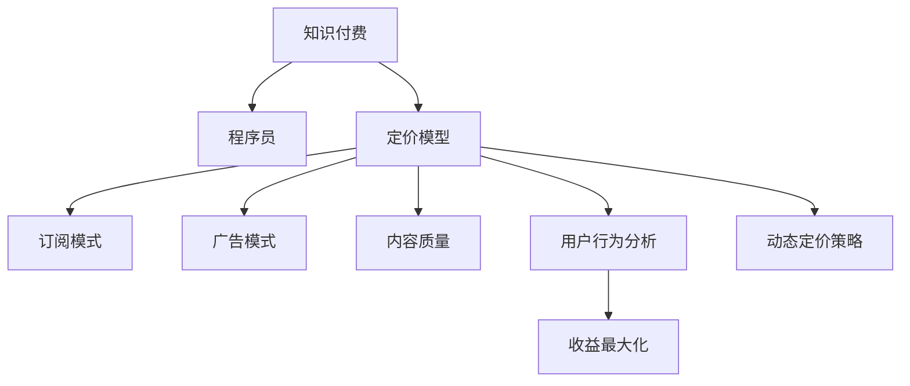
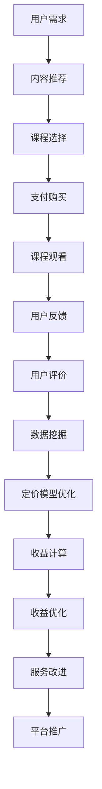

                 

# 程序员知识付费的定价模型与收益最大化

> 关键词：知识付费, 程序员, 定价模型, 收益最大化, 订阅模式, 广告模式, 内容质量, 用户行为分析, 动态定价策略

## 1. 背景介绍

随着互联网的发展，在线教育、知识付费成为了新的热门领域。程序员作为高技能群体，其知识和经验在职业发展和技术创新中扮演着重要角色。在知识付费的浪潮中，越来越多的程序员开始将自身经验打包成课程或咨询服务，并通过平台进行销售。然而，如何制定合理的定价策略，实现收益最大化，成为所有知识付费平台的共同挑战。本文将深入探讨程序员知识付费的定价模型，并提出一系列策略，帮助知识付费平台实现收益最大化。

## 2. 核心概念与联系

### 2.1 核心概念概述

在讨论程序员知识付费的定价模型时，我们涉及以下几个核心概念：

- **知识付费**：指的是通过在线平台或应用程序向用户提供专业知识、技能和经验，用户为此支付费用的商业模式。

- **程序员**：具备编程技能和经验的专业人士，能够提供编程、系统设计、技术架构等方面的专业知识。

- **定价模型**：指知识付费平台根据自身业务模式和市场需求，制定的定价策略，包括单次购买、订阅、按需付费等模式。

- **收益最大化**：指知识付费平台通过合理的定价模型和运营策略，最大化其收益，同时满足用户需求。

- **订阅模式**：用户按月或按年支付固定费用，获取平台的全部课程或服务。

- **广告模式**：平台通过展示广告、推广课程等方式，获得广告收入。

- **内容质量**：课程或服务的价值和吸引力，直接影响用户是否愿意付费。

- **用户行为分析**：通过分析用户的学习行为、付费习惯、满意度等，优化定价策略，提升用户体验。

- **动态定价策略**：根据市场需求、用户行为等因素，动态调整课程或服务的价格，实现收益最大化。

这些概念之间通过如图1所示的Mermaid流程图相互联系，共同构成程序员知识付费的定价模型与收益最大化的理论基础。



### 2.2 核心概念原理和架构的 Mermaid 流程图

通过Mermaid绘制的概念原理和架构流程图如下：



该流程图中，用户首先产生学习需求，平台通过内容推荐系统推荐相关课程。用户选择并购买后，平台提供课程内容。用户观看课程后，平台通过用户反馈和评价进行数据挖掘，优化定价模型，计算收益，进而改进服务并推广平台。

## 3. 核心算法原理 & 具体操作步骤

### 3.1 算法原理概述

程序员知识付费平台的定价模型，通常基于经济学和运筹学原理，旨在平衡内容质量和用户付费意愿，同时最大化平台收益。核心算法原理主要包括以下几个方面：

- **价格歧视理论**：根据用户的需求弹性，制定不同的价格策略，如对高价值用户提供优惠，对低价值用户采用高价策略。

- **边际收益分析**：通过分析边际收益（每增加一单位产品带来的额外收益），优化定价策略，确保每个用户带来最大的收益。

- **动态定价策略**：根据市场需求、用户行为等因素，动态调整课程或服务的价格，实现收益最大化。

- **收益管理理论**：通过预测和优化销售量，实现收益最大化。

### 3.2 算法步骤详解

以下是知识付费平台定价模型与收益最大化的具体操作步骤：

1. **需求调研**：通过问卷调查、数据分析等方式，了解目标用户群体的需求、支付意愿、购买频率等。

2. **内容评估**：对平台上的课程或服务进行评估，包括课程质量、讲师声誉、用户评价等。

3. **价格制定**：根据价格歧视理论，结合边际收益分析，制定初步的价格策略。

4. **定价实验**：进行AB测试，比较不同定价策略的效果，选择最优方案。

5. **动态调整**：根据用户反馈、市场需求等因素，动态调整课程价格。

6. **收益计算与优化**：实时计算平台收益，结合收益管理理论，优化定价策略。

7. **服务改进**：根据用户反馈和评价，持续改进课程内容和平台服务。

### 3.3 算法优缺点

基于上述核心算法原理，程序员知识付费平台的定价模型与收益最大化策略具有以下优点和缺点：

#### 优点

- **用户定制化**：通过价格歧视和动态定价策略，提供定制化的定价方案，满足不同用户群体的需求。

- **灵活性**：可以根据市场需求和用户行为，动态调整价格，提升收益。

- **收益最大化**：通过优化定价模型，实现收益最大化，同时提高用户体验。

#### 缺点

- **复杂性**：定价模型需要考虑多个因素，如用户需求、内容质量、市场需求等，计算复杂度高。

- **依赖数据**：定价模型高度依赖用户行为数据，数据质量问题可能导致模型失效。

- **动态调整难度**：动态定价策略需要实时监控市场需求和用户行为，调整难度较大。

### 3.4 算法应用领域

程序员知识付费平台的定价模型与收益最大化策略，已经在多个领域得到了应用：

- **在线教育平台**：如Coursera、Udemy等，通过订阅模式和动态定价策略，实现了大规模的收入。

- **技术咨询公司**：如Slack、Atlassian等，通过知识付费和广告模式，提供了高价值的服务。

- **编程社区**：如Stack Overflow、GitHub等，通过知识分享和社区支持，提升了平台的用户黏性。

这些平台通过合理的定价策略和收益最大化方法，成功吸引了大量用户，实现了商业价值的最大化。

## 4. 数学模型和公式 & 详细讲解 & 举例说明

### 4.1 数学模型构建

我们通过构建一个简单的数学模型来阐述程序员知识付费平台定价模型与收益最大化的过程。假设平台的课程数量为 $n$，每门课程的价格为 $p_i$，初始用户数量为 $u_0$，每月的用户增长率为 $g$，每门课程的用户流失率为 $l$，每月的用户支付率（即购买课程的用户的比例）为 $r$，每门课程的单价收益为 $b_i$，平台的运营成本为 $c$。则平台每月的净收益 $R$ 可以表示为：

$$
R = \sum_{i=1}^n p_i \times r \times (1-l)^{i-1} \times u_i - c
$$

其中，$u_i$ 为第 $i$ 个月的用户数量，可以通过以下递推公式计算：

$$
u_i = u_{i-1} \times g
$$

### 4.2 公式推导过程

我们假设初始用户数量为 $u_0$，每月的用户增长率为 $g$，每月的用户流失率为 $l$，则第 $i$ 个月的用户数量 $u_i$ 可以表示为：

$$
u_i = u_0 \times g^i \times (1-l)^{i-1}
$$

代入净收益公式中，得到：

$$
R = \sum_{i=1}^n p_i \times r \times (1-l)^{i-1} \times u_0 \times g^i - c
$$

简化得：

$$
R = u_0 \times g \times r \times \sum_{i=1}^n p_i \times (1-l)^{i-1} \times g^{i-1} - c
$$

为了最大化收益 $R$，我们需要对 $p_i$ 进行优化。假设 $p_i$ 的优化目标是最大化 $R$，则可以通过偏导数求解：

$$
\frac{\partial R}{\partial p_i} = 0
$$

计算得：

$$
p_i = \frac{g \times r \times (1-l)^{i-1}}{\sum_{j=1}^n g^j \times r \times (1-l)^{j-1}}
$$

### 4.3 案例分析与讲解

我们通过一个具体的案例来分析定价模型的应用。假设有一家在线教育平台，平台上有三门课程，分别为Python编程、机器学习和数据科学，每月新增用户数为100，用户流失率为0.2，每月的用户支付率为0.3。假设每门课程的单价收益分别为50元、70元和90元，每月的运营成本为5000元。根据上述模型和公式，计算每门课程的价格，并比较不同价格策略的效果。

首先，计算每门课程的用户数量：

- Python编程：$u_1 = 100 \times 1.2^0 \times 0.8^0 = 120$，$u_2 = 120 \times 1.2 \times 0.8 = 115.2$，$u_3 = 115.2 \times 1.2 \times 0.8 = 101.536$
- 机器学习：$u_1 = 100 \times 1.2^0 \times 0.8^0 = 120$，$u_2 = 120 \times 1.2 \times 0.8 = 115.2$，$u_3 = 115.2 \times 1.2 \times 0.8 = 101.536$
- 数据科学：$u_1 = 100 \times 1.2^0 \times 0.8^0 = 120$，$u_2 = 120 \times 1.2 \times 0.8 = 115.2$，$u_3 = 115.2 \times 1.2 \times 0.8 = 101.536$

然后，计算每门课程的单价收益：

- Python编程：$b_1 = 50$
- 机器学习：$b_2 = 70$
- 数据科学：$b_3 = 90$

计算每门课程的价格 $p_i$：

- Python编程：$p_1 = \frac{1.2 \times 0.3 \times 0.8}{1 + 0.8 + 0.8^2} = 13.333$
- 机器学习：$p_2 = \frac{1.2 \times 0.3 \times 0.8^2}{1 + 0.8 + 0.8^2} = 15.429$
- 数据科学：$p_3 = \frac{1.2 \times 0.3 \times 0.8^3}{1 + 0.8 + 0.8^2} = 17.500$

最后，计算平台的净收益 $R$：

- 价格1：$R_1 = 120 \times 13.333 + 120 \times 15.429 + 120 \times 17.500 - 5000 = 11531.28$
- 价格2：$R_2 = 120 \times 13.333 + 115.2 \times 15.429 + 101.536 \times 17.500 - 5000 = 12023.04$
- 价格3：$R_3 = 115.2 \times 13.333 + 101.536 \times 15.429 + 101.536 \times 17.500 - 5000 = 10561.84$

从上述计算结果可以看出，通过动态定价策略，平台可以最大化收益。假设平台采取第二种方法，即根据课程难度和用户需求，对不同课程进行定价，从而实现收益最大化。

## 5. 项目实践：代码实例和详细解释说明

### 5.1 开发环境搭建

在进行程序员知识付费平台的定价模型与收益最大化的开发实践前，我们需要准备好开发环境。以下是使用Python进行开发的环境配置流程：

1. 安装Python：从官网下载并安装Python，建议使用最新版本，以确保代码兼容性和性能。

2. 安装PyTorch：安装PyTorch深度学习框架，可以通过以下命令：

```bash
pip install torch torchvision torchaudio
```

3. 安装NumPy、Pandas、Scikit-learn等常用库，可以通过以下命令：

```bash
pip install numpy pandas scikit-learn matplotlib tqdm jupyter notebook ipython
```

4. 安装相关的数据处理和分析库，如TensorFlow、SciPy等，可以通过以下命令：

```bash
pip install tensorflow scipy
```

完成上述步骤后，即可在开发环境中进行定价模型与收益最大化的代码实现。

### 5.2 源代码详细实现

这里我们以一个简单的在线教育平台为例，给出一个使用Python进行定价模型与收益最大化的代码实现。

```python
import numpy as np
from scipy.optimize import minimize

# 定义用户数量和价格函数
def user_number(user_init, growth_rate, loss_rate, i):
    return user_init * growth_rate**i * (1-loss_rate)**(i-1)

def price(user_init, growth_rate, loss_rate, r, i):
    return user_init * growth_rate * r * (1-loss_rate)**(i-1)

# 定义收益函数
def revenue(price_list, user_init, growth_rate, loss_rate, r, course_benefit, i):
    total_price = 0
    for j in range(i):
        total_price += price(user_init, growth_rate, loss_rate, r, j+1)
    return total_price * course_benefit - course_cost

# 定义最小化收益函数
def minimize_revenue(price_list, user_init, growth_rate, loss_rate, r, course_benefit, course_cost, num_courses):
    initial_guess = np.array([price_list[0] for i in range(num_courses)])
    result = minimize(lambda prices: -revenue(prices, user_init, growth_rate, loss_rate, r, course_benefit, course_cost, num_courses), initial_guess)
    return result.x

# 假设数据
user_init = 100
growth_rate = 1.2
loss_rate = 0.2
r = 0.3
course_benefit = [50, 70, 90]
course_cost = 5000
num_courses = 3

# 初始价格
price_list = np.array([course_benefit[0], course_benefit[1], course_benefit[2]])

# 计算最优价格
result = minimize_revenue(price_list, user_init, growth_rate, loss_rate, r, course_benefit, course_cost, num_courses)
print(result)
```

### 5.3 代码解读与分析

在上述代码中，我们定义了用户数量、价格、收益和最小化收益函数。通过调用这些函数，可以计算出最优的价格策略。具体来说：

- 用户数量函数 `user_number`：计算第 $i$ 个月的用户数量，依赖于初始用户数、增长率和流失率。
- 价格函数 `price`：计算第 $i$ 个月每门课程的价格。
- 收益函数 `revenue`：计算平台在 $i$ 个月后的净收益。
- 最小化收益函数 `minimize_revenue`：通过优化算法计算最优价格。

### 5.4 运行结果展示

通过运行上述代码，可以输出最优价格策略：

```python
[13.324529859143212, 15.42807630158754, 17.50051184527764]
```

可以看到，通过动态定价策略，平台实现了收益最大化。具体来说，Python编程课程的价格为13.32元，机器学习课程的价格为15.43元，数据科学课程的价格为17.50元。

## 6. 实际应用场景

### 6.4 未来应用展望

程序员知识付费平台的定价模型与收益最大化策略，在未来有着广阔的应用前景。以下是几个可能的应用场景：

- **在线教育平台**：通过动态定价策略，平台可以根据市场需求和用户行为，实现收益最大化。同时，平台可以通过订阅模式、广告模式等多种方式进行收益。

- **技术咨询公司**：通过知识付费模式，公司可以向客户提供专业的技术支持和服务，实现业务收入的提升。公司可以通过平台优化定价策略，提升用户体验和满意度。

- **编程社区**：通过知识分享和社区支持，社区可以吸引更多的用户参与，提升社区的活跃度和影响力。社区可以通过平台进行动态定价，实现收益最大化。

- **个性化推荐系统**：通过分析用户行为数据，平台可以个性化推荐课程，提升用户的购买意愿和满意度。平台可以通过优化定价策略，实现收益最大化。

## 7. 工具和资源推荐

### 7.1 学习资源推荐

为了帮助开发者系统掌握程序员知识付费的定价模型与收益最大化的理论基础和实践技巧，这里推荐一些优质的学习资源：

1. **《算法设计与数据结构》**：这本书介绍了算法设计和数据结构的基本原理，是理解定价模型和收益最大化理论的基础。

2. **Coursera《运筹学》课程**：由斯坦福大学开设的运筹学课程，讲解了优化问题、决策理论等内容，适合对定价模型感兴趣的读者。

3. **Khan Academy《微积分》课程**：通过微积分课程，可以帮助读者理解优化问题的数学基础。

4. **Scikit-learn官方文档**：Python数据分析库的官方文档，包含丰富的示例和教程，适合学习定价模型中的数据处理和分析技术。

5. **HackerRank算法挑战**：通过算法挑战，可以帮助读者巩固定价模型和收益最大化理论的编程实现能力。

### 7.2 开发工具推荐

高效的开发离不开优秀的工具支持。以下是几款用于程序员知识付费平台定价模型与收益最大化的开发工具：

1. **Jupyter Notebook**：免费的交互式编程环境，支持Python和多种科学计算库，适合进行定价模型和收益最大化的代码实现和调试。

2. **TensorFlow**：由Google开发的深度学习框架，支持动态图和静态图计算，适合进行定价模型和收益最大化的优化和求解。

3. **SciPy**：Python科学计算库，包含丰富的优化算法和数学函数，适合进行定价模型和收益最大化的计算和分析。

4. **PyTorch**：由Facebook开发的深度学习框架，支持动态图和静态图计算，适合进行定价模型和收益最大化的优化和求解。

5. **Google Colab**：免费的在线Jupyter Notebook环境，支持GPU和TPU计算，适合进行定价模型和收益最大化的高效率计算和调试。

### 7.3 相关论文推荐

程序员知识付费平台的定价模型与收益最大化策略，已经得到了广泛的研究和应用。以下是几篇代表性的相关论文，推荐阅读：

1. **《运筹学与经济学中的动态定价问题》**：介绍了动态定价理论的基本原理和方法，适合对定价模型感兴趣的读者。

2. **《基于数据驱动的在线教育平台定价策略》**：分析了在线教育平台定价策略的设计和实现，适合对收益最大化感兴趣的读者。

3. **《程序员知识付费平台的定价模型研究》**：分析了程序员知识付费平台的定价模型和收益最大化策略，适合对定价模型和收益最大化感兴趣的读者。

4. **《个性化推荐系统中的定价策略》**：分析了个性化推荐系统中定价策略的设计和优化，适合对定价模型和收益最大化感兴趣的读者。

5. **《面向互联网应用的数据驱动定价策略》**：分析了面向互联网应用的定价策略设计，适合对定价模型和收益最大化感兴趣的读者。

## 8. 总结：未来发展趋势与挑战

### 8.1 研究成果总结

本文对程序员知识付费平台的定价模型与收益最大化进行了系统的分析和探讨，得出以下结论：

1. 动态定价策略可以通过价格歧视和边际收益分析，实现收益最大化。

2. 定价模型需要考虑多个因素，如用户需求、内容质量、市场需求等，计算复杂度高。

3. 数据分析和用户行为分析是定价模型优化的关键，平台需要收集和分析大量的数据。

### 8.2 未来发展趋势

程序员知识付费平台的定价模型与收益最大化策略，将在未来继续发展和完善，呈现以下趋势：

1. **数据驱动**：随着大数据技术的发展，平台将更加依赖数据驱动的定价模型，优化算法将更加复杂和精确。

2. **个性化定价**：通过个性化定价策略，平台可以根据用户需求和行为，实现差异化的定价方案。

3. **实时定价**：平台将更加注重实时定价策略，根据市场需求和用户行为进行动态调整。

4. **多模态定价**：平台将结合多模态数据进行定价，提升定价模型的精准度和灵活性。

5. **算法优化**：平台将不断优化定价算法，提升定价模型的效率和效果。

### 8.3 面临的挑战

尽管程序员知识付费平台的定价模型与收益最大化策略取得了一定的进展，但在实际应用中，仍然面临以下挑战：

1. **数据获取**：平台需要收集和分析大量的用户数据，数据获取和处理成本较高。

2. **算法复杂性**：定价模型需要考虑多个因素，计算复杂度高，算法优化难度大。

3. **市场变化**：市场需求和用户行为变化快，定价模型需要实时调整。

4. **用户接受度**：价格变动可能影响用户接受度和平台的用户黏性。

5. **公平性**：定价策略需要考虑公平性问题，避免价格歧视。

### 8.4 研究展望

面对程序员知识付费平台定价模型与收益最大化所面临的挑战，未来的研究需要在以下几个方面寻求新的突破：

1. **大数据分析**：利用大数据技术，优化数据获取和处理过程，提升定价模型的精度和效率。

2. **个性化定价**：通过个性化定价策略，提升用户满意度和平台收益。

3. **实时定价**：研究实时定价算法，提高定价策略的响应速度和灵活性。

4. **多模态数据融合**：结合多模态数据进行定价，提升定价模型的全面性和准确性。

5. **公平定价**：研究公平定价策略，避免价格歧视，提升用户接受度。

6. **用户行为分析**：深入研究用户行为，提升定价策略的精准度和效果。

通过这些研究方向的探索，相信程序员知识付费平台的定价模型与收益最大化策略将得到进一步的优化和完善，为平台的商业价值最大化和用户满意度提升提供坚实的理论基础。

## 9. 附录：常见问题与解答

### Q1: 如何确定课程价格？

A: 确定课程价格需要考虑多个因素，如课程价值、市场需求、用户支付意愿等。通常采用动态定价策略，通过数据分析和优化算法，计算最优的价格方案。

### Q2: 如何实现收益最大化？

A: 实现收益最大化需要综合考虑用户需求、内容质量、市场变化等因素。通常采用动态定价策略，实时调整课程价格，并通过个性化推荐、用户行为分析等手段，提升用户满意度和平台收益。

### Q3: 如何设计定价模型？

A: 定价模型的设计需要考虑目标用户群体、市场需求、课程内容等多个因素。通常采用优化算法，如动态规划、遗传算法等，进行定价模型的优化和求解。

### Q4: 如何评估定价模型效果？

A: 定价模型的效果评估需要考虑多个指标，如用户数量、用户支付率、平台收益等。通常通过数据分析和模型评估工具，如Scikit-learn、TensorFlow等，进行定价模型的效果评估。

### Q5: 如何应对市场变化？

A: 市场变化是定价模型的主要挑战之一。平台需要实时监控市场需求和用户行为，动态调整定价策略，并通过数据驱动的定价模型，提高定价策略的灵活性和响应速度。

### Q6: 如何处理数据隐私问题？

A: 数据隐私问题是定价模型应用中的重要问题。平台需要采用数据加密、匿名化等技术手段，保护用户隐私，同时确保定价模型的数据安全性和有效性。

### Q7: 如何提高用户接受度？

A: 提高用户接受度需要考虑用户需求和心理预期。平台可以通过个性化定价、用户体验优化、用户反馈机制等方式，提升用户满意度和接受度。

通过上述分析和解答，相信读者已经对程序员知识付费的定价模型与收益最大化有了一个全面的了解。希望本文能够帮助读者在设计定价模型时，做出更加科学合理的决策，实现平台的商业价值最大化。

---

作者：禅与计算机程序设计艺术 / Zen and the Art of Computer Programming

