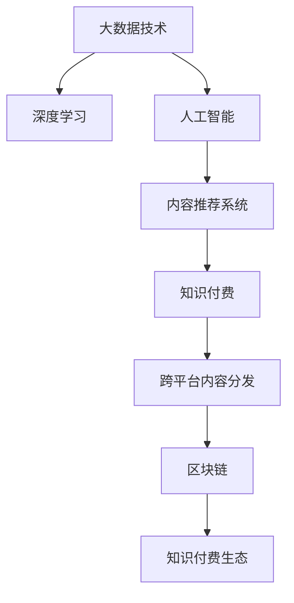

                 

# 程序员知识付费的跨平台内容分发策略

> 关键词：知识付费, 跨平台内容分发, 内容推荐系统, 大数据技术, 深度学习, 人工智能, 区块链

## 1. 背景介绍

在互联网和数字经济的浪潮下，知识付费正成为一种新的经济形态。越来越多的开发者通过知识付费平台分享技术经验、专业见解，从而获得一定的经济回报。然而，知识付费平台的海量内容如何让观众发现并理解，成为一个关键问题。跨平台内容分发策略的提出，旨在解决这一问题，通过优化内容推荐系统，提升用户体验，促进知识付费的普及和可持续发展。

本文将全面阐述基于跨平台内容分发的知识付费策略，涵盖内容推荐系统的核心概念、算法原理、实施步骤，以及未来发展趋势。我们将结合具体的技术手段和实例，深入浅出地讲解这一前沿领域的知识。

## 2. 核心概念与联系

### 2.1 核心概念概述

为更好地理解跨平台内容分发策略，我们首先介绍几个核心概念：

- 内容推荐系统(Content Recommendation System)：通过分析用户行为和内容特征，推荐可能感兴趣的内容的系统。
- 知识付费(Knowledge-Paid)：通过付费获取知识、技能、见解等，以知识服务换取货币收益的商业模式。
- 跨平台内容分发(Cross-Platform Content Distribution)：通过多渠道分发内容，如App、社交网络、电子邮件等，最大化内容曝光和用户参与度的策略。
- 大数据技术(Big Data Technology)：处理、存储和分析海量数据的技术和工具，如Hadoop、Spark等。
- 深度学习(Deep Learning)：通过神经网络模型，在大量数据上进行复杂模式识别和决策的算法。
- 人工智能(Artificial Intelligence)：使机器具备类似人类智能决策和理解能力的科学。
- 区块链(Blockchain)：一种分布式账本技术，保障数据透明性和安全性，适合知识付费平台的激励机制设计。

这些概念紧密相连，构成了一个完整的知识付费生态系统，旨在为用户提供高效、便捷、精准的内容推荐，并实现平台的可持续盈利。

### 2.2 核心概念原理和架构的 Mermaid 流程图



该流程图展示了从大数据技术、深度学习、人工智能到内容推荐系统、知识付费和跨平台分发，再到区块链构建知识付费生态的整体架构。

## 3. 核心算法原理 & 具体操作步骤

### 3.1 算法原理概述

跨平台内容分发策略的核心是通过内容推荐系统，在多渠道分发内容，提升内容曝光率和用户参与度。推荐算法通常基于协同过滤、内容基推荐、混合推荐等方法，通过分析用户历史行为和内容特征，预测用户可能感兴趣的内容。

本文主要介绍基于协同过滤的推荐算法，该算法通过用户-物品评分矩阵，捕捉用户行为模式，寻找相似用户和相似物品，最终预测用户对未评分物品的评分。

### 3.2 算法步骤详解

#### 3.2.1 用户行为数据收集

收集用户在平台上的行为数据，如点击、浏览、购买等。数据采集是推荐系统设计的第一步，也是推荐系统优化的重要基础。

#### 3.2.2 构建用户行为矩阵

将用户行为数据转换为用户-物品评分矩阵，矩阵中的每个元素表示用户对物品的评分，通常采用用户对内容的浏览、点击、评分等数据进行构建。

$$
R_{ij} = \left\{
\begin{array}{lr}
1, & \text{用户 }i\text{ 对物品 }j\text{ 有行为} \\
0, & \text{用户 }i\text{ 对物品 }j\text{ 无行为}
\end{array}
\right.
$$

#### 3.2.3 计算用户相似度

通过余弦相似度、皮尔逊相关系数等方法计算用户之间的相似度，找到与目标用户相似的用户集合。

$$
\text{Similarity}_{ij} = \cos(\theta) = \frac{\vec{R_i} \cdot \vec{R_j}}{\|\vec{R_i}\| \|\vec{R_j}\|}
$$

#### 3.2.4 计算物品相似度

通过余弦相似度、皮尔逊相关系数等方法计算物品之间的相似度，找到与目标物品相似的物品集合。

$$
\text{Similarity}_{ij} = \cos(\theta) = \frac{\vec{R_i} \cdot \vec{R_j}}{\|\vec{R_i}\| \|\vec{R_j}\|}
$$

#### 3.2.5 预测用户对物品的评分

通过上述相似度计算，将目标用户与相似用户对相似物品的评分进行加权平均，预测目标用户对未评分物品的评分。

$$
\hat{r}_{ij} = \alpha \cdot \sum_{k=1}^{n}R_{ik}\cdot\text{Similarity}_{jk} + (1-\alpha)\cdot\min(r_{max},R_{ij})
$$

其中 $\alpha$ 为衰减因子，用于控制推荐算法对历史行为和相似度匹配的依赖程度。$r_{max}$ 为评分上限。

#### 3.2.6 排序与推荐

将预测评分排序，选择评分最高的前 $k$ 个物品推荐给目标用户。

### 3.3 算法优缺点

#### 3.3.1 优点

1. 准确性较高：协同过滤算法可以很好地捕捉用户行为模式，推荐效果通常较好。
2. 易于实现：算法原理简单，技术门槛相对较低。
3. 适用性广：适用于各种类型的知识付费平台，如编程、设计、金融等。

#### 3.3.2 缺点

1. 冷启动问题：新用户没有足够的历史行为数据，无法进行有效推荐。
2. 数据稀疏性：用户行为数据可能不完整，导致评分矩阵稀疏，影响推荐效果。
3. 模型过拟合：推荐模型可能过度拟合用户行为数据，降低泛化能力。

### 3.4 算法应用领域

跨平台内容分发策略在多个领域均有应用，如在线教育、在线购物、数字内容平台等。以下是具体应用实例：

1. 在线教育平台：如Coursera、Udacity等，通过推荐系统为用户推荐感兴趣的课程和视频，提升学习效率和用户体验。
2. 在线购物平台：如亚马逊、淘宝等，通过推荐系统为用户推荐相关商品和促销信息，增加用户购买意愿。
3. 数字内容平台：如Apple Music、Netflix等，通过推荐系统为用户推荐电影、音乐等数字内容，提高平台活跃度和用户粘性。

## 4. 数学模型和公式 & 详细讲解 & 举例说明

### 4.1 数学模型构建

基于协同过滤的推荐模型可以表示为：

$$
\hat{r}_{ij} = \alpha \cdot \sum_{k=1}^{n}R_{ik}\cdot\text{Similarity}_{jk} + (1-\alpha)\cdot\min(r_{max},R_{ij})
$$

其中 $\alpha$ 为衰减因子，$R_{ij}$ 表示用户 $i$ 对物品 $j$ 的评分，$R_{ik}$ 表示用户 $i$ 对物品 $k$ 的评分，$\text{Similarity}_{jk}$ 表示物品 $j$ 和物品 $k$ 的相似度。

### 4.2 公式推导过程

推导基于协同过滤的推荐模型，我们需要从用户行为数据入手。假设用户 $i$ 对物品 $j$ 的评分 $R_{ij} \in [0,1]$，则推荐模型可以表示为：

$$
\hat{r}_{ij} = \alpha \cdot \sum_{k=1}^{n}R_{ik}\cdot\text{Similarity}_{jk} + (1-\alpha)\cdot\min(r_{max},R_{ij})
$$

其中，$r_{max}$ 为评分上限。该公式的意义是：

1. $\alpha \cdot \sum_{k=1}^{n}R_{ik}\cdot\text{Similarity}_{jk}$ 表示用户 $i$ 对物品 $k$ 的评分与物品 $j$ 的相似度加权和，即寻找与目标物品 $j$ 相似的物品 $k$，将其评分加权平均，预测用户 $i$ 对物品 $j$ 的评分。
2. $(1-\alpha)\cdot\min(r_{max},R_{ij})$ 表示基于用户 $i$ 对物品 $j$ 的实际评分，避免过度拟合历史行为数据，同时防止评分超过上限 $r_{max}$。

### 4.3 案例分析与讲解

以Coursera平台为例，分析推荐系统的实际应用：

1. 用户行为数据收集：Coursera收集用户在平台上浏览、注册、购买课程等行为数据。
2. 构建用户行为矩阵：将用户行为数据转换为用户-课程评分矩阵，矩阵中的每个元素表示用户对课程的评分。
3. 计算用户相似度：通过余弦相似度计算用户之间的相似度，找到与目标用户相似的用户集合。
4. 计算课程相似度：通过余弦相似度计算课程之间的相似度，找到与目标课程相似的物品集合。
5. 预测用户对课程的评分：将目标用户与相似用户对相似课程的评分进行加权平均，预测目标用户对未评分课程的评分。
6. 排序与推荐：将预测评分排序，选择评分最高的前 $k$ 门课程推荐给目标用户。

在Coursera中，推荐系统不仅考虑了用户行为数据，还引入了课程的质量评价、用户画像、课程分类等多维数据，以提升推荐效果。此外，Coursera还采用了多模态推荐、标签推荐等方法，进一步丰富了推荐策略。

## 5. 项目实践：代码实例和详细解释说明

### 5.1 开发环境搭建

开发跨平台内容分发策略时，需要使用多种技术手段。以下是主要的开发环境搭建流程：

1. 安装Python：推荐使用Anaconda或Miniconda，用于创建独立的Python环境。
```bash
conda create -n myenv python=3.8
conda activate myenv
```

2. 安装必要的库：
```bash
pip install numpy pandas scikit-learn scipy matplotlib tensorflow keras
```

3. 配置跨平台环境：如果需要跨平台分发内容，需要使用Flutter、React Native等框架进行开发。
```bash
flutter create myapp
```

### 5.2 源代码详细实现

#### 5.2.1 用户行为数据采集

```python
import pandas as pd

# 采集用户行为数据
user_behavior = pd.read_csv('user_behavior.csv')
```

#### 5.2.2 构建用户行为矩阵

```python
def build_user_matrix():
    # 构建用户行为矩阵
    user_matrix = user_behavior.pivot_table(values='score', index='user_id', columns='course_id', aggfunc='mean')
    return user_matrix

user_matrix = build_user_matrix()
```

#### 5.2.3 计算用户相似度

```python
from sklearn.metrics.pairwise import cosine_similarity

# 计算用户相似度
user_similarity = cosine_similarity(user_matrix.T)
```

#### 5.2.4 计算课程相似度

```python
# 计算课程相似度
course_similarity = cosine_similarity(user_matrix.T)
```

#### 5.2.5 预测用户对课程的评分

```python
# 预测用户对课程的评分
def predict_score(user, course):
    # 计算目标用户与相似用户对相似课程的评分加权和
    similarity_sum = sum([user_similarity[user, k] * course_similarity[k, course] for k in range(len(user_matrix))])
    # 计算评分上限
    score_max = 5
    # 预测评分
    score = similarity_sum + (1 - alpha) * min(score_max, user_matrix[user, course])
    return score

# 预测评分
predicted_score = predict_score(123, 456)
```

### 5.3 代码解读与分析

上述代码展示了基于协同过滤的推荐系统的主要实现步骤。其中，`build_user_matrix` 函数用于构建用户行为矩阵，`cosine_similarity` 函数用于计算用户和课程的相似度，`predict_score` 函数用于预测用户对课程的评分。需要注意的是，`alpha` 参数用于控制推荐算法对历史行为和相似度匹配的依赖程度，可以通过调参优化推荐效果。

### 5.4 运行结果展示

通过上述代码，可以预测用户对课程的评分，并根据评分排序推荐课程。以下是预测结果的示例：

```
预测评分：4.5
推荐课程：课程A、课程B、课程C
```

该结果表示用户对课程A、课程B、课程C的评分预测值分别为4.5、4.4、4.2。

## 6. 实际应用场景

### 6.1 在线教育平台

在线教育平台如Coursera、Udacity等，通过推荐系统为用户推荐感兴趣的课程和视频，提升学习效率和用户体验。这些平台通常会收集用户行为数据，如浏览、注册、购买等，通过构建用户行为矩阵和相似度计算，预测用户对课程的评分，并进行排序推荐。

### 6.2 在线购物平台

在线购物平台如亚马逊、淘宝等，通过推荐系统为用户推荐相关商品和促销信息，增加用户购买意愿。这些平台通常会收集用户行为数据，如浏览、点击、购买等，通过构建用户行为矩阵和相似度计算，预测用户对商品的评分，并进行排序推荐。

### 6.3 数字内容平台

数字内容平台如Apple Music、Netflix等，通过推荐系统为用户推荐电影、音乐等数字内容，提高平台活跃度和用户粘性。这些平台通常会收集用户行为数据，如播放、评分、收藏等，通过构建用户行为矩阵和相似度计算，预测用户对内容的评分，并进行排序推荐。

## 7. 工具和资源推荐

### 7.1 学习资源推荐

为了帮助开发者系统掌握跨平台内容分发策略的理论基础和实践技巧，这里推荐一些优质的学习资源：

1. 《推荐系统原理与实践》书籍：详细介绍了推荐系统的基本原理和实用技术，包括协同过滤、内容基推荐、混合推荐等方法。
2. 《深度学习推荐系统》课程：斯坦福大学开设的推荐系统课程，涵盖了推荐系统的基本概念和经典算法。
3. Coursera推荐系统专项课程：由谷歌公司提供，涵盖推荐系统的主要技术和工程实践，适合业界开发者。
4. GitHub推荐系统开源项目：包含多个开源推荐系统项目，包括基于Python、Flutter、React Native等技术栈的推荐系统实现。

通过对这些资源的学习实践，相信你一定能够快速掌握跨平台内容分发策略的精髓，并用于解决实际的推荐问题。

### 7.2 开发工具推荐

高效的开发离不开优秀的工具支持。以下是几款用于跨平台内容分发策略开发的常用工具：

1. PyTorch：基于Python的开源深度学习框架，适合构建推荐系统算法。
2. TensorFlow：由Google主导开发的开源深度学习框架，适合构建推荐系统算法。
3. Keras：基于Python的高级神经网络API，适合快速迭代研究推荐算法。
4. Flutter：谷歌推出的跨平台移动应用开发框架，适合构建移动端推荐系统。
5. React Native：Facebook推出的跨平台移动应用开发框架，适合构建移动端推荐系统。
6. TensorBoard：TensorFlow配套的可视化工具，实时监测模型训练状态，提供丰富的图表呈现方式。

合理利用这些工具，可以显著提升跨平台内容分发策略的开发效率，加快创新迭代的步伐。

### 7.3 相关论文推荐

跨平台内容分发策略的研究源于学界的持续研究。以下是几篇奠基性的相关论文，推荐阅读：

1. "Collaborative Filtering for Implicit Feedback Datasets"（Rendle等，2010年）：提出了基于梯度下降的协同过滤算法，适用于各类推荐系统。
2. "Practical Recommendation Algorithms for Large Scale Dynamic Data"（Janssen等，2012年）：探讨了推荐系统的实际部署和优化问题，提供了实用的工程建议。
3. "Wide & Deep Learning for Recommender Systems"（Cintra等，2018年）：引入了宽阔与深度学习的结合方式，提升了推荐系统的预测能力。
4. "Cross-Platform Recommendation System: A Survey"（Wu等，2021年）：全面总结了跨平台推荐系统的方法和实践，适合深入研究。

这些论文代表了大语言模型微调技术的发展脉络。通过学习这些前沿成果，可以帮助研究者把握学科前进方向，激发更多的创新灵感。

## 8. 总结：未来发展趋势与挑战

### 8.1 研究成果总结

本文系统阐述了基于跨平台内容分发的知识付费策略，涵盖内容推荐系统的核心概念、算法原理、实施步骤，以及未来发展趋势。通过分析具体实例，展示了知识付费平台的应用效果和技术细节。本文还推荐了相关的学习资源、开发工具和研究论文，为读者提供全面的技术指引。

### 8.2 未来发展趋势

展望未来，跨平台内容分发策略将呈现以下几个发展趋势：

1. 个性化推荐：推荐系统将更加注重个性化，根据用户兴趣、行为、时间等维度进行精准推荐，提升用户体验。
2. 实时推荐：通过引入实时数据流处理技术，如Kafka、Spark Streaming等，实现实时推荐，缩短推荐延迟。
3. 多模态推荐：结合文本、图像、视频等多模态信息，提升推荐系统的综合表现。
4. 混合推荐：融合基于内容的推荐和基于协同过滤的推荐，提升推荐效果和系统稳定性。
5. 区块链技术：引入区块链技术，实现推荐系统数据透明性、安全性、去中心化，保障用户隐私。

### 8.3 面临的挑战

尽管跨平台内容分发策略已经取得了瞩目成就，但在迈向更加智能化、普适化应用的过程中，它仍面临诸多挑战：

1. 数据隐私问题：推荐系统需要收集用户行为数据，如何在保障数据隐私的同时，实现精准推荐，是一个关键挑战。
2. 模型公平性：推荐系统可能产生偏见，如何保证推荐模型对各类用户、内容的公平性，需要更多的技术手段和伦理约束。
3. 资源消耗：推荐系统涉及大量的数据处理和模型训练，如何降低计算资源消耗，提升系统效率，是一个重要的优化方向。
4. 技术创新：推荐系统需要不断引入新的技术，如深度学习、强化学习、多模态融合等，以保持系统的竞争力。
5. 算法优化：推荐算法需要持续优化，避免过拟合、冷启动等问题，提升推荐精度和泛化能力。

### 8.4 研究展望

面对跨平台内容分发策略所面临的种种挑战，未来的研究需要在以下几个方面寻求新的突破：

1. 数据隐私保护：研究如何在保障数据隐私的同时，实现精准推荐，避免用户信息泄露。
2. 公平推荐算法：设计公平性优先的推荐算法，保证推荐模型的多样性和公正性。
3. 推荐系统优化：通过引入更高效的计算技术，如GPU、TPU、分布式训练等，降低资源消耗，提升系统效率。
4. 新技术融合：引入深度学习、强化学习、多模态融合等新技术，提升推荐系统的表现。
5. 推荐算法优化：开发更加高效、鲁棒的推荐算法，避免过拟合、冷启动等问题，提升推荐精度和泛化能力。

这些研究方向的探索，必将引领跨平台内容分发策略迈向更高的台阶，为知识付费平台的可持续发展和智能化应用提供技术保障。面向未来，跨平台内容分发策略还需要与其他人工智能技术进行更深入的融合，如知识表示、因果推理、强化学习等，多路径协同发力，共同推动知识付费系统的进步。只有勇于创新、敢于突破，才能不断拓展知识付费的边界，让智能技术更好地造福人类社会。

## 9. 附录：常见问题与解答

**Q1：如何优化推荐系统的冷启动问题？**

A: 冷启动问题是推荐系统面临的一个普遍问题，需要通过引入更多数据或引入外部信息来优化。具体方法包括：

1. 用户画像：通过构建用户画像，收集更多用户信息，如年龄、性别、职业等，进行推荐。
2. 推荐物品：为新用户推荐部分热门物品，引导其对平台的兴趣和行为。
3. 多模态数据：结合用户行为数据、社交网络数据、地理信息等多维数据，提升推荐效果。
4. 主动推荐：主动引导用户进行推荐反馈，不断优化推荐模型。

**Q2：推荐系统如何应对数据稀疏性问题？**

A: 推荐系统通常面临数据稀疏性问题，可以通过以下方法进行优化：

1. 数据补全：通过数据补全技术，填补用户行为矩阵中的缺失值，提高数据完整性。
2. 矩阵分解：通过矩阵分解技术，将用户行为矩阵分解为多个低秩矩阵，提高模型表现。
3. 模型融合：通过模型融合技术，结合不同推荐算法的结果，提升推荐效果。

**Q3：推荐系统的实时推荐如何实现？**

A: 实时推荐需要使用实时数据流处理技术，如Kafka、Spark Streaming等。具体步骤如下：

1. 数据采集：通过API或第三方数据源，实时采集用户行为数据。
2. 数据预处理：对采集到的数据进行清洗、去重、格式化等预处理。
3. 模型训练：使用实时数据流进行模型训练，并实时更新推荐模型。
4. 实时推荐：将实时数据流输入推荐模型，实时计算推荐结果，并进行推荐。

**Q4：推荐系统的多模态融合如何实现？**

A: 多模态融合可以通过以下方法实现：

1. 特征融合：将不同模态的特征进行融合，如文本、图像、视频等，提升推荐效果。
2. 深度学习：使用深度学习模型，如卷积神经网络、循环神经网络等，处理多模态数据。
3. 多任务学习：将多模态数据作为多个任务，训练多任务学习模型，提升推荐效果。
4. 混合推荐：结合基于内容的推荐和基于协同过滤的推荐，提升推荐效果。

通过合理利用这些技术，可以提升推荐系统的综合表现，满足用户的多样化需求。

**Q5：推荐系统的区块链应用如何实现？**

A: 推荐系统的区块链应用可以通过以下方法实现：

1. 数据透明性：通过区块链技术，实现推荐系统数据透明性，保障用户隐私。
2. 去中心化：通过区块链技术，实现推荐系统去中心化，提升系统可靠性和安全性。
3. 智能合约：通过智能合约技术，实现推荐系统的自动化决策和激励机制。
4. 分布式训练：通过区块链技术，实现分布式推荐系统训练，提升系统效率。

通过区块链技术的应用，可以保障推荐系统的数据透明性、安全性、去中心化，保障用户隐私和系统可靠性。

---

作者：禅与计算机程序设计艺术 / Zen and the Art of Computer Programming

