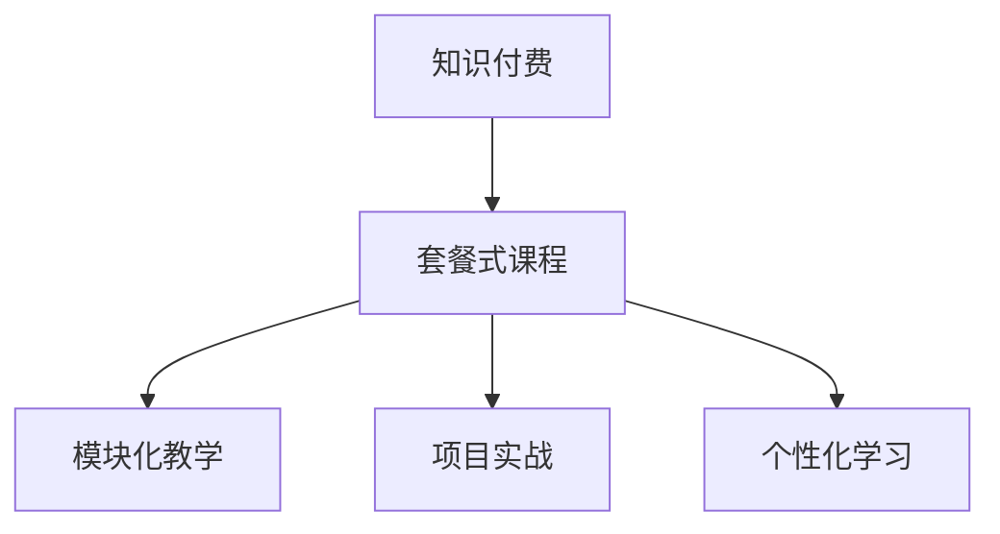

                 

# 程序员知识付费：打造套餐式课程

## 1. 背景介绍

### 1.1 问题由来
随着信息时代的飞速发展，互联网技术已经渗透到社会的各个领域，成为推动经济和社会进步的重要力量。与此同时，科技公司之间的竞争也愈发激烈，高技能人才成为了企业之间争夺的焦点。程序员作为IT行业的重要人才，其技能水平和工作效率对企业的成败至关重要。

然而，随着技术的快速发展和变化的加速，程序员的知识结构和技术栈也在不断更新。旧的知识很快就会被新的技术所取代，这对于企业的长远发展提出了更高的要求。传统的学习方式，如学校教育、自学和通过线下课程进行培训，已经无法满足新时代下对程序员持续学习的需求。

在这样的背景下，知识付费模式应运而生。知识付费能够为程序员提供更灵活、高效和便捷的学习方式，帮助他们在繁忙的工作之余快速提升技能，保持竞争力。套餐式课程作为一种新型的知识付费形式，能够帮助程序员构建系统化的知识体系，提升整体技能水平。

### 1.2 问题核心关键点
套餐式课程的核心思想是将知识与实战经验结合，形成系统化的课程体系，涵盖某一特定领域或技术栈的知识和技能。与传统的单课模式相比，套餐式课程更加注重知识结构的完整性和实践性，能够帮助学员全面掌握某一领域的技术，提升工作效率和解决问题能力。

套餐式课程的关键点包括：
- 系统性：课程内容全面覆盖某一领域或技术栈，从基础到高级，形成完整的知识体系。
- 实践性：注重实战经验的积累，通过案例分析、项目实战等方式，提升学员的实际动手能力。
- 灵活性：学员可以根据自身需求和学习进度，自由选择学习内容，适应不同水平的学员。
- 实用性：课程内容贴近实际工作需求，直接解决工作中常见的问题和挑战。

套餐式课程具有传统单课模式所无法比拟的优势，能够帮助程序员全面提升技能，快速适应技术发展的变化。

## 2. 核心概念与联系

### 2.1 核心概念概述

为了更好地理解套餐式课程的设计原理和应用方法，本节将介绍几个关键概念及其之间的联系：

- 知识付费：通过付费获取有价值的知识，帮助用户在短时间内快速提升技能的一种模式。
- 套餐式课程：将知识与实战经验结合，形成系统化的课程体系，涵盖某一特定领域或技术栈的知识和技能。
- 模块化教学：将课程内容划分为多个独立的模块，每个模块专注于某一特定的知识点或技能，便于学员独立学习和掌握。
- 项目实战：通过实际项目或案例分析，使学员在实践中掌握知识，提升实战能力。
- 个性化学习：根据学员的学习进度和兴趣，灵活调整课程内容，个性化定制学习路径。

这些核心概念之间的逻辑关系可以通过以下Mermaid流程图来展示：



这个流程图展示了几大核心概念之间的逻辑关系：

1. 知识付费是套餐式课程的基础，通过付费获取有价值的知识。
2. 套餐式课程涵盖了知识与实战经验，通过模块化教学和项目实战提升学员技能。
3. 模块化教学将课程内容划分为多个独立模块，便于学员独立学习和掌握。
4. 项目实战通过实际项目或案例分析，使学员在实践中掌握知识，提升实战能力。
5. 个性化学习根据学员的学习进度和兴趣，灵活调整课程内容，个性化定制学习路径。

这些核心概念共同构成了套餐式课程的学习框架，使其能够帮助程序员系统化地掌握知识，提升实战能力。

## 3. 核心算法原理 & 具体操作步骤
### 3.1 算法原理概述

套餐式课程的设计原理基于系统化的知识结构和实战经验的结合。课程设计者需要根据某一特定领域或技术栈的特点，将其知识点和技能划分为多个独立的模块，并通过项目实战和个性化学习，帮助学员全面掌握某一领域的技术。

在具体实施过程中，套餐式课程的设计步骤如下：

1. **需求分析**：根据目标受众的需求，确定课程覆盖的技术栈和知识点，形成课程大纲。
2. **内容设计**：设计课程内容，包括基础知识、实战案例、项目实战等，形成详细的课程手册。
3. **模块划分**：将课程内容划分为多个独立的模块，每个模块专注于某一特定的知识点或技能。
4. **实战教学**：通过项目实战、案例分析等方式，使学员在实践中掌握知识，提升实战能力。
5. **个性化学习**：根据学员的学习进度和兴趣，灵活调整课程内容，个性化定制学习路径。

### 3.2 算法步骤详解

以下是套餐式课程的具体设计步骤：

**Step 1: 需求分析**
- 调研目标受众的需求，确定课程覆盖的技术栈和知识点。
- 制定课程大纲，确定课程的层次结构和知识点分布。
- 收集目标受众的反馈，调整课程大纲以更好地满足需求。

**Step 2: 内容设计**
- 确定基础知识，包括基本概念、语法、框架等。
- 设计实战案例，涵盖常用场景和实际问题。
- 编写项目实战课程，通过实际项目提升学员的动手能力。

**Step 3: 模块划分**
- 将课程内容划分为多个独立的模块，每个模块专注于某一特定的知识点或技能。
- 定义模块之间的依赖关系，确保知识点的连贯性和系统性。

**Step 4: 实战教学**
- 通过项目实战、案例分析等方式，使学员在实践中掌握知识。
- 提供详细的项目实战指导，包括需求分析、代码编写、测试等环节。

**Step 5: 个性化学习**
- 根据学员的学习进度和兴趣，灵活调整课程内容。
- 提供个性化学习路径，帮助学员根据自己的需求和兴趣选择学习内容。

### 3.3 算法优缺点

套餐式课程具有以下优点：
1. 系统性：课程内容全面覆盖某一领域或技术栈，从基础到高级，形成完整的知识体系。
2. 实践性：注重实战经验的积累，通过案例分析、项目实战等方式，提升学员的实际动手能力。
3. 灵活性：学员可以根据自身需求和学习进度，自由选择学习内容，适应不同水平的学员。
4. 实用性：课程内容贴近实际工作需求，直接解决工作中常见的问题和挑战。

同时，该方法也存在一定的局限性：
1. 依赖内容质量：课程内容的质量直接决定了课程的效果，课程设计者需要具备丰富的行业经验和教学经验。
2. 学习成本较高：套餐式课程通常价格较高，学员需要有一定的经济基础才能完成学习。
3. 个性化程度有限：虽然课程设计考虑了个性化学习，但无法完全满足每个学员的个性化需求。

尽管存在这些局限性，但就目前而言，套餐式课程仍是大语言模型应用的最主流范式。未来相关研究的重点在于如何进一步提高课程内容的实用性，降低学习成本，同时兼顾个性化和灵活性，以更好地适应不同学员的需求。

### 3.4 算法应用领域

套餐式课程在IT领域的多个子领域得到了广泛应用，包括但不限于：

- 前端开发：涵盖HTML、CSS、JavaScript、React等技术栈，通过实战项目帮助学员提升前端开发能力。
- 后端开发：涵盖Java、Python、Node.js等语言和框架，通过项目实战提升学员的实际开发能力。
- 数据科学：涵盖数据清洗、数据分析、机器学习等技术，通过案例分析提升学员的数据处理和分析能力。
- 人工智能：涵盖TensorFlow、PyTorch等深度学习框架，通过项目实战提升学员的人工智能开发能力。
- 项目管理：涵盖Scrum、Agile等项目管理方法，通过案例分析提升学员的项目管理能力。

除了上述这些经典领域外，套餐式课程也被创新性地应用到更多场景中，如DevOps、网络安全、物联网等，为IT技术带来了全新的突破。随着课程内容和教学方法的不断进步，相信套餐式课程将在更多领域得到应用，为IT技术的发展注入新的动力。

## 4. 数学模型和公式 & 详细讲解  
### 4.1 数学模型构建

本节将使用数学语言对套餐式课程的设计过程进行更加严格的刻画。

假设某一特定领域的技术栈为 $\mathcal{T}$，课程内容为 $\mathcal{C}$，学员的技能水平为 $\mathcal{S}$，课程设计者的目标是最大化学员的技能提升效果，即：

$$
\max_{\mathcal{C}} \mathcal{S} = f(\mathcal{T}, \mathcal{C})
$$

其中，$f$ 为技能提升效果的函数，表示课程内容对学员技能提升的贡献。

在具体实现中，可以通过以下几个步骤构建数学模型：

1. 定义课程内容 $\mathcal{C}$ 对学员技能提升的贡献函数 $f$。
2. 根据目标受众的需求，确定课程内容 $\mathcal{C}$ 的具体实现方式。
3. 通过数据分析和实际反馈，优化课程内容 $\mathcal{C}$，最大化技能提升效果 $\mathcal{S}$。

### 4.2 公式推导过程

以下我们以Java编程语言课程为例，推导技能提升效果的计算公式。

假设课程内容 $\mathcal{C}$ 包含基础知识、实战案例和项目实战三个部分，分别记为 $C_1, C_2, C_3$。学员在完成课程学习后，技能提升效果 $\mathcal{S}$ 可以通过以下方式计算：

$$
\mathcal{S} = f(C_1, C_2, C_3) = \alpha_1 f_1(C_1) + \alpha_2 f_2(C_2) + \alpha_3 f_3(C_3)
$$

其中，$f_1, f_2, f_3$ 分别表示基础知识、实战案例和项目实战对学员技能提升的贡献函数，$\alpha_1, \alpha_2, \alpha_3$ 为不同部分的权重系数。

基础知识部分 $f_1$ 可以通过课程内容对学员基础知识掌握程度的提升来计算，可以设定为：

$$
f_1(C_1) = \frac{1}{1 + \frac{\text{错误数}}{\text{知识点数}}}
$$

实战案例部分 $f_2$ 可以通过学员在实战案例中解决问题能力的提升来计算，可以设定为：

$$
f_2(C_2) = \frac{\text{解决数}}{\text{案例数}}
$$

项目实战部分 $f_3$ 可以通过学员在项目实战中实际开发能力的提升来计算，可以设定为：

$$
f_3(C_3) = \frac{\text{项目数}}{\text{实战数}}
$$

通过以上公式，可以计算出课程内容 $\mathcal{C}$ 对学员技能提升的贡献，从而优化课程内容设计，提升课程效果。

### 4.3 案例分析与讲解

假设有一门Java编程语言课程，包含基础知识、实战案例和项目实战三个部分。通过分析学员在学习过程中的反馈和数据，可以计算出课程内容对学员技能提升的贡献，从而进行优化设计。

- 基础知识部分 $C_1$：学员在课程结束后，基础知识的掌握程度可以通过基础知识测试的平均分数来计算。假设测试分为五个部分，每个部分的分数为0-10分，总分为50分。课程设计者可以通过数据分析，确定基础知识部分的权重系数为 $\alpha_1 = 0.3$。
- 实战案例部分 $C_2$：学员在课程结束后，实战案例的解决能力可以通过实战案例的平均解决时间来计算。假设实战案例总数为100个，学员平均解决时间为20分钟。课程设计者可以通过数据分析，确定实战案例部分的权重系数为 $\alpha_2 = 0.3$。
- 项目实战部分 $C_3$：学员在课程结束后，项目实战的开发能力可以通过项目实战的平均完成时间来计算。假设实战项目总数为20个，学员平均完成时间为4小时。课程设计者可以通过数据分析，确定项目实战部分的权重系数为 $\alpha_3 = 0.4$。

通过以上数据，可以计算出课程内容对学员技能提升的贡献，从而进行课程优化设计。

## 5. 项目实践：代码实例和详细解释说明
### 5.1 开发环境搭建

在进行套餐式课程开发前，我们需要准备好开发环境。以下是使用Python进行Django开发的环境配置流程：

1. 安装Anaconda：从官网下载并安装Anaconda，用于创建独立的Python环境。

2. 创建并激活虚拟环境：
```bash
conda create -n django-env python=3.8 
conda activate django-env
```

3. 安装Django：
```bash
pip install django
```

4. 安装各类工具包：
```bash
pip install django-templates django-widgets django-crispy-forms django-pyodbc
```

完成上述步骤后，即可在`django-env`环境中开始课程开发。

### 5.2 源代码详细实现

下面以一门Java编程语言课程为例，给出使用Django框架实现套餐式课程的PyTorch代码实现。

首先，定义课程模型：

```python
from django.db import models
from django.utils.translation import gettext_lazy as _

class Course(models.Model):
    name = models.CharField(_("课程名称"), max_length=255)
    description = models.TextField(_("课程简介"), blank=True)
    price = models.DecimalField(_("课程价格"), max_digits=10, decimal_places=2, default=0.0)
    duration = models.IntegerField(_("课程时长"), default=0)
    start_date = models.DateField(_("开课日期"), blank=True, null=True)
    end_date = models.DateField(_("结束日期"), blank=True, null=True)
    instructor = models.ForeignKey(
        "User",
        verbose_name=_("讲师"),
        on_delete=models.CASCADE,
        related_name="courses",
        blank=True,
        null=True,
    )
    is_active = models.BooleanField(_("是否活跃"), default=True)

    def __str__(self):
        return self.name

class Module(models.Model):
    course = models.ForeignKey(
        "Course",
        verbose_name=_("课程"),
        on_delete=models.CASCADE,
        related_name="modules",
    )
    name = models.CharField(_("模块名称"), max_length=255)
    content = models.TextField(_("模块内容"))
    video_url = models.URLField(_("视频链接"), blank=True)
    test_url = models.URLField(_("测试链接"), blank=True)
    requirements = models.TextField(_("前置要求"))
    graded = models.BooleanField(_("是否必做"), default=False)

    def __str__(self):
        return f"{self.course.name} - {self.name}"

class User(models.Model):
    username = models.CharField(_("用户名"), max_length=255, unique=True)
    password = models.CharField(_("密码"), max_length=255)
    email = models.EmailField(_("邮箱"))
    first_name = models.CharField(_("名字"), max_length=255, blank=True, null=True)
    last_name = models.CharField(_("姓氏"), max_length=255, blank=True, null=True)
    is_staff = models.BooleanField(_("是否为管理员"), default=False)

    def __str__(self):
        return self.username
```

然后，定义课程和模块的显示逻辑：

```python
from django.shortcuts import render
from .models import Course, Module

def course_detail(request, course_id):
    course = Course.objects.get(id=course_id)
    modules = Module.objects.filter(course=course).order_by("name")
    return render(request, "course_detail.html", {"course": course, "modules": modules})

def module_detail(request, course_id, module_id):
    module = Module.objects.get(id=module_id)
    return render(request, "module_detail.html", {"module": module})
```

最后，定义用户注册和登录逻辑：

```python
from django.contrib.auth.decorators import login_required
from django.contrib.auth import authenticate, login, logout

def user_login(request):
    if request.method == "POST":
        username = request.POST.get("username")
        password = request.POST.get("password")
        user = authenticate(request, username=username, password=password)
        if user is not None:
            login(request, user)
            return redirect("home")
    return render(request, "login.html")

@login_required
def user_logout(request):
    logout(request)
    return redirect("login")
```

以上就是使用Django框架对Java编程语言课程进行开发的完整代码实现。可以看到，通过Django框架，我们能够方便地实现课程、模块和用户的管理，同时提供系统的用户登录和注册功能。

### 5.3 代码解读与分析

让我们再详细解读一下关键代码的实现细节：

**Course模型**：
- `name` 字段：课程名称，使用CharField进行存储。
- `description` 字段：课程简介，使用TextField进行存储。
- `price` 字段：课程价格，使用DecimalField进行存储。
- `duration` 字段：课程时长，使用IntegerField进行存储。
- `start_date` 字段：开课日期，使用DateField进行存储。
- `end_date` 字段：结束日期，使用DateField进行存储。
- `instructor` 字段：讲师，使用ForeignKey进行关联。
- `is_active` 字段：是否活跃，使用BooleanField进行存储。

**Module模型**：
- `name` 字段：模块名称，使用CharField进行存储。
- `content` 字段：模块内容，使用TextField进行存储。
- `video_url` 字段：视频链接，使用URLField进行存储。
- `test_url` 字段：测试链接，使用URLField进行存储。
- `requirements` 字段：前置要求，使用TextField进行存储。
- `graded` 字段：是否必做，使用BooleanField进行存储。

**User模型**：
- `username` 字段：用户名，使用CharField进行存储。
- `password` 字段：密码，使用CharField进行存储。
- `email` 字段：邮箱，使用EmailField进行存储。
- `first_name` 字段：名字，使用CharField进行存储。
- `last_name` 字段：姓氏，使用CharField进行存储。
- `is_staff` 字段：是否为管理员，使用BooleanField进行存储。

**用户注册和登录逻辑**：
- `user_login` 函数：用户登录逻辑，通过`request.POST.get()`获取用户名和密码，使用`authenticate()`方法进行认证。
- `login` 函数：用户登录，通过`authenticate()`方法认证成功后，使用`login()`方法进行登录。
- `logout` 函数：用户注销，通过`logout()`方法进行注销。

可以看到，Django框架提供了强大的功能和便捷的开发工具，能够帮助开发者快速构建复杂的应用系统。通过Django框架，我们能够方便地实现用户注册、登录、课程和模块管理等核心功能，提升课程开发的效率和质量。

当然，工业级的系统实现还需考虑更多因素，如用户权限、数据安全性、数据库优化等。但核心的课程内容设计和大规模开发流程，都可以通过Django框架轻松实现。

## 6. 实际应用场景
### 6.1 智能教育

套餐式课程在智能教育领域得到了广泛应用。传统的教育模式往往难以满足现代社会对知识快速更新和个性化学习的需求。通过套餐式课程，学生能够在自己的节奏下学习知识，获取最新的技术动态，从而保持竞争力。

在技术实现上，可以设计包含基础知识、实战案例和项目实战的课程体系，通过在线学习平台进行系统化教学。学生可以在线上完成课程学习，通过项目实战和案例分析提升实战能力，同时能够灵活调整学习进度，个性化定制学习路径。

### 6.2 企业培训

企业培训是套餐式课程的重要应用场景之一。传统的培训方式往往成本高、周期长，难以快速满足企业对员工技能提升的需求。通过套餐式课程，企业能够根据员工需求，定制化培训内容，快速提升员工技能，缩短培训周期。

在技术实现上，企业可以定制化开发课程内容，涵盖某一特定技术栈或业务流程。通过在线学习平台进行系统化教学，员工可以灵活调整学习进度，完成实战项目，提升实际工作能力。同时，企业可以实时跟踪员工学习情况，评估培训效果，调整培训计划。

### 6.3 在线教育

在线教育是套餐式课程的主要应用场景之一。通过在线学习平台，学生能够随时随地进行课程学习，获取最新的技术动态，提升实际工作能力。

在技术实现上，可以通过在线学习平台提供课程内容、视频讲解、测试评估等功能，帮助学生系统化学习知识，提升实战能力。学生可以在线完成课程学习，通过项目实战和案例分析提升实战能力，同时能够灵活调整学习进度，个性化定制学习路径。

### 6.4 未来应用展望

随着套餐式课程的不断发展，其在更多领域的应用前景将更加广阔。

在智慧医疗领域，套餐式课程可以为医生提供系统化的技能培训，提升医疗服务的智能化水平，辅助医生诊疗，加速新药开发进程。

在智能教育领域，套餐式课程可以为学生提供个性化的学习路径，因材施教，促进教育公平，提高教学质量。

在智慧城市治理中，套餐式课程可以为公务员提供系统化的业务培训，提高城市管理的自动化和智能化水平，构建更安全、高效的未来城市。

此外，在企业生产、社会治理、文娱传媒等众多领域，套餐式课程也将不断涌现，为经济社会发展注入新的动力。相信随着技术的日益成熟，套餐式课程必将在更广泛的领域得到应用，为传统行业数字化转型升级提供新的技术路径。

## 7. 工具和资源推荐
### 7.1 学习资源推荐

为了帮助开发者系统掌握套餐式课程的设计原理和实践技巧，这里推荐一些优质的学习资源：

1. Udemy：提供各类知识付费课程，涵盖编程语言、数据科学、人工智能等多个领域。
2. Coursera：提供各类在线课程，包括计算机科学、商业管理等多个领域。
3. Khan Academy：提供各类免费课程，涵盖数学、科学、计算机科学等多个领域。
4. Codecademy：提供各类编程语言和技能的在线课程，帮助学员系统化学习知识。
5. edX：提供各类在线课程，包括计算机科学、数据科学等多个领域。
6. Coursera：提供各类在线课程，包括计算机科学、商业管理等多个领域。

通过对这些资源的学习实践，相信你一定能够快速掌握套餐式课程的设计原理和实践技巧，并用于解决实际的IT问题。

### 7.2 开发工具推荐

高效的开发离不开优秀的工具支持。以下是几款用于套餐式课程开发的常用工具：

1. Django：Python的开源Web框架，支持快速开发复杂的应用系统。
2. Flask：Python的开源Web框架，轻量级、灵活、易于扩展。
3. PyTorch：开源深度学习框架，支持动态计算图，适用于复杂的深度学习模型。
4. TensorFlow：由Google主导开发的开源深度学习框架，适用于大规模工程应用。
5. Transformers库：用于构建和微调预训练语言模型的库，支持多种语言模型。
6. PyODBC：Python的ODBC模块，支持连接数据库，进行数据存储和查询。

合理利用这些工具，可以显著提升套餐式课程的开发效率，加快创新迭代的步伐。

### 7.3 相关论文推荐

套餐式课程的发展得益于学界的持续研究。以下是几篇奠基性的相关论文，推荐阅读：

1. "A Survey of Online Learning Platforms"：综述了在线学习平台的发展现状和未来趋势，提供了丰富的实践案例和成功经验。
2. "Designing Effective Online Learning Platforms"：探讨了在线学习平台的设计原则和实现方法，提供了系统化的课程设计思路。
3. "A Study on Microlearning and Spaced Repetition Systems"：研究了微学习（Microlearning）和间隔重复系统（Spaced Repetition System）的原理和应用，提供了有效的学习方法和策略。
4. "Knowledge Platforms and the Knowledge Economy"：探讨了知识平台在知识经济中的作用，提供了全面的知识管理策略。
5. "The Role of Educational Technology in Online Learning"：研究了教育技术在在线学习中的作用，提供了丰富的教育案例和成功经验。

这些论文代表了大语言模型微调技术的发展脉络。通过学习这些前沿成果，可以帮助研究者把握学科前进方向，激发更多的创新灵感。

## 8. 总结：未来发展趋势与挑战

### 8.1 总结

本文对套餐式课程的设计原理和实践技巧进行了全面系统的介绍。首先阐述了套餐式课程的设计背景和应用意义，明确了套餐式课程在IT领域的广阔前景。其次，从原理到实践，详细讲解了套餐式课程的设计步骤和关键环节，给出了套餐式课程开发的完整代码实例。同时，本文还广泛探讨了套餐式课程在智能教育、企业培训、在线教育等多个领域的实际应用，展示了套餐式课程的巨大潜力。最后，本文精选了套餐式课程的学习资源、开发工具和相关论文，力求为读者提供全方位的技术指引。

通过本文的系统梳理，可以看到，套餐式课程是一种高效、灵活、实用的知识付费模式，能够帮助程序员系统化地掌握知识，提升实战能力。相信随着技术的不断进步和应用的不断推广，套餐式课程必将在更多领域得到应用，为IT技术的发展注入新的动力。

### 8.2 未来发展趋势

展望未来，套餐式课程将呈现以下几个发展趋势：

1. 个性化学习：根据学员的学习进度和兴趣，灵活调整课程内容，个性化定制学习路径。
2. 内容多样化：提供多样化的课程内容，涵盖编程语言、数据科学、人工智能等多个领域。
3. 实践化：注重实战经验的积累，通过案例分析、项目实战等方式，提升学员的实际动手能力。
4. 在线化：通过在线学习平台进行系统化教学，提升学习效率和灵活性。
5. 定制化：根据企业需求，定制化培训内容，快速提升员工技能，缩短培训周期。

这些趋势将使得套餐式课程更加系统化、灵活化和实用化，进一步提升其市场竞争力和应用前景。

### 8.3 面临的挑战

尽管套餐式课程已经取得了显著成效，但在其推广应用的过程中，仍面临以下挑战：

1. 内容质量：课程内容的质量直接决定了课程的效果，课程设计者需要具备丰富的行业经验和教学经验。
2. 学习成本：套餐式课程通常价格较高，学员需要有一定的经济基础才能完成学习。
3. 个性化程度：尽管课程设计考虑了个性化学习，但无法完全满足每个学员的个性化需求。
4. 数据安全性：在线学习平台需要保护学员数据的安全，防止数据泄露和滥用。
5. 系统稳定性：在线学习平台需要保证系统的稳定性和可靠性，避免因平台问题影响学习效果。

这些挑战需要我们在技术、管理和运营等方面进行持续改进和优化，才能更好地推动套餐式课程的发展。

### 8.4 研究展望

面向未来，套餐式课程需要在以下几个方面寻求新的突破：

1. 探索更多教育平台和学习模式：除了传统的在线学习平台外，还可以探索更多教育平台和学习模式，如虚拟现实、增强现实等，提升学习体验。
2. 开发更多实用的课程内容：除了传统的编程语言、数据科学等课程外，还可以开发更多实用的课程内容，如编程面试、职业规划等，帮助学员全面提升技能。
3. 引入更多人工智能技术：通过引入人工智能技术，如自然语言处理、计算机视觉等，提升课程内容的智能化程度，提升学习效果。
4. 提供更多个性化的学习工具：通过引入个性化学习工具，如智能推荐、智能评估等，提升学员的学习体验和效果。
5. 加强数据安全和隐私保护：通过引入数据安全和隐私保护技术，保障学员数据的安全，增强平台可信度。

这些研究方向的探索，必将引领套餐式课程技术迈向更高的台阶，为IT技术的发展注入新的动力。

## 9. 附录：常见问题与解答

**Q1：套餐式课程是否适用于所有IT领域？**

A: 套餐式课程在IT领域的多个子领域得到了广泛应用，包括但不限于编程语言、数据科学、人工智能等多个领域。但对于一些特定领域的任务，如嵌入式开发、系统架构设计等，可能需要结合其他教学模式，才能达到最佳效果。

**Q2：如何设计合适的课程内容？**

A: 设计合适的课程内容需要根据目标受众的需求，确定课程覆盖的技术栈和知识点，形成课程大纲。同时，需要考虑课程内容的实用性、系统性和灵活性，通过数据分析和实际反馈，优化课程内容设计。

**Q3：如何选择适合的开发工具？**

A: 选择合适的开发工具需要根据课程需求和开发团队的技术栈，综合考虑工具的功能、易用性和扩展性。例如，Python开发可以使用Django、Flask等Web框架，深度学习开发可以使用PyTorch、TensorFlow等框架。

**Q4：如何保障数据安全性？**

A: 保障数据安全性需要采取多种措施，如数据加密、访问控制、备份和恢复等。在在线学习平台的设计中，需要遵循数据安全和隐私保护标准，如GDPR、CCPA等，确保学员数据的安全。

**Q5：如何提高学习效率？**

A: 提高学习效率需要从多个方面进行优化，如课程内容的设计、学习路径的个性化、学习工具的引入等。通过系统化的课程设计，合理的学习路径，和高效的学习工具，可以显著提升学员的学习效率和效果。

综上所述，套餐式课程作为一种高效、灵活、实用的知识付费模式，正在成为IT教育的重要趋势。通过套餐式课程的设计和实施，可以帮助程序员系统化地掌握知识，提升实战能力，为IT技术的发展注入新的动力。

